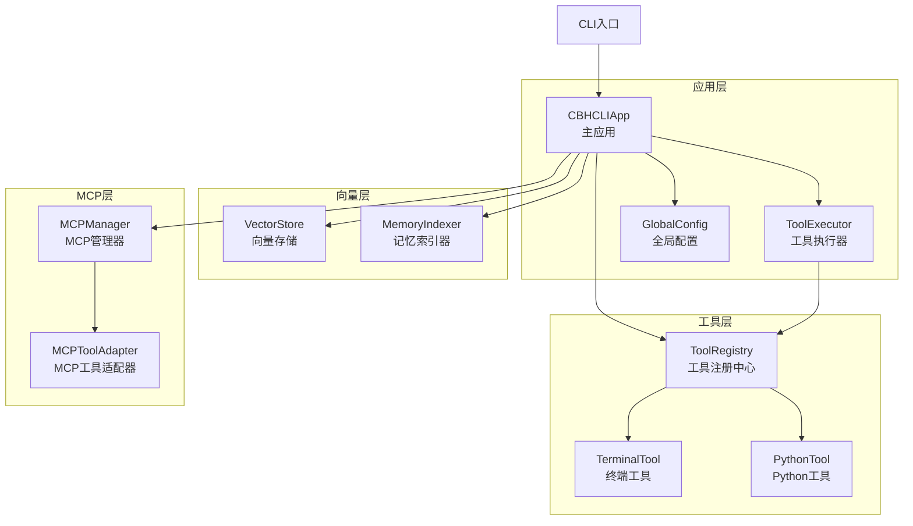
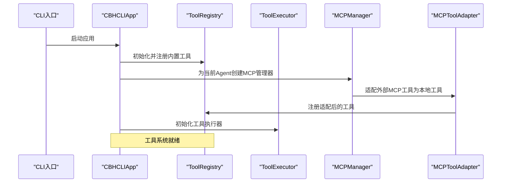
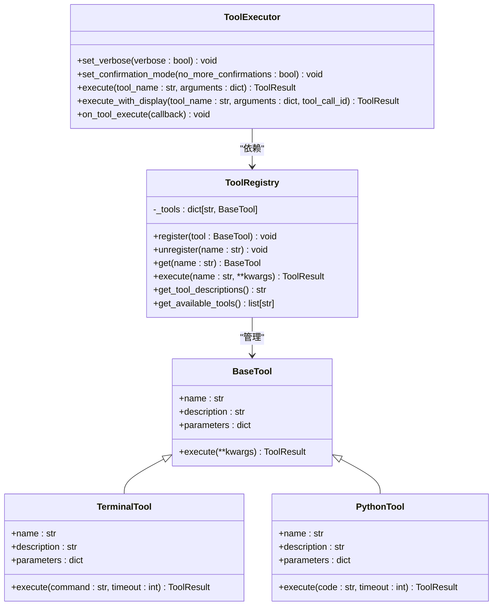
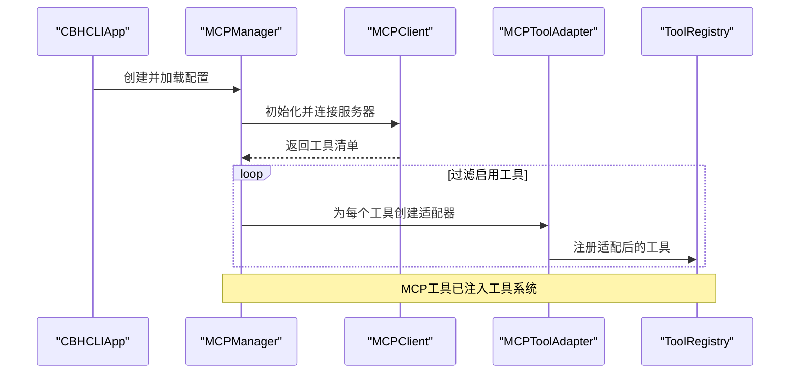
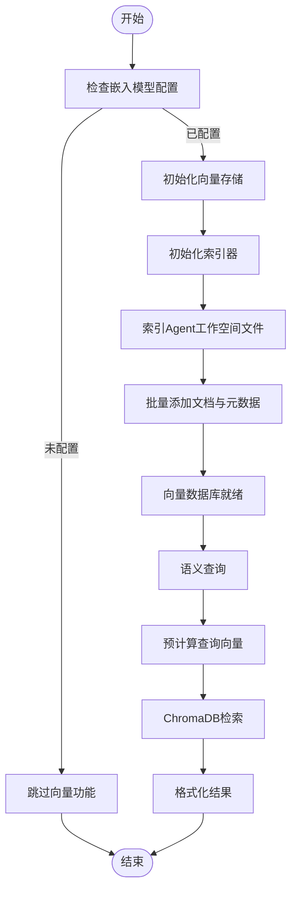
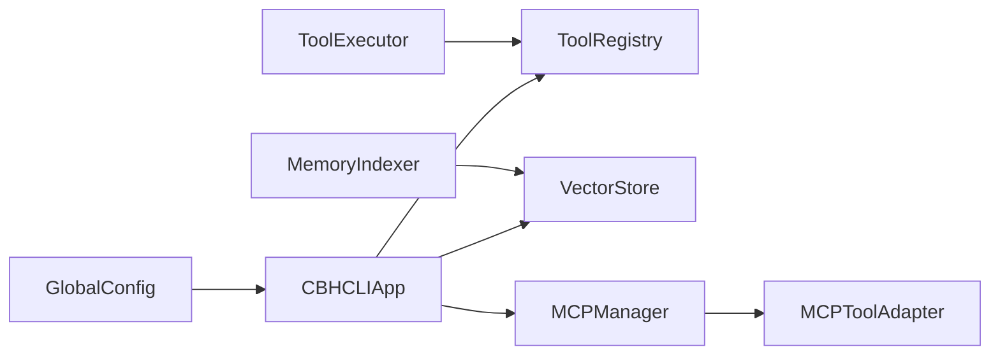

# 扩展点设计

<cite>
**本文引用的文件**
- [cbhcli_pkg/__init__.py](file://cbhcli_pkg/__init__.py)
- [README.md](file://README.md)
- [cbhcli_pkg/cli.py](file://cbhcli_pkg/cli.py)
- [cbhcli_pkg/core/app.py](file://cbhcli_pkg/core/app.py)
- [cbhcli_pkg/config/global_config.py](file://cbhcli_pkg/config/global_config.py)
- [cbhcli_pkg/tools/registry.py](file://cbhcli_pkg/tools/registry.py)
- [cbhcli_pkg/tools/base.py](file://cbhcli_pkg/tools/base.py)
- [cbhcli_pkg/core/tool_executor.py](file://cbhcli_pkg/core/tool_executor.py)
- [cbhcli_pkg/tools/terminal.py](file://cbhcli_pkg/tools/terminal.py)
- [cbhcli_pkg/tools/python_tool.py](file://cbhcli_pkg/tools/python_tool.py)
- [cbhcli_pkg/core/mcp_manager.py](file://cbhcli_pkg/core/mcp_manager.py)
- [cbhcli_pkg/core/mcp_tool_adapter.py](file://cbhcli_pkg/core/mcp_tool_adapter.py)
- [cbhcli_pkg/vector/store.py](file://cbhcli_pkg/vector/store.py)
- [cbhcli_pkg/vector/indexer.py](file://cbhcli_pkg/vector/indexer.py)
</cite>

## 目录
1. [简介](#简介)
2. [项目结构](#项目结构)
3. [核心组件](#核心组件)
4. [架构总览](#架构总览)
5. [详细组件分析](#详细组件分析)
6. [依赖分析](#依赖分析)
7. [性能考量](#性能考量)
8. [故障排查指南](#故障排查指南)
9. [结论](#结论)
10. [附录](#附录)

## 简介
本文件面向CBHCLI的扩展开发者，系统性阐述其可扩展性设计，包括插件化架构、配置扩展、接口扩展、工具系统扩展机制、MCP管理器集成能力、向量数据库扩展性以及安全与性能注意事项。文档同时提供扩展开发指南、最佳实践、常见陷阱与实际扩展案例的实现路径指引。

## 项目结构
CBHCLI采用分层模块化组织，核心围绕“应用层-工具层-向量层-MCP层-配置层”展开，便于按需扩展与替换。

**图示来源**
- [cbhcli_pkg/cli.py:73-112](file://cbhcli_pkg/cli.py#L73-L112)
- [cbhcli_pkg/core/app.py:54-478](file://cbhcli_pkg/core/app.py#L54-L478)
- [cbhcli_pkg/tools/registry.py:51-115](file://cbhcli_pkg/tools/registry.py#L51-L115)
- [cbhcli_pkg/tools/terminal.py:7-99](file://cbhcli_pkg/tools/terminal.py#L7-L99)
- [cbhcli_pkg/tools/python_tool.py:127-207](file://cbhcli_pkg/tools/python_tool.py#L127-L207)
- [cbhcli_pkg/vector/store.py:37-175](file://cbhcli_pkg/vector/store.py#L37-L175)
- [cbhcli_pkg/vector/indexer.py:7-178](file://cbhcli_pkg/vector/indexer.py#L7-L178)
- [cbhcli_pkg/core/mcp_manager.py:11-366](file://cbhcli_pkg/core/mcp_manager.py#L11-L366)
- [cbhcli_pkg/core/mcp_tool_adapter.py:7-116](file://cbhcli_pkg/core/mcp_tool_adapter.py#L7-L116)

**章节来源**
- [README.md:269-295](file://README.md#L269-L295)
- [cbhcli_pkg/core/app.py:85-150](file://cbhcli_pkg/core/app.py#L85-L150)

## 核心组件
- 工具注册中心：统一管理工具的注册、查找、执行与描述聚合，提供工具扩展的统一入口。
- 工具执行器：负责工具调用前确认、执行、结果格式化与回调，屏蔽工具差异。
- 向量存储与索引器：封装ChromaDB，支持自定义嵌入模型API，提供语义检索与索引能力。
- MCP管理器与适配器：将外部MCP服务器工具桥接为本地工具，实现与外部工具/服务的无缝集成。
- 全局配置：集中管理模型、嵌入模型、重排序模型、Agent与设置，支撑运行时动态扩展。

**章节来源**
- [cbhcli_pkg/tools/registry.py:51-115](file://cbhcli_pkg/tools/registry.py#L51-L115)
- [cbhcli_pkg/core/tool_executor.py:15-168](file://cbhcli_pkg/core/tool_executor.py#L15-L168)
- [cbhcli_pkg/vector/store.py:37-175](file://cbhcli_pkg/vector/store.py#L37-L175)
- [cbhcli_pkg/vector/indexer.py:7-178](file://cbhcli_pkg/vector/indexer.py#L7-L178)
- [cbhcli_pkg/core/mcp_manager.py:11-366](file://cbhcli_pkg/core/mcp_manager.py#L11-L366)
- [cbhcli_pkg/core/mcp_tool_adapter.py:7-116](file://cbhcli_pkg/core/mcp_tool_adapter.py#L7-L116)
- [cbhcli_pkg/config/global_config.py:13-154](file://cbhcli_pkg/config/global_config.py#L13-L154)

## 架构总览
CBHCLI通过“应用层编排+工具层扩展+向量层检索+MCP桥接”的架构实现高度可扩展。应用层在启动时初始化工具注册中心、向量存储、MCP管理器与命令系统；工具层通过注册中心统一暴露工具；向量层在配置嵌入模型后按需启用；MCP层将外部工具无缝注入为本地工具。

**图示来源**
- [cbhcli_pkg/cli.py:73-112](file://cbhcli_pkg/cli.py#L73-L112)
- [cbhcli_pkg/core/app.py:85-150](file://cbhcli_pkg/core/app.py#L85-L150)
- [cbhcli_pkg/core/mcp_manager.py:268-326](file://cbhcli_pkg/core/mcp_manager.py#L268-L326)
- [cbhcli_pkg/core/mcp_tool_adapter.py:7-116](file://cbhcli_pkg/core/mcp_tool_adapter.py#L7-L116)

## 详细组件分析

### 工具系统扩展机制
- 接口规范：实现BaseTool抽象类，提供name/description/parameters/execute方法，遵循JSON Schema定义参数。
- 注册方式：通过ToolRegistry.register将工具加入全局工具集，工具名称唯一，冲突时需自定义命名策略。
- 执行流程：ToolExecutor负责调用前确认、执行与结果格式化，支持回调钩子与详细/简洁模式切换。
- 内置工具示例：终端工具与Python工具展示了参数校验、超时控制、输出截断与错误封装的最佳实践。

**图示来源**
- [cbhcli_pkg/tools/registry.py:16-115](file://cbhcli_pkg/tools/registry.py#L16-L115)
- [cbhcli_pkg/core/tool_executor.py:15-168](file://cbhcli_pkg/core/tool_executor.py#L15-L168)
- [cbhcli_pkg/tools/terminal.py:7-99](file://cbhcli_pkg/tools/terminal.py#L7-L99)
- [cbhcli_pkg/tools/python_tool.py:127-207](file://cbhcli_pkg/tools/python_tool.py#L127-L207)

**章节来源**
- [cbhcli_pkg/tools/registry.py:51-115](file://cbhcli_pkg/tools/registry.py#L51-L115)
- [cbhcli_pkg/core/tool_executor.py:42-91](file://cbhcli_pkg/core/tool_executor.py#L42-L91)
- [cbhcli_pkg/tools/terminal.py:31-99](file://cbhcli_pkg/tools/terminal.py#L31-L99)
- [cbhcli_pkg/tools/python_tool.py:170-207](file://cbhcli_pkg/tools/python_tool.py#L170-L207)

### MCP管理器集成能力
- 独立Agent管理：每个Agent拥有独立的MCP配置文件与连接，避免跨Agent污染。
- 服务器管理：支持添加/移除/列出MCP服务器，自动连接并注册工具；支持启用/禁用特定工具。
- 工具适配：MCPToolAdapter将外部工具包装为本地BaseTool，统一参数Schema与执行结果格式。
- 配置持久化：配置文件位于Agent工作空间，支持热更新与重连。

**图示来源**
- [cbhcli_pkg/core/mcp_manager.py:41-326](file://cbhcli_pkg/core/mcp_manager.py#L41-L326)
- [cbhcli_pkg/core/mcp_tool_adapter.py:13-116](file://cbhcli_pkg/core/mcp_tool_adapter.py#L13-L116)

**章节来源**
- [cbhcli_pkg/core/mcp_manager.py:18-366](file://cbhcli_pkg/core/mcp_manager.py#L18-L366)
- [cbhcli_pkg/core/mcp_tool_adapter.py:7-116](file://cbhcli_pkg/core/mcp_tool_adapter.py#L7-L116)

### 向量数据库扩展性设计
- 存储封装：VectorStore封装ChromaDB，支持自定义嵌入模型API，通过APIEmbeddingFunction桥接。
- 索引策略：MemoryIndexer负责Agent工作空间文件的索引，支持增量更新与集合清理。
- 检索流程：预计算查询向量，避免默认模型调用，提升性能与一致性。
- 可扩展点：可通过替换嵌入客户端实现不同向量存储后端；通过调整索引策略支持更多文件类型。

**图示来源**
- [cbhcli_pkg/core/app.py:97-150](file://cbhcli_pkg/core/app.py#L97-L150)
- [cbhcli_pkg/vector/store.py:37-175](file://cbhcli_pkg/vector/store.py#L37-L175)
- [cbhcli_pkg/vector/indexer.py:37-134](file://cbhcli_pkg/vector/indexer.py#L37-L134)

**章节来源**
- [cbhcli_pkg/vector/store.py:37-175](file://cbhcli_pkg/vector/store.py#L37-L175)
- [cbhcli_pkg/vector/indexer.py:7-178](file://cbhcli_pkg/vector/indexer.py#L7-L178)
- [cbhcli_pkg/core/app.py:97-150](file://cbhcli_pkg/core/app.py#L97-L150)

### 配置扩展与接口扩展
- 全局配置：集中管理模型、嵌入模型、重排序模型、Agent与设置，支持运行时更新与持久化。
- 接口扩展：通过实现BaseTool与MCPToolAdapter，即可将任意内部或外部能力接入工具系统。
- 命令扩展：通过命令解析器注册新的斜杠命令，实现功能入口扩展。

**章节来源**
- [cbhcli_pkg/config/global_config.py:13-154](file://cbhcli_pkg/config/global_config.py#L13-L154)
- [cbhcli_pkg/core/app.py:151-179](file://cbhcli_pkg/core/app.py#L151-L179)

## 依赖分析
- 组件耦合：工具系统通过ToolRegistry解耦，ToolExecutor仅依赖注册中心；向量层与MCP层均通过配置与注册注入应用层。
- 外部依赖：ChromaDB（可选）、嵌入与重排序API（可选），通过配置开关控制启用。
- 循环依赖：未发现循环依赖，模块职责清晰。

**图示来源**
- [cbhcli_pkg/core/app.py:85-150](file://cbhcli_pkg/core/app.py#L85-L150)
- [cbhcli_pkg/tools/registry.py:51-115](file://cbhcli_pkg/tools/registry.py#L51-L115)
- [cbhcli_pkg/core/mcp_manager.py:11-366](file://cbhcli_pkg/core/mcp_manager.py#L11-L366)
- [cbhcli_pkg/core/mcp_tool_adapter.py:7-116](file://cbhcli_pkg/core/mcp_tool_adapter.py#L7-L116)
- [cbhcli_pkg/vector/store.py:37-175](file://cbhcli_pkg/vector/store.py#L37-L175)
- [cbhcli_pkg/vector/indexer.py:7-178](file://cbhcli_pkg/vector/indexer.py#L7-L178)
- [cbhcli_pkg/config/global_config.py:13-154](file://cbhcli_pkg/config/global_config.py#L13-L154)

**章节来源**
- [cbhcli_pkg/core/app.py:85-150](file://cbhcli_pkg/core/app.py#L85-L150)

## 性能考量
- 工具执行：ToolExecutor对输出进行截断与预览，避免大输出影响交互体验；支持超时控制与确认模式减少误执行。
- 向量检索：预计算嵌入向量，避免默认模型调用；合理设置top_k与元数据过滤，降低I/O与网络开销。
- MCP连接：批量注册工具、延迟初始化客户端、失败不阻塞启动，提升可用性与稳定性。
- 上下文压缩：自动压缩阈值与比率可配置，平衡性能与上下文质量。

[本节为通用指导，无需具体文件分析]

## 故障排查指南
- 工具执行失败：检查ToolResult中的错误信息，定位参数校验、权限或超时问题。
- 向量功能不可用：确认嵌入模型配置与ChromaDB安装；检查索引状态与集合是否存在。
- MCP连接失败：检查服务器URL、认证头与启用工具列表；查看连接日志与工具注册状态。
- 配置异常：核对~/.cbhcli/config.json格式与字段；必要时回滚默认配置。

**章节来源**
- [cbhcli_pkg/core/tool_executor.py:142-159](file://cbhcli_pkg/core/tool_executor.py#L142-L159)
- [cbhcli_pkg/vector/store.py:48-77](file://cbhcli_pkg/vector/store.py#L48-L77)
- [cbhcli_pkg/core/mcp_manager.py:314-315](file://cbhcli_pkg/core/mcp_manager.py#L314-L315)
- [cbhcli_pkg/config/global_config.py:20-48](file://cbhcli_pkg/config/global_config.py#L20-L48)

## 结论
CBHCLI通过清晰的抽象层与注册机制实现了强可扩展性：工具系统以BaseTool为核心接口，MCP层以适配器为桥梁，向量层以嵌入客户端为扩展点，配置层统一治理。开发者可按需扩展工具、外部服务与存储后端，在保证安全性与性能的前提下增强系统能力。

[本节为总结，无需具体文件分析]

## 附录

### 扩展开发指南
- 接口规范
  - 实现BaseTool，提供稳定的name/description/parameters/execute签名。
  - 参数Schema遵循JSON Schema，确保系统提示与参数校验一致。
- 最佳实践
  - 在execute中进行参数校验与超时控制，捕获异常并返回ToolResult。
  - 输出截断与摘要策略，避免大文本影响用户体验。
  - 为复杂工具提供简短预览与详细模式切换。
- 常见陷阱
  - 工具名称冲突：使用命名空间或前缀避免与内置工具冲突。
  - MCP工具Schema缺失：确保inputSchema完整，否则可能导致参数传递失败。
  - 向量索引遗漏：更新文件后需重新索引，避免检索结果陈旧。
  - 配置未持久化：修改配置后及时保存，避免重启丢失。

**章节来源**
- [cbhcli_pkg/tools/registry.py:16-48](file://cbhcli_pkg/tools/registry.py#L16-L48)
- [cbhcli_pkg/core/tool_executor.py:93-160](file://cbhcli_pkg/core/tool_executor.py#L93-L160)
- [cbhcli_pkg/core/mcp_tool_adapter.py:24-42](file://cbhcli_pkg/core/mcp_tool_adapter.py#L24-L42)
- [cbhcli_pkg/vector/indexer.py:48-69](file://cbhcli_pkg/vector/indexer.py#L48-L69)
- [cbhcli_pkg/config/global_config.py:50-54](file://cbhcli_pkg/config/global_config.py#L50-L54)

### 实际扩展案例与实现路径
- 注册自定义工具
  - 步骤：实现BaseTool → 在应用初始化阶段通过ToolRegistry.register注册 → 使用工具执行器执行。
  - 参考路径：[工具注册中心:57-69](file://cbhcli_pkg/tools/registry.py#L57-L69)，[应用初始化工具注册:85-96](file://cbhcli_pkg/core/app.py#L85-L96)。
- 扩展现有功能
  - 通过继承现有工具类（如TerminalTool）或新增参数Schema扩展行为。
  - 参考路径：[终端工具实现:31-99](file://cbhcli_pkg/tools/terminal.py#L31-L99)，[Python工具实现:170-207](file://cbhcli_pkg/tools/python_tool.py#L170-L207)。
- 集成MCP外部工具
  - 步骤：配置MCP服务器 → 管理器自动连接并注册 → 通过工具名称调用。
  - 参考路径：[MCP管理器:69-98](file://cbhcli_pkg/core/mcp_manager.py#L69-L98)，[MCP适配器:44-115](file://cbhcli_pkg/core/mcp_tool_adapter.py#L44-L115)。
- 向量数据库扩展
  - 步骤：配置嵌入模型 → 初始化VectorStore → 使用MemoryIndexer索引 → 语义查询。
  - 参考路径：[向量存储:37-98](file://cbhcli_pkg/vector/store.py#L37-98)，[记忆索引器:37-134](file://cbhcli_pkg/vector/indexer.py#L37-134)。

**章节来源**
- [cbhcli_pkg/tools/registry.py:57-69](file://cbhcli_pkg/tools/registry.py#L57-L69)
- [cbhcli_pkg/core/app.py:85-96](file://cbhcli_pkg/core/app.py#L85-L96)
- [cbhcli_pkg/core/mcp_manager.py:69-98](file://cbhcli_pkg/core/mcp_manager.py#L69-L98)
- [cbhcli_pkg/core/mcp_tool_adapter.py:44-115](file://cbhcli_pkg/core/mcp_tool_adapter.py#L44-L115)
- [cbhcli_pkg/vector/store.py:37-98](file://cbhcli_pkg/vector/store.py#L37-L98)
- [cbhcli_pkg/vector/indexer.py#L37-134:37-134](file://cbhcli_pkg/vector/indexer.py#L37-L134)