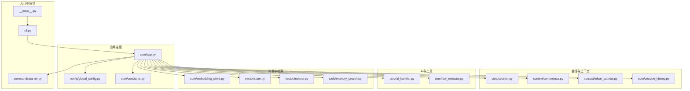
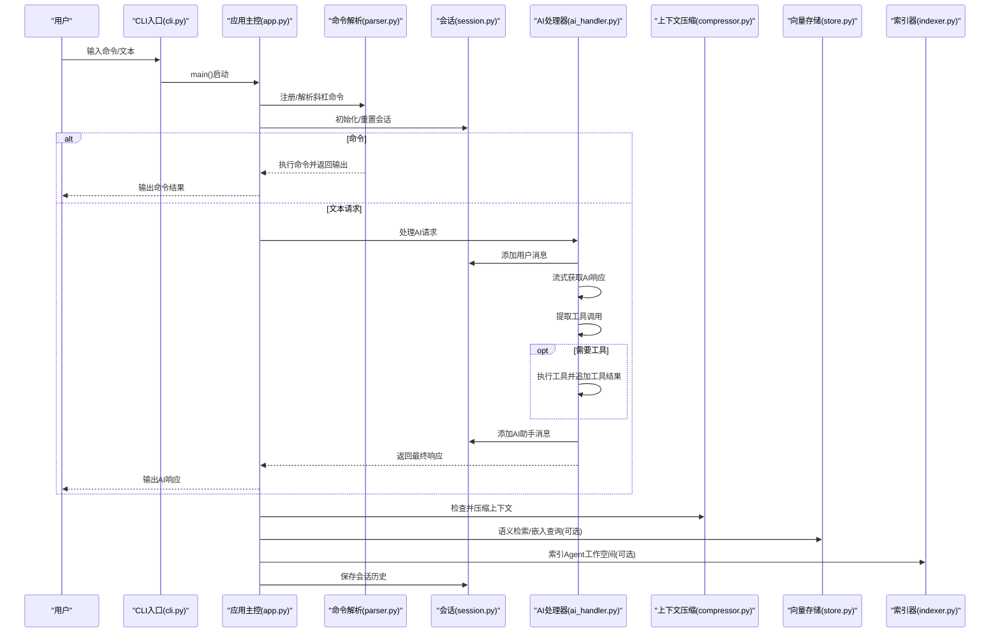
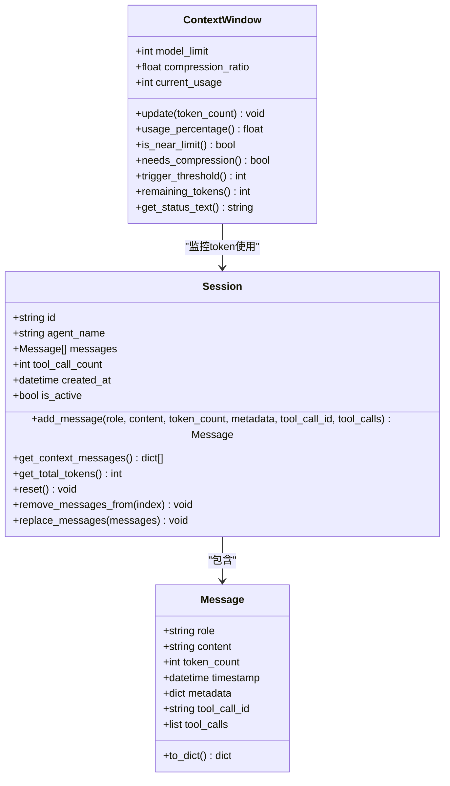
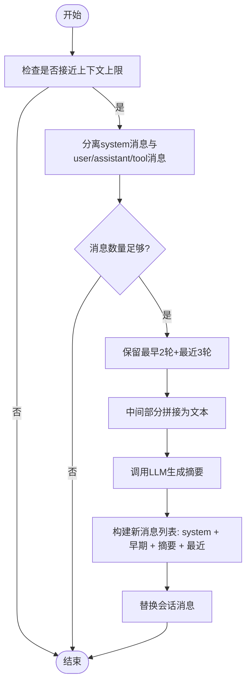
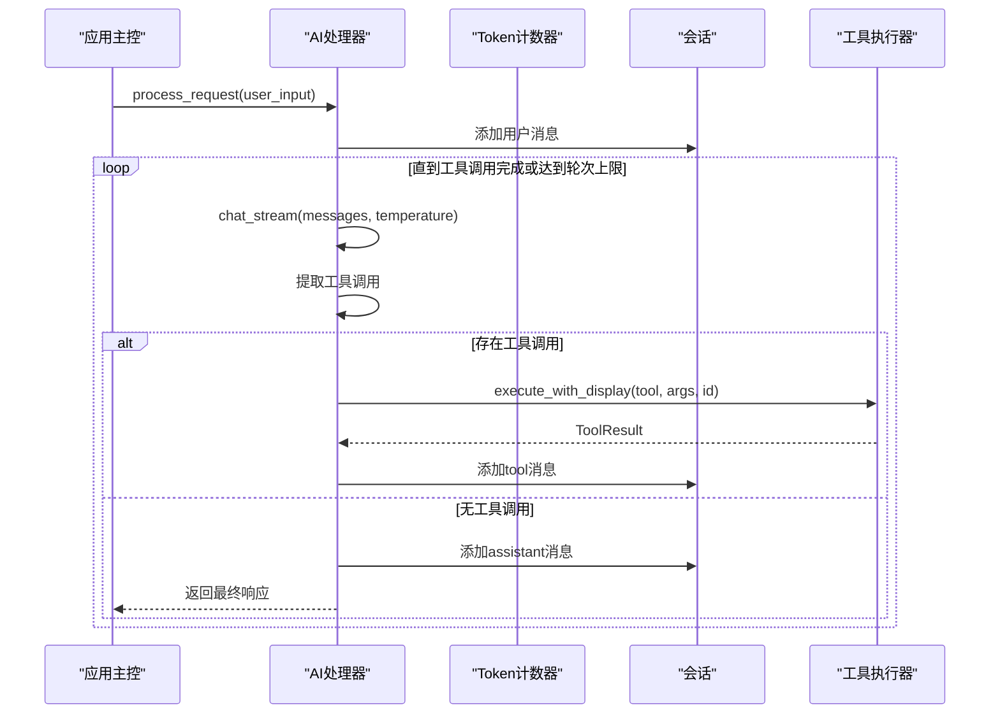
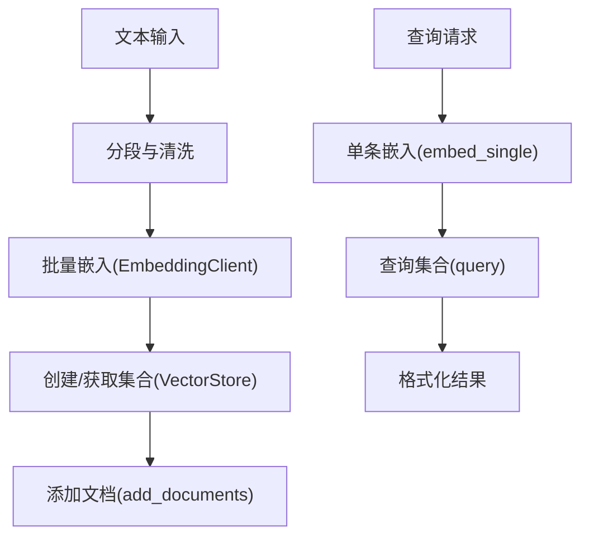
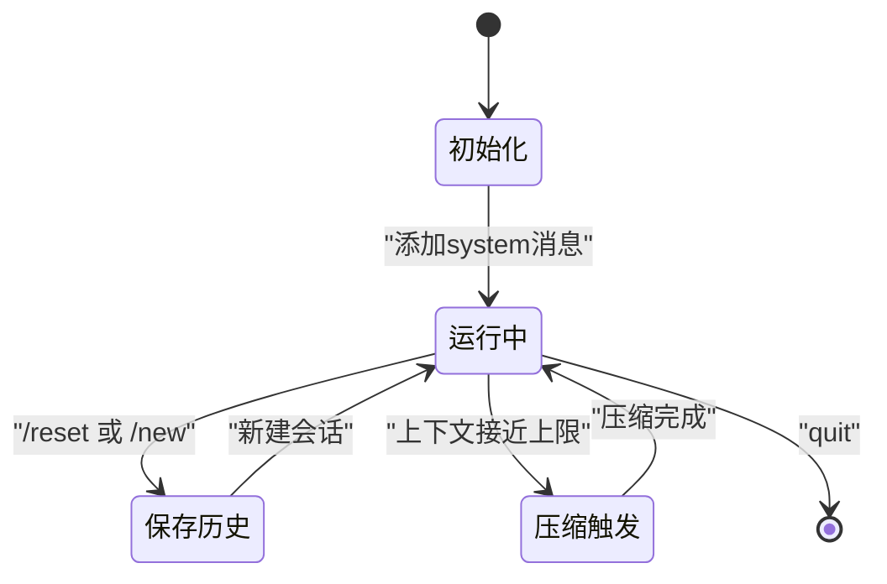
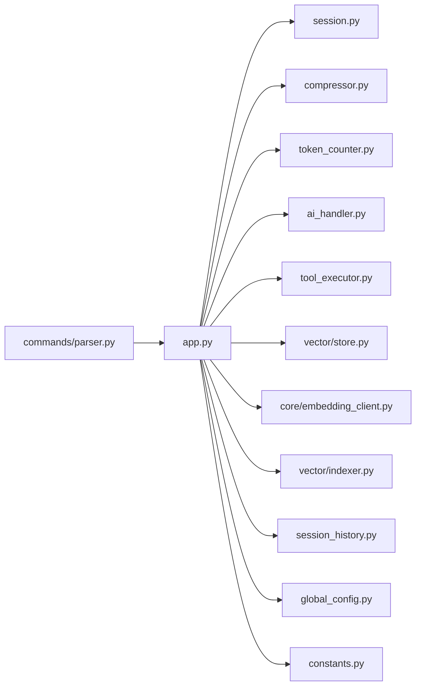

# 数据流设计

<cite>
**本文引用的文件**
- [cbhcli_pkg/__main__.py](file://cbhcli_pkg/__main__.py)
- [cbhcli_pkg/cli.py](file://cbhcli_pkg/cli.py)
- [cbhcli_pkg/core/app.py](file://cbhcli_pkg/core/app.py)
- [cbhcli_pkg/core/session.py](file://cbhcli_pkg/core/session.py)
- [cbhcli_pkg/context/compressor.py](file://cbhcli_pkg/context/compressor.py)
- [cbhcli_pkg/context/token_counter.py](file://cbhcli_pkg/context/token_counter.py)
- [cbhcli_pkg/core/ai_handler.py](file://cbhcli_pkg/core/ai_handler.py)
- [cbhcli_pkg/core/tool_executor.py](file://cbhcli_pkg/core/tool_executor.py)
- [cbhcli_pkg/vector/store.py](file://cbhcli_pkg/vector/store.py)
- [cbhcli_pkg/vector/indexer.py](file://cbhcli_pkg/vector/indexer.py)
- [cbhcli_pkg/core/embedding_client.py](file://cbhcli_pkg/core/embedding_client.py)
- [cbhcli_pkg/tools/memory_search.py](file://cbhcli_pkg/tools/memory_search.py)
- [cbhcli_pkg/core/session_history.py](file://cbhcli_pkg/core/session_history.py)
- [cbhcli_pkg/config/global_config.py](file://cbhcli_pkg/config/global_config.py)
- [cbhcli_pkg/core/constants.py](file://cbhcli_pkg/core/constants.py)
- [cbhcli_pkg/commands/parser.py](file://cbhcli_pkg/commands/parser.py)
</cite>

## 目录
1. [简介](#简介)
2. [项目结构](#项目结构)
3. [核心组件](#核心组件)
4. [架构总览](#架构总览)
5. [详细组件分析](#详细组件分析)
6. [依赖关系分析](#依赖关系分析)
7. [性能考量](#性能考量)
8. [故障排查指南](#故障排查指南)
9. [结论](#结论)
10. [附录](#附录)

## 简介
本文件系统化梳理 CBHCLI 的数据流设计，覆盖从用户输入到最终输出的完整路径，包括消息传递、状态管理、上下文维护与压缩、会话生命周期、向量检索与索引、以及缓存与性能优化策略。文档旨在帮助开发者与使用者全面理解数据在系统中的流转方式，并提供可视化图示与实操建议。

## 项目结构
CBHCLI 采用模块化分层组织：命令入口与参数解析、应用主控、会话与上下文、AI 处理与工具执行、向量检索与索引、配置与常量等。整体结构清晰，职责边界明确，便于扩展与维护。

**图表来源**
- [cbhcli_pkg/__main__.py:1-7](file://cbhcli_pkg/__main__.py#L1-L7)
- [cbhcli_pkg/cli.py:73-112](file://cbhcli_pkg/cli.py#L73-L112)
- [cbhcli_pkg/core/app.py:54-478](file://cbhcli_pkg/core/app.py#L54-L478)
- [cbhcli_pkg/commands/parser.py:16-94](file://cbhcli_pkg/commands/parser.py#L16-L94)
- [cbhcli_pkg/core/session.py:8-190](file://cbhcli_pkg/core/session.py#L8-L190)
- [cbhcli_pkg/context/compressor.py:7-112](file://cbhcli_pkg/context/compressor.py#L7-L112)
- [cbhcli_pkg/context/token_counter.py:14-88](file://cbhcli_pkg/context/token_counter.py#L14-L88)
- [cbhcli_pkg/core/session_history.py:8-136](file://cbhcli_pkg/core/session_history.py#L8-L136)
- [cbhcli_pkg/core/ai_handler.py:21-743](file://cbhcli_pkg/core/ai_handler.py#L21-L743)
- [cbhcli_pkg/core/tool_executor.py:15-168](file://cbhcli_pkg/core/tool_executor.py#L15-L168)
- [cbhcli_pkg/core/embedding_client.py:6-132](file://cbhcli_pkg/core/embedding_client.py#L6-L132)
- [cbhcli_pkg/vector/store.py:37-175](file://cbhcli_pkg/vector/store.py#L37-L175)
- [cbhcli_pkg/vector/indexer.py:7-178](file://cbhcli_pkg/vector/indexer.py#L7-L178)
- [cbhcli_pkg/tools/memory_search.py:6-177](file://cbhcli_pkg/tools/memory_search.py#L6-L177)
- [cbhcli_pkg/config/global_config.py:13-154](file://cbhcli_pkg/config/global_config.py#L13-L154)
- [cbhcli_pkg/core/constants.py:1-50](file://cbhcli_pkg/core/constants.py#L1-L50)

**章节来源**
- [cbhcli_pkg/__main__.py:1-7](file://cbhcli_pkg/__main__.py#L1-L7)
- [cbhcli_pkg/cli.py:73-112](file://cbhcli_pkg/cli.py#L73-L112)
- [cbhcli_pkg/core/app.py:54-478](file://cbhcli_pkg/core/app.py#L54-L478)

## 核心组件
- 应用主控（CBHCLIApp）：负责初始化配置、Agent/会话/工具/向量/命令系统，维护运行循环与上下文压缩。
- 会话与上下文（Session/ContextWindow）：管理消息、token统计与上下文窗口阈值与压缩触发。
- AI处理器（AIHandler）：负责流式输出、工具调用提取与执行、多轮工具调用协调。
- 工具执行器（ToolExecutor）：工具调用确认、执行与结果展示。
- 向量系统（EmbeddingClient/VectorStore/MemoryIndexer）：嵌入生成、向量存储与检索、工作空间索引。
- 配置与常量（GlobalConfig/Constants）：全局配置、默认上下文限制与温度等常量。

**章节来源**
- [cbhcli_pkg/core/app.py:54-478](file://cbhcli_pkg/core/app.py#L54-L478)
- [cbhcli_pkg/core/session.py:8-190](file://cbhcli_pkg/core/session.py#L8-L190)
- [cbhcli_pkg/context/compressor.py:7-112](file://cbhcli_pkg/context/compressor.py#L7-L112)
- [cbhcli_pkg/core/ai_handler.py:21-743](file://cbhcli_pkg/core/ai_handler.py#L21-L743)
- [cbhcli_pkg/core/tool_executor.py:15-168](file://cbhcli_pkg/core/tool_executor.py#L15-L168)
- [cbhcli_pkg/core/embedding_client.py:6-132](file://cbhcli_pkg/core/embedding_client.py#L6-L132)
- [cbhcli_pkg/vector/store.py:37-175](file://cbhcli_pkg/vector/store.py#L37-L175)
- [cbhcli_pkg/vector/indexer.py:7-178](file://cbhcli_pkg/vector/indexer.py#L7-L178)
- [cbhcli_pkg/config/global_config.py:13-154](file://cbhcli_pkg/config/global_config.py#L13-L154)
- [cbhcli_pkg/core/constants.py:1-50](file://cbhcli_pkg/core/constants.py#L1-L50)

## 架构总览
CBHCLI 的数据流从 CLI 入口进入，经由应用主控解析命令与用户输入，构建会话消息，调用 AI 处理器进行推理与工具调用，必要时触发上下文压缩与向量检索，最后将结果输出至终端并持久化会话历史。

**图表来源**
- [cbhcli_pkg/cli.py:73-112](file://cbhcli_pkg/cli.py#L73-L112)
- [cbhcli_pkg/core/app.py:386-478](file://cbhcli_pkg/core/app.py#L386-L478)
- [cbhcli_pkg/commands/parser.py:51-94](file://cbhcli_pkg/commands/parser.py#L51-L94)
- [cbhcli_pkg/core/ai_handler.py:51-216](file://cbhcli_pkg/core/ai_handler.py#L51-L216)
- [cbhcli_pkg/context/compressor.py:21-81](file://cbhcli_pkg/context/compressor.py#L21-L81)
- [cbhcli_pkg/vector/store.py:128-160](file://cbhcli_pkg/vector/store.py#L128-L160)
- [cbhcli_pkg/vector/indexer.py:37-69](file://cbhcli_pkg/vector/indexer.py#L37-L69)
- [cbhcli_pkg/core/session_history.py:24-64](file://cbhcli_pkg/core/session_history.py#L24-L64)

## 详细组件分析

### 会话与上下文窗口
- 消息结构（Message）：统一承载 role/content/token_count/timestamp/metadata/tool_call_id/tool_calls，支持转为API消息格式。
- 会话（Session）：维护消息列表、工具调用计数、创建时间；提供上下文消息导出、总token统计、重置与替换消息等能力。
- 上下文窗口（ContextWindow）：基于模型上下文限制与压缩阈值比例，动态更新使用量、判断是否接近/需要压缩、计算剩余token与状态文本。

**图表来源**
- [cbhcli_pkg/core/session.py:8-190](file://cbhcli_pkg/core/session.py#L8-L190)

**章节来源**
- [cbhcli_pkg/core/session.py:8-190](file://cbhcli_pkg/core/session.py#L8-L190)
- [cbhcli_pkg/core/constants.py:6-8](file://cbhcli_pkg/core/constants.py#L6-L8)

### 上下文压缩算法
- 触发条件：当上下文使用量达到阈值比例（默认80%）时触发压缩。
- 压缩策略：保留最早2轮与最近3轮对话，中间部分生成摘要并替换为一条“历史对话摘要”消息，从而显著降低token占用。
- 摘要生成：通过专用系统提示与低温度（temperature）调用LLM生成摘要，失败时回退为部分原文。

**图表来源**
- [cbhcli_pkg/context/compressor.py:21-81](file://cbhcli_pkg/context/compressor.py#L21-L81)
- [cbhcli_pkg/core/app.py:361-385](file://cbhcli_pkg/core/app.py#L361-L385)

**章节来源**
- [cbhcli_pkg/context/compressor.py:7-112](file://cbhcli_pkg/context/compressor.py#L7-L112)
- [cbhcli_pkg/core/app.py:361-385](file://cbhcli_pkg/core/app.py#L361-L385)

### AI请求处理与工具调用
- 流式输出：逐块接收推理结果，区分“思考（reasoning）”、“工具调用（tool_calls）”与“内容（content）”，并增量清理与展示。
- 工具调用提取：支持多种格式（DSML标签、Python函数调用、JSON格式、纯文本命令），并进行严格验证与去重。
- 工具执行：执行前确认、执行与结果展示，将工具输出作为“tool”消息加入会话，供后续轮次使用。

**图表来源**
- [cbhcli_pkg/core/ai_handler.py:51-216](file://cbhcli_pkg/core/ai_handler.py#L51-L216)
- [cbhcli_pkg/core/ai_handler.py:664-735](file://cbhcli_pkg/core/ai_handler.py#L664-L735)
- [cbhcli_pkg/core/tool_executor.py:54-91](file://cbhcli_pkg/core/tool_executor.py#L54-L91)
- [cbhcli_pkg/context/token_counter.py:34-48](file://cbhcli_pkg/context/token_counter.py#L34-L48)

**章节来源**
- [cbhcli_pkg/core/ai_handler.py:21-743](file://cbhcli_pkg/core/ai_handler.py#L21-L743)
- [cbhcli_pkg/core/tool_executor.py:15-168](file://cbhcli_pkg/core/tool_executor.py#L15-L168)
- [cbhcli_pkg/context/token_counter.py:14-88](file://cbhcli_pkg/context/token_counter.py#L14-L88)

### 向量数据处理链路
- 嵌入客户端（EmbeddingClient）：支持OpenAI兼容与自定义API，提供批量嵌入与单条嵌入接口。
- 向量存储（VectorStore）：封装ChromaDB，使用自定义嵌入函数，支持集合创建、文档添加、查询与计数。
- 索引器（MemoryIndexer）：扫描Agent工作空间标准文件与知识库目录，按段落切分并索引，支持删除旧集合与增量更新。
- 记忆搜索工具（MemorySearchTool）：优先使用向量检索，失败时降级为memory.md关键词匹配。

**图表来源**
- [cbhcli_pkg/core/embedding_client.py:34-132](file://cbhcli_pkg/core/embedding_client.py#L34-L132)
- [cbhcli_pkg/vector/store.py:99-160](file://cbhcli_pkg/vector/store.py#L99-L160)
- [cbhcli_pkg/vector/indexer.py:87-134](file://cbhcli_pkg/vector/indexer.py#L87-L134)
- [cbhcli_pkg/tools/memory_search.py:47-103](file://cbhcli_pkg/tools/memory_search.py#L47-L103)

**章节来源**
- [cbhcli_pkg/core/embedding_client.py:6-132](file://cbhcli_pkg/core/embedding_client.py#L6-L132)
- [cbhcli_pkg/vector/store.py:37-175](file://cbhcli_pkg/vector/store.py#L37-L175)
- [cbhcli_pkg/vector/indexer.py:7-178](file://cbhcli_pkg/vector/indexer.py#L7-L178)
- [cbhcli_pkg/tools/memory_search.py:6-177](file://cbhcli_pkg/tools/memory_search.py#L6-L177)

### 会话生命周期管理
- 创建：首次加载Agent时初始化会话与系统提示，包含工具描述、Agent名称、模型名称与memory.md内容。
- 存储：每次重置/新建会话时，将上下文消息保存为历史文件，文件名包含时间戳与会话ID，便于后续恢复。
- 清理：重置会话时保留system消息，清空其余对话；工具执行后将工具输出作为tool消息加入，供后续轮次参考。

**图表来源**
- [cbhcli_pkg/core/app.py:281-331](file://cbhcli_pkg/core/app.py#L281-L331)
- [cbhcli_pkg/core/session_history.py:24-64](file://cbhcli_pkg/core/session_history.py#L24-L64)
- [cbhcli_pkg/core/app.py:361-385](file://cbhcli_pkg/core/app.py#L361-L385)

**章节来源**
- [cbhcli_pkg/core/app.py:281-331](file://cbhcli_pkg/core/app.py#L281-L331)
- [cbhcli_pkg/core/session_history.py:8-136](file://cbhcli_pkg/core/session_history.py#L8-L136)

## 依赖关系分析
- 组件耦合：应用主控聚合各子系统，AI处理器依赖会话与工具执行器，上下文压缩依赖LLM与Token计数器，向量系统依赖嵌入客户端与存储。
- 外部依赖：ChromaDB（向量存储）、requests（嵌入API）、tiktoken（token计数，可选）。
- 命令系统：斜杠命令解析器集中注册与执行，支持帮助命令与错误处理。

**图表来源**
- [cbhcli_pkg/core/app.py:54-478](file://cbhcli_pkg/core/app.py#L54-L478)
- [cbhcli_pkg/commands/parser.py:16-94](file://cbhcli_pkg/commands/parser.py#L16-L94)

**章节来源**
- [cbhcli_pkg/core/app.py:54-478](file://cbhcli_pkg/core/app.py#L54-L478)
- [cbhcli_pkg/commands/parser.py:16-94](file://cbhcli_pkg/commands/parser.py#L16-L94)

## 性能考量
- Token估算与计数：优先使用tiktoken精确计数，降级为字符估算，减少API调用与内存占用。
- 批量嵌入：嵌入客户端按批次处理文本，降低网络往返与服务端压力。
- 上下文压缩：在接近上限前主动压缩，避免超出模型限制导致失败。
- 工具执行控制：限制每轮工具调用次数与输出长度，避免长输出拖慢交互。
- 向量查询优化：预计算查询向量，避免重复嵌入；集合按Agent隔离，减少无关扫描。

**章节来源**
- [cbhcli_pkg/context/token_counter.py:14-88](file://cbhcli_pkg/context/token_counter.py#L14-L88)
- [cbhcli_pkg/core/embedding_client.py:49-113](file://cbhcli_pkg/core/embedding_client.py#L49-L113)
- [cbhcli_pkg/core/constants.py:13-22](file://cbhcli_pkg/core/constants.py#L13-L22)
- [cbhcli_pkg/core/app.py:361-385](file://cbhcli_pkg/core/app.py#L361-L385)

## 故障排查指南
- 命令执行失败：检查命令解析器返回的错误信息，确认命令名称与参数格式。
- 模型未配置：当Agent未配置模型时，应用主控会提示使用“/model”命令配置。
- 嵌入模型初始化失败：检查配置项（name、apiKey、url、model、type），确认网络连通与权限。
- 向量存储初始化失败：确认ChromaDB安装与嵌入客户端可用，或启用内置模型。
- 索引失败：检查工作空间路径与文件权限，确保知识库目录存在且可读。
- 会话保存异常：确认Agent工作空间目录可写，history文件夹存在。

**章节来源**
- [cbhcli_pkg/commands/parser.py:61-77](file://cbhcli_pkg/commands/parser.py#L61-L77)
- [cbhcli_pkg/core/app.py:104-149](file://cbhcli_pkg/core/app.py#L104-L149)
- [cbhcli_pkg/core/session_history.py:24-64](file://cbhcli_pkg/core/session_history.py#L24-L64)

## 结论
CBHCLI 的数据流设计围绕“会话—上下文—AI—工具—向量”的闭环展开，通过严格的上下文管理与压缩策略、多格式工具调用提取与执行、以及可选的向量检索与索引，实现了高效、可控且可扩展的AI增强终端助手。配合合理的性能优化与完善的故障排查机制，系统能够在复杂任务场景中保持稳定与流畅。

## 附录
- 常用命令与用途概览（来自CLI帮助信息）：Agent管理、模型配置、会话管理、知识库管理、向量索引、MCP管理、工具与快捷键等。
- 默认上下文限制与压缩阈值：默认模型上下文限制与默认压缩阈值可在常量文件中查看与调整。

**章节来源**
- [cbhcli_pkg/cli.py:17-71](file://cbhcli_pkg/cli.py#L17-L71)
- [cbhcli_pkg/core/constants.py:6-8](file://cbhcli_pkg/core/constants.py#L6-L8)