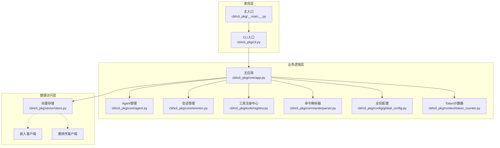
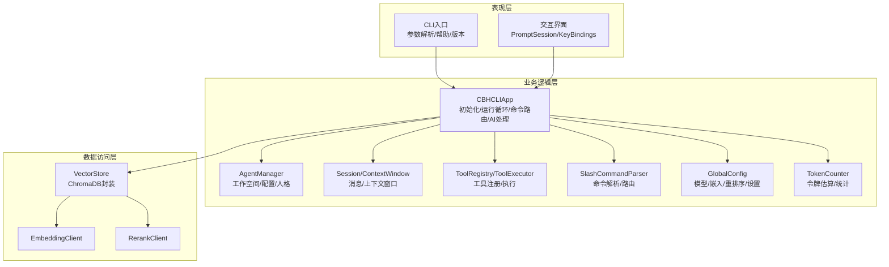
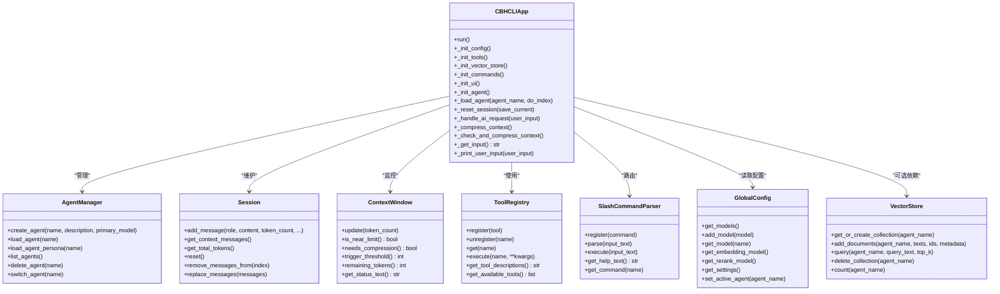
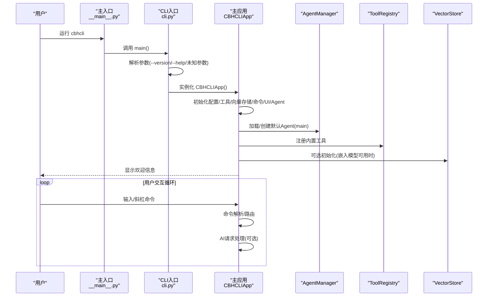
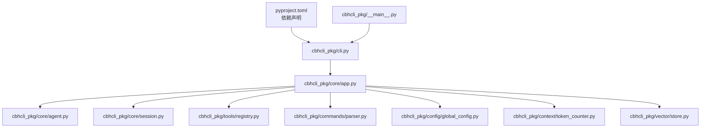

# 整体架构设计

<cite>
**本文引用的文件**
- [cbhcli_pkg/__main__.py](file://cbhcli_pkg/__main__.py)
- [cbhcli_pkg/cli.py](file://cbhcli_pkg/cli.py)
- [cbhcli_pkg/core/app.py](file://cbhcli_pkg/core/app.py)
- [cbhcli_pkg/core/__init__.py](file://cbhcli_pkg/core/__init__.py)
- [cbhcli_pkg/config/global_config.py](file://cbhcli_pkg/config/global_config.py)
- [cbhcli_pkg/tools/registry.py](file://cbhcli_pkg/tools/registry.py)
- [cbhcli_pkg/vector/store.py](file://cbhcli_pkg/vector/store.py)
- [cbhcli_pkg/core/agent.py](file://cbhcli_pkg/core/agent.py)
- [cbhcli_pkg/core/session.py](file://cbhcli_pkg/core/session.py)
- [cbhcli_pkg/commands/parser.py](file://cbhcli_pkg/commands/parser.py)
- [cbhcli_pkg/context/token_counter.py](file://cbhcli_pkg/context/token_counter.py)
- [README.md](file://README.md)
- [pyproject.toml](file://pyproject.toml)
</cite>

## 目录
1. [简介](#简介)
2. [项目结构](#项目结构)
3. [核心组件](#核心组件)
4. [架构总览](#架构总览)
5. [详细组件分析](#详细组件分析)
6. [依赖分析](#依赖分析)
7. [性能考虑](#性能考虑)
8. [故障排查指南](#故障排查指南)
9. [结论](#结论)
10. [附录](#附录)

## 简介
本文件面向CBHCLI的整体架构设计，围绕分层架构模式（表现层、业务逻辑层、数据访问层）进行系统化阐述。重点说明CBHCLIApp作为主控制器的职责边界与控制流，模块化组织原则与模块间依赖关系，以及从命令行入口到完整应用初始化的启动流程。同时给出架构图与序列图，解释设计决策的技术背景与带来的收益。

## 项目结构
CBHCLI采用“包内分层 + 功能域模块化”的组织方式：
- 表现层：CLI入口与交互界面，负责参数解析、用户输入输出与命令路由
- 业务逻辑层：核心应用与领域模型，负责Agent管理、会话管理、工具执行、AI请求处理等
- 数据访问层：配置持久化、向量存储、嵌入与重排序客户端等
- 工具与命令：统一工具注册中心与斜杠命令解析器，支撑可扩展的功能点

**图表来源**
- [cbhcli_pkg/__main__.py:1-7](file://cbhcli_pkg/__main__.py#L1-L7)
- [cbhcli_pkg/cli.py:73-112](file://cbhcli_pkg/cli.py#L73-L112)
- [cbhcli_pkg/core/app.py:54-72](file://cbhcli_pkg/core/app.py#L54-L72)
- [cbhcli_pkg/core/agent.py:572-584](file://cbhcli_pkg/core/agent.py#L572-L584)
- [cbhcli_pkg/core/session.py:37-53](file://cbhcli_pkg/core/session.py#L37-L53)
- [cbhcli_pkg/tools/registry.py:51-69](file://cbhcli_pkg/tools/registry.py#L51-L69)
- [cbhcli_pkg/commands/parser.py:16-25](file://cbhcli_pkg/commands/parser.py#L16-L25)
- [cbhcli_pkg/config/global_config.py:13-20](file://cbhcli_pkg/config/global_config.py#L13-L20)
- [cbhcli_pkg/context/token_counter.py:14-26](file://cbhcli_pkg/context/token_counter.py#L14-L26)
- [cbhcli_pkg/vector/store.py:37-47](file://cbhcli_pkg/vector/store.py#L37-L47)

**章节来源**
- [README.md:269-295](file://README.md#L269-L295)
- [pyproject.toml:44-45](file://pyproject.toml#L44-L45)

## 核心组件
- CLI入口与参数解析：负责版本/帮助输出、未知参数处理，并在无参数时启动主应用
- 主应用CBHCLIApp：应用生命周期管理、组件初始化、用户交互循环、命令路由与AI请求处理
- Agent管理：Agent工作空间、配置、人格模板与加载
- 会话管理：消息结构、上下文窗口、令牌统计与压缩策略
- 工具系统：工具注册中心、工具接口与执行器
- 命令系统：斜杠命令解析与路由
- 配置系统：全局配置文件、模型与嵌入/重排序配置
- 向量存储：ChromaDB封装、自定义嵌入函数与查询

**章节来源**
- [cbhcli_pkg/cli.py:73-112](file://cbhcli_pkg/cli.py#L73-L112)
- [cbhcli_pkg/core/app.py:54-72](file://cbhcli_pkg/core/app.py#L54-L72)
- [cbhcli_pkg/core/agent.py:572-584](file://cbhcli_pkg/core/agent.py#L572-L584)
- [cbhcli_pkg/core/session.py:37-53](file://cbhcli_pkg/core/session.py#L37-L53)
- [cbhcli_pkg/tools/registry.py:51-69](file://cbhcli_pkg/tools/registry.py#L51-L69)
- [cbhcli_pkg/commands/parser.py:16-25](file://cbhcli_pkg/commands/parser.py#L16-L25)
- [cbhcli_pkg/config/global_config.py:13-20](file://cbhcli_pkg/config/global_config.py#L13-L20)
- [cbhcli_pkg/vector/store.py:37-47](file://cbhcli_pkg/vector/store.py#L37-L47)

## 架构总览
CBHCLI采用清晰的三层架构与模块化设计：
- 表现层：CLI负责命令行交互与参数解析，调用主应用进入业务逻辑层
- 业务逻辑层：CBHCLIApp集中协调Agent、会话、工具、命令、配置与上下文管理
- 数据访问层：配置文件、向量数据库与外部嵌入/重排序服务

**图表来源**
- [cbhcli_pkg/cli.py:73-112](file://cbhcli_pkg/cli.py#L73-L112)
- [cbhcli_pkg/core/app.py:54-72](file://cbhcli_pkg/core/app.py#L54-L72)
- [cbhcli_pkg/core/agent.py:572-584](file://cbhcli_pkg/core/agent.py#L572-L584)
- [cbhcli_pkg/core/session.py:37-53](file://cbhcli_pkg/core/session.py#L37-L53)
- [cbhcli_pkg/tools/registry.py:51-69](file://cbhcli_pkg/tools/registry.py#L51-L69)
- [cbhcli_pkg/commands/parser.py:16-25](file://cbhcli_pkg/commands/parser.py#L16-L25)
- [cbhcli_pkg/config/global_config.py:13-20](file://cbhcli_pkg/config/global_config.py#L13-L20)
- [cbhcli_pkg/context/token_counter.py:14-26](file://cbhcli_pkg/context/token_counter.py#L14-L26)
- [cbhcli_pkg/vector/store.py:37-47](file://cbhcli_pkg/vector/store.py#L37-L47)

## 详细组件分析

### CBHCLIApp：主控制器
CBHCLIApp是应用的核心控制器，承担初始化、组件协调与用户交互循环：
- 初始化阶段：配置、工具、向量存储、命令、UI、Agent加载
- 运行阶段：欢迎信息、输入循环、命令执行、AI请求处理、上下文压缩
- 关键职责：Agent切换与会话重置、上下文窗口监控与压缩、工具执行与回调

**图表来源**
- [cbhcli_pkg/core/app.py:54-72](file://cbhcli_pkg/core/app.py#L54-L72)
- [cbhcli_pkg/core/agent.py:572-584](file://cbhcli_pkg/core/agent.py#L572-L584)
- [cbhcli_pkg/core/session.py:37-53](file://cbhcli_pkg/core/session.py#L37-L53)
- [cbhcli_pkg/tools/registry.py:51-69](file://cbhcli_pkg/tools/registry.py#L51-L69)
- [cbhcli_pkg/commands/parser.py:16-25](file://cbhcli_pkg/commands/parser.py#L16-L25)
- [cbhcli_pkg/config/global_config.py:13-20](file://cbhcli_pkg/config/global_config.py#L13-L20)
- [cbhcli_pkg/vector/store.py:37-47](file://cbhcli_pkg/vector/store.py#L37-L47)

**章节来源**
- [cbhcli_pkg/core/app.py:54-478](file://cbhcli_pkg/core/app.py#L54-L478)

### 启动流程：从命令行入口到应用初始化
CBHCLI的启动流程遵循“入口脚本 → CLI参数解析 → 主应用初始化 → 交互循环”的顺序，确保最小化耦合与清晰职责：

**图表来源**
- [cbhcli_pkg/__main__.py:1-7](file://cbhcli_pkg/__main__.py#L1-L7)
- [cbhcli_pkg/cli.py:73-112](file://cbhcli_pkg/cli.py#L73-L112)
- [cbhcli_pkg/core/app.py:64-72](file://cbhcli_pkg/core/app.py#L64-L72)
- [cbhcli_pkg/core/app.py:204-230](file://cbhcli_pkg/core/app.py#L204-L230)
- [cbhcli_pkg/core/app.py:85-96](file://cbhcli_pkg/core/app.py#L85-L96)
- [cbhcli_pkg/core/app.py:97-150](file://cbhcli_pkg/core/app.py#L97-L150)

**章节来源**
- [cbhcli_pkg/__main__.py:1-7](file://cbhcli_pkg/__main__.py#L1-L7)
- [cbhcli_pkg/cli.py:73-112](file://cbhcli_pkg/cli.py#L73-L112)
- [cbhcli_pkg/core/app.py:64-150](file://cbhcli_pkg/core/app.py#L64-L150)

### 模块化组织原则与职责划分
- 分层清晰：表现层仅负责输入输出与路由；业务层集中处理领域逻辑；数据层封装持久化与外部服务
- 职责单一：AgentManager专注Agent生命周期；Session/ContextWindow专注上下文；ToolRegistry专注工具注册与执行；VectorStore专注向量检索
- 可插拔：命令系统与工具系统通过注册机制扩展；向量存储按需初始化
- 配置驱动：全局配置统一管理模型、嵌入/重排序与设置项

**章节来源**
- [cbhcli_pkg/core/__init__.py:21-59](file://cbhcli_pkg/core/__init__.py#L21-L59)
- [cbhcli_pkg/tools/registry.py:51-69](file://cbhcli_pkg/tools/registry.py#L51-L69)
- [cbhcli_pkg/commands/parser.py:16-25](file://cbhcli_pkg/commands/parser.py#L16-L25)
- [cbhcli_pkg/config/global_config.py:13-20](file://cbhcli_pkg/config/global_config.py#L13-L20)

### 设计决策与技术背景
- 选择分层架构的原因
  - 易于维护与测试：关注点分离，便于单元测试与集成测试
  - 可扩展性强：新增功能通过注册或命令扩展，不影响既有模块
  - 可观测性：日志与状态输出集中在表现层，业务逻辑保持纯净
- 选择模块化组织的原因
  - 功能域清晰：Agent、会话、工具、命令、向量各自独立，降低耦合
  - 可选依赖：向量存储与精确Token计数作为可选依赖，满足不同部署场景
- 选择CBHCLIApp作为主控制器的原因
  - 控制反转：集中初始化与生命周期管理，避免分散初始化导致的资源泄漏
  - 交互编排：统一处理命令与AI请求，简化上层调用复杂度

**章节来源**
- [README.md:269-295](file://README.md#L269-L295)
- [pyproject.toml:32-42](file://pyproject.toml#L32-L42)

## 依赖分析
- 外部依赖：requests、prompt_toolkit、可选chromadb与tiktoken
- 内部依赖：CLI依赖主应用；主应用依赖Agent、会话、工具、命令、配置、上下文与向量存储
- 可选依赖：向量存储与嵌入/重排序客户端仅在配置存在时初始化

**图表来源**
- [pyproject.toml:26-30](file://pyproject.toml#L26-L30)
- [pyproject.toml:32-42](file://pyproject.toml#L32-L42)
- [cbhcli_pkg/__main__.py:1-7](file://cbhcli_pkg/__main__.py#L1-L7)
- [cbhcli_pkg/cli.py:73-112](file://cbhcli_pkg/cli.py#L73-L112)
- [cbhcli_pkg/core/app.py:54-72](file://cbhcli_pkg/core/app.py#L54-L72)

**章节来源**
- [pyproject.toml:26-42](file://pyproject.toml#L26-L42)
- [cbhcli_pkg/core/app.py:54-72](file://cbhcli_pkg/core/app.py#L54-L72)

## 性能考虑
- Token计数：优先使用tiktoken进行精确计数，降级为估算策略，平衡准确性与性能
- 上下文压缩：基于阈值比例自动触发压缩，减少长会话的API成本
- 向量检索：预计算嵌入向量，避免ChromaDB默认模型调用，默认禁用遥测
- 工具执行：工具注册中心统一执行与异常包装，避免重复初始化

**章节来源**
- [cbhcli_pkg/context/token_counter.py:14-59](file://cbhcli_pkg/context/token_counter.py#L14-L59)
- [cbhcli_pkg/core/session.py:127-190](file://cbhcli_pkg/core/session.py#L127-L190)
- [cbhcli_pkg/vector/store.py:64-78](file://cbhcli_pkg/vector/store.py#L64-L78)
- [cbhcli_pkg/tools/registry.py:70-97](file://cbhcli_pkg/tools/registry.py#L70-L97)

## 故障排查指南
- 常见问题
  - 未配置模型：提示当前Agent未配置模型，使用斜杠命令配置
  - 未知命令：命令解析器返回未知命令并提示帮助
  - 向量存储初始化失败：嵌入/重排序模型配置错误或依赖缺失
  - 中断与异常：捕获键盘中断与通用异常，优雅退出或继续循环
- 排查要点
  - 检查全局配置文件与模型/嵌入/重排序配置
  - 确认可选依赖安装（chromadb、tiktoken）
  - 使用上下文状态查看与手动压缩命令

**章节来源**
- [cbhcli_pkg/core/app.py:414-421](file://cbhcli_pkg/core/app.py#L414-L421)
- [cbhcli_pkg/commands/parser.py:68-78](file://cbhcli_pkg/commands/parser.py#L68-L78)
- [cbhcli_pkg/core/app.py:104-119](file://cbhcli_pkg/core/app.py#L104-L119)

## 结论
CBHCLI通过分层架构与模块化设计实现了清晰的职责边界与良好的可扩展性。CBHCLIApp作为主控制器，统一协调Agent、会话、工具、命令与配置，结合可选的向量存储能力，为用户提供从命令行到智能代理的完整体验。该架构在可维护性、可测试性与可演进性方面具备显著优势。

## 附录
- 项目结构概览与模块职责可参考README中的项目结构章节
- 可选依赖与构建脚本可在pyproject.toml中查看

**章节来源**
- [README.md:269-295](file://README.md#L269-L295)
- [pyproject.toml:44-45](file://pyproject.toml#L44-L45)