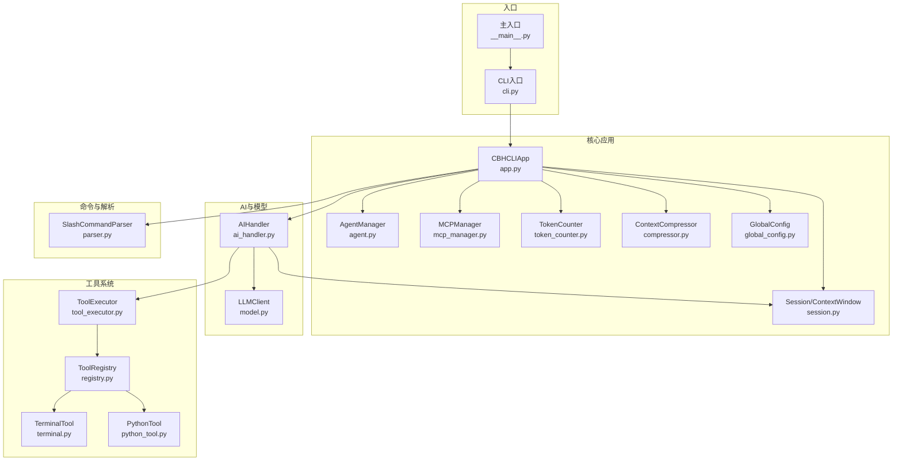
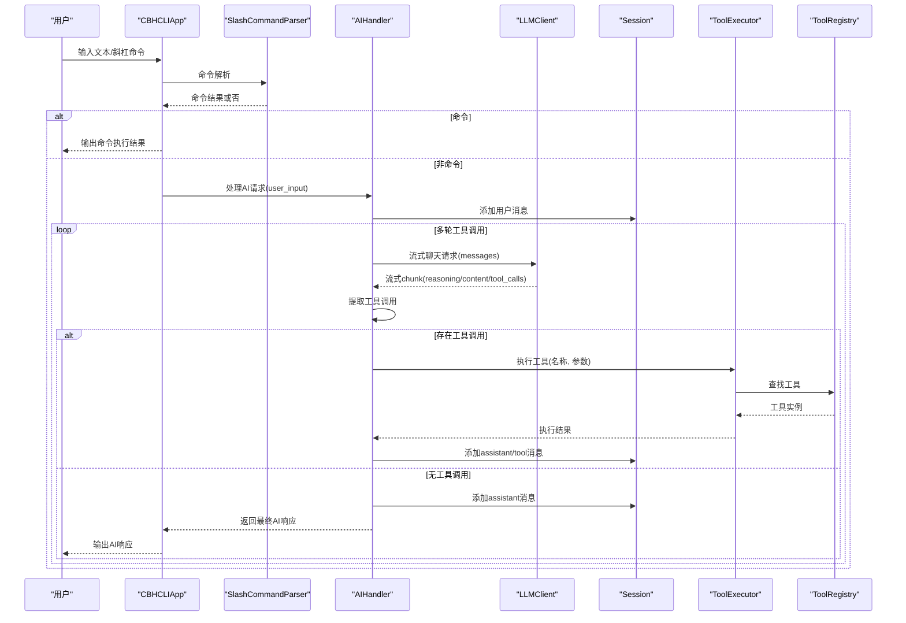
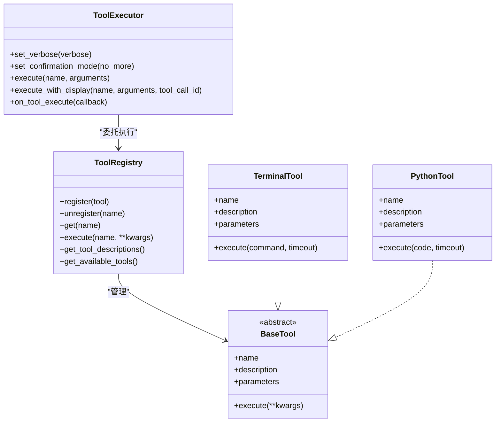
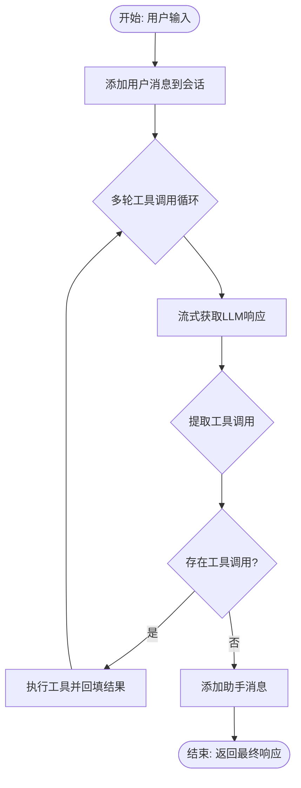
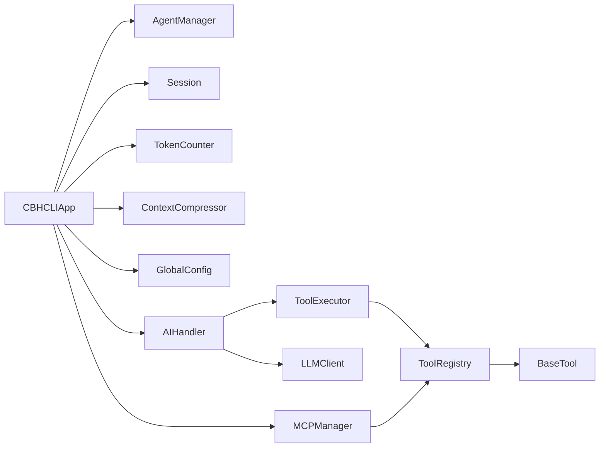

# 组件交互机制

<cite>
**本文引用的文件**
- [app.py](file://cbhcli_pkg/core/app.py)
- [tool_executor.py](file://cbhcli_pkg/core/tool_executor.py)
- [session.py](file://cbhcli_pkg/core/session.py)
- [registry.py](file://cbhcli_pkg/tools/registry.py)
- [ai_handler.py](file://cbhcli_pkg/core/ai_handler.py)
- [model.py](file://cbhcli_pkg/core/model.py)
- [agent.py](file://cbhcli_pkg/core/agent.py)
- [terminal.py](file://cbhcli_pkg/tools/terminal.py)
- [python_tool.py](file://cbhcli_pkg/tools/python_tool.py)
- [token_counter.py](file://cbhcli_pkg/context/token_counter.py)
- [compressor.py](file://cbhcli_pkg/context/compressor.py)
- [global_config.py](file://cbhcli_pkg/config/global_config.py)
- [parser.py](file://cbhcli_pkg/commands/parser.py)
- [mcp_manager.py](file://cbhcli_pkg/core/mcp_manager.py)
- [cli.py](file://cbhcli_pkg/cli.py)
- [__main__.py](file://cbhcli_pkg/__main__.py)
</cite>

## 目录
1. [简介](#简介)
2. [项目结构](#项目结构)
3. [核心组件](#核心组件)
4. [架构总览](#架构总览)
5. [详细组件分析](#详细组件分析)
6. [依赖分析](#依赖分析)
7. [性能考虑](#性能考虑)
8. [故障排查指南](#故障排查指南)
9. [结论](#结论)
10. [附录](#附录)

## 简介
本文件系统性阐述 CBHCLI 的组件交互机制与数据流，重点覆盖：
- CBHCLIApp 如何协调 AgentManager、ToolRegistry、Session 等核心组件
- AI 请求处理的完整流程：从用户输入到 AI 响应与工具执行
- 工具执行器的调度机制：注册、查找、执行与结果回传
- 依赖注入与接口设计：通过抽象接口实现松耦合
- 异步处理与错误传播：保障系统稳定性与可靠性

## 项目结构
CBHCLI 采用“核心层 + 工具层 + 上下文层 + 命令层”的分层组织，核心入口通过 CLI 启动，主应用负责装配与调度。

图表来源
- [cli.py](file://cbhcli_pkg/cli.py)
- [__main__.py](file://cbhcli_pkg/__main__.py)
- [app.py](file://cbhcli_pkg/core/app.py)
- [agent.py](file://cbhcli_pkg/core/agent.py)
- [mcp_manager.py](file://cbhcli_pkg/core/mcp_manager.py)
- [session.py](file://cbhcli_pkg/core/session.py)
- [token_counter.py](file://cbhcli_pkg/context/token_counter.py)
- [compressor.py](file://cbhcli_pkg/context/compressor.py)
- [global_config.py](file://cbhcli_pkg/config/global_config.py)
- [ai_handler.py](file://cbhcli_pkg/core/ai_handler.py)
- [model.py](file://cbhcli_pkg/core/model.py)
- [registry.py](file://cbhcli_pkg/tools/registry.py)
- [tool_executor.py](file://cbhcli_pkg/core/tool_executor.py)
- [terminal.py](file://cbhcli_pkg/tools/terminal.py)
- [python_tool.py](file://cbhcli_pkg/tools/python_tool.py)
- [parser.py](file://cbhcli_pkg/commands/parser.py)

章节来源
- [cli.py](file://cbhcli_pkg/cli.py)
- [__main__.py](file://cbhcli_pkg/__main__.py)
- [app.py](file://cbhcli_pkg/core/app.py)

## 核心组件
- CBHCLIApp：应用主控制器，负责初始化配置、Agent/会话/工具/命令/UI/MCP 管理，并驱动主交互循环
- AgentManager：Agent 生命周期管理（创建/加载/切换）、工作空间与 MD 文件维护
- ToolRegistry：工具注册中心，统一管理工具注册、查找与执行
- ToolExecutor：工具执行器，负责执行前确认、执行、结果展示与回调
- AIHandler：AI 请求处理器，负责流式响应、工具调用提取、多轮工具执行与会话消息管理
- LLMClient：统一的 LLM API 客户端，支持非流式与流式聊天
- Session/ContextWindow：会话与上下文窗口管理，负责消息聚合、token 计数与压缩阈值
- ContextCompressor：基于 LLM 的上下文压缩器，减少长对话 token 压力
- TokenCounter：token 计数器，支持精确与估算两种模式
- MCPManager：每个 Agent 独立的 MCP 管理器，动态连接外部 MCP 服务器并注册适配工具
- SlashCommandParser：斜杠命令解析器，负责命令注册、解析与执行

章节来源
- [app.py](file://cbhcli_pkg/core/app.py)
- [agent.py](file://cbhcli_pkg/core/agent.py)
- [registry.py](file://cbhcli_pkg/tools/registry.py)
- [tool_executor.py](file://cbhcli_pkg/core/tool_executor.py)
- [ai_handler.py](file://cbhcli_pkg/core/ai_handler.py)
- [model.py](file://cbhcli_pkg/core/model.py)
- [session.py](file://cbhcli_pkg/core/session.py)
- [compressor.py](file://cbhcli_pkg/context/compressor.py)
- [token_counter.py](file://cbhcli_pkg/context/token_counter.py)
- [mcp_manager.py](file://cbhcli_pkg/core/mcp_manager.py)
- [parser.py](file://cbhcli_pkg/commands/parser.py)

## 架构总览
CBHCLI 采用“主应用装配 + 松耦合组件协作”的架构。主应用在启动阶段完成配置、Agent、会话、工具、命令、UI、MCP 等组件的初始化；运行时通过 AIHandler 将用户输入转化为 LLM 请求，解析工具调用并在 ToolExecutor 的调度下执行具体工具，最终将结果回填到会话并持续到满足条件为止。

图表来源
- [app.py](file://cbhcli_pkg/core/app.py)
- [parser.py](file://cbhcli_pkg/commands/parser.py)
- [ai_handler.py](file://cbhcli_pkg/core/ai_handler.py)
- [model.py](file://cbhcli_pkg/core/model.py)
- [session.py](file://cbhcli_pkg/core/session.py)
- [tool_executor.py](file://cbhcli_pkg/core/tool_executor.py)
- [registry.py](file://cbhcli_pkg/tools/registry.py)

## 详细组件分析

### CBHCLIApp：应用装配与控制中枢
- 职责
  - 初始化全局配置、Agent 管理器、工具注册中心、会话与上下文压缩器、MCP 管理器、命令解析器与 UI
  - 维护当前 Agent、会话、LLM 客户端、上下文窗口与历史管理器
  - 主交互循环：接收用户输入，区分命令与AI请求，委派处理
- 关键交互
  - 与 AgentManager 协作加载/切换 Agent 并构建系统提示
  - 与 ToolRegistry/MCPManager 协作注册/发现工具
  - 与 AIHandler 协作处理 AI 请求
  - 与 Session/ContextCompressor 协作上下文压缩与 token 控制

章节来源
- [app.py](file://cbhcli_pkg/core/app.py)

### AgentManager：Agent 生命周期与工作空间
- 职责
  - 创建/加载/切换/删除 Agent
  - 维护 Agent 工作空间目录与 MD 文件（skills/soul/tools/memory/usage）
  - 构建系统提示（整合 skills、soul、tools、memory、usage 与工具描述）
- 与 App 的协作
  - App 在加载 Agent 时读取配置与 persona，并初始化 LLM 客户端、上下文压缩器、会话历史与 MCP 管理器

章节来源
- [agent.py](file://cbhcli_pkg/core/agent.py)
- [app.py](file://cbhcli_pkg/core/app.py)

### ToolRegistry 与 ToolExecutor：工具注册与执行调度
- ToolRegistry
  - 统一注册/注销/查找工具
  - 执行工具并捕获异常，返回标准化结果
  - 生成工具描述文本，供系统提示注入
- ToolExecutor
  - 执行前确认（可跳过确认）
  - 执行工具并展示结果（支持详细/简洁模式）
  - 回调通知（工具执行事件）
- 与 AIHandler 的协作
  - AIHandler 通过 ToolExecutor 执行工具，将结果写入会话

图表来源
- [registry.py](file://cbhcli_pkg/tools/registry.py)
- [tool_executor.py](file://cbhcli_pkg/core/tool_executor.py)
- [terminal.py](file://cbhcli_pkg/tools/terminal.py)
- [python_tool.py](file://cbhcli_pkg/tools/python_tool.py)

章节来源
- [registry.py](file://cbhcli_pkg/tools/registry.py)
- [tool_executor.py](file://cbhcli_pkg/core/tool_executor.py)
- [terminal.py](file://cbhcli_pkg/tools/terminal.py)
- [python_tool.py](file://cbhcli_pkg/tools/python_tool.py)

### AIHandler：AI 请求处理与工具调用协调
- 职责
  - 将用户输入加入会话，流式获取 LLM 响应
  - 提取工具调用（支持多种格式：DSML、Python 函数、JSON）
  - 多轮工具调用：为后续轮次注入格式提示，避免格式漂移
  - 执行工具并将结果回填到会话
  - 增量清理响应文本，移除工具调用代码块
- 关键流程
  - 流式输出：reasoning/content/tool_calls 三类增量输出
  - 工具调用提取：严格验证与去重，支持自动包装纯文本命令
  - 结果回填：生成 OpenAI 格式的 tool_calls，添加 tool 消息

图表来源
- [ai_handler.py](file://cbhcli_pkg/core/ai_handler.py)
- [session.py](file://cbhcli_pkg/core/session.py)

章节来源
- [ai_handler.py](file://cbhcli_pkg/core/ai_handler.py)
- [session.py](file://cbhcli_pkg/core/session.py)

### Session/ContextWindow/ContextCompressor：上下文管理
- Session
  - 消息结构与 API 转换
  - token 计数与上下文聚合
- ContextWindow
  - 维护模型上下文阈值与压缩比例
  - 提供触发压缩的阈值与状态文本
- ContextCompressor
  - 基于 LLM 的摘要生成，保留早期与近期关键对话，中间部分压缩为摘要
  - 替换会话消息列表，降低 token 压力

章节来源
- [session.py](file://cbhcli_pkg/core/session.py)
- [compressor.py](file://cbhcli_pkg/context/compressor.py)
- [token_counter.py](file://cbhcli_pkg/context/token_counter.py)

### LLMClient：统一模型访问
- 支持非流式与流式聊天
- 流式输出按类型分发：reasoning/content/tool_calls
- 提供 embedding 接口（用于向量检索）

章节来源
- [model.py](file://cbhcli_pkg/core/model.py)

### MCPManager：外部工具桥接
- 每个 Agent 独立管理 MCP 服务器
- 自动连接、注册/注销工具、启用/禁用工具
- 将 MCP 工具适配为标准工具，注入 ToolRegistry

章节来源
- [mcp_manager.py](file://cbhcli_pkg/core/mcp_manager.py)

### 命令系统：SlashCommandParser
- 注册命令、解析输入、执行命令并返回结果
- App 在初始化时注册各类命令（agent/session/model/kb/embedding/mcp 等）

章节来源
- [parser.py](file://cbhcli_pkg/commands/parser.py)
- [app.py](file://cbhcli_pkg/core/app.py)

## 依赖分析
- 组件耦合
  - CBHCLIApp 作为装配中心，依赖 AgentManager、ToolRegistry、Session、LLMClient、MCPManager、命令解析器等
  - AIHandler 依赖 LLMClient、Session、ToolExecutor、TokenCounter
  - ToolExecutor 依赖 ToolRegistry
  - ContextCompressor 依赖 LLMClient 与 TokenCounter
  - MCPManager 依赖 ToolRegistry，将 MCP 工具注册为标准工具
- 松耦合设计
  - 通过抽象接口（BaseTool）与 ToolRegistry 实现工具层解耦
  - 通过回调（on_tool_execute/on_memory_update）实现跨组件事件通知
  - 通过配置中心（GlobalConfig）集中管理模型与设置

图表来源
- [app.py](file://cbhcli_pkg/core/app.py)
- [ai_handler.py](file://cbhcli_pkg/core/ai_handler.py)
- [tool_executor.py](file://cbhcli_pkg/core/tool_executor.py)
- [registry.py](file://cbhcli_pkg/tools/registry.py)
- [mcp_manager.py](file://cbhcli_pkg/core/mcp_manager.py)
- [agent.py](file://cbhcli_pkg/core/agent.py)
- [session.py](file://cbhcli_pkg/core/session.py)
- [compressor.py](file://cbhcli_pkg/context/compressor.py)
- [token_counter.py](file://cbhcli_pkg/context/token_counter.py)
- [global_config.py](file://cbhcli_pkg/config/global_config.py)
- [model.py](file://cbhcli_pkg/core/model.py)

## 性能考虑
- Token 管理
  - 使用 TokenCounter 估算/精确统计，结合 ContextWindow 的阈值触发压缩
  - ContextCompressor 通过摘要保留关键信息，显著降低长对话 token 数
- 流式响应
  - LLMClient 流式输出减少等待时间，AIHandler 增量渲染提升交互体验
- 工具执行
  - ToolExecutor 支持确认跳过与详细/简洁模式，平衡安全性与效率
- 向量检索（可选）
  - 仅在配置嵌入模型后启用，避免不必要的初始化成本

## 故障排查指南
- 模型未配置
  - 现象：会话中提示未配置模型
  - 处理：使用斜杠命令配置模型与嵌入/重排序模型
- 工具执行失败
  - 现象：工具返回错误或超时
  - 处理：检查工具参数、权限与超时设置；查看 ToolExecutor 的详细输出
- 上下文溢出
  - 现象：接近上下文上限提示
  - 处理：启用自动压缩或手动压缩；检查 ContextWindow 配置
- MCP 连接失败
  - 现象：MCP 服务器无法连接或工具未注册
  - 处理：检查 URL/Headers；重新连接并刷新工具列表

章节来源
- [app.py](file://cbhcli_pkg/core/app.py)
- [ai_handler.py](file://cbhcli_pkg/core/ai_handler.py)
- [tool_executor.py](file://cbhcli_pkg/core/tool_executor.py)
- [mcp_manager.py](file://cbhcli_pkg/core/mcp_manager.py)

## 结论
CBHCLI 通过清晰的分层与松耦合设计，实现了从用户输入到 AI 响应与工具执行的完整闭环。主应用负责装配与调度，AIHandler 协调工具调用与会话管理，ToolExecutor 与 ToolRegistry 提供稳定的工具执行通道，MCPManager 扩展外部工具生态。配合上下文压缩与流式响应，系统在复杂交互场景下仍保持良好的稳定性与可扩展性。

## 附录
- CLI 入口与帮助信息
  - CLI 提供版本与帮助输出，主入口启动 CBHCLIApp
- 常用斜杠命令
  - Agent 管理、模型配置、会话管理、知识库与向量索引、MCP 管理等

章节来源
- [cli.py](file://cbhcli_pkg/cli.py)
- [__main__.py](file://cbhcli_pkg/__main__.py)