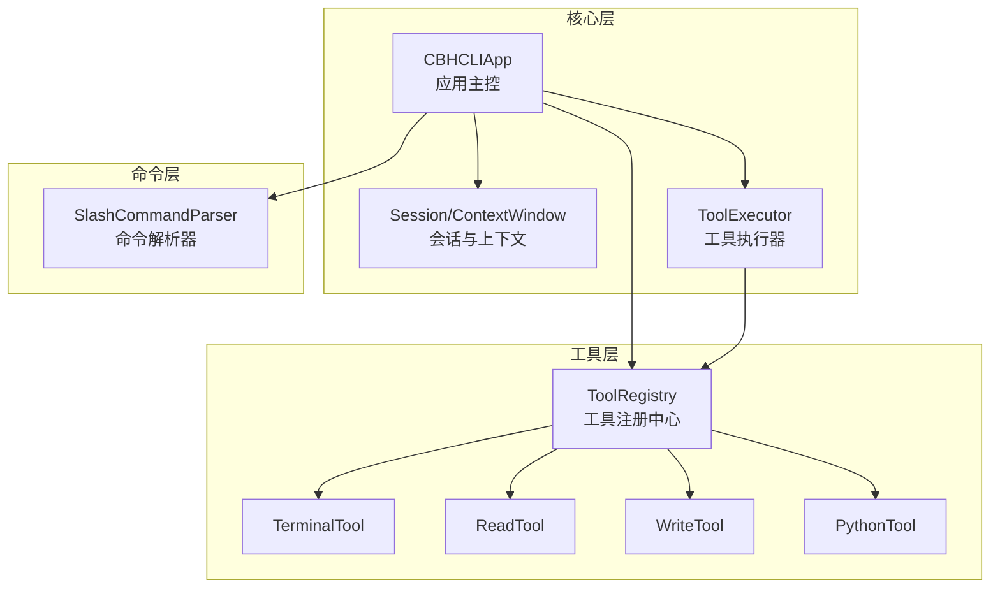
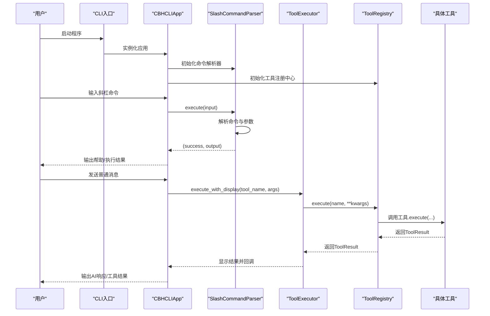
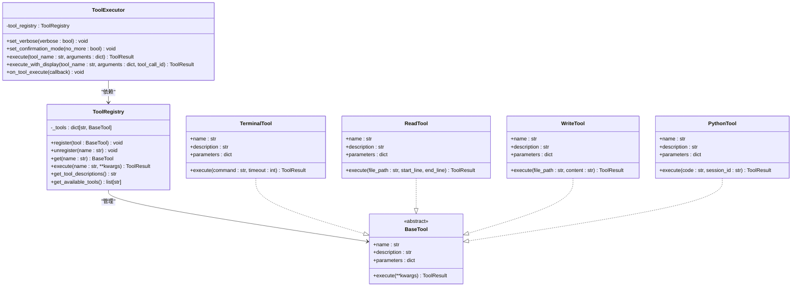
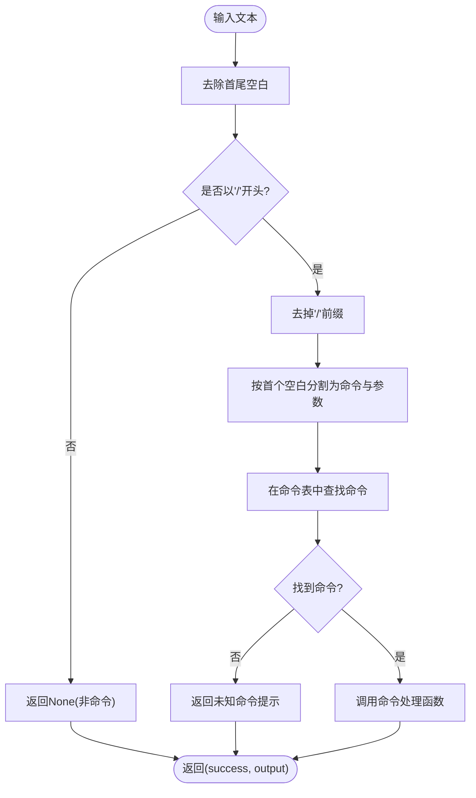
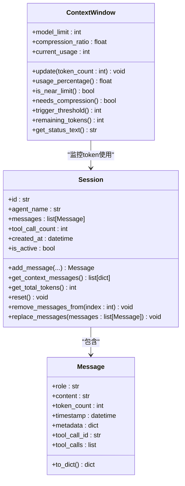
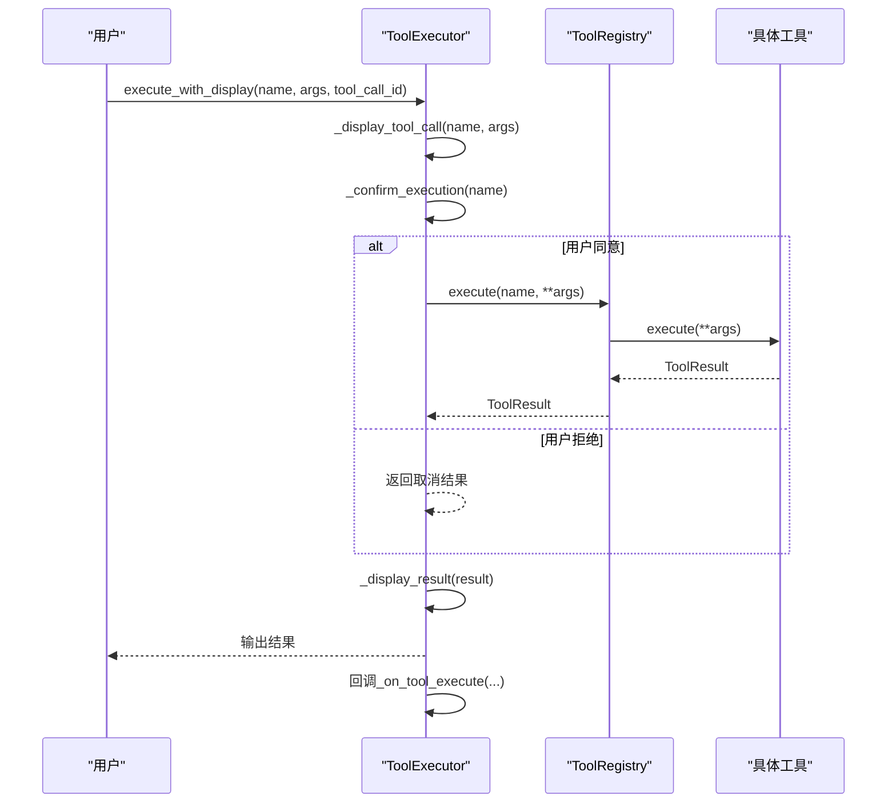
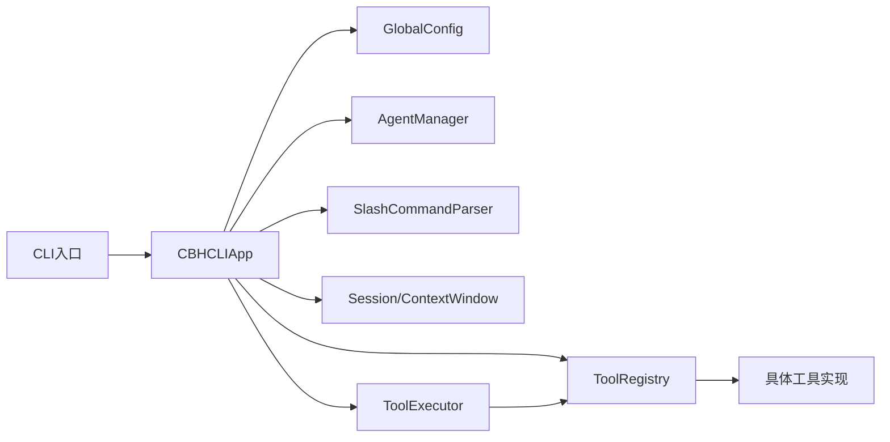

# 设计模式应用

<cite>
**本文引用的文件**
- [registry.py](file://cbhcli_pkg/tools/registry.py)
- [parser.py](file://cbhcli_pkg/commands/parser.py)
- [session.py](file://cbhcli_pkg/core/session.py)
- [tool_executor.py](file://cbhcli_pkg/core/tool_executor.py)
- [app.py](file://cbhcli_pkg/core/app.py)
- [terminal.py](file://cbhcli_pkg/tools/terminal.py)
- [file_read.py](file://cbhcli_pkg/tools/file_read.py)
- [file_write.py](file://cbhcli_pkg/tools/file_write.py)
- [python_tool.py](file://cbhcli_pkg/tools/python_tool.py)
- [cli.py](file://cbhcli_pkg/cli.py)
</cite>

## 目录
1. [简介](#简介)
2. [项目结构](#项目结构)
3. [核心组件](#核心组件)
4. [架构总览](#架构总览)
5. [详细组件分析](#详细组件分析)
6. [依赖分析](#依赖分析)
7. [性能考虑](#性能考虑)
8. [故障排查指南](#故障排查指南)
9. [结论](#结论)
10. [附录](#附录)

## 简介
本文件聚焦于CBHCLI中设计模式的应用与实践，围绕以下主题展开：工具注册中心如何通过“工厂模式”实现工具的动态创建与管理；命令解析器如何使用“策略模式”实现不同命令的差异化处理；会话管理如何体现“观察者思想”的状态变更通知机制；以及这些设计模式在可扩展性、可维护性与可测试性方面的收益。文中提供类图与序列图，帮助读者从代码层面理解模式落地。

## 项目结构
CBHCLI采用分层与按功能域划分的组织方式：
- 核心层：应用主控、会话与上下文、AI处理、工具执行器等
- 工具层：各类工具实现，统一由工具注册中心管理
- 命令层：斜杠命令解析与路由
- CLI入口：命令行参数解析与启动流程

图表来源
- [app.py](file://cbhcli_pkg/core/app.py)
- [registry.py](file://cbhcli_pkg/tools/registry.py)
- [tool_executor.py](file://cbhcli_pkg/core/tool_executor.py)
- [session.py](file://cbhcli_pkg/core/session.py)
- [parser.py](file://cbhcli_pkg/commands/parser.py)
- [terminal.py](file://cbhcli_pkg/tools/terminal.py)
- [file_read.py](file://cbhcli_pkg/tools/file_read.py)
- [file_write.py](file://cbhcli_pkg/tools/file_write.py)
- [python_tool.py](file://cbhcli_pkg/tools/python_tool.py)

章节来源
- [app.py](file://cbhcli_pkg/core/app.py)
- [cli.py](file://cbhcli_pkg/cli.py)

## 核心组件
- 工具注册中心与工具体系：通过抽象基类与注册表实现工具的统一管理与动态调用，体现“工厂模式”的思想（注册即创建实例的集中化管理）。
- 命令解析器：以字典映射的方式将命令名与处理函数绑定，体现“策略模式”的核心思想（根据命令类型选择不同策略）。
- 会话与上下文：会话对象承载消息与状态，上下文窗口负责阈值判断与状态提示，体现“观察者思想”的状态通知与阈值触发。
- 工具执行器：封装工具调用前确认、执行、结果显示与回调，作为工具调用的协调者。

章节来源
- [registry.py](file://cbhcli_pkg/tools/registry.py)
- [parser.py](file://cbhcli_pkg/commands/parser.py)
- [session.py](file://cbhcli_pkg/core/session.py)
- [tool_executor.py](file://cbhcli_pkg/core/tool_executor.py)

## 架构总览
下图展示了应用启动、命令解析、工具执行与会话管理的关键交互：

图表来源
- [cli.py](file://cbhcli_pkg/cli.py)
- [app.py](file://cbhcli_pkg/core/app.py)
- [parser.py](file://cbhcli_pkg/commands/parser.py)
- [tool_executor.py](file://cbhcli_pkg/core/tool_executor.py)
- [registry.py](file://cbhcli_pkg/tools/registry.py)

## 详细组件分析

### 工具注册中心与工厂模式
- 抽象与实现
  - 抽象基类定义工具的统一接口（名称、描述、参数Schema、执行方法），确保不同工具具备一致的契约。
  - 具体工具实现各自逻辑（如终端命令、文件读写、Python执行等）。
- 注册与执行
  - 注册中心负责注册、注销、查找与执行工具，并统一封装异常与结果格式。
  - 工具执行器通过注册中心间接调用工具，实现“解耦调用方与具体实现”。

图表来源
- [registry.py](file://cbhcli_pkg/tools/registry.py)
- [tool_executor.py](file://cbhcli_pkg/core/tool_executor.py)
- [terminal.py](file://cbhcli_pkg/tools/terminal.py)
- [file_read.py](file://cbhcli_pkg/tools/file_read.py)
- [file_write.py](file://cbhcli_pkg/tools/file_write.py)
- [python_tool.py](file://cbhcli_pkg/tools/python_tool.py)

- 工厂模式要点
  - 工具注册中心承担“工厂”的职责：集中管理工具实例的创建与生命周期（注册/注销/查找/执行），调用方无需关心具体实现细节。
  - 在应用初始化阶段，通过注册中心批量注册内置工具，形成“工具工厂”的统一入口。

章节来源
- [registry.py](file://cbhcli_pkg/tools/registry.py)
- [app.py](file://cbhcli_pkg/core/app.py)
- [tool_executor.py](file://cbhcli_pkg/core/tool_executor.py)

### 命令解析器与策略模式
- 命令定义与注册
  - 每个命令以“命令名→处理函数”的形式注册到解析器，解析器内部以字典维护映射。
- 解析与执行
  - 解析器先进行输入预处理（去空白、去前缀斜杠、拆分命令与参数），再根据命令名查找对应处理函数并执行。
  - 执行结果以布尔标志与输出文本的形式返回，便于上层统一处理。

图表来源
- [parser.py](file://cbhcli_pkg/commands/parser.py)

- 策略模式要点
  - 命令表相当于“策略表”，每条命令是一个独立策略；解析器根据命令名选择对应策略执行，新增命令只需注册新策略，符合开闭原则。
  - 应用层在初始化时批量注册各功能命令（Agent、会话、模型、知识库、嵌入、MCP等），形成完整的命令策略集。

章节来源
- [parser.py](file://cbhcli_pkg/commands/parser.py)
- [app.py](file://cbhcli_pkg/core/app.py)

### 会话管理与“观察者思想”
- 会话与上下文
  - 会话对象维护消息列表、工具调用计数与活跃状态；上下文窗口负责跟踪当前token用量、阈值与状态提示。
- 状态变更与通知
  - 上下文窗口提供“接近阈值/需要压缩”的判定方法，应用在处理请求前检查并触发压缩，体现“观察者思想”中的“状态变化→动作触发”。
  - 会话重置、消息替换等操作也属于状态变更场景，影响后续处理流程。

图表来源
- [session.py](file://cbhcli_pkg/core/session.py)

- “观察者思想”要点
  - 上下文窗口作为“观察者”，持续监控会话token使用情况；当达到阈值比例时，触发压缩流程，避免超出模型限制。
  - 会话重置、消息替换等操作改变上下文状态，进而影响后续策略（如是否需要压缩）。

章节来源
- [session.py](file://cbhcli_pkg/core/session.py)
- [app.py](file://cbhcli_pkg/core/app.py)

### 工具执行器与回调链
- 执行流程
  - 工具执行器负责：显示工具调用预览、用户确认、执行工具、格式化输出、回调通知。
  - 支持“跳过确认”与“详细/简洁”两种显示模式，提升用户体验与调试效率。
- 回调机制
  - 通过回调钩子在工具执行完成后传递工具名、参数、结果与工具调用ID，便于上层记录日志或触发后续动作。

图表来源
- [tool_executor.py](file://cbhcli_pkg/core/tool_executor.py)
- [registry.py](file://cbhcli_pkg/tools/registry.py)

章节来源
- [tool_executor.py](file://cbhcli_pkg/core/tool_executor.py)

## 依赖分析
- 组件耦合
  - CBHCLIApp是核心协调者，依赖配置、工具注册中心、命令解析器、会话与上下文、AI处理等模块。
  - 工具执行器依赖工具注册中心，实现对工具的统一调度。
  - 命令解析器与应用层配合，完成命令注册与执行。
- 外部依赖
  - CLI入口负责参数解析与应用启动。
  - 工具实现依赖标准库与第三方库（如subprocess、pathlib等）。

图表来源
- [cli.py](file://cbhcli_pkg/cli.py)
- [app.py](file://cbhcli_pkg/core/app.py)
- [tool_executor.py](file://cbhcli_pkg/core/tool_executor.py)
- [registry.py](file://cbhcli_pkg/tools/registry.py)

章节来源
- [cli.py](file://cbhcli_pkg/cli.py)
- [app.py](file://cbhcli_pkg/core/app.py)

## 性能考虑
- 工具注册中心
  - 以字典存储工具，查找与注册的时间复杂度为O(1)，满足高频调用需求。
- 命令解析器
  - 命令注册为一次性操作，解析过程为线性扫描，开销极低。
- 会话与上下文
  - 上下文窗口的阈值计算为常数时间，不会成为瓶颈。
- 工具执行器
  - 显示与确认步骤增加少量I/O开销，可通过“跳过确认”与“简洁模式”降低影响。

## 故障排查指南
- 工具执行失败
  - 现象：工具返回失败结果或抛出异常。
  - 排查：检查工具参数Schema与必填项；查看ToolExecutor的显示输出与错误信息；确认工具是否正确注册。
- 命令未知
  - 现象：命令解析器返回未知命令提示。
  - 排查：确认命令是否已注册；检查命令名大小写与拼写；查看帮助输出确认可用命令。
- 上下文溢出
  - 现象：接近上下文阈值或触发压缩。
  - 排查：查看上下文状态文本；调整自动压缩策略或减少长对话；必要时清理历史消息。

章节来源
- [tool_executor.py](file://cbhcli_pkg/core/tool_executor.py)
- [parser.py](file://cbhcli_pkg/commands/parser.py)
- [session.py](file://cbhcli_pkg/core/session.py)

## 结论
CBHCLI通过“工厂模式”（工具注册中心）、“策略模式”（命令解析器）与“观察者思想”（上下文窗口）构建了清晰、可扩展且易于维护的系统架构。这些设计模式提升了系统的可扩展性（新增工具/命令无需修改既有代码）、可维护性（职责分离、集中管理）与可测试性（接口统一、依赖注入）。在技术选型上，这些模式与项目目标高度契合：快速集成新能力、稳定运行与良好用户体验。

## 附录
- 工具注册中心的统一接口与执行流程，参见：[registry.py](file://cbhcli_pkg/tools/registry.py)
- 命令解析器的策略注册与执行流程，参见：[parser.py](file://cbhcli_pkg/commands/parser.py)
- 会话与上下文的状态管理，参见：[session.py](file://cbhcli_pkg/core/session.py)
- 工具执行器的调用链与回调机制，参见：[tool_executor.py](file://cbhcli_pkg/core/tool_executor.py)
- 应用主控的初始化与运行循环，参见：[app.py](file://cbhcli_pkg/core/app.py)
- CLI入口与帮助信息，参见：[cli.py](file://cbhcli_pkg/cli.py)