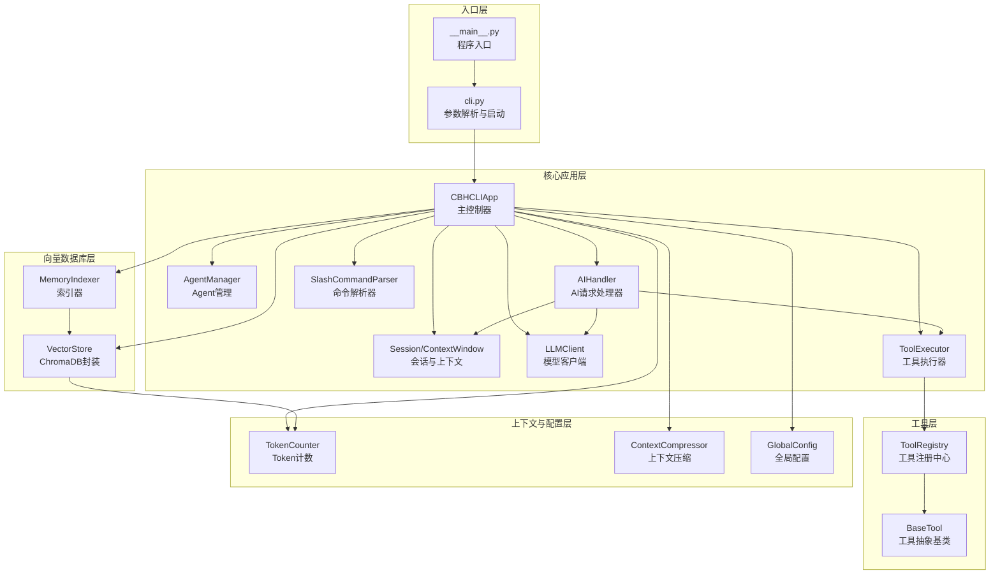
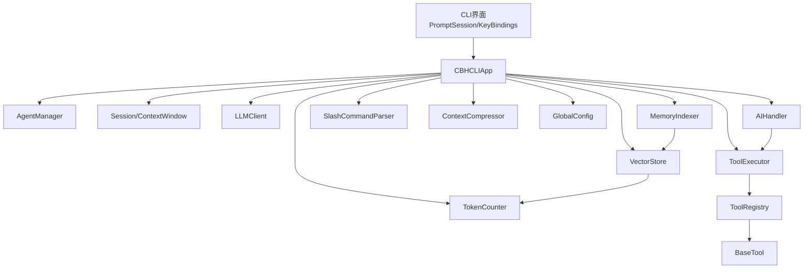
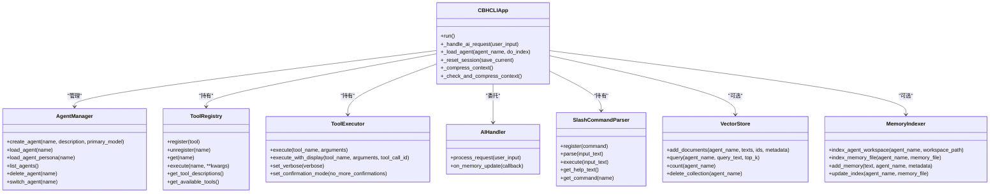
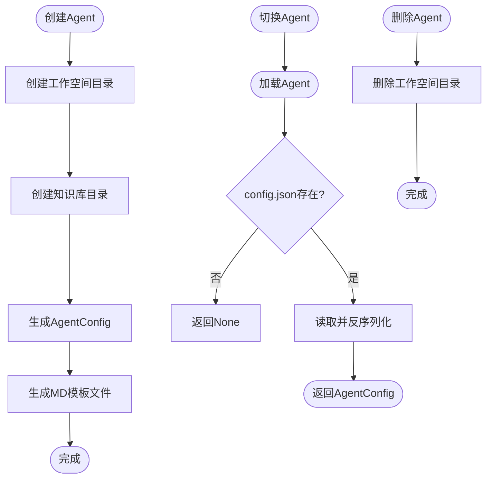
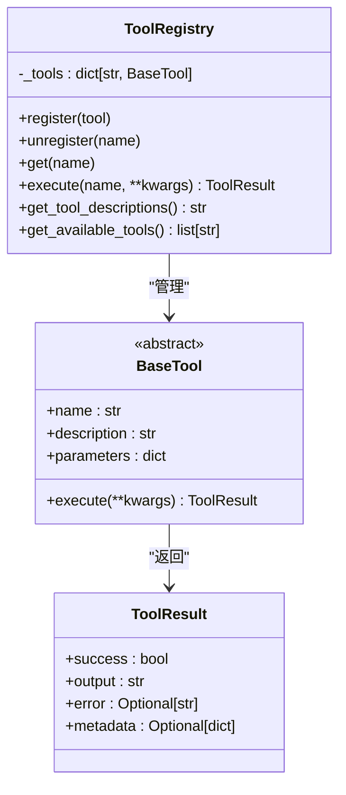
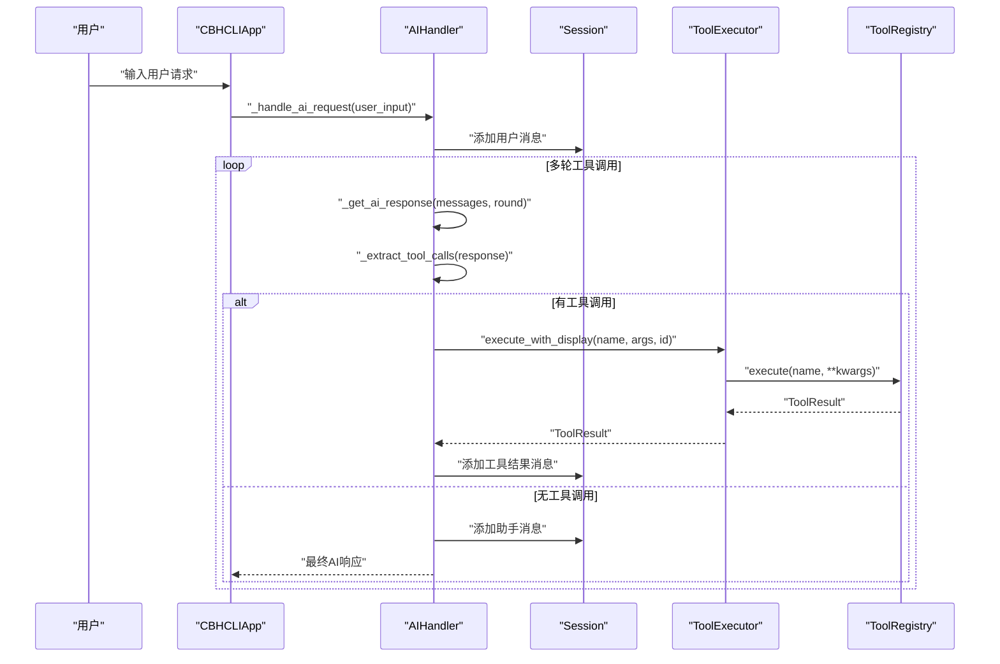
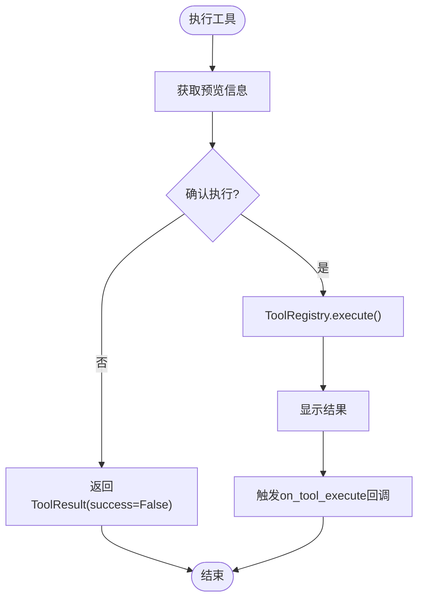
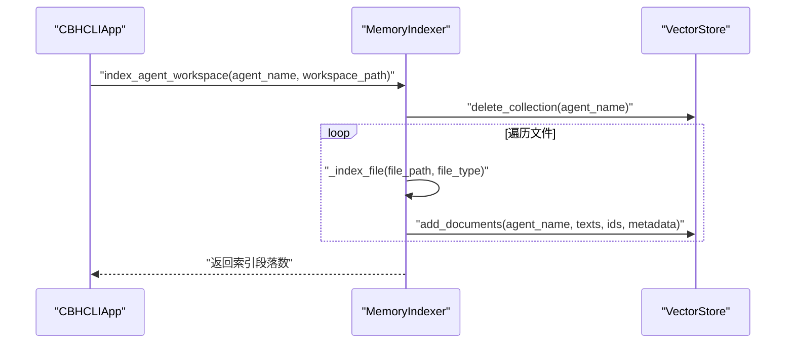
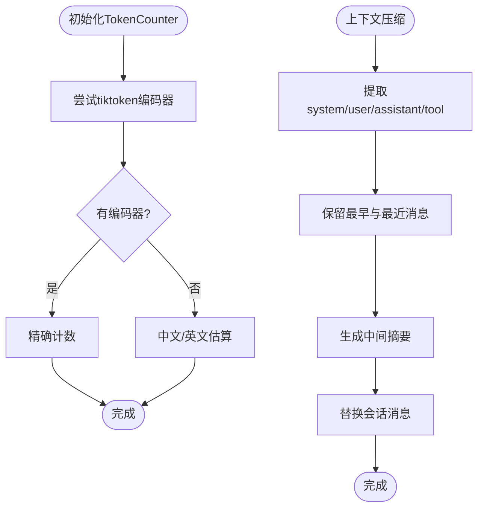
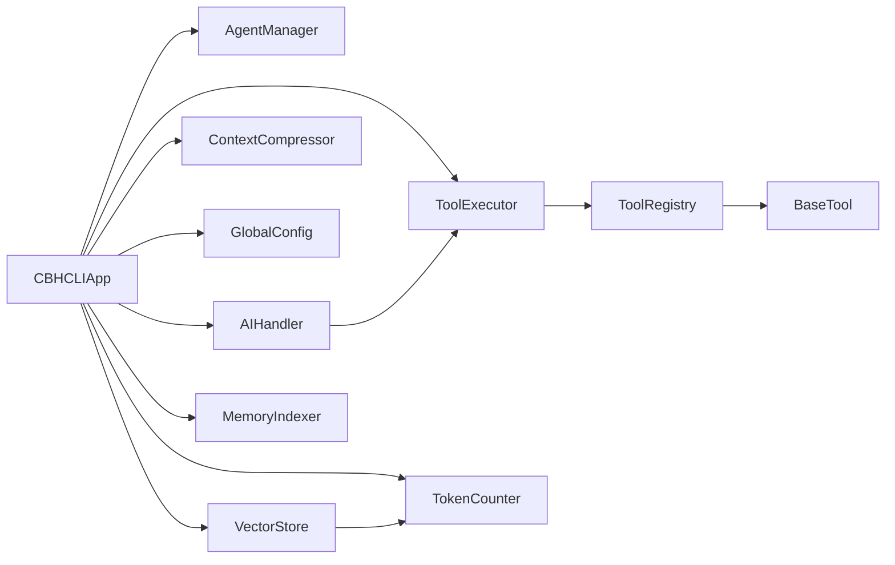

# 项目架构设计

<cite>
**本文引用的文件**
- [cbhcli_pkg/__main__.py](file://cbhcli_pkg/__main__.py)
- [cbhcli_pkg/cli.py](file://cbhcli_pkg/cli.py)
- [cbhcli_pkg/core/app.py](file://cbhcli_pkg/core/app.py)
- [cbhcli_pkg/core/__init__.py](file://cbhcli_pkg/core/__init__.py)
- [cbhcli_pkg/core/agent.py](file://cbhcli_pkg/core/agent.py)
- [cbhcli_pkg/core/ai_handler.py](file://cbhcli_pkg/core/ai_handler.py)
- [cbhcli_pkg/core/tool_executor.py](file://cbhcli_pkg/core/tool_executor.py)
- [cbhcli_pkg/core/constants.py](file://cbhcli_pkg/core/constants.py)
- [cbhcli_pkg/tools/registry.py](file://cbhcli_pkg/tools/registry.py)
- [cbhcli_pkg/vector/store.py](file://cbhcli_pkg/vector/store.py)
- [cbhcli_pkg/vector/indexer.py](file://cbhcli_pkg/vector/indexer.py)
- [cbhcli_pkg/context/token_counter.py](file://cbhcli_pkg/context/token_counter.py)
- [cbhcli_pkg/context/compressor.py](file://cbhcli_pkg/context/compressor.py)
- [cbhcli_pkg/config/global_config.py](file://cbhcli_pkg/config/global_config.py)
- [cbhcli_pkg/commands/parser.py](file://cbhcli_pkg/commands/parser.py)
</cite>

## 目录
1. [简介](#简介)
2. [项目结构](#项目结构)
3. [核心组件](#核心组件)
4. [架构总览](#架构总览)
5. [详细组件分析](#详细组件分析)
6. [依赖关系分析](#依赖关系分析)
7. [性能考量](#性能考量)
8. [故障排查指南](#故障排查指南)
9. [结论](#结论)
10. [附录](#附录)

## 简介
本文件面向CBHCLI项目的架构设计与实现，系统性阐述分层架构、模块化组织原则、组件间依赖关系与数据流设计。重点解析主控制器CBHCLIApp的职责划分、AgentManager的Agent生命周期管理、ToolRegistry的插件化架构；梳理从用户输入到AI响应的完整处理链路；分析工厂模式、观察者模式、策略模式等设计模式的应用；并提供可扩展性设计说明（插件系统、配置管理、向量数据库集成）及技术背景与权衡。

## 项目结构
CBHCLI采用清晰的分层与模块化组织：
- CLI入口与参数解析：负责启动流程与参数校验
- 核心应用层：主控制器、Agent管理、会话与上下文、模型与工具执行、AI处理、命令解析
- 工具层：统一工具注册与执行接口，支持插件化扩展
- 向量数据库层：封装ChromaDB，支持自定义嵌入模型
- 上下文与配置层：Token计数、上下文压缩、全局配置
- 命令系统：斜杠命令解析与路由

**图表来源**
- [cbhcli_pkg/__main__.py:1-7](file://cbhcli_pkg/__main__.py#L1-L7)
- [cbhcli_pkg/cli.py:73-112](file://cbhcli_pkg/cli.py#L73-L112)
- [cbhcli_pkg/core/app.py:54-478](file://cbhcli_pkg/core/app.py#L54-L478)
- [cbhcli_pkg/core/agent.py:572-762](file://cbhcli_pkg/core/agent.py#L572-L762)
- [cbhcli_pkg/core/ai_handler.py:21-743](file://cbhcli_pkg/core/ai_handler.py#L21-L743)
- [cbhcli_pkg/core/tool_executor.py:15-168](file://cbhcli_pkg/core/tool_executor.py#L15-L168)
- [cbhcli_pkg/tools/registry.py:51-115](file://cbhcli_pkg/tools/registry.py#L51-L115)
- [cbhcli_pkg/vector/store.py:37-175](file://cbhcli_pkg/vector/store.py#L37-L175)
- [cbhcli_pkg/vector/indexer.py:7-178](file://cbhcli_pkg/vector/indexer.py#L7-L178)
- [cbhcli_pkg/context/token_counter.py:14-88](file://cbhcli_pkg/context/token_counter.py#L14-L88)
- [cbhcli_pkg/context/compressor.py:7-112](file://cbhcli_pkg/context/compressor.py#L7-L112)
- [cbhcli_pkg/config/global_config.py:13-154](file://cbhcli_pkg/config/global_config.py#L13-L154)
- [cbhcli_pkg/commands/parser.py:16-94](file://cbhcli_pkg/commands/parser.py#L16-L94)

**章节来源**
- [cbhcli_pkg/__main__.py:1-7](file://cbhcli_pkg/__main__.py#L1-L7)
- [cbhcli_pkg/cli.py:73-112](file://cbhcli_pkg/cli.py#L73-L112)
- [cbhcli_pkg/core/app.py:54-478](file://cbhcli_pkg/core/app.py#L54-L478)

## 核心组件
- CBHCLIApp（主控制器）
  - 职责：应用初始化、Agent管理、用户交互循环、命令路由、工具与向量数据库初始化、会话与上下文管理、MCP管理
  - 设计要点：集中式控制，依赖注入，延迟初始化（向量存储、嵌入/重排序客户端），按需加载Agent工作空间
- AgentManager（Agent生命周期管理）
  - 职责：Agent创建、加载、切换、删除、工作空间管理、MD文件模板化
  - 设计要点：数据类配置持久化、工作空间隔离、Persona构建系统提示
- ToolRegistry（插件化架构）
  - 职责：工具注册、查找、执行、描述聚合
  - 设计要点：统一接口BaseTool，ToolResult标准化输出，参数Schema化
- AIHandler（AI请求处理）
  - 职责：流式响应、工具调用提取（多格式）、多轮工具调用协调、结果注入会话
  - 设计要点：严格格式验证、回退机制（纯文本命令）、去重与OpenAI格式兼容
- ToolExecutor（工具执行器）
  - 职责：执行前确认、执行、结果展示、回调
  - 设计要点：可配置确认模式、详细/简洁输出模式、预览与截断
- VectorStore/MemoryIndexer（向量数据库与索引）
  - 职责：ChromaDB封装、集合管理、文档增删改查、语义检索、索引构建与更新
  - 设计要点：自定义嵌入函数、批量嵌入预计算、元数据规范化
- 上下文与配置
  - TokenCounter：精确/估算双计数策略
  - ContextCompressor：AI驱动摘要压缩
  - GlobalConfig：统一配置持久化与模型/Agent设置

**章节来源**
- [cbhcli_pkg/core/app.py:54-478](file://cbhcli_pkg/core/app.py#L54-L478)
- [cbhcli_pkg/core/agent.py:572-762](file://cbhcli_pkg/core/agent.py#L572-L762)
- [cbhcli_pkg/tools/registry.py:51-115](file://cbhcli_pkg/tools/registry.py#L51-L115)
- [cbhcli_pkg/core/ai_handler.py:21-743](file://cbhcli_pkg/core/ai_handler.py#L21-L743)
- [cbhcli_pkg/core/tool_executor.py:15-168](file://cbhcli_pkg/core/tool_executor.py#L15-L168)
- [cbhcli_pkg/vector/store.py:37-175](file://cbhcli_pkg/vector/store.py#L37-L175)
- [cbhcli_pkg/vector/indexer.py:7-178](file://cbhcli_pkg/vector/indexer.py#L7-L178)
- [cbhcli_pkg/context/token_counter.py:14-88](file://cbhcli_pkg/context/token_counter.py#L14-L88)
- [cbhcli_pkg/context/compressor.py:7-112](file://cbhcli_pkg/context/compressor.py#L7-L112)
- [cbhcli_pkg/config/global_config.py:13-154](file://cbhcli_pkg/config/global_config.py#L13-L154)

## 架构总览
CBHCLI采用分层架构与模块化设计：
- 表现层：CLI交互、斜杠命令、PromptSession
- 控制层：CBHCLIApp集中编排
- 业务层：Agent管理、会话与上下文、工具执行、AI处理
- 数据访问层：向量数据库封装、索引器
- 基础设施层：配置管理、Token计数、上下文压缩

**图表来源**
- [cbhcli_pkg/core/app.py:54-478](file://cbhcli_pkg/core/app.py#L54-L478)
- [cbhcli_pkg/core/ai_handler.py:21-743](file://cbhcli_pkg/core/ai_handler.py#L21-L743)
- [cbhcli_pkg/core/tool_executor.py:15-168](file://cbhcli_pkg/core/tool_executor.py#L15-L168)
- [cbhcli_pkg/tools/registry.py:51-115](file://cbhcli_pkg/tools/registry.py#L51-L115)
- [cbhcli_pkg/vector/store.py:37-175](file://cbhcli_pkg/vector/store.py#L37-L175)
- [cbhcli_pkg/vector/indexer.py:7-178](file://cbhcli_pkg/vector/indexer.py#L7-L178)
- [cbhcli_pkg/context/token_counter.py:14-88](file://cbhcli_pkg/context/token_counter.py#L14-L88)
- [cbhcli_pkg/context/compressor.py:7-112](file://cbhcli_pkg/context/compressor.py#L7-L112)
- [cbhcli_pkg/config/global_config.py:13-154](file://cbhcli_pkg/config/global_config.py#L13-L154)
- [cbhcli_pkg/commands/parser.py:16-94](file://cbhcli_pkg/commands/parser.py#L16-L94)

## 详细组件分析

### CBHCLIApp（主控制器）
- 初始化阶段
  - 配置与工作空间：GlobalConfig、AgentManager、TokenCounter、SubAgentScheduler
  - 工具系统：ToolRegistry注册内置工具，延迟初始化向量存储后动态注册memory_search/knowledge_base工具
  - 命令系统：SlashCommandParser注册各类命令处理器
  - UI：PromptSession、KeyBindings（Ctrl+R切换工具显示模式）
  - Agent加载：加载活动Agent或默认main Agent，初始化LLM、会话历史、MCP管理器、可选索引
- 运行循环
  - 获取输入、帮助/命令解析、AI请求处理、上下文压缩、异常处理与优雅退出
- 关键职责
  - 生命周期编排：Agent切换、会话重置、Python会话清理
  - 上下文管理：ContextWindow触发阈值、ContextCompressor压缩
  - 与AIHandler协作：注入LLM、会话、工具执行器、Token计数器

**图表来源**
- [cbhcli_pkg/core/app.py:54-478](file://cbhcli_pkg/core/app.py#L54-L478)
- [cbhcli_pkg/core/agent.py:572-762](file://cbhcli_pkg/core/agent.py#L572-L762)
- [cbhcli_pkg/tools/registry.py:51-115](file://cbhcli_pkg/tools/registry.py#L51-L115)
- [cbhcli_pkg/core/tool_executor.py:15-168](file://cbhcli_pkg/core/tool_executor.py#L15-L168)
- [cbhcli_pkg/core/ai_handler.py:21-743](file://cbhcli_pkg/core/ai_handler.py#L21-L743)
- [cbhcli_pkg/commands/parser.py:16-94](file://cbhcli_pkg/commands/parser.py#L16-L94)
- [cbhcli_pkg/vector/store.py:37-175](file://cbhcli_pkg/vector/store.py#L37-L175)
- [cbhcli_pkg/vector/indexer.py:7-178](file://cbhcli_pkg/vector/indexer.py#L7-L178)

**章节来源**
- [cbhcli_pkg/core/app.py:54-478](file://cbhcli_pkg/core/app.py#L54-L478)

### AgentManager（Agent生命周期管理）
- 工作空间隔离：每个Agent独立目录，包含config.json、skills.md、soul.md、tools.md、memory.md、usage.md、knowledge/、history/
- 配置持久化：AgentConfig数据类，序列化/反序列化
- Persona构建：从MD文件加载技能、性格、工具指南、记忆、使用说明，拼装系统提示
- 生命周期：创建、加载、切换、删除、更新记忆

**图表来源**
- [cbhcli_pkg/core/agent.py:585-762](file://cbhcli_pkg/core/agent.py#L585-L762)

**章节来源**
- [cbhcli_pkg/core/agent.py:572-762](file://cbhcli_pkg/core/agent.py#L572-L762)

### ToolRegistry（插件化架构）
- BaseTool抽象：name/description/parameters/execute
- ToolRegistry：注册、注销、查找、执行、描述聚合、可用工具列表
- ToolResult：success/output/error/metadata标准化输出

**图表来源**
- [cbhcli_pkg/tools/registry.py:16-115](file://cbhcli_pkg/tools/registry.py#L16-L115)

**章节来源**
- [cbhcli_pkg/tools/registry.py:51-115](file://cbhcli_pkg/tools/registry.py#L51-L115)

### AIHandler（AI请求处理）
- 多轮工具调用：MAX_TOOL_ROUNDS限制，每轮提取工具调用并执行
- 工具调用提取：严格优先级（DSML标签、Python函数、JSON、纯文本命令回退）
- 流式输出：Reasoning/Content/ToolCalls三通道，增量清理与显示
- 结果注入：OpenAI格式tool_calls，工具结果消息加入会话

**图表来源**
- [cbhcli_pkg/core/ai_handler.py:51-96](file://cbhcli_pkg/core/ai_handler.py#L51-L96)
- [cbhcli_pkg/core/tool_executor.py:54-91](file://cbhcli_pkg/core/tool_executor.py#L54-L91)
- [cbhcli_pkg/tools/registry.py:70-96](file://cbhcli_pkg/tools/registry.py#L70-L96)

**章节来源**
- [cbhcli_pkg/core/ai_handler.py:21-743](file://cbhcli_pkg/core/ai_handler.py#L21-L743)
- [cbhcli_pkg/core/tool_executor.py:15-168](file://cbhcli_pkg/core/tool_executor.py#L15-L168)

### ToolExecutor（工具执行器）
- 执行前确认：可跳过确认（all），支持Y/n/all
- 结果展示：详细/简洁模式，预览与截断
- 回调：on_tool_execute(tool_name, arguments, result, tool_call_id)

**图表来源**
- [cbhcli_pkg/core/tool_executor.py:54-168](file://cbhcli_pkg/core/tool_executor.py#L54-L168)

**章节来源**
- [cbhcli_pkg/core/tool_executor.py:15-168](file://cbhcli_pkg/core/tool_executor.py#L15-L168)

### 向量数据库与索引（VectorStore/MemoryIndexer）
- VectorStore：ChromaDB封装，自定义嵌入函数，集合管理，文档增删改查，语义查询
- MemoryIndexer：Agent工作空间文件索引（memory/skills/soul/tools/usage + knowledge/），段落切分与元数据

**图表来源**
- [cbhcli_pkg/vector/indexer.py:37-134](file://cbhcli_pkg/vector/indexer.py#L37-L134)
- [cbhcli_pkg/vector/store.py:79-175](file://cbhcli_pkg/vector/store.py#L79-L175)

**章节来源**
- [cbhcli_pkg/vector/store.py:37-175](file://cbhcli_pkg/vector/store.py#L37-L175)
- [cbhcli_pkg/vector/indexer.py:7-178](file://cbhcli_pkg/vector/indexer.py#L7-L178)

### 上下文与配置
- TokenCounter：优先tiktoken精确计数，降级估算
- ContextCompressor：摘要压缩，保留早期与近期消息，中间部分生成摘要
- GlobalConfig：模型、嵌入/重排序模型、Agent、设置统一持久化

**图表来源**
- [cbhcli_pkg/context/token_counter.py:34-75](file://cbhcli_pkg/context/token_counter.py#L34-L75)
- [cbhcli_pkg/context/compressor.py:21-81](file://cbhcli_pkg/context/compressor.py#L21-L81)

**章节来源**
- [cbhcli_pkg/context/token_counter.py:14-88](file://cbhcli_pkg/context/token_counter.py#L14-L88)
- [cbhcli_pkg/context/compressor.py:7-112](file://cbhcli_pkg/context/compressor.py#L7-L112)
- [cbhcli_pkg/config/global_config.py:13-154](file://cbhcli_pkg/config/global_config.py#L13-L154)

## 依赖关系分析
- 组件耦合与内聚
  - CBHCLIApp对AgentManager、ToolRegistry、ToolExecutor、AIHandler、VectorStore/MemoryIndexer、TokenCounter、ContextCompressor、GlobalConfig具有强依赖，但通过构造函数注入降低耦合
  - AIHandler与ToolExecutor通过ToolRegistry解耦，便于扩展新工具
  - VectorStore与MemoryIndexer通过接口解耦，便于更换底层存储
- 直接与间接依赖
  - AIHandler直接依赖LLMClient与Session，间接依赖ToolExecutor与TokenCounter
  - ToolExecutor直接依赖ToolRegistry，间接依赖BaseTool实现
  - CBHCLIApp间接依赖ChromaDB（通过VectorStore），但对外屏蔽细节
- 循环依赖
  - 未发现循环依赖，模块边界清晰
- 外部依赖与集成点
  - ChromaDB（PersistentClient）、tiktoken（可选）、模型API（通过EmbeddingClient/RerankClient）

**图表来源**
- [cbhcli_pkg/core/app.py:54-478](file://cbhcli_pkg/core/app.py#L54-L478)
- [cbhcli_pkg/core/ai_handler.py:21-743](file://cbhcli_pkg/core/ai_handler.py#L21-L743)
- [cbhcli_pkg/core/tool_executor.py:15-168](file://cbhcli_pkg/core/tool_executor.py#L15-L168)
- [cbhcli_pkg/tools/registry.py:51-115](file://cbhcli_pkg/tools/registry.py#L51-L115)
- [cbhcli_pkg/vector/store.py:37-175](file://cbhcli_pkg/vector/store.py#L37-L175)
- [cbhcli_pkg/context/token_counter.py:14-88](file://cbhcli_pkg/context/token_counter.py#L14-L88)
- [cbhcli_pkg/context/compressor.py:7-112](file://cbhcli_pkg/context/compressor.py#L7-L112)
- [cbhcli_pkg/config/global_config.py:13-154](file://cbhcli_pkg/config/global_config.py#L13-L154)
- [cbhcli_pkg/vector/indexer.py:7-178](file://cbhcli_pkg/vector/indexer.py#L7-L178)

**章节来源**
- [cbhcli_pkg/core/app.py:54-478](file://cbhcli_pkg/core/app.py#L54-L478)
- [cbhcli_pkg/core/ai_handler.py:21-743](file://cbhcli_pkg/core/ai_handler.py#L21-L743)
- [cbhcli_pkg/core/tool_executor.py:15-168](file://cbhcli_pkg/core/tool_executor.py#L15-L168)
- [cbhcli_pkg/tools/registry.py:51-115](file://cbhcli_pkg/tools/registry.py#L51-L115)
- [cbhcli_pkg/vector/store.py:37-175](file://cbhcli_pkg/vector/store.py#L37-L175)
- [cbhcli_pkg/vector/indexer.py:7-178](file://cbhcli_pkg/vector/indexer.py#L7-L178)
- [cbhcli_pkg/context/token_counter.py:14-88](file://cbhcli_pkg/context/token_counter.py#L14-L88)
- [cbhcli_pkg/context/compressor.py:7-112](file://cbhcli_pkg/context/compressor.py#L7-L112)
- [cbhcli_pkg/config/global_config.py:13-154](file://cbhcli_pkg/config/global_config.py#L13-L154)

## 性能考量
- Token计数
  - 优先使用tiktoken精确计数，缺失时采用中文/英文估算，平衡准确性与性能
- 上下文压缩
  - 基于摘要的压缩减少token占用，保留关键对话片段，避免频繁重算
- 向量检索
  - 预计算嵌入向量，避免ChromaDB调用默认模型，提升检索效率
- 工具执行
  - 可配置确认模式与详细输出模式，减少不必要的交互与输出
- 并发与流式
  - AI流式输出与增量清理，提升用户体验；工具执行串行化，避免资源竞争

## 故障排查指南
- 模型未配置
  - 现象：Agent未配置模型，无法发起AI请求
  - 处理：使用斜杠命令配置模型与嵌入/重排序模型
- 向量存储初始化失败
  - 现象：嵌入/重排序模型配置后仍无法启用向量搜索
  - 处理：检查模型配置、网络连通性；确认ChromaDB安装与权限
- 工具执行失败
  - 现象：工具返回错误或用户取消
  - 处理：查看工具参数、确认执行、检查权限与环境
- 上下文溢出
  - 现象：自动压缩失败或效果不佳
  - 处理：调整压缩比例、减少长文本、使用更短的模型
- 命令解析错误
  - 现象：未知命令或参数错误
  - 处理：使用/help查看命令列表与用法

**章节来源**
- [cbhcli_pkg/core/app.py:414-420](file://cbhcli_pkg/core/app.py#L414-L420)
- [cbhcli_pkg/core/ai_handler.py:212-214](file://cbhcli_pkg/core/ai_handler.py#L212-L214)
- [cbhcli_pkg/core/tool_executor.py:122-140](file://cbhcli_pkg/core/tool_executor.py#L122-L140)
- [cbhcli_pkg/context/compressor.py:107-112](file://cbhcli_pkg/context/compressor.py#L107-L112)
- [cbhcli_pkg/commands/parser.py:68-77](file://cbhcli_pkg/commands/parser.py#L68-L77)

## 结论
CBHCLI通过清晰的分层架构与模块化设计，实现了Agent生命周期管理、工具插件化、AI请求处理与向量数据库检索的有机整合。主控制器CBHCLIApp承担集中编排职责，结合工具注册中心与AI处理器，形成稳定的处理链路。上下文压缩与Token计数保障了长对话的稳定性，全局配置与命令系统提供了灵活的扩展与运维能力。该架构在可维护性、可扩展性与用户体验之间取得了良好平衡。

## 附录
- 设计模式应用
  - 工厂模式：ToolRegistry作为工具工厂，统一创建与管理
  - 观察者模式：AIHandler的on_memory_update与ToolExecutor的on_tool_execute回调
  - 策略模式：不同工具实现BaseTool的不同策略，统一接口与执行流程
- 可扩展性设计
  - 插件系统：BaseTool抽象与ToolRegistry注册，新增工具无需修改核心逻辑
  - 配置管理：GlobalConfig集中管理模型与设置，支持热更新
  - 向量数据库：VectorStore封装底层存储差异，MemoryIndexer提供索引策略
- 技术背景与权衡
  - 选择tiktoken进行精确计数，兼顾准确性与性能
  - 采用摘要压缩而非简单截断，提升上下文质量
  - 工具调用格式严格验证与回退机制，兼顾兼容性与安全性