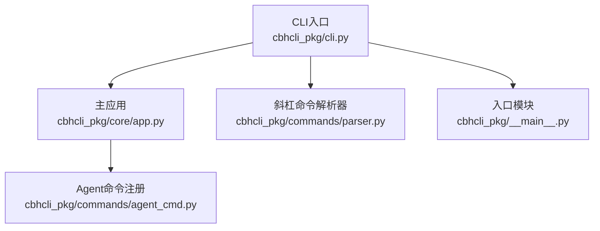
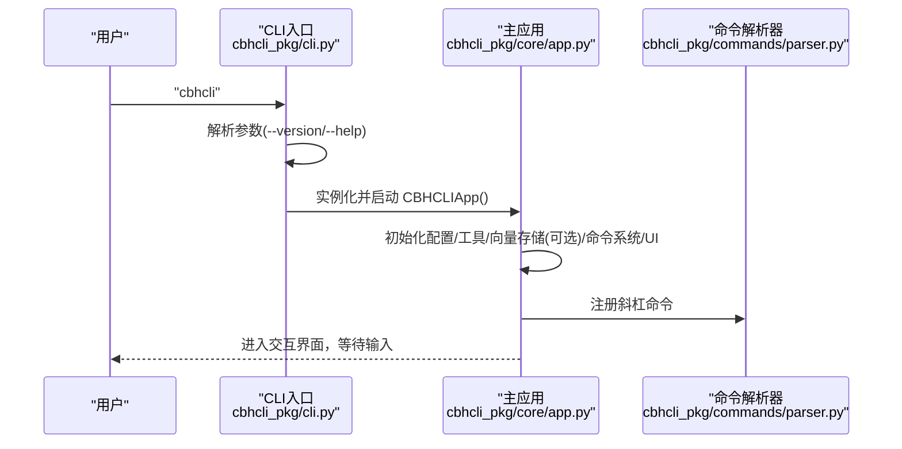
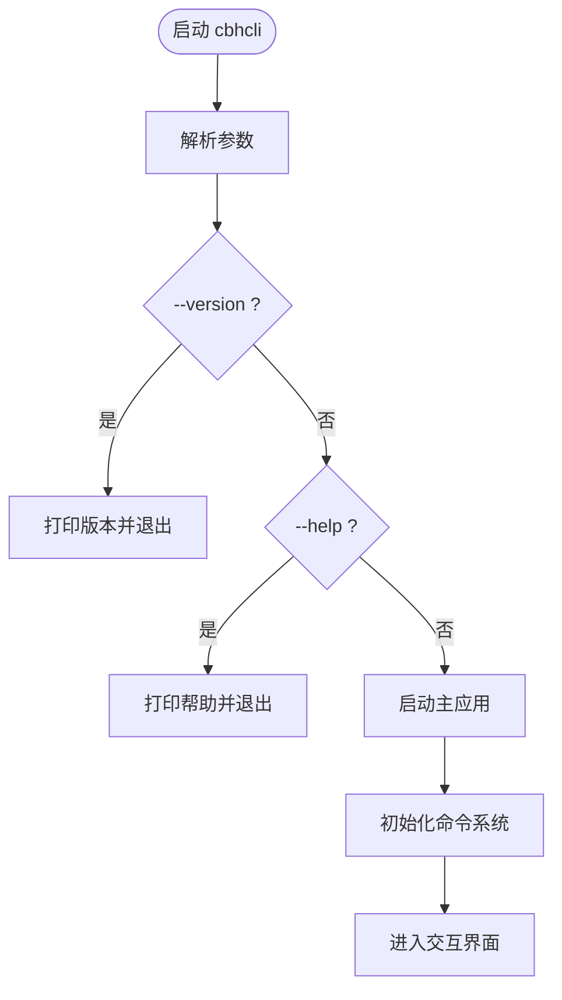
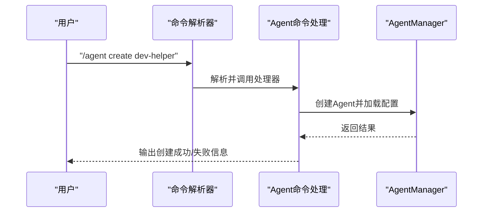
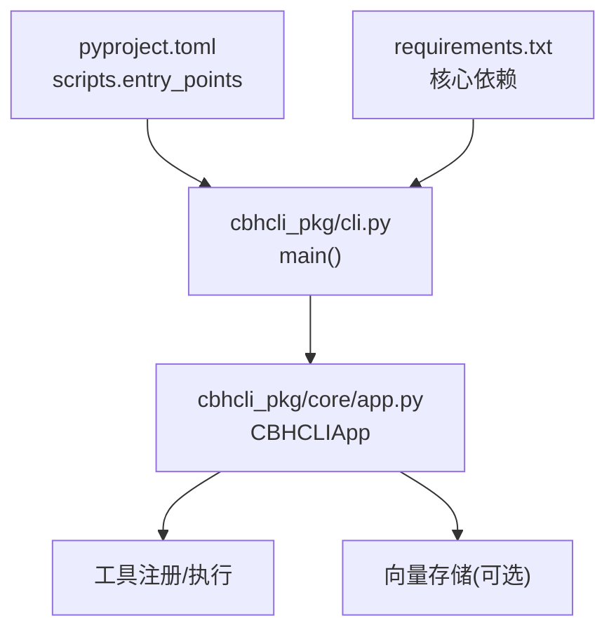

# 快速开始

<cite>
**本文引用的文件**
- [README.md](file://README.md)
- [INSTALL.md](file://INSTALL.md)
- [requirements.txt](file://requirements.txt)
- [pyproject.toml](file://pyproject.toml)
- [install.sh](file://install.sh)
- [windows使用注意事项.txt](file://windows使用注意事项.txt)
- [cbhcli_pkg/cli.py](file://cbhcli_pkg/cli.py)
- [cbhcli_pkg/__main__.py](file://cbhcli_pkg/__main__.py)
- [cbhcli_pkg/commands/parser.py](file://cbhcli_pkg/commands/parser.py)
- [cbhcli_pkg/core/app.py](file://cbhcli_pkg/core/app.py)
- [cbhcli_pkg/commands/agent_cmd.py](file://cbhcli_pkg/commands/agent_cmd.py)
</cite>

## 目录
1. [简介](#简介)
2. [项目结构](#项目结构)
3. [核心组件](#核心组件)
4. [架构总览](#架构总览)
5. [详细组件分析](#详细组件分析)
6. [依赖关系分析](#依赖关系分析)
7. [性能与资源建议](#性能与资源建议)
8. [故障排查指南](#故障排查指南)
9. [结论](#结论)
10. [附录](#附录)

## 简介
本指南面向首次接触 CBHCLI 的用户，目标是在最短时间内完成安装并体验核心功能。你将学到：
- 安装前的前置条件（Python 3.8+、pip）
- 从源码安装与 Wheel 包安装两种方式
- 可选依赖（向量数据库 ChromaDB、精确 Token 计数 tiktoken）及其作用
- 快速开始流程：启动应用、查看帮助、查看版本、创建并使用第一个 Agent
- 常见安装问题与 Windows 用户注意事项

## 项目结构
CBHCLI 采用清晰的分层结构，便于快速定位入口与核心逻辑：
- CLI 入口与参数解析：cbhcli_pkg/cli.py
- 主应用与命令系统：cbhcli_pkg/core/app.py
- 斜杠命令解析器：cbhcli_pkg/commands/parser.py
- Agent 管理命令：cbhcli_pkg/commands/agent_cmd.py
- 安装脚本与配置：install.sh、pyproject.toml、requirements.txt、README.md、INSTALL.md

图表来源
- [cbhcli_pkg/cli.py:73-112](file://cbhcli_pkg/cli.py#L73-L112)
- [cbhcli_pkg/core/app.py:54-72](file://cbhcli_pkg/core/app.py#L54-L72)
- [cbhcli_pkg/commands/parser.py:16-94](file://cbhcli_pkg/commands/parser.py#L16-L94)
- [cbhcli_pkg/commands/agent_cmd.py:5-47](file://cbhcli_pkg/commands/agent_cmd.py#L5-L47)
- [cbhcli_pkg/__main__.py:1-7](file://cbhcli_pkg/__main__.py#L1-L7)

章节来源
- [README.md:269-295](file://README.md#L269-L295)
- [pyproject.toml:44-45](file://pyproject.toml#L44-L45)

## 核心组件
- CLI 入口与参数解析：负责解析 --version/--help 参数，并在无参数时启动主应用。
- 主应用：初始化配置、工具、向量存储（可选）、命令系统与 UI；维护 Agent、会话与交互循环。
- 命令系统：斜杠命令解析器统一管理命令注册、解析与执行；内置 Agent/模型/知识库/向量索引/MCP 等命令。
- 安装与脚本：提供开发模式安装、标准安装、Wheel 安装与一键安装脚本。

章节来源
- [cbhcli_pkg/cli.py:73-112](file://cbhcli_pkg/cli.py#L73-L112)
- [cbhcli_pkg/core/app.py:54-200](file://cbhcli_pkg/core/app.py#L54-L200)
- [cbhcli_pkg/commands/parser.py:16-94](file://cbhcli_pkg/commands/parser.py#L16-L94)

## 架构总览
下面的序列图展示了从命令行启动到进入交互界面的关键流程。

图表来源
- [cbhcli_pkg/cli.py:73-112](file://cbhcli_pkg/cli.py#L73-L112)
- [cbhcli_pkg/core/app.py:54-179](file://cbhcli_pkg/core/app.py#L54-L179)
- [cbhcli_pkg/commands/parser.py:16-94](file://cbhcli_pkg/commands/parser.py#L16-L94)

## 详细组件分析

### 安装与前置要求
- 前置要求
  - Python 3.8 或更高版本
  - pip 包管理器
- 从源码安装
  - 开发模式安装：pip install -e .
  - 标准安装：pip install .
- 从 Wheel 安装
  - pip install dist/cbhcli-3.0.0-py3-none-any.whl
- 可选依赖
  - 向量数据库支持（ChromaDB）：pip install chromadb
  - 精确 Token 计数（tiktoken）：pip install tiktoken

章节来源
- [README.md:33-61](file://README.md#L33-L61)
- [INSTALL.md:3-69](file://INSTALL.md#L3-L69)
- [requirements.txt:1-7](file://requirements.txt#L1-L7)
- [pyproject.toml:32-38](file://pyproject.toml#L32-L38)

### 快速开始流程
- 启动应用：cbhcli
- 查看帮助：/help
- 查看版本：cbhcli --version
- 创建第一个 Agent
  - /agent create <name>
  - 按提示输入 Agent 描述与首选模型
- 使用 Agent
  - 在交互界面输入自然语言，AI 将根据你的需求自动调用工具完成任务（如执行命令、读写文件、查询知识库等）

章节来源
- [README.md:63-98](file://README.md#L63-L98)
- [cbhcli_pkg/cli.py:88-94](file://cbhcli_pkg/cli.py#L88-L94)
- [cbhcli_pkg/commands/agent_cmd.py:99-130](file://cbhcli_pkg/commands/agent_cmd.py#L99-L130)

### 命令系统与交互
- CLI 入口支持 --version 与 --help 参数；无参数时启动主应用。
- 主应用初始化命令系统，注册 Agent/模型/知识库/向量索引/MCP 等命令，并提供 /help 命令。
- 斜杠命令解析器统一处理命令注册、解析与执行，支持帮助输出与错误反馈。

图表来源
- [cbhcli_pkg/cli.py:73-112](file://cbhcli_pkg/cli.py#L73-L112)
- [cbhcli_pkg/core/app.py:151-179](file://cbhcli_pkg/core/app.py#L151-L179)
- [cbhcli_pkg/commands/parser.py:26-78](file://cbhcli_pkg/commands/parser.py#L26-L78)

章节来源
- [cbhcli_pkg/cli.py:73-112](file://cbhcli_pkg/cli.py#L73-L112)
- [cbhcli_pkg/core/app.py:151-179](file://cbhcli_pkg/core/app.py#L151-L179)
- [cbhcli_pkg/commands/parser.py:16-94](file://cbhcli_pkg/commands/parser.py#L16-L94)

### Agent 管理命令
- /agent create <name>：创建新 Agent，支持交互式选择模型与描述
- /agent list：列出所有 Agent
- /agent switch <name>：切换当前 Agent
- /agent delete <name>：删除 Agent

图表来源
- [cbhcli_pkg/commands/agent_cmd.py:99-130](file://cbhcli_pkg/commands/agent_cmd.py#L99-L130)
- [cbhcli_pkg/commands/parser.py:51-78](file://cbhcli_pkg/commands/parser.py#L51-L78)

章节来源
- [cbhcli_pkg/commands/agent_cmd.py:5-47](file://cbhcli_pkg/commands/agent_cmd.py#L5-L47)
- [cbhcli_pkg/commands/agent_cmd.py:99-130](file://cbhcli_pkg/commands/agent_cmd.py#L99-L130)

## 依赖关系分析
- 核心依赖
  - requests>=2.28.0
  - wcwidth>=0.2.5
  - prompt_toolkit>=3.0.0
- 可选依赖
  - chromadb>=0.4.0（向量数据库支持）
  - tiktoken>=0.5.0（精确 Token 计数）
- 安装入口
  - 脚本入口：cbhcli_pkg/cli.py 中定义的 main 函数
  - 控制台脚本：pyproject.toml 中的 cbhcli 指向 cbhcli_pkg.cli:main

图表来源
- [pyproject.toml:44-45](file://pyproject.toml#L44-L45)
- [pyproject.toml:26-30](file://pyproject.toml#L26-L30)
- [pyproject.toml:32-38](file://pyproject.toml#L32-L38)
- [requirements.txt:1-7](file://requirements.txt#L1-L7)
- [cbhcli_pkg/cli.py:73-112](file://cbhcli_pkg/cli.py#L73-L112)
- [cbhcli_pkg/core/app.py:85-150](file://cbhcli_pkg/core/app.py#L85-L150)

章节来源
- [pyproject.toml:26-38](file://pyproject.toml#L26-L38)
- [requirements.txt:1-7](file://requirements.txt#L1-L7)
- [pyproject.toml:44-45](file://pyproject.toml#L44-L45)

## 性能与资源建议
- 向量数据库（ChromaDB）与嵌入模型（Embedding）可显著提升知识库检索与上下文压缩效果，但会增加内存与磁盘占用。建议在资源充足的环境中启用。
- 精确 Token 计数（tiktoken）有助于更准确地估算上下文开销，避免超出模型上下文限制。
- 若仅进行基础命令执行与文件读写，可暂时不安装可选依赖，满足最小可用。

## 故障排查指南
- 安装后无法找到 cbhcli 命令
  - 检查安装目录是否在 PATH 中
  - 使用 --user 标志重新安装：pip install --user .
  - 在某些系统上，重启终端后再试
- Windows 终端颜色异常
  - 需要设置虚拟终端级别：reg add "HKEY_CURRENT_USER\Console" /v VirtualTerminalLevel /t REG_DWORD /d 1 /f
- Python 版本过低
  - 请升级至 Python 3.8 或更高版本
- 启动时报错“未知参数”
  - 使用 cbhcli --help 查看可用参数与命令

章节来源
- [INSTALL.md:63-69](file://INSTALL.md#L63-L69)
- [windows使用注意事项.txt:1-2](file://windows使用注意事项.txt#L1-L2)
- [README.md:33-35](file://README.md#L33-L35)
- [cbhcli_pkg/cli.py:96-99](file://cbhcli_pkg/cli.py#L96-L99)

## 结论
通过本指南，你已经完成了 CBHCLI 的安装与基础配置，成功启动应用并创建了第一个 Agent。建议继续探索模型配置、知识库与向量索引功能，以获得更丰富的 AI 辅助体验。

## 附录
- 一键安装脚本
  - install.sh 会检查 Python3 与 pip 并执行 pip install .，完成后可直接运行 cbhcli
- 入口模块
  - __main__.py 将调用 cbhcli_pkg/cli.py 的 main 函数，确保命令行入口一致

章节来源
- [install.sh:1-29](file://install.sh#L1-L29)
- [cbhcli_pkg/__main__.py:1-7](file://cbhcli_pkg/__main__.py#L1-L7)