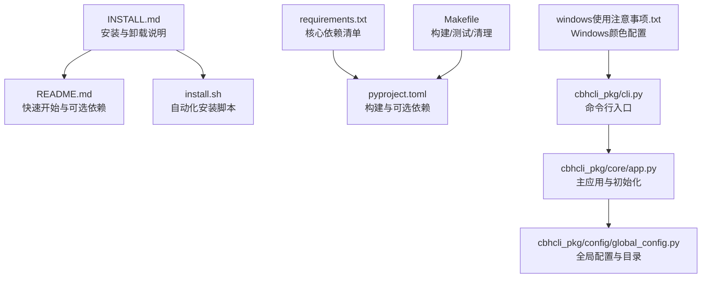
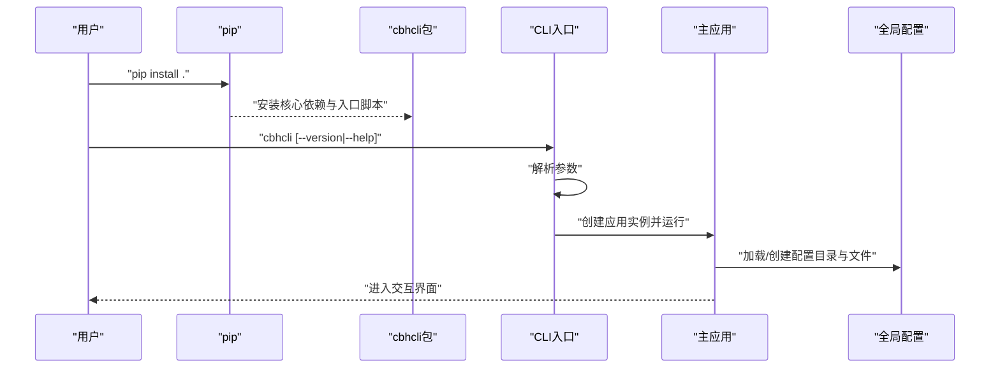
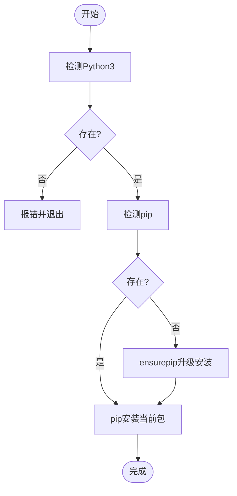
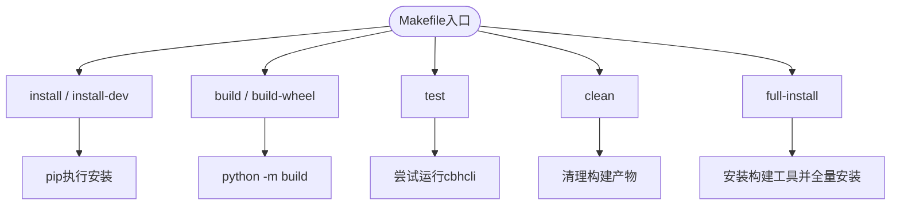
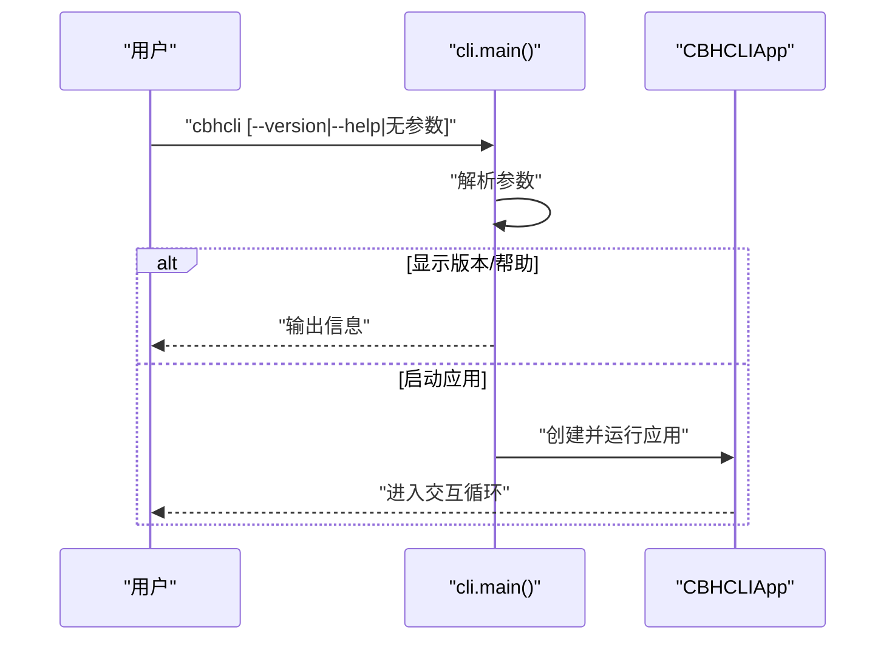
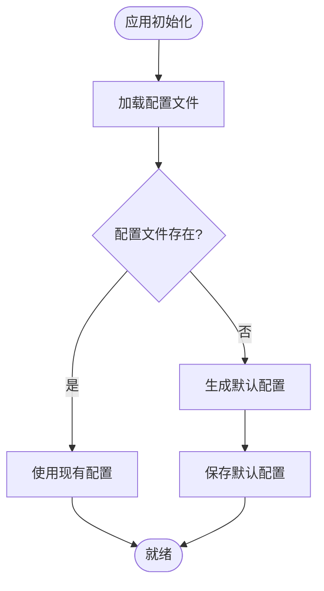
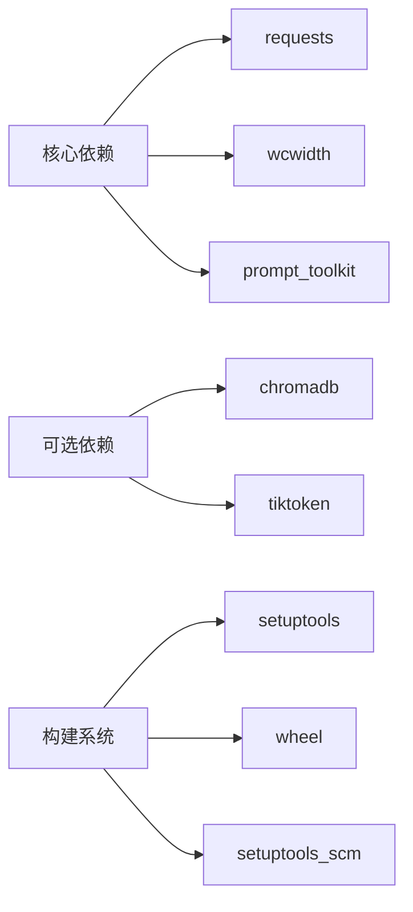

# 安装问题

<cite>
**本文引用的文件**
- [INSTALL.md](file://INSTALL.md)
- [README.md](file://README.md)
- [install.sh](file://install.sh)
- [requirements.txt](file://requirements.txt)
- [pyproject.toml](file://pyproject.toml)
- [Makefile](file://Makefile)
- [windows使用注意事项.txt](file://windows使用注意事项.txt)
- [cbhcli_pkg/cli.py](file://cbhcli_pkg/cli.py)
- [cbhcli_pkg/core/app.py](file://cbhcli_pkg/core/app.py)
- [cbhcli_pkg/config/global_config.py](file://cbhcli_pkg/config/global_config.py)
</cite>

## 目录
1. [简介](#简介)
2. [项目结构](#项目结构)
3. [核心组件](#核心组件)
4. [架构总览](#架构总览)
5. [详细组件分析](#详细组件分析)
6. [依赖关系分析](#依赖关系分析)
7. [性能考虑](#性能考虑)
8. [故障排除指南](#故障排除指南)
9. [结论](#结论)
10. [附录](#附录)

## 简介
本指南聚焦于CBHCLI的安装问题与排障，覆盖Python版本兼容性、依赖安装失败、pip错误、权限问题、跨平台差异（Linux/macOS/Windows）、离线与代理环境安装、安装后验证与常见错误解决。文档基于仓库中的安装说明、构建配置与脚本进行整理，并提供可操作的排查步骤与建议。

## 项目结构
CBHCLI采用标准Python项目布局，核心安装与发布配置集中在以下文件：
- 安装与使用说明：INSTALL.md、README.md
- 安装脚本：install.sh
- 依赖声明：requirements.txt、pyproject.toml
- 构建与测试：Makefile
- 平台特定说明：windows使用注意事项.txt
- CLI入口与应用主流程：cbhcli_pkg/cli.py、cbhcli_pkg/core/app.py、cbhcli_pkg/config/global_config.py

图表来源
- [INSTALL.md:1-69](file://INSTALL.md#L1-L69)
- [README.md:31-61](file://README.md#L31-L61)
- [install.sh:1-29](file://install.sh#L1-L29)
- [requirements.txt:1-7](file://requirements.txt#L1-L7)
- [pyproject.toml:1-53](file://pyproject.toml#L1-L53)
- [Makefile:1-55](file://Makefile#L1-L55)
- [windows使用注意事项.txt:1-2](file://windows使用注意事项.txt#L1-L2)
- [cbhcli_pkg/cli.py:73-112](file://cbhcli_pkg/cli.py#L73-L112)
- [cbhcli_pkg/core/app.py:54-280](file://cbhcli_pkg/core/app.py#L54-L280)
- [cbhcli_pkg/config/global_config.py:8-154](file://cbhcli_pkg/config/global_config.py#L8-L154)

章节来源
- [INSTALL.md:1-69](file://INSTALL.md#L1-L69)
- [README.md:31-61](file://README.md#L31-L61)
- [install.sh:1-29](file://install.sh#L1-L29)
- [requirements.txt:1-7](file://requirements.txt#L1-L7)
- [pyproject.toml:1-53](file://pyproject.toml#L1-L53)
- [Makefile:1-55](file://Makefile#L1-L55)
- [windows使用注意事项.txt:1-2](file://windows使用注意事项.txt#L1-L2)

## 核心组件
- Python版本要求
  - 文档与配置显示最低Python版本要求随版本演进而提升：早期文档要求Python 3.6+，而当前项目元数据要求Python 3.8+。
- 依赖声明
  - 核心依赖：requests、wcwidth、prompt_toolkit
  - 可选依赖：chromadb（向量搜索）、tiktoken（精确token计数）
- 安装方式
  - 源码安装（开发/标准）、构建wheel后安装、使用Makefile目标一键安装
- Windows特殊说明
  - 控制台颜色输出需设置注册表项VirtualTerminalLevel为启用ANSI转义序列

章节来源
- [INSTALL.md:3-6](file://INSTALL.md#L3-L6)
- [pyproject.toml:13-30](file://pyproject.toml#L13-L30)
- [README.md:33-61](file://README.md#L33-L61)
- [requirements.txt:1-7](file://requirements.txt#L1-L7)
- [windows使用注意事项.txt:1-2](file://windows使用注意事项.txt#L1-L2)

## 架构总览
CBHCLI的安装与运行涉及以下关键路径：
- 安装阶段：pip安装（核心依赖与可选依赖）、wheel分发、Makefile构建
- 运行阶段：CLI入口解析参数、加载配置、初始化应用与工具、进入交互循环

图表来源
- [pyproject.toml:44-45](file://pyproject.toml#L44-L45)
- [cbhcli_pkg/cli.py:73-112](file://cbhcli_pkg/cli.py#L73-L112)
- [cbhcli_pkg/core/app.py:54-280](file://cbhcli_pkg/core/app.py#L54-L280)
- [cbhcli_pkg/config/global_config.py:8-154](file://cbhcli_pkg/config/global_config.py#L8-L154)

## 详细组件分析

### 安装脚本 install.sh
- 自动化安装流程
  - 检测Python3是否存在，否则报错并退出
  - 检测pip是否存在，若无则通过ensurepip安装
  - 执行pip安装当前目录包
- 适用场景
  - Linux/macOS终端一键安装；Windows建议使用PowerShell替代或遵循PowerShell执行策略

图表来源
- [install.sh:9-23](file://install.sh#L9-L23)

章节来源
- [install.sh:1-29](file://install.sh#L1-L29)

### 构建与安装方式（Makefile）
- 目标说明
  - install/install-dev/build/build-wheel/uninstall/test/clean/full-install
- 使用建议
  - 在需要构建wheel或测试安装效果时使用；test目标会尝试运行cbhcli或显示帮助

图表来源
- [Makefile:5-55](file://Makefile#L5-L55)

章节来源
- [Makefile:1-55](file://Makefile#L1-L55)

### CLI入口与参数解析
- CLI入口
  - 通过入口脚本调用主函数
- 参数
  - --version/-v：显示版本
  - --help/-h：显示帮助
  - 未知参数：打印帮助并退出
- 异常处理
  - 捕获键盘中断与异常并友好提示

图表来源
- [cbhcli_pkg/cli.py:73-112](file://cbhcli_pkg/cli.py#L73-L112)
- [cbhcli_pkg/core/app.py:386-421](file://cbhcli_pkg/core/app.py#L386-L421)

章节来源
- [cbhcli_pkg/cli.py:1-112](file://cbhcli_pkg/cli.py#L1-L112)
- [cbhcli_pkg/core/app.py:54-280](file://cbhcli_pkg/core/app.py#L54-L280)

### 全局配置与目录结构
- 配置位置
  - 用户主目录下的统一配置目录，确保首次运行即创建
- 关键行为
  - 首次运行创建默认配置与目录；后续加载/保存配置

图表来源
- [cbhcli_pkg/config/global_config.py:20-54](file://cbhcli_pkg/config/global_config.py#L20-L54)

章节来源
- [cbhcli_pkg/config/global_config.py:8-154](file://cbhcli_pkg/config/global_config.py#L8-L154)

## 依赖关系分析
- 核心依赖
  - requests、wcwidth、prompt_toolkit
- 可选依赖
  - chromadb（向量搜索）、tiktoken（精确token计数）
- 构建系统
  - build-system：setuptools、wheel、setuptools_scm
  - 可选依赖分组：vector/token/dev

图表来源
- [requirements.txt:2-6](file://requirements.txt#L2-L6)
- [pyproject.toml:26-42](file://pyproject.toml#L26-L42)
- [pyproject.toml:1-3](file://pyproject.toml#L1-L3)

章节来源
- [requirements.txt:1-7](file://requirements.txt#L1-L7)
- [pyproject.toml:1-53](file://pyproject.toml#L1-L53)

## 性能考虑
- 向量索引按需触发
  - 项目设计为启动时不自动索引，避免不必要的API调用与时间消耗；可在需要时手动触发索引
- 上下文压缩
  - 接近模型上下文限制时自动压缩，减少无效请求

章节来源
- [README.md:208-229](file://README.md#L208-L229)
- [cbhcli_pkg/core/app.py:361-385](file://cbhcli_pkg/core/app.py#L361-L385)

## 故障排除指南

### 1. Python版本兼容性问题
- 现象
  - 安装时报“Python版本过低”或运行时报“不支持的Python版本”
- 根因
  - 早期文档要求Python 3.6+，但当前项目元数据要求Python 3.8+
- 解决步骤
  - 使用Python 3.8及以上版本
  - 若系统默认Python版本较低，使用pyenv或系统包管理器安装新版本
  - 验证：python --version 或 python3 --version

章节来源
- [INSTALL.md:5](file://INSTALL.md#L5)
- [pyproject.toml:13](file://pyproject.toml#L13)

### 2. 依赖包安装失败
- 现象
  - pip安装依赖时报错（网络超时、包不可用、版本冲突）
- 根因
  - 网络受限、镜像源不可用、依赖版本不兼容
- 解决步骤
  - 使用国内镜像源（如清华源）重试安装
  - 分步安装核心依赖与可选依赖，先安装requests、wcwidth、prompt_toolkit，再安装chromadb/tiktoken
  - 清理缓存后重试：pip cache purge
  - 使用虚拟环境隔离依赖

章节来源
- [requirements.txt:2-6](file://requirements.txt#L2-L6)
- [README.md:54-61](file://README.md#L54-L61)

### 3. pip安装错误
- 现象
  - pip install . 失败，提示权限不足或找不到包
- 根因
  - 权限不足、pip版本过旧、PATH未包含用户安装路径
- 解决步骤
  - 使用用户安装：pip install --user .
  - 升级pip：python -m pip install --upgrade pip
  - 确认安装路径在PATH中（Linux/macOS可通过shell配置文件导出）

章节来源
- [INSTALL.md:65-69](file://INSTALL.md#L65-L69)

### 4. 权限问题
- 现象
  - 安装后无法运行cbhcli命令或配置文件无法写入
- 根因
  - 用户目录权限不足或安装路径不在PATH
- 解决步骤
  - 使用--user安装或将用户安装路径加入PATH
  - 检查用户主目录权限，确保可写
  - Linux/macOS重启终端或source shell配置文件

章节来源
- [INSTALL.md:65-69](file://INSTALL.md#L65-L69)

### 5. 不同操作系统（Linux/macOS/Windows）差异与特殊要求
- Linux/macOS
  - 使用install.sh或pip安装
  - 如需wheel安装，先安装构建工具：pip install build setuptools wheel
  - Makefile提供便捷目标：install、build、test、clean
- Windows
  - 默认PowerShell执行策略可能阻止脚本运行
  - 建议使用PowerShell以管理员身份运行，或临时调整执行策略
  - 控制台颜色输出需设置注册表项VirtualTerminalLevel为启用ANSI转义序列

章节来源
- [install.sh:1-29](file://install.sh#L1-L29)
- [Makefile:37-42](file://Makefile#L37-L42)
- [windows使用注意事项.txt:1-2](file://windows使用注意事项.txt#L1-L2)

### 6. 安装脚本使用方法与参数选项
- install.sh
  - 自动检测Python3与pip，必要时通过ensurepip安装pip，随后pip安装当前包
  - 适合Linux/macOS终端一键安装
- CLI参数
  - cbhcli --version/-v：显示版本
  - cbhcli --help/-h：显示帮助
  - 未知参数：打印帮助并退出

章节来源
- [install.sh:9-23](file://install.sh#L9-L23)
- [cbhcli_pkg/cli.py:81-99](file://cbhcli_pkg/cli.py#L81-L99)

### 7. Windows用户特别注意事项
- PowerShell执行策略
  - 若遇到脚本执行被阻止，可临时调整执行策略或以管理员身份运行PowerShell
- Python路径与环境变量
  - 确保Python与pip在PATH中；可使用conda或pyenv管理多版本Python
- 控制台颜色
  - 按照说明设置注册表项以启用ANSI颜色输出

章节来源
- [windows使用注意事项.txt:1-2](file://windows使用注意事项.txt#L1-L2)

### 8. 离线安装与代理环境
- 离线安装
  - 先在可联网机器下载所需whl与依赖包，拷贝至目标机后使用pip install <本地路径>
- 代理环境
  - 使用pip代理参数或配置全局代理
  - 国内用户优先使用镜像源（如清华源）

章节来源
- [README.md:49-52](file://README.md#L49-L52)

### 9. 安装后验证步骤
- 验证命令
  - cbhcli --version：确认版本号
  - cbhcli --help：确认帮助信息显示正常
- 验证配置
  - 首次运行后检查用户主目录下配置目录与文件是否创建
- 验证功能
  - 进入交互界面，确认基本命令可用

章节来源
- [cbhcli_pkg/cli.py:88-94](file://cbhcli_pkg/cli.py#L88-L94)
- [cbhcli_pkg/config/global_config.py:16-29](file://cbhcli_pkg/config/global_config.py#L16-L29)

### 10. 常见安装错误与解决方案
- “命令未找到”
  - 检查PATH是否包含用户安装路径；使用--user安装；重启终端
- “权限不足”
  - 使用--user安装；检查用户目录权限
- “Python版本过低”
  - 升级到Python 3.8+；确认python/python3指向正确版本
- “pip版本过旧”
  - 升级pip：python -m pip install --upgrade pip
- “网络超时/包不可用”
  - 使用镜像源；离线安装；配置代理

章节来源
- [INSTALL.md:65-69](file://INSTALL.md#L65-L69)

## 结论
CBHCLI的安装整体流程清晰，依赖关系明确。跨平台差异主要体现在Windows的PowerShell执行策略与控制台颜色配置上。遵循本文提供的排障步骤，结合Makefile与安装脚本，可有效解决大多数安装问题。建议在生产环境中使用虚拟环境与镜像源，确保安装稳定性与可重复性。

## 附录
- 快速对照
  - Python版本：3.8+
  - 核心依赖：requests、wcwidth、prompt_toolkit
  - 可选依赖：chromadb、tiktoken
  - 安装方式：pip install .、wheel安装、Makefile目标
  - Windows颜色：设置注册表项VirtualTerminalLevel为启用ANSI转义序列