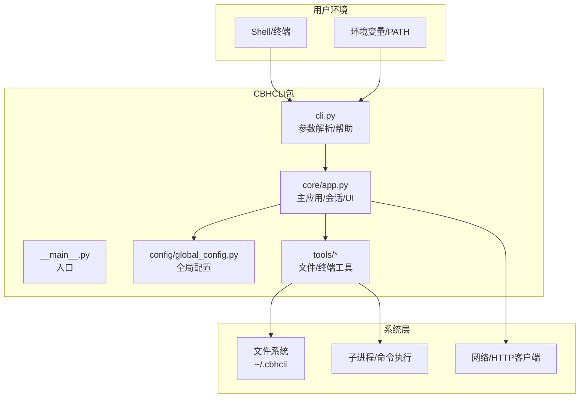
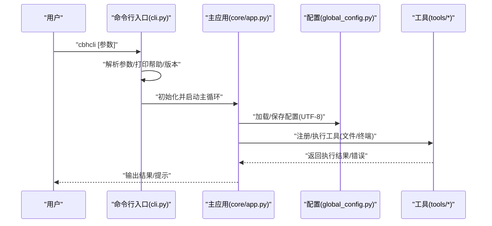
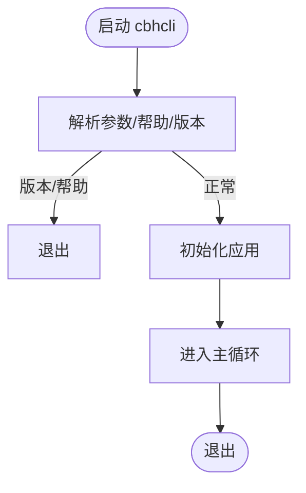
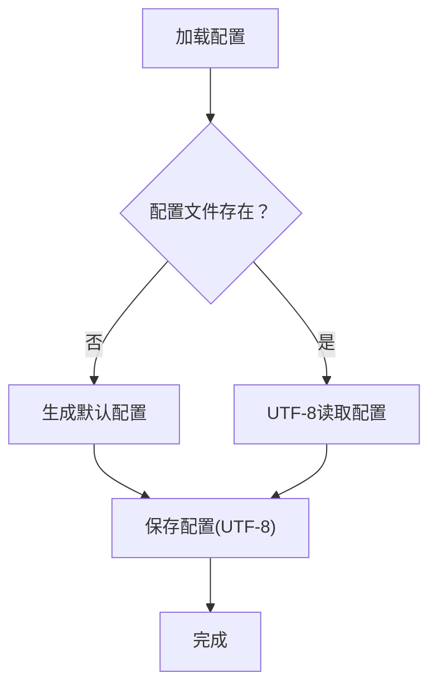
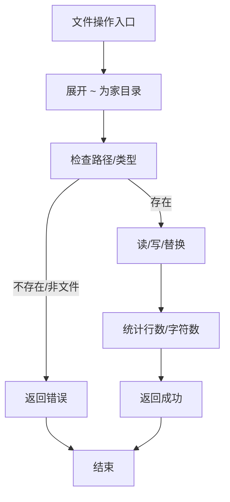
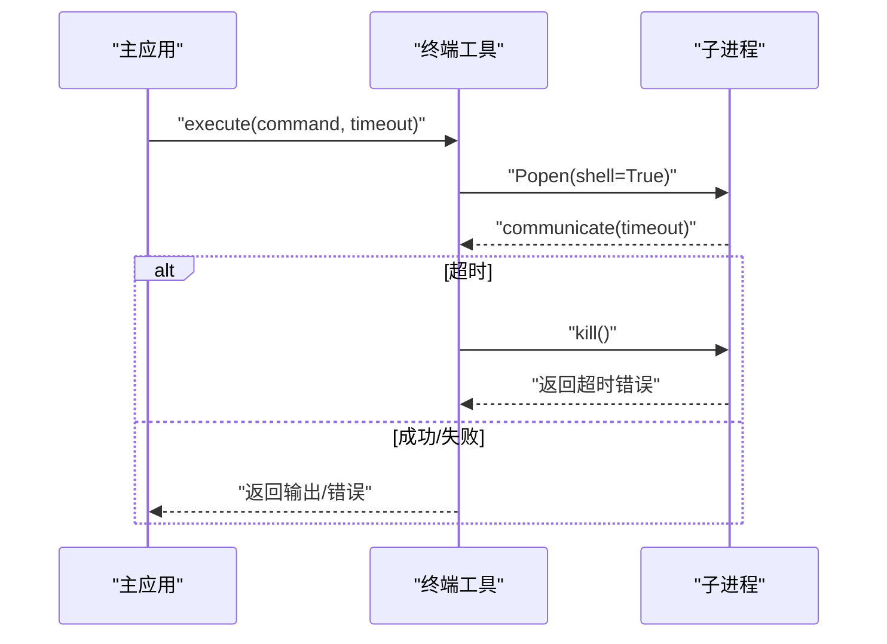
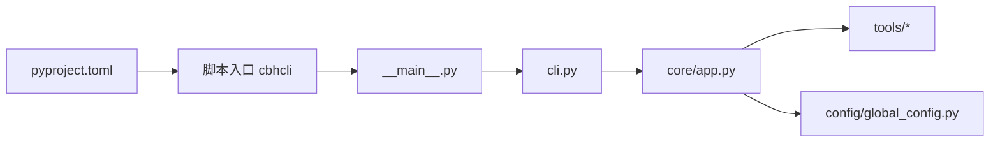

# 平台兼容性

<cite>
**本文引用的文件**   
- [README.md](file://README.md)
- [INSTALL.md](file://INSTALL.md)
- [windows使用注意事项.txt](file://windows使用注意事项.txt)
- [install.sh](file://install.sh)
- [pyproject.toml](file://pyproject.toml)
- [cbhcli_pkg/__main__.py](file://cbhcli_pkg/__main__.py)
- [cbhcli_pkg/cli.py](file://cbhcli_pkg/cli.py)
- [cbhcli_pkg/config/global_config.py](file://cbhcli_pkg/config/global_config.py)
- [cbhcli_pkg/core/app.py](file://cbhcli_pkg/core/app.py)
- [cbhcli_pkg/tools/terminal.py](file://cbhcli_pkg/tools/terminal.py)
- [cbhcli_pkg/tools/file_read.py](file://cbhcli_pkg/tools/file_read.py)
- [cbhcli_pkg/tools/file_write.py](file://cbhcli_pkg/tools/file_write.py)
- [cbhcli_pkg/tools/file_edit.py](file://cbhcli_pkg/tools/file_edit.py)
</cite>

## 目录
1. [简介](#简介)
2. [项目结构](#项目结构)
3. [核心组件](#核心组件)
4. [架构总览](#架构总览)
5. [详细组件分析](#详细组件分析)
6. [依赖分析](#依赖分析)
7. [性能考量](#性能考量)
8. [故障排除指南](#故障排除指南)
9. [结论](#结论)
10. [附录](#附录)

## 简介
本指南聚焦CBHCLI在不同操作系统上的跨平台兼容性问题与排障方法，特别针对Windows用户的常见问题，包括命令行兼容性、路径分隔符、权限模型差异、文件系统与网络配置差异、Shell环境变量与PATH、可执行权限、编码与本地化、容器化与虚拟环境部署等。文档基于仓库中的实际实现与配置文件进行归纳总结，并提供可视化图示与实操建议。

## 项目结构
CBHCLI采用Python包结构组织，核心入口通过脚本注册表项暴露命令；配置统一存放于用户家目录下的隐藏目录；工具与命令系统模块化设计，便于在不同平台保持一致行为。

**图表来源**
- [pyproject.toml:44-45](file://pyproject.toml#L44-L45)
- [cbhcli_pkg/__main__.py:1-7](file://cbhcli_pkg/__main__.py#L1-L7)
- [cbhcli_pkg/cli.py:73-112](file://cbhcli_pkg/cli.py#L73-L112)
- [cbhcli_pkg/core/app.py:54-72](file://cbhcli_pkg/core/app.py#L54-L72)
- [cbhcli_pkg/config/global_config.py:8-11](file://cbhcli_pkg/config/global_config.py#L8-L11)

**章节来源**
- [README.md:269-295](file://README.md#L269-L295)
- [pyproject.toml:44-45](file://pyproject.toml#L44-L45)

## 核心组件
- 入口与参数解析：命令行入口通过脚本注册表项调用，支持版本与帮助输出，未知参数会提示帮助并退出。
- 主应用：负责Agent/会话/工具/向量检索/命令解析的初始化与运行循环。
- 配置管理：统一在用户家目录创建配置目录与文件，使用UTF-8编码读写。
- 工具系统：文件读写/编辑、终端命令执行等，均使用pathlib处理路径，支持~展开。

**章节来源**
- [cbhcli_pkg/cli.py:73-112](file://cbhcli_pkg/cli.py#L73-L112)
- [cbhcli_pkg/core/app.py:54-72](file://cbhcli_pkg/core/app.py#L54-L72)
- [cbhcli_pkg/config/global_config.py:20-54](file://cbhcli_pkg/config/global_config.py#L20-L54)
- [cbhcli_pkg/tools/file_read.py:38-111](file://cbhcli_pkg/tools/file_read.py#L38-L111)
- [cbhcli_pkg/tools/file_write.py:34-82](file://cbhcli_pkg/tools/file_write.py#L34-L82)
- [cbhcli_pkg/tools/file_edit.py:38-134](file://cbhcli_pkg/tools/file_edit.py#L38-L134)

## 架构总览
CBHCLI通过统一的配置目录与工具接口，在不同平台上保持一致的用户体验。关键点：
- 配置路径：统一使用用户家目录下的隐藏目录，避免权限与路径差异带来的问题。
- 路径处理：使用pathlib与~展开，减少平台路径分隔符差异影响。
- 编码策略：配置与文件读写统一采用UTF-8，降低编码问题风险。
- 子进程执行：终端工具通过子进程执行命令，注意超时与错误处理。

**图表来源**
- [cbhcli_pkg/cli.py:73-112](file://cbhcli_pkg/cli.py#L73-L112)
- [cbhcli_pkg/core/app.py:54-72](file://cbhcli_pkg/core/app.py#L54-L72)
- [cbhcli_pkg/config/global_config.py:20-54](file://cbhcli_pkg/config/global_config.py#L20-L54)
- [cbhcli_pkg/tools/terminal.py:31-99](file://cbhcli_pkg/tools/terminal.py#L31-L99)

## 详细组件分析

### 命令行与入口（跨平台差异）
- Windows命令行兼容性：Windows终端默认不支持虚拟终端序列，需通过注册表开启虚拟终端级别以正确渲染颜色与控制序列。
- PATH与可执行：安装后通过脚本注册表项提供命令；若命令不可用，检查PATH或使用用户级安装方式。

**图表来源**
- [cbhcli_pkg/cli.py:73-112](file://cbhcli_pkg/cli.py#L73-L112)
- [cbhcli_pkg/__main__.py:1-7](file://cbhcli_pkg/__main__.py#L1-L7)

**章节来源**
- [INSTALL.md:63-69](file://INSTALL.md#L63-L69)
- [windows使用注意事项.txt:1-2](file://windows使用注意事项.txt#L1-L2)

### 配置与路径（跨平台差异）
- 配置目录：统一在用户家目录创建隐藏目录，避免不同平台权限差异导致的写入失败。
- 路径处理：使用pathlib与~展开，确保在Windows与Unix-like系统上路径一致。
- 编码：配置文件与文件读写统一使用UTF-8，避免编码问题。

**图表来源**
- [cbhcli_pkg/config/global_config.py:20-54](file://cbhcli_pkg/config/global_config.py#L20-L54)

**章节来源**
- [cbhcli_pkg/config/global_config.py:8-11](file://cbhcli_pkg/config/global_config.py#L8-L11)
- [cbhcli_pkg/config/global_config.py:20-54](file://cbhcli_pkg/config/global_config.py#L20-L54)

### 文件工具（跨平台差异）
- 文件读取/写入/编辑：统一使用pathlib与UTF-8，支持~展开；写入前确保父目录存在；读取时对非UTF-8进行错误提示。
- 路径分隔符：pathlib自动处理分隔符差异，避免硬编码分隔符导致的路径问题。

**图表来源**
- [cbhcli_pkg/tools/file_read.py:38-111](file://cbhcli_pkg/tools/file_read.py#L38-L111)
- [cbhcli_pkg/tools/file_write.py:34-82](file://cbhcli_pkg/tools/file_write.py#L34-L82)
- [cbhcli_pkg/tools/file_edit.py:38-134](file://cbhcli_pkg/tools/file_edit.py#L38-L134)

**章节来源**
- [cbhcli_pkg/tools/file_read.py:38-111](file://cbhcli_pkg/tools/file_read.py#L38-L111)
- [cbhcli_pkg/tools/file_write.py:34-82](file://cbhcli_pkg/tools/file_write.py#L34-L82)
- [cbhcli_pkg/tools/file_edit.py:38-134](file://cbhcli_pkg/tools/file_edit.py#L38-L134)

### 终端工具（跨平台差异）
- 子进程执行：通过子进程执行命令，支持超时与错误处理；Windows与Unix-like系统共享同一逻辑。
- 多命令链：支持“&&”连接多个命令，按顺序执行并在单个shell会话中保持状态。

**图表来源**
- [cbhcli_pkg/tools/terminal.py:31-99](file://cbhcli_pkg/tools/terminal.py#L31-L99)

**章节来源**
- [cbhcli_pkg/tools/terminal.py:31-99](file://cbhcli_pkg/tools/terminal.py#L31-L99)

## 依赖分析
- 入口脚本：通过脚本注册表项提供命令，确保跨平台一致的命令名。
- 依赖声明：项目声明核心依赖与可选依赖，构建系统与打包元信息清晰。

**图表来源**
- [pyproject.toml:44-45](file://pyproject.toml#L44-L45)
- [cbhcli_pkg/__main__.py:1-7](file://cbhcli_pkg/__main__.py#L1-L7)
- [cbhcli_pkg/cli.py:73-112](file://cbhcli_pkg/cli.py#L73-L112)

**章节来源**
- [pyproject.toml:1-53](file://pyproject.toml#L1-L53)

## 性能考量
- 启动时避免自动索引：向量索引需手动触发，减少启动时间与API调用。
- 自动上下文压缩：接近上下文阈值时自动压缩，降低长对话的内存与处理压力。
- 超时控制：终端工具设置超时，避免长时间阻塞。

**章节来源**
- [README.md:210-229](file://README.md#L210-L229)
- [cbhcli_pkg/core/app.py:361-385](file://cbhcli_pkg/core/app.py#L361-L385)
- [cbhcli_pkg/tools/terminal.py:56-66](file://cbhcli_pkg/tools/terminal.py#L56-L66)

## 故障排除指南

### Windows 专用问题
- 控制台颜色与ANSI转义
  - 现象：颜色显示异常或控制序列不生效。
  - 解决：在注册表中启用虚拟终端级别，使Windows终端支持ANSI转义序列。
  - 参考：[windows使用注意事项.txt:1-2](file://windows使用注意事项.txt#L1-L2)
- 命令不可用或找不到
  - 现象：安装后无法通过命令运行。
  - 排查：确认安装目录在PATH中；优先使用用户级安装；重启终端后再试。
  - 参考：[INSTALL.md:63-69](file://INSTALL.md#L63-L69)
- 路径与分隔符
  - 现象：路径拼接错误或文件访问失败。
  - 解决：使用pathlib与~展开，避免硬编码分隔符；确保使用UTF-8编码读写。
  - 参考：[cbhcli_pkg/config/global_config.py:20-54](file://cbhcli_pkg/config/global_config.py#L20-L54)

### Unix-like 系统（Linux/macOS）
- PATH与可执行权限
  - 现象：命令不可用或权限不足。
  - 解决：确保安装路径在PATH中；必要时使用用户级安装；检查脚本可执行权限。
  - 参考：[install.sh:1-29](file://install.sh#L1-L29)
- 终端交互与信号
  - 现象：中断/退出键行为异常。
  - 解决：使用交互式终端；确保信号处理正常；必要时调整终端设置。
  - 参考：[cbhcli_pkg/core/app.py:386-421](file://cbhcli_pkg/core/app.py#L386-L421)

### 编码与本地化
- 统一编码：配置与文件读写使用UTF-8，避免不同区域设置导致的乱码。
- 本地化提示：错误与输出使用中文，便于理解。
- 参考：[cbhcli_pkg/config/global_config.py:24-54](file://cbhcli_pkg/config/global_config.py#L24-L54)

### 安装与配置最佳实践
- 虚拟环境：在隔离环境中安装，避免系统依赖冲突。
- 可选依赖：根据需要安装向量数据库与token计数依赖。
- 参考：[README.md:54-61](file://README.md#L54-L61)

### 容器化与虚拟环境
- 容器镜像：建议在容器内以非root用户运行，挂载用户配置目录至家目录，保证持久化与权限可控。
- 虚拟环境：使用Python虚拟环境隔离依赖，避免与系统Python冲突。
- 参考：[README.md:297-314](file://README.md#L297-L314)

### 常见问题定位清单
- 配置读写失败：检查家目录权限与磁盘空间；确认UTF-8编码。
- 文件操作异常：确认路径存在且为文件；检查编码是否为UTF-8。
- 终端命令超时/失败：调整超时时间；检查命令语法与权限。
- 向量索引不可用：确认嵌入模型配置；手动触发索引。
- 参考：[cbhcli_pkg/tools/file_read.py:113-124](file://cbhcli_pkg/tools/file_read.py#L113-L124), [cbhcli_pkg/tools/terminal.py:56-99](file://cbhcli_pkg/tools/terminal.py#L56-L99)

## 结论
CBHCLI通过统一的配置目录、pathlib路径处理与UTF-8编码策略，在不同平台提供了较为一致的行为。Windows用户需关注控制台ANSI支持与PATH配置，Unix-like系统则需重视信号处理与可执行权限。遵循本文提供的排障步骤与最佳实践，可显著提升跨平台稳定性与用户体验。

## 附录
- 快速检查清单
  - Windows：注册表启用虚拟终端级别；确认PATH；使用用户级安装。
  - Unix-like：检查PATH与可执行权限；在虚拟环境中运行。
  - 编码：确保UTF-8；避免非UTF-8文件。
  - 容器：映射家目录；非root运行；按需安装可选依赖。