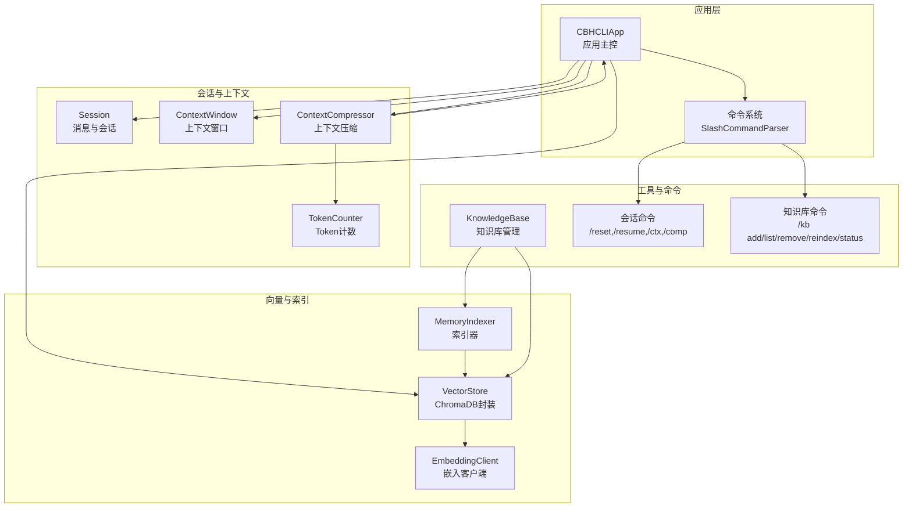
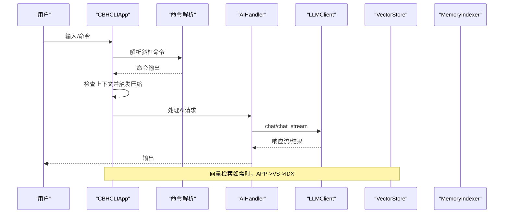
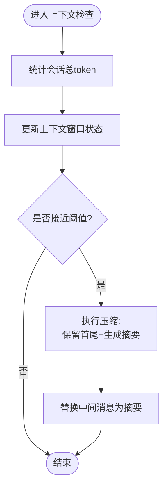
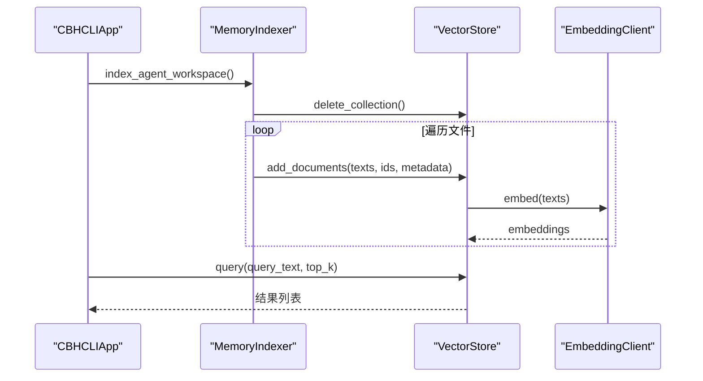
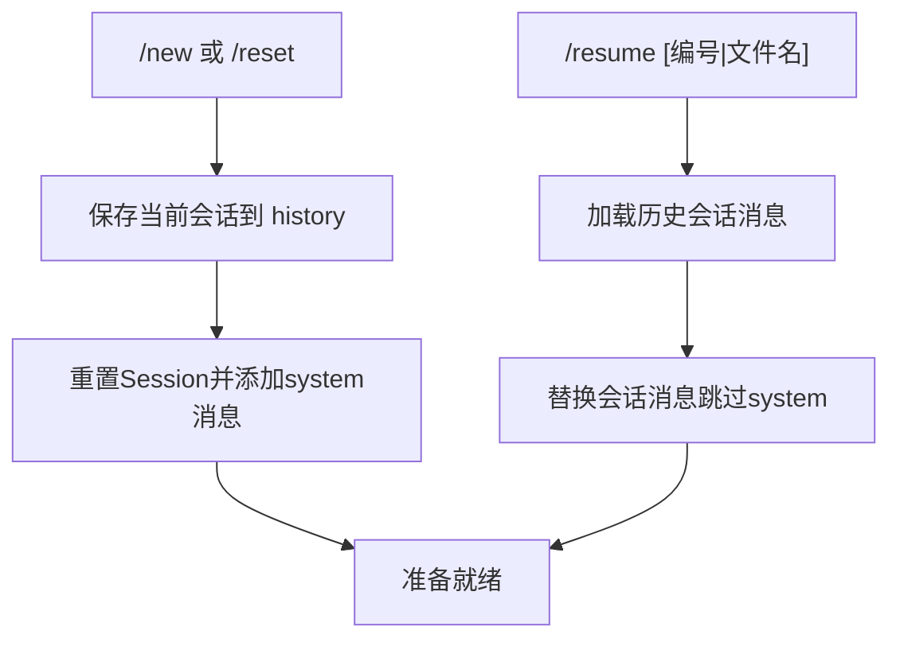
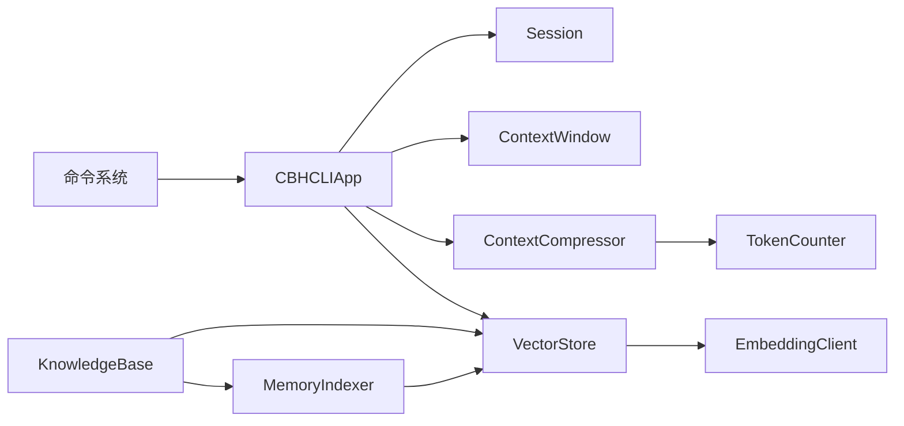

# 性能问题

<cite>
**本文引用的文件**   
- [README.md](file://README.md)
- [cbhcli_pkg/core/app.py](file://cbhcli_pkg/core/app.py)
- [cbhcli_pkg/core/session.py](file://cbhcli_pkg/core/session.py)
- [cbhcli_pkg/context/compressor.py](file://cbhcli_pkg/context/compressor.py)
- [cbhcli_pkg/context/token_counter.py](file://cbhcli_pkg/context/token_counter.py)
- [cbhcli_pkg/core/model.py](file://cbhcli_pkg/core/model.py)
- [cbhcli_pkg/core/embedding_client.py](file://cbhcli_pkg/core/embedding_client.py)
- [cbhcli_pkg/vector/store.py](file://cbhcli_pkg/vector/store.py)
- [cbhcli_pkg/vector/indexer.py](file://cbhcli_pkg/vector/indexer.py)
- [cbhcli_pkg/core/knowledge_base.py](file://cbhcli_pkg/core/knowledge_base.py)
- [cbhcli_pkg/commands/session_cmd.py](file://cbhcli_pkg/commands/session_cmd.py)
- [cbhcli_pkg/commands/kb_cmd.py](file://cbhcli_pkg/commands/kb_cmd.py)
- [cbhcli_pkg/core/session_history.py](file://cbhcli_pkg/core/session_history.py)
</cite>

## 目录
1. [简介](#简介)
2. [项目结构](#项目结构)
3. [核心组件](#核心组件)
4. [架构总览](#架构总览)
5. [详细组件分析](#详细组件分析)
6. [依赖分析](#依赖分析)
7. [性能考量](#性能考量)
8. [故障排查指南](#故障排查指南)
9. [结论](#结论)
10. [附录](#附录)

## 简介
本指南聚焦CBHCLI在实际使用中可能遇到的性能问题，包括响应缓慢、内存占用过高、CPU使用率异常等，并给出系统化的诊断与优化策略。重点覆盖以下方面：
- 上下文压缩机制的工作原理与优化（token计数准确性、压缩算法与阈值调整）
- 向量数据库查询性能优化（索引策略、查询优化、缓存机制）
- 内存泄漏检测与处理（会话清理、资源释放、垃圾回收优化）
- 并发与异步最佳实践
- 性能监控工具与关键指标解读
- 硬件配置建议与系统资源优化

## 项目结构
CBHCLI采用模块化设计，围绕“应用主控、会话与上下文、上下文压缩与计数、向量数据库与索引、工具与命令”等维度组织代码。关键模块职责如下：
- 应用主控：负责初始化、Agent加载、命令解析、运行循环、上下文压缩触发
- 会话与上下文：消息结构、上下文窗口、历史管理
- 上下文压缩与计数：基于LLM的摘要生成、token估算与精确计数
- 向量数据库与索引：ChromaDB封装、嵌入向量计算、索引与查询
- 工具与命令：斜杠命令注册与执行，KB与会话相关命令

**图表来源**
- [cbhcli_pkg/core/app.py:54-478](file://cbhcli_pkg/core/app.py#L54-L478)
- [cbhcli_pkg/core/session.py:37-190](file://cbhcli_pkg/core/session.py#L37-L190)
- [cbhcli_pkg/context/compressor.py:7-112](file://cbhcli_pkg/context/compressor.py#L7-L112)
- [cbhcli_pkg/context/token_counter.py:14-88](file://cbhcli_pkg/context/token_counter.py#L14-L88)
- [cbhcli_pkg/vector/store.py:37-175](file://cbhcli_pkg/vector/store.py#L37-L175)
- [cbhcli_pkg/vector/indexer.py:7-178](file://cbhcli_pkg/vector/indexer.py#L7-L178)
- [cbhcli_pkg/core/knowledge_base.py:7-207](file://cbhcli_pkg/core/knowledge_base.py#L7-L207)
- [cbhcli_pkg/commands/session_cmd.py:5-183](file://cbhcli_pkg/commands/session_cmd.py#L5-L183)
- [cbhcli_pkg/commands/kb_cmd.py:5-186](file://cbhcli_pkg/commands/kb_cmd.py#L5-L186)

**章节来源**
- [README.md: 项目结构与特性:269-295](file://README.md#L269-L295)
- [cbhcli_pkg/core/app.py: 应用初始化与模块装配:64-161](file://cbhcli_pkg/core/app.py#L64-L161)

## 核心组件
- 应用主控（CBHCLIApp）：负责配置加载、Agent管理、命令注册、运行循环；在AI请求处理前触发上下文检查与压缩；按需初始化向量存储与索引器。
- 会话与上下文（Session/ContextWindow）：维护消息列表与token统计，提供上下文使用百分比、剩余token、触发阈值等状态信息。
- 上下文压缩（ContextCompressor）：基于LLM对中间对话生成摘要，保留首尾若干轮对话，降低整体token占用。
- Token计数（TokenCounter）：优先使用tiktoken进行精确计数，降级为估算策略，支持消息级token统计。
- 向量存储（VectorStore）：封装ChromaDB持久化客户端，提供集合管理、批量嵌入计算、查询接口。
- 索引器（MemoryIndexer）：将Agent工作空间文件切分为段落并写入向量库，支持增量更新与删除集合。
- 嵌入客户端（EmbeddingClient）：支持OpenAI兼容与自定义API，提供批量嵌入与单条嵌入能力。
- 知识库（KnowledgeBase）：文件增删与重新索引，对接向量存储与索引器。
- 命令系统：会话与KB相关命令，提供上下文状态查看、手动压缩、索引状态与重建等。

**章节来源**
- [cbhcli_pkg/core/app.py: 应用主控与模块装配:54-161](file://cbhcli_pkg/core/app.py#L54-L161)
- [cbhcli_pkg/core/session.py: 会话与上下文窗口:37-190](file://cbhcli_pkg/core/session.py#L37-L190)
- [cbhcli_pkg/context/compressor.py: 上下文压缩:7-112](file://cbhcli_pkg/context/compressor.py#L7-L112)
- [cbhcli_pkg/context/token_counter.py: Token计数:14-88](file://cbhcli_pkg/context/token_counter.py#L14-L88)
- [cbhcli_pkg/vector/store.py: 向量存储:37-175](file://cbhcli_pkg/vector/store.py#L37-L175)
- [cbhcli_pkg/vector/indexer.py: 索引器:7-178](file://cbhcli_pkg/vector/indexer.py#L7-L178)
- [cbhcli_pkg/core/embedding_client.py: 嵌入客户端:6-132](file://cbhcli_pkg/core/embedding_client.py#L6-L132)
- [cbhcli_pkg/core/knowledge_base.py: 知识库:7-207](file://cbhcli_pkg/core/knowledge_base.py#L7-L207)
- [cbhcli_pkg/commands/session_cmd.py: 会话命令:5-183](file://cbhcli_pkg/commands/session_cmd.py#L5-L183)
- [cbhcli_pkg/commands/kb_cmd.py: 知识库命令:5-186](file://cbhcli_pkg/commands/kb_cmd.py#L5-L186)

## 架构总览
CBHCLI的性能瓶颈通常集中在三处：
- 上下文过大导致LLM调用超时或成本上升
- 向量索引与查询的I/O与网络延迟
- 会话历史与工具执行产生的内存累积

**图表来源**
- [cbhcli_pkg/core/app.py: 运行循环与AI请求处理:386-440](file://cbhcli_pkg/core/app.py#L386-L440)
- [cbhcli_pkg/core/model.py: LLMClient调用:28-147](file://cbhcli_pkg/core/model.py#L28-L147)
- [cbhcli_pkg/vector/store.py: VectorStore查询:128-160](file://cbhcli_pkg/vector/store.py#L128-L160)
- [cbhcli_pkg/vector/indexer.py: MemoryIndexer索引:37-178](file://cbhcli_pkg/vector/indexer.py#L37-L178)

## 详细组件分析

### 上下文压缩机制
- 工作原理
  - 保留system消息与首尾若干轮对话，对中间对话生成摘要并替换为一条summary消息，从而显著降低token占用。
  - 压缩阈值由模型上下文限制与压缩比例共同决定，接近阈值时自动触发。
- 关键实现点
  - 上下文窗口根据会话总token动态更新使用率与剩余token，提供状态文本与阈值计算。
  - 压缩器对conversation消息分段，构造摘要提示词，调用LLM生成摘要并替换中间消息。
  - Token计数器支持精确与估算两种模式，消息级统计包含基础开销。
- 优化策略
  - 调整压缩比例（默认80%），在稳定性与token节省之间权衡。
  - 在高频长对话场景下，适当减少保留的早期轮次，提升压缩效率。
  - 使用更高效的编码器（如tiktoken）以提升计数精度与速度。
  - 控制摘要生成的温度参数，平衡一致性与多样性。

**图表来源**
- [cbhcli_pkg/core/session.py: 上下文窗口与状态:127-190](file://cbhcli_pkg/core/session.py#L127-L190)
- [cbhcli_pkg/context/compressor.py: 压缩逻辑:21-81](file://cbhcli_pkg/context/compressor.py#L21-L81)
- [cbhcli_pkg/context/token_counter.py: 消息级token统计:60-75](file://cbhcli_pkg/context/token_counter.py#L60-L75)

**章节来源**
- [cbhcli_pkg/core/session.py: 上下文窗口:127-190](file://cbhcli_pkg/core/session.py#L127-L190)
- [cbhcli_pkg/context/compressor.py: 压缩器:7-112](file://cbhcli_pkg/context/compressor.py#L7-L112)
- [cbhcli_pkg/context/token_counter.py: Token计数:14-88](file://cbhcli_pkg/context/token_counter.py#L14-L88)
- [cbhcli_pkg/commands/session_cmd.py: /ctx与/comp命令:117-182](file://cbhcli_pkg/commands/session_cmd.py#L117-L182)

### 向量数据库查询性能优化
- 索引策略
  - 文件按段落切分，生成稳定ID，便于增量更新与去重。
  - 索引前删除旧集合，确保内容变更后的正确性。
  - 支持Agent标准文件与知识库目录的统一索引。
- 查询优化
  - 预先计算文档与查询向量，避免ChromaDB内部默认模型调用。
  - 限制返回结果数量（top_k），减少网络与解码开销。
- 缓存机制
  - 向量库持久化目录避免重复索引带来的网络与时间消耗。
  - 建议在频繁查询场景下结合本地缓存与结果去重策略。
- 命令与状态
  - 提供索引、状态查询、清除与重建命令，便于运维与排障。

**图表来源**
- [cbhcli_pkg/vector/indexer.py: 索引流程:37-134](file://cbhcli_pkg/vector/indexer.py#L37-L134)
- [cbhcli_pkg/vector/store.py: add_documents/query:99-160](file://cbhcli_pkg/vector/store.py#L99-L160)
- [cbhcli_pkg/core/embedding_client.py: 嵌入批量处理:49-113](file://cbhcli_pkg/core/embedding_client.py#L49-L113)
- [cbhcli_pkg/commands/kb_cmd.py: /kb reindex/status:126-185](file://cbhcli_pkg/commands/kb_cmd.py#L126-L185)

**章节来源**
- [cbhcli_pkg/vector/indexer.py: 索引器:7-178](file://cbhcli_pkg/vector/indexer.py#L7-L178)
- [cbhcli_pkg/vector/store.py: 向量存储:37-175](file://cbhcli_pkg/vector/store.py#L37-L175)
- [cbhcli_pkg/core/embedding_client.py: 嵌入客户端:6-132](file://cbhcli_pkg/core/embedding_client.py#L6-L132)
- [cbhcli_pkg/core/knowledge_base.py: 知识库索引:151-207](file://cbhcli_pkg/core/knowledge_base.py#L151-L207)
- [cbhcli_pkg/commands/kb_cmd.py: 知识库命令:5-186](file://cbhcli_pkg/commands/kb_cmd.py#L5-L186)

### 会话与历史管理
- 会话重置与保存：每次/new或/reset时自动保存当前会话至history目录，支持/resume恢复。
- 历史列表与加载：按时间倒序列出，支持按编号或文件名恢复。
- 会话清理：重置时保留system消息，其余清空；Python会话变量在重置时清理。

**图表来源**
- [cbhcli_pkg/commands/session_cmd.py: 会话命令:8-102](file://cbhcli_pkg/commands/session_cmd.py#L8-L102)
- [cbhcli_pkg/core/session_history.py: 会话历史管理:8-136](file://cbhcli_pkg/core/session_history.py#L8-L136)
- [cbhcli_pkg/core/app.py: 会话重置与保存:281-331](file://cbhcli_pkg/core/app.py#L281-L331)

**章节来源**
- [cbhcli_pkg/commands/session_cmd.py: 会话命令:5-183](file://cbhcli_pkg/commands/session_cmd.py#L5-L183)
- [cbhcli_pkg/core/session_history.py: 会话历史:8-136](file://cbhcli_pkg/core/session_history.py#L8-L136)
- [cbhcli_pkg/core/app.py: 会话重置:281-331](file://cbhcli_pkg/core/app.py#L281-L331)

### 并发与异步最佳实践
- 流式响应：LLMClient支持流式chat_stream，逐块输出delta，降低首包延迟与感知等待时间。
- 批量嵌入：EmbeddingClient按批次处理文本，减少API调用次数与网络往返。
- 会话与工具执行：在AI请求处理前进行上下文检查与压缩，避免后续调用因超限失败。
- 建议
  - 在工具执行与向量查询中引入异步队列与超时控制，避免阻塞主线程。
  - 对高频查询结果进行轻量缓存（进程内），结合去重策略减少重复计算。

**章节来源**
- [cbhcli_pkg/core/model.py: 流式与非流式调用:28-147](file://cbhcli_pkg/core/model.py#L28-L147)
- [cbhcli_pkg/core/embedding_client.py: 批处理嵌入:49-113](file://cbhcli_pkg/core/embedding_client.py#L49-L113)
- [cbhcli_pkg/core/app.py: AI请求处理与上下文检查:422-440](file://cbhcli_pkg/core/app.py#L422-L440)

## 依赖分析
- 模块耦合
  - CBHCLIApp依赖会话、上下文窗口、压缩器、向量存储与索引器；命令系统依赖应用实例以执行具体操作。
  - Token计数器与LLM客户端贯穿上下文与向量查询两端，是性能敏感点。
- 外部依赖
  - ChromaDB用于向量持久化；requests用于HTTP调用；tiktoken用于精确token计数（可选）。
- 潜在风险
  - 向量查询与嵌入计算受网络与API速率限制影响；会话消息过多会导致LLM调用失败或超时。

**图表来源**
- [cbhcli_pkg/core/app.py:54-161](file://cbhcli_pkg/core/app.py#L54-L161)
- [cbhcli_pkg/context/compressor.py:7-20](file://cbhcli_pkg/context/compressor.py#L7-L20)
- [cbhcli_pkg/context/token_counter.py:14-33](file://cbhcli_pkg/context/token_counter.py#L14-L33)
- [cbhcli_pkg/vector/store.py:37-62](file://cbhcli_pkg/vector/store.py#L37-L62)
- [cbhcli_pkg/vector/indexer.py:7-36](file://cbhcli_pkg/vector/indexer.py#L7-L36)
- [cbhcli_pkg/core/knowledge_base.py:16-29](file://cbhcli_pkg/core/knowledge_base.py#L16-L29)

**章节来源**
- [cbhcli_pkg/core/app.py: 模块装配:54-161](file://cbhcli_pkg/core/app.py#L54-L161)
- [cbhcli_pkg/vector/store.py: 客户端初始化:64-77](file://cbhcli_pkg/vector/store.py#L64-L77)

## 性能考量
- 响应缓慢
  - 检查上下文使用率与阈值，必要时降低压缩比例或提前触发压缩。
  - 使用流式响应减少首包延迟；对长文本输出进行分片展示。
  - 优化嵌入与查询的批次大小，减少API调用次数。
- 内存占用过高
  - 定期执行/resume清理不再使用的会话；重置会话时清理Python会话变量。
  - 控制向量库规模，定期清理无用集合与文档。
- CPU使用率异常
  - 降低LLM温度参数与复杂度；减少不必要的摘要生成。
  - 对高频查询结果进行缓存与去重，减少重复计算。
- 硬件与系统优化
  - 为向量库与日志分配足够磁盘空间；确保网络稳定与低延迟。
  - 在容器或云环境中为向量数据库与模型API设置合理的超时与重试策略。

[本节为通用指导，不直接分析具体文件]

## 故障排查指南
- 上下文压缩无效
  - 检查会话消息数量是否少于阈值；确认自动压缩开关与压缩比例配置。
  - 使用/ctx查看上下文使用率与剩余token，确认是否接近阈值。
- 向量索引失败
  - 确认嵌入模型配置正确；检查向量存储初始化与集合创建。
  - 使用/embedding status查看索引状态；必要时执行/embedding reindex。
- 会话恢复失败
  - 检查history目录是否存在与权限；确认文件名或编号有效。
  - 使用/history列出会话，核对时间与消息数。
- 嵌入或查询超时
  - 检查网络连通性与API密钥；调整超时参数与重试策略。
  - 降低top_k与批次大小，缓解网络与计算压力。

**章节来源**
- [cbhcli_pkg/commands/session_cmd.py: 会话命令与状态:117-182](file://cbhcli_pkg/commands/session_cmd.py#L117-L182)
- [cbhcli_pkg/commands/kb_cmd.py: 知识库命令与状态:147-185](file://cbhcli_pkg/commands/kb_cmd.py#L147-L185)
- [cbhcli_pkg/core/session_history.py: 会话历史管理:66-136](file://cbhcli_pkg/core/session_history.py#L66-L136)
- [cbhcli_pkg/vector/store.py: 查询与计数:128-175](file://cbhcli_pkg/vector/store.py#L128-L175)

## 结论
CBHCLI的性能优化应围绕“上下文控制、向量索引与查询、会话生命周期管理”三大支柱展开。通过合理配置压缩比例、优化嵌入与查询批次、规范会话清理与历史管理，可在保证功能完整性的同时显著提升响应速度与资源利用率。建议在生产环境中结合监控指标与日志分析，持续迭代阈值与策略，以适应不同业务场景的负载特征。

[本节为总结，不直接分析具体文件]

## 附录
- 关键命令参考
  - 会话：/new、/reset、/resume、/history、/comp、/ctx
  - 知识库：/kb add、/kb list、/kb remove、/kb reindex、/kb status
  - 向量索引：/embedding index、/embedding status、/embedding clear、/embedding reindex
- 重要配置项
  - 全局设置：auto_compress、compression_ratio、workspace_base
  - 模型配置：context_limit、model、apiKey、url
  - 嵌入模型：model、type、apiKey、url
- 依赖安装
  - 向量数据库：pip install chromadb
  - 精确token计数：pip install tiktoken

**章节来源**
- [README.md: 命令参考与配置:231-229](file://README.md#L231-L229)
- [README.md: 全局配置示例:150-190](file://README.md#L150-L190)