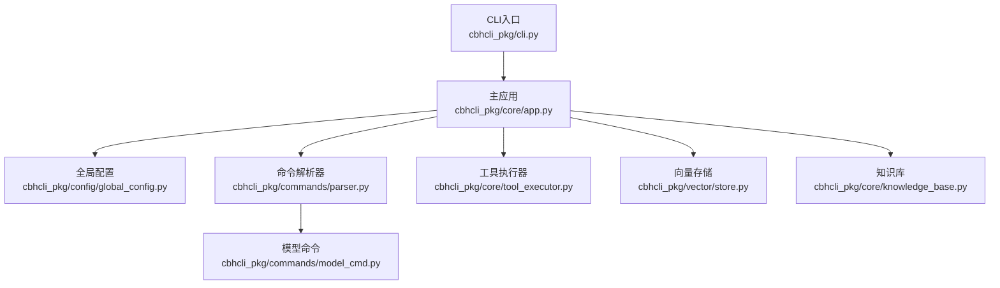
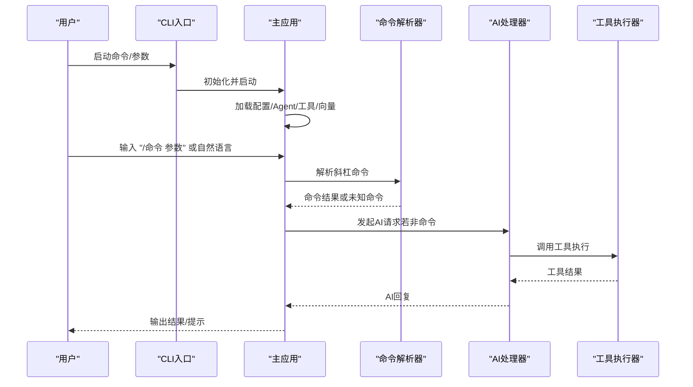
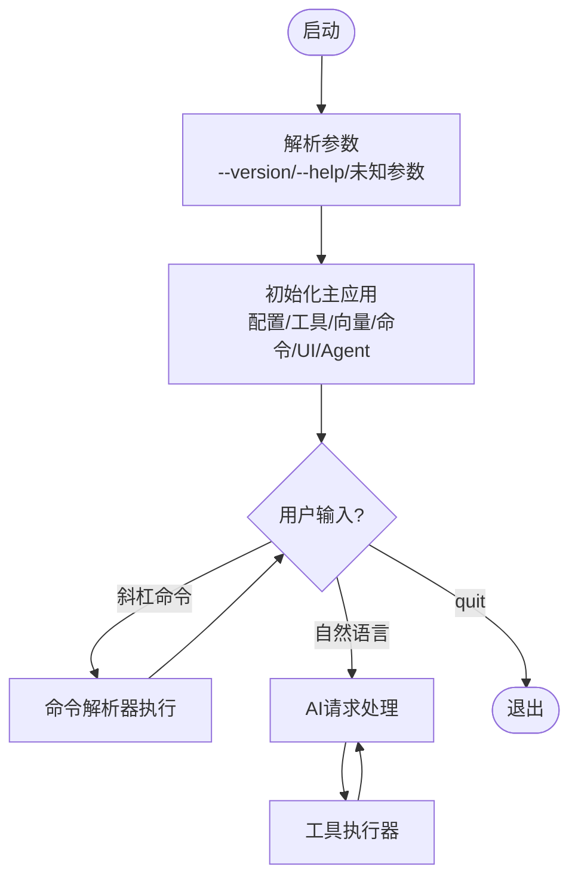
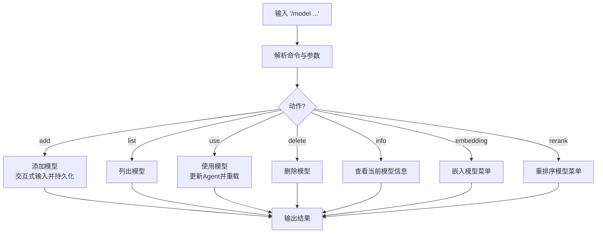
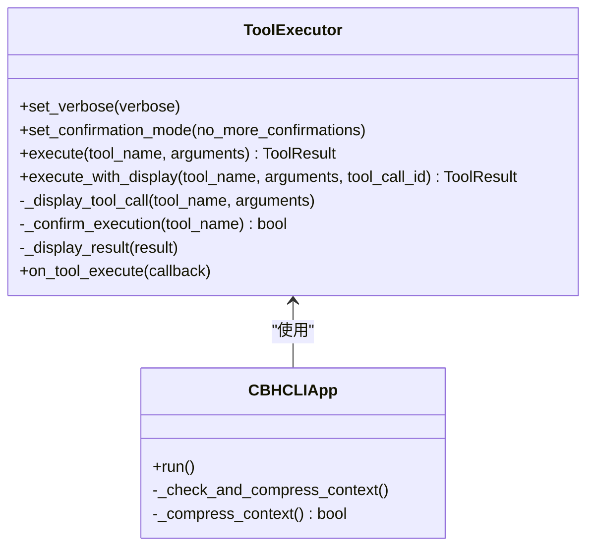
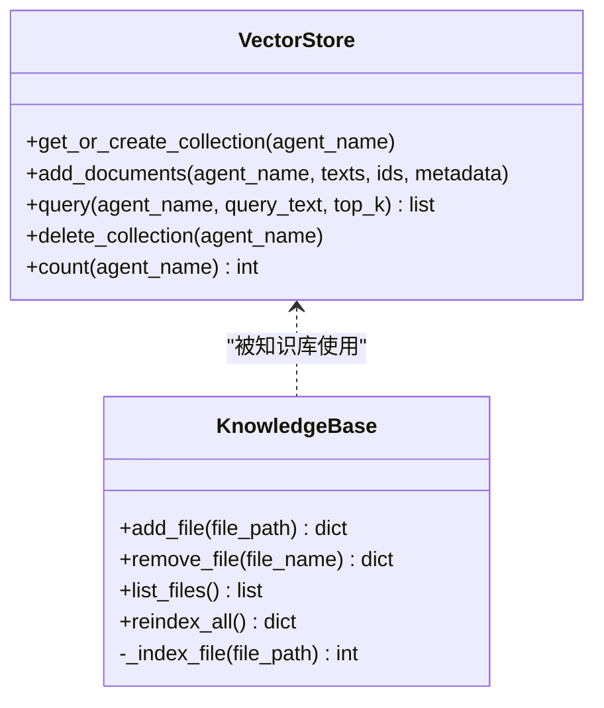
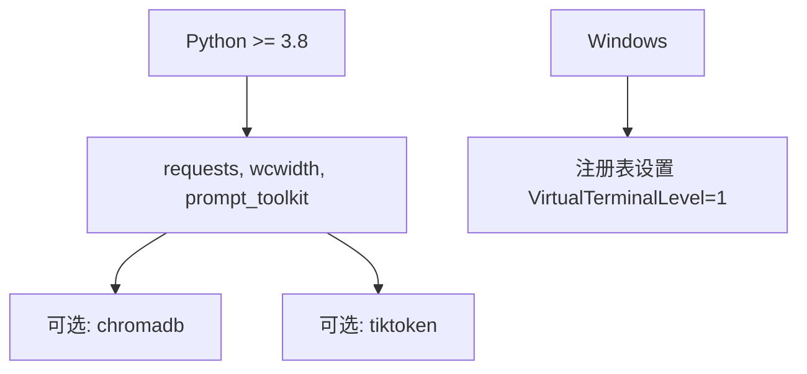

# 故障排除

<cite>
**本文引用的文件**
- [README.md](file://README.md)
- [INSTALL.md](file://INSTALL.md)
- [windows使用注意事项.txt](file://windows使用注意事项.txt)
- [requirements.txt](file://requirements.txt)
- [pyproject.toml](file://pyproject.toml)
- [cbhcli_pkg/cli.py](file://cbhcli_pkg/cli.py)
- [cbhcli_pkg/__main__.py](file://cbhcli_pkg/__main__.py)
- [cbhcli_pkg/core/app.py](file://cbhcli_pkg/core/app.py)
- [cbhcli_pkg/config/global_config.py](file://cbhcli_pkg/config/global_config.py)
- [cbhcli_pkg/core/errors.py](file://cbhcli_pkg/core/errors.py)
- [cbhcli_pkg/core/tool_executor.py](file://cbhcli_pkg/core/tool_executor.py)
- [cbhcli_pkg/commands/parser.py](file://cbhcli_pkg/commands/parser.py)
- [cbhcli_pkg/commands/model_cmd.py](file://cbhcli_pkg/commands/model_cmd.py)
- [cbhcli_pkg/core/knowledge_base.py](file://cbhcli_pkg/core/knowledge_base.py)
- [cbhcli_pkg/vector/store.py](file://cbhcli_pkg/vector/store.py)
</cite>

## 目录
1. [简介](#简介)
2. [项目结构](#项目结构)
3. [核心组件](#核心组件)
4. [架构总览](#架构总览)
5. [详细组件分析](#详细组件分析)
6. [依赖分析](#依赖分析)
7. [性能考虑](#性能考虑)
8. [故障排除指南](#故障排除指南)
9. [结论](#结论)
10. [附录](#附录)

## 简介
本指南面向使用 CBHCLI 的用户与开发者，提供系统化的故障排除方法与最佳实践。内容涵盖安装问题、配置错误、运行时异常、性能问题、跨平台兼容性、数据恢复与系统修复、以及社区支持渠道。读者可据此快速定位问题、验证配置、优化性能，并在必要时进行数据恢复与系统修复。

## 项目结构
CBHCLI 采用模块化设计，核心围绕“应用主循环”“命令解析与路由”“工具执行器”“配置管理”“向量存储与索引”展开。主要模块职责如下：
- CLI 入口与参数解析：负责版本/帮助输出与启动主应用。
- 应用主循环：负责 Agent 加载、会话管理、上下文压缩、命令分发与错误兜底。
- 命令系统：斜杠命令解析器与各子命令注册器（模型、知识库、嵌入、会话、MCP 等）。
- 工具系统：工具注册中心与执行器，支持确认、预览、详细输出与回调。
- 配置系统：全局配置与 Agent 配置持久化，支持模型、嵌入模型、重排序模型与设置项。
- 向量存储：ChromaDB 封装与自定义嵌入函数，支持查询与集合管理。

**图示来源**
- [cbhcli_pkg/cli.py:73-112](file://cbhcli_pkg/cli.py#L73-L112)
- [cbhcli_pkg/core/app.py:54-478](file://cbhcli_pkg/core/app.py#L54-L478)
- [cbhcli_pkg/config/global_config.py:13-154](file://cbhcli_pkg/config/global_config.py#L13-L154)
- [cbhcli_pkg/commands/parser.py:16-94](file://cbhcli_pkg/commands/parser.py#L16-L94)
- [cbhcli_pkg/commands/model_cmd.py:5-371](file://cbhcli_pkg/commands/model_cmd.py#L5-L371)
- [cbhcli_pkg/core/tool_executor.py:15-168](file://cbhcli_pkg/core/tool_executor.py#L15-L168)
- [cbhcli_pkg/vector/store.py:37-175](file://cbhcli_pkg/vector/store.py#L37-L175)
- [cbhcli_pkg/core/knowledge_base.py:7-207](file://cbhcli_pkg/core/knowledge_base.py#L7-L207)

**章节来源**
- [README.md:269-295](file://README.md#L269-L295)
- [pyproject.toml:44-45](file://pyproject.toml#L44-L45)

## 核心组件
- CLI 入口与参数解析：处理 --version/--help 与未知参数，启动主应用并在异常时输出错误信息。
- 主应用（CBHCLIApp）：初始化配置、工具、向量存储、命令、UI、Agent；维护会话与上下文窗口；调度 AI 请求与工具执行。
- 命令解析器：统一解析“/命令 参数”，分发到对应处理器；提供帮助文本与未知命令提示。
- 工具执行器：负责工具调用前确认、执行、结果展示与回调；支持详细/简洁模式切换。
- 全局配置：集中管理模型、嵌入模型、重排序模型、Agent 与设置项；提供默认值与持久化。
- 向量存储：封装 ChromaDB，使用自定义嵌入函数；支持集合创建、文档增删、查询与计数。
- 知识库：管理 Agent 知识库目录、文件增删、索引与状态查询。

**章节来源**
- [cbhcli_pkg/cli.py:73-112](file://cbhcli_pkg/cli.py#L73-L112)
- [cbhcli_pkg/core/app.py:54-478](file://cbhcli_pkg/core/app.py#L54-L478)
- [cbhcli_pkg/commands/parser.py:16-94](file://cbhcli_pkg/commands/parser.py#L16-L94)
- [cbhcli_pkg/core/tool_executor.py:15-168](file://cbhcli_pkg/core/tool_executor.py#L15-L168)
- [cbhcli_pkg/config/global_config.py:13-154](file://cbhcli_pkg/config/global_config.py#L13-L154)
- [cbhcli_pkg/vector/store.py:37-175](file://cbhcli_pkg/vector/store.py#L37-L175)
- [cbhcli_pkg/core/knowledge_base.py:7-207](file://cbhcli_pkg/core/knowledge_base.py#L7-L207)

## 架构总览
CBHCLI 的运行时控制流如下：CLI 接收参数并启动主应用；主应用加载配置与 Agent，初始化工具与向量能力；进入交互循环，解析斜杠命令或转交 AI 处理器；AI 处理器根据上下文与工具执行器协作完成任务；异常在各层被捕获并友好提示。

**图示来源**
- [cbhcli_pkg/cli.py:73-112](file://cbhcli_pkg/cli.py#L73-L112)
- [cbhcli_pkg/core/app.py:386-440](file://cbhcli_pkg/core/app.py#L386-L440)
- [cbhcli_pkg/commands/parser.py:51-78](file://cbhcli_pkg/commands/parser.py#L51-L78)
- [cbhcli_pkg/core/tool_executor.py:42-92](file://cbhcli_pkg/core/tool_executor.py#L42-L92)

## 详细组件分析

### CLI 与主应用
- CLI 入口负责参数解析与版本/帮助输出；异常捕获后输出错误并退出。
- 主应用负责初始化配置、Agent、工具、向量存储、命令与 UI；在运行循环中处理用户输入、命令与 AI 请求；对上下文进行检查与压缩；对异常进行兜底输出。

**图示来源**
- [cbhcli_pkg/cli.py:73-112](file://cbhcli_pkg/cli.py#L73-L112)
- [cbhcli_pkg/core/app.py:386-440](file://cbhcli_pkg/core/app.py#L386-L440)

**章节来源**
- [cbhcli_pkg/cli.py:73-112](file://cbhcli_pkg/cli.py#L73-L112)
- [cbhcli_pkg/core/app.py:54-478](file://cbhcli_pkg/core/app.py#L54-L478)

### 命令解析与模型配置
- 命令解析器统一解析“/命令 参数”，执行后返回成功/失败与输出；未知命令提示帮助。
- 模型命令支持添加/列出/使用/删除/信息查看，以及嵌入模型与重排序模型的配置菜单；涉及交互式输入与配置持久化。

**图示来源**
- [cbhcli_pkg/commands/parser.py:26-78](file://cbhcli_pkg/commands/parser.py#L26-L78)
- [cbhcli_pkg/commands/model_cmd.py:8-176](file://cbhcli_pkg/commands/model_cmd.py#L8-L176)

**章节来源**
- [cbhcli_pkg/commands/parser.py:16-94](file://cbhcli_pkg/commands/parser.py#L16-L94)
- [cbhcli_pkg/commands/model_cmd.py:5-371](file://cbhcli_pkg/commands/model_cmd.py#L5-L371)

### 工具执行器与上下文管理
- 工具执行器负责工具调用前确认、执行、结果展示与回调；支持详细/简洁模式切换；对工具输出进行截断与预览。
- 主应用维护上下文窗口与压缩策略，在接近阈值时自动压缩；对异常进行捕获与提示。

**图示来源**
- [cbhcli_pkg/core/tool_executor.py:15-168](file://cbhcli_pkg/core/tool_executor.py#L15-L168)
- [cbhcli_pkg/core/app.py:361-385](file://cbhcli_pkg/core/app.py#L361-L385)

**章节来源**
- [cbhcli_pkg/core/tool_executor.py:15-168](file://cbhcli_pkg/core/tool_executor.py#L15-L168)
- [cbhcli_pkg/core/app.py:361-385](file://cbhcli_pkg/core/app.py#L361-L385)

### 向量存储与知识库
- 向量存储封装 ChromaDB，使用自定义嵌入函数；支持集合创建、文档增删、查询与计数；缺失依赖时抛出导入错误。
- 知识库管理 Agent 知识库目录，支持文件增删、批量索引与状态查询；对向量索引进行段落级拆分与元数据注入。

**图示来源**
- [cbhcli_pkg/vector/store.py:37-175](file://cbhcli_pkg/vector/store.py#L37-L175)
- [cbhcli_pkg/core/knowledge_base.py:7-207](file://cbhcli_pkg/core/knowledge_base.py#L7-L207)

**章节来源**
- [cbhcli_pkg/vector/store.py:37-175](file://cbhcli_pkg/vector/store.py#L37-L175)
- [cbhcli_pkg/core/knowledge_base.py:7-207](file://cbhcli_pkg/core/knowledge_base.py#L7-L207)

## 依赖分析
- Python 版本要求：项目声明 Python >= 3.8。
- 核心依赖：requests、wcwidth、prompt_toolkit。
- 可选依赖：chromadb（向量搜索）、tiktoken（精确 Token 计数）。
- Windows 终端颜色支持：需注册表设置 VirtualTerminalLevel。

**图示来源**
- [pyproject.toml:13-30](file://pyproject.toml#L13-L30)
- [requirements.txt:1-7](file://requirements.txt#L1-7)
- [windows使用注意事项.txt:1-2](file://windows使用注意事项.txt#L1-L2)

**章节来源**
- [pyproject.toml:13-30](file://pyproject.toml#L13-L30)
- [requirements.txt:1-7](file://requirements.txt#L1-L7)
- [windows使用注意事项.txt:1-2](file://windows使用注意事项.txt#L1-L2)

## 性能考虑
- 上下文压缩：当接近模型上下文限制时自动压缩，减少 Token 使用，提升响应稳定性。
- 向量索引：手动触发索引，避免启动时大量 API 调用；仅在文件更新后重新索引。
- 工具输出截断：工具结果默认截断预览，避免长输出影响交互体验。
- 可选依赖：安装 tiktoken 以获得更精确的 Token 计数，有助于更精细的上下文控制。

**章节来源**
- [cbhcli_pkg/core/app.py:361-385](file://cbhcli_pkg/core/app.py#L361-L385)
- [README.md:208-229](file://README.md#L208-L229)
- [cbhcli_pkg/core/tool_executor.py:142-159](file://cbhcli_pkg/core/tool_executor.py#L142-L159)

## 故障排除指南

### 一、安装问题
- 症状：安装后无法识别 cbhcli 命令。
  - 排查要点：确认安装方式与路径是否在 PATH 中；尝试使用 --user 标志重装；重启终端。
  - 参考路径：[INSTALL.md:65-69](file://INSTALL.md#L65-L69)
- 症状：Python 版本过低导致安装失败。
  - 排查要点：检查 Python 版本是否满足 >= 3.8；升级 Python 后重试。
  - 参考路径：[pyproject.toml:13](file://pyproject.toml#L13)
- 症状：Windows 终端颜色异常。
  - 排查要点：执行注册表设置 VirtualTerminalLevel=1 后重启终端。
  - 参考路径：[windows使用注意事项.txt:1-2](file://windows使用注意事项.txt#L1-L2)

**章节来源**
- [INSTALL.md:65-69](file://INSTALL.md#L65-L69)
- [pyproject.toml:13](file://pyproject.toml#L13)
- [windows使用注意事项.txt:1-2](file://windows使用注意事项.txt#L1-L2)

### 二、配置错误
- 症状：Agent 未配置模型，无法发起 AI 请求。
  - 排查要点：使用 /model add 添加模型；使用 /model use 切换模型；使用 /model info 查看当前模型。
  - 参考路径：[cbhcli_pkg/core/app.py:412-414](file://cbhcli_pkg/core/app.py#L412-L414)，[cbhcli_pkg/commands/model_cmd.py:129-176](file://cbhcli_pkg/commands/model_cmd.py#L129-L176)
- 症状：嵌入模型未配置，向量搜索不可用。
  - 排查要点：使用 /model embedding add 配置嵌入模型；确保 chromadb 已安装；重启应用使配置生效。
  - 参考路径：[cbhcli_pkg/core/app.py:104-149](file://cbhcli_pkg/core/app.py#L104-L149)，[cbhcli_pkg/vector/store.py:48-53](file://cbhcli_pkg/vector/store.py#L48-L53)
- 症状：重排序模型未配置，知识库搜索相关性一般。
  - 排查要点：使用 /model rerank add 配置重排序模型；重启应用使配置生效。
  - 参考路径：[cbhcli_pkg/commands/model_cmd.py:279-371](file://cbhcli_pkg/commands/model_cmd.py#L279-L371)

**章节来源**
- [cbhcli_pkg/core/app.py:104-149](file://cbhcli_pkg/core/app.py#L104-L149)
- [cbhcli_pkg/core/app.py:412-414](file://cbhcli_pkg/core/app.py#L412-L414)
- [cbhcli_pkg/commands/model_cmd.py:129-176](file://cbhcli_pkg/commands/model_cmd.py#L129-L176)
- [cbhcli_pkg/commands/model_cmd.py:279-371](file://cbhcli_pkg/commands/model_cmd.py#L279-L371)
- [cbhcli_pkg/vector/store.py:48-53](file://cbhcli_pkg/vector/store.py#L48-L53)

### 三、运行时异常
- 症状：命令执行失败或未知命令。
  - 排查要点：使用 /help 查看可用命令；检查命令拼写与参数；查看命令处理器返回的错误信息。
  - 参考路径：[cbhcli_pkg/commands/parser.py:68-77](file://cbhcli_pkg/commands/parser.py#L68-L77)
- 症状：工具执行被取消或输出异常。
  - 排查要点：确认工具调用前的确认；切换详细模式查看完整参数；检查工具返回的错误信息。
  - 参考路径：[cbhcli_pkg/core/tool_executor.py:74-91](file://cbhcli_pkg/core/tool_executor.py#L74-L91)，[cbhcli_pkg/core/tool_executor.py:122-140](file://cbhcli_pkg/core/tool_executor.py#L122-L140)
- 症状：上下文接近上限导致响应异常。
  - 排查要点：使用 /ctx 查看上下文使用；使用 /comp 手动压缩；调整 Agent 的上下文比例设置。
  - 参考路径：[cbhcli_pkg/core/app.py:368-385](file://cbhcli_pkg/core/app.py#L368-L385)

**章节来源**
- [cbhcli_pkg/commands/parser.py:68-77](file://cbhcli_pkg/commands/parser.py#L68-L77)
- [cbhcli_pkg/core/tool_executor.py:74-91](file://cbhcli_pkg/core/tool_executor.py#L74-L91)
- [cbhcli_pkg/core/tool_executor.py:122-140](file://cbhcli_pkg/core/tool_executor.py#L122-L140)
- [cbhcli_pkg/core/app.py:368-385](file://cbhcli_pkg/core/app.py#L368-L385)

### 四、性能问题
- 症状：启动慢或首次索引耗时长。
  - 排查要点：理解启动时不自动索引的设计；在文件更新后使用 /embedding reindex；安装 tiktoken 以更准确估算 Token。
  - 参考路径：[README.md:210-219](file://README.md#L210-L219)，[requirements.txt:6-7](file://requirements.txt#L6-L7)
- 症状：向量查询慢或内存占用高。
  - 排查要点：确保 chromadb 已安装；合理设置 top_k；定期清理不需要的集合；检查磁盘空间。
  - 参考路径：[cbhcli_pkg/vector/store.py:128-160](file://cbhcli_pkg/vector/store.py#L128-L160)，[requirements.txt:6](file://requirements.txt#L6)

**章节来源**
- [README.md:210-219](file://README.md#L210-L219)
- [requirements.txt:6-7](file://requirements.txt#L6-L7)
- [cbhcli_pkg/vector/store.py:128-160](file://cbhcli_pkg/vector/store.py#L128-L160)

### 五、跨平台兼容性
- Windows 用户注意事项：执行注册表设置 VirtualTerminalLevel=1 以启用颜色输出；重启终端后生效。
  - 参考路径：[windows使用注意事项.txt:1-2](file://windows使用注意事项.txt#L1-L2)
- Linux/macOS：确保 Python 与 pip 正常；如需向量搜索，安装 chromadb；如需精确 Token 计数，安装 tiktoken。
  - 参考路径：[requirements.txt:6-7](file://requirements.txt#L6-L7)

**章节来源**
- [windows使用注意事项.txt:1-2](file://windows使用注意事项.txt#L1-L2)
- [requirements.txt:6-7](file://requirements.txt#L6-L7)

### 六、配置验证与修复
- 验证模型配置：使用 /model list 与 /model info；确认 API Key、Base URL、模型 ID、上下文限制正确。
  - 参考路径：[cbhcli_pkg/commands/model_cmd.py:107-127](file://cbhcli_pkg/commands/model_cmd.py#L107-L127)，[cbhcli_pkg/commands/model_cmd.py:159-175](file://cbhcli_pkg/commands/model_cmd.py#L159-L175)
- 验证嵌入模型配置：使用 /model embedding info；确认类型与状态；如未启用需重启应用。
  - 参考路径：[cbhcli_pkg/commands/model_cmd.py:240-257](file://cbhcli_pkg/commands/model_cmd.py#L240-L257)
- 验证重排序模型配置：使用 /model rerank info；确认返回数量与状态。
  - 参考路径：[cbhcli_pkg/commands/model_cmd.py:338-355](file://cbhcli_pkg/commands/model_cmd.py#L338-L355)
- 修复配置：使用 /model delete 删除错误配置；使用 /model add 重新添加；必要时删除配置文件后重启应用以恢复默认。
  - 参考路径：[cbhcli_pkg/commands/model_cmd.py:152-156](file://cbhcli_pkg/commands/model_cmd.py#L152-L156)，[cbhcli_pkg/config/global_config.py:20-29](file://cbhcli_pkg/config/global_config.py#L20-L29)

**章节来源**
- [cbhcli_pkg/commands/model_cmd.py:107-127](file://cbhcli_pkg/commands/model_cmd.py#L107-L127)
- [cbhcli_pkg/commands/model_cmd.py:159-175](file://cbhcli_pkg/commands/model_cmd.py#L159-L175)
- [cbhcli_pkg/commands/model_cmd.py:240-257](file://cbhcli_pkg/commands/model_cmd.py#L240-L257)
- [cbhcli_pkg/commands/model_cmd.py:338-355](file://cbhcli_pkg/commands/model_cmd.py#L338-L355)
- [cbhcli_pkg/config/global_config.py:20-29](file://cbhcli_pkg/config/global_config.py#L20-L29)

### 七、数据恢复与系统修复
- 会话历史：使用 /history 与 /resume 管理历史会话；会话会在重置时自动保存。
  - 参考路径：[cbhcli_pkg/core/app.py:291-296](file://cbhcli_pkg/core/app.py#L291-L296)
- 知识库文件：使用 /kb list 查看；使用 /kb remove 删除；如需重建索引，使用 /kb reindex。
  - 参考路径：[cbhcli_pkg/core/knowledge_base.py:103-122](file://cbhcli_pkg/core/knowledge_base.py#L103-L122)，[cbhcli_pkg/core/knowledge_base.py:124-149](file://cbhcli_pkg/core/knowledge_base.py#L124-L149)
- 向量索引：使用 /embedding status 查看状态；使用 /embedding clear 清除集合；使用 /embedding reindex 重建。
  - 参考路径：[cbhcli_pkg/core/app.py:267-277](file://cbhcli_pkg/core/app.py#L267-L277)，[cbhcli_pkg/vector/store.py:162-169](file://cbhcli_pkg/vector/store.py#L162-L169)
- 配置恢复：删除配置文件后重启应用以恢复默认配置；检查 ~/.cbhcli/config.json 是否存在。
  - 参考路径：[cbhcli_pkg/config/global_config.py:20-29](file://cbhcli_pkg/config/global_config.py#L20-L29)

**章节来源**
- [cbhcli_pkg/core/app.py:267-277](file://cbhcli_pkg/core/app.py#L267-L277)
- [cbhcli_pkg/core/app.py:291-296](file://cbhcli_pkg/core/app.py#L291-L296)
- [cbhcli_pkg/core/knowledge_base.py:103-122](file://cbhcli_pkg/core/knowledge_base.py#L103-L122)
- [cbhcli_pkg/core/knowledge_base.py:124-149](file://cbhcli_pkg/core/knowledge_base.py#L124-L149)
- [cbhcli_pkg/vector/store.py:162-169](file://cbhcli_pkg/vector/store.py#L162-L169)
- [cbhcli_pkg/config/global_config.py:20-29](file://cbhcli_pkg/config/global_config.py#L20-L29)

### 八、社区支持与问题反馈
- 项目主页与问题反馈：通过项目 URL 提交 Bug 与问题报告。
  - 参考路径：[pyproject.toml:47-50](file://pyproject.toml#L47-L50)

**章节来源**
- [pyproject.toml:47-50](file://pyproject.toml#L47-L50)

## 结论
本指南提供了从安装、配置、运行到性能优化与故障排除的完整路径。建议优先验证模型与嵌入模型配置，再进行向量索引与知识库操作；在出现异常时利用命令帮助与上下文状态进行定位；针对跨平台差异提前准备环境配置；必要时通过会话与知识库的管理接口进行数据恢复与系统修复。

## 附录

### 常见错误类型与处理方法
- 网络连接问题：检查 API Base URL 与代理设置；确认网络可达性。
- API 认证失败：核对 API Key；确认权限与配额；检查服务端状态。
- 磁盘空间不足：清理向量数据库与临时文件；释放 ~/.cbhcli 目录空间。
- 依赖缺失：安装 chromadb/tiktoken；确认 Python 环境隔离与权限。

**章节来源**
- [cbhcli_pkg/vector/store.py:74-77](file://cbhcli_pkg/vector/store.py#L74-L77)
- [requirements.txt:6-7](file://requirements.txt#L6-L7)