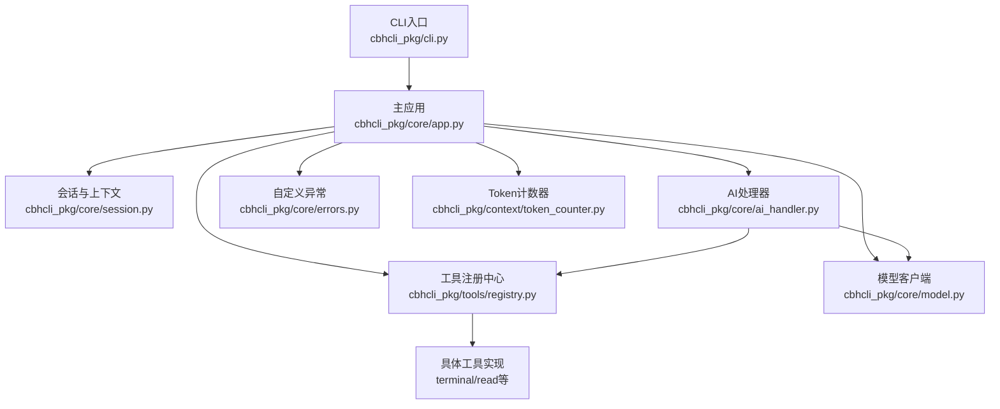
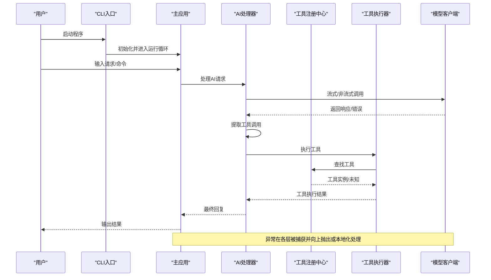
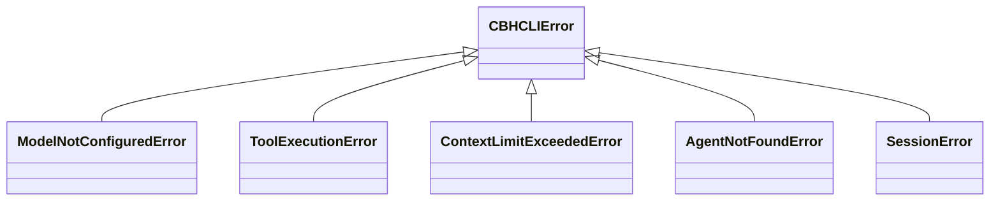
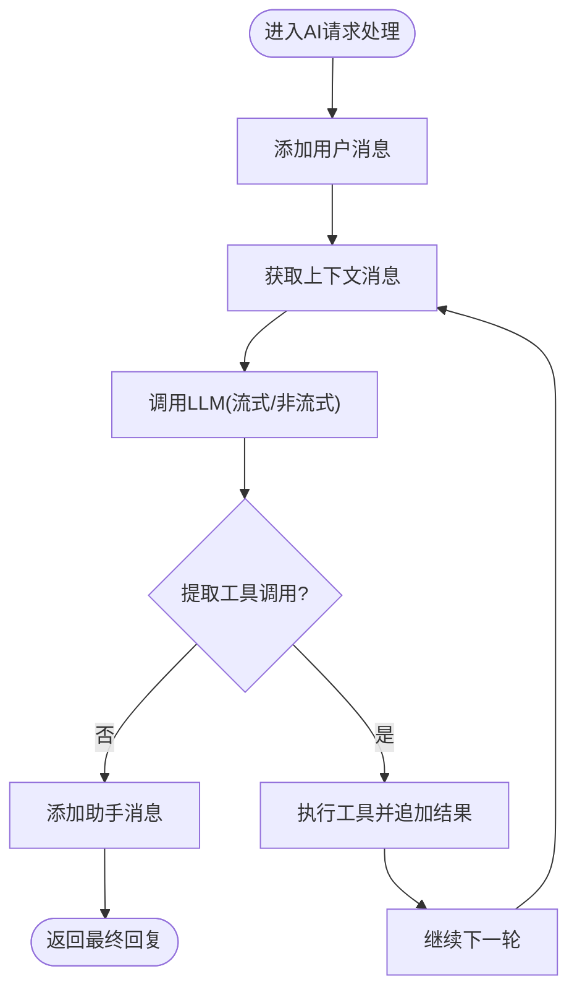
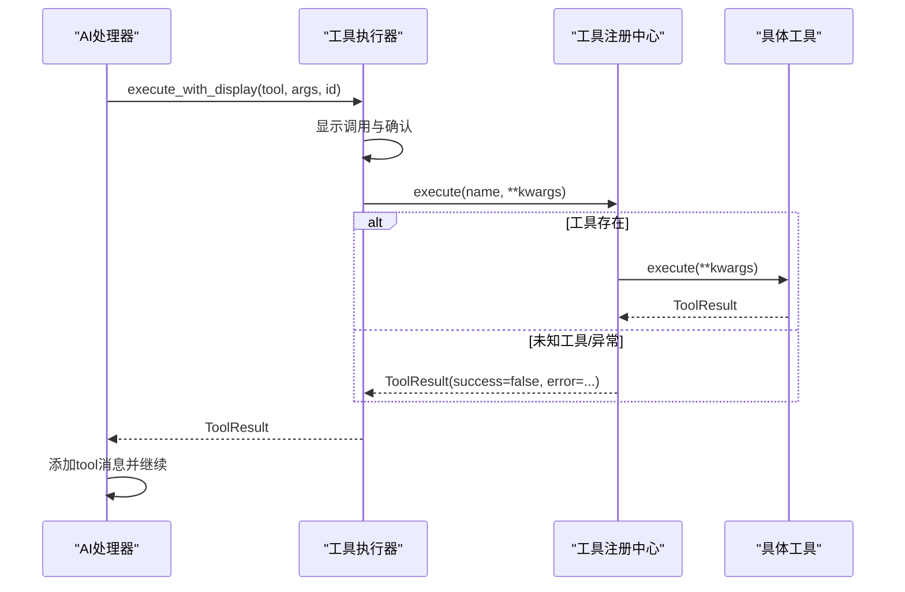
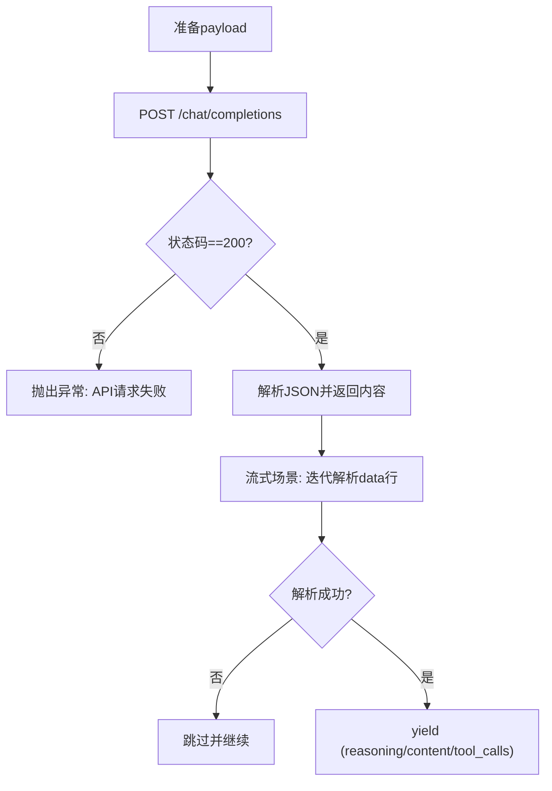
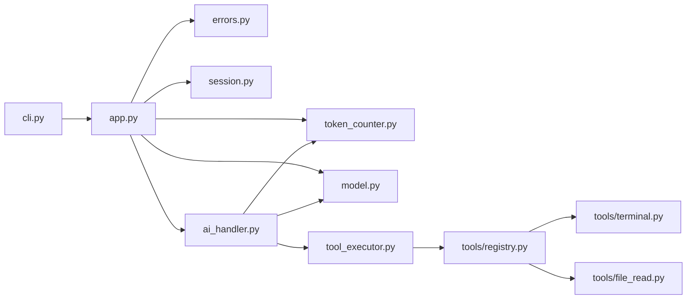

# 运行时错误

<cite>
**本文引用的文件**
- [cbhcli_pkg/core/errors.py](file://cbhcli_pkg/core/errors.py)
- [cbhcli_pkg/core/app.py](file://cbhcli_pkg/core/app.py)
- [cbhcli_pkg/cli.py](file://cbhcli_pkg/cli.py)
- [cbhcli_pkg/core/tool_executor.py](file://cbhcli_pkg/core/tool_executor.py)
- [cbhcli_pkg/core/session.py](file://cbhcli_pkg/core/session.py)
- [cbhcli_pkg/core/ai_handler.py](file://cbhcli_pkg/core/ai_handler.py)
- [cbhcli_pkg/core/model.py](file://cbhcli_pkg/core/model.py)
- [cbhcli_pkg/tools/registry.py](file://cbhcli_pkg/tools/registry.py)
- [cbhcli_pkg/tools/terminal.py](file://cbhcli_pkg/tools/terminal.py)
- [cbhcli_pkg/tools/file_read.py](file://cbhcli_pkg/tools/file_read.py)
- [cbhcli_pkg/context/token_counter.py](file://cbhcli_pkg/context/token_counter.py)
</cite>

## 目录
1. [简介](#简介)
2. [项目结构](#项目结构)
3. [核心组件](#核心组件)
4. [架构总览](#架构总览)
5. [详细组件分析](#详细组件分析)
6. [依赖分析](#依赖分析)
7. [性能考虑](#性能考虑)
8. [故障排除指南](#故障排除指南)
9. [结论](#结论)
10. [附录](#附录)

## 简介
本指南聚焦于CBHCLI运行时错误的系统性排查与修复。围绕以下关键异常展开：模型未配置、工具执行错误、上下文超限、Agent未找到、会话错误，并结合网络连接失败、API调用超时、文件权限不足等运行环境问题，提供触发条件、症状表现、解决步骤、错误代码与堆栈分析方法、日志分析技巧与调试手段，以及错误预防与稳定性优化建议。

## 项目结构
CBHCLI采用模块化设计，核心运行时逻辑集中在应用主循环、会话与上下文管理、AI请求处理、工具执行与注册中心、模型客户端与计数器等模块。CLI入口负责参数解析与启动主应用；主应用负责配置、Agent与会话初始化、命令路由与交互循环；AI处理器负责与LLM交互、工具调用提取与执行；工具注册中心与各工具实现负责具体能力执行；模型客户端负责统一API调用封装；上下文与计数器负责token统计与压缩策略。

图表来源
- [cbhcli_pkg/cli.py:73-112](file://cbhcli_pkg/cli.py#L73-L112)
- [cbhcli_pkg/core/app.py:54-478](file://cbhcli_pkg/core/app.py#L54-L478)
- [cbhcli_pkg/core/session.py:37-190](file://cbhcli_pkg/core/session.py#L37-L190)
- [cbhcli_pkg/core/ai_handler.py:21-743](file://cbhcli_pkg/core/ai_handler.py#L21-L743)
- [cbhcli_pkg/core/tool_executor.py:15-168](file://cbhcli_pkg/core/tool_executor.py#L15-L168)
- [cbhcli_pkg/core/model.py:7-147](file://cbhcli_pkg/core/model.py#L7-L147)
- [cbhcli_pkg/tools/registry.py:51-115](file://cbhcli_pkg/tools/registry.py#L51-L115)
- [cbhcli_pkg/context/token_counter.py:14-88](file://cbhcli_pkg/context/token_counter.py#L14-L88)

章节来源
- [cbhcli_pkg/cli.py:73-112](file://cbhcli_pkg/cli.py#L73-L112)
- [cbhcli_pkg/core/app.py:54-478](file://cbhcli_pkg/core/app.py#L54-L478)

## 核心组件
- 自定义异常体系：集中定义基础异常与业务异常类型，便于统一捕获与分类处理。
- 主应用与运行循环：负责配置加载、Agent与会话初始化、命令解析与交互、异常兜底输出。
- 会话与上下文：维护消息、token统计、上下文窗口与压缩阈值。
- AI处理器：负责与LLM交互、流式输出、工具调用提取与执行、多轮工具调用协调。
- 工具注册中心与工具实现：统一工具接口、参数校验、执行结果封装与错误上报。
- 模型客户端：统一API调用封装，支持非流式与流式聊天、嵌入向量生成。
- Token计数器：提供精确与估算两种token计数策略，支撑上下文窗口与压缩决策。

章节来源
- [cbhcli_pkg/core/errors.py:4-31](file://cbhcli_pkg/core/errors.py#L4-L31)
- [cbhcli_pkg/core/app.py:54-478](file://cbhcli_pkg/core/app.py#L54-L478)
- [cbhcli_pkg/core/session.py:37-190](file://cbhcli_pkg/core/session.py#L37-L190)
- [cbhcli_pkg/core/ai_handler.py:21-743](file://cbhcli_pkg/core/ai_handler.py#L21-L743)
- [cbhcli_pkg/core/tool_executor.py:15-168](file://cbhcli_pkg/core/tool_executor.py#L15-L168)
- [cbhcli_pkg/core/model.py:7-147](file://cbhcli_pkg/core/model.py#L7-L147)
- [cbhcli_pkg/context/token_counter.py:14-88](file://cbhcli_pkg/context/token_counter.py#L14-L88)

## 架构总览
下图展示从CLI入口到主应用、AI处理器、工具执行与模型调用的关键流程，以及异常传播路径与上下文控制点。

图表来源
- [cbhcli_pkg/cli.py:73-112](file://cbhcli_pkg/cli.py#L73-L112)
- [cbhcli_pkg/core/app.py:386-478](file://cbhcli_pkg/core/app.py#L386-L478)
- [cbhcli_pkg/core/ai_handler.py:51-216](file://cbhcli_pkg/core/ai_handler.py#L51-L216)
- [cbhcli_pkg/core/tool_executor.py:42-91](file://cbhcli_pkg/core/tool_executor.py#L42-L91)
- [cbhcli_pkg/core/model.py:28-147](file://cbhcli_pkg/core/model.py#L28-L147)

## 详细组件分析

### 异常体系与触发点
- 基础异常：CBHCLIError作为所有CBHCLI相关异常的根类型，便于统一捕获与分类。
- 模型未配置：当Agent未配置模型或模型配置缺失时，主应用在处理AI请求前会提示“当前Agent未配置模型”，属于运行时前置检查失败。
- 工具执行错误：工具注册中心在执行工具时捕获异常并封装为ToolResult，同时抛出ToolExecutionError供上层处理。
- 上下文超限：上下文窗口在达到阈值时触发压缩，若压缩失败则报错；也可在特定场景下触发ContextLimitExceededError。
- Agent未找到：Agent管理器加载Agent失败时触发AgentNotFoundError。
- 会话错误：会话初始化、消息添加、历史保存等环节出现异常时触发SessionError。

图表来源
- [cbhcli_pkg/core/errors.py:4-31](file://cbhcli_pkg/core/errors.py#L4-L31)

章节来源
- [cbhcli_pkg/core/errors.py:4-31](file://cbhcli_pkg/core/errors.py#L4-L31)
- [cbhcli_pkg/core/app.py:410-414](file://cbhcli_pkg/core/app.py#L410-L414)
- [cbhcli_pkg/core/tool_executor.py:12-12](file://cbhcli_pkg/core/tool_executor.py#L12-L12)
- [cbhcli_pkg/core/session.py:37-190](file://cbhcli_pkg/core/session.py#L37-L190)

### 会话与上下文窗口
- 会话管理：维护消息列表、工具调用计数、创建时间与激活状态；提供API消息格式转换、token统计与消息替换/删除。
- 上下文窗口：基于模型上下文限制与压缩比例，动态判断是否接近/需要压缩；提供剩余token与状态文本。

图表来源
- [cbhcli_pkg/core/ai_handler.py:51-96](file://cbhcli_pkg/core/ai_handler.py#L51-L96)
- [cbhcli_pkg/core/session.py:37-125](file://cbhcli_pkg/core/session.py#L37-L125)

章节来源
- [cbhcli_pkg/core/session.py:37-190](file://cbhcli_pkg/core/session.py#L37-L190)
- [cbhcli_pkg/core/ai_handler.py:51-216](file://cbhcli_pkg/core/ai_handler.py#L51-L216)

### 工具执行与注册中心
- 注册中心：提供工具注册、注销、查找与执行；执行时对未知工具与异常进行结果封装与错误上报。
- 工具执行器：负责工具调用显示、确认、执行与结果展示；支持详细/简洁模式切换。
- 典型工具：终端工具支持超时控制与退出码处理；文件读取工具支持路径展开、行范围与编码错误处理。

图表来源
- [cbhcli_pkg/core/tool_executor.py:42-91](file://cbhcli_pkg/core/tool_executor.py#L42-L91)
- [cbhcli_pkg/tools/registry.py:70-96](file://cbhcli_pkg/tools/registry.py#L70-L96)
- [cbhcli_pkg/tools/terminal.py:31-99](file://cbhcli_pkg/tools/terminal.py#L31-L99)
- [cbhcli_pkg/tools/file_read.py:38-125](file://cbhcli_pkg/tools/file_read.py#L38-L125)

章节来源
- [cbhcli_pkg/core/tool_executor.py:15-168](file://cbhcli_pkg/core/tool_executor.py#L15-L168)
- [cbhcli_pkg/tools/registry.py:51-115](file://cbhcli_pkg/tools/registry.py#L51-L115)
- [cbhcli_pkg/tools/terminal.py:1-99](file://cbhcli_pkg/tools/terminal.py#L1-L99)
- [cbhcli_pkg/tools/file_read.py:1-125](file://cbhcli_pkg/tools/file_read.py#L1-L125)

### 模型客户端与API交互
- 统一封装：支持非流式聊天、流式聊天与嵌入向量生成；内置超时控制与状态码校验。
- 错误处理：HTTP状态码非200时抛出异常；流式解析失败时抛出异常；嵌入向量接口同样进行状态校验。

图表来源
- [cbhcli_pkg/core/model.py:28-120](file://cbhcli_pkg/core/model.py#L28-L120)

章节来源
- [cbhcli_pkg/core/model.py:7-147](file://cbhcli_pkg/core/model.py#L7-L147)

## 依赖分析
- CLI入口依赖主应用；主应用依赖配置、Agent管理、会话、工具注册中心、模型客户端、上下文与计数器。
- AI处理器依赖模型客户端、会话、工具执行器与计数器；工具执行器依赖注册中心；注册中心依赖具体工具实现。
- 模型客户端依赖requests；工具实现依赖操作系统子进程与文件系统；上下文与计数器依赖tiktoken（可选）。

图表来源
- [cbhcli_pkg/cli.py:73-112](file://cbhcli_pkg/cli.py#L73-L112)
- [cbhcli_pkg/core/app.py:54-478](file://cbhcli_pkg/core/app.py#L54-L478)
- [cbhcli_pkg/core/ai_handler.py:21-743](file://cbhcli_pkg/core/ai_handler.py#L21-L743)
- [cbhcli_pkg/core/tool_executor.py:15-168](file://cbhcli_pkg/core/tool_executor.py#L15-L168)
- [cbhcli_pkg/tools/registry.py:51-115](file://cbhcli_pkg/tools/registry.py#L51-L115)
- [cbhcli_pkg/core/model.py:7-147](file://cbhcli_pkg/core/model.py#L7-L147)
- [cbhcli_pkg/context/token_counter.py:14-88](file://cbhcli_pkg/context/token_counter.py#L14-L88)

章节来源
- [cbhcli_pkg/core/app.py:54-478](file://cbhcli_pkg/core/app.py#L54-L478)
- [cbhcli_pkg/core/ai_handler.py:21-743](file://cbhcli_pkg/core/ai_handler.py#L21-L743)

## 性能考虑
- Token计数：优先使用tiktoken进行精确计数；在不可用时采用估算策略，避免阻塞与过度保守。
- 上下文压缩：在接近阈值时自动压缩，减少后续API调用成本；压缩失败需及时回退与提示。
- 工具执行：对长输出进行截断与预览，避免UI卡顿；批量工具调用时注意去重与顺序。
- API调用：合理设置超时与重试策略；流式输出提升交互体验；对大文本分批处理。

## 故障排除指南

### 通用排障流程
- 现象观察：记录错误提示、发生阶段（AI请求、工具执行、模型调用、会话保存等）。
- 日志与堆栈：查看CLI与主应用的异常捕获输出；结合工具执行器的详细模式输出定位具体工具与参数。
- 环境检查：确认网络连通性、API密钥与URL配置、文件权限与路径有效性、Agent与模型配置状态。
- 逐步缩小：先恢复最小可运行环境（仅Agent与模型），再逐步加入工具与向量库。

### 模型未配置（ModelNotConfiguredError）
- 触发条件
  - Agent未配置primary_model或last_selected_model，导致LLM客户端未初始化。
  - 主应用在处理AI请求前检测到llm_client为空，提示“当前Agent未配置模型”。
- 症状表现
  - 输入请求后直接提示“当前Agent未配置模型”，不发起API调用。
- 解决步骤
  - 使用模型命令配置模型：添加/使用模型并设置为当前Agent的primary_model。
  - 确认模型配置项包含url、apiKey、model与context_limit。
  - 重启应用以重新加载配置。
- 相关代码路径
  - [cbhcli_pkg/core/app.py:410-414](file://cbhcli_pkg/core/app.py#L410-L414)
  - [cbhcli_pkg/core/app.py:250-258](file://cbhcli_pkg/core/app.py#L250-L258)

章节来源
- [cbhcli_pkg/core/app.py:410-414](file://cbhcli_pkg/core/app.py#L410-L414)
- [cbhcli_pkg/core/app.py:250-258](file://cbhcli_pkg/core/app.py#L250-L258)

### 工具执行错误（ToolExecutionError）
- 触发条件
  - 工具注册中心执行工具时抛出异常或返回未知工具。
  - 具体工具内部异常（如终端命令超时、文件读取编码错误等）。
- 症状表现
  - 工具执行器显示“失败: 错误信息”，并输出工具调用预览。
  - 若为未知工具，错误信息包含工具名称。
- 解决步骤
  - 检查工具名称拼写与注册状态。
  - 对终端工具：调整timeout、确认命令可执行、检查权限与路径。
  - 对文件读取工具：确认文件存在、路径正确、编码为UTF-8。
  - 开启详细模式查看完整参数，定位参数问题。
- 相关代码路径
  - [cbhcli_pkg/core/tool_executor.py:74-91](file://cbhcli_pkg/core/tool_executor.py#L74-L91)
  - [cbhcli_pkg/tools/registry.py:81-96](file://cbhcli_pkg/tools/registry.py#L81-L96)
  - [cbhcli_pkg/tools/terminal.py:57-66](file://cbhcli_pkg/tools/terminal.py#L57-L66)
  - [cbhcli_pkg/tools/file_read.py:113-124](file://cbhcli_pkg/tools/file_read.py#L113-L124)

章节来源
- [cbhcli_pkg/core/tool_executor.py:12-12](file://cbhcli_pkg/core/tool_executor.py#L12-L12)
- [cbhcli_pkg/tools/registry.py:81-96](file://cbhcli_pkg/tools/registry.py#L81-L96)
- [cbhcli_pkg/tools/terminal.py:57-66](file://cbhcli_pkg/tools/terminal.py#L57-L66)
- [cbhcli_pkg/tools/file_read.py:113-124](file://cbhcli_pkg/tools/file_read.py#L113-L124)

### 上下文超限（ContextLimitExceededError）
- 触发条件
  - 会话token使用达到上下文窗口阈值，触发自动压缩；若压缩失败或仍超限，抛出异常。
- 症状表现
  - 提示“上下文接近上限”并尝试自动压缩；压缩失败时提示“压缩失败”。
- 解决步骤
  - 手动触发压缩或清理历史消息。
  - 调整auto_compress策略或提高context_limit_ratio。
  - 检查工具调用输出是否过大，必要时精简工具输出。
- 相关代码路径
  - [cbhcli_pkg/core/app.py:368-384](file://cbhcli_pkg/core/app.py#L368-L384)
  - [cbhcli_pkg/core/session.py:127-190](file://cbhcli_pkg/core/session.py#L127-L190)

章节来源
- [cbhcli_pkg/core/app.py:368-384](file://cbhcli_pkg/core/app.py#L368-L384)
- [cbhcli_pkg/core/session.py:127-190](file://cbhcli_pkg/core/session.py#L127-L190)

### Agent未找到（AgentNotFoundError）
- 触发条件
  - Agent管理器加载Agent失败（文件不存在或配置损坏）。
- 症状表现
  - 加载Agent时返回False，应用无法初始化该Agent的会话与工具。
- 解决步骤
  - 使用Agent命令创建/切换Agent，确保Agent目录与配置文件存在。
  - 检查Agent工作区路径权限与完整性。
- 相关代码路径
  - [cbhcli_pkg/core/app.py:241-243](file://cbhcli_pkg/core/app.py#L241-L243)

章节来源
- [cbhcli_pkg/core/app.py:241-243](file://cbhcli_pkg/core/app.py#L241-L243)

### 会话错误（SessionError）
- 触发条件
  - 会话初始化、消息添加、历史保存等环节出现异常。
- 症状表现
  - 会话重置或历史保存过程中出现异常提示。
- 解决步骤
  - 检查会话历史目录权限与磁盘空间。
  - 简化会话内容，避免单条消息过大。
- 相关代码路径
  - [cbhcli_pkg/core/app.py:291-296](file://cbhcli_pkg/core/app.py#L291-L296)

章节来源
- [cbhcli_pkg/core/app.py:291-296](file://cbhcli_pkg/core/app.py#L291-L296)

### 网络连接失败与API调用超时
- 触发条件
  - 模型客户端POST请求返回非200状态码或流式响应解析失败。
- 症状表现
  - “API请求失败: HTTP状态码 - 错误详情”或“流式响应解析失败”。
- 解决步骤
  - 检查网络连通性与代理设置。
  - 校验API URL与apiKey配置。
  - 增加超时时间或降低并发。
- 相关代码路径
  - [cbhcli_pkg/core/model.py:53-54](file://cbhcli_pkg/core/model.py#L53-L54)
  - [cbhcli_pkg/core/model.py:89-90](file://cbhcli_pkg/core/model.py#L89-L90)

章节来源
- [cbhcli_pkg/core/model.py:53-54](file://cbhcli_pkg/core/model.py#L53-L54)
- [cbhcli_pkg/core/model.py:89-90](file://cbhcli_pkg/core/model.py#L89-L90)

### 文件权限不足
- 触发条件
  - 文件读取工具无法打开文件或读取编码不支持。
- 症状表现
  - “文件不存在/不是文件/无法读取（编码错误）”等错误信息。
- 解决步骤
  - 确认文件路径与权限，使用绝对路径或expanduser展开。
  - 更改文件编码为UTF-8或调整读取策略。
- 相关代码路径
  - [cbhcli_pkg/tools/file_read.py:55-69](file://cbhcli_pkg/tools/file_read.py#L55-L69)
  - [cbhcli_pkg/tools/file_read.py:113-118](file://cbhcli_pkg/tools/file_read.py#L113-L118)

章节来源
- [cbhcli_pkg/tools/file_read.py:55-69](file://cbhcli_pkg/tools/file_read.py#L55-L69)
- [cbhcli_pkg/tools/file_read.py:113-118](file://cbhcli_pkg/tools/file_read.py#L113-L118)

### 错误代码与堆栈分析方法
- 错误代码含义
  - HTTP状态码：用于标识API调用失败的具体原因（如401未授权、403禁止、429限流、5xx服务器错误）。
  - 工具执行错误：ToolResult.success=false，error字段包含具体失败原因。
  - 上下文超限：上下文窗口使用率超过阈值，压缩失败时抛出异常。
- 堆栈分析
  - 从CLI入口到主应用运行循环，再到AI处理器与模型客户端，最后到工具执行器与具体工具。
  - 通过工具执行器的详细模式输出，定位工具名称、参数与返回结果。
  - 在模型客户端处关注流式解析与状态码分支，快速定位网络或服务端问题。

章节来源
- [cbhcli_pkg/cli.py:104-111](file://cbhcli_pkg/cli.py#L104-L111)
- [cbhcli_pkg/core/app.py:418-420](file://cbhcli_pkg/core/app.py#L418-L420)
- [cbhcli_pkg/core/ai_handler.py:212-214](file://cbhcli_pkg/core/ai_handler.py#L212-L214)
- [cbhcli_pkg/core/model.py:92-119](file://cbhcli_pkg/core/model.py#L92-L119)

### 日志分析技巧与调试方法
- 开启详细模式：在主应用中通过快捷键切换工具显示模式，查看完整参数与输出预览。
- 分阶段验证：先验证模型连通性，再验证Agent与工具，最后验证会话与上下文。
- 截断与预览：工具输出与AI响应均有限制长度，必要时分段查看。
- Token估算：结合上下文窗口与计数器，评估消息大小与潜在超限风险。

章节来源
- [cbhcli_pkg/core/app.py:190-197](file://cbhcli_pkg/core/app.py#L190-L197)
- [cbhcli_pkg/core/tool_executor.py:103-105](file://cbhcli_pkg/core/tool_executor.py#L103-L105)
- [cbhcli_pkg/context/token_counter.py:44-58](file://cbhcli_pkg/context/token_counter.py#L44-L58)

### 错误预防与系统稳定性优化
- 配置校验：在Agent加载与模型初始化阶段增加配置校验与提示。
- 超时与重试：为工具执行与API调用设置合理超时与重试策略。
- 输出截断：对工具输出与AI响应进行截断与预览，避免UI卡顿。
- 自动压缩：在接近阈值时自动压缩，减少超限概率。
- 权限与路径：在工具执行前进行路径展开与权限检查，提前发现潜在问题。

## 结论
通过建立清晰的异常体系、完善的日志与调试机制、合理的上下文与工具执行策略，CBHCLI能够在复杂运行环境中稳定运行并快速定位与解决问题。建议在生产使用中持续监控上下文使用率、API调用成功率与工具执行耗时，定期优化Agent配置与工具参数，确保系统长期稳定。

## 附录
- 常用命令与路径参考
  - CLI入口与帮助：[cbhcli_pkg/cli.py:73-112](file://cbhcli_pkg/cli.py#L73-L112)
  - 主应用初始化与运行循环：[cbhcli_pkg/core/app.py:64-478](file://cbhcli_pkg/core/app.py#L64-L478)
  - 会话与上下文窗口：[cbhcli_pkg/core/session.py:37-190](file://cbhcli_pkg/core/session.py#L37-L190)
  - AI请求处理与工具调用：[cbhcli_pkg/core/ai_handler.py:51-743](file://cbhcli_pkg/core/ai_handler.py#L51-L743)
  - 工具注册与执行：[cbhcli_pkg/tools/registry.py:51-115](file://cbhcli_pkg/tools/registry.py#L51-L115)
  - 模型客户端封装：[cbhcli_pkg/core/model.py:7-147](file://cbhcli_pkg/core/model.py#L7-L147)
  - Token计数器：[cbhcli_pkg/context/token_counter.py:14-88](file://cbhcli_pkg/context/token_counter.py#L14-L88)