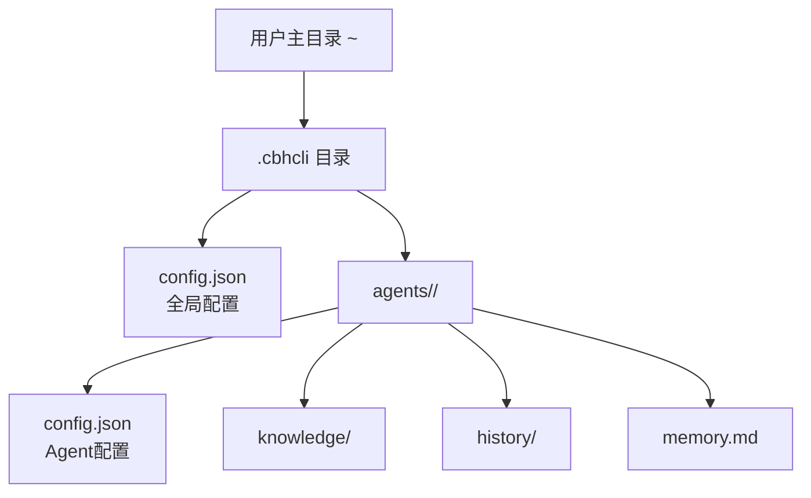
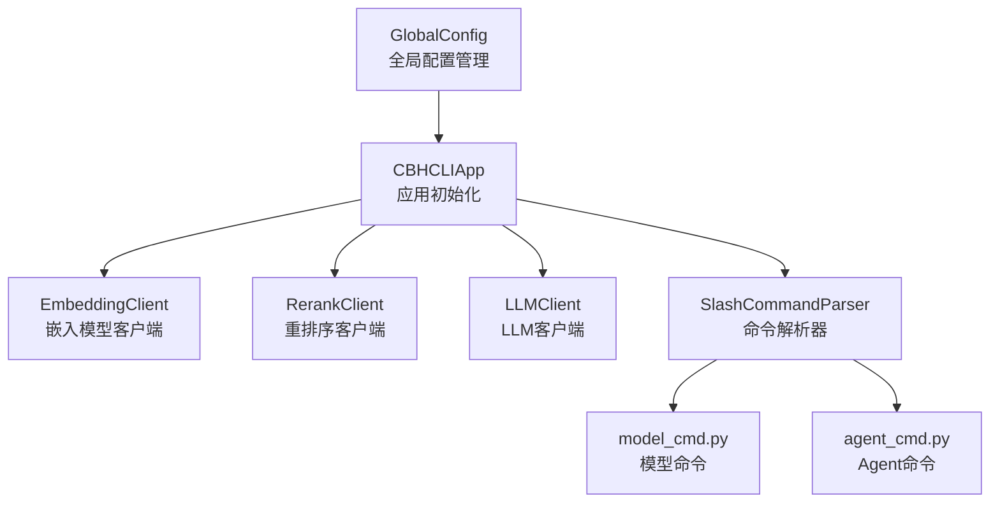
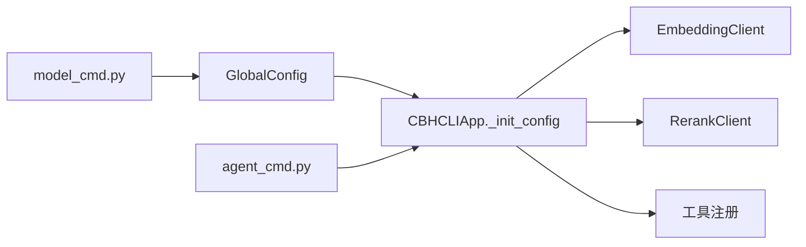
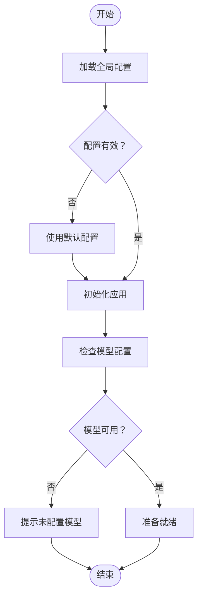

# 配置错误

<cite>
**本文引用的文件**
- [global_config.py](file://cbhcli_pkg/config/global_config.py)
- [app.py](file://cbhcli_pkg/core/app.py)
- [model.py](file://cbhcli_pkg/core/model.py)
- [embedding_client.py](file://cbhcli_pkg/core/embedding_client.py)
- [rerank_client.py](file://cbhcli_pkg/core/rerank_client.py)
- [model_cmd.py](file://cbhcli_pkg/commands/model_cmd.py)
- [agent_cmd.py](file://cbhcli_pkg/commands/agent_cmd.py)
- [parser.py](file://cbhcli_pkg/commands/parser.py)
- [cli.py](file://cbhcli_pkg/cli.py)
- [errors.py](file://cbhcli_pkg/core/errors.py)
- [constants.py](file://cbhcli_pkg/core/constants.py)
- [README.md](file://README.md)
</cite>

## 目录
1. [简介](#简介)
2. [项目结构](#项目结构)
3. [核心组件](#核心组件)
4. [架构总览](#架构总览)
5. [详细组件分析](#详细组件分析)
6. [依赖分析](#依赖分析)
7. [性能考虑](#性能考虑)
8. [故障排除指南](#故障排除指南)
9. [结论](#结论)
10. [附录](#附录)

## 简介
本文件聚焦于CBHCLI的配置错误诊断与修复，围绕以下主题展开：
- 配置文件格式错误、参数值无效、路径配置不正确等常见问题的定位与修复
- 全局配置文件结构与各字段作用说明（模型配置、Agent设置、工具配置等）
- 配置验证方法与工具（命令行与内置提示）
- API密钥配置错误、代理设置问题、端口冲突等常见陷阱
- 配置优先级与覆盖规则（全局配置与Agent配置）
- 配置模板与最佳实践
- 配置重置与恢复默认设置的操作步骤

## 项目结构
CBHCLI的配置主要集中在用户家目录的隐藏目录中，采用单一JSON文件集中管理；同时，每个Agent拥有独立的工作空间，包含各自的配置与资源。

图表来源
- [README.md:150-206](file://README.md#L150-L206)

章节来源
- [README.md:150-206](file://README.md#L150-L206)

## 核心组件
- 全局配置管理器：负责加载、校验、保存全局配置，并提供模型、嵌入模型、重排序模型、Agent与设置的读写接口。
- 应用初始化：在启动时读取全局配置，决定Agent工作空间、工具注册、向量存储与索引、命令注册等。
- 模型与客户端：统一封装LLM、嵌入与重排序API调用，负责参数校验与错误传播。
- 命令系统：提供模型、Agent、知识库、向量索引等配置与管理命令，内置交互式菜单与参数校验。
- 错误体系：定义模型未配置、上下文超限、工具执行错误等异常类型，便于定位问题。

章节来源
- [global_config.py:13-154](file://cbhcli_pkg/config/global_config.py#L13-L154)
- [app.py:73-150](file://cbhcli_pkg/core/app.py#L73-L150)
- [model.py:7-147](file://cbhcli_pkg/core/model.py#L7-L147)
- [embedding_client.py:6-132](file://cbhcli_pkg/core/embedding_client.py#L6-L132)
- [rerank_client.py:6-123](file://cbhcli_pkg/core/rerank_client.py#L6-L123)
- [model_cmd.py:5-371](file://cbhcli_pkg/commands/model_cmd.py#L5-L371)
- [agent_cmd.py:5-181](file://cbhcli_pkg/commands/agent_cmd.py#L5-L181)
- [parser.py:16-94](file://cbhcli_pkg/commands/parser.py#L16-L94)
- [errors.py:4-32](file://cbhcli_pkg/core/errors.py#L4-L32)
- [constants.py:1-50](file://cbhcli_pkg/core/constants.py#L1-L50)

## 架构总览
全局配置在应用启动时被加载，随后根据配置决定是否启用向量检索、注册工具、初始化会话与上下文压缩策略。模型、嵌入与重排序客户端基于配置进行实例化，若配置无效则在初始化阶段抛出异常或输出警告。

图表来源
- [global_config.py:13-154](file://cbhcli_pkg/config/global_config.py#L13-L154)
- [app.py:73-150](file://cbhcli_pkg/core/app.py#L73-L150)
- [model_cmd.py:5-371](file://cbhcli_pkg/commands/model_cmd.py#L5-L371)
- [agent_cmd.py:5-181](file://cbhcli_pkg/commands/agent_cmd.py#L5-L181)
- [parser.py:16-94](file://cbhcli_pkg/commands/parser.py#L16-L94)

## 详细组件分析

### 全局配置结构与字段说明
- models：模型列表，每项包含名称、API Key、Base URL、模型ID、上下文长度限制等。
- embedding_model：嵌入模型配置，包含名称、API Key、Base URL、模型ID、类型（openai/custom）。
- rerank_model：重排序模型配置，包含名称、API Key、Base URL、模型ID、返回条数top_n。
- agents：Agent相关设置，包含默认Agent与当前活动Agent。
- settings：应用设置，包含自动压缩开关、压缩比例、工作空间根目录等。

章节来源
- [global_config.py:31-48](file://cbhcli_pkg/config/global_config.py#L31-L48)
- [README.md:155-190](file://README.md#L155-L190)

### 配置加载与默认值
- 若配置文件不存在或读取失败，将回退到默认配置，确保应用可正常启动。
- 默认配置包含空模型列表、嵌入与重排序模型为空、Agent默认与活动Agent为None、工作空间指向用户家目录下的agents子目录等。

章节来源
- [global_config.py:20-29](file://cbhcli_pkg/config/global_config.py#L20-L29)
- [global_config.py:31-48](file://cbhcli_pkg/config/global_config.py#L31-L48)

### 模型配置与客户端
- LLMClient基于模型配置构造HTTP会话，统一处理聊天与嵌入请求；若API返回非200状态码，将抛出异常。
- 模型命令提供交互式添加、列出、使用、删除与信息查看，包含对上下文长度限制的数值校验。

章节来源
- [model.py:10-57](file://cbhcli_pkg/core/model.py#L10-L57)
- [model_cmd.py:64-104](file://cbhcli_pkg/commands/model_cmd.py#L64-L104)
- [model_cmd.py:130-149](file://cbhcli_pkg/commands/model_cmd.py#L130-L149)

### 嵌入与重排序模型
- EmbeddingClient支持OpenAI兼容与自定义API两种类型，内部实现批量请求与错误处理。
- RerankClient支持Jina与Cohere等API，统一返回格式化的排序结果。

章节来源
- [embedding_client.py:15-90](file://cbhcli_pkg/core/embedding_client.py#L15-L90)
- [rerank_client.py:16-90](file://cbhcli_pkg/core/rerank_client.py#L16-L90)

### Agent与工作空间
- Agent命令提供创建、列出、切换、删除等操作；切换Agent会重新加载模型与会话。
- Agent工作空间包含配置、技能、性格、工具指南、记忆与知识库等文件。

章节来源
- [agent_cmd.py:99-130](file://cbhcli_pkg/commands/agent_cmd.py#L99-L130)
- [agent_cmd.py:154-161](file://cbhcli_pkg/commands/agent_cmd.py#L154-L161)
- [README.md:192-206](file://README.md#L192-L206)

### 命令解析与帮助
- SlashCommandParser负责解析“/”开头的命令，执行并返回结果或错误信息。
- CLI入口支持--help与--version，未知参数会提示帮助并退出。

章节来源
- [parser.py:26-77](file://cbhcli_pkg/commands/parser.py#L26-L77)
- [cli.py:73-112](file://cbhcli_pkg/cli.py#L73-L112)

## 依赖分析
- 全局配置被应用初始化模块依赖，决定Agent工作空间、工具注册、向量存储与索引等行为。
- 模型命令依赖全局配置进行增删改查与信息展示。
- 应用初始化依赖嵌入与重排序客户端，若配置无效则输出警告并降级功能。

图表来源
- [global_config.py:13-154](file://cbhcli_pkg/config/global_config.py#L13-L154)
- [app.py:73-150](file://cbhcli_pkg/core/app.py#L73-L150)
- [model_cmd.py:5-371](file://cbhcli_pkg/commands/model_cmd.py#L5-L371)
- [agent_cmd.py:5-181](file://cbhcli_pkg/commands/agent_cmd.py#L5-L181)

## 性能考虑
- 自动上下文压缩：当Agent配置开启自动压缩且达到阈值时，应用会尝试压缩上下文以避免超出模型限制。
- 向量索引：默认不自动索引，避免启动时产生大量API调用；可在需要时手动触发索引或重新索引。

章节来源
- [constants.py:6-8](file://cbhcli_pkg/core/constants.py#L6-L8)
- [app.py:361-384](file://cbhcli_pkg/core/app.py#L361-L384)
- [README.md:208-229](file://README.md#L208-L229)

## 故障排除指南

### 1. 配置文件格式错误
- 症状
  - 启动时报错或配置未生效
  - 模型列表为空、Agent无法切换
- 诊断
  - 检查全局配置文件是否存在且为合法JSON格式
  - 使用命令查看模型与Agent状态，确认配置是否被读取
- 修复
  - 依据模板修正JSON语法（键名、逗号、引号、数值类型）
  - 重新保存配置文件后重启应用

章节来源
- [global_config.py:20-29](file://cbhcli_pkg/config/global_config.py#L20-L29)
- [model_cmd.py:107-127](file://cbhcli_pkg/commands/model_cmd.py#L107-L127)
- [agent_cmd.py:132-151](file://cbhcli_pkg/commands/agent_cmd.py#L132-L151)

### 2. 参数值无效
- 症状
  - 模型上下文长度限制输入非数字导致报错
  - 嵌入/重排序模型类型或模型ID不正确
- 诊断
  - 模型命令在添加模型时会对上下文长度进行数值校验
  - 嵌入/重排序模型命令会提示必填项与默认值
- 修复
  - 将上下文长度限制改为整数
  - 确认API Base URL与模型ID正确，类型选择openai或custom

章节来源
- [model_cmd.py:87-94](file://cbhcli_pkg/commands/model_cmd.py#L87-L94)
- [model_cmd.py:207-237](file://cbhcli_pkg/commands/model_cmd.py#L207-L237)
- [model_cmd.py:304-335](file://cbhcli_pkg/commands/model_cmd.py#L304-L335)

### 3. 路径配置不正确
- 症状
  - Agent工作空间无法访问或创建失败
  - 向量索引目录不可写
- 诊断
  - 检查settings中的workspace_base路径是否存在且可写
  - 确认agents目录权限与磁盘空间
- 修复
  - 更正workspace_base为绝对路径或相对路径至可写目录
  - 重新创建agents目录并赋予适当权限

章节来源
- [global_config.py:41-47](file://cbhcli_pkg/config/global_config.py#L41-L47)
- [app.py:77-81](file://cbhcli_pkg/core/app.py#L77-L81)

### 4. API密钥配置错误
- 症状
  - LLM、嵌入或重排序API请求返回非200状态码
  - 应用输出“API请求失败”或“Embedding请求失败”等提示
- 诊断
  - 检查模型配置中的apiKey、url与model字段
  - 确认API Base URL末尾无多余斜杠
- 修复
  - 更新正确的API Key与Base URL
  - 如使用自定义API，确保模型类型与请求格式匹配

章节来源
- [model.py:47-57](file://cbhcli_pkg/core/model.py#L47-L57)
- [model.py:82-90](file://cbhcli_pkg/core/model.py#L82-L90)
- [embedding_client.py:80-87](file://cbhcli_pkg/core/embedding_client.py#L80-L87)
- [rerank_client.py:70-77](file://cbhcli_pkg/core/rerank_client.py#L70-L77)

### 5. 代理设置问题
- 症状
  - 本地网络环境下无法访问外部API
- 诊断
  - 检查系统代理配置是否影响Python requests库
- 修复
  - 在系统或Python层正确配置HTTP/HTTPS代理
  - 验证代理连通性后再试

章节来源
- [model.py:22-26](file://cbhcli_pkg/core/model.py#L22-L26)
- [embedding_client.py:28-32](file://cbhcli_pkg/core/embedding_client.py#L28-L32)
- [rerank_client.py:29-33](file://cbhcli_pkg/core/rerank_client.py#L29-L33)

### 6. 端口冲突
- 症状
  - 应用启动后出现连接超时或拒绝
- 诊断
  - 确认API Base URL使用的端口未被占用
- 修复
  - 更换API Base URL中的端口或调整本地服务端口

章节来源
- [model.py:50-51](file://cbhcli_pkg/core/model.py#L50-L51)
- [embedding_client.py:83-84](file://cbhcli_pkg/core/embedding_client.py#L83-L84)
- [rerank_client.py:102-103](file://cbhcli_pkg/core/rerank_client.py#L102-L103)

### 7. 配置优先级与覆盖规则
- 全局配置优先：应用启动时读取全局配置，决定Agent工作空间、工具注册、向量存储与索引等
- Agent配置覆盖：切换Agent时，Agent配置中的primary_model会覆盖全局最近选择的模型
- 实时生效：模型命令中的“使用”会即时更新Agent配置并重新加载Agent

章节来源
- [app.py:250-259](file://cbhcli_pkg/core/app.py#L250-L259)
- [model_cmd.py:130-149](file://cbhcli_pkg/commands/model_cmd.py#L130-L149)
- [agent_cmd.py:154-161](file://cbhcli_pkg/commands/agent_cmd.py#L154-L161)

### 8. 配置验证工具与方法
- 命令行验证
  - 使用“/model list”查看已配置模型
  - 使用“/model info”查看当前模型信息
  - 使用“/agent list”查看Agent列表与当前Agent
- 内置提示
  - 应用在缺少模型时会提示“当前Agent未配置模型，请使用/model命令配置模型”
  - 向量存储初始化失败时会输出警告并提示配置嵌入模型

章节来源
- [model_cmd.py:107-127](file://cbhcli_pkg/commands/model_cmd.py#L107-L127)
- [model_cmd.py:159-175](file://cbhcli_pkg/commands/model_cmd.py#L159-L175)
- [agent_cmd.py:132-151](file://cbhcli_pkg/commands/agent_cmd.py#L132-L151)
- [app.py:410-414](file://cbhcli_pkg/core/app.py#L410-L414)
- [app.py:104-118](file://cbhcli_pkg/core/app.py#L104-L118)

### 9. 配置模板与最佳实践
- 全局配置模板
  - 参考README中的配置示例，确保键名与数据类型一致
- 最佳实践
  - 为每个Agent配置合适的上下文长度限制
  - 使用专用嵌入与重排序模型以提升检索质量
  - 将API Key与Base URL分别配置，避免硬编码

章节来源
- [README.md:155-190](file://README.md#L155-L190)

### 10. 配置重置与恢复默认
- 方法
  - 删除全局配置文件以恢复默认配置
  - 删除特定Agent目录以重置该Agent配置
- 注意
  - 删除前备份重要数据（如knowledge、history、memory.md）

章节来源
- [global_config.py:20-29](file://cbhcli_pkg/config/global_config.py#L20-L29)
- [README.md:192-206](file://README.md#L192-L206)

## 结论
通过理解全局配置结构、命令系统的验证机制以及应用初始化流程，可以高效定位并修复CBHCLI的配置问题。建议在修改配置后使用命令行验证，并遵循最佳实践以减少错误发生。

## 附录

### A. 配置文件位置与结构
- 全局配置：~/.cbhcli/config.json
- Agent工作空间：~/.cbhcli/agents/<agent_name>/

章节来源
- [README.md:152-206](file://README.md#L152-L206)

### B. 常见错误与对应处理流程

图表来源
- [global_config.py:20-29](file://cbhcli_pkg/config/global_config.py#L20-L29)
- [app.py:410-414](file://cbhcli_pkg/core/app.py#L410-L414)