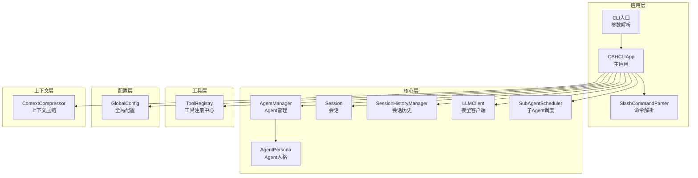
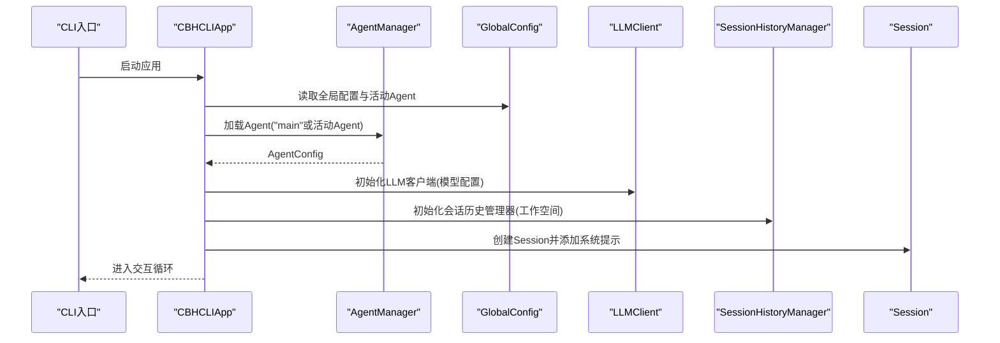
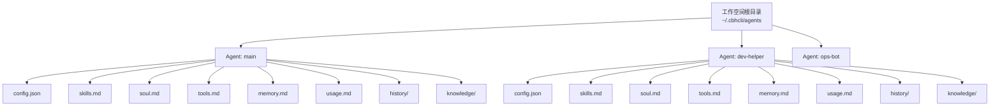
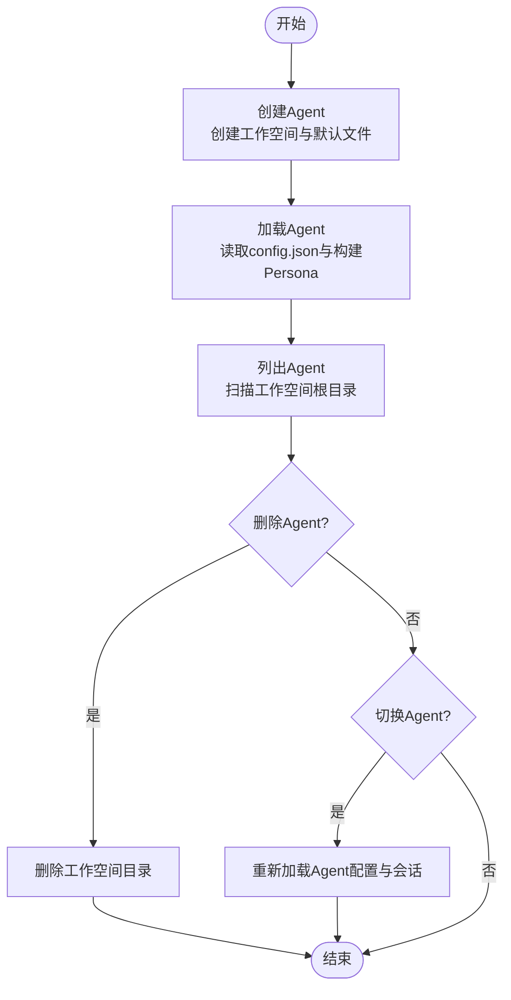
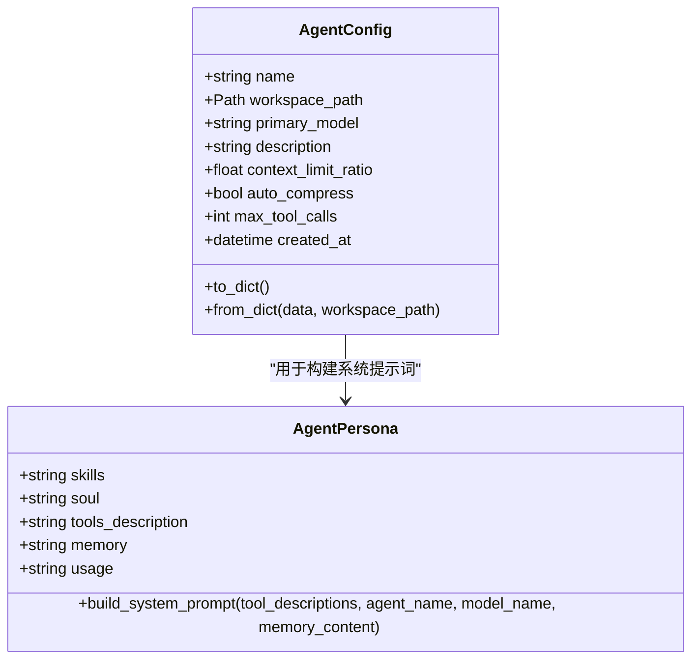
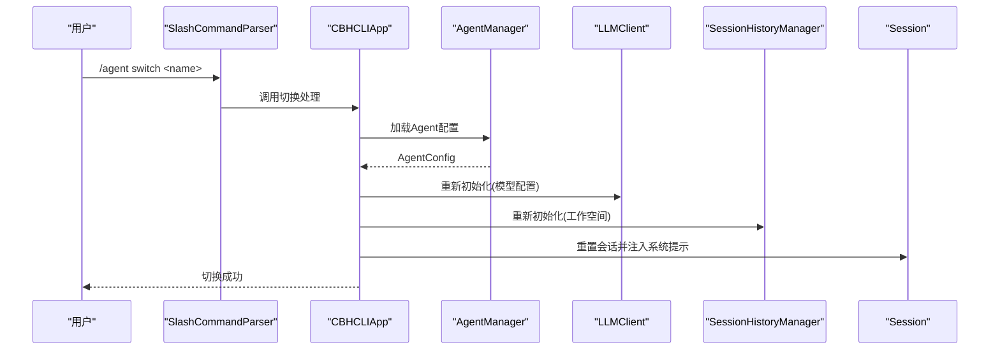
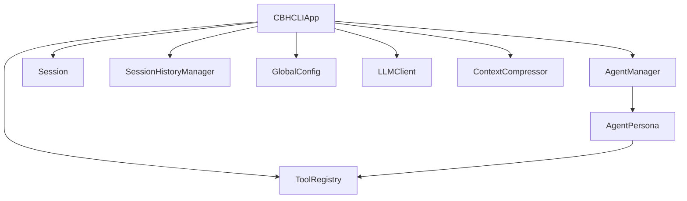

# Agent概念与工作原理

<cite>
**本文引用的文件**
- [app.py](file://cbhcli_pkg/core/app.py)
- [agent.py](file://cbhcli_pkg/core/agent.py)
- [agent_cmd.py](file://cbhcli_pkg/commands/agent_cmd.py)
- [session.py](file://cbhcli_pkg/core/session.py)
- [session_history.py](file://cbhcli_pkg/core/session_history.py)
- [global_config.py](file://cbhcli_pkg/config/global_config.py)
- [compressor.py](file://cbhcli_pkg/context/compressor.py)
- [model.py](file://cbhcli_pkg/core/model.py)
- [registry.py](file://cbhcli_pkg/tools/registry.py)
- [cli.py](file://cbhcli_pkg/cli.py)
- [README.md](file://README.md)
</cite>

## 目录
1. [简介](#简介)
2. [项目结构](#项目结构)
3. [核心组件](#核心组件)
4. [架构总览](#架构总览)
5. [详细组件分析](#详细组件分析)
6. [依赖关系分析](#依赖关系分析)
7. [性能考量](#性能考量)
8. [故障排查指南](#故障排查指南)
9. [结论](#结论)
10. [附录](#附录)

## 简介
本文件围绕CBHCLI的Agent概念与工作机制展开，系统阐述Agent作为AI助手工作空间的核心地位，包括Agent的独立性、工作空间隔离、人格配置机制、创建/加载/管理工作流程、配置文件结构与作用、人格系统（系统提示词构建与个性化）、Agent之间的隔离与切换过程、工作空间文件组织与数据持久化机制，并提供面向初学者与高级用户的分层讲解与实践指引。

## 项目结构
CBHCLI采用模块化设计，核心围绕“应用层-会话层-工具层-配置层”组织。Agent相关逻辑集中在core模块，命令解析与交互在commands模块，配置与持久化在config模块，上下文压缩与模型调用在context与core模块，工具注册与执行在tools模块。

图表来源
- [app.py:54-280](file://cbhcli_pkg/core/app.py#L54-L280)
- [agent.py:572-762](file://cbhcli_pkg/core/agent.py#L572-L762)
- [agent_cmd.py:5-181](file://cbhcli_pkg/commands/agent_cmd.py#L5-L181)
- [session.py:37-190](file://cbhcli_pkg/core/session.py#L37-L190)
- [session_history.py:8-136](file://cbhcli_pkg/core/session_history.py#L8-L136)
- [global_config.py:13-154](file://cbhcli_pkg/config/global_config.py#L13-L154)
- [compressor.py:7-112](file://cbhcli_pkg/context/compressor.py#L7-L112)
- [model.py:7-147](file://cbhcli_pkg/core/model.py#L7-L147)
- [registry.py:51-115](file://cbhcli_pkg/tools/registry.py#L51-L115)
- [cli.py:73-112](file://cbhcli_pkg/cli.py#L73-L112)

章节来源
- [README.md:269-295](file://README.md#L269-L295)
- [cli.py:73-112](file://cbhcli_pkg/cli.py#L73-L112)

## 核心组件
- Agent管理器（AgentManager）：负责Agent工作空间的创建、加载、列表、删除与配置持久化；负责从Markdown文件构建Agent人格（skills/soul/tools/memory/usage）。
- Agent配置（AgentConfig）：描述Agent的基本属性（名称、工作空间路径、主模型、上下文限制比例、自动压缩开关、最大工具调用次数等），并提供序列化/反序列化。
- Agent人格（AgentPersona）：从MD文件读取并构建系统提示词，包含基本信息、长期记忆、使用说明、技能、性格、工具使用指南以及可用工具描述。
- 会话（Session）：维护消息列表、token统计、上下文窗口、会话重置与消息替换。
- 会话历史（SessionHistoryManager）：保存/列出/加载/删除历史会话，文件命名含时间戳与会话ID。
- 全局配置（GlobalConfig）：管理模型、嵌入模型、重排序模型、Agent活动状态、工作空间根路径等全局设置。
- 上下文压缩（ContextCompressor）：基于LLM对中间对话生成摘要，减少token占用。
- LLM客户端（LLMClient）：封装统一的聊天与流式接口，支持工具调用字段解析。
- 工具注册中心（ToolRegistry）：统一管理工具的注册、描述与执行。
- 子Agent调度（SubAgentScheduler）：临时子Agent的创建、状态管理与结果等待。

章节来源
- [agent.py:476-571](file://cbhcli_pkg/core/agent.py#L476-L571)
- [agent.py:572-762](file://cbhcli_pkg/core/agent.py#L572-L762)
- [session.py:37-190](file://cbhcli_pkg/core/session.py#L37-L190)
- [session_history.py:8-136](file://cbhcli_pkg/core/session_history.py#L8-L136)
- [global_config.py:13-154](file://cbhcli_pkg/config/global_config.py#L13-L154)
- [compressor.py:7-112](file://cbhcli_pkg/context/compressor.py#L7-L112)
- [model.py:7-147](file://cbhcli_pkg/core/model.py#L7-L147)
- [registry.py:51-115](file://cbhcli_pkg/tools/registry.py#L51-L115)
- [subagent.py:55-118](file://cbhcli_pkg/core/subagent.py#L55-L118)

## 架构总览
Agent作为独立工作空间，拥有自己的配置、人格文件、知识库与会话历史。应用启动时确保存在“main”Agent，随后根据全局配置加载当前活动Agent。每个Agent拥有独立的LLM客户端、上下文压缩器、会话历史管理器与MCP管理器，实现强隔离与可切换。

图表来源
- [app.py:204-280](file://cbhcli_pkg/core/app.py#L204-L280)
- [agent.py:626-646](file://cbhcli_pkg/core/agent.py#L626-L646)
- [global_config.py:93-100](file://cbhcli_pkg/config/global_config.py#L93-L100)

## 详细组件分析

### Agent工作空间与隔离机制
- 工作空间根路径由全局配置决定，默认位于用户主目录下的“.cbhcli/agents”。每个Agent在该根路径下拥有独立目录，包含config.json、skills.md、soul.md、tools.md、memory.md、usage.md、history/与knowledge/。
- Agent之间通过工作空间路径隔离，彼此的配置、人格、知识库与会话历史互不影响。
- 切换Agent时，应用会重新加载目标Agent的配置、模型、会话历史与MCP管理器，同时重置会话并注入系统提示词。

图表来源
- [agent.py:585-624](file://cbhcli_pkg/core/agent.py#L585-L624)
- [agent.py:647-685](file://cbhcli_pkg/core/agent.py#L647-L685)
- [README.md:192-206](file://README.md#L192-L206)

章节来源
- [agent.py:585-624](file://cbhcli_pkg/core/agent.py#L585-L624)
- [agent.py:647-685](file://cbhcli_pkg/core/agent.py#L647-L685)
- [README.md:192-206](file://README.md#L192-L206)

### Agent创建、加载与管理工作流程
- 创建Agent：创建工作空间目录、知识库目录，生成默认MD文件与config.json。
- 加载Agent：读取config.json，加载Agent配置；同时从MD文件构建AgentPersona。
- 列表Agent：遍历工作空间根目录，筛选包含config.json的目录。
- 删除Agent：删除对应工作空间目录（保护main Agent与当前活动Agent）。
- 切换Agent：通过命令解析器触发，内部调用应用层加载逻辑并更新活动Agent。

图表来源
- [agent.py:585-624](file://cbhcli_pkg/core/agent.py#L585-L624)
- [agent.py:626-646](file://cbhcli_pkg/core/agent.py#L626-L646)
- [agent.py:687-705](file://cbhcli_pkg/core/agent.py#L687-L705)
- [agent.py:707-725](file://cbhcli_pkg/core/agent.py#L707-L725)
- [agent_cmd.py:99-130](file://cbhcli_pkg/commands/agent_cmd.py#L99-L130)
- [agent_cmd.py:154-161](file://cbhcli_pkg/commands/agent_cmd.py#L154-L161)

章节来源
- [agent_cmd.py:5-181](file://cbhcli_pkg/commands/agent_cmd.py#L5-L181)
- [agent.py:585-725](file://cbhcli_pkg/core/agent.py#L585-L725)

### Agent配置文件结构与作用
- config.json：保存Agent名称、描述、主模型、上下文限制比例、自动压缩开关、最大工具调用次数、创建时间等。
- skills.md：Agent的技能描述，用于系统提示词的“技能”部分。
- soul.md：Agent的性格特征与行为准则，用于系统提示词的“性格”部分。
- tools.md：工具使用指南与调用格式规范，用于系统提示词的“工具使用指南”部分。
- memory.md：长期记忆文件，始终包含在系统提示中，仅在用户明确要求记录时写入。
- usage.md：Agent使用说明，包含命令参考、工具调用格式、工作空间说明等。
- history/：会话历史目录，保存每次/new或/reset后的会话。
- knowledge/：Agent专属知识库目录，支持向量化检索。

章节来源
- [agent.py:476-513](file://cbhcli_pkg/core/agent.py#L476-L513)
- [agent.py:515-570](file://cbhcli_pkg/core/agent.py#L515-L570)
- [agent.py:647-685](file://cbhcli_pkg/core/agent.py#L647-L685)
- [README.md:192-206](file://README.md#L192-L206)

### Agent的人格系统与系统提示词构建
- AgentPersona从MD文件读取各部分内容，并在构建系统提示词时按顺序拼接：基本信息（名称、模型）、长期记忆（memory.md）、使用说明、技能、性格、工具使用指南、可用工具描述。
- 系统提示词在每次会话重置时注入，确保AI始终遵循Agent的个性与约束。

图表来源
- [agent.py:476-513](file://cbhcli_pkg/core/agent.py#L476-L513)
- [agent.py:515-570](file://cbhcli_pkg/core/agent.py#L515-L570)

章节来源
- [agent.py:515-570](file://cbhcli_pkg/core/agent.py#L515-L570)

### Agent之间的隔离与切换过程
- 隔离点：工作空间路径、LLM客户端、上下文压缩器、会话历史管理器、MCP管理器均按Agent独立实例化。
- 切换流程：命令解析器接收/agent switch，调用应用层_load_agent，重新初始化上述组件并重置会话。

图表来源
- [agent_cmd.py:154-161](file://cbhcli_pkg/commands/agent_cmd.py#L154-L161)
- [app.py:231-279](file://cbhcli_pkg/core/app.py#L231-L279)
- [agent.py:626-646](file://cbhcli_pkg/core/agent.py#L626-L646)

章节来源
- [agent_cmd.py:154-161](file://cbhcli_pkg/commands/agent_cmd.py#L154-L161)
- [app.py:231-279](file://cbhcli_pkg/core/app.py#L231-L279)

### 代码示例：Agent的创建、配置与使用
- 创建Agent：通过命令“/agent create <name>”，内部调用AgentManager.create_agent，生成工作空间与默认文件。
- 配置模型：通过命令“/model add/use”，在全局配置中保存模型信息，Agent加载时读取主模型或回退到全局最后选择的模型。
- 使用Agent：进入交互界面后，系统提示词已注入Agent的人格与工具描述，AI可按工具调用格式执行任务。

章节来源
- [agent_cmd.py:99-130](file://cbhcli_pkg/commands/agent_cmd.py#L99-L130)
- [app.py:250-258](file://cbhcli_pkg/core/app.py#L250-L258)
- [global_config.py:56-90](file://cbhcli_pkg/config/global_config.py#L56-L90)

### Agent工作空间的文件组织与数据持久化
- 配置持久化：AgentConfig序列化为config.json；GlobalConfig序列化为~/.cbhcli/config.json，保存模型、嵌入模型、重排序模型、活动Agent与设置。
- 会话持久化：每次/new或/reset时，当前会话自动保存至history/目录，文件名为“时间戳_会话ID.json”，包含消息列表、标题、创建时间与消息数量。
- 知识库持久化：知识库文件位于knowledge/目录，支持向量化索引与检索；向量索引需手动触发，避免启动时的大量API调用与时间消耗。

章节来源
- [agent.py:739-743](file://cbhcli_pkg/core/agent.py#L739-L743)
- [global_config.py:50-54](file://cbhcli_pkg/config/global_config.py#L50-L54)
- [session_history.py:24-64](file://cbhcli_pkg/core/session_history.py#L24-L64)
- [README.md:208-229](file://README.md#L208-L229)

## 依赖关系分析
- 应用层依赖Agent管理器、命令解析器、全局配置、LLM客户端、工具注册中心、会话历史管理器与上下文压缩器。
- Agent管理器依赖工作空间路径与MD文件；AgentPersona依赖MD文件内容；Session依赖消息结构与上下文窗口。
- 工具注册中心提供统一工具描述，供AgentPersona构建系统提示词时使用。
- 全局配置提供模型与设置，影响Agent加载与上下文压缩策略。

图表来源
- [app.py:12-51](file://cbhcli_pkg/core/app.py#L12-L51)
- [agent.py:572-571](file://cbhcli_pkg/core/agent.py#L572-L571)
- [session.py:37-190](file://cbhcli_pkg/core/session.py#L37-L190)
- [session_history.py:8-136](file://cbhcli_pkg/core/session_history.py#L8-L136)
- [global_config.py:13-154](file://cbhcli_pkg/config/global_config.py#L13-L154)
- [compressor.py:7-112](file://cbhcli_pkg/context/compressor.py#L7-L112)
- [registry.py:51-115](file://cbhcli_pkg/tools/registry.py#L51-L115)

章节来源
- [app.py:12-51](file://cbhcli_pkg/core/app.py#L12-L51)
- [agent.py:572-571](file://cbhcli_pkg/core/agent.py#L572-L571)

## 性能考量
- 上下文压缩：当会话token接近模型限制比例（默认80%）时自动压缩，通过摘要保留关键信息，减少API调用成本与响应时间。
- 模型选择：不同模型具有不同的上下文长度与成本，应在Agent配置中合理选择主模型。
- 向量索引：向量索引需手动触发，避免启动时的大量API调用；更新知识库后可按需重新索引。
- 工具调用：严格遵循工具调用格式，避免多次无效尝试导致token与成本浪费。

章节来源
- [app.py:368-385](file://cbhcli_pkg/core/app.py#L368-L385)
- [compressor.py:21-81](file://cbhcli_pkg/context/compressor.py#L21-L81)
- [global_config.py:42-47](file://cbhcli_pkg/config/global_config.py#L42-L47)

## 故障排查指南
- Agent加载失败：检查工作空间是否存在config.json；确认模型配置是否正确；查看全局配置中的活动Agent设置。
- 会话历史无法恢复：确认history/目录存在且文件为有效JSON；检查文件名格式与权限。
- 上下文压缩失败：检查LLM客户端连接与API密钥；确认会话消息数量足够进行摘要生成。
- 工具调用格式错误：严格遵循Agent使用说明中的工具调用格式；一次仅调用一个工具。

章节来源
- [agent.py:626-646](file://cbhcli_pkg/core/agent.py#L626-L646)
- [session_history.py:99-135](file://cbhcli_pkg/core/session_history.py#L99-L135)
- [compressor.py:83-112](file://cbhcli_pkg/context/compressor.py#L83-L112)
- [agent.py:282-347](file://cbhcli_pkg/core/agent.py#L282-L347)

## 结论
CBHCLI的Agent以“工作空间+人格+工具”的三位一体设计实现了高度的独立性与可扩展性。通过严格的文件组织与持久化机制、完善的命令体系与上下文管理，Agent能够在多场景下稳定运行并支持复杂任务。对于初学者，建议从“main”Agent入手，逐步学习命令与工作空间组织；对于高级用户，可通过子Agent、向量索引与模型配置实现更精细的控制与优化。

## 附录
- 命令参考与使用说明详见README中的命令参考与使用指南章节。
- CLI入口提供帮助信息与版本查询，便于快速上手。

章节来源
- [README.md:231-261](file://README.md#L231-L261)
- [cli.py:73-112](file://cbhcli_pkg/cli.py#L73-L112)