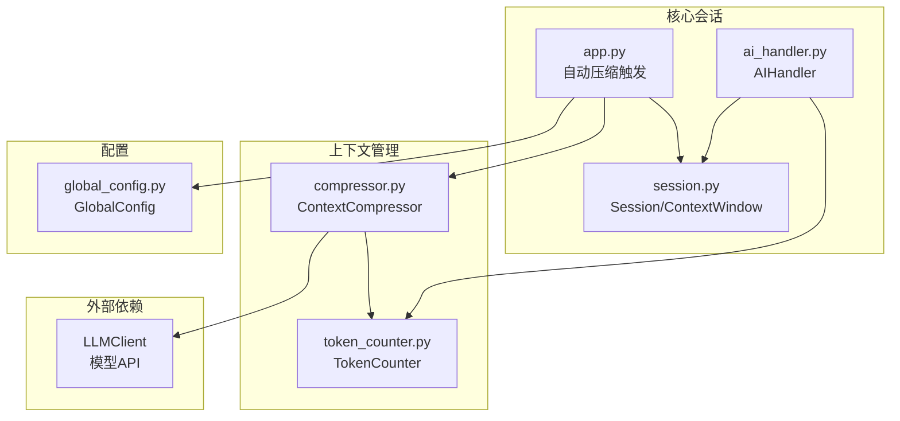
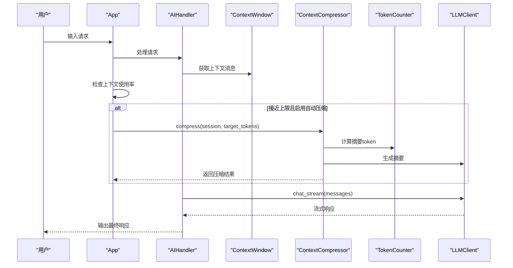
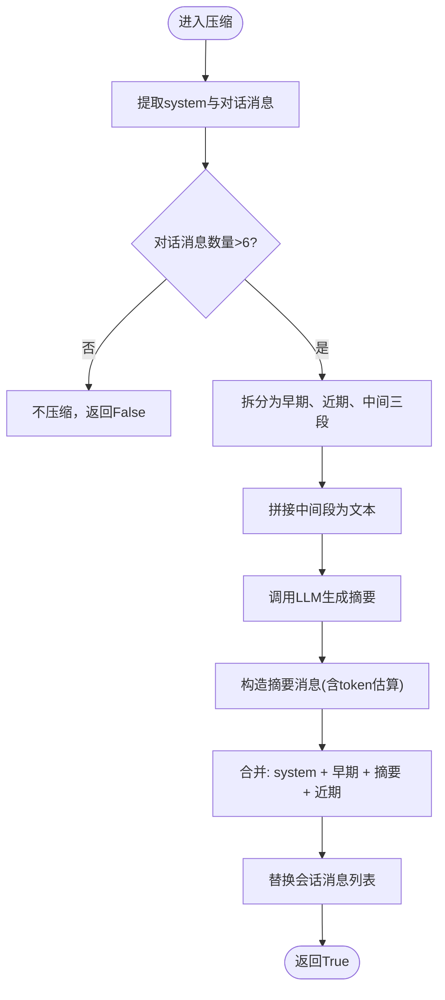
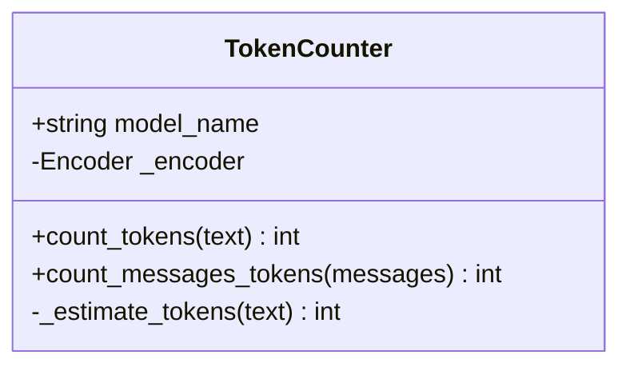
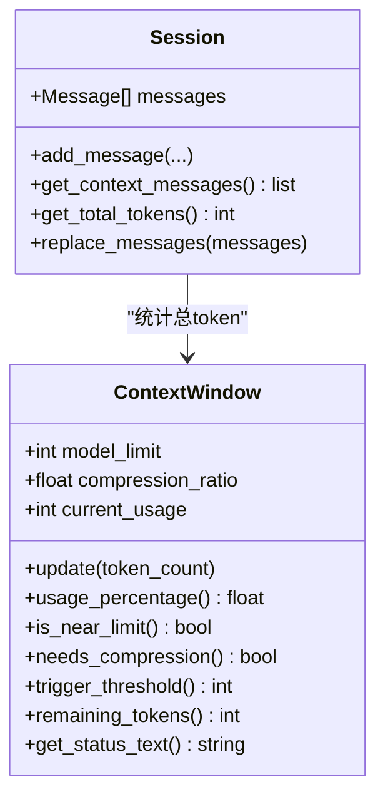
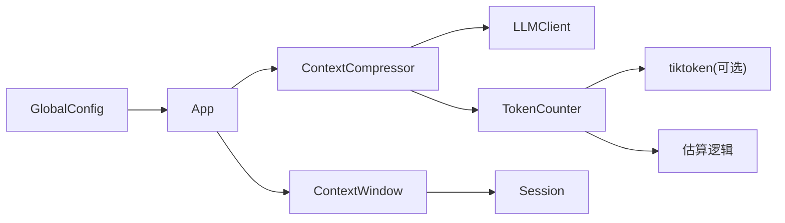

# 上下文压缩机制

<cite>
**本文引用的文件**
- [compressor.py](file://cbhcli_pkg/context/compressor.py)
- [token_counter.py](file://cbhcli_pkg/context/token_counter.py)
- [session.py](file://cbhcli_pkg/core/session.py)
- [app.py](file://cbhcli_pkg/core/app.py)
- [ai_handler.py](file://cbhcli_pkg/core/ai_handler.py)
- [global_config.py](file://cbhcli_pkg/config/global_config.py)
- [README.md](file://README.md)
</cite>

## 目录
1. [简介](#简介)
2. [项目结构](#项目结构)
3. [核心组件](#核心组件)
4. [架构总览](#架构总览)
5. [详细组件分析](#详细组件分析)
6. [依赖分析](#依赖分析)
7. [性能考量](#性能考量)
8. [故障排查指南](#故障排查指南)
9. [结论](#结论)
10. [附录](#附录)

## 简介
本文件针对CBHCLI的上下文压缩机制进行深入技术说明，围绕以下关键点展开：
- 长对话导致的token超限问题与自动压缩触发条件
- 压缩算法实现（compressor模块）、策略选择与效果评估
- token计数器的精确计算机制（token_counter模块），以及不同模型的token计算差异与准确性保障
- 压缩过程中的消息选择策略（保留/剔除原则、连贯性维护）
- 压缩配置优化建议（压缩比例、触发阈值、性能影响）
- 典型应用场景与效果对比（通过代码路径引用展示）
- 对AI响应质量与对话体验的影响分析

## 项目结构
CBHCLI的上下文压缩相关代码主要分布在以下模块：
- 上下文压缩器：context/compressor.py
- Token计数器：context/token_counter.py
- 会话与上下文窗口：core/session.py
- 应用入口与自动压缩触发：core/app.py
- AI请求处理与消息构建：core/ai_handler.py
- 全局配置（含自动压缩开关与压缩比例）：config/global_config.py
- 项目说明与命令参考：README.md

图表来源
- [compressor.py:1-112](file://cbhcli_pkg/context/compressor.py#L1-L112)
- [token_counter.py:1-88](file://cbhcli_pkg/context/token_counter.py#L1-L88)
- [session.py:127-190](file://cbhcli_pkg/core/session.py#L127-L190)
- [app.py:361-385](file://cbhcli_pkg/core/app.py#L361-L385)
- [ai_handler.py:1-743](file://cbhcli_pkg/core/ai_handler.py#L1-L743)
- [global_config.py:42-47](file://cbhcli_pkg/config/global_config.py#L42-L47)

章节来源
- [compressor.py:1-112](file://cbhcli_pkg/context/compressor.py#L1-L112)
- [token_counter.py:1-88](file://cbhcli_pkg/context/token_counter.py#L1-L88)
- [session.py:127-190](file://cbhcli_pkg/core/session.py#L127-L190)
- [app.py:361-385](file://cbhcli_pkg/core/app.py#L361-L385)
- [ai_handler.py:1-743](file://cbhcli_pkg/core/ai_handler.py#L1-L743)
- [global_config.py:42-47](file://cbhcli_pkg/config/global_config.py#L42-L47)

## 核心组件
- ContextCompressor：负责将长对话压缩为更紧凑的“历史摘要”形式，同时保留关键的历史片段，维持上下文连贯性。
- TokenCounter：提供token估算与精确计数能力，支持tiktoken精确编码与降级估算两种模式。
- Session/ContextWindow：维护会话消息、统计总token数，并提供上下文窗口的使用率、阈值与剩余token等状态信息。
- AIHandler：在每次AI请求前检查上下文状态，构建消息列表，处理工具调用与流式输出。
- GlobalConfig：提供全局设置，包括自动压缩开关与压缩比例（默认0.8）。

章节来源
- [compressor.py:7-112](file://cbhcli_pkg/context/compressor.py#L7-L112)
- [token_counter.py:14-88](file://cbhcli_pkg/context/token_counter.py#L14-L88)
- [session.py:37-190](file://cbhcli_pkg/core/session.py#L37-L190)
- [ai_handler.py:21-743](file://cbhcli_pkg/core/ai_handler.py#L21-L743)
- [global_config.py:42-47](file://cbhcli_pkg/config/global_config.py#L42-L47)

## 架构总览
自动压缩的整体流程如下：
- 用户输入触发AI请求
- AIHandler构建消息列表并调用LLM
- App在请求前检查上下文使用率
- 若超过压缩阈值且开启自动压缩，则调用ContextCompressor进行压缩
- 压缩完成后继续正常推理

图表来源
- [app.py:368-385](file://cbhcli_pkg/core/app.py#L368-L385)
- [compressor.py:21-81](file://cbhcli_pkg/context/compressor.py#L21-L81)
- [token_counter.py:34-48](file://cbhcli_pkg/context/token_counter.py#L34-L48)
- [ai_handler.py:98-216](file://cbhcli_pkg/core/ai_handler.py#L98-L216)

## 详细组件分析

### ContextCompressor（上下文压缩器）
- 设计目标：在不丢失关键信息的前提下，显著降低上下文长度，避免token超限。
- 压缩策略：
  - 保留system消息（始终保留）
  - 保留最早2轮与最近3轮的user/assistant/tool消息，形成“前后锚点”
  - 对中间部分进行AI摘要，生成一条system类型的摘要消息
  - 通过LLM生成摘要，确保技术细节（如文件路径、命令、错误信息）得以保留
- 触发条件：当会话中conversation消息数量大于6条时才进行压缩；否则认为消息较少，无需压缩。
- 摘要生成：使用专门的system提示，强调需求、操作、修改内容、问题与状态等关键要素；温度较低以提升稳定性。
- 错误兜底：若摘要生成失败，回退为保留原文片段的简短提示，避免完全丢弃历史。

图表来源
- [compressor.py:21-81](file://cbhcli_pkg/context/compressor.py#L21-L81)

章节来源
- [compressor.py:7-112](file://cbhcli_pkg/context/compressor.py#L7-L112)

### TokenCounter（Token计数器）
- 精确计数：优先使用tiktoken，基于具体模型的encoder进行精确编码，确保与模型实际token化一致。
- 降级估算：若未安装tiktoken或模型不可识别，则采用启发式估算：
  - 中文字符按约1.5字符/token
  - 英文及其他字符按约4字符/token
- 消息计数：每条消息额外计入基础开销（约4 tokens用于role等元数据），然后累加content的token数。
- 全局单例：提供便捷的全局TokenCounter实例，减少重复初始化成本。

图表来源
- [token_counter.py:14-88](file://cbhcli_pkg/context/token_counter.py#L14-L88)

章节来源
- [token_counter.py:14-88](file://cbhcli_pkg/context/token_counter.py#L14-L88)

### Session/ContextWindow（会话与上下文窗口）
- Session：维护消息列表、token总数、消息增删与替换等操作；提供API消息格式转换。
- ContextWindow：
  - 维护模型最大token限制与压缩阈值比例（默认0.8）
  - 提供当前使用率、是否接近上限、是否需要压缩、触发阈值、剩余token等状态查询
  - 通过触发阈值(target_tokens)与compressor配合，实现目标token压缩

图表来源
- [session.py:37-190](file://cbhcli_pkg/core/session.py#L37-L190)

章节来源
- [session.py:37-190](file://cbhcli_pkg/core/session.py#L37-L190)

### AIHandler（AI请求处理）
- 在每次请求前，AIHandler会将当前会话消息转换为API格式，并调用LLM进行流式输出。
- 该模块不直接参与压缩逻辑，但在压缩后继续进行推理，确保压缩不影响后续交互。
- 与TokenCounter协作，为消息与摘要提供token估算，辅助上下文窗口判断。

章节来源
- [ai_handler.py:51-96](file://cbhcli_pkg/core/ai_handler.py#L51-L96)
- [ai_handler.py:98-216](file://cbhcli_pkg/core/ai_handler.py#L98-L216)

### 自动压缩触发（App）
- App在每次AI请求前检查上下文使用率与配置：
  - 若当前Agent启用了自动压缩且使用率超过阈值，则调用ContextCompressor进行压缩
  - 压缩目标为当前触发阈值（即模型限制×压缩比例）

章节来源
- [app.py:368-385](file://cbhcli_pkg/core/app.py#L368-L385)

## 依赖分析
- ContextCompressor依赖：
  - LLMClient：用于生成摘要
  - TokenCounter：用于估算摘要消息的token数
- TokenCounter依赖：
  - tiktoken（可选）：提供精确编码
  - fallback：中文/英文字符估算
- Session/ContextWindow：
  - 与App协作，提供上下文状态
- GlobalConfig：
  - 提供auto_compress与compression_ratio配置项

图表来源
- [compressor.py:10-19](file://cbhcli_pkg/context/compressor.py#L10-L19)
- [token_counter.py:7-11](file://cbhcli_pkg/context/token_counter.py#L7-L11)
- [app.py:368-385](file://cbhcli_pkg/core/app.py#L368-L385)
- [global_config.py:42-47](file://cbhcli_pkg/config/global_config.py#L42-L47)

章节来源
- [compressor.py:10-19](file://cbhcli_pkg/context/compressor.py#L10-L19)
- [token_counter.py:7-11](file://cbhcli_pkg/context/token_counter.py#L7-L11)
- [app.py:368-385](file://cbhcli_pkg/core/app.py#L368-L385)
- [global_config.py:42-47](file://cbhcli_pkg/config/global_config.py#L42-L47)

## 性能考量
- 压缩频率控制：默认压缩比例为0.8，意味着当使用率达到80%时触发压缩。该阈值可在全局配置中调整，以平衡压缩频率与上下文长度。
- LLM摘要成本：摘要生成需要一次额外的API调用，建议在消息较多、接近上限时触发，避免频繁压缩带来的延迟。
- Token估算误差：在未安装tiktoken时采用估算，可能与实际token数存在偏差。建议在生产环境中安装tiktoken以获得更准确的估算。
- 摘要质量：摘要温度较低（0.3），有助于稳定输出；若模型对摘要质量敏感，可考虑在摘要提示中加入更明确的约束。

[本节为通用性能建议，不直接分析具体文件]

## 故障排查指南
- 压缩未生效
  - 检查全局配置中的auto_compress是否启用
  - 确认当前Agent的compression_ratio设置是否合理
  - 查看上下文使用率是否确实接近阈值
- 摘要生成失败
  - 检查LLMClient连接与权限
  - 查看日志中是否有异常信息
  - 回退逻辑会保留原文片段，确认是否出现截断
- Token估算不准确
  - 安装tiktoken以启用精确计数
  - 确认模型名称正确，以便选择合适的encoder

章节来源
- [global_config.py:42-47](file://cbhcli_pkg/config/global_config.py#L42-L47)
- [compressor.py:107-112](file://cbhcli_pkg/context/compressor.py#L107-L112)
- [token_counter.py:27-32](file://cbhcli_pkg/context/token_counter.py#L27-L32)

## 结论
CBHCLI的上下文压缩机制通过“前后锚点+AI摘要”的策略，在保证关键信息与上下文连贯性的前提下，有效缓解长对话导致的token超限问题。结合精确的token计数与可配置的压缩阈值，系统能够在不同模型与任务场景下取得较好的平衡。建议在生产环境中启用tiktoken以提升估算精度，并根据实际对话复杂度调整压缩比例与阈值，以获得更优的响应质量与体验。

[本节为总结性内容，不直接分析具体文件]

## 附录

### 压缩算法的应用场景与效果对比（代码路径示例）
- 场景A：长对话工程讨论
  - 压缩前：会话包含大量user/assistant/tool消息，接近模型上限
  - 压缩后：保留早期与近期关键交互，中间部分以摘要替代，显著降低token数
  - 效果：继续推理不受阻，上下文连贯性得到维护
- 场景B：工具调用密集型任务
  - 压缩前：工具调用产生的tool消息增多，token快速上升
  - 压缩后：摘要保留关键操作与结果，减少冗余信息
  - 效果：保持对工具执行历史的记忆，同时避免超限

章节来源
- [compressor.py:21-81](file://cbhcli_pkg/context/compressor.py#L21-L81)
- [session.py:127-190](file://cbhcli_pkg/core/session.py#L127-L190)

### 压缩配置优化建议
- 压缩比例设置
  - 默认0.8，适合大多数长对话场景
  - 对于极长会话或低token模型，可适当降低比例（如0.7）以提前压缩
- 触发阈值调整
  - 结合模型上下文长度与对话复杂度，动态调整compression_ratio
  - 在高并发或低延迟场景下，可适度提高阈值以减少压缩频率
- 性能影响评估
  - 压缩频率与LLM摘要成本成正比，需权衡压缩次数与token节省
  - 建议在消息数量≥6时才触发压缩，避免对短对话造成不必要的开销

章节来源
- [global_config.py:42-47](file://cbhcli_pkg/config/global_config.py#L42-L47)
- [session.py:130-172](file://cbhcli_pkg/core/session.py#L130-L172)

### token计数器的准确性保障
- 精确模式：优先使用tiktoken，按模型encoder进行编码，误差最小
- 降级模式：基于字符统计的启发式估算，适合无tiktoken环境的快速估算
- 消息开销：每条消息计入基础开销，避免低估整体token占用

章节来源
- [token_counter.py:27-58](file://cbhcli_pkg/context/token_counter.py#L27-L58)

### 压缩过程中的消息选择策略
- 保留原则
  - system消息：始终保留
  - 早期与近期消息：各保留至少2轮，确保上下文连贯
- 冗余剔除
  - 中间段非关键细节通过摘要聚合，减少重复与冗余
- 连贯性维护
  - 摘要聚焦需求、操作、修改、问题与状态等关键要素
  - 通过LLM生成摘要，确保技术细节（如路径、命令、错误）不丢失

章节来源
- [compressor.py:32-76](file://cbhcli_pkg/context/compressor.py#L32-L76)