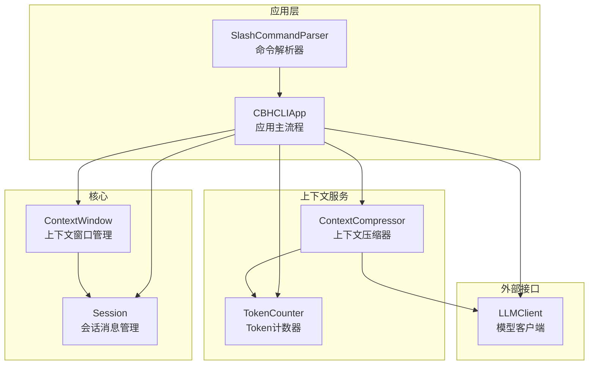
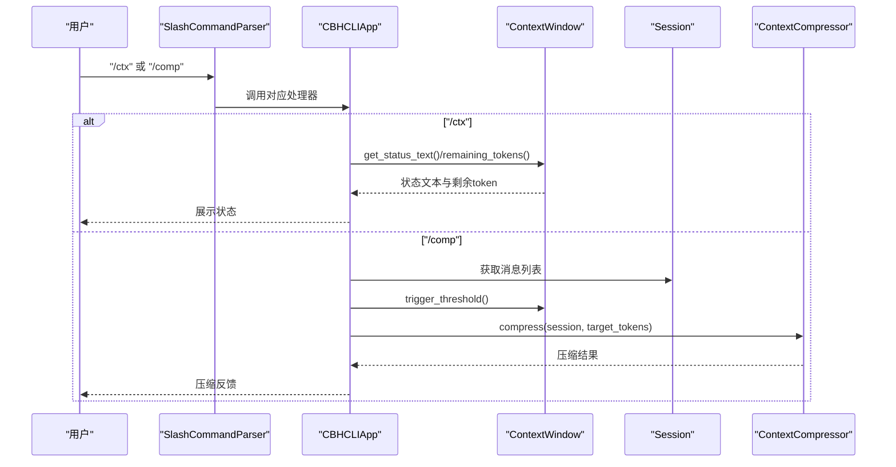
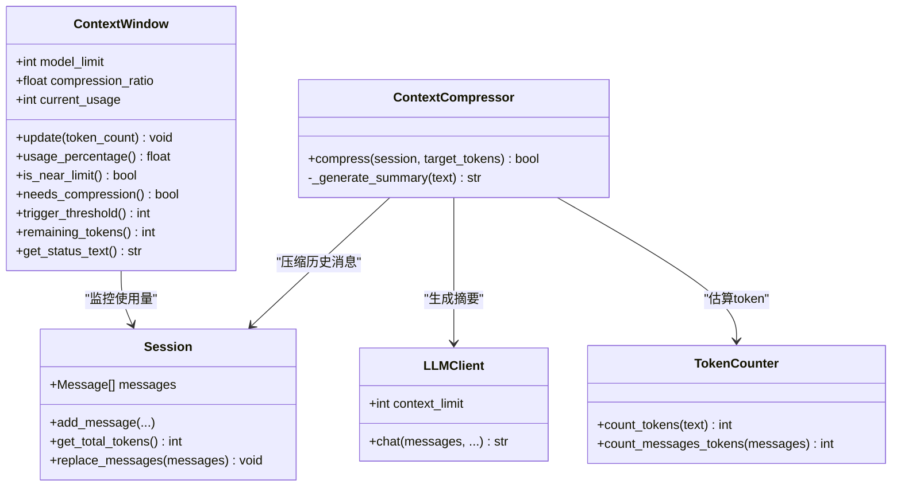
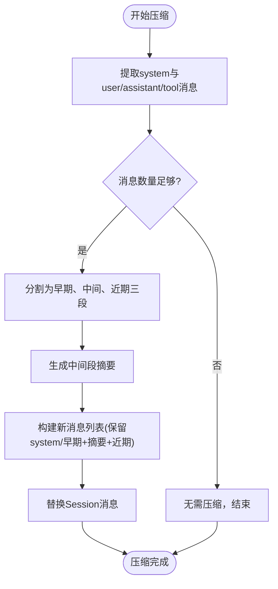
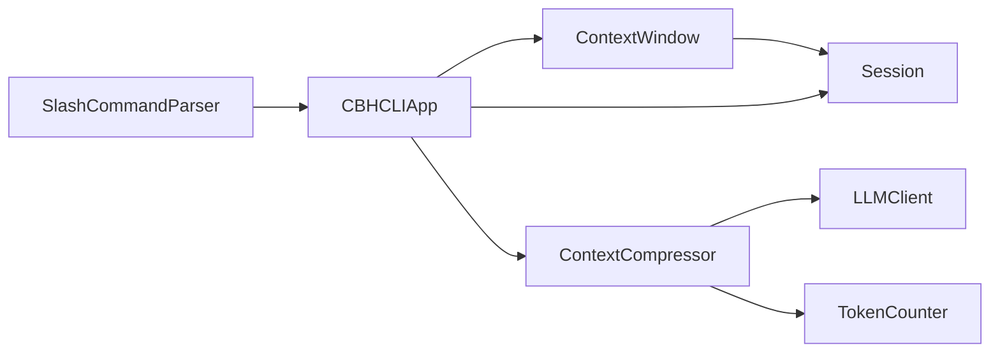

# 上下文窗口管理

<cite>
**本文引用的文件**
- [session.py](file://cbhcli_pkg/core/session.py)
- [app.py](file://cbhcli_pkg/core/app.py)
- [constants.py](file://cbhcli_pkg/core/constants.py)
- [session_cmd.py](file://cbhcli_pkg/commands/session_cmd.py)
- [compressor.py](file://cbhcli_pkg/context/compressor.py)
- [token_counter.py](file://cbhcli_pkg/context/token_counter.py)
- [model.py](file://cbhcli_pkg/core/model.py)
</cite>

## 目录
1. [简介](#简介)
2. [项目结构](#项目结构)
3. [核心组件](#核心组件)
4. [架构总览](#架构总览)
5. [详细组件分析](#详细组件分析)
6. [依赖分析](#依赖分析)
7. [性能考虑](#性能考虑)
8. [故障排查指南](#故障排查指南)
9. [结论](#结论)
10. [附录](#附录)

## 简介
本文面向CBHCLI的上下文窗口管理系统，围绕ContextWindow类的设计与实现展开，系统性阐述其在模型token限制管理、使用量监控、状态报告方面的职责；详解update方法的使用量更新、usage_percentage的计算逻辑与状态文本生成；解释触发压缩的判断机制（is_near_limit与needs_compression）、compression_ratio的作用以及trigger_threshold的计算；说明剩余token数的计算与安全边界；提供上下文状态监控的实用方法get_status_text；并结合具体代码路径给出配置、监控与状态查询的操作示例。最后讨论上下文窗口在不同模型间的适配与优化策略。

## 项目结构
上下文窗口管理涉及的核心文件与职责如下：
- cbhcli_pkg/core/session.py：定义ContextWindow类与Session类，负责上下文窗口状态与会话消息管理
- cbhcli_pkg/core/app.py：应用主流程中初始化ContextWindow、在请求前后检查并触发压缩
- cbhcli_pkg/core/constants.py：定义默认上下文限制与默认压缩阈值等常量
- cbhcli_pkg/commands/session_cmd.py：提供/ctx与/comp命令，用于状态查询与手动压缩
- cbhcli_pkg/context/compressor.py：AI驱动的上下文压缩器，基于摘要重构对话历史
- cbhcli_pkg/context/token_counter.py：Token计数器，支持精确与估算两种模式
- cbhcli_pkg/core/model.py：LLM客户端，提供模型上下文限制context_limit

**图表来源**
- [session.py:127-189](file://cbhcli_pkg/core/session.py#L127-L189)
- [app.py:322-330](file://cbhcli_pkg/core/app.py#L322-L330)
- [compressor.py:7-20](file://cbhcli_pkg/context/compressor.py#L7-L20)
- [token_counter.py:14-33](file://cbhcli_pkg/context/token_counter.py#L14-L33)
- [model.py:10-21](file://cbhcli_pkg/core/model.py#L10-L21)

**章节来源**
- [session.py:127-189](file://cbhcli_pkg/core/session.py#L127-L189)
- [app.py:322-330](file://cbhcli_pkg/core/app.py#L322-L330)
- [constants.py:6-8](file://cbhcli_pkg/core/constants.py#L6-L8)

## 核心组件
- ContextWindow：负责模型token限制、当前使用量、阈值计算、状态文本生成与剩余token计算
- Session：维护消息列表与总token统计，提供上下文消息导出与替换
- ContextCompressor：基于LLM生成摘要，对历史对话进行压缩
- TokenCounter：提供精确/估算的token计数能力
- LLMClient：提供模型上下文限制context_limit

**章节来源**
- [session.py:127-189](file://cbhcli_pkg/core/session.py#L127-L189)
- [compressor.py:7-20](file://cbhcli_pkg/context/compressor.py#L7-L20)
- [token_counter.py:14-33](file://cbhcli_pkg/context/token_counter.py#L14-L33)
- [model.py:10-21](file://cbhcli_pkg/core/model.py#L10-L21)

## 架构总览
上下文窗口管理在应用生命周期中的关键交互：
- 应用启动时根据Agent配置与模型上下文限制初始化ContextWindow
- 每次AI请求前，计算会话总token并更新ContextWindow
- 若达到压缩阈值，则触发ContextCompressor进行历史摘要压缩
- 提供/ctx命令展示状态文本与剩余token，/comp命令手动触发压缩

**图表来源**
- [session_cmd.py:142-182](file://cbhcli_pkg/commands/session_cmd.py#L142-L182)
- [app.py:361-381](file://cbhcli_pkg/core/app.py#L361-L381)
- [session.py:174-189](file://cbhcli_pkg/core/session.py#L174-L189)

## 详细组件分析

### ContextWindow类设计与实现
ContextWindow是上下文窗口管理的核心，负责：
- 初始化：接收模型最大token限制与压缩阈值比例
- 使用量更新：update(token_count)将当前总token数写入
- 使用率计算：usage_percentage()返回0~1之间的使用比例
- 压缩触发判断：is_near_limit()与needs_compression()均基于使用率与阈值比较
- 阈值计算：trigger_threshold()返回触发压缩的token阈值
- 剩余token：remaining_tokens()确保非负边界
- 状态文本：get_status_text()生成人类可读的状态字符串

**图表来源**
- [session.py:127-189](file://cbhcli_pkg/core/session.py#L127-L189)
- [compressor.py:7-20](file://cbhcli_pkg/context/compressor.py#L7-L20)
- [token_counter.py:14-33](file://cbhcli_pkg/context/token_counter.py#L14-L33)
- [model.py:10-21](file://cbhcli_pkg/core/model.py#L10-L21)

**章节来源**
- [session.py:127-189](file://cbhcli_pkg/core/session.py#L127-L189)

#### update方法：使用量更新
- 功能：将当前会话总token数写入current_usage
- 触发时机：每次AI请求前，由应用层计算Session.get_total_tokens()并调用update
- 影响：后续usage_percentage、is_near_limit、needs_compression、trigger_threshold、remaining_tokens均以此为基准

**章节来源**
- [session.py:142-149](file://cbhcli_pkg/core/session.py#L142-L149)
- [app.py:373-374](file://cbhcli_pkg/core/app.py#L373-L374)

#### usage_percentage：使用率计算逻辑
- 计算：current_usage / model_limit
- 边界：当model_limit为0时返回0.0，避免除零
- 用途：作为is_near_limit()与get_status_text()的基础

**章节来源**
- [session.py:151-160](file://cbhcli_pkg/core/session.py#L151-L160)

#### is_near_limit与needs_compression：触发压缩的判断机制
- is_near_limit：当usage_percentage() ≥ compression_ratio时返回True
- needs_compression：直接委托is_near_limit
- 作用：决定是否需要触发压缩流程

**章节来源**
- [session.py:162-168](file://cbhcli_pkg/core/session.py#L162-L168)

#### trigger_threshold：触发阈值计算
- 计算：int(model_limit × compression_ratio)
- 用途：作为ContextCompressor.compress的目标token数

**章节来源**
- [session.py:170-172](file://cbhcli_pkg/core/session.py#L170-L172)

#### remaining_tokens：剩余token数与安全边界
- 计算：max(0, model_limit − current_usage)
- 安全性：确保返回值非负，避免负数影响上层逻辑

**章节来源**
- [session.py:174-176](file://cbhcli_pkg/core/session.py#L174-L176)

#### get_status_text：状态文本生成
- 输出格式：包含当前使用量、模型限制与使用百分比的人类可读文本
- 用途：/ctx命令展示上下文状态

**章节来源**
- [session.py:178-189](file://cbhcli_pkg/core/session.py#L178-L189)

### 上下文压缩流程
ContextCompressor在满足条件时，对历史对话进行摘要压缩：
- 保留system消息与最近若干轮消息，对中间部分生成摘要
- 通过LLMClient生成摘要文本，并替换中间消息为摘要消息
- 更新Session消息列表，降低整体token使用量

**图表来源**
- [compressor.py:21-81](file://cbhcli_pkg/context/compressor.py#L21-L81)

**章节来源**
- [compressor.py:21-81](file://cbhcli_pkg/context/compressor.py#L21-L81)

### Token计数与估算
TokenCounter支持两种计数模式：
- 精确计数：优先使用tiktoken，按模型encoder计算
- 估算计数：若tiktoken不可用或模型不支持，则按字符类型估算（中文与英文分别估算）

**章节来源**
- [token_counter.py:14-58](file://cbhcli_pkg/context/token_counter.py#L14-L58)

### 模型上下文限制与初始化
- LLMClient提供context_limit，默认值来自常量
- 应用在重置会话时，根据Agent配置与模型上下文限制初始化ContextWindow
- 默认压缩阈值来自常量DEFAULT_COMPRESSION_RATIO

**章节来源**
- [model.py:10-21](file://cbhcli_pkg/core/model.py#L10-L21)
- [app.py:322-330](file://cbhcli_pkg/core/app.py#L322-L330)
- [constants.py:6-8](file://cbhcli_pkg/core/constants.py#L6-L8)

## 依赖分析
- ContextWindow依赖Session提供的总token统计
- 应用层在请求前后调用ContextWindow进行状态更新与压缩判断
- ContextCompressor依赖LLMClient与TokenCounter
- 命令层通过SlashCommandParser调用应用层接口

**图表来源**
- [session.py:127-189](file://cbhcli_pkg/core/session.py#L127-L189)
- [app.py:361-381](file://cbhcli_pkg/core/app.py#L361-L381)
- [compressor.py:7-20](file://cbhcli_pkg/context/compressor.py#L7-L20)
- [token_counter.py:14-33](file://cbhcli_pkg/context/token_counter.py#L14-L33)
- [model.py:10-21](file://cbhcli_pkg/core/model.py#L10-L21)

**章节来源**
- [session.py:127-189](file://cbhcli_pkg/core/session.py#L127-L189)
- [app.py:361-381](file://cbhcli_pkg/core/app.py#L361-L381)

## 性能考虑
- Token计数的精确性与性能权衡：tiktoken精确但可能较慢，估算快速但不够准确。在高频上下文更新场景下，可优先使用估算计数以降低开销
- 压缩频率控制：通过调整compression_ratio可在“压缩成本”与“上下文长度”之间取得平衡
- 压缩粒度：保留早期与近期消息有助于维持上下文连贯性，减少摘要带来的信息损失

[本节为通用指导，不直接分析具体文件]

## 故障排查指南
- 上下文窗口未初始化：/ctx命令返回未初始化提示，需确认Agent已加载并初始化
- 压缩失败：ContextCompressor在生成摘要时异常会回退为保留原始内容的标记文本，检查模型API连通性与权限
- 使用率异常为0：确认model_limit是否为0，或是否正确从模型配置读取context_limit
- 剩余token为负：remaining_tokens()内部已做max(0, ... )处理，若出现异常应检查update调用与Session.get_total_tokens()

**章节来源**
- [session_cmd.py:148-149](file://cbhcli_pkg/commands/session_cmd.py#L148-L149)
- [compressor.py:107-111](file://cbhcli_pkg/context/compressor.py#L107-L111)
- [session.py:158-160](file://cbhcli_pkg/core/session.py#L158-L160)
- [session.py:174-176](file://cbhcli_pkg/core/session.py#L174-L176)

## 结论
ContextWindow通过简洁而稳健的设计实现了对模型token限制的管理与监控，配合应用层的自动压缩与命令层的可视化查询，形成了完整的上下文窗口管理体系。其核心在于：
- 明确的阈值与使用率计算
- 安全的剩余token边界
- 可配置的压缩触发比例
- 与压缩器、计数器、模型客户端的协同

这些特性使得系统能够在不同模型与Agent配置下稳定运行，并在长对话与复杂任务中保持良好的上下文有效性。

[本节为总结性内容，不直接分析具体文件]

## 附录

### 代码示例（以路径代替代码片段）
- 配置上下文窗口与模型限制
  - [初始化上下文窗口:322-330](file://cbhcli_pkg/core/app.py#L322-L330)
  - [默认上下文限制与压缩阈值:6-8](file://cbhcli_pkg/core/constants.py#L6-L8)
  - [模型上下文限制来源:10-21](file://cbhcli_pkg/core/model.py#L10-L21)

- 监控上下文状态
  - [/ctx命令状态展示:142-182](file://cbhcli_pkg/commands/session_cmd.py#L142-L182)
  - [状态文本生成:178-189](file://cbhcli_pkg/core/session.py#L178-L189)
  - [剩余token计算:174-176](file://cbhcli_pkg/core/session.py#L174-L176)

- 触发压缩与执行压缩
  - [自动压缩检查与触发:368-385](file://cbhcli_pkg/core/app.py#L368-L385)
  - [手动压缩命令:117-140](file://cbhcli_pkg/commands/session_cmd.py#L117-L140)
  - [压缩阈值计算:170-172](file://cbhcli_pkg/core/session.py#L170-L172)
  - [压缩器实现:21-81](file://cbhcli_pkg/context/compressor.py#L21-L81)

- Token计数与估算
  - [Token计数器初始化与估算:14-58](file://cbhcli_pkg/context/token_counter.py#L14-L58)