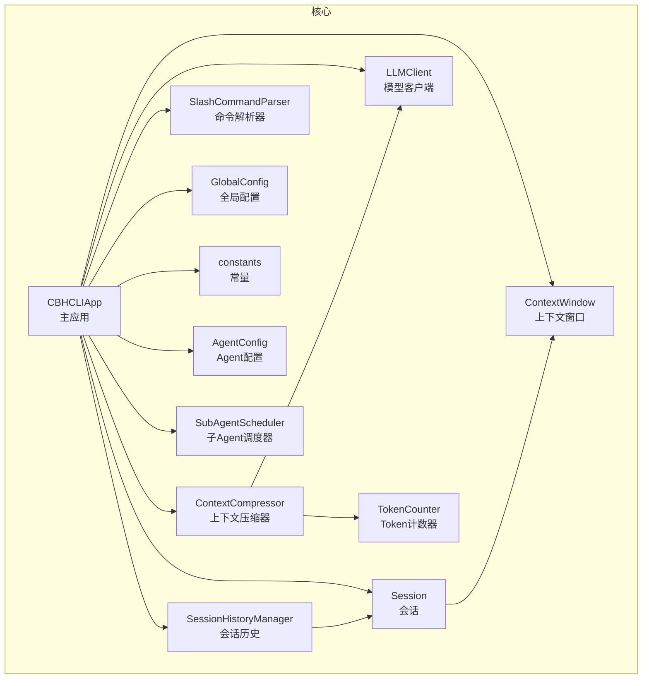
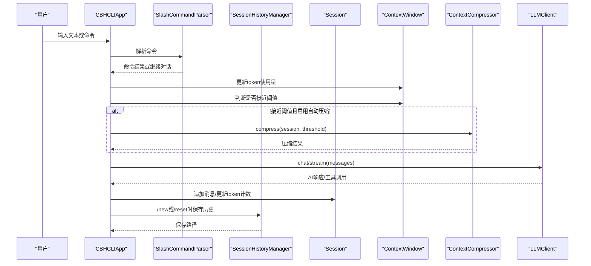
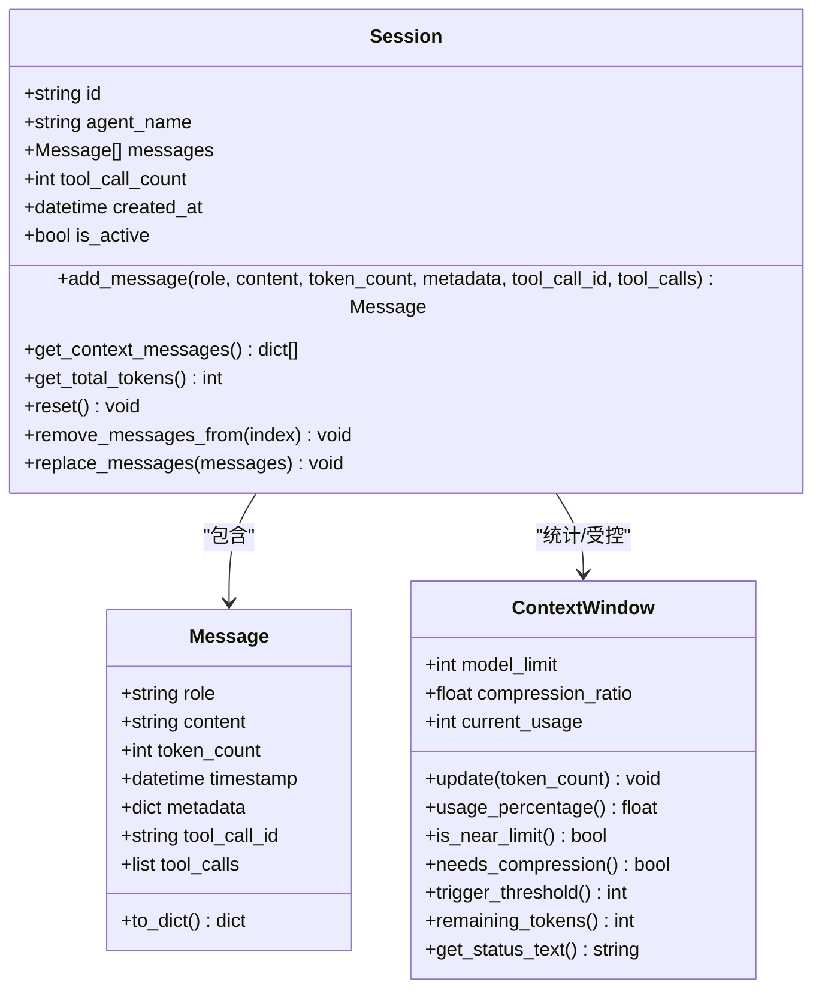
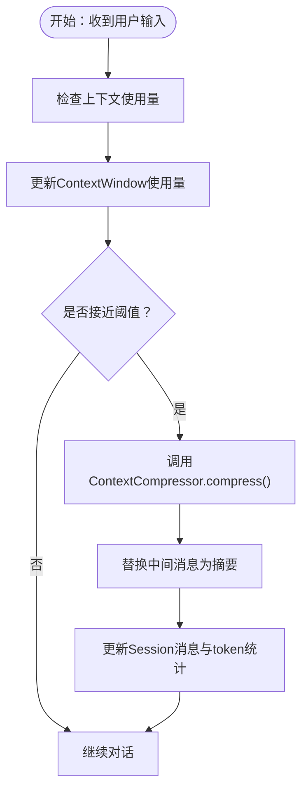
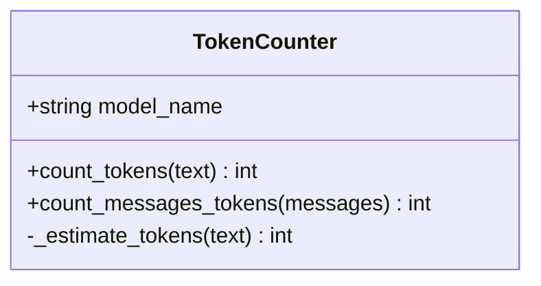
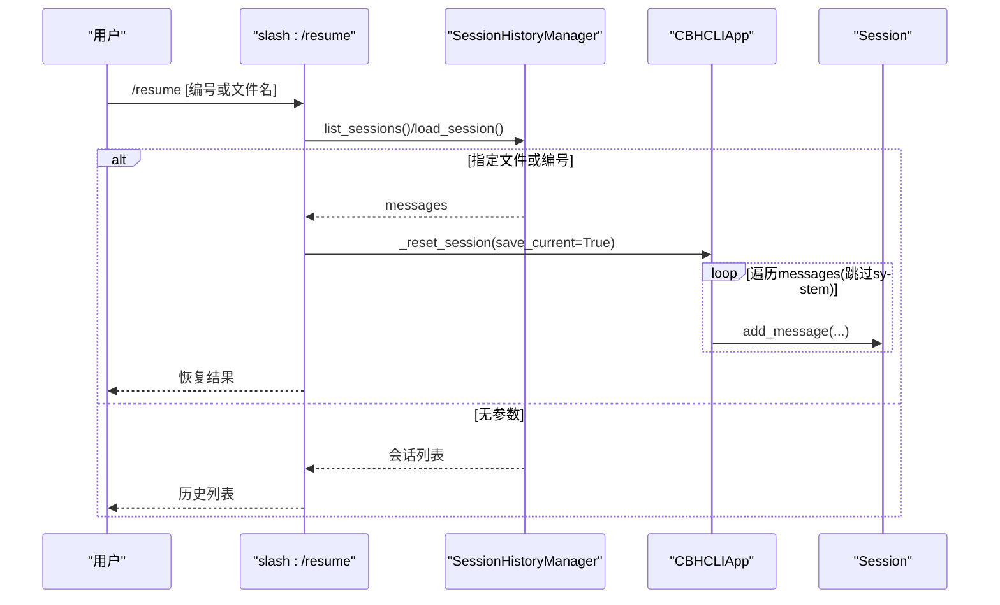
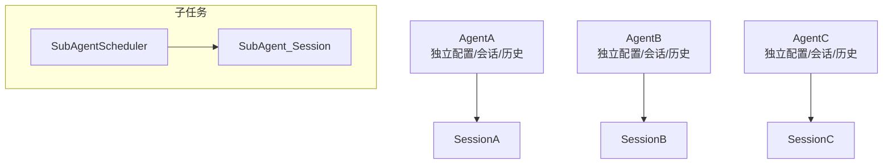
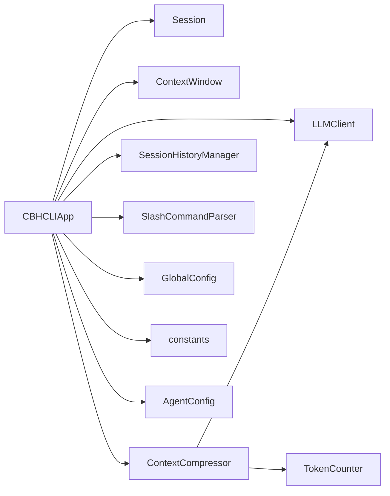

# 会话与上下文管理

<cite>
**本文引用的文件**
- [session.py](file://cbhcli_pkg/core/session.py)
- [compressor.py](file://cbhcli_pkg/context/compressor.py)
- [token_counter.py](file://cbhcli_pkg/context/token_counter.py)
- [session_history.py](file://cbhcli_pkg/core/session_history.py)
- [session_cmd.py](file://cbhcli_pkg/commands/session_cmd.py)
- [app.py](file://cbhcli_pkg/core/app.py)
- [model.py](file://cbhcli_pkg/core/model.py)
- [global_config.py](file://cbhcli_pkg/config/global_config.py)
- [constants.py](file://cbhcli_pkg/core/constants.py)
- [agent.py](file://cbhcli_pkg/core/agent.py)
- [subagent.py](file://cbhcli_pkg/core/subagent.py)
</cite>

## 目录
1. [简介](#简介)
2. [项目结构](#项目结构)
3. [核心组件](#核心组件)
4. [架构总览](#架构总览)
5. [详细组件分析](#详细组件分析)
6. [依赖关系分析](#依赖关系分析)
7. [性能考量](#性能考量)
8. [故障排查指南](#故障排查指南)
9. [结论](#结论)
10. [附录](#附录)

## 简介
本文件面向开发者与高级用户，系统性阐述CBHCLI的会话与上下文管理机制，涵盖会话生命周期、消息传递与状态维护、上下文窗口与自动压缩、会话历史持久化与恢复、配置项与优化建议，以及多Agent环境下的会话隔离与切换。文档以代码为依据，辅以图示与路径指引，帮助读者快速掌握实现细节与最佳实践。

## 项目结构
围绕会话与上下文管理的核心文件组织如下：
- 会话与上下文窗口：cbhcli_pkg/core/session.py
- 上下文压缩器：cbhcli_pkg/context/compressor.py
- Token计数器：cbhcli_pkg/context/token_counter.py
- 会话历史管理：cbhcli_pkg/core/session_history.py
- 会话命令入口：cbhcli_pkg/commands/session_cmd.py
- 主应用与上下文检查：cbhcli_pkg/core/app.py
- LLM客户端：cbhcli_pkg/core/model.py
- 全局配置：cbhcli_pkg/config/global_config.py
- 常量定义：cbhcli_pkg/core/constants.py
- Agent配置与工作空间：cbhcli_pkg/core/agent.py
- 子Agent机制：cbhcli_pkg/core/subagent.py

图表来源
- [app.py:54-331](file://cbhcli_pkg/core/app.py#L54-L331)
- [session.py:37-190](file://cbhcli_pkg/core/session.py#L37-L190)
- [compressor.py:7-112](file://cbhcli_pkg/context/compressor.py#L7-L112)
- [token_counter.py:14-88](file://cbhcli_pkg/context/token_counter.py#L14-L88)
- [session_history.py:8-136](file://cbhcli_pkg/core/session_history.py#L8-L136)
- [model.py:7-147](file://cbhcli_pkg/core/model.py#L7-L147)
- [global_config.py:13-154](file://cbhcli_pkg/config/global_config.py#L13-L154)
- [constants.py:1-50](file://cbhcli_pkg/core/constants.py#L1-L50)
- [agent.py:476-512](file://cbhcli_pkg/core/agent.py#L476-L512)
- [subagent.py:55-118](file://cbhcli_pkg/core/subagent.py#L55-L118)

章节来源
- [app.py:54-331](file://cbhcli_pkg/core/app.py#L54-L331)
- [session.py:37-190](file://cbhcli_pkg/core/session.py#L37-L190)
- [compressor.py:7-112](file://cbhcli_pkg/context/compressor.py#L7-L112)
- [token_counter.py:14-88](file://cbhcli_pkg/context/token_counter.py#L14-L88)
- [session_history.py:8-136](file://cbhcli_pkg/core/session_history.py#L8-L136)
- [model.py:7-147](file://cbhcli_pkg/core/model.py#L7-L147)
- [global_config.py:13-154](file://cbhcli_pkg/config/global_config.py#L13-L154)
- [constants.py:1-50](file://cbhcli_pkg/core/constants.py#L1-L50)
- [agent.py:476-512](file://cbhcli_pkg/core/agent.py#L476-L512)
- [subagent.py:55-118](file://cbhcli_pkg/core/subagent.py#L55-L118)

## 核心组件
- 会话与消息
  - Message：消息数据结构，支持role、content、token_count、timestamp、metadata、tool_call_id、tool_calls等字段，并提供to_dict()用于API消息格式转换。
  - Session：会话容器，负责消息增删改查、上下文导出、总token统计、重置与截断、消息替换（用于压缩后回写）。
- 上下文窗口
  - ContextWindow：跟踪当前token使用量、模型上下文上限、触发压缩的阈值比例，提供使用百分比、剩余token、状态文本等查询接口。
- 上下文压缩器
  - ContextCompressor：基于LLM对中间轮次对话生成摘要，保留最早2轮与最近3轮，其余中间轮次压缩为摘要消息，减少token占用。
- Token计数器
  - TokenCounter：优先使用tiktoken精确计数，若不可用则采用估算（中文与英文不同权重），支持消息列表总token统计。
- 会话历史管理
  - SessionHistoryManager：负责会话保存（history目录）、列出、加载、删除；保存时提取首条用户消息作为标题，记录消息条数与时间戳。
- 命令与交互
  - session_cmd：提供/new、/reset、/resume、/history、/comp、/ctx等命令，连接应用层逻辑与用户交互。
- 主应用与上下文检查
  - CBHCLIApp：初始化Agent、会话、上下文窗口、压缩器、历史管理器；在每次AI请求前检查并自动压缩；提供记忆文件读取与会话重置。
- LLM客户端
  - LLMClient：封装Chat/Stream接口，支持非流式与流式响应，兼容推理阶段的reasoning_content与tool_calls字段。
- 全局配置与常量
  - GlobalConfig：模型、嵌入、重排序、设置等全局配置；提供默认设置（如自动压缩、压缩阈值、工作空间基址）。
  - constants：默认上下文上限、默认压缩阈值、工具调用限制等常量。
- Agent配置与工作空间
  - AgentConfig：每个Agent独立的primary_model、context_limit_ratio、auto_compress、max_tool_calls等配置。
- 子Agent机制
  - SubAgentScheduler：临时子Agent创建、状态管理与结果清理，确保多Agent场景下的会话隔离与任务边界清晰。

章节来源
- [session.py:8-125](file://cbhcli_pkg/core/session.py#L8-L125)
- [session.py:127-190](file://cbhcli_pkg/core/session.py#L127-L190)
- [compressor.py:7-112](file://cbhcli_pkg/context/compressor.py#L7-L112)
- [token_counter.py:14-88](file://cbhcli_pkg/context/token_counter.py#L14-L88)
- [session_history.py:8-136](file://cbhcli_pkg/core/session_history.py#L8-L136)
- [session_cmd.py:5-183](file://cbhcli_pkg/commands/session_cmd.py#L5-L183)
- [app.py:204-331](file://cbhcli_pkg/core/app.py#L204-L331)
- [model.py:7-147](file://cbhcli_pkg/core/model.py#L7-L147)
- [global_config.py:13-154](file://cbhcli_pkg/config/global_config.py#L13-L154)
- [constants.py:1-50](file://cbhcli_pkg/core/constants.py#L1-L50)
- [agent.py:476-512](file://cbhcli_pkg/core/agent.py#L476-L512)
- [subagent.py:55-118](file://cbhcli_pkg/core/subagent.py#L55-L118)

## 架构总览
CBHCLI的会话与上下文管理遵循“应用层-会话层-上下文层-外部服务”的分层设计。应用层在每次用户输入后，先检查上下文是否接近阈值并触发压缩，随后构造AI请求，处理工具调用与流式输出，最终在会话重置时自动保存历史。

图表来源
- [app.py:368-439](file://cbhcli_pkg/core/app.py#L368-L439)
- [session_cmd.py:8-102](file://cbhcli_pkg/commands/session_cmd.py#L8-L102)
- [session_history.py:24-64](file://cbhcli_pkg/core/session_history.py#L24-L64)
- [compressor.py:21-81](file://cbhcli_pkg/context/compressor.py#L21-L81)
- [model.py:28-120](file://cbhcli_pkg/core/model.py#L28-L120)

## 详细组件分析

### 会话生命周期与消息传递
- 创建与初始化
  - 应用加载Agent时创建Session并注入系统提示（含memory.md内容与工具描述），同时初始化ContextWindow与ContextCompressor。
- 消息传递
  - 用户输入经命令解析后进入AI处理流程；AIHandler在处理过程中将用户输入与工具调用结果以Message形式追加至Session。
- 状态维护
  - Session维护消息列表、工具调用计数、创建时间与激活状态；提供重置（保留system消息）、截断与替换（用于压缩后回写）等操作。
- API消息格式
  - Message.to_dict()根据role与工具调用场景生成标准API消息格式，确保assistant的tool_calls与tool消息的tool_call_id正确传递。

图表来源
- [session.py:8-125](file://cbhcli_pkg/core/session.py#L8-L125)
- [session.py:127-190](file://cbhcli_pkg/core/session.py#L127-L190)

章节来源
- [app.py:281-331](file://cbhcli_pkg/core/app.py#L281-L331)
- [session.py:37-125](file://cbhcli_pkg/core/session.py#L37-L125)
- [session.py:127-190](file://cbhcli_pkg/core/session.py#L127-L190)

### 上下文窗口与自动压缩
- 上下文窗口
  - ContextWindow基于模型上下文上限与压缩阈值比例动态评估使用率；提供触发阈值与剩余token查询，便于命令/界面展示。
- 自动压缩触发
  - 应用在每次AI请求前调用_check_and_compress_context，若开启自动压缩且达到阈值，则调用ContextCompressor.compress将中间轮次压缩为摘要消息。
- 压缩策略
  - 保留最早2轮与最近3轮完整消息，中间轮次拼接为文本后交由LLM生成摘要；摘要以system消息形式插入，token计数包含估算开销。

图表来源
- [app.py:368-385](file://cbhcli_pkg/core/app.py#L368-L385)
- [compressor.py:21-81](file://cbhcli_pkg/context/compressor.py#L21-L81)
- [session.py:117-125](file://cbhcli_pkg/core/session.py#L117-L125)

章节来源
- [app.py:368-385](file://cbhcli_pkg/core/app.py#L368-L385)
- [compressor.py:21-81](file://cbhcli_pkg/context/compressor.py#L21-L81)
- [session.py:117-125](file://cbhcli_pkg/core/session.py#L117-L125)

### Token计数与估算
- 精确计数
  - 若安装tiktoken且模型名称有效，使用对应encoder进行精确token计数。
- 估算计数
  - 降级方案按中文字符与英文字符不同权重估算，适用于无tiktoken环境或模型不可识别场景。
- 消息总token
  - TokenCounter提供消息列表总token统计，考虑每条消息的基础开销。

图表来源
- [token_counter.py:14-88](file://cbhcli_pkg/context/token_counter.py#L14-L88)

章节来源
- [token_counter.py:14-88](file://cbhcli_pkg/context/token_counter.py#L14-L88)

### 会话历史持久化与恢复
- 存储位置
  - 每个Agent工作空间内存在history目录，会话保存为JSON文件。
- 文件命名与内容
  - 文件名包含时间戳与会话ID；内容包含会话ID、创建时间、标题（首条用户消息截断）、消息条数与完整消息列表。
- 保存时机
  - 使用/new或/reset命令时自动保存当前会话；应用在会话重置时也会保存。
- 恢复流程
  - /resume命令列出历史会话，支持按编号或文件名恢复；恢复时跳过system消息，逐条追加用户/assistant/tool消息并计算token。

图表来源
- [session_cmd.py:33-94](file://cbhcli_pkg/commands/session_cmd.py#L33-L94)
- [session_history.py:66-118](file://cbhcli_pkg/core/session_history.py#L66-L118)
- [app.py:281-300](file://cbhcli_pkg/core/app.py#L281-L300)

章节来源
- [session_history.py:24-118](file://cbhcli_pkg/core/session_history.py#L24-L118)
- [session_cmd.py:33-94](file://cbhcli_pkg/commands/session_cmd.py#L33-L94)
- [app.py:281-300](file://cbhcli_pkg/core/app.py#L281-L300)

### 多Agent环境下的会话隔离与切换
- Agent隔离
  - 每个Agent拥有独立的AgentConfig、工作空间、会话、上下文窗口、压缩器与历史管理器；切换Agent即切换会话上下文。
- 切换机制
  - /agent switch <name>后，应用加载目标Agent配置，初始化LLMClient、TokenCounter、ContextCompressor、SessionHistoryManager与MCPManager，并重置会话。
- 子Agent
  - SubAgentScheduler为临时任务创建独立Session，避免与主会话混淆；任务完成后清理，不影响主Agent会话。

图表来源
- [app.py:231-279](file://cbhcli_pkg/core/app.py#L231-L279)
- [agent.py:476-512](file://cbhcli_pkg/core/agent.py#L476-L512)
- [subagent.py:55-118](file://cbhcli_pkg/core/subagent.py#L55-L118)

章节来源
- [app.py:231-279](file://cbhcli_pkg/core/app.py#L231-L279)
- [agent.py:476-512](file://cbhcli_pkg/core/agent.py#L476-L512)
- [subagent.py:55-118](file://cbhcli_pkg/core/subagent.py#L55-L118)

## 依赖关系分析
- 组件耦合
  - CBHCLIApp聚合Session、ContextWindow、ContextCompressor、SessionHistoryManager、LLMClient、TokenCounter等；命令层通过SlashCommandParser与应用层交互。
  - ContextCompressor依赖LLMClient与TokenCounter；Session与ContextWindow松耦合，仅通过token统计交互。
- 外部依赖
  - LLMClient依赖requests进行HTTP通信；TokenCounter优先使用tiktoken，否则使用估算逻辑。
- 循环依赖
  - 未发现直接循环依赖；各模块职责清晰，通过应用层协调。

图表来源
- [app.py:54-331](file://cbhcli_pkg/core/app.py#L54-L331)
- [compressor.py:7-20](file://cbhcli_pkg/context/compressor.py#L7-L20)
- [token_counter.py:14-25](file://cbhcli_pkg/context/token_counter.py#L14-L25)
- [model.py:7-27](file://cbhcli_pkg/core/model.py#L7-L27)
- [global_config.py:13-48](file://cbhcli_pkg/config/global_config.py#L13-L48)
- [constants.py:1-10](file://cbhcli_pkg/core/constants.py#L1-L10)

章节来源
- [app.py:54-331](file://cbhcli_pkg/core/app.py#L54-L331)
- [compressor.py:7-20](file://cbhcli_pkg/context/compressor.py#L7-L20)
- [token_counter.py:14-25](file://cbhcli_pkg/context/token_counter.py#L14-L25)
- [model.py:7-27](file://cbhcli_pkg/core/model.py#L7-L27)
- [global_config.py:13-48](file://cbhcli_pkg/config/global_config.py#L13-L48)
- [constants.py:1-10](file://cbhcli_pkg/core/constants.py#L1-L10)

## 性能考量
- Token计数
  - 精确计数优于估算，建议在生产环境安装tiktoken；估算逻辑在无网络或模型不可识别时可用，但可能与实际token略有偏差。
- 压缩策略
  - 保留早期与近期消息有助于保持上下文连贯性；摘要生成依赖LLM，需权衡延迟与token节省。
- 上下文窗口阈值
  - 默认80%阈值可在稳定性和性能间取得平衡；可根据模型上下文长度与任务复杂度调整。
- 流式输出
  - LLMClient支持流式响应，有利于提升交互体验；注意处理reasoning_content与tool_calls字段差异。

## 故障排查指南
- 无法保存/恢复会话
  - 检查Agent工作空间的history目录是否存在权限问题；确认SessionHistoryManager.save_session/load_session调用路径与文件名。
- 压缩未生效
  - 确认Agent配置auto_compress为True；检查ContextWindow.needs_compression()判断逻辑与触发阈值；查看ContextCompressor.compress返回值。
- Token计数异常
  - 若未安装tiktoken，将使用估算逻辑；可手动指定模型名称以启用精确计数。
- LLM请求失败
  - 检查LLMClient的base_url、apiKey与模型名称；关注HTTP状态码与响应内容，必要时增大超时或降低温度。

章节来源
- [session_history.py:99-136](file://cbhcli_pkg/core/session_history.py#L99-L136)
- [compressor.py:83-112](file://cbhcli_pkg/context/compressor.py#L83-L112)
- [token_counter.py:7-33](file://cbhcli_pkg/context/token_counter.py#L7-L33)
- [model.py:28-57](file://cbhcli_pkg/core/model.py#L28-L57)

## 结论
CBHCLI的会话与上下文管理以清晰的分层设计实现了稳定的上下文控制、高效的压缩策略与可靠的会话持久化。通过Agent级隔离与子Agent机制，系统在多任务与多Agent场景下仍能保持良好的隔离性与可维护性。建议在生产环境中启用精确Token计数、合理设置压缩阈值，并结合流式输出优化用户体验。

## 附录

### 配置选项与优化建议
- 全局设置（GlobalConfig.settings）
  - auto_compress：是否启用自动压缩
  - compression_ratio：触发压缩的上下文使用比例
  - workspace_base：Agent工作空间基址
  - knowledge_base_dir：知识库根目录
- Agent设置（AgentConfig）
  - primary_model：主模型名称
  - context_limit_ratio：Agent级上下文压缩阈值
  - auto_compress：Agent级自动压缩开关
  - max_tool_calls：工具调用最大轮次
- 常量（constants）
  - DEFAULT_CONTEXT_LIMIT：默认上下文上限
  - DEFAULT_COMPRESSION_RATIO：默认压缩阈值
  - MIN_MESSAGES_FOR_COMPRESSION：最小压缩消息数

章节来源
- [global_config.py:31-48](file://cbhcli_pkg/config/global_config.py#L31-L48)
- [agent.py:476-512](file://cbhcli_pkg/core/agent.py#L476-L512)
- [constants.py:6-8](file://cbhcli_pkg/core/constants.py#L6-L8)

### 代码示例路径（会话创建、管理与优化）
- 创建新会话并保存历史
  - [app.py:281-300](file://cbhcli_pkg/core/app.py#L281-L300)
  - [session_history.py:24-64](file://cbhcli_pkg/core/session_history.py#L24-L64)
- 手动压缩上下文
  - [session_cmd.py:117-140](file://cbhcli_pkg/commands/session_cmd.py#L117-L140)
  - [app.py:361-367](file://cbhcli_pkg/core/app.py#L361-L367)
  - [compressor.py:21-81](file://cbhcli_pkg/context/compressor.py#L21-L81)
- 显示上下文使用情况
  - [session_cmd.py:142-182](file://cbhcli_pkg/commands/session_cmd.py#L142-L182)
  - [app.py:322-331](file://cbhcli_pkg/core/app.py#L322-L331)
  - [session.py:127-190](file://cbhcli_pkg/core/session.py#L127-L190)
- 恢复历史会话
  - [session_cmd.py:33-94](file://cbhcli_pkg/commands/session_cmd.py#L33-L94)
  - [session_history.py:99-118](file://cbhcli_pkg/core/session_history.py#L99-L118)