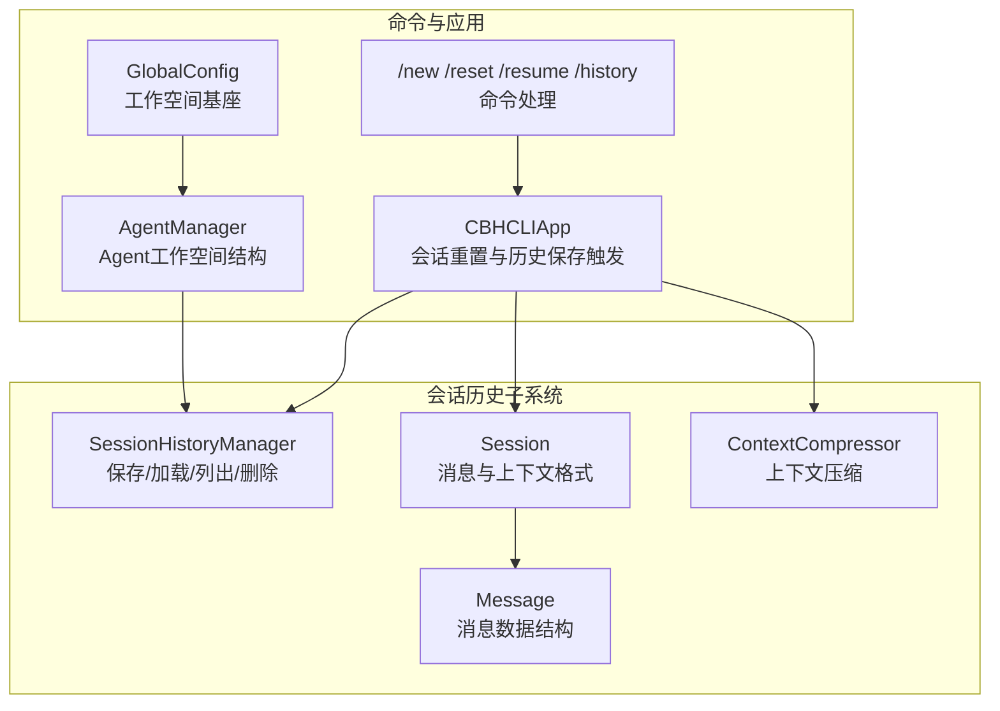
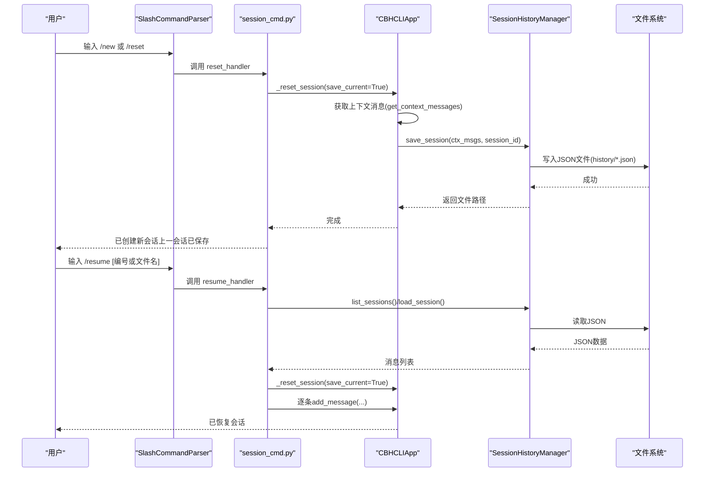
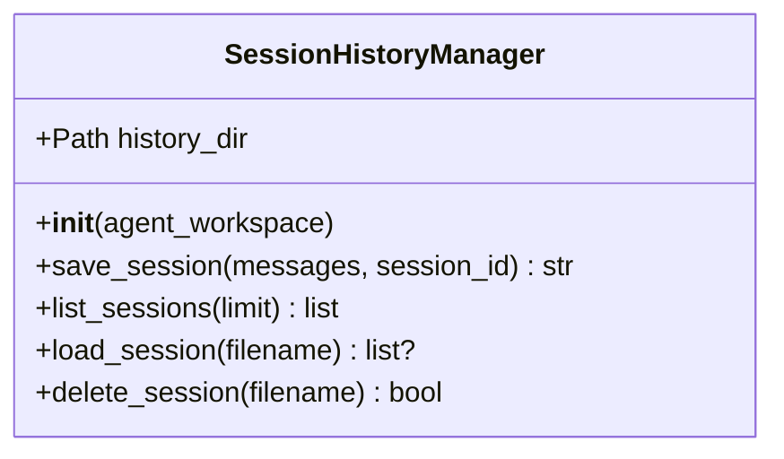
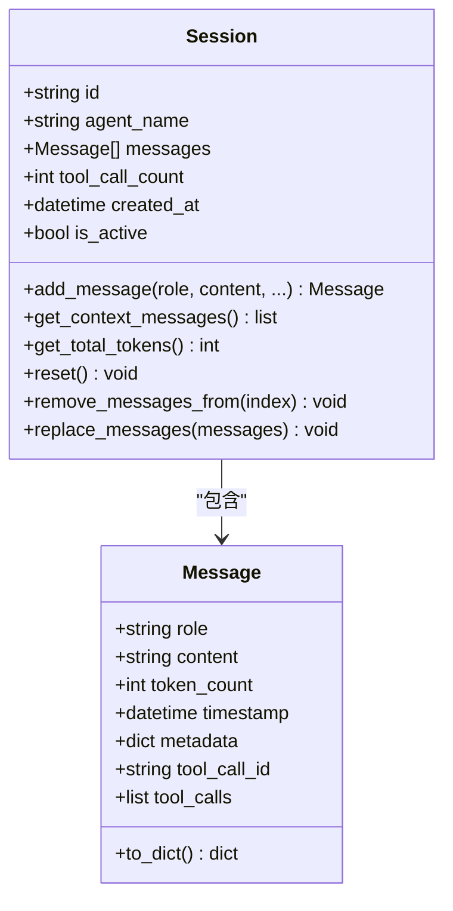
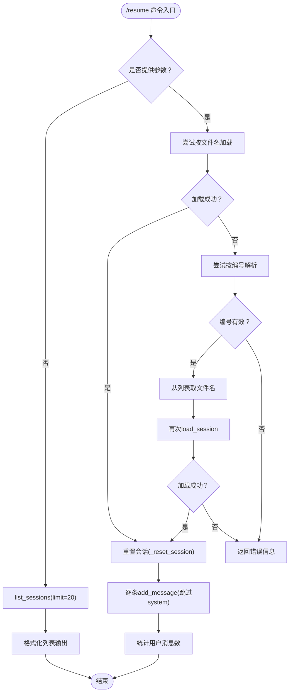
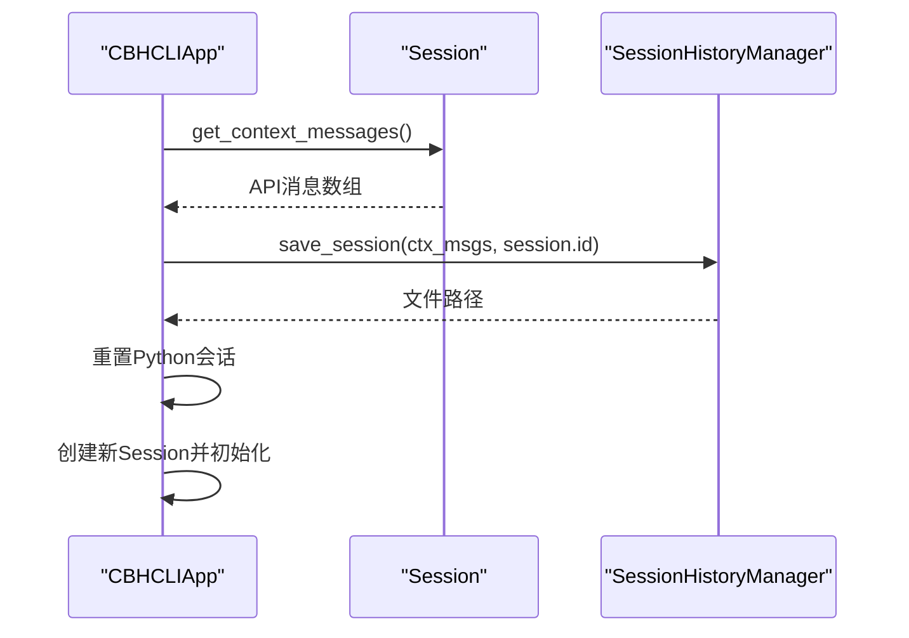
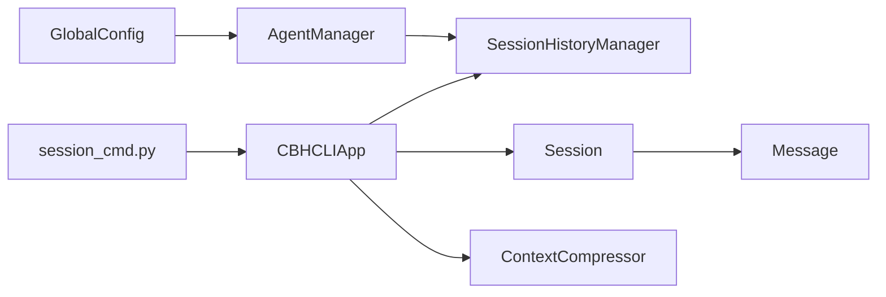

# 会话历史持久化

<cite>
**本文引用的文件**
- [session_history.py](file://cbhcli_pkg/core/session_history.py)
- [session.py](file://cbhcli_pkg/core/session.py)
- [session_cmd.py](file://cbhcli_pkg/commands/session_cmd.py)
- [app.py](file://cbhcli_pkg/core/app.py)
- [global_config.py](file://cbhcli_pkg/config/global_config.py)
- [agent.py](file://cbhcli_pkg/core/agent.py)
- [compressor.py](file://cbhcli_pkg/context/compressor.py)
</cite>

## 目录
1. [简介](#简介)
2. [项目结构](#项目结构)
3. [核心组件](#核心组件)
4. [架构总览](#架构总览)
5. [详细组件分析](#详细组件分析)
6. [依赖分析](#依赖分析)
7. [性能考量](#性能考量)
8. [故障排查指南](#故障排查指南)
9. [结论](#结论)
10. [附录](#附录)

## 简介
本文件面向CBHCLI的会话历史持久化系统，系统性阐述会话历史的存储机制、序列化格式、文件组织结构与保存/加载/恢复流程；解释版本管理、兼容性与迁移策略；提供查询与检索能力说明；并给出完整的生命周期示例与安全备份建议。目标读者既包括开发者也包括希望理解系统运作原理的使用者。

## 项目结构
会话历史相关代码主要分布在以下模块：
- 会话历史管理器：负责保存、列出、加载、删除历史会话
- 会话数据结构：消息与会话对象，提供API消息格式转换
- 命令层：/new、/reset、/resume、/history等命令的实现
- 应用层：会话重置与历史保存的触发点
- 全局配置：工作空间基座与Agent工作空间路径
- Agent管理：Agent工作空间目录结构与history目录的关系
- 上下文压缩：在保存前的上下文压缩策略

图表来源
- [session_history.py:1-136](file://cbhcli_pkg/core/session_history.py#L1-L136)
- [session.py:1-190](file://cbhcli_pkg/core/session.py#L1-L190)
- [session_cmd.py:1-183](file://cbhcli_pkg/commands/session_cmd.py#L1-L183)
- [app.py:260-331](file://cbhcli_pkg/core/app.py#L260-L331)
- [global_config.py:1-154](file://cbhcli_pkg/config/global_config.py#L1-L154)
- [agent.py:572-762](file://cbhcli_pkg/core/agent.py#L572-L762)
- [compressor.py:1-112](file://cbhcli_pkg/context/compressor.py#L1-L112)

章节来源
- [session_history.py:1-136](file://cbhcli_pkg/core/session_history.py#L1-L136)
- [session.py:1-190](file://cbhcli_pkg/core/session.py#L1-L190)
- [session_cmd.py:1-183](file://cbhcli_pkg/commands/session_cmd.py#L1-L183)
- [app.py:260-331](file://cbhcli_pkg/core/app.py#L260-L331)
- [global_config.py:1-154](file://cbhcli_pkg/config/global_config.py#L1-L154)
- [agent.py:572-762](file://cbhcli_pkg/core/agent.py#L572-L762)
- [compressor.py:1-112](file://cbhcli_pkg/context/compressor.py#L1-L112)

## 核心组件
- SessionHistoryManager：负责历史会话的保存、列出、加载与删除，采用JSON格式存储，文件位于Agent工作空间下的history目录。
- Session/Message：会话与消息的数据结构，提供to_dict()将内部消息转为API消息格式，供历史保存使用。
- 命令层：/new与/reset在创建新会话前自动保存当前会话；/resume支持按文件名或编号恢复；/history为列表别名。
- 应用层：_reset_session在重置会话时调用历史保存，确保每次/new或/reset都会持久化上一个会话。
- 全局配置与Agent管理：决定Agent工作空间路径，history目录基于Agent工作空间生成。

章节来源
- [session_history.py:8-136](file://cbhcli_pkg/core/session_history.py#L8-L136)
- [session.py:8-190](file://cbhcli_pkg/core/session.py#L8-L190)
- [session_cmd.py:5-183](file://cbhcli_pkg/commands/session_cmd.py#L5-L183)
- [app.py:281-331](file://cbhcli_pkg/core/app.py#L281-L331)
- [global_config.py:13-48](file://cbhcli_pkg/config/global_config.py#L13-L48)
- [agent.py:572-762](file://cbhcli_pkg/core/agent.py#L572-L762)

## 架构总览
会话历史持久化遵循“命令触发—应用层保存—历史管理器落盘”的链路，同时提供恢复与查询能力。

图表来源
- [session_cmd.py:8-102](file://cbhcli_pkg/commands/session_cmd.py#L8-L102)
- [app.py:281-331](file://cbhcli_pkg/core/app.py#L281-L331)
- [session_history.py:24-64](file://cbhcli_pkg/core/session_history.py#L24-L64)

## 详细组件分析

### 会话历史管理器（SessionHistoryManager）
- 存储位置与组织
  - 基于Agent工作空间生成history目录，每次/new或/reset自动保存当前会话。
  - 文件命名规则：时间戳_会话ID.json，便于按时间排序与识别。
- 序列化格式
  - JSON对象包含：id、created_at、title、message_count、messages。
  - messages为API消息格式数组，与Session.to_dict()输出一致。
- 保存流程
  - 若messages为空则不保存；否则提取第一条用户消息作为标题，写入JSON文件。
- 列表与加载
  - list_sessions按文件名逆序列出，limit限制返回数量；load_session按文件名加载messages。
- 删除
  - delete_session根据文件名删除历史文件。

图表来源
- [session_history.py:8-136](file://cbhcli_pkg/core/session_history.py#L8-L136)

章节来源
- [session_history.py:8-136](file://cbhcli_pkg/core/session_history.py#L8-L136)

### 会话与消息数据结构（Session/Message）
- Message
  - 字段：role、content、token_count、timestamp、metadata、tool_call_id、tool_calls。
  - to_dict()：将assistant的tool_calls与tool的tool_call_id转换为API所需字段。
- Session
  - 管理消息列表，提供get_context_messages()输出API消息格式。
  - reset()保留system消息，清空其他消息。
  - replace_messages()用于上下文压缩后的消息替换。

图表来源
- [session.py:8-190](file://cbhcli_pkg/core/session.py#L8-L190)

章节来源
- [session.py:8-190](file://cbhcli_pkg/core/session.py#L8-L190)

### 命令层：/new、/reset、/resume、/history
- /new与/reset
  - 触发_app._reset_session(save_current=True)，自动保存当前会话到history。
- /resume
  - 支持两种恢复方式：直接提供文件名或编号。
  - 编号模式：先list_sessions，再按索引定位文件名，最后load_session。
  - 恢复时先_reset_session，再逐条add_message，跳过system消息。
- /history
  - 为/resume的别名，仅列出历史会话。

图表来源
- [session_cmd.py:33-94](file://cbhcli_pkg/commands/session_cmd.py#L33-L94)

章节来源
- [session_cmd.py:5-183](file://cbhcli_pkg/commands/session_cmd.py#L5-L183)

### 应用层：会话重置与历史保存
- _reset_session(save_current=True)
  - 在创建新会话前，若存在有效消息，则调用session.get_context_messages()获取API消息格式，交由SessionHistoryManager.save_session()保存。
  - 同时重置Python会话、创建新Session并初始化系统提示与上下文窗口。

图表来源
- [app.py:281-331](file://cbhcli_pkg/core/app.py#L281-L331)
- [session_history.py:24-64](file://cbhcli_pkg/core/session_history.py#L24-L64)

章节来源
- [app.py:281-331](file://cbhcli_pkg/core/app.py#L281-L331)

### 上下文压缩与历史保存时机
- ContextCompressor
  - 在上下文接近阈值时，将中间轮次对话摘要化，减少token占用，提升保存效率。
- 触发点
  - _check_and_compress_context在每次AI请求前检查，必要时自动压缩，随后再触发_save_session。

章节来源
- [compressor.py:21-81](file://cbhcli_pkg/context/compressor.py#L21-L81)
- [app.py:368-384](file://cbhcli_pkg/core/app.py#L368-L384)

## 依赖分析
- 组件耦合
  - SessionHistoryManager依赖Agent工作空间路径，history目录位于Agent工作空间下。
  - 命令层依赖应用层提供的_session_history实例。
  - 应用层在重置会话时依赖Session与ContextWindow。
- 外部依赖
  - 文件系统：history目录的创建、JSON文件的读写。
  - 全局配置：工作空间基座路径决定Agent工作空间根目录。

图表来源
- [global_config.py:13-48](file://cbhcli_pkg/config/global_config.py#L13-L48)
- [agent.py:572-762](file://cbhcli_pkg/core/agent.py#L572-L762)
- [session_history.py:16-22](file://cbhcli_pkg/core/session_history.py#L16-L22)
- [app.py:260-331](file://cbhcli_pkg/core/app.py#L260-L331)
- [session.py:8-190](file://cbhcli_pkg/core/session.py#L8-L190)
- [compressor.py:1-112](file://cbhcli_pkg/context/compressor.py#L1-L112)
- [session_cmd.py:5-183](file://cbhcli_pkg/commands/session_cmd.py#L5-L183)

章节来源
- [global_config.py:13-48](file://cbhcli_pkg/config/global_config.py#L13-L48)
- [agent.py:572-762](file://cbhcli_pkg/core/agent.py#L572-L762)
- [session_history.py:16-22](file://cbhcli_pkg/core/session_history.py#L16-L22)
- [app.py:260-331](file://cbhcli_pkg/core/app.py#L260-L331)
- [session.py:8-190](file://cbhcli_pkg/core/session.py#L8-L190)
- [compressor.py:1-112](file://cbhcli_pkg/context/compressor.py#L1-L112)
- [session_cmd.py:5-183](file://cbhcli_pkg/commands/session_cmd.py#L5-L183)

## 性能考量
- 保存开销
  - save_session写入JSON，I/O成本与消息数量线性相关；建议在上下文较大时先进行压缩。
- 列表与加载
  - list_sessions遍历history目录并解析JSON，limit限制可控制内存占用；异常JSON文件会被跳过。
- 压缩策略
  - ContextCompressor在接近阈值时进行摘要化，显著降低后续保存与加载成本。

章节来源
- [session_history.py:66-97](file://cbhcli_pkg/core/session_history.py#L66-L97)
- [compressor.py:21-81](file://cbhcli_pkg/context/compressor.py#L21-L81)

## 故障排查指南
- 无法保存会话
  - 检查Agent工作空间是否存在history目录；确认messages非空；确认磁盘权限。
- 无法加载会话
  - 确认文件名正确；检查JSON格式是否损坏；确认文件存在。
- /resume报错
  - 若按编号恢复，确认编号在列表范围内；若按文件名恢复，确认文件名大小写与扩展名。
- 删除历史
  - 使用delete_session(filename)删除；注意文件名需包含扩展名。

章节来源
- [session_history.py:99-136](file://cbhcli_pkg/core/session_history.py#L99-L136)
- [session_cmd.py:42-94](file://cbhcli_pkg/commands/session_cmd.py#L42-L94)

## 结论
CBHCLI的会话历史持久化系统以简洁可靠为核心设计：基于Agent工作空间的history目录、稳定的JSON格式、自动保存与灵活恢复的命令体系，辅以上下文压缩策略，在保证易用性的同时兼顾性能与可维护性。未来可在版本管理、增量备份与加密方面进一步增强。

## 附录

### 数据模型与序列化格式
- 历史文件JSON结构
  - 字段：id、created_at、title、message_count、messages
  - messages：API消息数组，元素包含role与content，assistant可能包含tool_calls，tool可能包含tool_call_id
- Agent工作空间目录结构
  - ~/.cbhcli/agents/<agent_name>/ 下包含config.json、skills.md、soul.md、tools.md、memory.md、knowledge/、history/

章节来源
- [session_history.py:53-59](file://cbhcli_pkg/core/session_history.py#L53-L59)
- [agent.py:348-355](file://cbhcli_pkg/core/agent.py#L348-L355)

### 查询与检索能力
- 列表查询
  - list_sessions(limit=20)：按时间倒序返回会话摘要（文件名、标题、创建时间、消息数）
- 按编号/文件名恢复
  - /resume <编号> 或 /resume <文件名>：支持数字索引与文件名两种方式
- 按Agent分类
  - 不同Agent对应不同工作空间，history目录隔离，天然按Agent分类

章节来源
- [session_history.py:66-97](file://cbhcli_pkg/core/session_history.py#L66-L97)
- [session_cmd.py:42-94](file://cbhcli_pkg/commands/session_cmd.py#L42-L94)

### 版本管理、兼容性与迁移
- 当前实现
  - 采用固定JSON结构，未显式版本字段；加载时对异常JSON进行容错跳过。
- 建议策略
  - 引入version字段与schema校验；新增字段时提供默认值；提供迁移脚本将旧格式转换为新格式；在加载失败时记录日志并回退至安全状态。

章节来源
- [session_history.py:80-92](file://cbhcli_pkg/core/session_history.py#L80-L92)

### 备份策略与安全考虑
- 备份建议
  - 定期复制Agent工作空间目录（含history），建议采用快照或增量备份。
- 安全建议
  - 对敏感会话内容进行脱敏处理；在跨设备传输时考虑压缩与校验；定期清理过期历史文件。
- 灾难恢复
  - 通过备份恢复Agent工作空间；在恢复后使用/resume验证历史文件完整性；必要时重建索引（如向量搜索相关）。

章节来源
- [agent.py:585-624](file://cbhcli_pkg/core/agent.py#L585-L624)
- [session_cmd.py:81-94](file://cbhcli_pkg/commands/session_cmd.py#L81-L94)

### 生命周期示例（路径指引）
- 创建新会话并自动保存
  - 路径：/new 或 /reset → _reset_session → save_session
  - 参考：[session_cmd.py:8-31](file://cbhcli_pkg/commands/session_cmd.py#L8-L31)、[app.py:281-331](file://cbhcli_pkg/core/app.py#L281-L331)、[session_history.py:24-64](file://cbhcli_pkg/core/session_history.py#L24-L64)
- 恢复历史会话
  - 路径：/resume [编号或文件名] → list_sessions/load_session → _reset_session → add_message
  - 参考：[session_cmd.py:33-94](file://cbhcli_pkg/commands/session_cmd.py#L33-L94)、[session_history.py:99-118](file://cbhcli_pkg/core/session_history.py#L99-L118)
- 列出历史会话
  - 路径：/history → list_sessions
  - 参考：[session_cmd.py:104-115](file://cbhcli_pkg/commands/session_cmd.py#L104-L115)、[session_history.py:66-97](file://cbhcli_pkg/core/session_history.py#L66-L97)