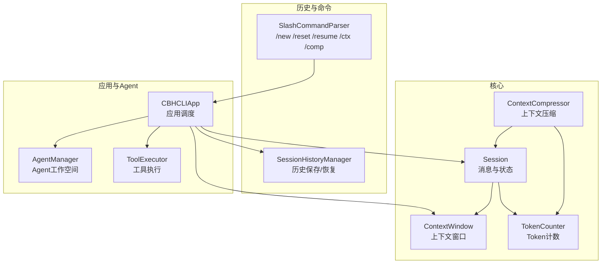
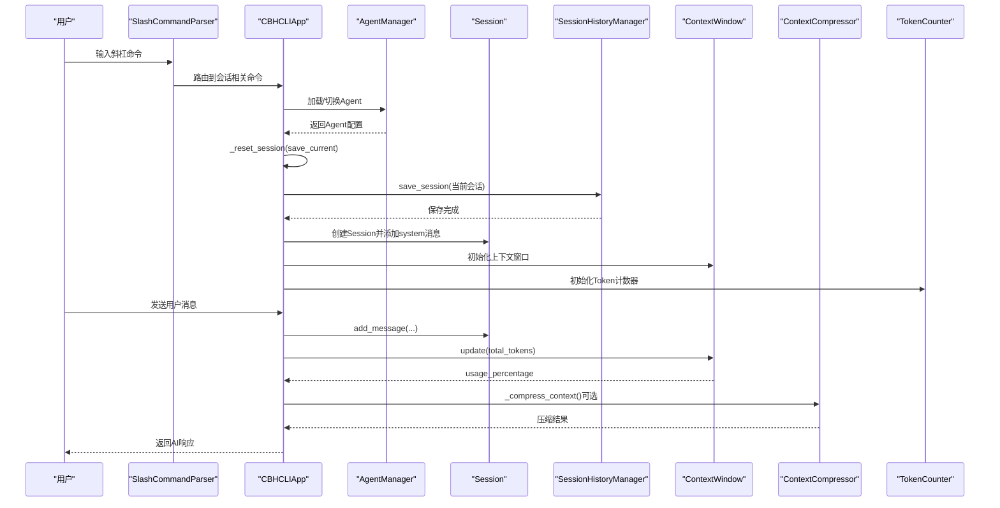
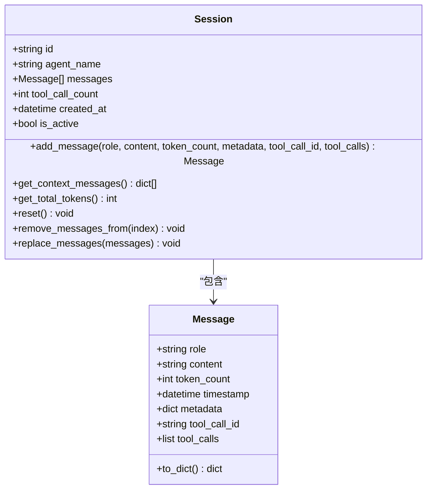
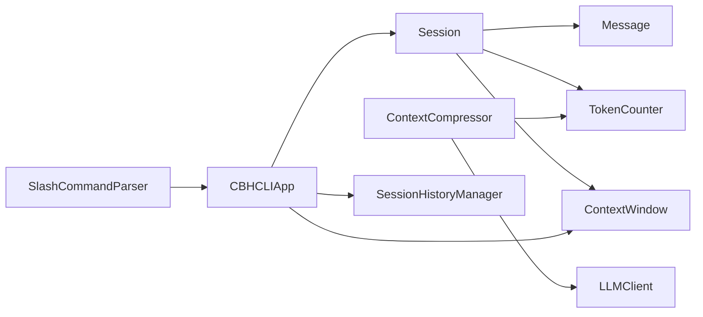

# 会话生命周期管理

<cite>
**本文引用的文件**
- [session.py](file://cbhcli_pkg/core/session.py)
- [session_history.py](file://cbhcli_pkg/core/session_history.py)
- [token_counter.py](file://cbhcli_pkg/context/token_counter.py)
- [compressor.py](file://cbhcli_pkg/context/compressor.py)
- [session_cmd.py](file://cbhcli_pkg/commands/session_cmd.py)
- [app.py](file://cbhcli_pkg/core/app.py)
- [constants.py](file://cbhcli_pkg/core/constants.py)
- [agent.py](file://cbhcli_pkg/core/agent.py)
- [tool_executor.py](file://cbhcli_pkg/core/tool_executor.py)
- [test_v3.py](file://test_v3.py)
</cite>

## 目录
1. [简介](#简介)
2. [项目结构](#项目结构)
3. [核心组件](#核心组件)
4. [架构总览](#架构总览)
5. [详细组件分析](#详细组件分析)
6. [依赖分析](#依赖分析)
7. [性能考虑](#性能考虑)
8. [故障排查指南](#故障排查指南)
9. [结论](#结论)
10. [附录](#附录)

## 简介
本文围绕CBHCLI的会话生命周期管理，系统梳理Session类的设计与实现，涵盖会话创建、初始化、消息添加、上下文窗口与压缩、状态维护、历史保存与恢复、以及多Agent环境下的隔离与切换机制。文档同时给出关键流程的时序图与类图，并提供基于仓库源码的路径级示例，帮助读者快速定位实现细节。

## 项目结构
与会话生命周期相关的核心模块分布如下：
- 会话与上下文：core/session.py、context/token_counter.py、context/compressor.py
- 历史管理：core/session_history.py
- 命令接口：commands/session_cmd.py
- 应用入口与调度：core/app.py
- 常量与配置：core/constants.py
- Agent与工作空间：core/agent.py
- 工具执行：core/tool_executor.py
- 示例与测试：test_v3.py

图表来源
- [session.py:37-190](file://cbhcli_pkg/core/session.py#L37-L190)
- [token_counter.py:14-88](file://cbhcli_pkg/context/token_counter.py#L14-L88)
- [compressor.py:7-112](file://cbhcli_pkg/context/compressor.py#L7-L112)
- [session_history.py:8-136](file://cbhcli_pkg/core/session_history.py#L8-L136)
- [session_cmd.py:5-183](file://cbhcli_pkg/commands/session_cmd.py#L5-L183)
- [app.py:54-478](file://cbhcli_pkg/core/app.py#L54-L478)
- [agent.py:572-762](file://cbhcli_pkg/core/agent.py#L572-L762)
- [tool_executor.py:15-168](file://cbhcli_pkg/core/tool_executor.py#L15-L168)

章节来源
- [session.py:1-190](file://cbhcli_pkg/core/session.py#L1-L190)
- [session_history.py:1-136](file://cbhcli_pkg/core/session_history.py#L1-L136)
- [token_counter.py:1-88](file://cbhcli_pkg/context/token_counter.py#L1-L88)
- [compressor.py:1-112](file://cbhcli_pkg/context/compressor.py#L1-L112)
- [session_cmd.py:1-183](file://cbhcli_pkg/commands/session_cmd.py#L1-L183)
- [app.py:1-478](file://cbhcli_pkg/core/app.py#L1-L478)
- [agent.py:1-762](file://cbhcli_pkg/core/agent.py#L1-L762)
- [tool_executor.py:1-168](file://cbhcli_pkg/core/tool_executor.py#L1-L168)
- [constants.py:1-50](file://cbhcli_pkg/core/constants.py#L1-L50)
- [test_v3.py:1-180](file://test_v3.py#L1-L180)

## 核心组件
- Session：会话实体，负责消息存储、上下文导出、token统计、重置与消息裁剪。
- Message：消息数据结构，支持角色分类、时间戳、元数据、工具调用关联字段。
- ContextWindow：上下文窗口，跟踪当前token使用、阈值与压缩触发。
- ContextCompressor：上下文压缩器，基于LLM对中间对话生成摘要，减少token占用。
- SessionHistoryManager：会话历史持久化，支持保存、列出、加载与删除。
- TokenCounter：Token计数器，支持tiktoken精确计数与降级估算。
- CBHCLIApp：应用调度器，负责Agent加载、会话重置、上下文检查与压缩、命令解析。
- AgentManager：Agent工作空间与配置管理，提供多Agent隔离与切换。
- ToolExecutor：工具执行器，支持工具调用确认、执行与结果展示。

章节来源
- [session.py:37-190](file://cbhcli_pkg/core/session.py#L37-L190)
- [session_history.py:8-136](file://cbhcli_pkg/core/session_history.py#L8-L136)
- [token_counter.py:14-88](file://cbhcli_pkg/context/token_counter.py#L14-L88)
- [compressor.py:7-112](file://cbhcli_pkg/context/compressor.py#L7-L112)
- [app.py:281-331](file://cbhcli_pkg/core/app.py#L281-L331)
- [agent.py:572-762](file://cbhcli_pkg/core/agent.py#L572-L762)
- [tool_executor.py:15-168](file://cbhcli_pkg/core/tool_executor.py#L15-L168)

## 架构总览
会话生命周期贯穿应用启动、Agent切换、会话重置、消息添加、上下文检查与压缩、历史保存与恢复等环节。下图展示了关键组件间的交互关系与控制流。

图表来源
- [app.py:281-331](file://cbhcli_pkg/core/app.py#L281-L331)
- [session_cmd.py:5-183](file://cbhcli_pkg/commands/session_cmd.py#L5-L183)
- [session_history.py:24-64](file://cbhcli_pkg/core/session_history.py#L24-L64)
- [compressor.py:21-81](file://cbhcli_pkg/context/compressor.py#L21-L81)
- [token_counter.py:34-75](file://cbhcli_pkg/context/token_counter.py#L34-L75)

## 详细组件分析

### Session类设计与实现
- 设计要点
  - 使用dataclass定义Message，包含角色、内容、token计数、时间戳、元数据、工具调用关联字段。
  - Session持有消息列表、工具调用计数、创建时间、激活状态；提供消息添加、上下文导出、token统计、重置与消息裁剪。
  - Message.to_dict根据角色动态组装API消息格式，支持assistant的tool_calls与tool消息的tool_call_id。

- 关键方法与行为
  - add_message：构造Message并追加到消息列表，支持token_count、metadata、tool_call_id、tool_calls参数。
  - get_context_messages：将内部消息转为API消息格式列表。
  - get_total_tokens：累加所有消息的token_count。
  - reset：仅保留system消息，重置工具调用计数。
  - remove_messages_from：从指定索引开始删除消息。
  - replace_messages：替换消息列表（用于上下文压缩后回写）。

- 会话ID生成与唯一性
  - 使用uuid.uuid4生成全局唯一ID，确保跨Agent与跨进程的唯一性。

- 代码示例路径
  - [Session.__init__:40-53](file://cbhcli_pkg/core/session.py#L40-L53)
  - [Session.add_message:54-81](file://cbhcli_pkg/core/session.py#L54-L81)
  - [Session.get_context_messages:83-90](file://cbhcli_pkg/core/session.py#L83-L90)
  - [Session.get_total_tokens:92-99](file://cbhcli_pkg/core/session.py#L92-L99)
  - [Session.reset:101-105](file://cbhcli_pkg/core/session.py#L101-L105)
  - [Session.remove_messages_from:107-115](file://cbhcli_pkg/core/session.py#L107-L115)
  - [Session.replace_messages:117-124](file://cbhcli_pkg/core/session.py#L117-L124)
  - [Message.to_dict:19-34](file://cbhcli_pkg/core/session.py#L19-L34)

章节来源
- [session.py:37-190](file://cbhcli_pkg/core/session.py#L37-L190)

#### 类图：Message与Session

图表来源
- [session.py:8-35](file://cbhcli_pkg/core/session.py#L8-L35)
- [session.py:37-125](file://cbhcli_pkg/core/session.py#L37-L125)

### Message数据结构：角色、时间戳与元数据
- 角色分类
  - system：系统提示，通常在会话初始化时注入。
  - user：用户输入。
  - assistant：AI回复，可携带tool_calls。
  - tool：工具执行结果，需携带tool_call_id以关联对应工具调用。

- 时间戳管理
  - 默认使用构造时的时间戳，便于审计与排序。

- 元数据支持
  - metadata字段用于承载额外上下文信息，如原始API消息结构、来源标识等。

- 工具调用关联
  - assistant消息的tool_calls用于OpenAI风格的工具调用描述。
  - tool消息的tool_call_id用于将工具结果与具体调用关联。

- 代码示例路径
  - [Message定义与to_dict:8-34](file://cbhcli_pkg/core/session.py#L8-L34)

章节来源
- [session.py:8-35](file://cbhcli_pkg/core/session.py#L8-L35)

### 会话消息添加机制：add_message参数与token计数
- add_message参数
  - role/content：消息主体。
  - token_count：若为0则由外部计数器计算；也可显式传入以复用已有计数。
  - metadata：附加元数据，便于历史恢复或调试。
  - tool_call_id/tool_calls：用于工具调用与结果的双向关联。

- token计数处理
  - TokenCounter支持tiktoken精确计数与降级估算，用于计算消息token数与会话总token数。
  - ContextWindow根据模型上下文限制与压缩阈值判断是否需要压缩。

- 代码示例路径
  - [Session.add_message:54-81](file://cbhcli_pkg/core/session.py#L54-L81)
  - [TokenCounter.count_tokens:34-48](file://cbhcli_pkg/context/token_counter.py#L34-L48)
  - [TokenCounter.count_messages_tokens:60-75](file://cbhcli_pkg/context/token_counter.py#L60-L75)
  - [ContextWindow.update/usage_percentage:142-160](file://cbhcli_pkg/core/session.py#L142-L160)

章节来源
- [session.py:54-81](file://cbhcli_pkg/core/session.py#L54-L81)
- [token_counter.py:34-75](file://cbhcli_pkg/context/token_counter.py#L34-L75)
- [session.py:142-160](file://cbhcli_pkg/core/session.py#L142-L160)

### 会话状态管理：激活、重置与消息清理
- 激活状态
  - is_active标志位用于表示会话是否处于活跃状态，便于上层逻辑控制。

- 重置功能
  - reset仅保留system消息，重置工具调用计数，便于开启新的对话轮次。
  - 应用在创建新会话时会自动保存上一个会话的历史。

- 消息清理机制
  - remove_messages_from支持从指定索引截断消息，便于回滚或修正。
  - replace_messages用于压缩后替换消息列表。

- 代码示例路径
  - [Session.reset:101-105](file://cbhcli_pkg/core/session.py#L101-L105)
  - [Session.remove_messages_from:107-115](file://cbhcli_pkg/core/session.py#L107-L115)
  - [Session.replace_messages:117-124](file://cbhcli_pkg/core/session.py#L117-L124)
  - [CBHCLIApp._reset_session:281-331](file://cbhcli_pkg/core/app.py#L281-331)

章节来源
- [session.py:101-124](file://cbhcli_pkg/core/session.py#L101-L124)
- [app.py:281-331](file://cbhcli_pkg/core/app.py#L281-L331)

### 会话ID生成与唯一性保证
- 唯一性来源
  - 使用uuid.uuid4生成全局唯一ID，确保不同Agent、不同进程、不同时间创建的会话ID不冲突。

- 代码示例路径
  - [Session.__init__中ID生成](file://cbhcli_pkg/core/session.py#L47)

章节来源
- [session.py:47](file://cbhcli_pkg/core/session.py#L47)

### 会话完整生命周期操作示例
- 创建会话
  - 通过Agent加载或切换后，应用调用_reset_session创建Session并注入system消息。
  - 参考：[CBHCLIApp._reset_session:281-331](file://cbhcli_pkg/core/app.py#L281-331)

- 添加消息
  - 用户输入经命令解析后交由AI处理器，AI处理器调用Session.add_message添加用户消息与AI回复。
  - 参考：[Session.add_message:54-81](file://cbhcli_pkg/core/session.py#L54-L81)

- 上下文检查与压缩
  - 应用在每次请求前检查上下文使用率，必要时触发ContextCompressor压缩。
  - 参考：[CBHCLIApp._check_and_compress_context/_compress_context:368-385](file://cbhcli_pkg/core/app.py#L368-385)

- 历史保存与恢复
  - /new或/reset时自动保存当前会话；/resume支持列出与恢复历史会话。
  - 参考：[SessionHistoryManager.save_session/list_sessions/load_session:24-118](file://cbhcli_pkg/core/session_history.py#L24-L118)

- 代码示例路径
  - [test_v3.py中的会话测试:73-100](file://test_v3.py#L73-100)

章节来源
- [app.py:281-331](file://cbhcli_pkg/core/app.py#L281-L331)
- [session.py:54-81](file://cbhcli_pkg/core/session.py#L54-L81)
- [compressor.py:21-81](file://cbhcli_pkg/context/compressor.py#L21-L81)
- [session_history.py:24-118](file://cbhcli_pkg/core/session_history.py#L24-L118)
- [test_v3.py:73-100](file://test_v3.py#L73-L100)

### 多Agent环境中的隔离与切换机制
- Agent隔离
  - 每个Agent拥有独立的工作空间与配置，SessionHistoryManager针对Agent工作空间创建独立的history目录。
  - AgentManager负责Agent的创建、加载、切换与删除。

- 切换流程
  - /agent switch命令触发Agent切换，应用卸载旧Agent资源并加载新Agent，随后重置会话。
  - 切换后会话与历史管理器均指向新Agent的工作空间。

- 代码示例路径
  - [AgentManager._load_agent:231-279](file://cbhcli_pkg/core/agent.py#L231-279)
  - [AgentManager.switch_agent:727-737](file://cbhcli_pkg/core/agent.py#L727-737)
  - [SessionHistoryManager.__init__:16-22](file://cbhcli_pkg/core/session_history.py#L16-L22)

章节来源
- [agent.py:231-279](file://cbhcli_pkg/core/agent.py#L231-L279)
- [agent.py:727-737](file://cbhcli_pkg/core/agent.py#L727-L737)
- [session_history.py:16-22](file://cbhcli_pkg/core/session_history.py#L16-L22)

## 依赖分析
- Session依赖
  - TokenCounter：用于计算消息与会话的token数。
  - ContextWindow：用于跟踪上下文使用率与触发压缩。
  - Message：作为Session内部的数据载体。

- ContextCompressor依赖
  - LLMClient：用于生成摘要。
  - TokenCounter：用于估算摘要的token开销。

- 命令与应用
  - SlashCommandParser：解析会话相关命令。
  - CBHCLIApp：协调Agent、会话、历史、上下文与压缩。

- 代码示例路径
  - [compressor依赖声明:2-4](file://cbhcli_pkg/context/compressor.py#L2-L4)
  - [app命令注册:151-161](file://cbhcli_pkg/core/app.py#L151-161)
  - [session_cmd命令注册:5-31](file://cbhcli_pkg/commands/session_cmd.py#L5-L31)

图表来源
- [session.py:37-190](file://cbhcli_pkg/core/session.py#L37-L190)
- [compressor.py:7-112](file://cbhcli_pkg/context/compressor.py#L7-L112)
- [app.py:151-161](file://cbhcli_pkg/core/app.py#L151-L161)
- [session_cmd.py:5-31](file://cbhcli_pkg/commands/session_cmd.py#L5-L31)

章节来源
- [session.py:37-190](file://cbhcli_pkg/core/session.py#L37-L190)
- [compressor.py:7-112](file://cbhcli_pkg/context/compressor.py#L7-L112)
- [app.py:151-161](file://cbhcli_pkg/core/app.py#L151-L161)
- [session_cmd.py:5-31](file://cbhcli_pkg/commands/session_cmd.py#L5-L31)

## 性能考虑
- Token计数
  - 优先使用tiktoken精确计数，若不可用则采用估算策略，估算精度受文本语言与结构影响。
  - 在批量消息计数时，可复用TokenCounter以避免重复初始化。

- 上下文压缩
  - 当上下文使用率接近阈值（默认80%）时触发压缩，减少长对话带来的token压力。
  - 压缩策略保留早期与近期对话，中间部分生成摘要，兼顾上下文完整性与性能。

- 会话重置
  - reset仅保留system消息，可显著降低token占用，适合长时间会话的阶段性清理。

- 代码示例路径
  - [TokenCounter降级估算:50-58](file://cbhcli_pkg/context/token_counter.py#L50-L58)
  - [ContextWindow阈值与状态文本:130-189](file://cbhcli_pkg/core/session.py#L130-L189)
  - [ContextCompressor压缩策略:21-81](file://cbhcli_pkg/context/compressor.py#L21-81)

章节来源
- [token_counter.py:50-58](file://cbhcli_pkg/context/token_counter.py#L50-L58)
- [session.py:130-189](file://cbhcli_pkg/core/session.py#L130-L189)
- [compressor.py:21-81](file://cbhcli_pkg/context/compressor.py#L21-L81)

## 故障排查指南
- 会话历史无法保存/恢复
  - 检查Agent工作空间是否存在history目录，确认权限与磁盘空间。
  - 参考：[SessionHistoryManager.save_session:24-64](file://cbhcli_pkg/core/session_history.py#L24-L64)、[SessionHistoryManager.load_session:99-118](file://cbhcli_pkg/core/session_history.py#L99-L118)

- 上下文接近上限但未压缩
  - 确认Agent配置auto_compress是否启用，检查compression_ratio阈值。
  - 参考：[CBHCLIApp._check_and_compress_context:368-385](file://cbhcli_pkg/core/app.py#L368-385)、[ContextWindow.is_near_limit:162-164](file://cbhcli_pkg/core/session.py#L162-L164)

- 工具调用未正确关联
  - 确保assistant消息包含tool_calls，tool消息包含tool_call_id。
  - 参考：[Message.to_dict:19-34](file://cbhcli_pkg/core/session.py#L19-L34)

- Token计数异常
  - 若未安装tiktoken，将使用估算策略；可手动传入token_count以绕过计数。
  - 参考：[TokenCounter.count_tokens:34-48](file://cbhcli_pkg/context/token_counter.py#L34-L48)

章节来源
- [session_history.py:24-64](file://cbhcli_pkg/core/session_history.py#L24-L64)
- [session_history.py:99-118](file://cbhcli_pkg/core/session_history.py#L99-L118)
- [app.py:368-385](file://cbhcli_pkg/core/app.py#L368-L385)
- [session.py:162-164](file://cbhcli_pkg/core/session.py#L162-L164)
- [session.py:19-34](file://cbhcli_pkg/core/session.py#L19-L34)
- [token_counter.py:34-48](file://cbhcli_pkg/context/token_counter.py#L34-L48)

## 结论
CBHCLI的会话生命周期管理以Session为核心，结合Message数据结构、Token计数、上下文窗口与压缩机制，实现了高效、可控的对话管理。通过Agent隔离与历史管理，系统在多Agent环境下提供了清晰的会话边界与可追溯性。命令接口与应用调度器进一步简化了用户操作，使会话的创建、重置、恢复与压缩变得直观易用。

## 附录
- 常用命令
  - /new 或 /reset：创建新会话并保存上一会话。
  - /resume [编号或文件名]：列出或恢复历史会话。
  - /history：查看历史会话列表。
  - /ctx：查看上下文使用情况与阈值。
  - /comp：手动压缩上下文。

- 代码示例路径
  - [命令注册与处理:5-183](file://cbhcli_pkg/commands/session_cmd.py#L5-L183)
  - [应用初始化与Agent加载:204-279](file://cbhcli_pkg/core/app.py#L204-279)
  - [测试脚本中的会话用法:73-100](file://test_v3.py#L73-100)