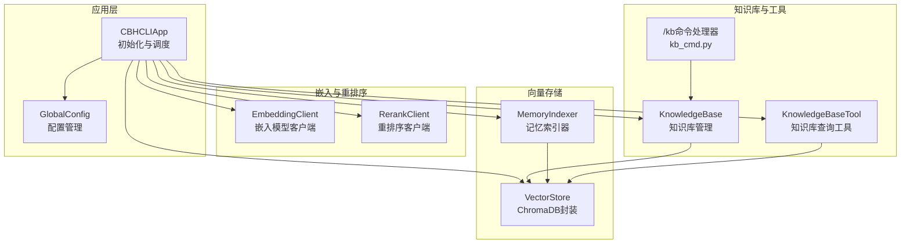
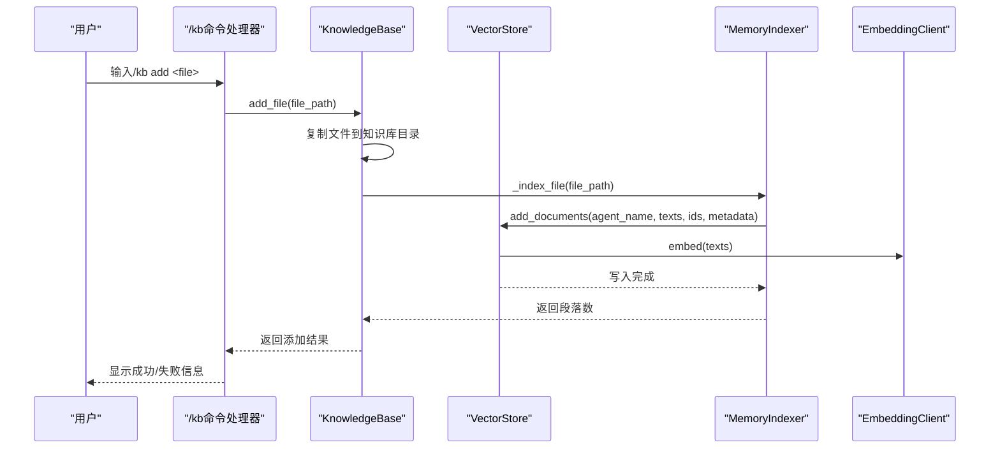
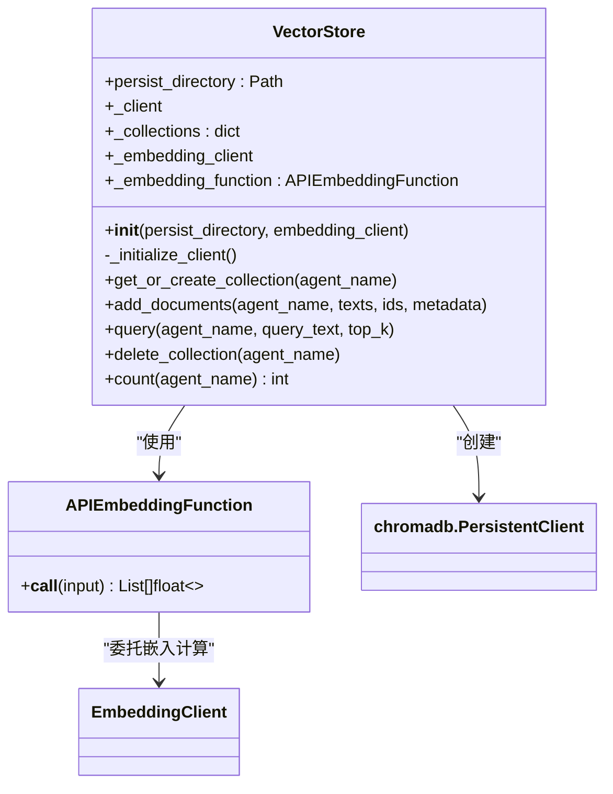
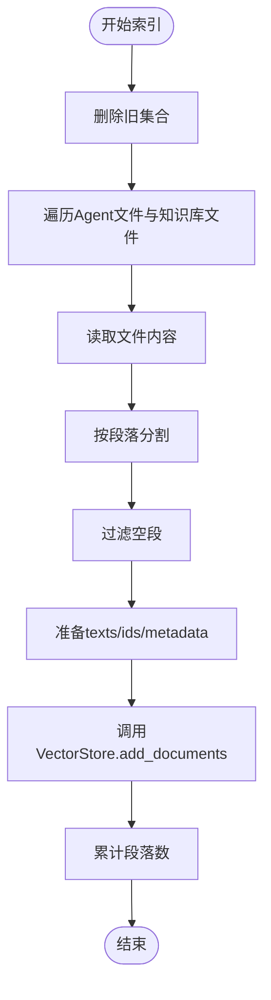
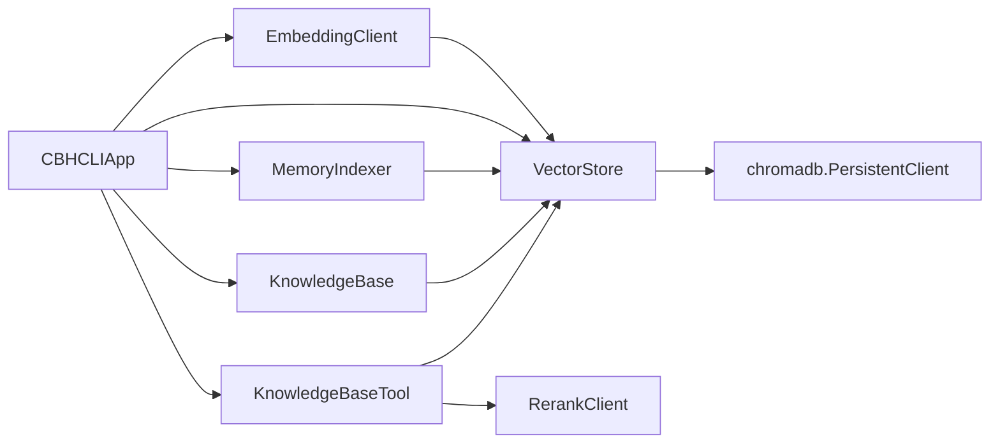

# ChromaDB存储管理

<cite>
**本文引用的文件**
- [store.py](file://cbhcli_pkg/vector/store.py)
- [indexer.py](file://cbhcli_pkg/vector/indexer.py)
- [__init__.py](file://cbhcli_pkg/vector/__init__.py)
- [knowledge_base.py](file://cbhcli_pkg/core/knowledge_base.py)
- [embedding_client.py](file://cbhcli_pkg/core/embedding_client.py)
- [kb_cmd.py](file://cbhcli_pkg/commands/kb_cmd.py)
- [knowledge_base.py](file://cbhcli_pkg/tools/knowledge_base.py)
- [app.py](file://cbhcli_pkg/core/app.py)
- [global_config.py](file://cbhcli_pkg/config/global_config.py)
- [rerank_client.py](file://cbhcli_pkg/core/rerank_client.py)
</cite>

## 目录
1. [简介](#简介)
2. [项目结构](#项目结构)
3. [核心组件](#核心组件)
4. [架构总览](#架构总览)
5. [详细组件分析](#详细组件分析)
6. [依赖关系分析](#依赖关系分析)
7. [性能考量](#性能考量)
8. [故障排查指南](#故障排查指南)
9. [结论](#结论)
10. [附录](#附录)

## 简介
本文件面向CBHCLI的ChromaDB存储管理系统，聚焦VectorStore类的设计与实现，涵盖以下主题：
- VectorStore类的架构与职责边界
- 客户端初始化流程与持久化存储机制
- 集合(collection)的概念、命名与生命周期管理
- 文档添加与删除的完整流程（add_documents、delete_collection）
- 向量存储的数据结构与索引组织（文档ID、元数据、嵌入向量）
- 配置最佳实践与性能优化建议
- 存储目录组织与备份策略
- 常用操作的代码示例路径

## 项目结构
CBHCLI将向量存储能力封装在vector子模块中，并通过应用层统一初始化与调度。关键文件与职责如下：
- vector/store.py：ChromaDB封装与VectorStore类
- vector/indexer.py：记忆索引器，负责将文件内容切分为段落并写入向量库
- core/knowledge_base.py：知识库管理，负责文件增删与批量索引
- core/embedding_client.py：嵌入模型客户端，统一处理外部API请求
- core/rerank_client.py：重排序客户端，可选增强检索质量
- core/app.py：应用入口，负责初始化嵌入/重排序/向量存储/索引器
- config/global_config.py：全局配置，管理嵌入与重排序模型配置
- tools/knowledge_base.py：知识库查询工具，供AI调用
- commands/kb_cmd.py：/kb斜杠命令，提供用户侧知识库操作入口

图表来源
- [app.py:97-150](file://cbhcli_pkg/core/app.py#L97-L150)
- [global_config.py:117-149](file://cbhcli_pkg/config/global_config.py#L117-L149)
- [embedding_client.py:15-32](file://cbhcli_pkg/core/embedding_client.py#L15-L32)
- [rerank_client.py:16-33](file://cbhcli_pkg/core/rerank_client.py#L16-L33)
- [store.py:40-77](file://cbhcli_pkg/vector/store.py#L40-L77)
- [indexer.py:28-35](file://cbhcli_pkg/vector/indexer.py#L28-L35)
- [knowledge_base.py:16-29](file://cbhcli_pkg/core/knowledge_base.py#L16-L29)
- [knowledge_base.py:151-207](file://cbhcli_pkg/core/knowledge_base.py#L151-L207)
- [knowledge_base.py:31-102](file://cbhcli_pkg/core/knowledge_base.py#L31-L102)
- [kb_cmd.py:57-145](file://cbhcli_pkg/commands/kb_cmd.py#L57-L145)
- [knowledge_base.py:124-149](file://cbhcli_pkg/core/knowledge_base.py#L124-L149)

章节来源
- [app.py:97-150](file://cbhcli_pkg/core/app.py#L97-L150)
- [global_config.py:117-149](file://cbhcli_pkg/config/global_config.py#L117-L149)

## 核心组件
本节聚焦VectorStore类及其周边组件，解释其设计原则与实现要点。

- VectorStore：封装ChromaDB持久化客户端，提供集合管理、文档增删、语义查询与计数统计。
- APIEmbeddingFunction：桥接EmbeddingClient与ChromaDB，确保使用自定义嵌入模型。
- MemoryIndexer：将Agent工作空间与知识库文件切分为段落，生成稳定ID并写入向量库。
- KnowledgeBase：面向用户的知识库管理，负责文件增删与批量索引。
- EmbeddingClient：统一处理外部嵌入API（OpenAI兼容、自定义），支持分批请求。
- RerankClient：可选重排序服务，提升检索结果相关性。
- KnowledgeBaseTool：AI侧知识库查询工具，支持重排序与格式化输出。
- /kb命令处理器：提供用户侧知识库操作入口。

章节来源
- [store.py:37-175](file://cbhcli_pkg/vector/store.py#L37-L175)
- [indexer.py:7-178](file://cbhcli_pkg/vector/indexer.py#L7-L178)
- [knowledge_base.py:7-207](file://cbhcli_pkg/core/knowledge_base.py#L7-L207)
- [embedding_client.py:6-132](file://cbhcli_pkg/core/embedding_client.py#L6-L132)
- [rerank_client.py:6-123](file://cbhcli_pkg/core/rerank_client.py#L6-L123)
- [knowledge_base.py:6-31](file://cbhcli_pkg/tools/knowledge_base.py#L6-L31)
- [kb_cmd.py:5-54](file://cbhcli_pkg/commands/kb_cmd.py#L5-L54)

## 架构总览
下图展示了从应用初始化到用户操作的完整链路，以及向量存储与索引器的协作关系。

图表来源
- [kb_cmd.py:57-77](file://cbhcli_pkg/commands/kb_cmd.py#L57-L77)
- [knowledge_base.py:31-74](file://cbhcli_pkg/core/knowledge_base.py#L31-L74)
- [indexer.py:151-207](file://cbhcli_pkg/vector/indexer.py#L151-L207)
- [store.py:99-127](file://cbhcli_pkg/vector/store.py#L99-L127)
- [embedding_client.py:34-48](file://cbhcli_pkg/core/embedding_client.py#L34-L48)

## 详细组件分析

### VectorStore类分析
VectorStore是ChromaDB的高层封装，负责：
- 客户端初始化与持久化路径管理
- 集合的获取与创建（带自定义嵌入函数）
- 文档批量添加（预计算嵌入向量）
- 语义查询与结果格式化
- 集合删除与文档计数

图表来源
- [store.py:12-34](file://cbhcli_pkg/vector/store.py#L12-L34)
- [store.py:40-77](file://cbhcli_pkg/vector/store.py#L40-L77)
- [store.py:79-97](file://cbhcli_pkg/vector/store.py#L79-L97)
- [store.py:99-127](file://cbhcli_pkg/vector/store.py#L99-L127)
- [store.py:128-160](file://cbhcli_pkg/vector/store.py#L128-L160)
- [store.py:162-175](file://cbhcli_pkg/vector/store.py#L162-L175)

章节来源
- [store.py:37-175](file://cbhcli_pkg/vector/store.py#L37-L175)

#### 客户端初始化流程
- 检查嵌入客户端是否存在，否则抛出错误提示
- 创建持久化目录（若不存在）
- 动态导入ChromaDB并创建PersistentClient
- 构造APIEmbeddingFunction并缓存集合实例

章节来源
- [store.py:40-77](file://cbhcli_pkg/vector/store.py#L40-L77)

#### 集合管理：get_or_create_collection
- 集合命名规则：agent_{agent_name}
- 通过embedding_function绑定自定义嵌入模型
- 缓存集合实例，避免重复创建
- metadata包含描述信息

章节来源
- [store.py:79-97](file://cbhcli_pkg/vector/store.py#L79-L97)

#### 文档添加：add_documents
- 若metadata为空，填充默认值以满足ChromaDB要求
- 预计算嵌入向量，避免ChromaDB调用默认模型
- 一次性批量写入documents、embeddings、ids、metadatas

章节来源
- [store.py:99-127](file://cbhcli_pkg/vector/store.py#L99-L127)

#### 语义查询：query
- 预计算查询向量，避免ChromaDB调用默认模型
- 返回documents、metadatas、distances
- 格式化为统一结构便于上层工具使用

章节来源
- [store.py:128-160](file://cbhcli_pkg/vector/store.py#L128-L160)

#### 集合删除：delete_collection
- 删除对应集合并清理内存缓存

章节来源
- [store.py:162-169](file://cbhcli_pkg/vector/store.py#L162-L169)

#### 文档计数：count
- 返回集合中文档数量

章节来源
- [store.py:171-175](file://cbhcli_pkg/vector/store.py#L171-L175)

### MemoryIndexer类分析
MemoryIndexer负责将Agent工作空间与知识库文件切分为段落，并写入向量库：
- 标准Agent文件：memory.md、skills.md、soul.md、tools.md、usage.md
- 知识库目录：knowledge/ 下的多格式文件
- 段落按双换行符分割，过滤空段
- 生成稳定ID：agent_name_filestem_index
- 元数据包含agent_name、file_name、file_type、segment_index等

图表来源
- [indexer.py:37-69](file://cbhcli_pkg/vector/indexer.py#L37-L69)
- [indexer.py:87-134](file://cbhcli_pkg/vector/indexer.py#L87-L134)
- [indexer.py:162-178](file://cbhcli_pkg/vector/indexer.py#L162-L178)

章节来源
- [indexer.py:7-178](file://cbhcli_pkg/vector/indexer.py#L7-L178)

### KnowledgeBase类分析
KnowledgeBase面向用户，提供文件级知识库管理：
- add_file：复制文件到知识库目录并索引
- remove_file：删除文件（实际应用中可考虑按ID删除，当前为简化处理）
- list_files：列出知识库文件
- reindex_all：重新索引全部文件
- _index_file：按段落切分并写入向量库

章节来源
- [knowledge_base.py:7-207](file://cbhcli_pkg/core/knowledge_base.py#L7-L207)

### 嵌入模型客户端：EmbeddingClient
- 支持OpenAI兼容与自定义API
- 分批处理（默认每批10条），提升吞吐
- 统一接口embed/embed_single，供VectorStore与查询工具使用

章节来源
- [embedding_client.py:6-132](file://cbhcli_pkg/core/embedding_client.py#L6-L132)

### 重排序客户端：RerankClient
- 支持Jina/Cohere等API
- 统一rerank接口，返回带分数的结果
- KnowledgeBaseTool可选使用

章节来源
- [rerank_client.py:6-123](file://cbhcli_pkg/core/rerank_client.py#L6-L123)

### 知识库查询工具：KnowledgeBaseTool
- 接收query与top_k参数
- 调用VectorStore.query并可选重排序
- 格式化输出，包含来源、相关度与文档正文

章节来源
- [knowledge_base.py:6-157](file://cbhcli_pkg/tools/knowledge_base.py#L6-L157)

### /kb命令处理器：kb_cmd.py
- 提供/kb add/list/remove/reindex/status等命令
- 与KnowledgeBase交互，返回用户友好的结果

章节来源
- [kb_cmd.py:5-186](file://cbhcli_pkg/commands/kb_cmd.py#L5-L186)

## 依赖关系分析
- VectorStore依赖EmbeddingClient与ChromaDB
- MemoryIndexer依赖VectorStore
- KnowledgeBase依赖VectorStore与MemoryIndexer
- KnowledgeBaseTool依赖VectorStore与RerankClient
- 应用层在初始化时根据配置决定是否启用向量存储与索引器

图表来源
- [store.py:64-77](file://cbhcli_pkg/vector/store.py#L64-L77)
- [indexer.py:28-35](file://cbhcli_pkg/vector/indexer.py#L28-L35)
- [knowledge_base.py:16-29](file://cbhcli_pkg/core/knowledge_base.py#L16-L29)
- [knowledge_base.py:151-207](file://cbhcli_pkg/core/knowledge_base.py#L151-L207)
- [knowledge_base.py:6-31](file://cbhcli_pkg/tools/knowledge_base.py#L6-L31)
- [app.py:97-150](file://cbhcli_pkg/core/app.py#L97-L150)

章节来源
- [app.py:97-150](file://cbhcli_pkg/core/app.py#L97-L150)

## 性能考量
- 嵌入计算预热：VectorStore与MemoryIndexer均在写入前预计算嵌入向量，避免ChromaDB内部调用默认模型，减少延迟与成本。
- 分批处理：EmbeddingClient默认每批10条，平衡吞吐与API限制。
- 集合缓存：VectorStore缓存集合实例，避免重复创建。
- 元数据最小化：仅保留必要字段，降低存储与查询开销。
- 重排序可选：仅在需要时启用RerankClient，避免额外网络请求。
- 批量写入：add_documents一次性写入，减少多次往返。

[本节为通用性能建议，无需特定文件引用]

## 故障排查指南
- 未安装ChromaDB：初始化VectorStore时会抛出ImportError，需安装chromadb。
- 未配置嵌入模型：应用层检测到embedding_client为空时不会初始化向量存储，提示使用/模型嵌入添加命令配置。
- 查询无结果：确认集合存在且已索引；检查嵌入模型可用性与网络连通性。
- 删除集合无效：确认agent_name一致且集合存在；异常会被静默处理，可在上层捕获日志定位。
- 重排序失败：RerankClient异常会被捕获并回退到原始结果，检查API密钥与网络。

章节来源
- [store.py:74-77](file://cbhcli_pkg/vector/store.py#L74-L77)
- [app.py:146-149](file://cbhcli_pkg/core/app.py#L146-L149)
- [knowledge_base.py:151-207](file://cbhcli_pkg/core/knowledge_base.py#L151-L207)
- [knowledge_base.py:124-149](file://cbhcli_pkg/core/knowledge_base.py#L124-L149)
- [knowledge_base.py:162-178](file://cbhcli_pkg/vector/indexer.py#L162-L178)
- [knowledge_base.py:136-149](file://cbhcli_pkg/core/knowledge_base.py#L136-L149)

## 结论
CBHCLI的ChromaDB存储管理以VectorStore为核心，结合MemoryIndexer与KnowledgeBase实现了从文件索引到语义检索的完整闭环。通过自定义嵌入函数与预计算嵌入向量，系统在保证灵活性的同时兼顾性能与成本控制。配合可选的重排序与命令行工具，用户可以高效地管理Agent的知识库并进行语义搜索。

[本节为总结性内容，无需特定文件引用]

## 附录

### 常用操作示例（代码路径）
- 初始化向量存储与索引器（应用层）
  - [app.py:97-150](file://cbhcli_pkg/core/app.py#L97-L150)
- 配置嵌入模型（全局配置）
  - [global_config.py:117-129](file://cbhcli_pkg/config/global_config.py#L117-L129)
- 添加文件到知识库并索引
  - [kb_cmd.py:57-77](file://cbhcli_pkg/commands/kb_cmd.py#L57-L77)
  - [knowledge_base.py:31-74](file://cbhcli_pkg/core/knowledge_base.py#L31-L74)
  - [indexer.py:151-207](file://cbhcli_pkg/vector/indexer.py#L151-L207)
- 重新索引知识库
  - [knowledge_base.py:124-149](file://cbhcli_pkg/core/knowledge_base.py#L124-L149)
- 查询知识库（AI工具）
  - [knowledge_base.py:6-157](file://cbhcli_pkg/tools/knowledge_base.py#L6-L157)
- 删除集合
  - [store.py:162-169](file://cbhcli_pkg/vector/store.py#L162-L169)

### 存储目录组织与备份策略
- 持久化目录：默认位于用户主目录下的“.cbhcli/vectors”，由VectorStore创建并维护。
- 知识库目录：默认位于“~/.cbhcli/agents/{agent_name}/knowledge”。
- 备份建议：
  - 定期复制“.cbhcli/vectors”目录至安全位置
  - 备份知识库文件（~/.cbhcli/agents/{agent_name}/knowledge）
  - 在迁移或升级前导出重要配置与索引

章节来源
- [store.py:55-56](file://cbhcli_pkg/vector/store.py#L55-L56)
- [knowledge_base.py:28](file://cbhcli_pkg/core/knowledge_base.py#L28)