# 向量检索与语义搜索

<cite>
**本文档引用的文件**
- [vector/indexer.py](file://cbhcli_pkg/vector/indexer.py)
- [vector/store.py](file://cbhcli_pkg/vector/store.py)
- [core/embedding_client.py](file://cbhcli_pkg/core/embedding_client.py)
- [core/knowledge_base.py](file://cbhcli_pkg/core/knowledge_base.py)
- [tools/knowledge_base.py](file://cbhcli_pkg/tools/knowledge_base.py)
- [tools/memory_search.py](file://cbhcli_pkg/tools/memory_search.py)
- [commands/embedding_cmd.py](file://cbhcli_pkg/commands/embedding_cmd.py)
- [core/rerank_client.py](file://cbhcli_pkg/core/rerank_client.py)
- [config/global_config.py](file://cbhcli_pkg/config/global_config.py)
- [README.md](file://README.md)
</cite>

## 目录
1. [简介](#简介)
2. [项目结构](#项目结构)
3. [核心组件](#核心组件)
4. [架构概览](#架构概览)
5. [详细组件分析](#详细组件分析)
6. [依赖关系分析](#依赖关系分析)
7. [性能考虑](#性能考虑)
8. [故障排除指南](#故障排除指南)
9. [结论](#结论)
10. [附录](#附录)

## 简介

CBHCLI的向量检索系统是一个基于ChromaDB的语义搜索解决方案，专为AI驱动的终端助手设计。该系统支持多Agent管理、知识库系统和会话管理，提供了完整的向量检索功能，包括嵌入模型应用、向量存储和相似度计算。

系统的核心特性包括：
- 支持多种嵌入模型API（OpenAI兼容、通义千问等）
- 基于ChromaDB的向量数据库集成
- 智能文档分割和批量索引
- 高效的查询处理和结果排序
- 支持重排序服务提升检索质量
- 完整的索引管理和维护机制

## 项目结构

CBHCLI的向量检索系统采用模块化设计，主要分布在以下目录结构中：

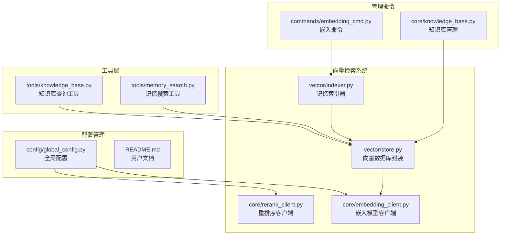

**图表来源**
- [vector/indexer.py:1-178](file://cbhcli_pkg/vector/indexer.py#L1-L178)
- [vector/store.py:1-175](file://cbhcli_pkg/vector/store.py#L1-L175)
- [core/embedding_client.py:1-132](file://cbhcli_pkg/core/embedding_client.py#L1-L132)

**章节来源**
- [README.md:269-295](file://README.md#L269-L295)

## 核心组件

### 向量存储系统

向量存储系统是整个检索系统的核心，负责管理ChromaDB客户端、集合操作和嵌入向量的处理。

#### VectorStore类
VectorStore类提供了完整的向量数据库封装，支持：
- ChromaDB客户端初始化和管理
- 集合的创建和获取
- 文档批量添加和元数据管理
- 语义查询和相似度计算
- 集合删除和统计信息查询

#### APIEmbeddingFunction类
APIEmbeddingFunction类实现了自定义嵌入函数，允许使用外部API生成嵌入向量，而不是依赖ChromaDB的内置模型。

### 嵌入模型客户端

嵌入模型客户端支持多种API格式，包括：
- OpenAI兼容API格式
- 通义千问嵌入模型
- 自定义API格式
- 批量处理优化

### 索引器系统

索引器系统负责将文档内容转换为向量表示并存储到数据库中：
- 支持多种文件格式（.md, .txt, .py, .js, .json, .yaml, .yml）
- 智能文档分割和段落处理
- 自动生成唯一文档ID
- 支持增量更新和重新索引

**章节来源**
- [vector/store.py:37-175](file://cbhcli_pkg/vector/store.py#L37-L175)
- [core/embedding_client.py:6-132](file://cbhcli_pkg/core/embedding_client.py#L6-L132)
- [vector/indexer.py:7-178](file://cbhcli_pkg/vector/indexer.py#L7-L178)

## 架构概览

CBHCLI的向量检索系统采用分层架构设计，确保了良好的模块化和可扩展性：

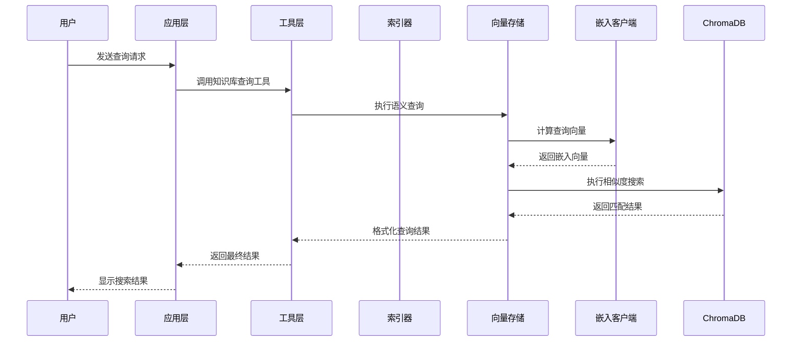

**图表来源**
- [tools/knowledge_base.py:49-121](file://cbhcli_pkg/tools/knowledge_base.py#L49-L121)
- [vector/store.py:128-160](file://cbhcli_pkg/vector/store.py#L128-L160)

系统架构的关键特点：
- **解耦设计**：各组件职责明确，便于独立测试和维护
- **可扩展性**：支持多种嵌入模型和API格式
- **性能优化**：预计算嵌入向量，避免重复计算
- **错误处理**：完善的异常处理和降级机制

## 详细组件分析

### 向量存储组件

#### VectorStore类详细分析

VectorStore类实现了完整的向量数据库管理功能：

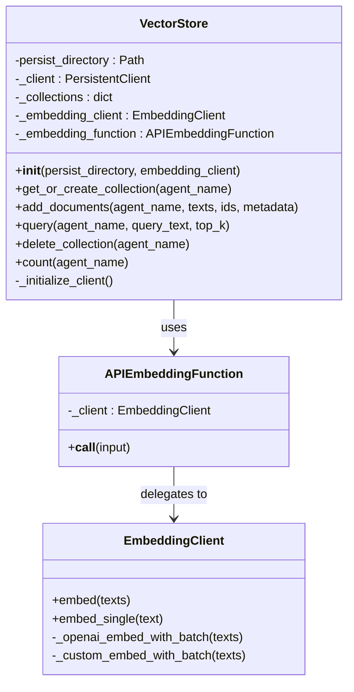

**图表来源**
- [vector/store.py:37-175](file://cbhcli_pkg/vector/store.py#L37-L175)
- [core/embedding_client.py:6-132](file://cbhcli_pkg/core/embedding_client.py#L6-L132)

#### 存储初始化流程

向量存储的初始化过程确保了正确的客户端配置和集合管理：

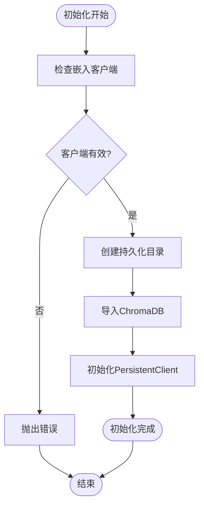

**图表来源**
- [vector/store.py:40-77](file://cbhcli_pkg/vector/store.py#L40-L77)

**章节来源**
- [vector/store.py:37-175](file://cbhcli_pkg/vector/store.py#L37-L175)

### 嵌入模型系统

#### 多模型支持架构

嵌入模型客户端支持多种API格式，提供了灵活的模型选择能力：

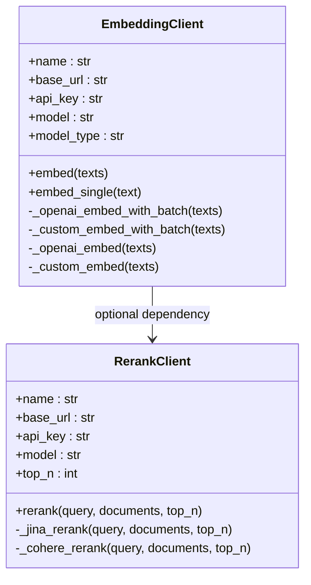

**图表来源**
- [core/embedding_client.py:6-132](file://cbhcli_pkg/core/embedding_client.py#L6-L132)
- [core/rerank_client.py:6-123](file://cbhcli_pkg/core/rerank_client.py#L6-L123)

#### 批量处理优化

嵌入模型客户端实现了智能的批量处理机制，优化了API调用效率：

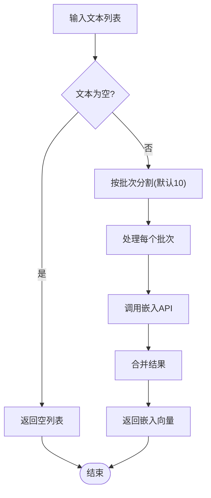

**图表来源**
- [core/embedding_client.py:49-70](file://cbhcli_pkg/core/embedding_client.py#L49-L70)

**章节来源**
- [core/embedding_client.py:6-132](file://cbhcli_pkg/core/embedding_client.py#L6-L132)
- [core/rerank_client.py:6-123](file://cbhcli_pkg/core/rerank_client.py#L6-L123)

### 索引器组件

#### 文档索引流程

索引器系统负责将文档内容转换为向量表示并存储到数据库中：

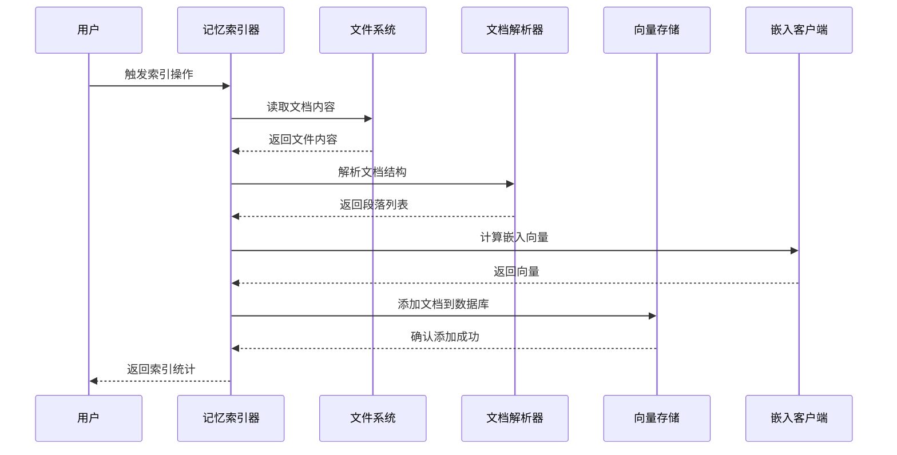

**图表来源**
- [vector/indexer.py:87-134](file://cbhcli_pkg/vector/indexer.py#L87-L134)

#### 索引策略

索引器采用了智能的索引策略，确保了高效的数据管理和维护：

**章节来源**
- [vector/indexer.py:7-178](file://cbhcli_pkg/vector/indexer.py#L7-L178)

### 查询处理系统

#### 知识库查询工具

知识库查询工具提供了完整的语义搜索功能，支持重排序和结果格式化：

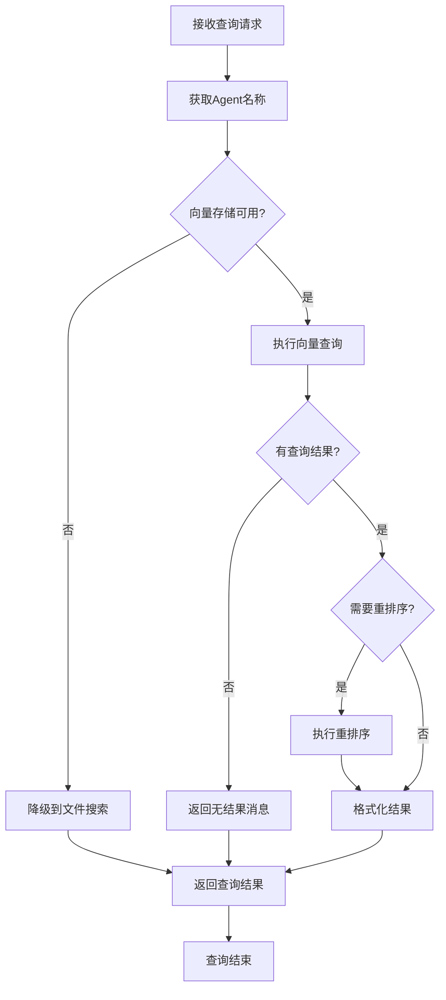

**图表来源**
- [tools/knowledge_base.py:49-121](file://cbhcli_pkg/tools/knowledge_base.py#L49-L121)

#### 记忆搜索工具

记忆搜索工具提供了向量化内容的语义搜索功能，并包含了降级机制：

**章节来源**
- [tools/knowledge_base.py:6-157](file://cbhcli_pkg/tools/knowledge_base.py#L6-L157)
- [tools/memory_search.py:6-177](file://cbhcli_pkg/tools/memory_search.py#L6-L177)

### 管理命令系统

#### 嵌入命令管理

嵌入命令系统提供了完整的向量索引管理功能：

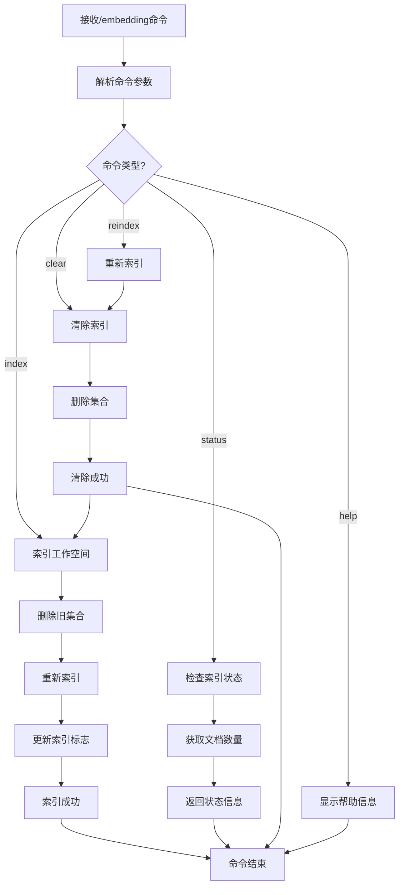

**图表来源**
- [commands/embedding_cmd.py:8-121](file://cbhcli_pkg/commands/embedding_cmd.py#L8-L121)

**章节来源**
- [commands/embedding_cmd.py:5-122](file://cbhcli_pkg/commands/embedding_cmd.py#L5-L122)

## 依赖关系分析

CBHCLI向量检索系统的依赖关系体现了清晰的分层架构：

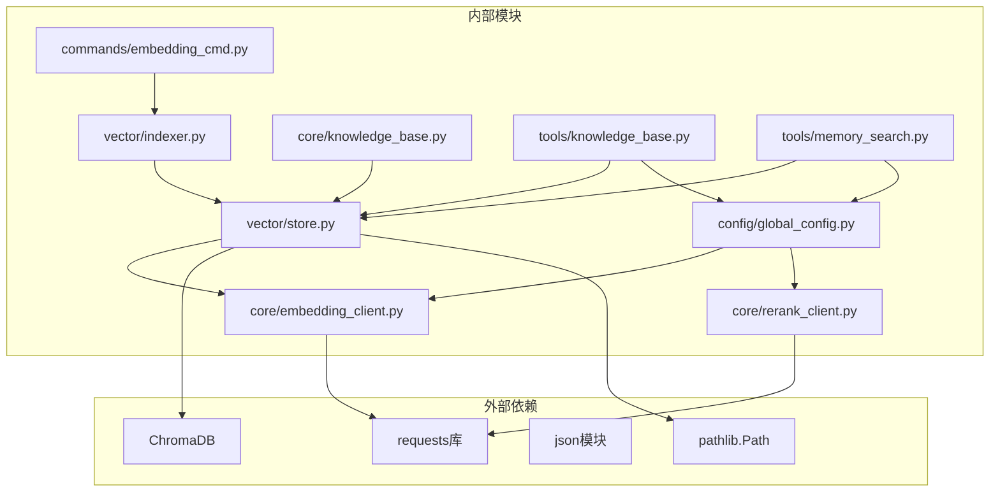

**图表来源**
- [vector/store.py:67-77](file://cbhcli_pkg/vector/store.py#L67-L77)
- [core/embedding_client.py:2-3](file://cbhcli_pkg/core/embedding_client.py#L2-L3)

系统的主要依赖特点：
- **最小化外部依赖**：只依赖必要的第三方库
- **清晰的接口定义**：各模块间通过明确定义的接口交互
- **可替换性**：嵌入模型和重排序服务可以独立替换
- **向后兼容**：支持多种API格式和配置选项

**章节来源**
- [vector/store.py:1-10](file://cbhcli_pkg/vector/store.py#L1-L10)
- [core/embedding_client.py:1-4](file://cbhcli_pkg/core/embedding_client.py#L1-L4)

## 性能考虑

### 嵌入向量计算优化

系统在嵌入向量计算方面采用了多项优化措施：

1. **预计算嵌入向量**：在添加文档和查询时都预先计算嵌入向量，避免ChromaDB重复计算
2. **批量处理**：默认每批处理10个文本，平衡了API限制和性能
3. **缓存机制**：向量存储在内存中缓存集合对象，避免重复创建

### 存储性能优化

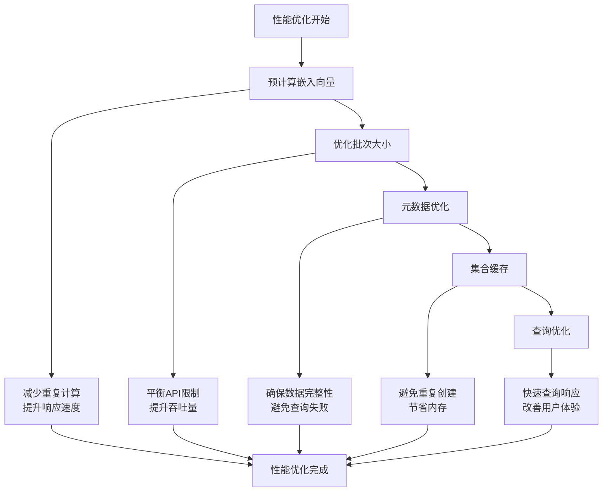

**图表来源**
- [vector/store.py:118-126](file://cbhcli_pkg/vector/store.py#L118-L126)
- [core/embedding_client.py:49-70](file://cbhcli_pkg/core/embedding_client.py#L49-L70)

### 内存管理策略

系统采用了智能的内存管理策略：
- **集合缓存**：向量存储在内存中缓存ChromaDB集合对象
- **批量处理**：控制批次大小避免内存溢出
- **及时清理**：定期清理不再使用的集合引用

### 网络通信优化

嵌入模型客户端实现了高效的网络通信：
- **连接复用**：使用requests.Session复用HTTP连接
- **超时控制**：设置30秒超时避免长时间等待
- **错误重试**：在API调用失败时提供清晰的错误信息

## 故障排除指南

### 常见问题诊断

#### 向量数据库初始化失败

**症状**：启动时出现向量数据库相关错误

**可能原因**：
1. ChromaDB未安装
2. 嵌入客户端配置缺失
3. 权限问题导致目录创建失败

**解决步骤**：
1. 确认ChromaDB已安装：`pip install chromadb`
2. 配置嵌入模型：`/model embedding add`
3. 检查目录权限：确保`~/.cbhcli`目录可写

#### 嵌入API调用失败

**症状**：嵌入向量计算过程中出现异常

**可能原因**：
1. API密钥无效
2. 网络连接问题
3. API端点配置错误

**解决步骤**：
1. 验证API密钥有效性
2. 检查网络连接
3. 确认API端点URL正确
4. 查看详细的错误信息

#### 查询结果为空

**症状**：执行查询但返回空结果

**可能原因**：
1. 未进行向量索引
2. 索引内容不足
3. 查询语句过于具体

**解决步骤**：
1. 执行索引：`/embedding index`
2. 检查索引状态：`/embedding status`
3. 尝试更通用的查询语句

### 错误处理机制

系统实现了多层次的错误处理机制：

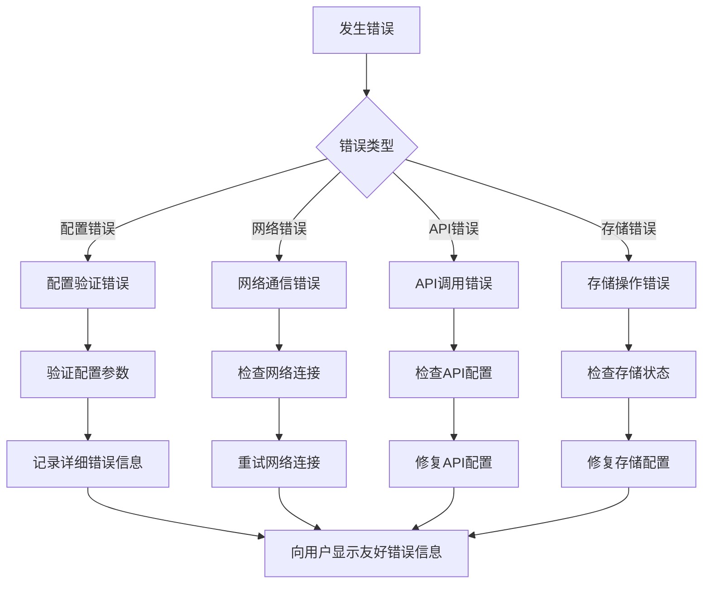

**图表来源**
- [vector/store.py:48-53](file://cbhcli_pkg/vector/store.py#L48-L53)
- [core/embedding_client.py:86-87](file://cbhcli_pkg/core/embedding_client.py#L86-L87)

**章节来源**
- [vector/store.py:48-77](file://cbhcli_pkg/vector/store.py#L48-L77)
- [core/embedding_client.py:86-87](file://cbhcli_pkg/core/embedding_client.py#L86-L87)

## 结论

CBHCLI的向量检索系统是一个设计精良、功能完整的语义搜索解决方案。系统的主要优势包括：

### 技术优势

1. **模块化设计**：清晰的分层架构确保了良好的可维护性和可扩展性
2. **性能优化**：预计算嵌入向量、批量处理和缓存机制显著提升了系统性能
3. **多模型支持**：灵活的嵌入模型配置支持多种API格式
4. **错误处理**：完善的异常处理和降级机制确保了系统的稳定性

### 功能特性

1. **完整的索引流程**：从文档分割到批量索引的完整工作流
2. **智能查询处理**：支持语义搜索和结果重排序
3. **灵活的管理命令**：提供完整的索引管理和维护功能
4. **用户友好的界面**：简洁的命令行接口和清晰的反馈信息

### 最佳实践建议

1. **合理配置嵌入模型**：根据使用场景选择合适的嵌入模型和API
2. **定期维护索引**：文件更新后及时重新索引
3. **监控系统性能**：关注索引数量和查询响应时间
4. **备份重要数据**：定期备份向量数据库和配置文件

该系统为CBHCLI提供了强大的语义搜索能力，能够有效支持多Agent的知识管理和智能查询需求。

## 附录

### 配置选项参考

#### 嵌入模型配置

| 配置项 | 类型 | 描述 | 默认值 |
|--------|------|------|--------|
| name | string | 模型名称 | "embedding" |
| apiKey | string | API密钥 | 必填 |
| url | string | API端点URL | 必填 |
| model | string | 模型标识符 | "text-embedding-3-small" |
| type | string | 模型类型 | "openai" |

#### 重排序模型配置

| 配置项 | 类型 | 描述 | 默认值 |
|--------|------|------|--------|
| name | string | 模型名称 | "rerank" |
| apiKey | string | API密钥 | 必填 |
| url | string | API端点URL | "https://api.jina.ai/v1" |
| model | string | 模型标识符 | "jina-reranker-v2-base-multilingual" |
| top_n | integer | 返回结果数量 | 5 |

### 常用命令参考

#### 嵌入管理命令

| 命令 | 参数 | 描述 |
|------|------|------|
| /embedding index | 无 | 索引当前Agent工作空间 |
| /embedding status | 无 | 查看索引状态 |
| /embedding clear | 无 | 清除当前Agent索引 |
| /embedding reindex | 无 | 重新索引（清除后重建） |

#### 知识库管理命令

| 命令 | 参数 | 描述 |
|------|------|------|
| /kb add | file_path | 添加文件到知识库 |
| /kb list | 无 | 列出知识库文件 |
| /kb remove | file_name | 删除知识库文件 |
| /kb reindex | 无 | 重新索引知识库 |
| /kb status | 无 | 查看知识库状态 |

### 性能调优建议

1. **嵌入模型选择**：根据精度和速度需求选择合适的嵌入模型
2. **批次大小调整**：根据API限制和网络条件调整批量大小
3. **索引频率控制**：平衡索引频率和数据新鲜度
4. **内存资源配置**：根据数据规模合理配置系统资源