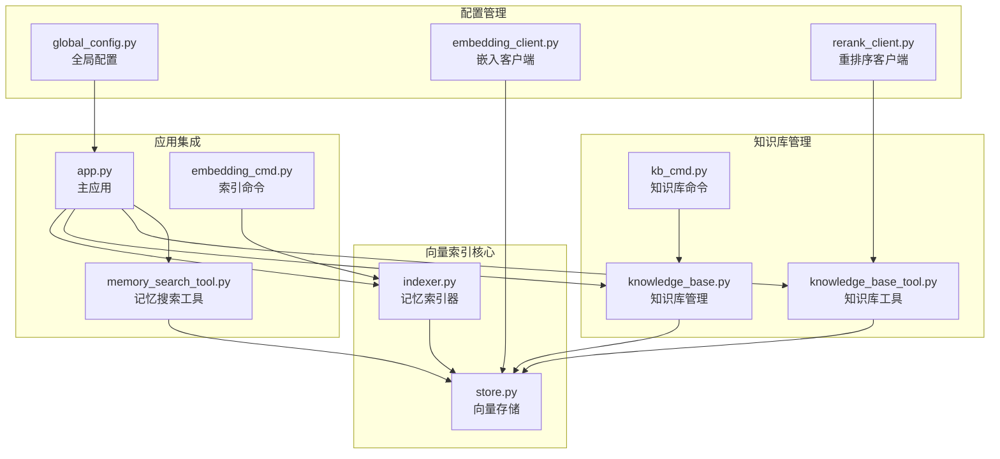
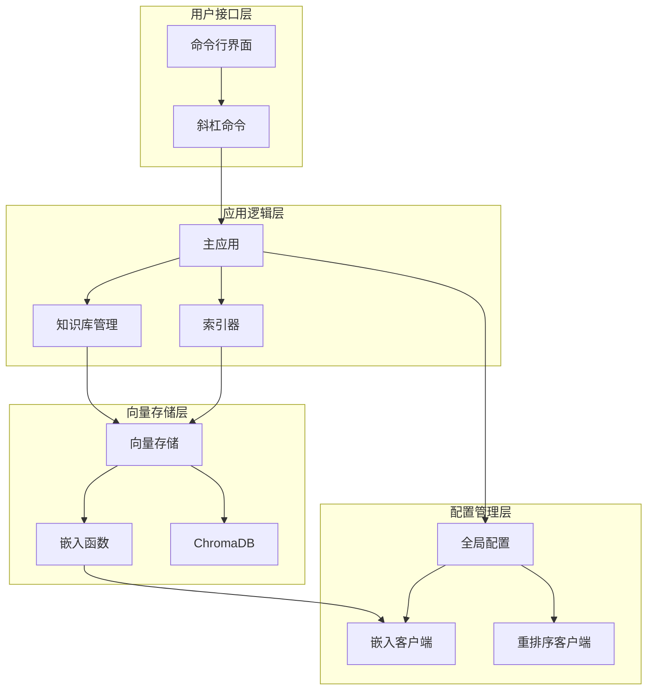
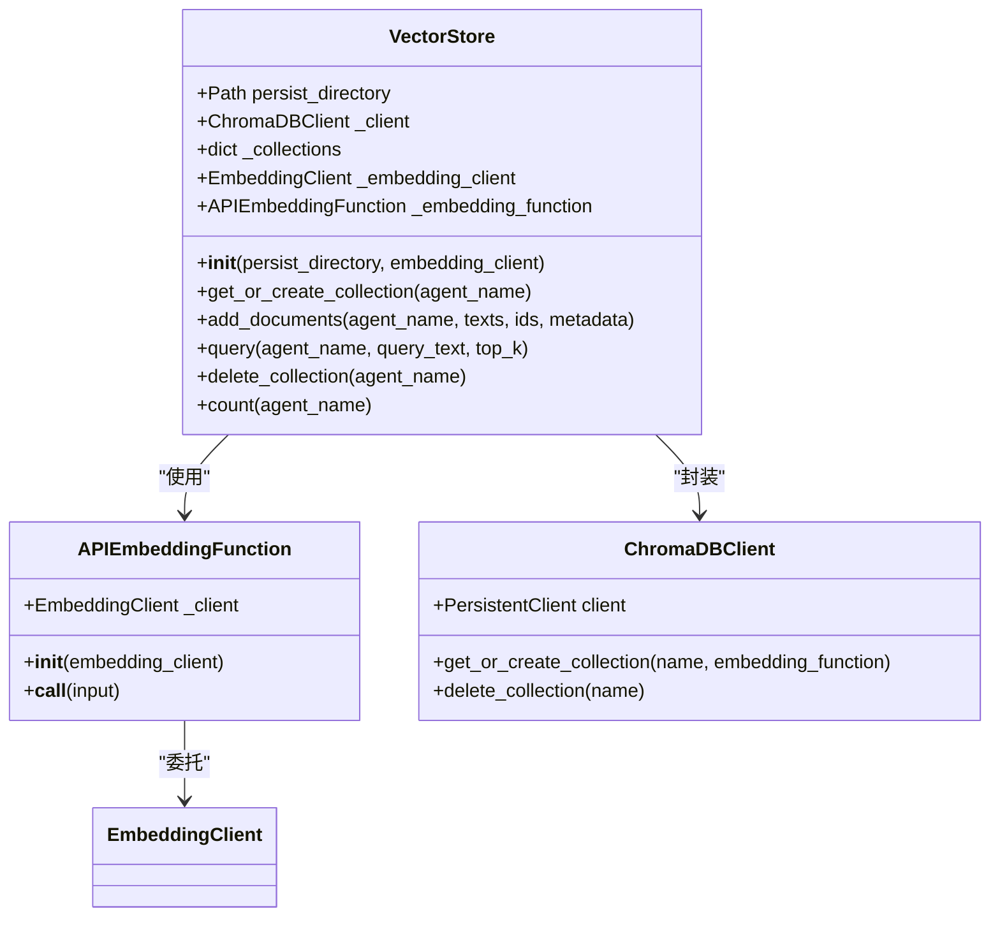
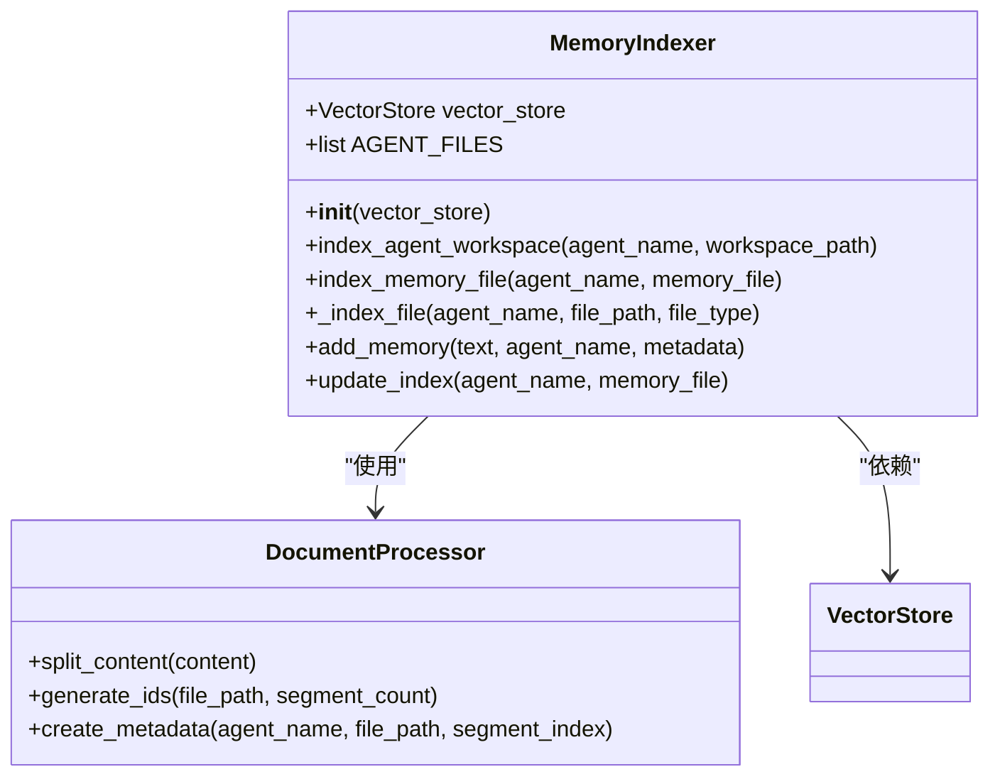
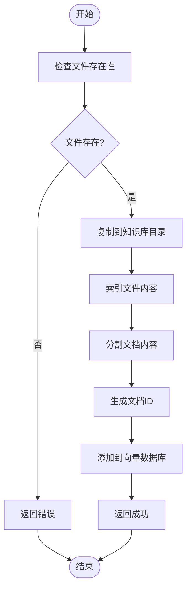
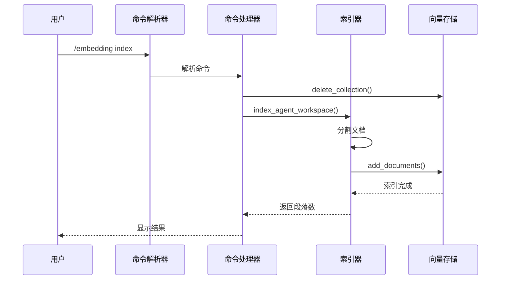
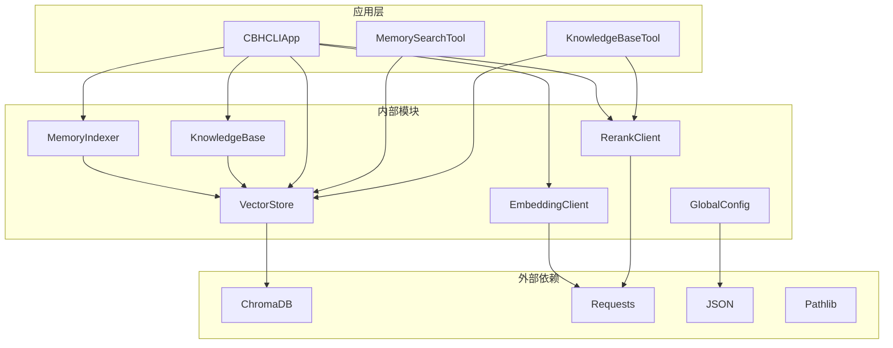
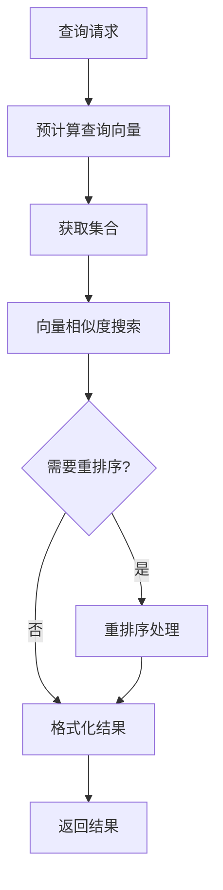

# 向量索引维护

<cite>
**本文档引用的文件**
- [indexer.py](file://cbhcli_pkg/vector/indexer.py)
- [store.py](file://cbhcli_pkg/vector/store.py)
- [knowledge_base.py](file://cbhcli_pkg/core/knowledge_base.py)
- [knowledge_base_tool.py](file://cbhcli_pkg/tools/knowledge_base.py)
- [kb_cmd.py](file://cbhcli_pkg/commands/kb_cmd.py)
- [embedding_cmd.py](file://cbhcli_pkg/commands/embedding_cmd.py)
- [app.py](file://cbhcli_pkg/core/app.py)
- [global_config.py](file://cbhcli_pkg/config/global_config.py)
- [memory_search_tool.py](file://cbhcli_pkg/tools/memory_search.py)
- [parser.py](file://cbhcli_pkg/commands/parser.py)
- [embedding_client.py](file://cbhcli_pkg/core/embedding_client.py)
- [rerank_client.py](file://cbhcli_pkg/core/rerank_client.py)
</cite>

## 目录
1. [简介](#简介)
2. [项目结构](#项目结构)
3. [核心组件](#核心组件)
4. [架构概览](#架构概览)
5. [详细组件分析](#详细组件分析)
6. [依赖关系分析](#依赖关系分析)
7. [性能考虑](#性能考虑)
8. [故障排除指南](#故障排除指南)
9. [结论](#结论)

## 简介

CBHCLI的向量索引维护系统是一个完整的知识检索解决方案，基于ChromaDB向量数据库构建。该系统支持多种文档格式的智能索引、语义搜索和实时更新，为AI代理提供了强大的知识管理能力。

系统的核心特性包括：
- 多格式文档支持（Markdown、纯文本、代码文件等）
- 智能文档分割策略
- 批量索引和增量更新机制
- 语义搜索和重排序功能
- 知识库管理和向量存储分离
- 嵌入模型版本兼容性处理

## 项目结构

向量索引系统主要分布在以下模块中：

**图表来源**
- [indexer.py:1-178](file://cbhcli_pkg/vector/indexer.py#L1-L178)
- [store.py:1-175](file://cbhcli_pkg/vector/store.py#L1-L175)
- [knowledge_base.py:1-207](file://cbhcli_pkg/core/knowledge_base.py#L1-L207)

**章节来源**
- [indexer.py:1-178](file://cbhcli_pkg/vector/indexer.py#L1-L178)
- [store.py:1-175](file://cbhcli_pkg/vector/store.py#L1-L175)
- [knowledge_base.py:1-207](file://cbhcli_pkg/core/knowledge_base.py#L1-L207)

## 核心组件

### 向量存储层

向量存储层是整个系统的基础设施，负责：
- ChromaDB客户端管理
- 嵌入向量计算
- 文档持久化存储
- 查询结果检索

### 索引管理层

索引管理层负责文档的预处理和索引创建：
- 文档分割策略
- ID生成机制
- 元数据管理
- 批量索引处理

### 知识库管理层

知识库管理层提供高级功能：
- 文件管理
- 自动索引
- 状态监控
- 错误处理

**章节来源**
- [store.py:37-175](file://cbhcli_pkg/vector/store.py#L37-L175)
- [indexer.py:7-178](file://cbhcli_pkg/vector/indexer.py#L7-L178)
- [knowledge_base.py:7-207](file://cbhcli_pkg/core/knowledge_base.py#L7-L207)

## 架构概览

系统采用分层架构设计，确保各组件职责清晰、耦合度低：

**图表来源**
- [app.py:54-150](file://cbhcli_pkg/core/app.py#L54-L150)
- [kb_cmd.py:5-54](file://cbhcli_pkg/commands/kb_cmd.py#L5-L54)
- [embedding_cmd.py:5-39](file://cbhcli_pkg/commands/embedding_cmd.py#L5-L39)

## 详细组件分析

### 向量存储系统

向量存储系统是整个索引系统的核心基础设施：

**图表来源**
- [store.py:37-175](file://cbhcli_pkg/vector/store.py#L37-L175)
- [embedding_client.py:6-132](file://cbhcli_pkg/core/embedding_client.py#L6-L132)

向量存储的关键特性：
- **集合管理**：每个Agent拥有独立的向量集合
- **嵌入函数**：支持自定义嵌入模型API
- **批量处理**：优化大量文档的索引性能
- **查询优化**：预计算查询向量提高响应速度

**章节来源**
- [store.py:37-175](file://cbhcli_pkg/vector/store.py#L37-L175)

### 记忆索引器

记忆索引器负责Agent工作空间文件的智能索引：

**图表来源**
- [indexer.py:7-178](file://cbhcli_pkg/vector/indexer.py#L7-L178)

索引策略特点：
- **多文件支持**：支持Agent标准文件和知识库文档
- **智能分割**：按段落分割文档，保持语义完整性
- **ID生成**：基于文件名和段落索引生成唯一ID
- **元数据管理**：包含Agent名称、文件类型、位置信息

**章节来源**
- [indexer.py:7-178](file://cbhcli_pkg/vector/indexer.py#L7-L178)

### 知识库管理系统

知识库管理系统提供完整的文件生命周期管理：

**图表来源**
- [knowledge_base.py:31-207](file://cbhcli_pkg/core/knowledge_base.py#L31-L207)

管理功能包括：
- **文件添加**：自动重命名避免冲突
- **文件删除**：支持删除操作（简化处理）
- **批量索引**：重新索引整个知识库
- **状态监控**：跟踪索引进度和统计信息

**章节来源**
- [knowledge_base.py:31-207](file://cbhcli_pkg/core/knowledge_base.py#L31-L207)

### 命令行接口

系统提供完整的命令行接口用于索引管理：

**图表来源**
- [embedding_cmd.py:42-70](file://cbhcli_pkg/commands/embedding_cmd.py#L42-L70)
- [parser.py:51-78](file://cbhcli_pkg/commands/parser.py#L51-L78)

**章节来源**
- [kb_cmd.py:5-186](file://cbhcli_pkg/commands/kb_cmd.py#L5-L186)
- [embedding_cmd.py:5-122](file://cbhcli_pkg/commands/embedding_cmd.py#L5-L122)

## 依赖关系分析

系统采用松耦合设计，通过接口和依赖注入实现组件间的解耦：

**图表来源**
- [app.py:39-150](file://cbhcli_pkg/core/app.py#L39-L150)
- [store.py:1-10](file://cbhcli_pkg/vector/store.py#L1-L10)

**章节来源**
- [app.py:39-150](file://cbhcli_pkg/core/app.py#L39-L150)
- [global_config.py:1-154](file://cbhcli_pkg/config/global_config.py#L1-L154)

## 性能考虑

### 索引性能优化

系统在多个层面实现了性能优化：

1. **批量处理**：嵌入向量计算采用批量处理，减少API调用次数
2. **预计算优化**：查询时预计算查询向量，避免重复计算
3. **缓存机制**：集合对象缓存，避免重复创建
4. **内存管理**：及时释放不需要的对象引用

### 存储优化策略

- **集合隔离**：每个Agent独立集合，便于管理和清理
- **元数据精简**：只存储必要的元数据信息
- **索引压缩**：ChromaDB自动进行向量压缩
- **持久化管理**：统一的持久化目录结构

### 查询优化机制

**图表来源**
- [store.py:128-160](file://cbhcli_pkg/vector/store.py#L128-L160)
- [knowledge_base_tool.py:123-157](file://cbhcli_pkg/tools/knowledge_base.py#L123-L157)

**章节来源**
- [store.py:118-160](file://cbhcli_pkg/vector/store.py#L118-L160)
- [knowledge_base_tool.py:80-122](file://cbhcli_pkg/tools/knowledge_base.py#L80-L122)

## 故障排除指南

### 常见问题及解决方案

#### 嵌入模型配置问题
- **症状**：向量存储初始化失败
- **原因**：嵌入模型配置不正确或网络连接问题
- **解决**：检查配置文件，验证API密钥和URL

#### ChromaDB依赖问题
- **症状**：导入ChromaDB失败
- **原因**：未安装ChromaDB依赖
- **解决**：运行 `pip install chromadb`

#### 索引权限问题
- **症状**：无法创建向量存储目录
- **原因**：权限不足
- **解决**：检查用户权限，确保有写入权限

#### 查询超时问题
- **症状**：查询响应缓慢
- **原因**：网络延迟或API限流
- **解决**：增加超时时间，检查网络连接

### 数据一致性保证

系统通过以下机制保证数据一致性：

1. **原子操作**：集合删除和创建操作的原子性
2. **事务处理**：批量索引操作的事务性
3. **错误回滚**：异常情况下的状态回滚
4. **状态监控**：实时监控索引状态

**章节来源**
- [store.py:162-175](file://cbhcli_pkg/vector/store.py#L162-L175)
- [indexer.py:48-50](file://cbhcli_pkg/vector/indexer.py#L48-L50)

## 结论

CBHCLI的向量索引维护系统是一个设计精良的知识检索解决方案，具有以下优势：

1. **模块化设计**：清晰的分层架构，便于维护和扩展
2. **性能优化**：多层面的性能优化策略
3. **易用性**：直观的命令行接口和丰富的功能
4. **可靠性**：完善的错误处理和数据一致性保证
5. **可扩展性**：支持多种嵌入模型和重排序算法

该系统为AI代理提供了强大的知识管理能力，支持从简单的文档检索到复杂的语义搜索场景。通过合理的索引策略和优化机制，能够有效提升AI代理的知识获取效率和准确性。