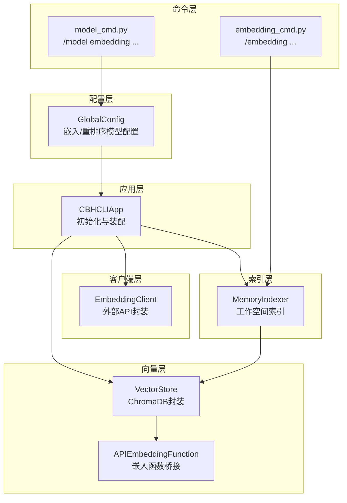
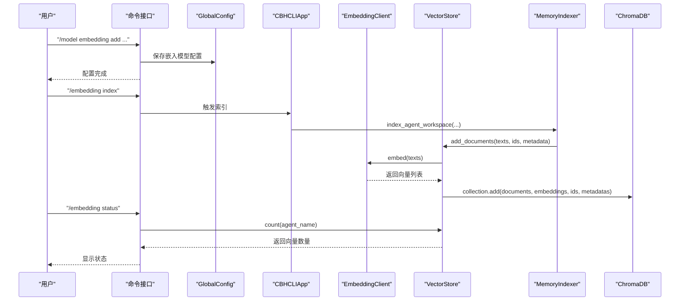
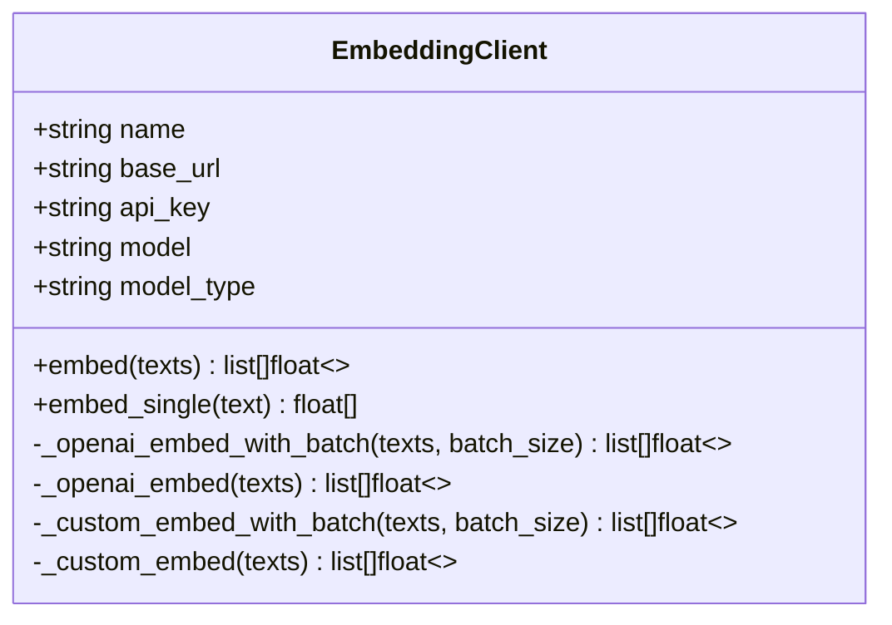
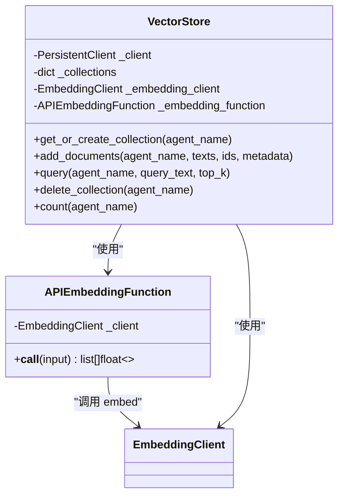
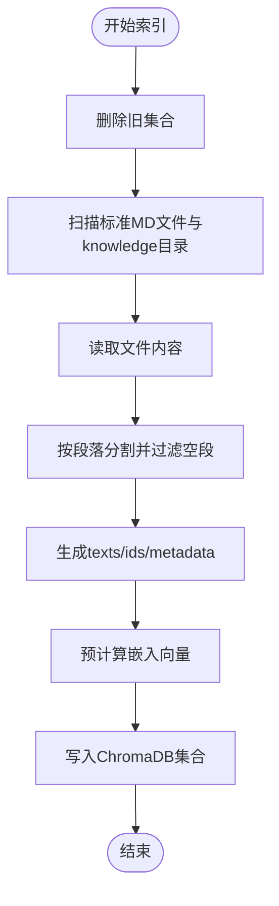
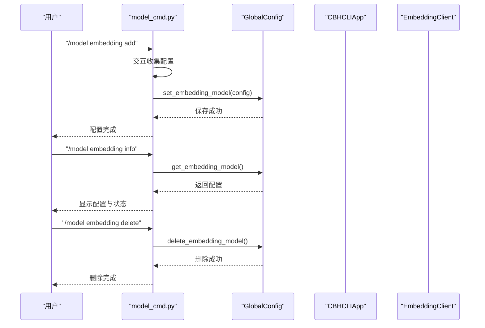
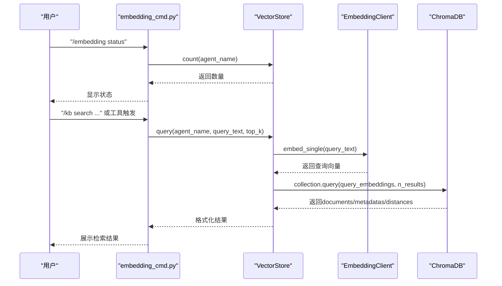
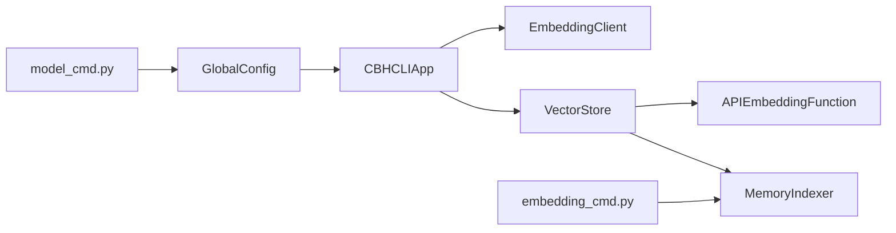

# 嵌入模型集成

<cite>
**本文引用的文件**
- [embedding_client.py](file://cbhcli_pkg/core/embedding_client.py)
- [store.py](file://cbhcli_pkg/vector/store.py)
- [indexer.py](file://cbhcli_pkg/vector/indexer.py)
- [global_config.py](file://cbhcli_pkg/config/global_config.py)
- [model_cmd.py](file://cbhcli_pkg/commands/model_cmd.py)
- [embedding_cmd.py](file://cbhcli_pkg/commands/embedding_cmd.py)
- [app.py](file://cbhcli_pkg/core/app.py)
- [README.md](file://README.md)
</cite>

## 目录
1. [简介](#简介)
2. [项目结构](#项目结构)
3. [核心组件](#核心组件)
4. [架构总览](#架构总览)
5. [详细组件分析](#详细组件分析)
6. [依赖关系分析](#依赖关系分析)
7. [性能考量](#性能考量)
8. [故障排查指南](#故障排查指南)
9. [结论](#结论)
10. [附录](#附录)

## 简介
本文件面向CBHCLI的嵌入模型集成系统，系统性阐述嵌入向量的生成与使用流程，重点解析以下方面：
- 嵌入模型的工作原理与文本向量化过程
- APIEmbeddingFunction类的实现机制与调用流程
- 嵌入模型客户端的配置方法与不同模型提供商的接入
- 嵌入向量的计算过程（批量与单个文本处理）
- 嵌入模型选择标准与性能对比
- 在向量检索中的关键作用与优化策略
- 具体的配置与使用示例（通过命令行）

## 项目结构
CBHCLI的嵌入模型集成涉及以下关键模块：
- 配置层：全局配置管理，负责嵌入模型与重排序模型的持久化与读取
- 客户端层：嵌入模型客户端，封装外部API调用与批量处理
- 向量层：向量存储与嵌入函数桥接，使用ChromaDB进行持久化与查询
- 索引层：将Agent工作空间文件切分为段落并构建向量索引
- 命令层：提供配置嵌入模型与触发索引的斜杠命令

图表来源
- [global_config.py:117-134](file://cbhcli_pkg/config/global_config.py#L117-L134)
- [embedding_client.py:15-132](file://cbhcli_pkg/core/embedding_client.py#L15-L132)
- [store.py:12-175](file://cbhcli_pkg/vector/store.py#L12-L175)
- [indexer.py:28-178](file://cbhcli_pkg/vector/indexer.py#L28-L178)
- [model_cmd.py:182-273](file://cbhcli_pkg/commands/model_cmd.py#L182-L273)
- [embedding_cmd.py:5-122](file://cbhcli_pkg/commands/embedding_cmd.py#L5-L122)
- [app.py:97-150](file://cbhcli_pkg/core/app.py#L97-L150)

章节来源
- [README.md:269-296](file://README.md#L269-L296)
- [app.py:97-150](file://cbhcli_pkg/core/app.py#L97-L150)

## 核心组件
- 嵌入模型客户端（EmbeddingClient）：封装外部API调用，支持OpenAI兼容与自定义格式，提供批量与单个文本向量化能力
- APIEmbeddingFunction：将EmbeddingClient桥接到ChromaDB，作为其embedding_function使用
- VectorStore：ChromaDB封装，负责集合创建、文档添加与查询，强制使用自定义嵌入函数
- MemoryIndexer：将Agent工作空间文件切分为段落并写入向量数据库
- GlobalConfig：嵌入/重排序模型配置的读取与持久化
- 命令接口：/model embedding与/embedding命令，用于配置与触发索引

章节来源
- [embedding_client.py:6-132](file://cbhcli_pkg/core/embedding_client.py#L6-L132)
- [store.py:12-175](file://cbhcli_pkg/vector/store.py#L12-L175)
- [indexer.py:7-178](file://cbhcli_pkg/vector/indexer.py#L7-L178)
- [global_config.py:117-134](file://cbhcli_pkg/config/global_config.py#L117-L134)
- [model_cmd.py:182-273](file://cbhcli_pkg/commands/model_cmd.py#L182-L273)
- [embedding_cmd.py:5-122](file://cbhcli_pkg/commands/embedding_cmd.py#L5-L122)

## 架构总览
嵌入模型集成的关键流程如下：
- 应用启动时读取全局配置，若存在嵌入模型配置则初始化EmbeddingClient
- 若嵌入模型可用，则初始化VectorStore并注入APIEmbeddingFunction
- MemoryIndexer负责将Agent工作空间文件切分为段落，预先计算嵌入向量后写入ChromaDB
- 查询时，预先计算查询向量，再通过VectorStore进行语义检索

图表来源
- [model_cmd.py:182-273](file://cbhcli_pkg/commands/model_cmd.py#L182-L273)
- [embedding_cmd.py:42-122](file://cbhcli_pkg/commands/embedding_cmd.py#L42-L122)
- [app.py:97-150](file://cbhcli_pkg/core/app.py#L97-L150)
- [indexer.py:37-134](file://cbhcli_pkg/vector/indexer.py#L37-L134)
- [store.py:99-126](file://cbhcli_pkg/vector/store.py#L99-L126)
- [embedding_client.py:34-91](file://cbhcli_pkg/core/embedding_client.py#L34-L91)

## 详细组件分析

### 嵌入模型客户端（EmbeddingClient）
- 支持两种模型类型：openai（默认）与custom
- 提供批量处理与单个文本处理：
  - 批量：按批次（默认10）调用OpenAI兼容API，聚合返回
  - 单个：包装为列表后复用批量逻辑
- OpenAI兼容格式：发送model、input、encoding_format等字段
- 错误处理：非200状态码抛出异常

图表来源
- [embedding_client.py:6-132](file://cbhcli_pkg/core/embedding_client.py#L6-L132)

章节来源
- [embedding_client.py:15-132](file://cbhcli_pkg/core/embedding_client.py#L15-L132)

### APIEmbeddingFunction与VectorStore
- APIEmbeddingFunction：将EmbeddingClient.embed作为ChromaDB的embedding_function
- VectorStore：
  - 初始化时必须传入embedding_client，否则抛出异常
  - get_or_create_collection时必须传入embedding_function
  - add_documents时预先计算嵌入向量，避免ChromaDB调用默认模型
  - query时预先计算查询向量，避免ChromaDB调用默认模型

图表来源
- [store.py:12-175](file://cbhcli_pkg/vector/store.py#L12-L175)
- [embedding_client.py:34-132](file://cbhcli_pkg/core/embedding_client.py#L34-L132)

章节来源
- [store.py:12-175](file://cbhcli_pkg/vector/store.py#L12-L175)

### MemoryIndexer与向量索引流程
- 支持的文件：memory.md、skills.md、soul.md、tools.md、usage.md以及knowledge/目录下的多种格式
- 索引步骤：
  - 删除旧集合（确保内容更新后ID一致）
  - 逐文件读取并按段落分割
  - 为每段生成唯一ID与元数据
  - 调用VectorStore.add_documents，预先计算嵌入向量后写入

图表来源
- [indexer.py:37-134](file://cbhcli_pkg/vector/indexer.py#L37-L134)
- [store.py:99-126](file://cbhcli_pkg/vector/store.py#L99-L126)

章节来源
- [indexer.py:7-178](file://cbhcli_pkg/vector/indexer.py#L7-L178)
- [store.py:99-126](file://cbhcli_pkg/vector/store.py#L99-L126)

### 嵌入模型配置与命令
- /model embedding add：交互式添加嵌入模型配置（名称、API Key、Base URL、模型ID、类型）
- /model embedding info：查看当前嵌入模型配置与状态
- /model embedding delete：删除嵌入模型配置
- /embedding index/status/reindex：手动触发索引、查看状态、重新索引

图表来源
- [model_cmd.py:182-273](file://cbhcli_pkg/commands/model_cmd.py#L182-L273)
- [global_config.py:117-134](file://cbhcli_pkg/config/global_config.py#L117-L134)
- [app.py:97-111](file://cbhcli_pkg/core/app.py#L97-L111)

章节来源
- [model_cmd.py:182-273](file://cbhcli_pkg/commands/model_cmd.py#L182-L273)
- [global_config.py:117-134](file://cbhcli_pkg/config/global_config.py#L117-L134)
- [app.py:97-111](file://cbhcli_pkg/core/app.py#L97-L111)

### 向量检索与查询流程
- 查询时预先计算查询向量，避免ChromaDB调用默认模型
- 返回结果包含document、metadata与distance，便于后续处理

图表来源
- [embedding_cmd.py:72-91](file://cbhcli_pkg/commands/embedding_cmd.py#L72-L91)
- [store.py:128-160](file://cbhcli_pkg/vector/store.py#L128-L160)
- [embedding_client.py:120-132](file://cbhcli_pkg/core/embedding_client.py#L120-L132)

章节来源
- [store.py:128-160](file://cbhcli_pkg/vector/store.py#L128-L160)
- [embedding_cmd.py:72-91](file://cbhcli_pkg/commands/embedding_cmd.py#L72-L91)

## 依赖关系分析
- CBHCLIApp在初始化阶段读取全局配置，决定是否启用嵌入模型与向量存储
- VectorStore依赖EmbeddingClient，且必须在构造时提供
- APIEmbeddingFunction作为ChromaDB的embedding_function，内部委托EmbeddingClient.embed
- MemoryIndexer依赖VectorStore，负责将文档写入向量数据库
- 命令层通过GlobalConfig与App协作，完成配置与索引操作

图表来源
- [app.py:97-150](file://cbhcli_pkg/core/app.py#L97-L150)
- [store.py:12-60](file://cbhcli_pkg/vector/store.py#L12-L60)
- [model_cmd.py:182-273](file://cbhcli_pkg/commands/model_cmd.py#L182-L273)
- [embedding_cmd.py:42-122](file://cbhcli_pkg/commands/embedding_cmd.py#L42-L122)

章节来源
- [app.py:97-150](file://cbhcli_pkg/core/app.py#L97-L150)
- [store.py:12-60](file://cbhcli_pkg/vector/store.py#L12-L60)

## 性能考量
- 批量处理：EmbeddingClient默认每批处理10个文本，减少API调用次数与网络开销
- 预计算嵌入：VectorStore在add_documents与query时预先计算嵌入向量，避免ChromaDB调用默认模型，提升一致性与可控性
- 索引策略：Agent工作空间文件按段落切分，既保证检索粒度又控制单段大小
- 重排序：可选的重排序模型进一步提升检索质量（见重排序客户端）

## 故障排查指南
- 未配置嵌入模型
  - 现象：VectorStore初始化时报错，提示需要embedding_client
  - 处理：使用/ model embedding add配置嵌入模型
- ChromaDB未安装
  - 现象：初始化VectorStore时报错，提示需安装chromadb
  - 处理：pip install chromadb
- API调用失败
  - 现象：EmbeddingClient抛出异常，状态码非200
  - 处理：检查API Key、Base URL、模型ID与网络连通性
- 索引失败
  - 现象：/embedding index报错
  - 处理：确认Agent工作空间存在、文件可读、向量数据库可用

章节来源
- [store.py:48-53](file://cbhcli_pkg/vector/store.py#L48-L53)
- [store.py:74-77](file://cbhcli_pkg/vector/store.py#L74-L77)
- [embedding_client.py:86-88](file://cbhcli_pkg/core/embedding_client.py#L86-L88)
- [embedding_cmd.py:54-69](file://cbhcli_pkg/commands/embedding_cmd.py#L54-L69)

## 结论
CBHCLI的嵌入模型集成通过EmbeddingClient与APIEmbeddingFunction实现了对外部嵌入模型API的统一封装，并通过VectorStore与MemoryIndexer将文本向量化与语义检索无缝衔接。该设计具备良好的扩展性与可控性，既支持OpenAI兼容模型，也允许自定义API格式；同时通过批量处理与预计算嵌入向量等策略，兼顾性能与一致性。

## 附录

### 嵌入模型配置与使用示例
- 配置嵌入模型
  - 使用命令：/model embedding add
  - 输入项：模型名称、API Key、Base URL、模型ID、模型类型（openai或custom）
- 查看嵌入模型
  - 使用命令：/model embedding info
- 删除嵌入模型
  - 使用命令：/model embedding delete
- 触发向量索引
  - 使用命令：/embedding index
- 查看索引状态
  - 使用命令：/embedding status
- 重新索引
  - 使用命令：/embedding reindex

章节来源
- [model_cmd.py:182-273](file://cbhcli_pkg/commands/model_cmd.py#L182-L273)
- [embedding_cmd.py:5-122](file://cbhcli_pkg/commands/embedding_cmd.py#L5-L122)

### 嵌入模型选择标准与性能对比
- 选择标准
  - 成本：API调用单价与批量折扣
  - 准确性：在目标领域的语义表达能力
  - 延迟：单次请求耗时与并发能力
  - 维护：API稳定性与文档完善程度
- 性能对比要点
  - OpenAI text-embedding-3-small：平衡成本与质量，适合通用场景
  - 自定义API：可按需定制格式与参数，适合私有化部署
- 实践建议
  - 优先选择OpenAI兼容API，便于迁移与维护
  - 在生产环境建议开启批量处理与预计算嵌入向量策略

章节来源
- [embedding_client.py:49-118](file://cbhcli_pkg/core/embedding_client.py#L49-L118)
- [store.py:118-143](file://cbhcli_pkg/vector/store.py#L118-L143)