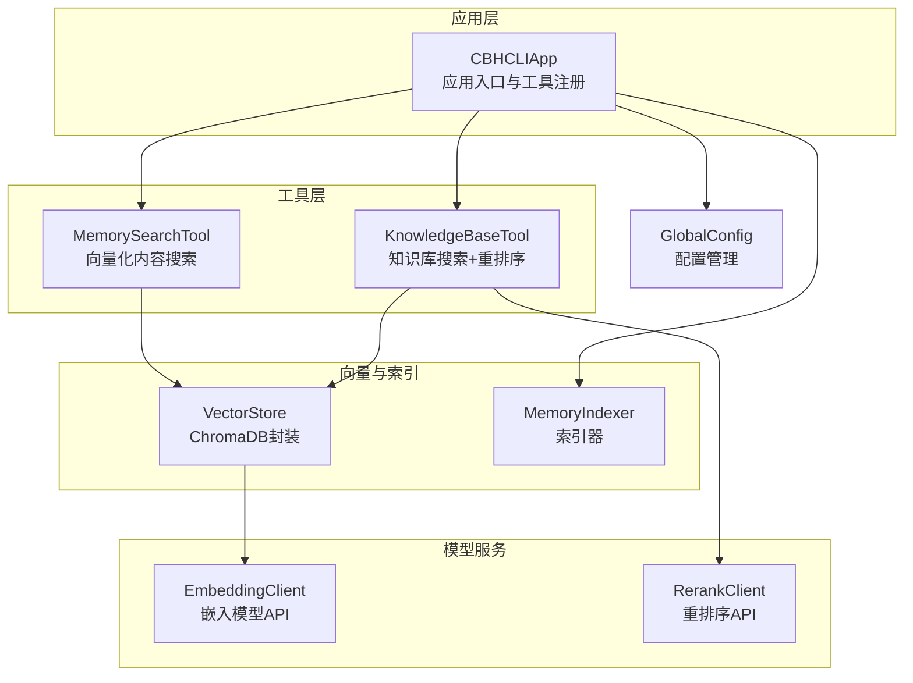
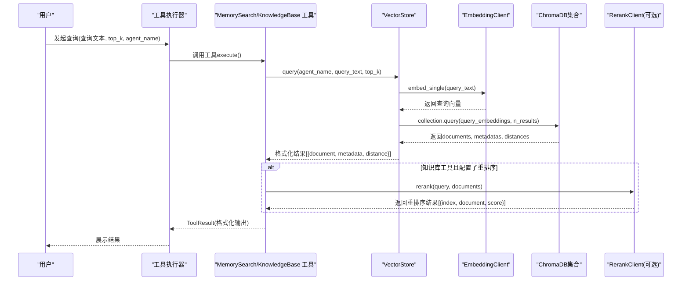
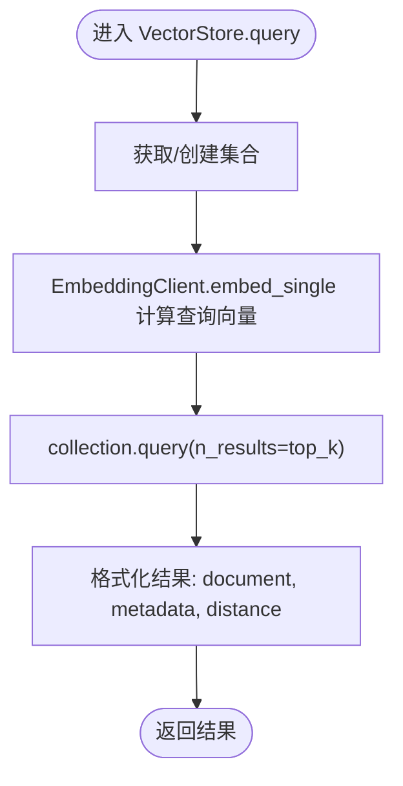
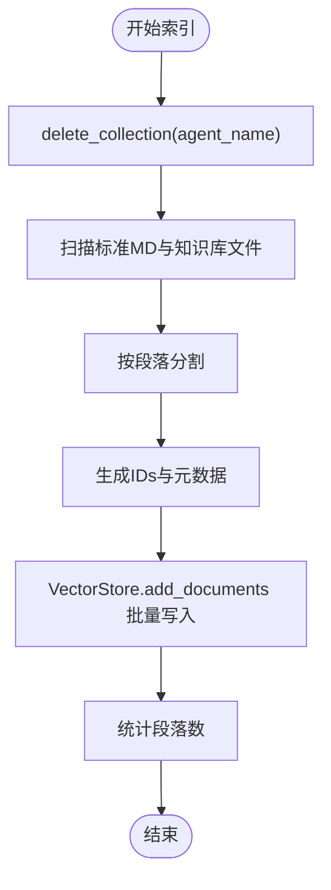
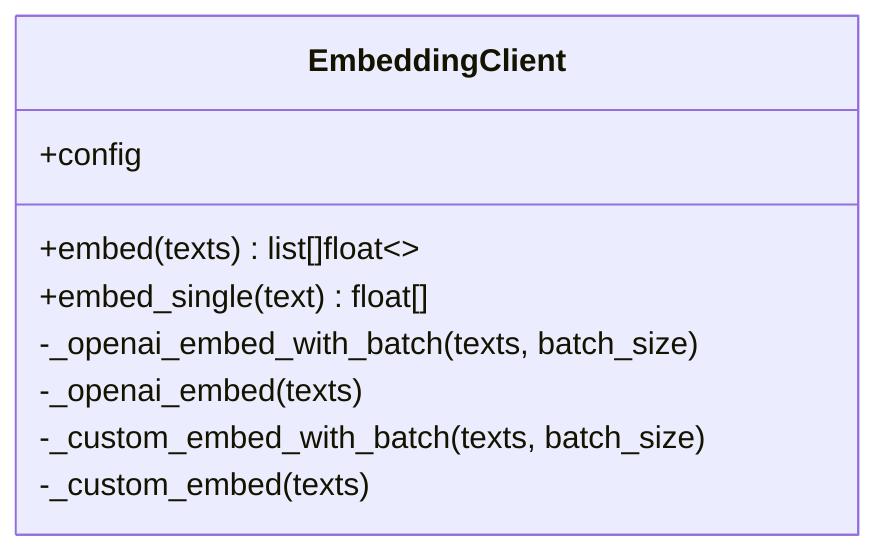
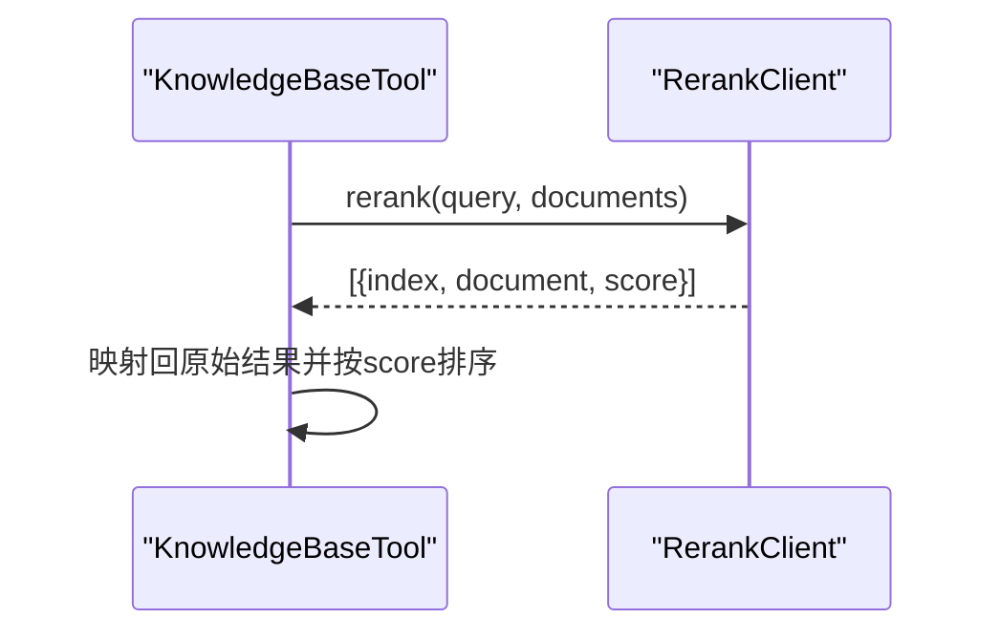
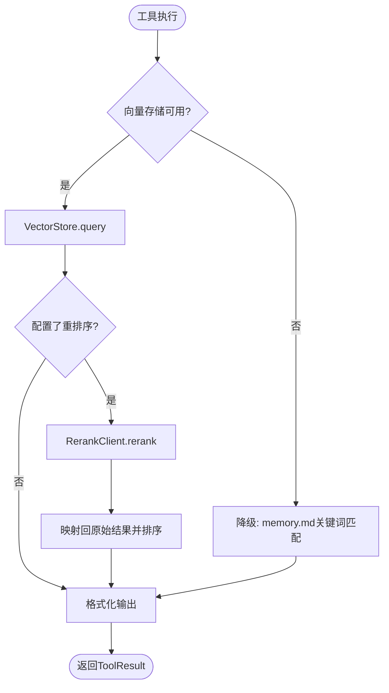
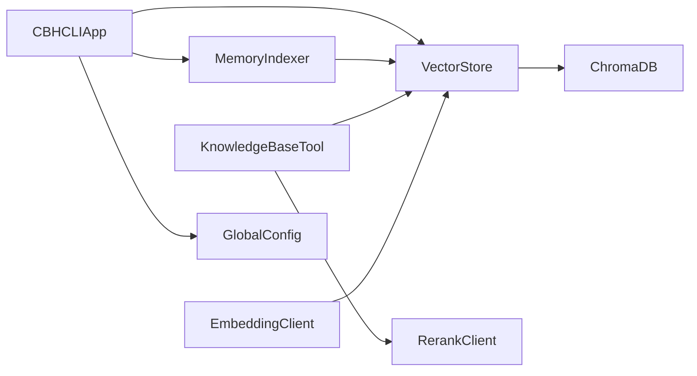
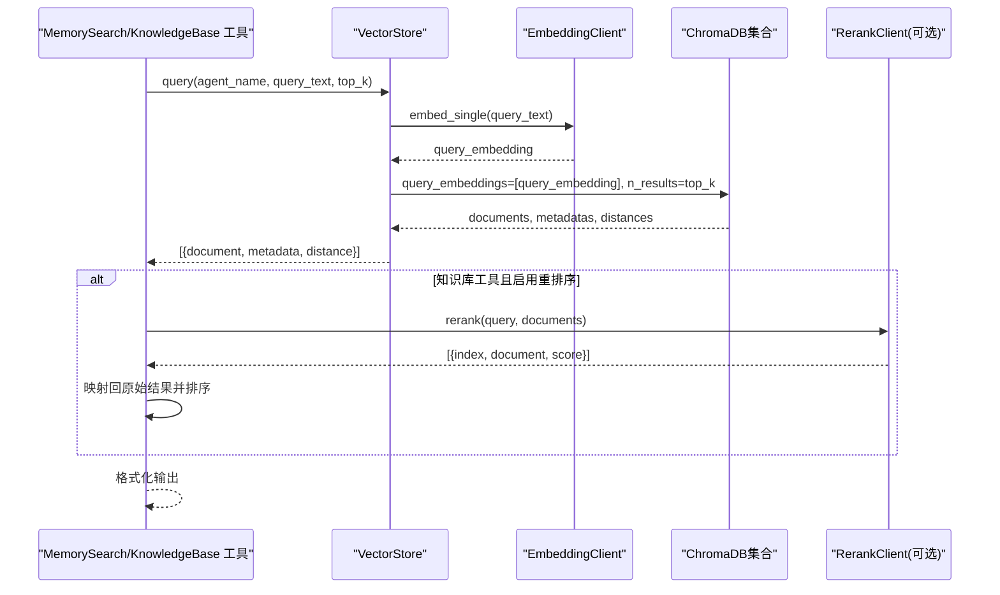

# 语义搜索查询处理

<cite>
**本文引用的文件**
- [store.py](file://cbhcli_pkg/vector/store.py)
- [indexer.py](file://cbhcli_pkg/vector/indexer.py)
- [embedding_client.py](file://cbhcli_pkg/core/embedding_client.py)
- [rerank_client.py](file://cbhcli_pkg/core/rerank_client.py)
- [memory_search.py](file://cbhcli_pkg/tools/memory_search.py)
- [knowledge_base.py](file://cbhcli_pkg/tools/knowledge_base.py)
- [global_config.py](file://cbhcli_pkg/config/global_config.py)
- [embedding_cmd.py](file://cbhcli_pkg/commands/embedding_cmd.py)
- [app.py](file://cbhcli_pkg/core/app.py)
</cite>

## 目录
1. [简介](#简介)
2. [项目结构](#项目结构)
3. [核心组件](#核心组件)
4. [架构总览](#架构总览)
5. [详细组件分析](#详细组件分析)
6. [依赖分析](#依赖分析)
7. [性能考虑](#性能考虑)
8. [故障排查指南](#故障排查指南)
9. [结论](#结论)
10. [附录](#附录)

## 简介
本文档围绕CBHCLI的语义搜索查询处理系统，系统性解析从“查询文本”到“top-k结果”的完整链路，涵盖查询文本预处理、嵌入向量计算、相似度搜索、top-k返回与排序、性能优化策略（向量化缓存与批量处理）、相似度计算的数学原理与距离度量、查询优化最佳实践（关键词提取与查询扩展）、查询结果格式化与后处理，以及查询性能监控与调试方法。文中所有技术细节均基于仓库源码进行分析与总结。

## 项目结构
CBHCLI的语义搜索能力由以下模块协同实现：
- 向量存储与检索：VectorStore（ChromaDB封装）与MemoryIndexer（索引器）
- 嵌入模型：EmbeddingClient（支持OpenAI兼容与自定义API）
- 重排序：RerankClient（支持Jina/Cohere等）
- 工具层：MemorySearchTool（仅向量化内容搜索）、KnowledgeBaseTool（含重排序）
- 配置与命令：GlobalConfig（模型配置）、/embedding命令（索引控制）

图表来源
- [app.py:97-150](file://cbhcli_pkg/core/app.py#L97-L150)
- [store.py:37-98](file://cbhcli_pkg/vector/store.py#L37-L98)
- [indexer.py:7-51](file://cbhcli_pkg/vector/indexer.py#L7-L51)
- [embedding_client.py:6-33](file://cbhcli_pkg/core/embedding_client.py#L6-L33)
- [rerank_client.py:6-34](file://cbhcli_pkg/core/rerank_client.py#L6-L34)
- [memory_search.py:6-46](file://cbhcli_pkg/tools/memory_search.py#L6-L46)
- [knowledge_base.py:6-47](file://cbhcli_pkg/tools/knowledge_base.py#L6-L47)
- [global_config.py:13-48](file://cbhcli_pkg/config/global_config.py#L13-L48)

章节来源
- [app.py:97-150](file://cbhcli_pkg/core/app.py#L97-L150)
- [global_config.py:13-48](file://cbhcli_pkg/config/global_config.py#L13-L48)

## 核心组件
- VectorStore：封装ChromaDB，负责集合创建、文档批量添加、查询与计数；通过自定义嵌入函数统一使用EmbeddingClient计算向量，避免ChromaDB默认模型。
- MemoryIndexer：负责将Agent工作空间内的标准MD文件与知识库文件切分为段落，生成ID与元数据，批量写入VectorStore。
- EmbeddingClient：封装外部嵌入模型API（OpenAI兼容与自定义），支持批量请求与超时控制。
- RerankClient：封装重排序API（Jina/Cohere等），对候选文档进行二次排序。
- MemorySearchTool：面向“仅向量化内容”的搜索工具，支持降级到memory.md关键词匹配。
- KnowledgeBaseTool：面向“知识库内容”的搜索工具，支持重排序增强。
- GlobalConfig：集中管理嵌入与重排序模型配置、Agent设置等。
- /embedding命令：提供索引状态查看、清理与重建索引的能力。

章节来源
- [store.py:37-175](file://cbhcli_pkg/vector/store.py#L37-L175)
- [indexer.py:7-178](file://cbhcli_pkg/vector/indexer.py#L7-L178)
- [embedding_client.py:6-132](file://cbhcli_pkg/core/embedding_client.py#L6-L132)
- [rerank_client.py:6-123](file://cbhcli_pkg/core/rerank_client.py#L6-L123)
- [memory_search.py:6-177](file://cbhcli_pkg/tools/memory_search.py#L6-L177)
- [knowledge_base.py:6-157](file://cbhcli_pkg/tools/knowledge_base.py#L6-L157)
- [global_config.py:13-154](file://cbhcli_pkg/config/global_config.py#L13-L154)
- [embedding_cmd.py:5-122](file://cbhcli_pkg/commands/embedding_cmd.py#L5-L122)

## 架构总览
下图展示了从“用户发起查询”到“返回top-k结果”的端到端流程，包括向量化缓存、批量处理与可选重排序。

图表来源
- [memory_search.py:47-103](file://cbhcli_pkg/tools/memory_search.py#L47-L103)
- [knowledge_base.py:49-121](file://cbhcli_pkg/tools/knowledge_base.py#L49-L121)
- [store.py:128-160](file://cbhcli_pkg/vector/store.py#L128-L160)
- [embedding_client.py:120-132](file://cbhcli_pkg/core/embedding_client.py#L120-L132)
- [rerank_client.py:35-90](file://cbhcli_pkg/core/rerank_client.py#L35-L90)

## 详细组件分析

### VectorStore：查询与向量缓存
- 查询流程要点
  - 获取或创建集合：使用自定义嵌入函数，确保统一的嵌入模型。
  - 预计算查询向量：调用EmbeddingClient.embed_single，避免ChromaDB内部默认模型。
  - 执行查询：collection.query(include包含documents、metadatas、distances)，n_results即top_k。
  - 结果格式化：遍历返回的documents/metadatas/distances，组装为统一结构。
- 向量化缓存与批量处理
  - 文档批量添加时预先计算嵌入向量，减少ChromaDB内部调用开销。
  - 查询时也预先计算查询向量，避免重复计算。
- 距离度量
  - ChromaDB返回的distances字段用于衡量查询向量与候选向量的相似度（越小越近）。
  - MemorySearchTool直接使用该距离；KnowledgeBaseTool在重排序后使用score字段。

图表来源
- [store.py:128-160](file://cbhcli_pkg/vector/store.py#L128-L160)
- [embedding_client.py:120-132](file://cbhcli_pkg/core/embedding_client.py#L120-L132)

章节来源
- [store.py:128-160](file://cbhcli_pkg/vector/store.py#L128-L160)

### MemoryIndexer：索引与分段
- 索引范围：标准MD文件（如memory.md、skills.md等）与知识库目录下的文本文件。
- 分段策略：按双换行符分割为段落，过滤空段落，生成递增ID与元数据。
- 写入向量库：调用VectorStore.add_documents，批量写入documents、embeddings、ids、metadatas。
- 集合清理：索引前删除旧集合，保证内容变更后ID一致性的正确性。

图表来源
- [indexer.py:37-134](file://cbhcli_pkg/vector/indexer.py#L37-L134)
- [store.py:99-126](file://cbhcli_pkg/vector/store.py#L99-L126)

章节来源
- [indexer.py:37-134](file://cbhcli_pkg/vector/indexer.py#L37-L134)

### EmbeddingClient：嵌入向量计算
- 支持类型：OpenAI兼容API与自定义API（默认兼容OpenAI格式）。
- 批量处理：默认每批10条，降低API限流与网络开销。
- 单条嵌入：embed_single包装embed，返回单个向量。
- 错误处理：HTTP状态码非200时抛出异常，便于上层捕获。

图表来源
- [embedding_client.py:6-132](file://cbhcli_pkg/core/embedding_client.py#L6-L132)

章节来源
- [embedding_client.py:34-132](file://cbhcli_pkg/core/embedding_client.py#L34-L132)

### RerankClient：重排序
- 支持API：Jina Reranker与Cohere Rerank，默认兼容Jina格式。
- 输入：查询文本与候选文档列表。
- 输出：包含index、document、score的结构化结果，按score降序排列。
- 与知识库工具配合：KnowledgeBaseTool在向量检索后调用rerank，再映射回原始结果并排序。

图表来源
- [knowledge_base.py:123-156](file://cbhcli_pkg/tools/knowledge_base.py#L123-L156)
- [rerank_client.py:35-122](file://cbhcli_pkg/core/rerank_client.py#L35-L122)

章节来源
- [rerank_client.py:35-122](file://cbhcli_pkg/core/rerank_client.py#L35-L122)
- [knowledge_base.py:123-156](file://cbhcli_pkg/tools/knowledge_base.py#L123-L156)

### 工具层：MemorySearchTool 与 KnowledgeBaseTool
- MemorySearchTool
  - 若未配置向量存储，则降级到memory.md关键词匹配（词集交集计数）。
  - 否则调用VectorStore.query，格式化输出为“结果N”块。
- KnowledgeBaseTool
  - 调用VectorStore.query获取候选结果。
  - 若配置了重排序模型且候选数>1，则调用RerankClient进行重排序。
  - 格式化输出包含来源文件、相关度分数与文档正文。

图表来源
- [memory_search.py:47-103](file://cbhcli_pkg/tools/memory_search.py#L47-L103)
- [knowledge_base.py:49-121](file://cbhcli_pkg/tools/knowledge_base.py#L49-L121)

章节来源
- [memory_search.py:47-177](file://cbhcli_pkg/tools/memory_search.py#L47-L177)
- [knowledge_base.py:49-157](file://cbhcli_pkg/tools/knowledge_base.py#L49-L157)

### 配置与命令：GlobalConfig 与 /embedding
- GlobalConfig
  - 管理嵌入模型与重排序模型配置，以及Agent设置（如auto_compress、compression_ratio等）。
- /embedding 命令
  - index/status/clear/reindex：控制索引生命周期，删除旧集合后再重建，确保内容一致性。
  - 与App初始化联动：仅在配置嵌入模型后才启用向量存储与相关工具。

章节来源
- [global_config.py:117-154](file://cbhcli_pkg/config/global_config.py#L117-L154)
- [embedding_cmd.py:5-122](file://cbhcli_pkg/commands/embedding_cmd.py#L5-L122)
- [app.py:97-150](file://cbhcli_pkg/core/app.py#L97-L150)

## 依赖分析
- 组件耦合
  - VectorStore强依赖EmbeddingClient，确保统一的嵌入模型。
  - KnowledgeBaseTool同时依赖VectorStore与RerankClient，形成“检索+重排序”的闭环。
  - MemoryIndexer依赖VectorStore进行批量写入。
  - App在初始化阶段根据配置决定是否启用向量存储与工具注册。
- 外部依赖
  - ChromaDB：持久化集合、向量检索与距离计算。
  - HTTP API：EmbeddingClient与RerankClient分别对接外部嵌入与重排序服务。
- 潜在循环依赖
  - 未发现循环导入；各模块职责清晰，通过参数注入解耦。

图表来源
- [store.py:37-98](file://cbhcli_pkg/vector/store.py#L37-L98)
- [indexer.py:28-36](file://cbhcli_pkg/vector/indexer.py#L28-L36)
- [embedding_client.py:15-32](file://cbhcli_pkg/core/embedding_client.py#L15-L32)
- [rerank_client.py:16-33](file://cbhcli_pkg/core/rerank_client.py#L16-L33)
- [app.py:97-150](file://cbhcli_pkg/core/app.py#L97-L150)
- [global_config.py:117-154](file://cbhcli_pkg/config/global_config.py#L117-L154)

## 性能考虑
- 向量化缓存与批量处理
  - 文档批量添加：预先计算嵌入向量，减少ChromaDB内部调用与I/O。
  - 查询批量：EmbeddingClient默认batch_size=10，降低API调用次数与网络开销。
  - 查询向量缓存：VectorStore.query预先计算查询向量，避免重复计算。
- 距离度量与top-k
  - ChromaDB返回的distances为欧氏距离或余弦距离的某种实现，数值越小越相似；MemorySearchTool直接使用该距离。
  - KnowledgeBaseTool在重排序后使用score字段，通常为相关性得分，数值越高越相关。
- 上下文与内存
  - App侧的ContextWindow与ContextCompressor用于控制会话上下文大小，间接提升整体响应速度。
- 索引与查询分离
  - /embedding命令独立控制索引生命周期，避免每次启动都进行索引，减少冷启动时间。

章节来源
- [store.py:118-126](file://cbhcli_pkg/vector/store.py#L118-L126)
- [embedding_client.py:49-113](file://cbhcli_pkg/core/embedding_client.py#L49-L113)
- [app.py:361-385](file://cbhcli_pkg/core/app.py#L361-L385)

## 故障排查指南
- 常见问题与定位
  - 向量存储未启用：检查GlobalConfig中embedding_model配置是否存在；确认App初始化时是否成功创建VectorStore与MemoryIndexer。
  - 索引状态异常：使用/embedding status查看当前Agent索引状态与向量数量；若未索引，执行/embedding index。
  - 查询失败：检查EmbeddingClient与RerankClient的HTTP请求状态码与超时设置；查看VectorStore.query返回的异常信息。
  - 重排序失败：当RerankClient.rerank异常时，KnowledgeBaseTool会回退到原始结果并打印警告。
- 调试建议
  - 在工具层增加日志输出，记录query_text、top_k、agent_name与返回结果数量。
  - 对于大批次嵌入，观察batch_size对吞吐的影响；必要时调整为更小批次以规避API限流。
  - 使用/embedding clear后重新索引，验证索引一致性与查询稳定性。

章节来源
- [global_config.py:117-154](file://cbhcli_pkg/config/global_config.py#L117-L154)
- [embedding_cmd.py:72-91](file://cbhcli_pkg/commands/embedding_cmd.py#L72-L91)
- [knowledge_base.py:154-156](file://cbhcli_pkg/tools/knowledge_base.py#L154-L156)
- [memory_search.py:98-103](file://cbhcli_pkg/tools/memory_search.py#L98-L103)

## 结论
CBHCLI的语义搜索查询处理系统以VectorStore为核心，结合EmbeddingClient与MemoryIndexer实现了从“文本分段索引”到“向量检索”的完整链路；通过可选的RerankClient进一步提升相关性质量。系统在性能方面采用批量嵌入与查询向量缓存策略，在可靠性方面提供了降级方案与错误回退。通过规范的配置与命令控制，用户可以灵活地管理索引生命周期与查询行为。

## 附录

### 查询处理流程（代码级时序）

图表来源
- [memory_search.py:77-96](file://cbhcli_pkg/tools/memory_search.py#L77-L96)
- [knowledge_base.py:90-121](file://cbhcli_pkg/tools/knowledge_base.py#L90-L121)
- [store.py:128-160](file://cbhcli_pkg/vector/store.py#L128-L160)
- [embedding_client.py:120-132](file://cbhcli_pkg/core/embedding_client.py#L120-L132)
- [rerank_client.py:35-90](file://cbhcli_pkg/core/rerank_client.py#L35-L90)

### 数学原理与距离度量
- 向量空间模型：将查询文本与候选文档映射到同一嵌入空间，通过向量间的相似度衡量相关性。
- 距离度量：ChromaDB返回的distances通常为余弦距离或欧氏距离的某种实现，越小越相似。
- 重排序：RerankClient返回的score通常为相关性得分，越大越相关。

章节来源
- [store.py:145-159](file://cbhcli_pkg/vector/store.py#L145-L159)
- [rerank_client.py:61-90](file://cbhcli_pkg/core/rerank_client.py#L61-L90)

### 查询优化最佳实践
- 关键词提取与查询扩展
  - 在工具层对query_text进行预处理（如去除停用词、提取关键词、构造查询扩展词），提高召回率。
  - 对多意图查询，拆分为多个子查询并合并结果，提升覆盖度。
- 结果排序与去重
  - 使用重排序模型提升相关性；对重复或高度相似的结果进行去重或合并。
- 缓存与批处理
  - 对高频查询进行结果缓存；对批量查询采用合适的batch_size，平衡吞吐与延迟。
- 索引策略
  - 定期重建索引（/embedding reindex）以反映最新内容；对大文件进行合理分段，避免过长段落影响检索精度。

章节来源
- [embedding_client.py:49-113](file://cbhcli_pkg/core/embedding_client.py#L49-L113)
- [embedding_cmd.py:110-122](file://cbhcli_pkg/commands/embedding_cmd.py#L110-L122)

### 查询结果格式化与后处理
- MemorySearchTool：按“结果N”块输出，包含文档正文与简要提示。
- KnowledgeBaseTool：输出包含来源文件、相关度分数与文档正文，便于用户判断可信度与来源。

章节来源
- [memory_search.py:85-96](file://cbhcli_pkg/tools/memory_search.py#L85-L96)
- [knowledge_base.py:94-114](file://cbhcli_pkg/tools/knowledge_base.py#L94-L114)