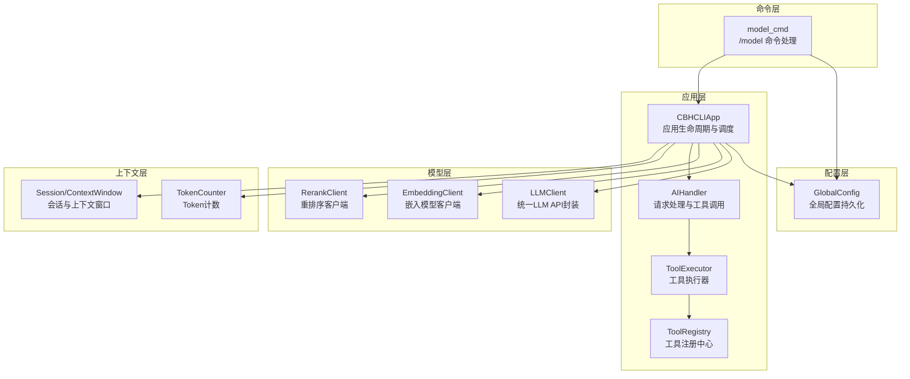
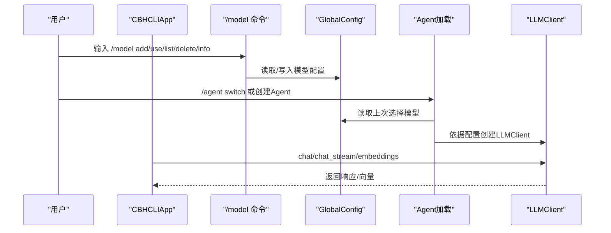
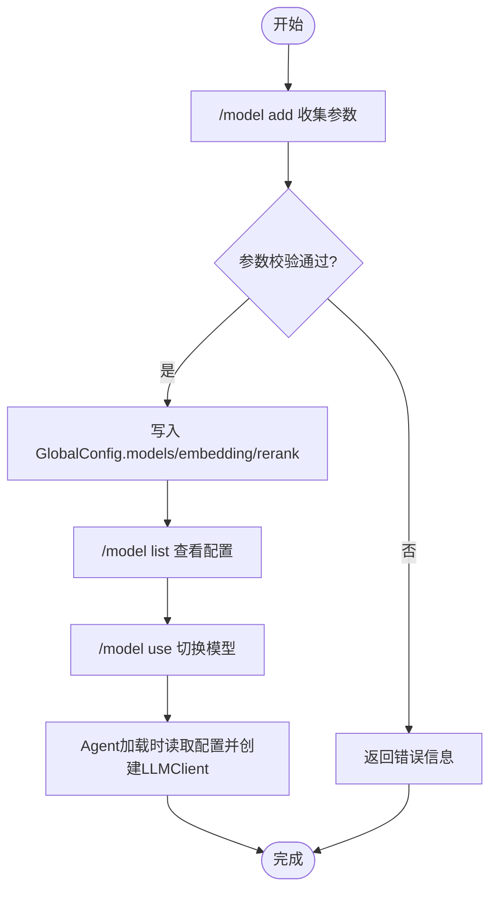
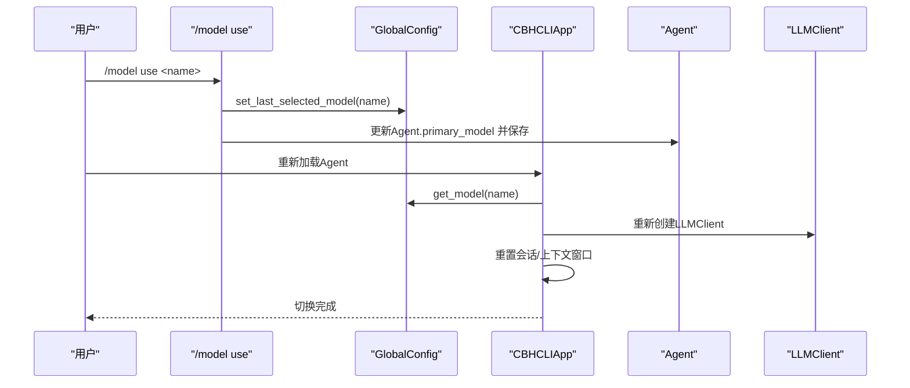
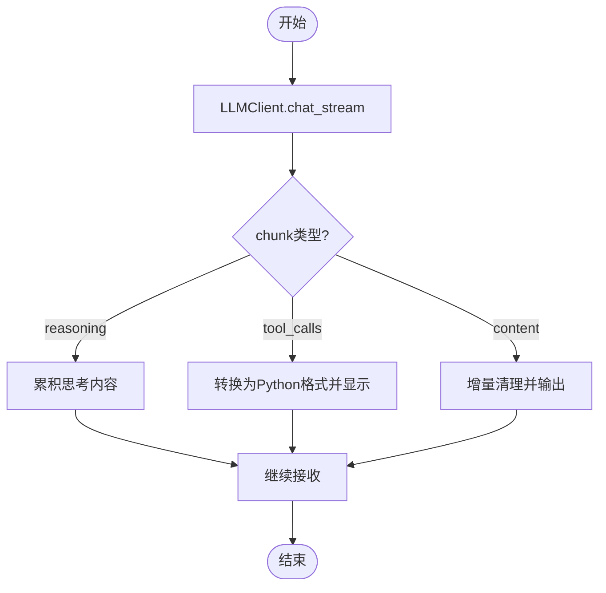
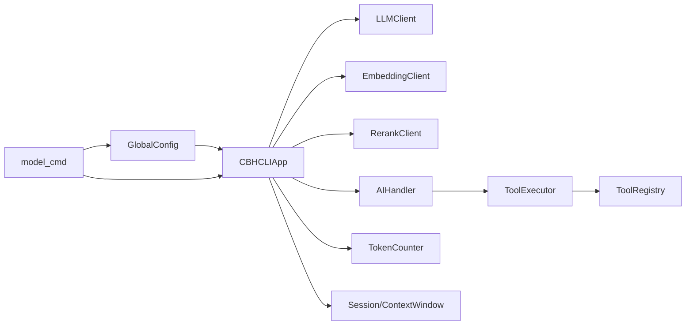

# 多模型支持与切换机制

<cite>
**本文引用的文件**
- [README.md](file://README.md)
- [cbhcli_pkg/core/model.py](file://cbhcli_pkg/core/model.py)
- [cbhcli_pkg/core/app.py](file://cbhcli_pkg/core/app.py)
- [cbhcli_pkg/config/global_config.py](file://cbhcli_pkg/config/global_config.py)
- [cbhcli_pkg/commands/model_cmd.py](file://cbhcli_pkg/commands/model_cmd.py)
- [cbhcli_pkg/core/ai_handler.py](file://cbhcli_pkg/core/ai_handler.py)
- [cbhcli_pkg/core/embedding_client.py](file://cbhcli_pkg/core/embedding_client.py)
- [cbhcli_pkg/core/rerank_client.py](file://cbhcli_pkg/core/rerank_client.py)
- [cbhcli_pkg/core/session.py](file://cbhcli_pkg/core/session.py)
- [cbhcli_pkg/core/tool_executor.py](file://cbhcli_pkg/core/tool_executor.py)
- [cbhcli_pkg/tools/registry.py](file://cbhcli_pkg/tools/registry.py)
- [cbhcli_pkg/context/token_counter.py](file://cbhcli_pkg/context/token_counter.py)
- [cbhcli_pkg/cli.py](file://cbhcli_pkg/cli.py)
- [cbhcli_pkg/core/errors.py](file://cbhcli_pkg/core/errors.py)
</cite>

## 目录
1. [简介](#简介)
2. [项目结构](#项目结构)
3. [核心组件](#核心组件)
4. [架构总览](#架构总览)
5. [详细组件分析](#详细组件分析)
6. [依赖分析](#依赖分析)
7. [性能考量](#性能考量)
8. [故障排查指南](#故障排查指南)
9. [结论](#结论)
10. [附录](#附录)

## 简介
本文件面向CBHCLI的多模型支持系统，围绕“模型注册、参数管理、API适配、模型切换、兼容性处理、性能监控与故障转移、最佳实践与安全”等方面，提供从基础配置到高级优化的完整技术文档。读者将了解如何添加/配置/切换模型，如何适配OpenAI标准、自定义API与本地模型，以及如何在多Agent场景下稳定地管理上下文与工具调用。

## 项目结构
CBHCLI采用模块化设计，核心围绕“应用层（App）—配置层（GlobalConfig）—模型层（LLMClient/Embedding/Rerank）—命令层（SlashCommand）—工具层（ToolExecutor/Registry）—上下文层（Token计数/上下文窗口）”展开。

图表来源
- [cbhcli_pkg/core/app.py:54-280](file://cbhcli_pkg/core/app.py#L54-L280)
- [cbhcli_pkg/config/global_config.py:13-154](file://cbhcli_pkg/config/global_config.py#L13-L154)
- [cbhcli_pkg/core/model.py:7-147](file://cbhcli_pkg/core/model.py#L7-L147)
- [cbhcli_pkg/core/embedding_client.py:6-132](file://cbhcli_pkg/core/embedding_client.py#L6-L132)
- [cbhcli_pkg/core/rerank_client.py:6-123](file://cbhcli_pkg/core/rerank_client.py#L6-L123)
- [cbhcli_pkg/core/ai_handler.py:21-743](file://cbhcli_pkg/core/ai_handler.py#L21-L743)
- [cbhcli_pkg/core/tool_executor.py:15-168](file://cbhcli_pkg/core/tool_executor.py#L15-L168)
- [cbhcli_pkg/tools/registry.py:51-115](file://cbhcli_pkg/tools/registry.py#L51-L115)
- [cbhcli_pkg/context/token_counter.py:14-88](file://cbhcli_pkg/context/token_counter.py#L14-L88)
- [cbhcli_pkg/core/session.py:37-190](file://cbhcli_pkg/core/session.py#L37-L190)
- [cbhcli_pkg/commands/model_cmd.py:5-371](file://cbhcli_pkg/commands/model_cmd.py#L5-L371)

章节来源
- [README.md:269-296](file://README.md#L269-L296)
- [cbhcli_pkg/core/app.py:54-280](file://cbhcli_pkg/core/app.py#L54-L280)

## 核心组件
- LLMClient：统一LLM API封装，支持非流式与流式聊天、嵌入接口，适配OpenAI风格的/chat/completions与/embeddings端点。
- GlobalConfig：全局配置持久化，管理模型列表、嵌入模型、重排序模型、Agent与设置。
- CBHCLIApp：应用主控制器，负责Agent加载、会话重置、上下文压缩、命令路由与AI请求委派。
- AIHandler：AI请求处理器，负责流式响应解析、工具调用提取与执行、多轮工具调用协调。
- EmbeddingClient：嵌入模型客户端，支持OpenAI兼容与自定义API，批量处理提升吞吐。
- RerankClient：重排序客户端，支持Jina/Cohere等API，增强知识库检索质量。
- ToolExecutor/ToolRegistry：工具执行与注册中心，统一工具调用、参数校验与结果输出。
- TokenCounter/Session/ContextWindow：Token计数、消息结构与上下文窗口，保障上下文不超限。
- model_cmd：/model命令实现，提供模型增删改查、嵌入/重排序模型配置与信息查看。

章节来源
- [cbhcli_pkg/core/model.py:7-147](file://cbhcli_pkg/core/model.py#L7-L147)
- [cbhcli_pkg/config/global_config.py:13-154](file://cbhcli_pkg/config/global_config.py#L13-L154)
- [cbhcli_pkg/core/app.py:54-280](file://cbhcli_pkg/core/app.py#L54-L280)
- [cbhcli_pkg/core/ai_handler.py:21-743](file://cbhcli_pkg/core/ai_handler.py#L21-L743)
- [cbhcli_pkg/core/embedding_client.py:6-132](file://cbhcli_pkg/core/embedding_client.py#L6-L132)
- [cbhcli_pkg/core/rerank_client.py:6-123](file://cbhcli_pkg/core/rerank_client.py#L6-L123)
- [cbhcli_pkg/core/tool_executor.py:15-168](file://cbhcli_pkg/core/tool_executor.py#L15-L168)
- [cbhcli_pkg/tools/registry.py:51-115](file://cbhcli_pkg/tools/registry.py#L51-L115)
- [cbhcli_pkg/context/token_counter.py:14-88](file://cbhcli_pkg/context/token_counter.py#L14-L88)
- [cbhcli_pkg/core/session.py:37-190](file://cbhcli_pkg/core/session.py#L37-L190)
- [cbhcli_pkg/commands/model_cmd.py:5-371](file://cbhcli_pkg/commands/model_cmd.py#L5-L371)

## 架构总览
多模型支持系统的关键在于“配置驱动 + 运行时动态加载”。配置层提供模型清单与嵌入/重排序配置；应用层在Agent加载时按配置创建LLMClient；AIHandler通过LLMClient发起请求；工具层在响应中提取工具调用并执行；上下文层保障Token不超限。

图表来源
- [cbhcli_pkg/commands/model_cmd.py:5-371](file://cbhcli_pkg/commands/model_cmd.py#L5-L371)
- [cbhcli_pkg/config/global_config.py:56-90](file://cbhcli_pkg/config/global_config.py#L56-L90)
- [cbhcli_pkg/core/app.py:231-280](file://cbhcli_pkg/core/app.py#L231-L280)
- [cbhcli_pkg/core/model.py:10-26](file://cbhcli_pkg/core/model.py#L10-L26)

## 详细组件分析

### 模型注册与参数管理
- 模型注册：通过/ model add收集模型名称、API Key、Base URL、模型ID、上下文限制，写入GlobalConfig.models。
- 嵌入模型：支持OpenAI兼容与自定义类型，配置项包含name、apiKey、url、model、type。
- 重排序模型：配置项包含name、apiKey、url、model、top_n。
- 参数持久化：所有变更通过GlobalConfig.save()落盘，保证重启后仍可恢复。

图表来源
- [cbhcli_pkg/commands/model_cmd.py:64-156](file://cbhcli_pkg/commands/model_cmd.py#L64-L156)
- [cbhcli_pkg/config/global_config.py:56-154](file://cbhcli_pkg/config/global_config.py#L56-L154)

章节来源
- [cbhcli_pkg/commands/model_cmd.py:64-156](file://cbhcli_pkg/commands/model_cmd.py#L64-L156)
- [cbhcli_pkg/config/global_config.py:56-154](file://cbhcli_pkg/config/global_config.py#L56-L154)

### 模型切换机制
- 切换流程：/model use更新当前Agent的primary_model并保存；随后_load_agent触发重新初始化LLMClient与上下文压缩器。
- 资源释放与重新初始化：_load_agent在创建新LLMClient前清空会话历史保存、重置Python会话、重建Session与ContextWindow。
- 最后选择模型：若Agent未显式配置primary_model，则回退到GlobalConfig.last_selected_model。

图表来源
- [cbhcli_pkg/commands/model_cmd.py:130-149](file://cbhcli_pkg/commands/model_cmd.py#L130-L149)
- [cbhcli_pkg/core/app.py:231-280](file://cbhcli_pkg/core/app.py#L231-L280)
- [cbhcli_pkg/config/global_config.py:83-90](file://cbhcli_pkg/config/global_config.py#L83-L90)

章节来源
- [cbhcli_pkg/commands/model_cmd.py:130-149](file://cbhcli_pkg/commands/model_cmd.py#L130-L149)
- [cbhcli_pkg/core/app.py:231-280](file://cbhcli_pkg/core/app.py#L231-L280)
- [cbhcli_pkg/config/global_config.py:83-90](file://cbhcli_pkg/config/global_config.py#L83-L90)

### API适配与兼容性处理
- OpenAI API标准：LLMClient与EmbeddingClient均采用OpenAI风格的/chat/completions与/embeddings端点；RerankClient支持Jina与Cohere风格。
- 自定义API：EmbeddingClient允许type="custom"，默认走OpenAI兼容格式；RerankClient通过模型名关键词区分API类型。
- 本地模型支持：通过配置Base URL指向本地推理服务（如Ollama、LocalAI等），保持相同端点即可无缝适配。

章节来源
- [cbhcli_pkg/core/model.py:28-147](file://cbhcli_pkg/core/model.py#L28-L147)
- [cbhcli_pkg/core/embedding_client.py:15-132](file://cbhcli_pkg/core/embedding_client.py#L15-L132)
- [cbhcli_pkg/core/rerank_client.py:16-123](file://cbhcli_pkg/core/rerank_client.py#L16-L123)

### AI请求处理与工具调用
- 流式响应解析：LLMClient.chat_stream按SSE逐行解析，识别reasoning/content/tool_calls三类片段。
- 工具调用提取：AIHandler支持DSML标签、Python函数调用、JSON格式与纯文本命令等多种格式，并进行严格验证与去重。
- 多轮工具调用：通过系统提示强化格式，避免AI输出示例代码块而非真实调用。

图表来源
- [cbhcli_pkg/core/model.py:59-120](file://cbhcli_pkg/core/model.py#L59-L120)
- [cbhcli_pkg/core/ai_handler.py:98-216](file://cbhcli_pkg/core/ai_handler.py#L98-L216)

章节来源
- [cbhcli_pkg/core/model.py:59-120](file://cbhcli_pkg/core/model.py#L59-L120)
- [cbhcli_pkg/core/ai_handler.py:264-576](file://cbhcli_pkg/core/ai_handler.py#L264-L576)

### 嵌入与重排序服务
- 嵌入模型：支持OpenAI兼容与自定义类型，批量处理提升吞吐；默认使用OpenAI风格的encoding_format=float。
- 重排序模型：根据模型名关键词自动选择Jina或Cohere格式，统一返回{index, document, score}结构。

章节来源
- [cbhcli_pkg/core/embedding_client.py:34-132](file://cbhcli_pkg/core/embedding_client.py#L34-L132)
- [cbhcli_pkg/core/rerank_client.py:35-123](file://cbhcli_pkg/core/rerank_client.py#L35-L123)

### 上下文管理与Token计数
- Token计数：优先使用tiktoken精确计数，降级为估算算法；支持消息级别统计。
- 上下文窗口：基于模型上下文限制与压缩比例动态判断是否需要压缩；提供状态文本与剩余Token提示。

章节来源
- [cbhcli_pkg/context/token_counter.py:14-88](file://cbhcli_pkg/context/token_counter.py#L14-L88)
- [cbhcli_pkg/core/session.py:127-190](file://cbhcli_pkg/core/session.py#L127-L190)
- [cbhcli_pkg/core/app.py:361-385](file://cbhcli_pkg/core/app.py#L361-L385)

### 命令与交互
- CLI入口：提供/help命令与斜杠命令参考；/model系列命令用于模型管理。
- 工具交互：ToolExecutor支持确认模式、详细/简洁输出、回调钩子。

章节来源
- [cbhcli_pkg/cli.py:73-112](file://cbhcli_pkg/cli.py#L73-L112)
- [cbhcli_pkg/core/tool_executor.py:54-168](file://cbhcli_pkg/core/tool_executor.py#L54-L168)

## 依赖分析
- 组件耦合：App依赖GlobalConfig与LLMClient；AIHandler依赖LLMClient与ToolExecutor；ToolExecutor依赖ToolRegistry。
- 外部依赖：requests用于HTTP调用；tiktoken用于精确Token计数（可选）。
- 潜在风险：模型切换涉及会话重置与上下文压缩，需确保Agent工作空间与向量索引状态一致。

图表来源
- [cbhcli_pkg/core/app.py:12-52](file://cbhcli_pkg/core/app.py#L12-L52)
- [cbhcli_pkg/commands/model_cmd.py:5-61](file://cbhcli_pkg/commands/model_cmd.py#L5-L61)

章节来源
- [cbhcli_pkg/core/app.py:12-52](file://cbhcli_pkg/core/app.py#L12-L52)
- [cbhcli_pkg/commands/model_cmd.py:5-61](file://cbhcli_pkg/commands/model_cmd.py#L5-L61)

## 性能考量
- 批量嵌入：EmbeddingClient默认每批10条，减少API调用次数与网络开销。
- 流式响应：LLMClient支持SSE流式传输，降低首字延迟并提升交互体验。
- 上下文压缩：当接近模型限制时自动压缩，避免频繁超限导致的失败。
- Token计数：优先使用tiktoken，提升上下文估算精度，减少无效请求。

章节来源
- [cbhcli_pkg/core/embedding_client.py:49-113](file://cbhcli_pkg/core/embedding_client.py#L49-L113)
- [cbhcli_pkg/core/model.py:59-120](file://cbhcli_pkg/core/model.py#L59-L120)
- [cbhcli_pkg/core/app.py:361-385](file://cbhcli_pkg/core/app.py#L361-L385)
- [cbhcli_pkg/context/token_counter.py:27-48](file://cbhcli_pkg/context/token_counter.py#L27-L48)

## 故障排查指南
- 模型未配置：当Agent未配置模型时，应用会提示使用/model命令配置。
- API请求失败：检查API Key、Base URL与模型ID；关注状态码与错误文本。
- 工具调用未识别：确认AI输出格式符合支持的DSML、Python函数调用或JSON格式。
- 上下文超限：启用自动压缩或手动压缩；检查上下文使用百分比与剩余Token。
- 嵌入/重排序初始化失败：检查配置字段与网络连通性。

章节来源
- [cbhcli_pkg/core/app.py:412-414](file://cbhcli_pkg/core/app.py#L412-L414)
- [cbhcli_pkg/core/model.py:53-54](file://cbhcli_pkg/core/model.py#L53-L54)
- [cbhcli_pkg/core/embedding_client.py:86-87](file://cbhcli_pkg/core/embedding_client.py#L86-L87)
- [cbhcli_pkg/core/rerank_client.py:76-77](file://cbhcli_pkg/core/rerank_client.py#L76-L77)
- [cbhcli_pkg/core/ai_handler.py:200-214](file://cbhcli_pkg/core/ai_handler.py#L200-L214)
- [cbhcli_pkg/core/errors.py:9-31](file://cbhcli_pkg/core/errors.py#L9-L31)

## 结论
CBHCLI的多模型支持系统以配置为中心，结合运行时动态加载与工具链集成，实现了OpenAI标准、自定义API与本地模型的统一适配。通过完善的模型切换、上下文管理与工具调用机制，系统在易用性与扩展性之间取得平衡。建议在生产环境中配合批量嵌入、流式响应与上下文压缩策略，以获得更佳的性能与稳定性。

## 附录

### 模型配置最佳实践
- 为每个Agent单独配置primary_model，避免跨Agent误用。
- 嵌入模型与重排序模型建议与主模型同源，减少跨域API差异带来的问题。
- 启用自动压缩并合理设置压缩比例，避免频繁超限。
- 使用/tiktoken精确计数，提升上下文估算准确性。

章节来源
- [README.md:150-206](file://README.md#L150-L206)
- [cbhcli_pkg/context/token_counter.py:27-48](file://cbhcli_pkg/context/token_counter.py#L27-L48)
- [cbhcli_pkg/core/app.py:361-385](file://cbhcli_pkg/core/app.py#L361-L385)

### 安全与认证
- API Key管理：通过/ model add安全录入，避免硬编码；定期轮换Key。
- Base URL白名单：尽量使用官方或可信域名，避免中间人攻击。
- 工具执行确认：利用ToolExecutor的确认模式，减少误执行风险。

章节来源
- [cbhcli_pkg/commands/model_cmd.py:75-104](file://cbhcli_pkg/commands/model_cmd.py#L75-L104)
- [cbhcli_pkg/core/tool_executor.py:122-140](file://cbhcli_pkg/core/tool_executor.py#L122-L140)

### 代码示例路径
- 添加模型：[cbhcli_pkg/commands/model_cmd.py:64-104](file://cbhcli_pkg/commands/model_cmd.py#L64-L104)
- 切换模型：[cbhcli_pkg/commands/model_cmd.py:130-149](file://cbhcli_pkg/commands/model_cmd.py#L130-L149)，[cbhcli_pkg/core/app.py:231-280](file://cbhcli_pkg/core/app.py#L231-L280)
- 配置嵌入模型：[cbhcli_pkg/commands/model_cmd.py:207-237](file://cbhcli_pkg/commands/model_cmd.py#L207-L237)
- 配置重排序模型：[cbhcli_pkg/commands/model_cmd.py:304-335](file://cbhcli_pkg/commands/model_cmd.py#L304-L335)
- 流式聊天与工具调用：[cbhcli_pkg/core/model.py:59-120](file://cbhcli_pkg/core/model.py#L59-L120)，[cbhcli_pkg/core/ai_handler.py:264-576](file://cbhcli_pkg/core/ai_handler.py#L264-L576)