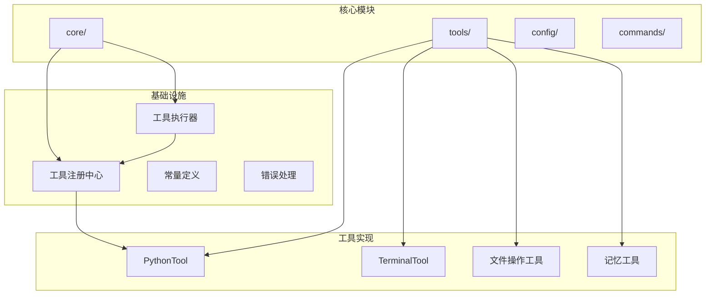
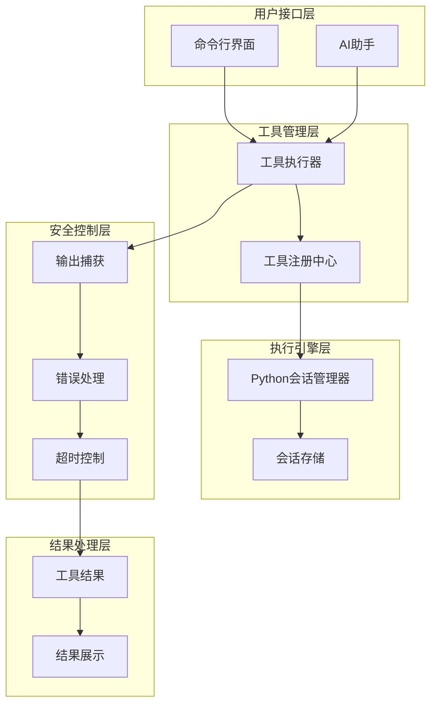
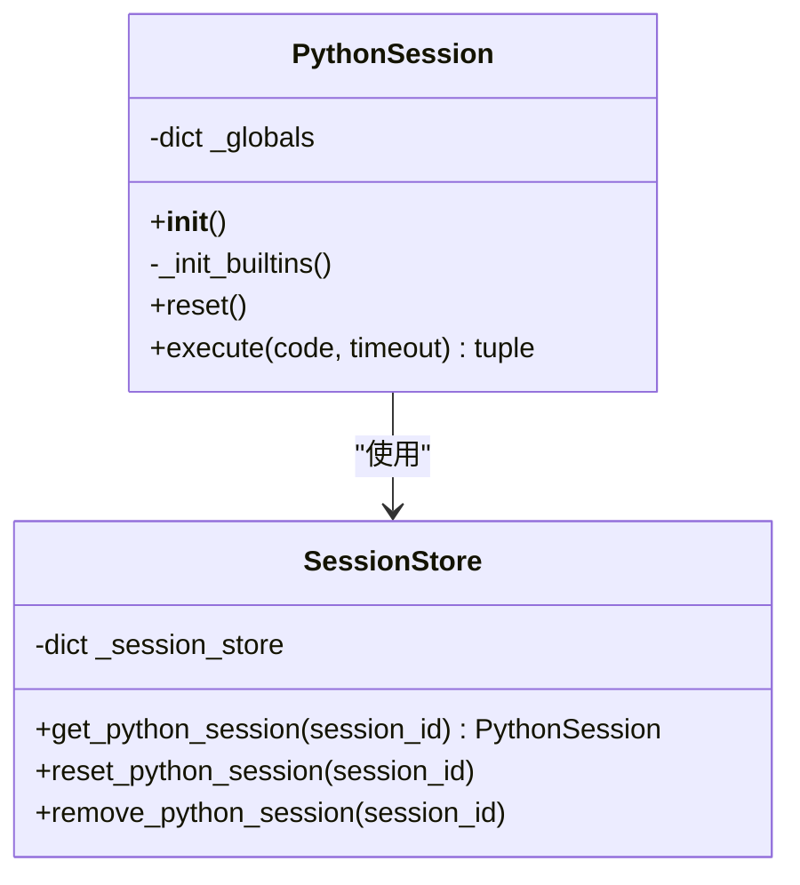
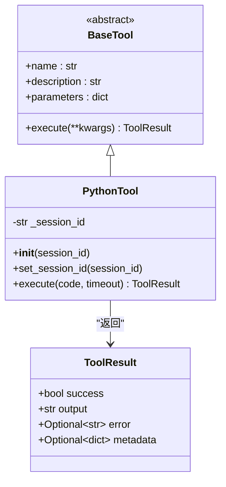
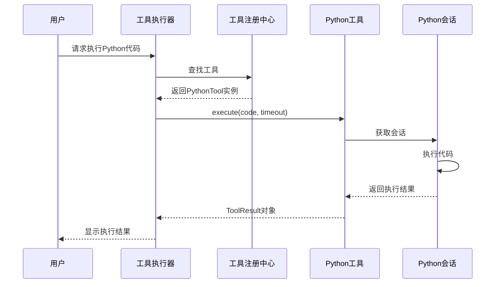
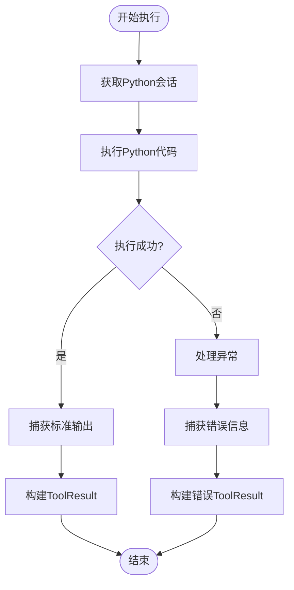
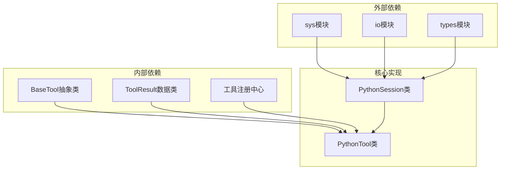

# Python代码执行工具

<cite>
**本文档引用的文件**
- [python_tool.py](file://cbhcli_pkg/tools/python_tool.py)
- [registry.py](file://cbhcli_pkg/tools/registry.py)
- [base.py](file://cbhcli_pkg/tools/base.py)
- [tool_executor.py](file://cbhcli_pkg/core/tool_executor.py)
- [constants.py](file://cbhcli_pkg/core/constants.py)
- [errors.py](file://cbhcli_pkg/core/errors.py)
- [README.md](file://README.md)
- [requirements.txt](file://requirements.txt)
- [test_v3.py](file://test_v3.py)
</cite>

## 目录
1. [简介](#简介)
2. [项目结构](#项目结构)
3. [核心组件](#核心组件)
4. [架构概览](#架构概览)
5. [详细组件分析](#详细组件分析)
6. [依赖关系分析](#依赖关系分析)
7. [性能考量](#性能考量)
8. [故障排除指南](#故障排除指南)
9. [结论](#结论)
10. [附录](#附录)

## 简介
Python代码执行工具是CBHCLI项目中的一个核心功能模块，为AI驱动的终端助手提供了安全可控的Python代码执行能力。该工具支持会话记忆、参数配置、执行流程管理和结果处理，同时具备基本的安全边界控制。

CBHCLI是一个功能强大的AI驱动终端助手，支持多Agent管理、工具调用、知识库和会话管理。Python工具作为其中的一个重要组成部分，为用户提供了灵活的编程能力。

## 项目结构
CBHCLI项目采用模块化的架构设计，主要分为以下几个核心模块：

**图表来源**
- [python_tool.py:1-207](file://cbhcli_pkg/tools/python_tool.py#L1-L207)
- [registry.py:1-115](file://cbhcli_pkg/tools/registry.py#L1-L115)
- [tool_executor.py:1-168](file://cbhcli_pkg/core/tool_executor.py#L1-L168)

**章节来源**
- [README.md:269-295](file://README.md#L269-L295)
- [requirements.txt:1-7](file://requirements.txt#L1-L7)

## 核心组件
Python代码执行工具由多个核心组件构成，每个组件都有明确的职责和功能：

### PythonSession类
PythonSession类是整个工具的核心执行引擎，负责维护Python解释器的状态和会话记忆。它通过全局变量字典来保持变量状态，支持数学、JSON、操作系统、系统、正则表达式和日期时间等常用模块的导入。

### PythonTool类
PythonTool类继承自BaseTool抽象基类，实现了具体的Python代码执行逻辑。它提供了工具的基本属性（名称、描述、参数定义）和执行方法，支持会话ID的设置和管理。

### 工具注册中心
工具注册中心负责统一管理所有可用的工具，提供注册、注销、查找和执行功能。它确保了工具调用的一致性和安全性。

**章节来源**
- [python_tool.py:8-102](file://cbhcli_pkg/tools/python_tool.py#L8-L102)
- [python_tool.py:127-207](file://cbhcli_pkg/tools/python_tool.py#L127-L207)
- [registry.py:51-115](file://cbhcli_pkg/tools/registry.py#L51-L115)

## 架构概览
Python代码执行工具的整体架构采用了分层设计，确保了功能的模块化和可扩展性：

**图表来源**
- [tool_executor.py:15-92](file://cbhcli_pkg/core/tool_executor.py#L15-L92)
- [python_tool.py:104-125](file://cbhcli_pkg/tools/python_tool.py#L104-L125)
- [registry.py:70-96](file://cbhcli_pkg/tools/registry.py#L70-L96)

## 详细组件分析

### PythonSession会话管理器
PythonSession类是工具执行的核心，负责维护Python解释器的状态和变量记忆：

**图表来源**
- [python_tool.py:8-125](file://cbhcli_pkg/tools/python_tool.py#L8-L125)

#### 会话初始化过程
会话初始化时会自动导入常用的标准库模块，包括数学运算、JSON处理、操作系统交互、系统信息访问、正则表达式和日期时间处理等功能。这种设计确保了用户可以在执行代码时直接使用这些基础功能。

#### 输出捕获机制
工具通过重定向标准输出和标准错误流来捕获代码执行的结果。这种方法能够完整地捕获print语句、异常信息和其他输出内容，为用户提供完整的执行反馈。

**章节来源**
- [python_tool.py:11-59](file://cbhcli_pkg/tools/python_tool.py#L11-L59)
- [python_tool.py:71-101](file://cbhcli_pkg/tools/python_tool.py#L71-L101)

### PythonTool工具实现
PythonTool类实现了BaseTool接口，提供了完整的工具功能：

**图表来源**
- [registry.py:16-48](file://cbhcli_pkg/tools/registry.py#L16-L48)
- [python_tool.py:127-207](file://cbhcli_pkg/tools/python_tool.py#L127-L207)

#### 参数配置系统
PythonTool使用JSON Schema定义了参数规范，目前只支持code参数，这是要执行的Python代码字符串。这种设计简单明了，易于理解和使用。

#### 执行流程控制
工具执行流程包括会话获取、代码执行、结果构建和异常处理等步骤。每个步骤都有明确的职责分工，确保了执行的可靠性和安全性。

**章节来源**
- [python_tool.py:153-164](file://cbhcli_pkg/tools/python_tool.py#L153-L164)
- [python_tool.py:170-206](file://cbhcli_pkg/tools/python_tool.py#L170-L206)

### 工具执行器集成
工具执行器负责协调工具的调用和结果显示：

**图表来源**
- [tool_executor.py:42-91](file://cbhcli_pkg/core/tool_executor.py#L42-L91)
- [registry.py:70-96](file://cbhcli_pkg/tools/registry.py#L70-L96)

**章节来源**
- [tool_executor.py:15-92](file://cbhcli_pkg/core/tool_executor.py#L15-L92)
- [registry.py:51-96](file://cbhcli_pkg/tools/registry.py#L51-L96)

### 错误处理和异常管理
工具具备完善的错误处理机制，能够妥善处理各种异常情况：

**图表来源**
- [python_tool.py:60-101](file://cbhcli_pkg/tools/python_tool.py#L60-L101)
- [python_tool.py:181-206](file://cbhcli_pkg/tools/python_tool.py#L181-L206)

**章节来源**
- [python_tool.py:93-96](file://cbhcli_pkg/tools/python_tool.py#L93-L96)
- [python_tool.py:201-206](file://cbhcli_pkg/tools/python_tool.py#L201-L206)

## 依赖关系分析
Python代码执行工具的依赖关系相对简单，主要依赖于标准库和核心框架组件：

**图表来源**
- [python_tool.py:2-5](file://cbhcli_pkg/tools/python_tool.py#L2-L5)
- [registry.py:2-4](file://cbhcli_pkg/tools/registry.py#L2-L4)

### 核心依赖说明
- **sys模块**: 用于标准输出和标准错误流的重定向
- **io模块**: 用于捕获输出流的内容
- **types模块**: 用于模块类型检查
- **BaseTool**: 工具抽象基类，定义了工具的标准接口
- **ToolResult**: 工具执行结果的数据结构

**章节来源**
- [python_tool.py:1-6](file://cbhcli_pkg/tools/python_tool.py#L1-L6)
- [registry.py:1-5](file://cbhcli_pkg/tools/registry.py#L1-L5)

## 性能考量
Python代码执行工具在设计时充分考虑了性能因素：

### 内存管理
- 使用StringIO进行输出捕获，避免了文件I/O开销
- 会话状态通过字典存储，内存占用相对较小
- 支持会话重置，及时释放内存资源

### 执行效率
- 代码编译使用compile函数，提高执行效率
- 直接使用exec执行编译后的代码，减少解析开销
- 支持会话记忆，避免重复导入模块的开销

### 输出处理
- 工具有最大输出长度限制（8000字符），防止内存溢出
- 支持输出预览模式，提高用户体验
- 错误信息和正常输出分别处理，确保信息完整性

**章节来源**
- [constants.py:14-16](file://cbhcli_pkg/core/constants.py#L14-L16)
- [constants.py:10-16](file://cbhcli_pkg/core/constants.py#L10-L16)

## 故障排除指南
针对Python代码执行工具可能出现的问题，提供以下故障排除建议：

### 常见问题及解决方案

#### 会话相关问题
- **问题**: 会话变量无法持久化
  - **原因**: 会话ID配置错误或会话被意外重置
  - **解决**: 检查会话ID设置，确认使用正确的会话标识符

#### 代码执行问题
- **问题**: 代码执行超时
  - **原因**: 当前实现暂未实现超时控制功能
  - **解决**: 优化代码逻辑，避免长时间运行的操作

#### 输出捕获问题
- **问题**: 输出内容缺失
  - **原因**: 代码使用了非标准输出方式
  - **解决**: 确保使用print函数或其他标准输出方式

#### 内存泄漏问题
- **问题**: 内存使用持续增长
  - **原因**: 会话变量过多或循环引用
  - **解决**: 定期重置会话，清理不需要的变量

**章节来源**
- [python_tool.py:66](file://cbhcli_pkg/tools/python_tool.py#L66)
- [python_tool.py:55-58](file://cbhcli_pkg/tools/python_tool.py#L55-L58)

## 结论
Python代码执行工具为CBHCLI项目提供了强大而灵活的编程能力。通过会话记忆机制、安全的执行环境和完善的错误处理，该工具能够在保证安全性的前提下，为用户提供高效的Python代码执行体验。

工具的设计体现了模块化、可扩展和易用性的原则，为后续的功能增强和性能优化奠定了良好的基础。虽然当前版本在某些方面还有改进空间，但整体架构已经能够满足大多数使用场景的需求。

## 附录

### 使用示例
基于项目文档，Python工具的主要使用场景包括：

#### 数据分析任务
- 使用pandas进行数据处理和分析
- 使用matplotlib进行数据可视化
- 执行统计计算和数据挖掘任务

#### 系统脚本执行
- 文件系统操作和管理
- 系统信息查询和监控
- 自动化任务执行

#### 代码生成和转换
- 文本处理和格式转换
- 配置文件生成
- 批量数据处理

### 安全最佳实践
- 始终验证和清理用户输入的代码
- 限制代码执行的时间和资源使用
- 定期清理会话状态，防止内存泄漏
- 使用沙箱环境隔离危险操作

### 性能优化建议
- 合理使用会话记忆，避免不必要的变量存储
- 优化代码逻辑，减少执行时间和内存占用
- 使用适当的输出截断策略
- 定期监控和清理会话存储

**章节来源**
- [README.md:141-148](file://README.md#L141-L148)