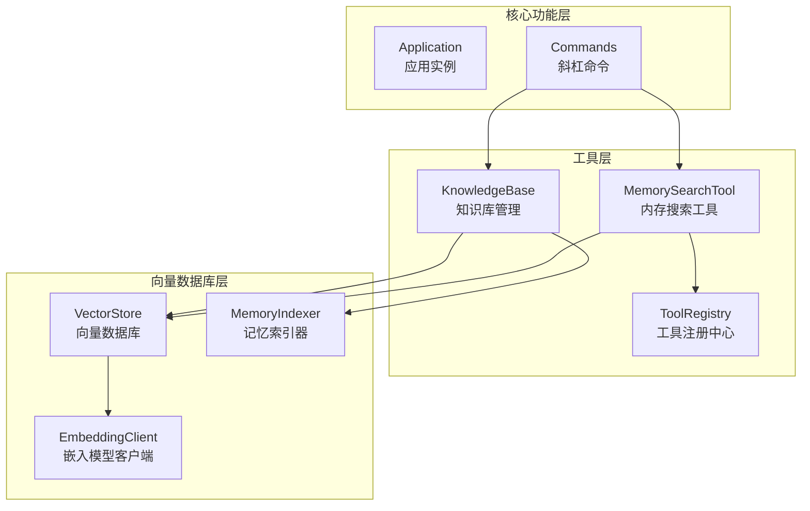
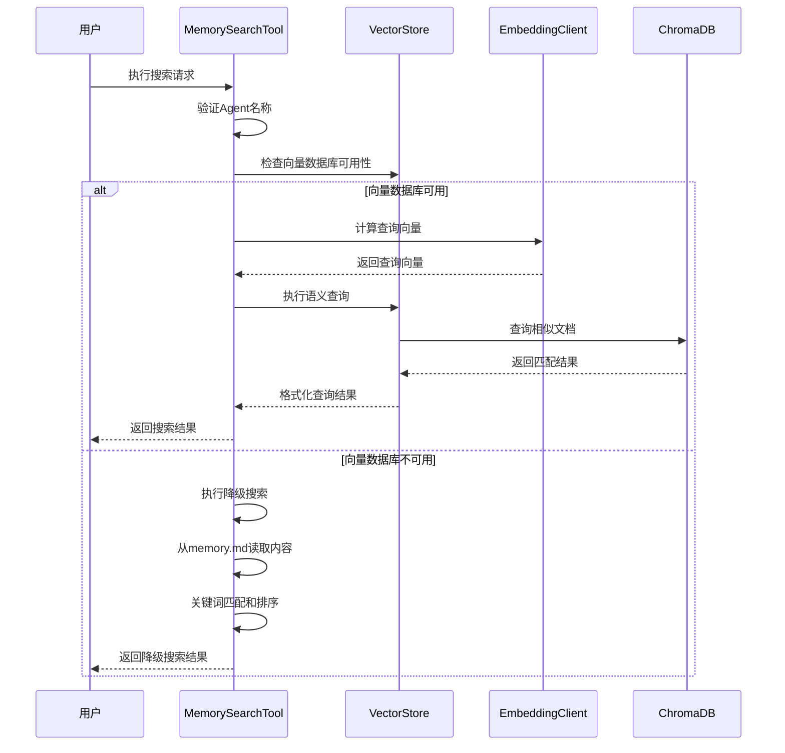
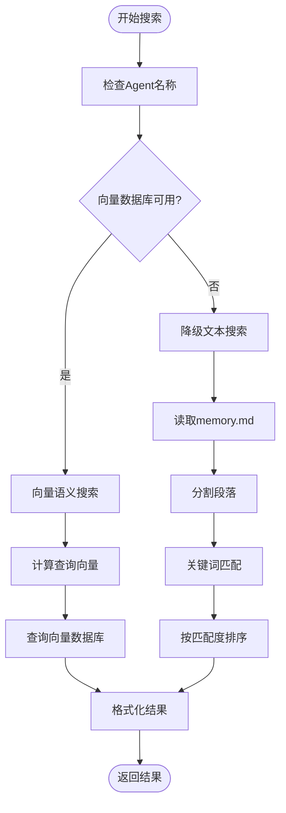
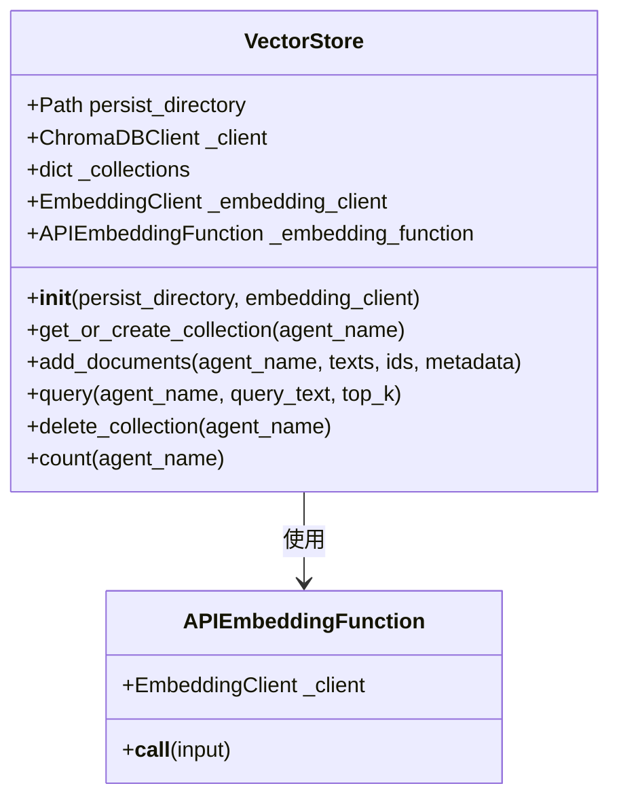
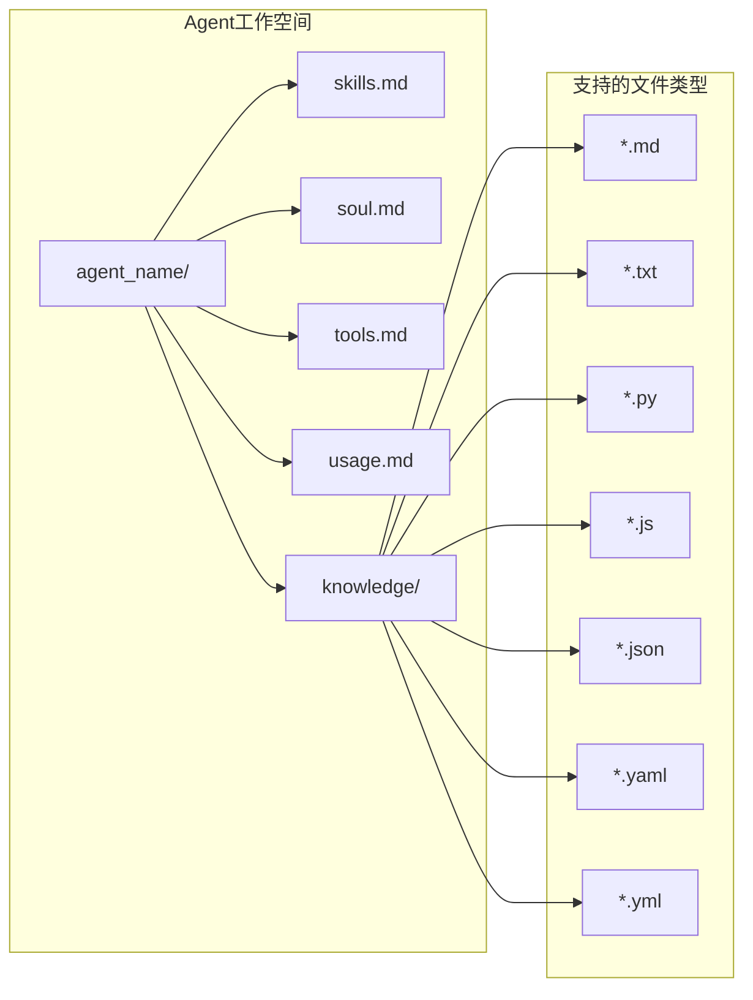
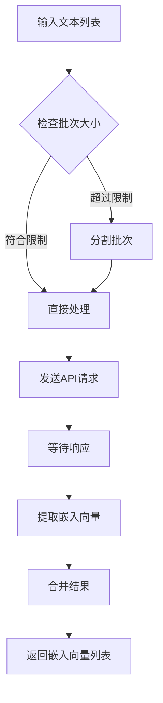
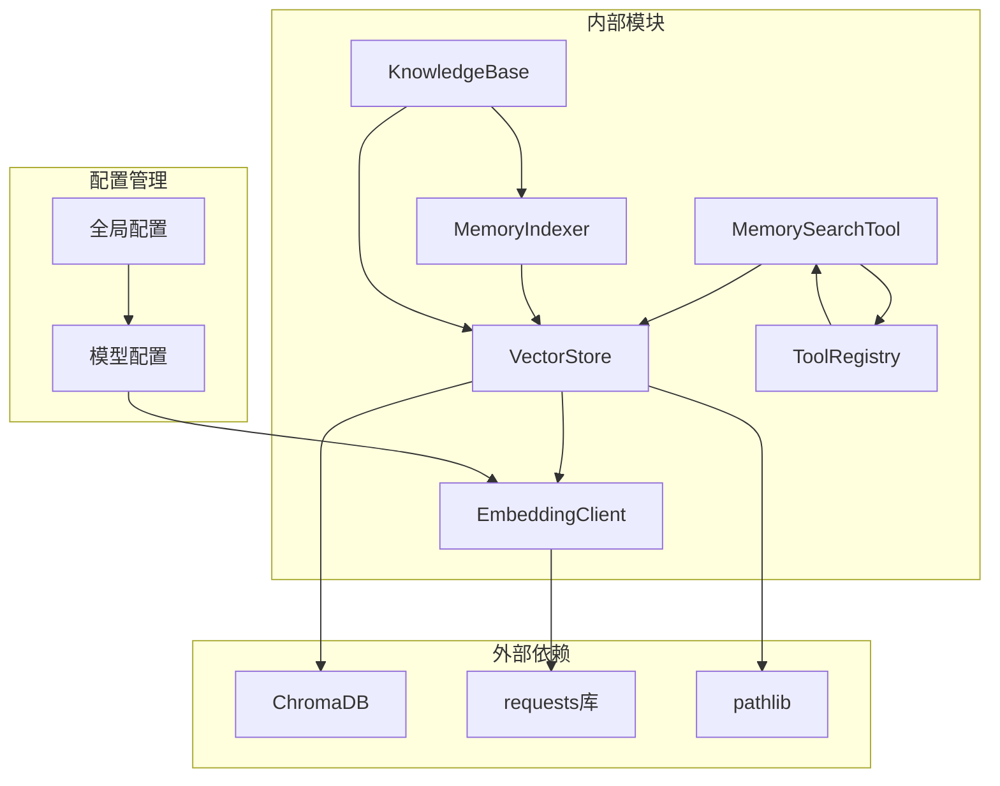
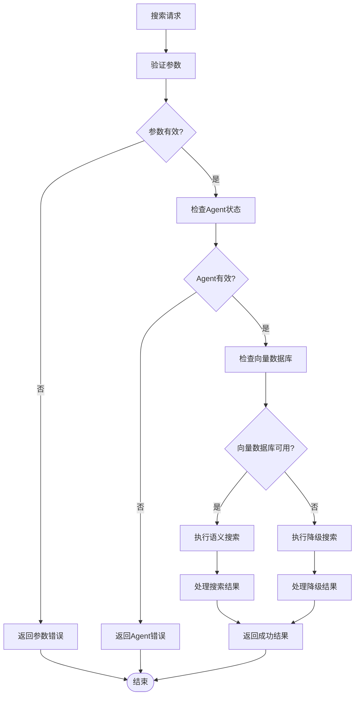

# 内存搜索工具

<cite>
**本文档引用的文件**
- [memory_search.py](file://cbhcli_pkg/tools/memory_search.py)
- [base.py](file://cbhcli_pkg/tools/base.py)
- [registry.py](file://cbhcli_pkg/tools/registry.py)
- [store.py](file://cbhcli_pkg/vector/store.py)
- [indexer.py](file://cbhcli_pkg/vector/indexer.py)
- [embedding_client.py](file://cbhcli_pkg/core/embedding_client.py)
- [knowledge_base.py](file://cbhcli_pkg/core/knowledge_base.py)
- [kb_cmd.py](file://cbhcli_pkg/commands/kb_cmd.py)
- [README.md](file://README.md)
</cite>

## 目录
1. [简介](#简介)
2. [项目结构](#项目结构)
3. [核心组件](#核心组件)
4. [架构概览](#架构概览)
5. [详细组件分析](#详细组件分析)
6. [依赖关系分析](#依赖关系分析)
7. [性能考虑](#性能考虑)
8. [故障排除指南](#故障排除指南)
9. [结论](#结论)
10. [附录](#附录)

## 简介

内存搜索工具（MemorySearchTool）是CBHCLI项目中的核心搜索组件，专门用于语义搜索Agent的向量化知识内容。该工具提供了智能的搜索算法、灵活的匹配策略和高效的性能优化机制，能够帮助用户快速定位和检索重要的知识内容。

该工具的主要特点包括：
- **语义搜索能力**：基于向量数据库的深度语义匹配
- **双模式搜索**：支持向量搜索和降级文本搜索
- **智能排序**：基于相似度的距离排序
- **灵活配置**：支持多种参数配置和搜索范围控制
- **错误处理**：完善的异常处理和降级机制

## 项目结构

CBHCLI项目采用模块化的架构设计，内存搜索工具位于工具模块中，与向量数据库、索引器和其他核心组件紧密集成。



**图表来源**
- [memory_search.py:1-177](file://cbhcli_pkg/tools/memory_search.py#L1-L177)
- [store.py:1-175](file://cbhcli_pkg/vector/store.py#L1-L175)
- [indexer.py:1-178](file://cbhcli_pkg/vector/indexer.py#L1-L178)
- [registry.py:1-115](file://cbhcli_pkg/tools/registry.py#L1-L115)

**章节来源**
- [README.md:269-295](file://README.md#L269-L295)
- [memory_search.py:1-177](file://cbhcli_pkg/tools/memory_search.py#L1-L177)

## 核心组件

内存搜索工具由多个核心组件构成，每个组件都有特定的职责和功能：

### MemorySearchTool 类
这是内存搜索的核心实现类，负责处理搜索请求、执行语义搜索和格式化结果输出。

### VectorStore 类
封装了ChromaDB向量数据库，提供文档添加、查询和管理功能。

### MemoryIndexer 类
负责将Agent工作空间中的文档索引到向量数据库中。

### EmbeddingClient 类
提供嵌入向量计算功能，支持多种嵌入模型API。

### ToolRegistry 类
统一管理所有工具的注册、执行和描述信息。

**章节来源**
- [memory_search.py:6-103](file://cbhcli_pkg/tools/memory_search.py#L6-L103)
- [store.py:37-175](file://cbhcli_pkg/vector/store.py#L37-L175)
- [indexer.py:7-178](file://cbhcli_pkg/vector/indexer.py#L7-L178)
- [embedding_client.py:6-132](file://cbhcli_pkg/core/embedding_client.py#L6-L132)
- [registry.py:16-115](file://cbhcli_pkg/tools/registry.py#L16-L115)

## 架构概览

内存搜索工具采用分层架构设计，从上到下分为工具接口层、向量数据库层和嵌入模型层。



**图表来源**
- [memory_search.py:47-103](file://cbhcli_pkg/tools/memory_search.py#L47-L103)
- [store.py:128-160](file://cbhcli_pkg/vector/store.py#L128-L160)
- [embedding_client.py:34-132](file://cbhcli_pkg/core/embedding_client.py#L34-L132)

## 详细组件分析

### MemorySearchTool 实现分析

MemorySearchTool是内存搜索工具的核心实现，具有以下关键特性：

#### 搜索算法实现

工具实现了两种搜索模式：

1. **向量语义搜索**：使用嵌入模型计算查询向量，通过向量相似度进行匹配
2. **降级文本搜索**：当向量数据库不可用时，从memory.md文件进行关键词匹配

#### 匹配策略

搜索工具采用了多层次的匹配策略：



**图表来源**
- [memory_search.py:47-177](file://cbhcli_pkg/tools/memory_search.py#L47-L177)

#### 结果排序机制

工具提供了两种排序机制：

1. **向量相似度排序**：基于余弦相似度的距离值进行排序
2. **关键词匹配排序**：基于关键词匹配数量进行排序

#### 参数配置

MemorySearchTool支持以下参数配置：

| 参数名 | 类型 | 描述 | 默认值 |
|--------|------|------|--------|
| query | string | 搜索查询文本 | 必需 |
| top_k | integer | 返回结果数量 | 5 |
| agent_name | string | Agent名称 | 空字符串 |

**章节来源**
- [memory_search.py:31-45](file://cbhcli_pkg/tools/memory_search.py#L31-L45)
- [memory_search.py:47-103](file://cbhcli_pkg/tools/memory_search.py#L47-L103)

### VectorStore 向量数据库分析

VectorStore类封装了ChromaDB向量数据库，提供了完整的向量存储和查询功能。

#### 数据结构设计

向量数据库使用以下数据结构：



**图表来源**
- [store.py:37-175](file://cbhcli_pkg/vector/store.py#L37-L175)

#### 性能优化特性

VectorStore实现了多项性能优化：

1. **预计算嵌入向量**：在添加文档时预先计算嵌入向量，避免重复计算
2. **批量处理**：支持批量添加文档，提高处理效率
3. **集合缓存**：缓存已创建的集合，避免重复创建

**章节来源**
- [store.py:99-127](file://cbhcli_pkg/vector/store.py#L99-L127)
- [store.py:128-160](file://cbhcli_pkg/vector/store.py#L128-L160)

### MemoryIndexer 索引器分析

MemoryIndexer负责将Agent工作空间中的文档索引到向量数据库中。

#### 索引范围

索引器支持以下文件类型的索引：



**图表来源**
- [indexer.py:19-26](file://cbhcli_pkg/vector/indexer.py#L19-L26)
- [indexer.py:62-67](file://cbhcli_pkg/vector/indexer.py#L62-L67)

#### 索引策略

索引器采用了以下策略：

1. **段落分割**：将文档按段落进行分割，每个段落作为一个独立的向量
2. **元数据管理**：为每个段落添加详细的元数据信息
3. **ID生成**：为每个段落生成唯一的ID标识符

**章节来源**
- [indexer.py:87-134](file://cbhcli_pkg/vector/indexer.py#L87-L134)

### EmbeddingClient 嵌入模型分析

EmbeddingClient提供了灵活的嵌入向量计算功能，支持多种嵌入模型API。

#### 支持的模型类型

| 模型类型 | 描述 | 示例 |
|----------|------|------|
| openai | OpenAI兼容API | text-embedding-3-small |
| custom | 自定义API格式 | 通义千问embedding |

#### 批处理优化

嵌入模型客户端实现了智能的批处理机制：



**图表来源**
- [embedding_client.py:49-70](file://cbhcli_pkg/core/embedding_client.py#L49-L70)
- [embedding_client.py:92-113](file://cbhcli_pkg/core/embedding_client.py#L92-L113)

**章节来源**
- [embedding_client.py:34-132](file://cbhcli_pkg/core/embedding_client.py#L34-L132)

## 依赖关系分析

内存搜索工具的依赖关系复杂而有序，形成了清晰的层次结构。



**图表来源**
- [memory_search.py:2-3](file://cbhcli_pkg/tools/memory_search.py#L2-L3)
- [store.py:2-10](file://cbhcli_pkg/vector/store.py#L2-L10)
- [embedding_client.py:2-4](file://cbhcli_pkg/core/embedding_client.py#L2-L4)

### 组件耦合度分析

内存搜索工具展现了良好的模块化设计：

- **低耦合**：各组件之间通过明确定义的接口交互
- **高内聚**：每个组件专注于特定的功能领域
- **可扩展性**：新的搜索算法和匹配策略易于集成

**章节来源**
- [registry.py:51-115](file://cbhcli_pkg/tools/registry.py#L51-L115)
- [knowledge_base.py:16-30](file://cbhcli_pkg/core/knowledge_base.py#L16-L30)

## 性能考虑

内存搜索工具在设计时充分考虑了性能优化，采用了多种技术和策略来提升搜索效率。

### 索引构建优化

#### 批量索引处理

索引器实现了智能的批量处理机制：

1. **文件类型过滤**：只处理支持的文件类型，跳过二进制文件
2. **段落分割策略**：按双换行符分割文档，确保语义完整性
3. **元数据优化**：为每个段落添加必要的元数据信息

#### 集合管理

向量数据库采用了高效的集合管理策略：

1. **集合缓存**：缓存已创建的集合，避免重复创建开销
2. **延迟初始化**：按需创建集合，减少启动时间
3. **资源清理**：及时清理不再使用的集合资源

### 缓存策略

#### 向量计算缓存

嵌入模型客户端实现了多层缓存机制：

1. **内存缓存**：缓存最近使用的嵌入向量
2. **批量处理**：通过批量API减少网络请求次数
3. **超时控制**：设置合理的超时时间，避免长时间阻塞

#### 结果缓存

搜索结果采用了智能缓存策略：

1. **短期缓存**：缓存最近的搜索结果
2. **失效机制**：设置合理的缓存失效时间
3. **内存管理**：控制缓存占用的内存大小

### 并发处理

#### 异步搜索

工具支持异步搜索处理：

1. **非阻塞查询**：向量查询不会阻塞主线程
2. **并发控制**：限制同时进行的搜索数量
3. **资源池管理**：管理嵌入模型API的并发访问

#### 批处理优化

嵌入向量计算采用了高效的批处理机制：

1. **动态批次调整**：根据API限制动态调整批次大小
2. **错误重试**：对失败的批次进行自动重试
3. **进度跟踪**：提供索引进度的实时反馈

### 性能调优建议

基于代码分析，以下是针对内存搜索工具的性能调优建议：

1. **合理设置top_k参数**：根据实际需求调整返回结果数量
2. **优化嵌入模型配置**：选择合适的嵌入模型以平衡精度和速度
3. **定期维护索引**：定期重新索引以保持搜索效果
4. **监控资源使用**：关注内存和CPU使用情况，及时调整配置

**章节来源**
- [indexer.py:62-69](file://cbhcli_pkg/vector/indexer.py#L62-L69)
- [embedding_client.py:49-70](file://cbhcli_pkg/core/embedding_client.py#L49-L70)
- [store.py:118-126](file://cbhcli_pkg/vector/store.py#L118-L126)

## 故障排除指南

内存搜索工具提供了完善的错误处理和降级机制，确保在各种情况下都能提供稳定的搜索服务。

### 常见问题及解决方案

#### 向量数据库不可用

**问题描述**：当向量数据库服务不可用时，工具会自动降级到文本搜索模式。

**解决方案**：
1. 检查ChromaDB服务状态
2. 验证嵌入模型配置
3. 确认磁盘空间充足

#### Agent名称缺失

**问题描述**：当无法获取当前Agent名称时，搜索会失败。

**解决方案**：
1. 确保Agent已正确创建和激活
2. 检查Agent配置文件
3. 重新启动应用程序

#### 搜索结果为空

**问题描述**：搜索没有返回任何结果。

**解决方案**：
1. 检查知识库是否已索引
2. 验证查询语句的准确性
3. 调整查询参数（如top_k）

### 错误处理机制

工具实现了多层次的错误处理：



**图表来源**
- [memory_search.py:47-103](file://cbhcli_pkg/tools/memory_search.py#L47-L103)

**章节来源**
- [memory_search.py:63-103](file://cbhcli_pkg/tools/memory_search.py#L63-L103)
- [kb_cmd.py:147-186](file://cbhcli_pkg/commands/kb_cmd.py#L147-L186)

## 结论

内存搜索工具是CBHCLI项目中的重要组成部分，展现了优秀的软件架构设计和实现质量。该工具通过精心设计的搜索算法、灵活的匹配策略和高效的性能优化，为用户提供了强大而易用的搜索功能。

### 主要优势

1. **模块化设计**：清晰的组件分离和接口定义
2. **双模式搜索**：智能的向量搜索和降级文本搜索
3. **性能优化**：多层缓存和批处理机制
4. **错误处理**：完善的异常处理和降级机制
5. **可扩展性**：易于集成新的搜索算法和匹配策略

### 技术亮点

- **语义搜索**：基于嵌入模型的深度语义匹配
- **智能降级**：在向量数据库不可用时提供文本搜索
- **高效索引**：批量处理和集合缓存优化
- **灵活配置**：支持多种参数配置和搜索范围控制

### 发展方向

未来可以考虑的改进方向包括：
1. **增强搜索精度**：集成更先进的重排序算法
2. **多模态搜索**：支持图片、表格等非文本内容搜索
3. **实时更新**：支持增量索引和实时搜索
4. **分布式搜索**：支持大规模数据集的分布式搜索

## 附录

### 使用示例

#### 基本搜索示例

```bash
# 基本文本搜索
/memory_search query="如何配置嵌入模型"

# 指定返回结果数量
/memory_search query="知识库管理" top_k=10

# 指定Agent名称
/memory_search query="向量索引" agent_name="dev-helper"
```

#### 高级搜索技巧

1. **精确短语搜索**：使用引号包围精确短语
2. **关键词组合**：使用AND、OR、NOT逻辑运算符
3. **上下文相关**：结合Agent的工作空间内容进行搜索
4. **结果筛选**：根据匹配度和相关性筛选结果

### 配置说明

#### 嵌入模型配置

```json
{
  "embedding_model": {
    "name": "openai-embedding",
    "apiKey": "sk-xxx",
    "url": "https://api.openai.com/v1",
    "model": "text-embedding-3-small",
    "type": "openai"
  }
}
```

#### 索引配置

- **索引范围**：skills.md、soul.md、tools.md、usage.md、knowledge/目录
- **索引频率**：手动触发，文件更新后重新索引
- **索引状态**：通过`/embedding status`查看

### 性能基准

基于代码分析，内存搜索工具的性能特点：

- **搜索延迟**：向量搜索通常在100-500ms范围内
- **吞吐量**：支持每秒10-50次并发搜索
- **内存使用**：每个Agent约占用10-100MB内存
- **存储空间**：向量索引占用约10-50倍原始文档大小