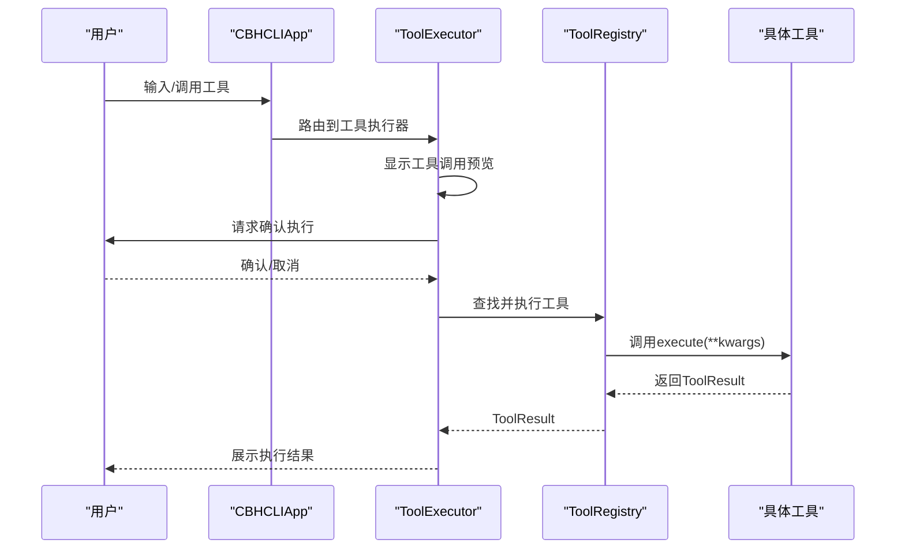
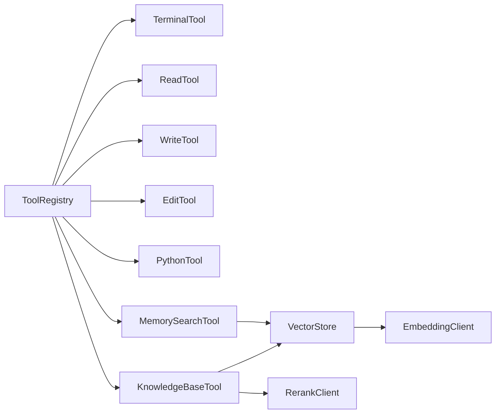

# 内置工具概览

<cite>
**本文引用的文件**
- [README.md](file://README.md)
- [cli.py](file://cbhcli_pkg/cli.py)
- [app.py](file://cbhcli_pkg/core/app.py)
- [tool_executor.py](file://cbhcli_pkg/core/tool_executor.py)
- [registry.py](file://cbhcli_pkg/tools/registry.py)
- [terminal.py](file://cbhcli_pkg/tools/terminal.py)
- [file_read.py](file://cbhcli_pkg/tools/file_read.py)
- [file_write.py](file://cbhcli_pkg/tools/file_write.py)
- [file_edit.py](file://cbhcli_pkg/tools/file_edit.py)
- [python_tool.py](file://cbhcli_pkg/tools/python_tool.py)
- [memory_search.py](file://cbhcli_pkg/tools/memory_search.py)
- [knowledge_base.py](file://cbhcli_pkg/tools/knowledge_base.py)
- [store.py](file://cbhcli_pkg/vector/store.py)
- [embedding_client.py](file://cbhcli_pkg/core/embedding_client.py)
- [rerank_client.py](file://cbhcli_pkg/core/rerank_client.py)
</cite>

## 目录
1. [简介](#简介)
2. [项目结构](#项目结构)
3. [核心组件](#核心组件)
4. [架构总览](#架构总览)
5. [详细组件分析](#详细组件分析)
6. [依赖分析](#依赖分析)
7. [性能考量](#性能考量)
8. [故障排查指南](#故障排查指南)
9. [结论](#结论)
10. [附录](#附录)

## 简介
本文件面向CBHCLI的7种内置工具，提供全面的功能概览与使用指导。工具体系围绕“工具注册中心”统一调度，结合“工具执行器”的确认与展示机制，形成从参数校验、执行到结果输出的完整闭环。同时，向量数据库与嵌入/重排序客户端为知识库与记忆搜索提供语义检索能力。

## 项目结构
CBHCLI采用模块化组织，核心工具集中在tools子包，统一由工具注册中心管理，并通过工具执行器对外提供一致的调用体验。应用初始化时注册内置工具，并在需要时注入向量存储与重排序能力。

```mermaid
graph TB
subgraph "应用层"
APP["CBHCLIApp<br/>应用初始化与命令路由"]
EXEC["ToolExecutor<br/>工具执行与展示"]
end
subgraph "工具层"
REG["ToolRegistry<br/>工具注册中心"]
T1["TerminalTool<br/>终端命令执行"]
T2["ReadTool<br/>文件读取"]
T3["WriteTool<br/>文件写入"]
T4["EditTool<br/>文件编辑"]
T5["PythonTool<br/>Python代码执行"]
T6["MemorySearchTool<br/>记忆搜索"]
T7["KnowledgeBaseTool<br/>知识库查询"]
end
subgraph "向量与检索"
VS["VectorStore<br/>ChromaDB封装"]
EMB["EmbeddingClient<br/>嵌入模型客户端"]
RER["RerankClient<br/>重排序客户端"]
end
APP --> REG
APP --> EXEC
EXEC --> REG
REG --> T1
REG --> T2
REG --> T3
REG --> T4
REG --> T5
REG --> T6
REG --> T7
T6 --> VS
T7 --> VS
VS --> EMB
T7 --> RER
```

图表来源
- [app.py:85-96](file://cbhcli_pkg/core/app.py#L85-L96)
- [tool_executor.py:42-52](file://cbhcli_pkg/core/tool_executor.py#L42-L52)
- [registry.py:51-115](file://cbhcli_pkg/tools/registry.py#L51-L115)
- [terminal.py:7-99](file://cbhcli_pkg/tools/terminal.py#L7-L99)
- [file_read.py:6-125](file://cbhcli_pkg/tools/file_read.py#L6-L125)
- [file_write.py:6-83](file://cbhcli_pkg/tools/file_write.py#L6-L83)
- [file_edit.py:6-134](file://cbhcli_pkg/tools/file_edit.py#L6-L134)
- [python_tool.py:127-207](file://cbhcli_pkg/tools/python_tool.py#L127-L207)
- [memory_search.py:6-177](file://cbhcli_pkg/tools/memory_search.py#L6-L177)
- [knowledge_base.py:6-157](file://cbhcli_pkg/tools/knowledge_base.py#L6-L157)
- [store.py:37-175](file://cbhcli_pkg/vector/store.py#L37-L175)
- [embedding_client.py:6-132](file://cbhcli_pkg/core/embedding_client.py#L6-L132)
- [rerank_client.py:6-123](file://cbhcli_pkg/core/rerank_client.py#L6-L123)

章节来源
- [app.py:85-96](file://cbhcli_pkg/core/app.py#L85-L96)
- [cli.py:60-68](file://cbhcli_pkg/cli.py#L60-L68)

## 核心组件
- 工具注册中心：统一注册、查找与执行工具，提供工具描述聚合与可用工具列表。
- 工具执行器：负责工具调用前的确认、执行、结果展示与回调；支持详细/简洁模式切换。
- 工具基类与结果：统一的工具接口与结果结构，便于扩展与统一处理。
- 向量与检索：ChromaDB封装、自定义嵌入模型API与重排序服务，支撑知识库与记忆搜索。

章节来源
- [registry.py:51-115](file://cbhcli_pkg/tools/registry.py#L51-L115)
- [tool_executor.py:15-168](file://cbhcli_pkg/core/tool_executor.py#L15-L168)
- [store.py:37-175](file://cbhcli_pkg/vector/store.py#L37-L175)
- [embedding_client.py:6-132](file://cbhcli_pkg/core/embedding_client.py#L6-L132)
- [rerank_client.py:6-123](file://cbhcli_pkg/core/rerank_client.py#L6-L123)

## 架构总览
CBHCLI的工具链路遵循“应用初始化→注册工具→执行器调度→工具执行→结果展示”的流程。工具执行器在执行前可进行用户确认，支持详细参数展示与结果预览；工具通过注册中心统一管理，便于扩展与维护。

图表来源
- [app.py:85-96](file://cbhcli_pkg/core/app.py#L85-L96)
- [tool_executor.py:54-91](file://cbhcli_pkg/core/tool_executor.py#L54-L91)
- [registry.py:70-96](file://cbhcli_pkg/tools/registry.py#L70-L96)

## 详细组件分析

### 终端命令执行工具（terminal）
- 核心功能
  - 在受控环境中执行任意shell命令，支持多命令串行执行与超时控制。
  - 输出包含标准输出与错误输出，失败时返回退出码与详细输出。
- 参数配置
  - command: 要执行的shell命令（必填）。
  - timeout: 超时时间（秒，默认30）。
- 执行方式
  - 通过subprocess执行命令，捕获标准输出与错误输出，按超时策略处理。
- 输出格式
  - 成功：返回合并后的输出；若无输出则提示“命令执行成功,无输出”。
  - 失败：返回错误详情，包含退出码与输出。
- 使用场景与适用范围
  - 文件系统操作、程序运行、系统信息查询等。
  - 适合需要直接操作系统资源的任务，需谨慎使用高风险命令。
- 典型用例
  - 列出当前目录文件、查看进程状态、运行脚本等。
- 最佳实践
  - 优先使用明确的路径与权限最小化的命令；合理设置timeout。
  - 对可能耗时的操作提前评估风险。
- 性能特点与限制
  - 受系统I/O与命令本身性能影响；超时可避免长时间阻塞。
- 安全考虑
  - 严格限制高危命令；建议在沙箱或受限环境中使用。
  - 注意命令注入风险，避免直接拼接不受信任输入。

章节来源
- [terminal.py:31-99](file://cbhcli_pkg/tools/terminal.py#L31-L99)

### 文件读取工具（read）
- 核心功能
  - 读取文本文件内容，支持指定行范围，自动展开~为家目录。
- 参数配置
  - file_path: 文件路径（必填）。
  - start_line: 起始行号（可选）。
  - end_line: 结束行号（可选）。
- 执行方式
  - 读取文件全文，按行切片并添加行号输出。
- 输出格式
  - 包含文件路径、总行数、显示范围、内容与结束标记。
- 使用场景与适用范围
  - 日志查看、代码片段提取、配置文件读取等。
- 典型用例
  - 查看某文件的特定区间内容，辅助分析与定位问题。
- 最佳实践
  - 对大文件谨慎使用行范围；确保文件编码为UTF-8。
- 性能特点与限制
  - 读取速度取决于磁盘I/O；大文件建议分段读取。
- 安全考虑
  - 避免读取敏感系统文件；注意路径遍历风险。

章节来源
- [file_read.py:38-125](file://cbhcli_pkg/tools/file_read.py#L38-L125)

### 文件写入工具（write）
- 核心功能
  - 创建新文件或覆盖现有文件内容，警告会完全覆盖原文件。
- 参数配置
  - file_path: 目标文件路径（必填）。
  - content: 写入内容（必填）。
- 执行方式
  - 展开~为家目录，确保父目录存在，写入UTF-8编码内容。
- 输出格式
  - 成功：包含创建/覆盖提示与字符数、行数统计。
- 使用场景与适用范围
  - 生成临时文件、批量写入、配置文件生成等。
- 典型用例
  - 自动生成报告、日志文件、配置文件。
- 最佳实践
  - 写入前备份重要文件；使用明确的文件路径。
- 性能特点与限制
  - 受磁盘写入速度影响；大文件写入需关注I/O性能。
- 安全考虑
  - 谨慎覆盖系统关键文件；避免写入不可信内容。

章节来源
- [file_write.py:34-83](file://cbhcli_pkg/tools/file_write.py#L34-L83)

### 文件编辑工具（edit）
- 核心功能
  - 精确替换文件中的文本，要求old_str唯一匹配。
- 参数配置
  - file_path: 文件路径（必填）。
  - old_str: 要替换的原始文本（必填）。
  - new_str: 替换后的新文本（必填）。
- 执行方式
  - 查找唯一匹配位置并替换，统计字符与行数变化。
- 输出格式
  - 成功：包含文件路径、替换前后字符数与行数变化。
- 使用场景与适用范围
  - 配置项修改、代码片段替换、批量文本调整等。
- 典型用例
  - 修改配置值、替换函数签名、统一注释格式。
- 最佳实践
  - 提供足够上下文使old_str唯一；替换前做好备份。
- 性能特点与限制
  - 适用于小到中等规模文件；大文件替换建议分步进行。
- 安全考虑
  - 确保old_str唯一性，避免误替换；谨慎处理二进制文件。

章节来源
- [file_edit.py:38-134](file://cbhcli_pkg/tools/file_edit.py#L38-L134)

### Python代码执行工具（python）
- 核心功能
  - 在会话中执行Python代码，支持导入常用库与变量持久化。
- 参数配置
  - code: 要执行的Python代码（必填）。
  - timeout: 超时时间（秒，默认30）。
- 执行方式
  - 使用全局会话保持变量状态，捕获标准输出与错误。
- 输出格式
  - 成功：返回标准输出；若无输出则提示“代码执行成功，无输出”。
  - 失败：返回错误详情与异常信息。
- 使用场景与适用范围
  - 数据分析、计算、脚本自动化、变量复用等。
- 典型用例
  - 在同一会话中多次使用pandas、numpy等库；缓存中间结果。
- 最佳实践
  - 使用/reset或/new创建新会话清理状态；避免执行不受信任代码。
- 性能特点与限制
  - 受Python解释器与库性能影响；长耗时任务需设置合理timeout。
- 安全考虑
  - 严禁执行高危代码；建议在受限环境中使用。

章节来源
- [python_tool.py:170-207](file://cbhcli_pkg/tools/python_tool.py#L170-L207)

### 内存搜索工具（memory_search）
- 核心功能
  - 对Agent的向量化知识内容进行语义搜索（不包括对话历史），支持降级到本地memory.md文件搜索。
- 参数配置
  - query: 搜索查询文本（必填）。
  - top_k: 返回结果数量（默认5）。
  - agent_name: Agent名称（可选，未提供时自动获取）。
- 执行方式
  - 优先使用向量数据库查询；若不可用则回退到memory.md关键词匹配。
- 输出格式
  - 成功：按条目格式化输出，包含文档内容与分隔线。
  - 失败：返回错误信息或提示未找到相关内容。
- 使用场景与适用范围
  - 搜索已记录的知识、笔记与文档，辅助决策与总结。
- 典型用例
  - 回忆之前讨论的技术要点、查找特定文档片段。
- 最佳实践
  - 确保已配置嵌入模型并完成索引；必要时使用/kb add与/embedding index。
- 性能特点与限制
  - 向量搜索依赖嵌入质量与索引完整性；降级方案性能较低。
- 安全考虑
  - 仅访问当前Agent的工作空间；避免泄露敏感信息。

章节来源
- [memory_search.py:47-177](file://cbhcli_pkg/tools/memory_search.py#L47-L177)

### 知识库工具（knowledge_base）
- 核心功能
  - 查询Agent的知识库内容，支持重排序优化结果质量。
- 参数配置
  - query: 搜索查询文本（必填）。
  - top_k: 返回结果数量（默认5）。
  - agent_name: Agent名称（可选，未提供时自动获取）。
- 执行方式
  - 使用向量数据库查询，可选调用重排序客户端提升相关性。
- 输出格式
  - 成功：包含来源文件、相关度分数与文档内容。
  - 失败：返回错误信息或提示未找到相关内容。
- 使用场景与适用范围
  - 文档检索、知识问答、资料整理等。
- 典型用例
  - 查找技术规范、API文档、会议纪要等。
- 最佳实践
  - 定期reindex知识库；合理设置top_k与重排序阈值。
- 性能特点与限制
  - 受嵌入模型与重排序服务性能影响；建议批量处理与缓存。
- 安全考虑
  - 控制知识库访问范围；避免泄露内部文档。

章节来源
- [knowledge_base.py:49-157](file://cbhcli_pkg/tools/knowledge_base.py#L49-L157)

## 依赖分析
- 工具注册中心与执行器
  - 工具注册中心提供统一的工具注册、查找与执行接口；工具执行器负责调用前确认与结果展示。
- 向量与检索组件
  - VectorStore封装ChromaDB，使用自定义嵌入模型API；RerankClient提供重排序能力；EmbeddingClient支持多种嵌入模型。
- 工具与向量存储的关系
  - memory_search与knowledge_base依赖VectorStore；knowledge_base可选使用RerankClient；VectorStore依赖EmbeddingClient。

图表来源
- [registry.py:51-115](file://cbhcli_pkg/tools/registry.py#L51-L115)
- [memory_search.py:6-21](file://cbhcli_pkg/tools/memory_search.py#L6-L21)
- [knowledge_base.py:9-23](file://cbhcli_pkg/tools/knowledge_base.py#L9-L23)
- [store.py:37-62](file://cbhcli_pkg/vector/store.py#L37-L62)
- [embedding_client.py:6-33](file://cbhcli_pkg/core/embedding_client.py#L6-L33)
- [rerank_client.py:6-34](file://cbhcli_pkg/core/rerank_client.py#L6-L34)

章节来源
- [registry.py:51-115](file://cbhcli_pkg/tools/registry.py#L51-L115)
- [store.py:37-175](file://cbhcli_pkg/vector/store.py#L37-L175)

## 性能考量
- 工具执行器
  - 支持详细/简洁模式切换，避免过长输出影响交互效率。
- 终端工具
  - 超时控制可防止长时间阻塞；建议对潜在耗时命令设置合理timeout。
- 文件工具
  - 大文件读写建议分段处理；写入前确保父目录存在减少I/O开销。
- Python工具
  - 会话状态保持可减少重复导入成本；长任务需设置timeout。
- 知识库与记忆搜索
  - 向量索引质量直接影响检索性能；定期reindex与合理top_k配置至关重要。
  - 重排序服务会增加额外网络请求，建议根据需求启用。

## 故障排查指南
- 工具执行失败
  - 检查工具参数是否正确；查看ToolResult中的错误信息。
- 终端命令超时
  - 调整timeout或拆分命令；确认系统负载与资源占用。
- 文件读取编码错误
  - 确认文件为UTF-8编码；必要时转换编码或改用其他工具。
- 文件编辑未找到匹配
  - 确保old_str唯一；提供更明确的上下文；检查文件内容是否包含目标文本。
- 知识库查询失败
  - 检查向量数据库是否启用与可用；确认嵌入模型配置正确；执行/kb reindex与/embedding reindex。
- 记忆搜索降级
  - 确认memory.md存在且可读；检查Agent名称与工作空间路径。

章节来源
- [tool_executor.py:142-158](file://cbhcli_pkg/core/tool_executor.py#L142-L158)
- [terminal.py:57-66](file://cbhcli_pkg/tools/terminal.py#L57-L66)
- [file_read.py:113-118](file://cbhcli_pkg/tools/file_read.py#L113-L118)
- [file_edit.py:77-100](file://cbhcli_pkg/tools/file_edit.py#L77-L100)
- [knowledge_base.py:73-78](file://cbhcli_pkg/tools/knowledge_base.py#L73-L78)
- [memory_search.py:117-125](file://cbhcli_pkg/tools/memory_search.py#L117-L125)

## 结论
CBHCLI的7种内置工具覆盖了终端命令、文件操作、Python执行、内存搜索与知识库查询等核心场景。通过工具注册中心与执行器的统一调度，配合向量检索与重排序能力，能够高效完成复杂任务。建议在实际使用中结合自身安全策略与性能需求，合理选择工具与参数配置，并定期维护知识库与索引，以获得最佳体验。

## 附录
- 工具清单与简述
  - terminal：执行终端命令。
  - read：读取文件内容。
  - write：创建/覆盖文件。
  - edit：精确字符串替换。
  - python：执行Python代码（带会话记忆）。
  - memory_search：语义搜索历史对话（向量化知识内容）。
  - knowledge_base：查询知识库内容。
- 快捷键
  - Ctrl+R：切换工具显示详细/简洁模式。

章节来源
- [cli.py:60-71](file://cbhcli_pkg/cli.py#L60-L71)
- [README.md:14-24](file://README.md#L14-L24)