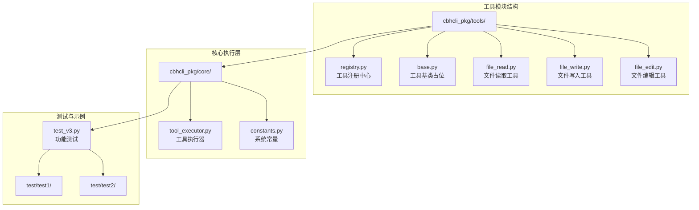
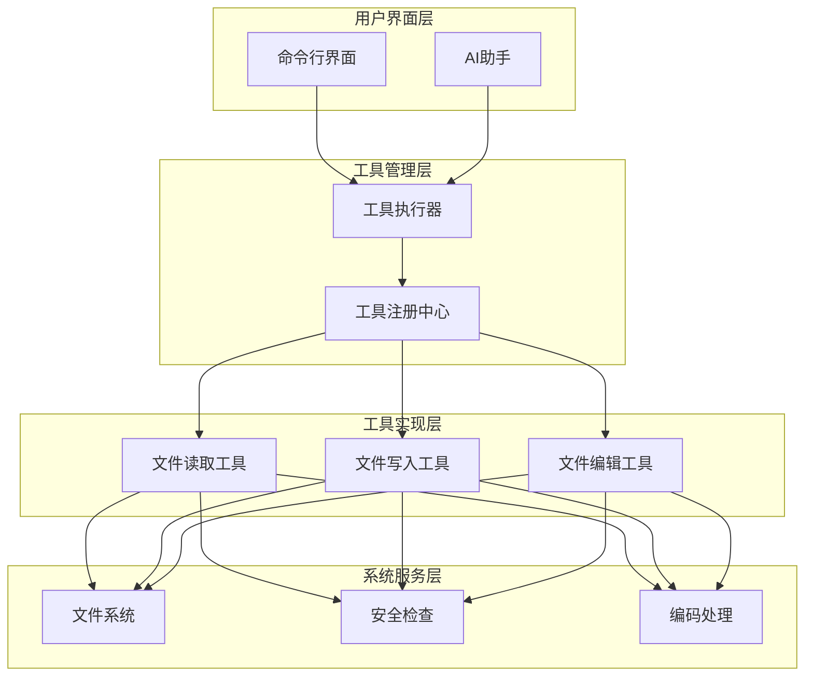
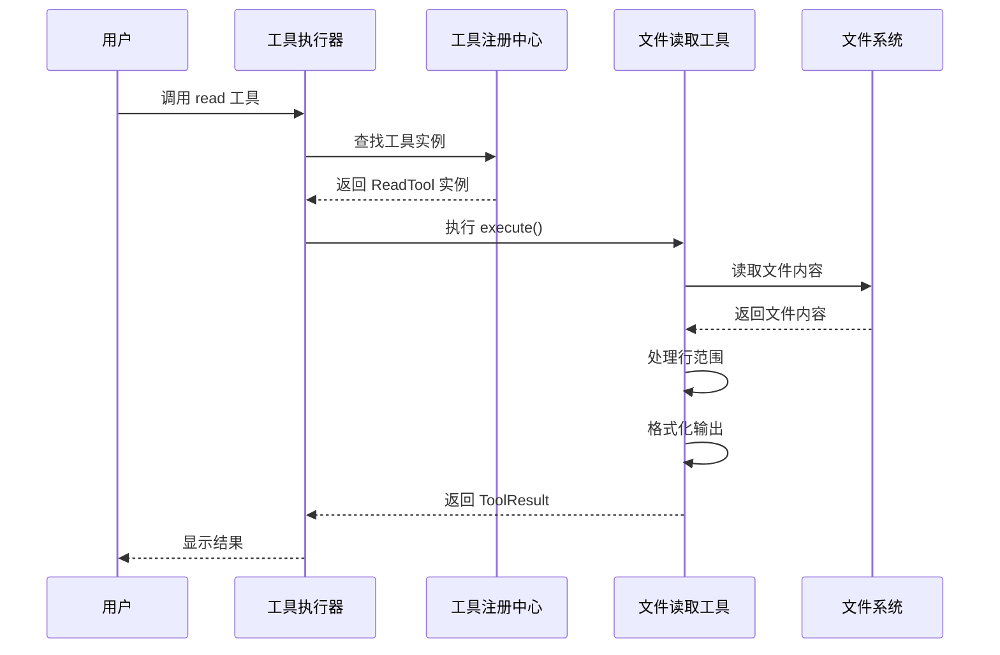
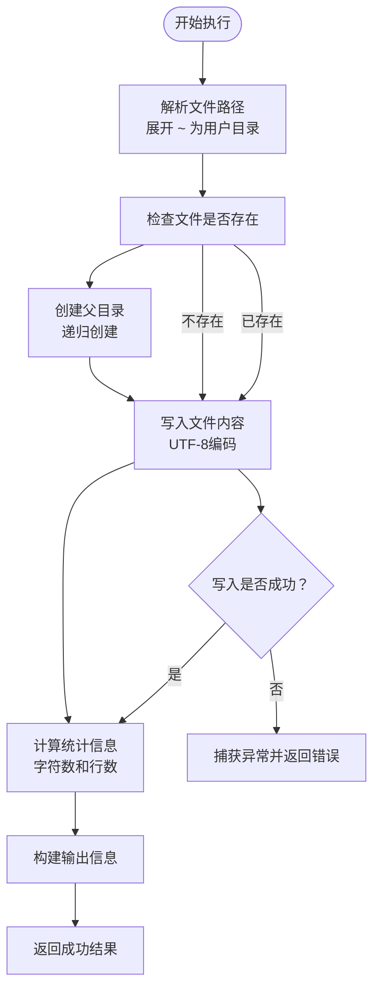
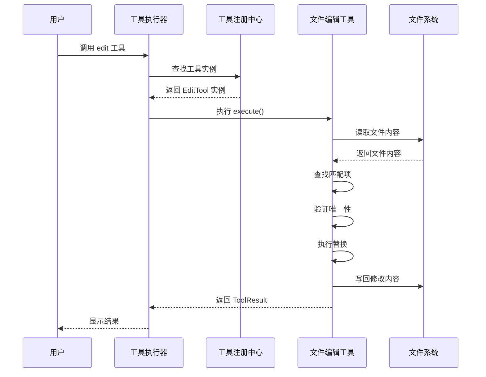
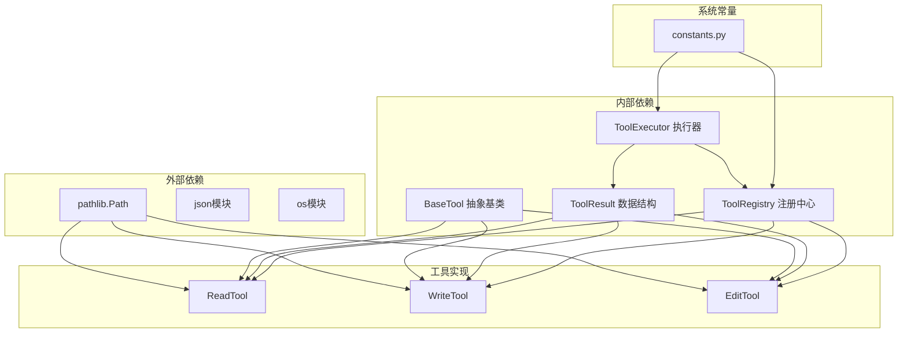
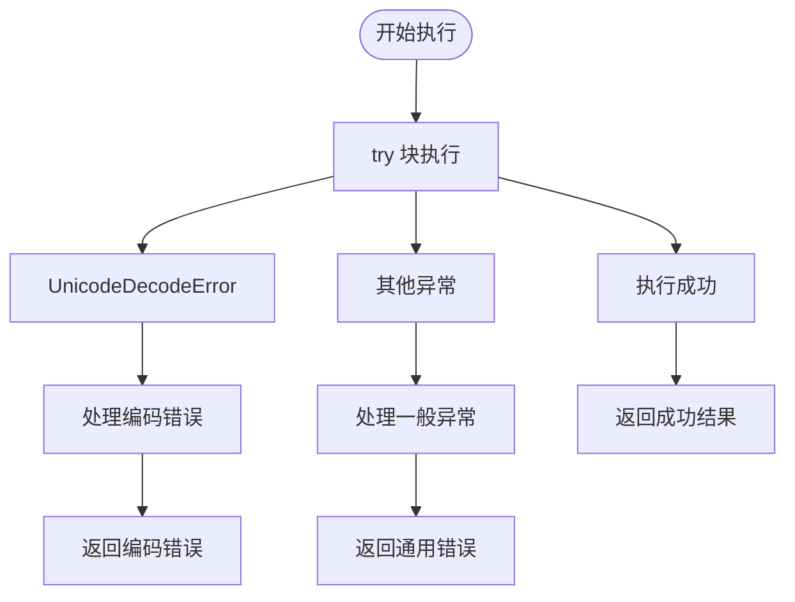

# 文件操作工具集

<cite>
**本文档引用的文件**
- [file_read.py](file://cbhcli_pkg/tools/file_read.py)
- [file_write.py](file://cbhcli_pkg/tools/file_write.py)
- [file_edit.py](file://cbhcli_pkg/tools/file_edit.py)
- [registry.py](file://cbhcli_pkg/tools/registry.py)
- [tool_executor.py](file://cbhcli_pkg/core/tool_executor.py)
- [constants.py](file://cbhcli_pkg/core/constants.py)
- [test_v3.py](file://test_v3.py)
- [index.html](file://test/test1/index.html)
- [test.html](file://test/test2/test.html)
</cite>

## 目录
1. [简介](#简介)
2. [项目结构](#项目结构)
3. [核心组件](#核心组件)
4. [架构概览](#架构概览)
5. [详细组件分析](#详细组件分析)
6. [依赖关系分析](#依赖关系分析)
7. [性能考虑](#性能考虑)
8. [故障排除指南](#故障排除指南)
9. [结论](#结论)

## 简介

CBHCLI的文件操作工具集提供了三个核心文件处理工具：`file_read`（文件读取）、`file_write`（文件写入）和`file_edit`（文件编辑）。这些工具基于统一的工具执行框架构建，支持AI驱动的自动化文件操作，具有完整的错误处理、安全检查和用户交互功能。

该工具集采用模块化设计，每个工具都是独立的类实现，遵循统一的接口规范，确保了良好的可扩展性和维护性。

## 项目结构

文件操作工具集位于CBHCLI项目的工具模块中，采用清晰的分层架构：

**图表来源**
- [file_read.py:1-125](file://cbhcli_pkg/tools/file_read.py#L1-L125)
- [file_write.py:1-83](file://cbhcli_pkg/tools/file_write.py#L1-L83)
- [file_edit.py:1-134](file://cbhcli_pkg/tools/file_edit.py#L1-L134)
- [registry.py:1-115](file://cbhcli_pkg/tools/registry.py#L1-L115)
- [tool_executor.py:1-168](file://cbhcli_pkg/core/tool_executor.py#L1-L168)

**章节来源**
- [file_read.py:1-125](file://cbhcli_pkg/tools/file_read.py#L1-L125)
- [file_write.py:1-83](file://cbhcli_pkg/tools/file_write.py#L1-L83)
- [file_edit.py:1-134](file://cbhcli_pkg/tools/file_edit.py#L1-L134)
- [registry.py:1-115](file://cbhcli_pkg/tools/registry.py#L1-L115)
- [tool_executor.py:1-168](file://cbhcli_pkg/core/tool_executor.py#L1-L168)

## 核心组件

文件操作工具集由三个主要组件构成，每个组件都有其独特的功能和实现特点：

### 工具注册中心
工具注册中心负责管理所有可用的工具实例，提供统一的工具查找、执行和描述功能。它实现了工具的生命周期管理，包括注册、注销和执行。

### 工具基类体系
所有文件操作工具都继承自统一的BaseTool抽象基类，确保了工具间的一致性和可预测性。每个工具必须实现特定的方法和属性，包括名称、描述、参数定义和执行逻辑。

### 工具执行器
工具执行器负责协调工具的完整执行流程，包括用户确认、执行前预览、实际执行和结果展示。它还提供了详细的日志输出和错误处理机制。

**章节来源**
- [registry.py:51-115](file://cbhcli_pkg/tools/registry.py#L51-L115)
- [registry.py:16-49](file://cbhcli_pkg/tools/registry.py#L16-L49)
- [tool_executor.py:15-168](file://cbhcli_pkg/core/tool_executor.py#L15-L168)

## 架构概览

文件操作工具集采用分层架构设计，确保了清晰的关注点分离和良好的可维护性：

**图表来源**
- [registry.py:51-115](file://cbhcli_pkg/tools/registry.py#L51-L115)
- [tool_executor.py:42-91](file://cbhcli_pkg/core/tool_executor.py#L42-L91)
- [file_read.py:38-125](file://cbhcli_pkg/tools/file_read.py#L38-L125)
- [file_write.py:34-83](file://cbhcli_pkg/tools/file_write.py#L34-L83)
- [file_edit.py:38-134](file://cbhcli_pkg/tools/file_edit.py#L38-L134)

## 详细组件分析

### 文件读取工具 (ReadTool)

文件读取工具提供了灵活的文件内容读取功能，支持指定行范围的精确读取。

#### 核心功能特性

**参数配置**
- `file_path`: 必需参数，支持使用`~`表示用户主目录
- `start_line`: 可选参数，起始行号（从1开始计数）
- `end_line`: 可选参数，结束行号

**执行流程**
1. 路径解析：展开`~`为用户主目录
2. 文件验证：检查文件是否存在且为普通文件
3. 编码处理：使用UTF-8编码读取文件内容
4. 行范围处理：根据start_line和end_line参数确定读取范围
5. 格式化输出：生成带有行号的格式化内容

**输出格式**
工具返回结构化的文本输出，包含文件元信息和内容摘要：
- 文件路径和总行数统计
- 读取范围信息（如果指定）
- 格式化的文件内容（带行号）
- 结束标记

**图表来源**
- [file_read.py:38-125](file://cbhcli_pkg/tools/file_read.py#L38-L125)
- [tool_executor.py:42-91](file://cbhcli_pkg/core/tool_executor.py#L42-L91)

**章节来源**
- [file_read.py:17-36](file://cbhcli_pkg/tools/file_read.py#L17-L36)
- [file_read.py:38-125](file://cbhcli_pkg/tools/file_read.py#L38-L125)

### 文件写入工具 (WriteTool)

文件写入工具提供了创建新文件或覆盖现有文件的功能，支持完整的文件系统操作。

#### 核心功能特性

**参数配置**
- `file_path`: 必需参数，目标文件路径
- `content`: 必需参数，要写入的内容

**执行流程**
1. 路径解析：展开`~`为用户主目录
2. 文件存在性检查：判断目标文件是否已存在
3. 目录创建：确保父目录存在（递归创建）
4. 文件写入：使用UTF-8编码写入内容
5. 统计信息：计算字符数和行数
6. 结果反馈：提供详细的执行状态信息

**输出格式**
工具返回包含以下信息的结构化输出：
- 文件操作状态（创建或覆盖）
- 文件大小统计（字符数和行数）
- 成功执行的确认信息

**图表来源**
- [file_write.py:34-83](file://cbhcli_pkg/tools/file_write.py#L34-L83)

**章节来源**
- [file_write.py:17-32](file://cbhcli_pkg/tools/file_write.py#L17-L32)
- [file_write.py:34-83](file://cbhcli_pkg/tools/file_write.py#L34-L83)

### 文件编辑工具 (EditTool)

文件编辑工具提供了精确的字符串替换功能，支持在文件中进行精准的文本修改。

#### 核心功能特性

**参数配置**
- `file_path`: 必需参数，目标文件路径
- `old_str`: 必需参数，要替换的原始文本
- `new_str`: 必需参数，新的替换文本

**执行流程**
1. 路径解析：展开`~`为用户主目录
2. 文件存在性验证：确保目标文件存在
3. 内容读取：使用UTF-8编码读取完整文件内容
4. 匹配查找：在文件内容中查找所有匹配项
5. 唯一性检查：确保old_str在文件中唯一出现
6. 文本替换：执行精确的字符串替换
7. 内容写回：将修改后的内容写回原文件
8. 变化统计：计算行数变化量

**输出格式**
工具返回包含以下信息的结构化输出：
- 成功编辑的确认信息
- 替换详情（原始长度 vs 新长度）
- 行数变化统计

**图表来源**
- [file_edit.py:38-134](file://cbhcli_pkg/tools/file_edit.py#L38-L134)
- [tool_executor.py:42-91](file://cbhcli_pkg/core/tool_executor.py#L42-L91)

**章节来源**
- [file_edit.py:17-36](file://cbhcli_pkg/tools/file_edit.py#L17-L36)
- [file_edit.py:38-134](file://cbhcli_pkg/tools/file_edit.py#L38-L134)

## 依赖关系分析

文件操作工具集的依赖关系体现了清晰的分层架构和模块化设计：

**图表来源**
- [file_read.py:2-3](file://cbhcli_pkg/tools/file_read.py#L2-L3)
- [file_write.py:2-3](file://cbhcli_pkg/tools/file_write.py#L2-L3)
- [file_edit.py:2-3](file://cbhcli_pkg/tools/file_edit.py#L2-L3)
- [registry.py:2-4](file://cbhcli_pkg/tools/registry.py#L2-L4)
- [tool_executor.py:6-12](file://cbhcli_pkg/core/tool_executor.py#L6-L12)

### 关键依赖关系

1. **工具基类依赖**：所有工具都依赖于BaseTool抽象基类，确保统一的接口规范
2. **结果数据结构**：ToolResult数据结构为所有工具提供一致的结果格式
3. **执行器依赖**：工具执行器依赖于注册中心来管理工具实例
4. **系统常量依赖**：执行器使用系统常量来控制输出格式和行为

**章节来源**
- [registry.py:51-115](file://cbhcli_pkg/tools/registry.py#L51-L115)
- [tool_executor.py:24-32](file://cbhcli_pkg/core/tool_executor.py#L24-L32)

## 性能考虑

文件操作工具集在设计时充分考虑了性能优化和资源管理：

### 内存管理
- **流式读取**：文件读取采用逐行读取方式，避免大文件占用过多内存
- **一次性写入**：文件写入采用一次性写入，减少磁盘I/O操作
- **内容截断**：工具输出结果支持截断，防止超长输出影响性能

### 编码处理
- **UTF-8优先**：所有文件操作默认使用UTF-8编码，确保跨平台兼容性
- **错误处理**：提供Unicode解码错误的专门处理机制

### 输出控制
- **最大输出长度**：通过常量控制工具输出的最大长度（8000字符）
- **预览长度**：提供简短预览模式，便于快速浏览结果

**章节来源**
- [constants.py:14-16](file://cbhcli_pkg/core/constants.py#L14-L16)
- [file_read.py:113-124](file://cbhcli_pkg/tools/file_read.py#L113-L124)
- [tool_executor.py:144-157](file://cbhcli_pkg/core/tool_executor.py#L144-L157)

## 故障排除指南

### 常见问题及解决方案

#### 文件读取问题
**问题**：文件读取失败
**原因**：文件不存在、权限不足、编码错误
**解决方案**：
- 检查文件路径是否正确
- 验证文件权限设置
- 确认文件编码格式

#### 文件写入问题
**问题**：文件写入失败
**原因**：目录权限不足、磁盘空间不足、文件被占用
**解决方案**：
- 检查目标目录权限
- 确认磁盘空间充足
- 关闭占用文件的进程

#### 文件编辑问题
**问题**：文本替换失败
**原因**：目标文本不存在、匹配不唯一、权限不足
**解决方案**：
- 验证目标文本确实存在于文件中
- 提供更多上下文使old_str唯一
- 检查文件写入权限

### 错误处理机制

文件操作工具集提供了完善的错误处理机制：

**图表来源**
- [file_read.py:113-124](file://cbhcli_pkg/tools/file_read.py#L113-L124)
- [file_write.py:77-82](file://cbhcli_pkg/tools/file_write.py#L77-L82)
- [file_edit.py:128-133](file://cbhcli_pkg/tools/file_edit.py#L128-L133)

**章节来源**
- [file_read.py:113-124](file://cbhcli_pkg/tools/file_read.py#L113-L124)
- [file_write.py:77-82](file://cbhcli_pkg/tools/file_write.py#L77-L82)
- [file_edit.py:128-133](file://cbhcli_pkg/tools/file_edit.py#L128-L133)

## 结论

CBHCLI的文件操作工具集展现了优秀的软件工程实践，具有以下突出特点：

### 设计优势
- **模块化架构**：清晰的分层设计和职责分离
- **统一接口**：基于抽象基类的标准化工具接口
- **完善的安全机制**：多层次的文件系统安全检查
- **用户友好的交互**：直观的确认机制和详细的结果反馈

### 技术特色
- **编码一致性**：统一的UTF-8编码处理
- **错误处理**：全面的异常捕获和用户友好错误信息
- **性能优化**：合理的内存管理和输出控制
- **可扩展性**：基于注册中心的工具扩展机制

### 应用价值
该工具集为AI驱动的自动化文件操作提供了坚实的基础，支持从简单的文件读取到复杂的文本编辑等各种应用场景。其设计原则和实现模式可以作为其他工具开发的参考模板。

通过持续的优化和扩展，文件操作工具集将继续为CBHCLI生态系统提供可靠、高效的文件处理能力。