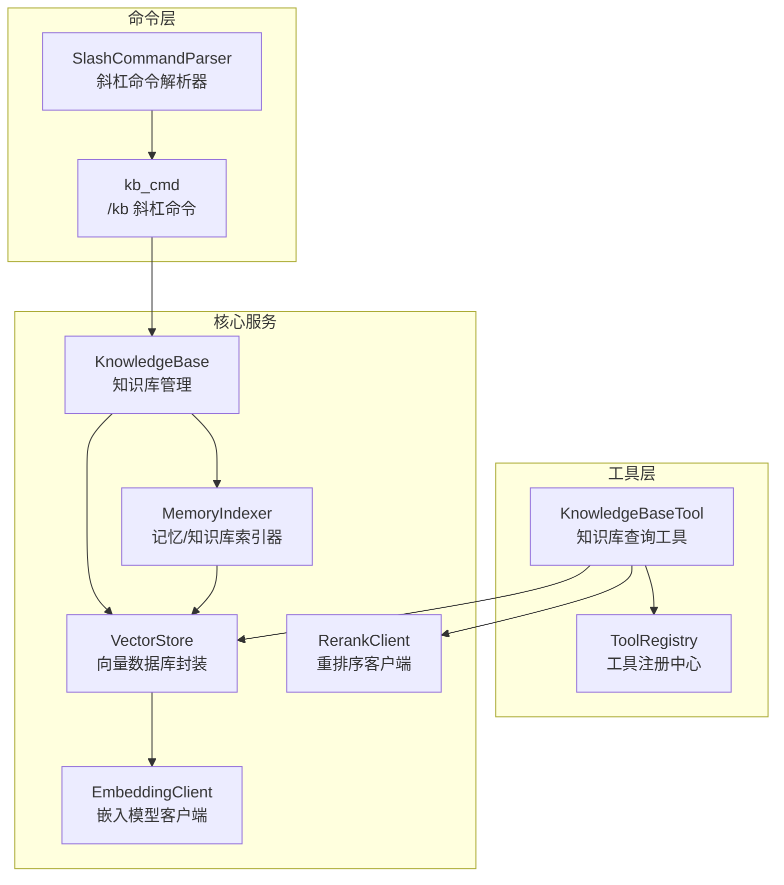
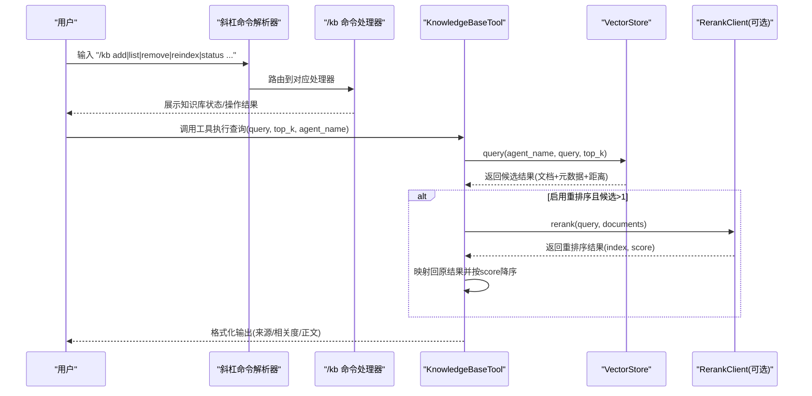
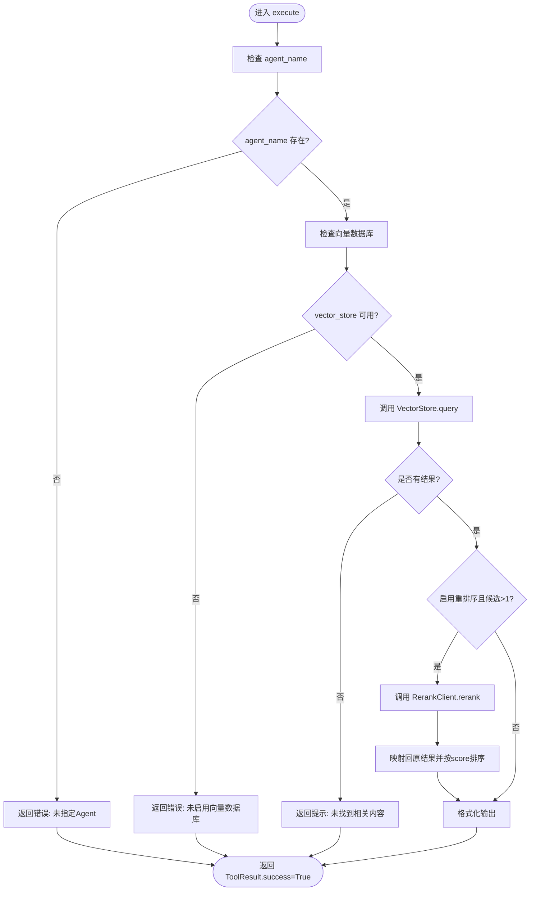
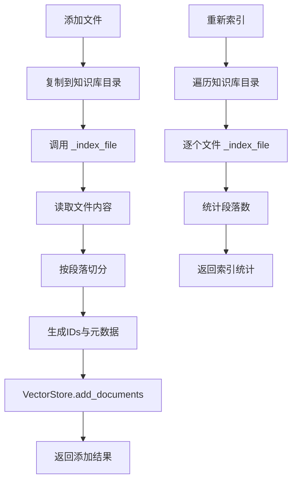
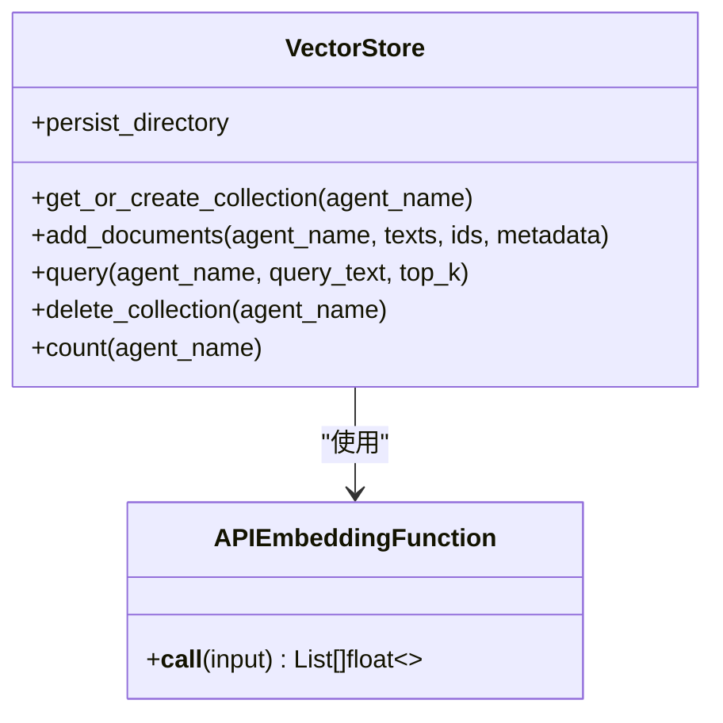
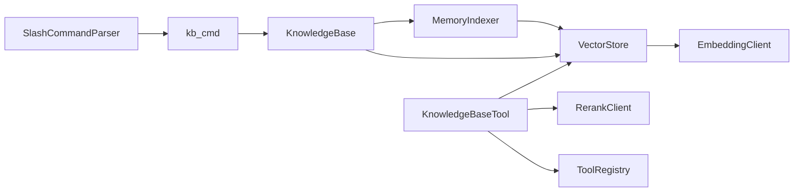

# 知识库工具

<cite>
**本文档引用的文件**
- [知识库工具实现](file://cbhcli_pkg/tools/knowledge_base.py)
- [知识库管理](file://cbhcli_pkg/core/knowledge_base.py)
- [斜杠命令注册与处理](file://cbhcli_pkg/commands/kb_cmd.py)
- [工具注册中心与结果封装](file://cbhcli_pkg/tools/registry.py)
- [向量数据库封装](file://cbhcli_pkg/vector/store.py)
- [嵌入模型客户端](file://cbhcli_pkg/core/embedding_client.py)
- [重排序客户端](file://cbhcli_pkg/core/rerank_client.py)
- [记忆索引器](file://cbhcli_pkg/vector/indexer.py)
- [斜杠命令解析器](file://cbhcli_pkg/commands/parser.py)
- [项目总览与使用说明](file://README.md)
</cite>

## 目录
1. [简介](#简介)
2. [项目结构](#项目结构)
3. [核心组件](#核心组件)
4. [架构概览](#架构概览)
5. [详细组件分析](#详细组件分析)
6. [依赖关系分析](#依赖关系分析)
7. [性能考量](#性能考量)
8. [故障排除指南](#故障排除指南)
9. [结论](#结论)
10. [附录](#附录)

## 简介
本文件面向CBHCLI的知识库工具（KnowledgeBaseTool），系统性阐述其设计原理、实现细节与使用方法。内容涵盖：
- 知识库集成与查询处理机制
- 参数配置、查询语法与过滤思路
- 连接管理、认证与错误处理
- 查询结果格式化、相关度评分与引用标注
- 使用示例（文档查询、问答系统、智能推荐）
- 性能特点与使用限制
- 最佳实践与故障排除

## 项目结构
知识库工具位于工具层，围绕“工具接口 + 向量检索 + 可选重排序”的架构组织；同时配合命令层提供交互入口，核心数据流由向量数据库承载。

图表来源
- [知识库工具实现:6-157](file://cbhcli_pkg/tools/knowledge_base.py#L6-L157)
- [工具注册中心与结果封装:16-115](file://cbhcli_pkg/tools/registry.py#L16-L115)
- [知识库管理:7-207](file://cbhcli_pkg/core/knowledge_base.py#L7-L207)
- [记忆索引器:7-178](file://cbhcli_pkg/vector/indexer.py#L7-L178)
- [向量数据库封装:37-175](file://cbhcli_pkg/vector/store.py#L37-L175)
- [嵌入模型客户端:6-132](file://cbhcli_pkg/core/embedding_client.py#L6-L132)
- [重排序客户端:6-123](file://cbhcli_pkg/core/rerank_client.py#L6-L123)
- [斜杠命令解析器:16-94](file://cbhcli_pkg/commands/parser.py#L16-L94)
- [斜杠命令注册与处理:5-186](file://cbhcli_pkg/commands/kb_cmd.py#L5-L186)

章节来源
- [知识库工具实现:1-157](file://cbhcli_pkg/tools/knowledge_base.py#L1-L157)
- [斜杠命令注册与处理:1-186](file://cbhcli_pkg/commands/kb_cmd.py#L1-L186)

## 核心组件
- 知识库查询工具（KnowledgeBaseTool）
  - 提供JSON Schema参数定义，支持查询与top_k控制
  - 通过向量数据库执行语义检索，并可选地使用重排序提升相关度
  - 输出统一的ToolResult，包含成功标志、输出文本与错误信息
- 知识库管理（KnowledgeBase）
  - 负责Agent专属知识库目录、文件增删、批量索引与统计
  - 支持按段落切分与元数据注入，便于后续检索与溯源
- 向量数据库封装（VectorStore）
  - 基于ChromaDB持久化，支持自定义嵌入模型API
  - 提供文档增删、查询、集合管理与计数能力
- 嵌入模型客户端（EmbeddingClient）
  - 支持OpenAI兼容与自定义API，提供批量嵌入与单条嵌入
- 重排序客户端（RerankClient）
  - 支持Jina/Cohere等API，对候选文档进行重排序
- 记忆/知识库索引器（MemoryIndexer）
  - 负责将Agent工作空间（含knowledge目录）的文本切分为段落并索引
- 斜杠命令（kb_cmd）
  - 提供/add/list/remove/reindex/status等命令，驱动知识库管理

章节来源
- [知识库工具实现:6-157](file://cbhcli_pkg/tools/knowledge_base.py#L6-L157)
- [知识库管理:7-207](file://cbhcli_pkg/core/knowledge_base.py#L7-L207)
- [向量数据库封装:37-175](file://cbhcli_pkg/vector/store.py#L37-L175)
- [嵌入模型客户端:6-132](file://cbhcli_pkg/core/embedding_client.py#L6-L132)
- [重排序客户端:6-123](file://cbhcli_pkg/core/rerank_client.py#L6-L123)
- [记忆索引器:7-178](file://cbhcli_pkg/vector/indexer.py#L7-L178)
- [斜杠命令注册与处理:5-186](file://cbhcli_pkg/commands/kb_cmd.py#L5-L186)

## 架构概览
知识库工具的端到端流程如下：
- 输入：用户通过斜杠命令或直接调用工具发起查询
- 解析：斜杠命令解析器识别并路由到/kb处理器
- 执行：工具层调用向量数据库查询，必要时进行重排序
- 结果：统一格式化输出，包含来源、相关度与正文片段

图表来源
- [斜杠命令解析器:26-78](file://cbhcli_pkg/commands/parser.py#L26-L78)
- [斜杠命令注册与处理:8-54](file://cbhcli_pkg/commands/kb_cmd.py#L8-L54)
- [知识库工具实现:49-121](file://cbhcli_pkg/tools/knowledge_base.py#L49-L121)
- [向量数据库封装:128-160](file://cbhcli_pkg/vector/store.py#L128-L160)
- [重排序客户端:35-59](file://cbhcli_pkg/core/rerank_client.py#L35-L59)

## 详细组件分析

### 知识库查询工具（KnowledgeBaseTool）
- 角色与职责
  - 作为工具接口，接收查询参数并返回标准化结果
  - 负责Agent名称推断、向量数据库可用性检查、重排序与结果格式化
- 参数与约束
  - query: 必填，查询文本
  - top_k: 可选，默认5，返回候选数量
  - agent_name: 可选，若未提供则尝试从应用实例获取当前Agent名称
- 执行流程
  - Agent名称校验与向量数据库可用性检查
  - 调用VectorStore.query执行语义检索
  - 若启用重排序且候选数>1，则调用RerankClient.rerank进行重排
  - 格式化输出：标题、来源、相关度、正文
- 错误处理
  - Agent名称缺失、向量数据库未启用、查询异常均以ToolResult.error形式返回

图表来源
- [知识库工具实现:49-121](file://cbhcli_pkg/tools/knowledge_base.py#L49-L121)

章节来源
- [知识库工具实现:6-157](file://cbhcli_pkg/tools/knowledge_base.py#L6-L157)

### 知识库管理（KnowledgeBase）
- 目录与文件管理
  - 知识库目录位于用户主目录下的Agent专属路径
  - 支持添加文件（复制到知识库目录）、删除文件、列出文件
- 索引策略
  - 仅对特定扩展名的文本文件进行索引（.md/.txt/.py/.js/.json/.yaml/.yml）
  - 按段落切分，生成文档ID与元数据（包含Agent名、文件名、段落索引等）
  - 通过VectorStore.add_documents批量写入
- 重新索引
  - 遍历知识库目录，逐个文件索引，统计段落数与文件数

图表来源
- [知识库管理:31-207](file://cbhcli_pkg/core/knowledge_base.py#L31-L207)

章节来源
- [知识库管理:7-207](file://cbhcli_pkg/core/knowledge_base.py#L7-L207)

### 向量数据库封装（VectorStore）
- 初始化与客户端
  - 需要提供嵌入模型客户端，否则抛出异常
  - 使用ChromaDB PersistentClient，集合命名规则为agent_{agent_name}
- 文档增删与查询
  - add_documents：预先计算嵌入向量，避免ChromaDB调用默认模型
  - query：预先计算查询向量，返回documents、metadatas、distances
  - delete_collection：删除集合
  - count：统计文档数量

图表来源
- [向量数据库封装:37-175](file://cbhcli_pkg/vector/store.py#L37-L175)

章节来源
- [向量数据库封装:1-175](file://cbhcli_pkg/vector/store.py#L1-L175)

### 嵌入模型客户端（EmbeddingClient）
- 支持OpenAI兼容与自定义API两种模式
- 提供批量嵌入与单条嵌入能力，内部采用分批处理以适配API限制

章节来源
- [嵌入模型客户端:6-132](file://cbhcli_pkg/core/embedding_client.py#L6-L132)

### 重排序客户端（RerankClient）
- 支持Jina与Cohere等API，统一返回index、document、score
- 对候选文档进行重排序，提升最终相关度

章节来源
- [重排序客户端:6-123](file://cbhcli_pkg/core/rerank_client.py#L6-L123)

### 记忆/知识库索引器（MemoryIndexer）
- 负责将Agent工作空间的标准文件与knowledge目录中的文本索引到向量数据库
- 支持删除旧集合后重建，确保内容更新后的索引一致性

章节来源
- [记忆索引器:7-178](file://cbhcli_pkg/vector/indexer.py#L7-L178)

### 斜杠命令（kb_cmd）与解析器（parser）
- /kb命令支持add/list/remove/reindex/status
- 解析器负责命令识别、参数拆分与执行路由

章节来源
- [斜杠命令注册与处理:5-186](file://cbhcli_pkg/commands/kb_cmd.py#L5-L186)
- [斜杠命令解析器:16-94](file://cbhcli_pkg/commands/parser.py#L16-L94)

## 依赖关系分析
- 工具层依赖
  - KnowledgeBaseTool依赖VectorStore与可选的RerankClient
  - 工具注册中心提供统一的工具接口与结果封装
- 核心服务依赖
  - KnowledgeBase依赖VectorStore与Indexer
  - VectorStore依赖EmbeddingClient
  - Indexer依赖VectorStore
- 命令层依赖
  - /kb命令处理器依赖KnowledgeBase
  - 解析器提供命令注册与执行框架

图表来源
- [知识库工具实现:6-22](file://cbhcli_pkg/tools/knowledge_base.py#L6-L22)
- [工具注册中心与结果封装:51-96](file://cbhcli_pkg/tools/registry.py#L51-L96)
- [知识库管理:16-27](file://cbhcli_pkg/core/knowledge_base.py#L16-L27)
- [记忆索引器:28-35](file://cbhcli_pkg/vector/indexer.py#L28-L35)
- [向量数据库封装:40-62](file://cbhcli_pkg/vector/store.py#L40-L62)
- [嵌入模型客户端:15-26](file://cbhcli_pkg/core/embedding_client.py#L15-L26)
- [斜杠命令注册与处理:57-137](file://cbhcli_pkg/commands/kb_cmd.py#L57-L137)
- [斜杠命令解析器:16-24](file://cbhcli_pkg/commands/parser.py#L16-L24)

## 性能考量
- 向量检索
  - 预计算查询向量与文档向量，避免ChromaDB调用默认嵌入模型，减少API调用与延迟
  - top_k越大，检索成本越高，建议根据场景调整
- 重排序
  - 重排序会引入额外网络请求与计算开销，仅在候选数>1时启用
  - 可通过调整top_n与模型参数平衡质量与性能
- 索引策略
  - 按段落切分有助于提升检索粒度，但会增加向量库规模
  - 仅对文本文件索引，避免二进制文件带来的无效负载
- 批量处理
  - 嵌入模型客户端采用分批处理，降低单次请求压力

[本节为通用性能讨论，不直接分析具体文件]

## 故障排除指南
- 未指定Agent名称
  - 现象：工具返回错误，提示未指定Agent且无法获取当前Agent
  - 处理：确保已选择Agent或显式传入agent_name
- 向量数据库未启用
  - 现象：工具返回错误，提示未启用向量数据库
  - 处理：安装并配置ChromaDB，或配置自定义嵌入模型API
- 查询异常
  - 现象：工具返回错误，包含失败原因
  - 处理：检查嵌入模型配置、网络连通性与API密钥
- 重排序失败
  - 现象：重排序过程抛出异常，工具回退到原始结果
  - 处理：检查重排序API配置与网络状况
- 知识库状态异常
  - 现象：/kb status显示向量文档数未知或向量数据库未启用
  - 处理：确认嵌入模型配置与向量数据库初始化状态

章节来源
- [知识库工具实现:65-78](file://cbhcli_pkg/tools/knowledge_base.py#L65-L78)
- [斜杠命令注册与处理:147-185](file://cbhcli_pkg/commands/kb_cmd.py#L147-L185)

## 结论
知识库工具通过清晰的工具接口、稳健的向量检索与可选重排序机制，实现了对Agent知识库的高效查询。结合命令层提供的管理命令与索引器的自动化索引，形成了从“知识入库—索引—检索—结果呈现”的完整闭环。在实际使用中，建议合理设置top_k与重排序策略，确保性能与质量的平衡，并遵循最佳实践进行知识库维护与索引更新。

[本节为总结性内容，不直接分析具体文件]

## 附录

### 参数配置与查询语法
- 工具参数
  - query: 必填，查询文本
  - top_k: 可选，默认5，返回候选数量
  - agent_name: 可选，若未提供则尝试从应用实例获取当前Agent名称
- 查询语法
  - 支持自然语言查询，系统通过向量相似度匹配相关文档
  - 可结合top_k控制返回数量
- 过滤条件
  - 通过top_k与重排序提升相关度，间接实现过滤效果
  - 索引阶段仅对文本文件进行索引，天然过滤二进制文件

章节来源
- [知识库工具实现:33-47](file://cbhcli_pkg/tools/knowledge_base.py#L33-L47)
- [知识库管理:166-170](file://cbhcli_pkg/core/knowledge_base.py#L166-L170)

### 使用示例
- 文档查询
  - 步骤：配置嵌入模型 → 索引Agent工作空间 → 添加知识库文件 → 执行查询
  - 参考命令：/model embedding add、/embedding index、/kb add、/kb status
- 问答系统
  - 将FAQ、技术文档加入知识库，通过自然语言查询获得答案片段
  - 可结合重排序提升答案相关度
- 智能推荐
  - 基于相似度检索相关文档片段，辅助生成推荐列表

章节来源
- [项目总览与使用说明:99-123](file://README.md#L99-L123)
- [斜杠命令注册与处理:8-54](file://cbhcli_pkg/commands/kb_cmd.py#L8-L54)

### 连接管理、认证与错误处理
- 连接管理
  - 向量数据库客户端在初始化时创建集合，按Agent隔离
  - 索引器在重建索引前删除旧集合，确保内容一致性
- 认证机制
  - 嵌入模型与重排序API通过HTTP头携带Authorization
  - 需正确配置apiKey与base_url
- 错误处理
  - 工具层统一返回ToolResult，包含success、output与error
  - 命令层捕获异常并反馈用户友好提示

章节来源
- [向量数据库封装:64-77](file://cbhcli_pkg/vector/store.py#L64-L77)
- [嵌入模型客户端:28-32](file://cbhcli_pkg/core/embedding_client.py#L28-L32)
- [重排序客户端:29-33](file://cbhcli_pkg/core/rerank_client.py#L29-L33)
- [斜杠命令注册与处理:57-76](file://cbhcli_pkg/commands/kb_cmd.py#L57-L76)

### 结果格式化、摘要生成与引用标注
- 格式化输出
  - 标题：包含查询关键词
  - 条目：来源（文件名/类型）、相关度（距离或重排序得分）、正文片段
- 引用标注
  - 元数据包含文件名、文件类型、段落索引等，便于溯源
- 摘要生成
  - 当前实现返回原文片段；如需摘要，可在上层逻辑中调用LLM进行抽取

章节来源
- [知识库工具实现:95-114](file://cbhcli_pkg/tools/knowledge_base.py#L95-L114)
- [知识库管理:184-193](file://cbhcli_pkg/core/knowledge_base.py#L184-L193)

### 性能特点与使用限制
- 性能特点
  - 预计算嵌入向量，减少重复API调用
  - 分批处理嵌入，适配API限制
  - 重排序仅在候选数>1时启用
- 使用限制
  - 仅对文本文件索引，二进制文件跳过
  - 需要嵌入模型配置，否则无法进行向量检索
  - 重排序依赖外部API，需网络与密钥

章节来源
- [向量数据库封装:118-126](file://cbhcli_pkg/vector/store.py#L118-L126)
- [嵌入模型客户端:49-70](file://cbhcli_pkg/core/embedding_client.py#L49-L70)
- [知识库管理:166-170](file://cbhcli_pkg/core/knowledge_base.py#L166-L170)

### 最佳实践
- 索引策略
  - 首次配置嵌入模型后，手动触发索引；文件更新后及时重新索引
- 查询优化
  - 合理设置top_k，避免过多无关结果
  - 在候选较多时启用重排序，提升相关度
- 维护建议
  - 定期清理无用文件，保持知识库整洁
  - 使用/kb status检查向量文档数量与索引状态

章节来源
- [项目总览与使用说明:208-229](file://README.md#L208-L229)
- [斜杠命令注册与处理:126-144](file://cbhcli_pkg/commands/kb_cmd.py#L126-L144)