# 终端命令执行工具

<cite>
**本文档引用的文件**
- [terminal.py](file://cbhcli_pkg/tools/terminal.py)
- [registry.py](file://cbhcli_pkg/tools/registry.py)
- [tool_executor.py](file://cbhcli_pkg/core/tool_executor.py)
- [constants.py](file://cbhcli_pkg/core/constants.py)
- [ai_handler.py](file://cbhcli_pkg/core/ai_handler.py)
- [agent.py](file://cbhcli_pkg/core/agent.py)
- [README.md](file://README.md)
</cite>

## 目录
1. [简介](#简介)
2. [项目结构](#项目结构)
3. [核心组件](#核心组件)
4. [架构概览](#架构概览)
5. [详细组件分析](#详细组件分析)
6. [依赖关系分析](#依赖关系分析)
7. [性能考量](#性能考量)
8. [故障排除指南](#故障排除指南)
9. [结论](#结论)
10. [附录](#附录)

## 简介
CBHCLI的终端命令执行工具是一个强大的Shell命令执行器，能够安全地执行任意shell命令，支持超时控制、错误处理和输出格式化。该工具通过统一的工具注册中心进行管理，与AI处理器集成，支持自动化命令执行和用户交互确认。

## 项目结构
终端工具位于CBHCLI项目的工具模块中，采用模块化设计，与其他工具共享相同的接口规范。

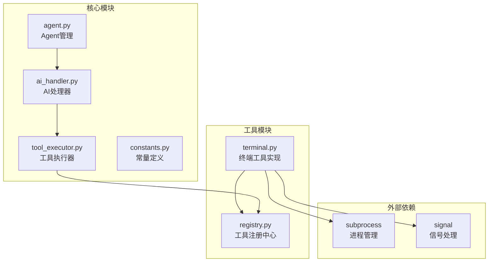

**图表来源**
- [terminal.py:1-99](file://cbhcli_pkg/tools/terminal.py#L1-L99)
- [registry.py:1-115](file://cbhcli_pkg/tools/registry.py#L1-L115)
- [tool_executor.py:1-168](file://cbhcli_pkg/core/tool_executor.py#L1-L168)

**章节来源**
- [terminal.py:1-99](file://cbhcli_pkg/tools/terminal.py#L1-L99)
- [registry.py:1-115](file://cbhcli_pkg/tools/registry.py#L1-L115)
- [README.md:269-295](file://README.md#L269-L295)

## 核心组件
终端工具的核心组件包括工具基类、执行器、结果封装和参数验证系统。

### 工具基类体系
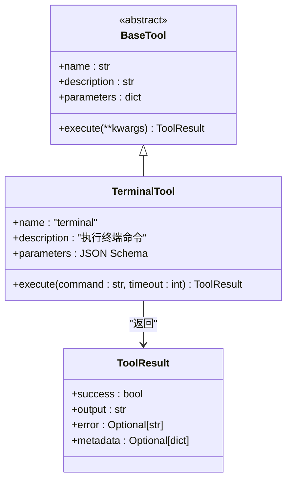

**图表来源**
- [registry.py:16-48](file://cbhcli_pkg/tools/registry.py#L16-L48)
- [terminal.py:7-99](file://cbhcli_pkg/tools/terminal.py#L7-L99)

### 工具执行器架构
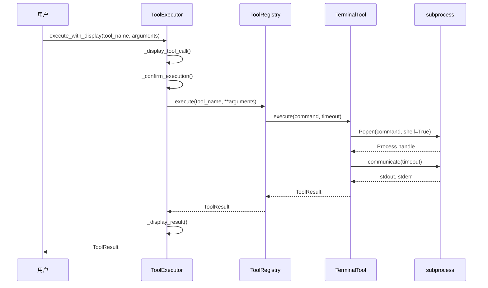

**图表来源**
- [tool_executor.py:42-91](file://cbhcli_pkg/core/tool_executor.py#L42-L91)
- [registry.py:70-96](file://cbhcli_pkg/tools/registry.py#L70-L96)
- [terminal.py:31-99](file://cbhcli_pkg/tools/terminal.py#L31-L99)

**章节来源**
- [registry.py:7-48](file://cbhcli_pkg/tools/registry.py#L7-L48)
- [tool_executor.py:15-91](file://cbhcli_pkg/core/tool_executor.py#L15-L91)

## 架构概览
终端工具采用分层架构设计，实现了高度的模块化和可扩展性。

### 整体架构图
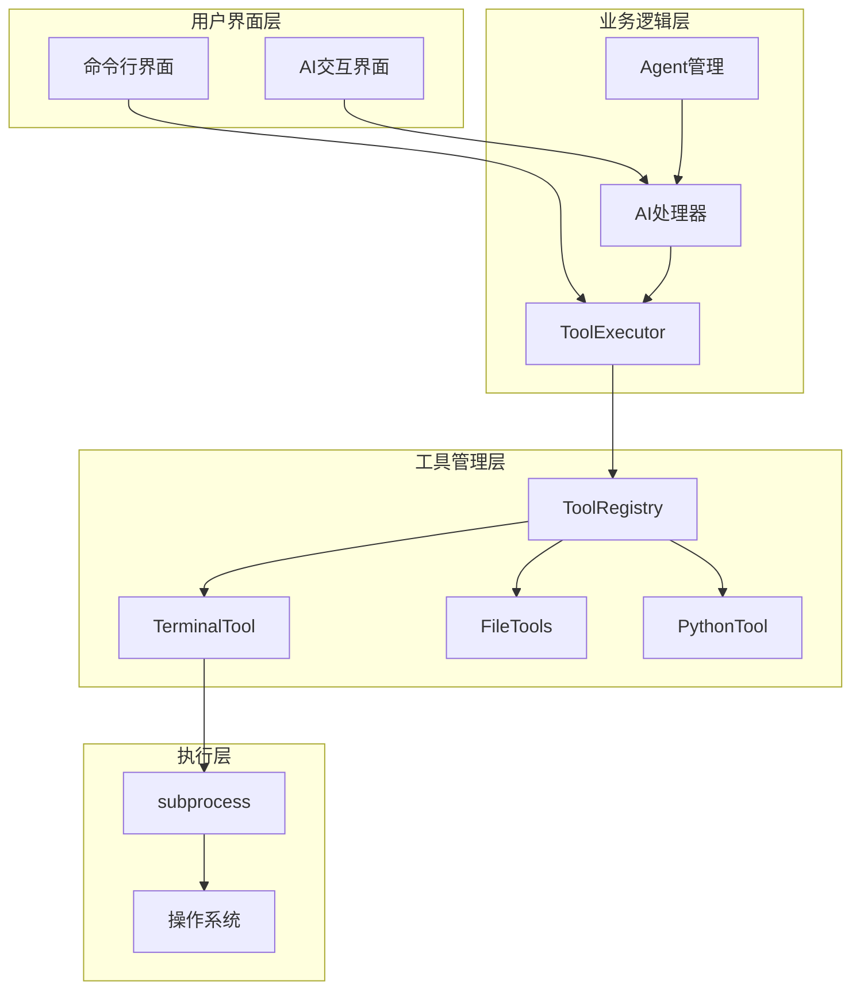

**图表来源**
- [tool_executor.py:15-32](file://cbhcli_pkg/core/tool_executor.py#L15-L32)
- [ai_handler.py:337-406](file://cbhcli_pkg/core/ai_handler.py#L337-L406)
- [agent.py:140-210](file://cbhcli_pkg/core/agent.py#L140-L210)

## 详细组件分析

### TerminalTool类实现详解

#### 类结构设计
TerminalTool继承自BaseTool抽象基类，实现了统一的工具接口规范。

**章节来源**
- [terminal.py:7-29](file://cbhcli_pkg/tools/terminal.py#L7-L29)

#### 参数配置系统
终端工具采用JSON Schema定义参数规范，确保类型安全和验证。

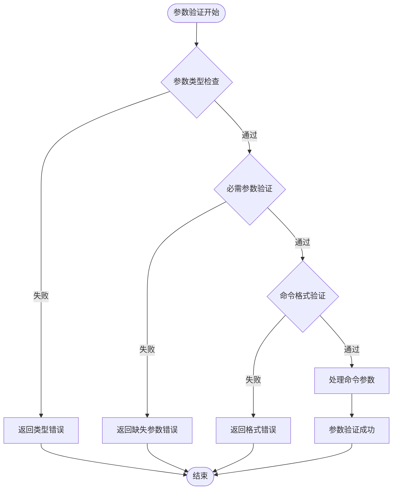

**图表来源**
- [terminal.py:18-29](file://cbhcli_pkg/tools/terminal.py#L18-L29)

#### 命令执行机制
终端工具支持多种命令执行模式，包括单命令和复合命令。

**章节来源**
- [terminal.py:31-99](file://cbhcli_pkg/tools/terminal.py#L31-L99)

#### 超时处理机制
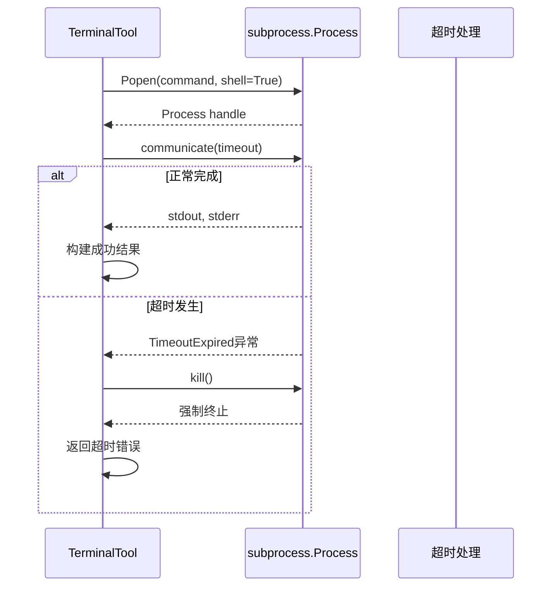

**图表来源**
- [terminal.py:48-66](file://cbhcli_pkg/tools/terminal.py#L48-L66)

**章节来源**
- [terminal.py:42-66](file://cbhcli_pkg/tools/terminal.py#L42-L66)

#### 错误处理策略
终端工具实现了多层次的错误处理机制，确保系统的稳定性和可靠性。

**章节来源**
- [terminal.py:68-99](file://cbhcli_pkg/tools/terminal.py#L68-L99)

#### 输出格式化系统
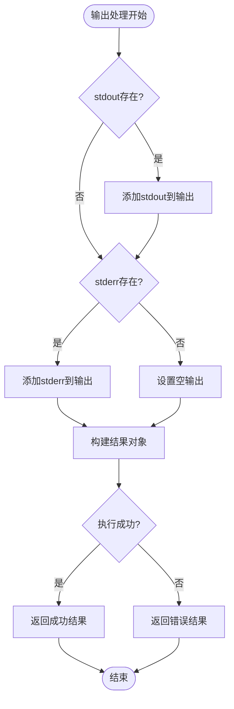

**图表来源**
- [terminal.py:68-91](file://cbhcli_pkg/tools/terminal.py#L68-L91)

**章节来源**
- [terminal.py:68-91](file://cbhcli_pkg/tools/terminal.py#L68-L91)

### ToolExecutor执行器分析

#### 用户交互确认机制
ToolExecutor实现了智能的用户确认机制，支持批量确认和详细模式。

**章节来源**
- [tool_executor.py:122-140](file://cbhcli_pkg/core/tool_executor.py#L122-L140)

#### 结果展示系统
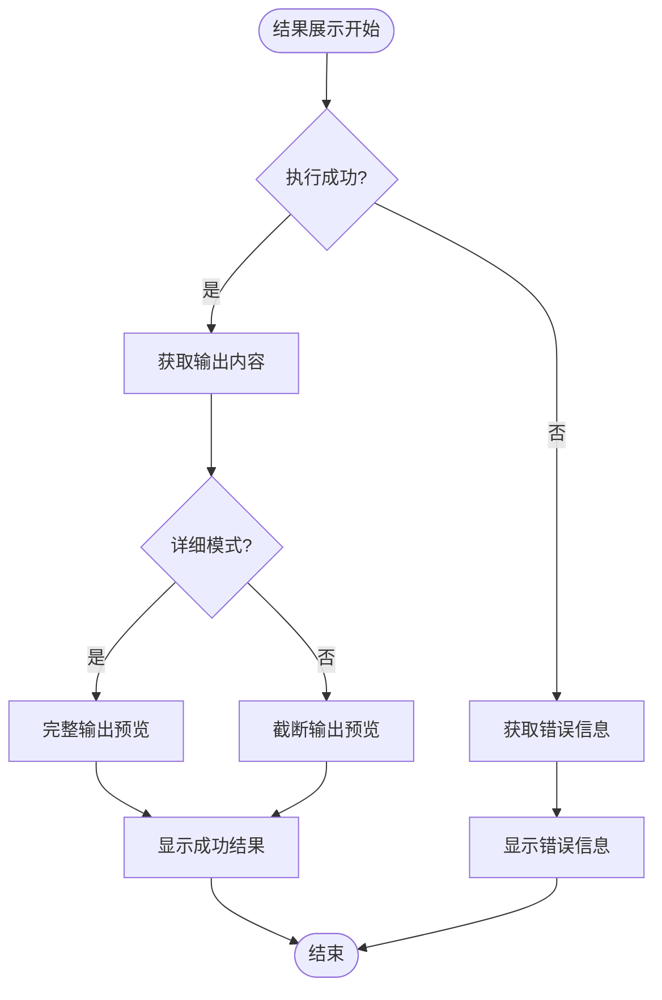

**图表来源**
- [tool_executor.py:142-159](file://cbhcli_pkg/core/tool_executor.py#L142-L159)

**章节来源**
- [tool_executor.py:142-159](file://cbhcli_pkg/core/tool_executor.py#L142-L159)

### AI集成与自动化执行

#### 工具调用格式支持
AI处理器支持多种工具调用格式，确保与不同AI模型的兼容性。

**章节来源**
- [ai_handler.py:337-406](file://cbhcli_pkg/core/ai_handler.py#L337-L406)

#### 自动命令检测机制
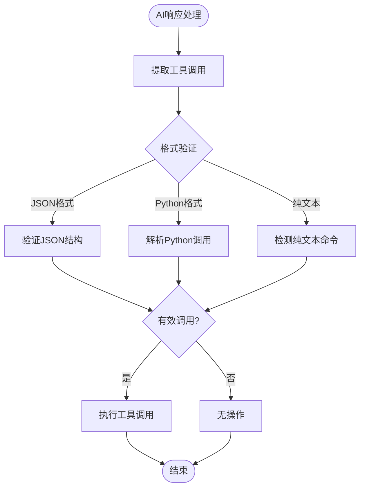

**图表来源**
- [ai_handler.py:417-499](file://cbhcli_pkg/core/ai_handler.py#L417-L499)

**章节来源**
- [ai_handler.py:417-499](file://cbhcli_pkg/core/ai_handler.py#L417-L499)

## 依赖关系分析

### 组件耦合度分析
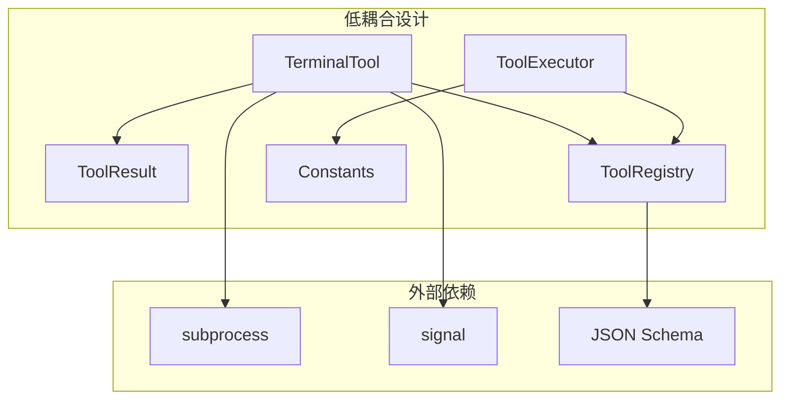

**图表来源**
- [terminal.py:2-4](file://cbhcli_pkg/tools/terminal.py#L2-L4)
- [tool_executor.py:6-12](file://cbhcli_pkg/core/tool_executor.py#L6-L12)

### 关键依赖关系
- TerminalTool依赖subprocess模块进行进程管理
- ToolExecutor依赖ToolRegistry进行工具调度
- AI处理器依赖正则表达式进行格式解析
- 所有组件共享ToolResult数据结构

**章节来源**
- [terminal.py:2-4](file://cbhcli_pkg/tools/terminal.py#L2-L4)
- [tool_executor.py:6-12](file://cbhcli_pkg/core/tool_executor.py#L6-L12)

## 性能考量

### 执行效率优化
终端工具在设计上注重性能优化，采用异步I/O和资源管理策略。

**章节来源**
- [terminal.py:48-54](file://cbhcli_pkg/tools/terminal.py#L48-L54)

### 内存使用控制
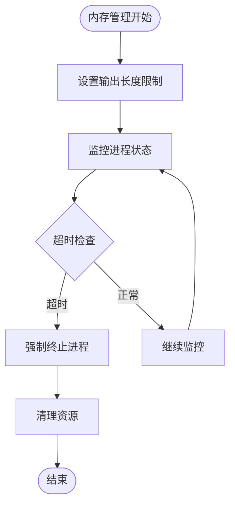

**图表来源**
- [constants.py:14-16](file://cbhcli_pkg/core/constants.py#L14-L16)

**章节来源**
- [constants.py:14-16](file://cbhcli_pkg/core/constants.py#L14-L16)

### 并发执行考虑
- 单进程模型避免了并发冲突
- 超时机制防止长时间阻塞
- 资源清理确保系统稳定性

## 故障排除指南

### 常见问题诊断

#### 命令执行失败
当命令执行失败时，系统会返回详细的错误信息和退出码。

**章节来源**
- [terminal.py:82-91](file://cbhcli_pkg/tools/terminal.py#L82-L91)

#### 超时问题处理
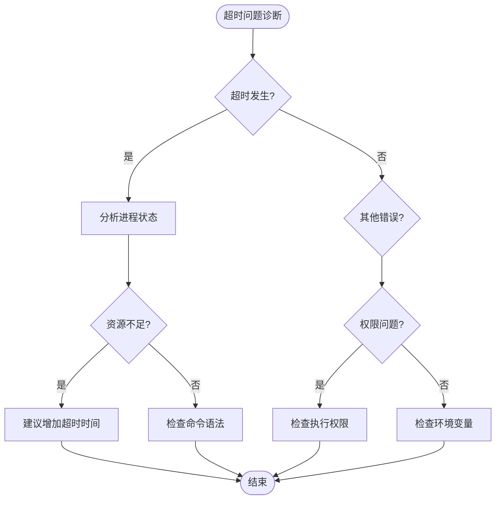

**图表来源**
- [terminal.py:58-66](file://cbhcli_pkg/tools/terminal.py#L58-L66)

#### 用户确认问题
ToolExecutor提供了灵活的确认机制，支持批量确认和跳过确认。

**章节来源**
- [tool_executor.py:122-140](file://cbhcli_pkg/core/tool_executor.py#L122-L140)

### 安全考虑与防护措施

#### 命令注入防护
终端工具通过严格的参数验证和格式控制，有效防止命令注入攻击。

**章节来源**
- [terminal.py:18-29](file://cbhcli_pkg/tools/terminal.py#L18-L29)

#### 权限控制机制
- 仅执行当前用户具有权限的命令
- 通过shell参数控制命令执行环境
- 支持超时机制防止恶意长时间占用

#### 最佳实践建议
- 避免执行危险命令（如rm -rf、shutdown等）
- 使用相对路径而非绝对路径
- 在执行前进行命令预览
- 设置合理的超时时间

## 结论
CBHCLI的终端命令执行工具通过精心设计的架构和完善的错误处理机制，为用户提供了一个安全、可靠、高效的命令执行平台。其模块化的设计理念使得工具易于扩展和维护，同时保持了良好的性能表现。通过与AI处理器的深度集成，用户可以实现智能化的命令执行和自动化操作。

## 附录

### 使用示例与最佳实践

#### 文件操作示例
- 查看目录内容：`ls -la`
- 读取文件内容：`cat /etc/passwd`
- 创建目录：`mkdir test_dir`
- 复制文件：`cp source.txt dest.txt`

#### 系统管理示例
- 查看系统信息：`uname -a`
- 监控系统资源：`top -n 1`
- 查看网络连接：`netstat -tulpn`
- 检查磁盘使用：`df -h`

#### 网络工具示例
- 测试网络连通性：`ping google.com`
- 下载文件：`curl -O https://example.com/file.txt`
- 查看DNS解析：`dig google.com`

#### Python工具集成
- 执行Python代码：`python(code="import os; print(os.getcwd())")`
- 数据处理示例：`python(code="import pandas as pd; df = pd.DataFrame({'a': [1,2], 'b': [3,4]}); print(df.describe())")`

### 配置选项
- **超时时间**：默认30秒，可根据需要调整
- **输出长度**：最大8000字符，支持详细模式
- **确认模式**：支持批量确认和跳过确认
- **颜色输出**：支持ANSI颜色编码

### 故障排除清单
- [ ] 检查命令语法和参数
- [ ] 验证文件路径和权限
- [ ] 确认网络连接状态
- [ ] 检查超时设置是否合理
- [ ] 查看详细的错误信息
- [ ] 尝试简化命令格式