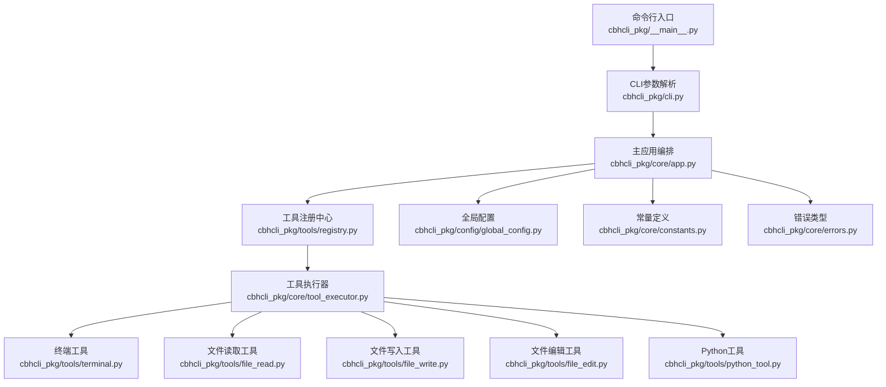
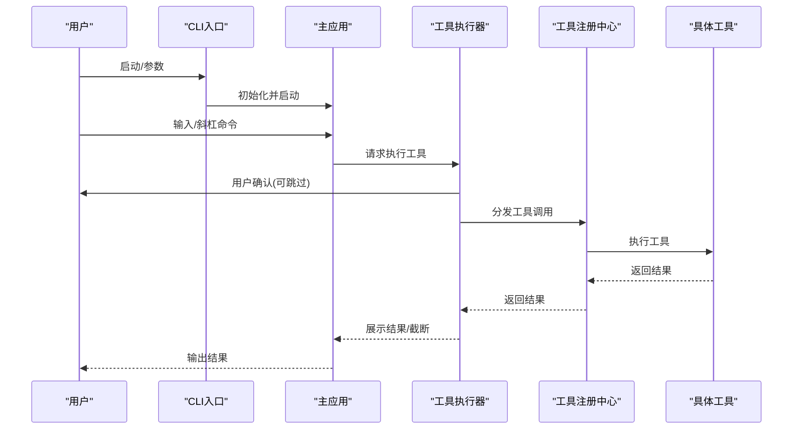
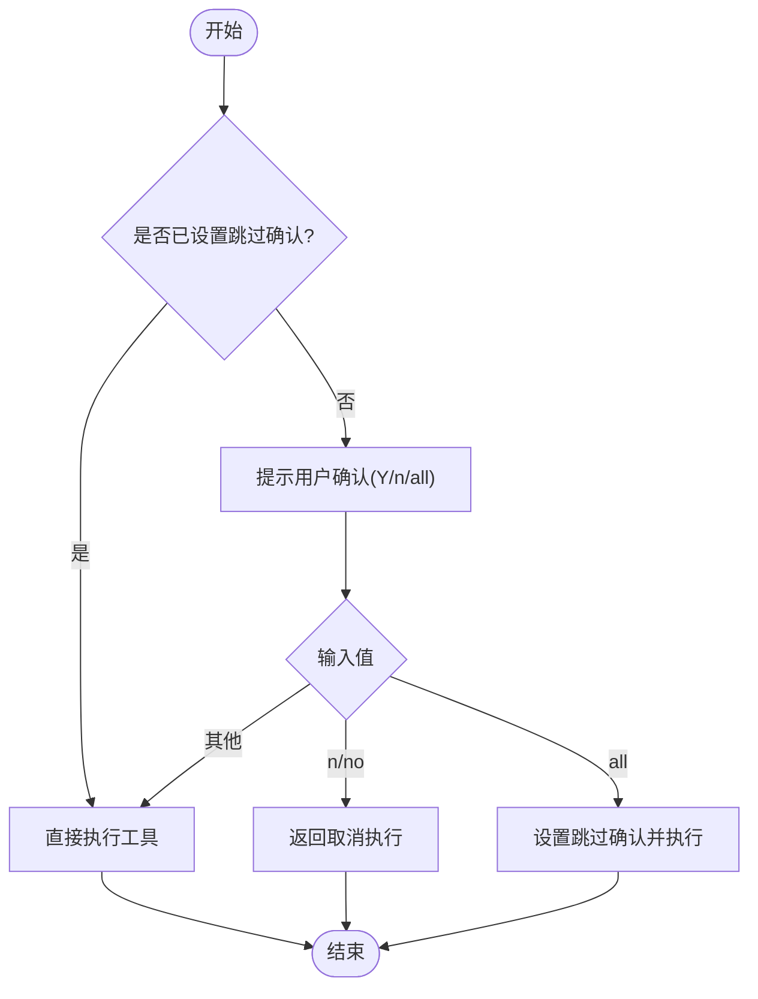
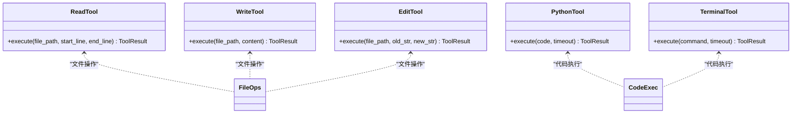
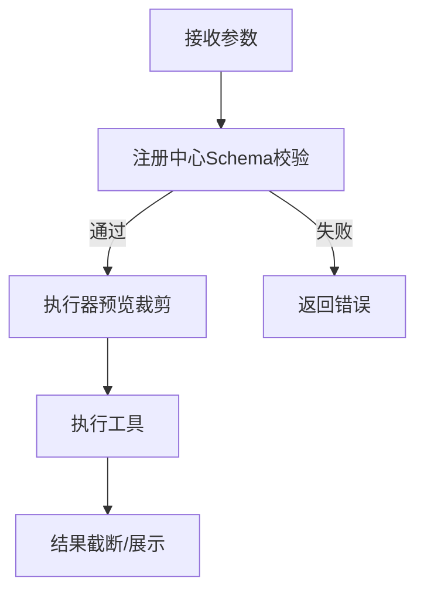
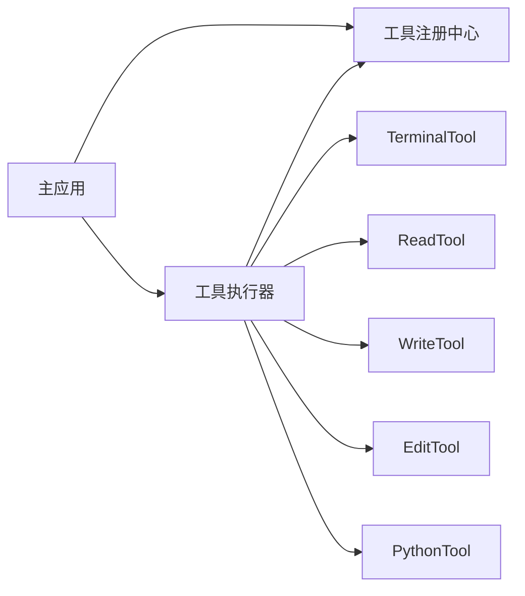

# 工具安全控制机制

<cite>
**本文引用的文件**
- [cbhcli_pkg/__main__.py](file://cbhcli_pkg/__main__.py)
- [cbhcli_pkg/cli.py](file://cbhcli_pkg/cli.py)
- [cbhcli_pkg/core/app.py](file://cbhcli_pkg/core/app.py)
- [cbhcli_pkg/core/tool_executor.py](file://cbhcli_pkg/core/tool_executor.py)
- [cbhcli_pkg/tools/registry.py](file://cbhcli_pkg/tools/registry.py)
- [cbhcli_pkg/tools/terminal.py](file://cbhcli_pkg/tools/terminal.py)
- [cbhcli_pkg/tools/python_tool.py](file://cbhcli_pkg/tools/python_tool.py)
- [cbhcli_pkg/tools/file_read.py](file://cbhcli_pkg/tools/file_read.py)
- [cbhcli_pkg/tools/file_write.py](file://cbhcli_pkg/tools/file_write.py)
- [cbhcli_pkg/tools/file_edit.py](file://cbhcli_pkg/tools/file_edit.py)
- [cbhcli_pkg/config/global_config.py](file://cbhcli_pkg/config/global_config.py)
- [cbhcli_pkg/core/constants.py](file://cbhcli_pkg/core/constants.py)
- [cbhcli_pkg/core/errors.py](file://cbhcli_pkg/core/errors.py)
- [README.md](file://README.md)
</cite>

## 目录
1. [简介](#简介)
2. [项目结构](#项目结构)
3. [核心组件](#核心组件)
4. [架构总览](#架构总览)
5. [详细组件分析](#详细组件分析)
6. [依赖分析](#依赖分析)
7. [性能考虑](#性能考虑)
8. [故障排查指南](#故障排查指南)
9. [结论](#结论)
10. [附录](#附录)

## 简介
本文件围绕CBHCLI工具的安全控制机制展开，系统性梳理其在用户确认、执行权限与操作限制、参数验证与过滤、沙箱隔离与资源限制、日志审计与追踪等方面的实现现状与改进建议。文档同时提供最佳实践与安全加固建议，并给出常见威胁的防范与应急响应方案，帮助开发者与用户建立完整、可靠的安全理解与保障。

## 项目结构
CBHCLI采用分层模块化设计，核心入口负责参数解析与应用启动；核心应用负责Agent/会话/工具链编排；工具层提供具体能力（终端命令、文件读写、Python执行等），并通过统一注册中心与执行器进行调度与展示。

图示来源
- [cbhcli_pkg/__main__.py:1-7](file://cbhcli_pkg/__main__.py#L1-L7)
- [cbhcli_pkg/cli.py:73-112](file://cbhcli_pkg/cli.py#L73-L112)
- [cbhcli_pkg/core/app.py:54-380](file://cbhcli_pkg/core/app.py#L54-L380)
- [cbhcli_pkg/tools/registry.py:51-115](file://cbhcli_pkg/tools/registry.py#L51-L115)
- [cbhcli_pkg/core/tool_executor.py:15-168](file://cbhcli_pkg/core/tool_executor.py#L15-L168)
- [cbhcli_pkg/tools/terminal.py:7-99](file://cbhcli_pkg/tools/terminal.py#L7-L99)
- [cbhcli_pkg/tools/file_read.py:6-125](file://cbhcli_pkg/tools/file_read.py#L6-L125)
- [cbhcli_pkg/tools/file_write.py:6-83](file://cbhcli_pkg/tools/file_write.py#L6-L83)
- [cbhcli_pkg/tools/file_edit.py:6-134](file://cbhcli_pkg/tools/file_edit.py#L6-L134)
- [cbhcli_pkg/tools/python_tool.py:127-207](file://cbhcli_pkg/tools/python_tool.py#L127-L207)
- [cbhcli_pkg/config/global_config.py:13-154](file://cbhcli_pkg/config/global_config.py#L13-L154)
- [cbhcli_pkg/core/constants.py:1-50](file://cbhcli_pkg/core/constants.py#L1-L50)
- [cbhcli_pkg/core/errors.py:4-32](file://cbhcli_pkg/core/errors.py#L4-L32)

章节来源
- [cbhcli_pkg/__main__.py:1-7](file://cbhcli_pkg/__main__.py#L1-L7)
- [cbhcli_pkg/cli.py:73-112](file://cbhcli_pkg/cli.py#L73-L112)
- [cbhcli_pkg/core/app.py:54-380](file://cbhcli_pkg/core/app.py#L54-L380)
- [README.md:269-295](file://README.md#L269-L295)

## 核心组件
- CLI入口与参数解析：负责版本/帮助输出、未知参数拦截与应用启动。
- 主应用编排：初始化配置、工具系统、向量存储、命令系统、UI与Agent生命周期管理。
- 工具注册中心：统一管理工具注册、参数Schema校验与执行分发。
- 工具执行器：提供用户确认、执行前后展示、结果截断与回调。
- 工具实现：终端命令、文件读写/编辑、Python代码执行等。
- 配置与常量：全局配置持久化、上下文与工具输出限制常量。
- 错误体系：统一异常类型，便于上层捕获与处理。

章节来源
- [cbhcli_pkg/cli.py:73-112](file://cbhcli_pkg/cli.py#L73-L112)
- [cbhcli_pkg/core/app.py:73-180](file://cbhcli_pkg/core/app.py#L73-L180)
- [cbhcli_pkg/tools/registry.py:51-115](file://cbhcli_pkg/tools/registry.py#L51-L115)
- [cbhcli_pkg/core/tool_executor.py:15-168](file://cbhcli_pkg/core/tool_executor.py#L15-L168)
- [cbhcli_pkg/config/global_config.py:13-154](file://cbhcli_pkg/config/global_config.py#L13-L154)
- [cbhcli_pkg/core/constants.py:1-50](file://cbhcli_pkg/core/constants.py#L1-L50)
- [cbhcli_pkg/core/errors.py:4-32](file://cbhcli_pkg/core/errors.py#L4-L32)

## 架构总览
CBHCLI的安全控制贯穿“输入—确认—执行—输出”全链路。整体流程如下：

图示来源
- [cbhcli_pkg/cli.py:73-112](file://cbhcli_pkg/cli.py#L73-L112)
- [cbhcli_pkg/core/app.py:386-421](file://cbhcli_pkg/core/app.py#L386-L421)
- [cbhcli_pkg/core/tool_executor.py:42-91](file://cbhcli_pkg/core/tool_executor.py#L42-L91)
- [cbhcli_pkg/tools/registry.py:70-96](file://cbhcli_pkg/tools/registry.py#L70-L96)

## 详细组件分析

### 用户确认机制
- 工具执行器在执行前提供交互式确认，支持“全部跳过确认”“拒绝执行”等选项。
- 确认逻辑对EOF/中断进行健壮处理，避免异常退出。
- “全部跳过确认”模式适合批量执行场景，但需谨慎使用。

图示来源
- [cbhcli_pkg/core/tool_executor.py:122-140](file://cbhcli_pkg/core/tool_executor.py#L122-L140)

章节来源
- [cbhcli_pkg/core/tool_executor.py:122-140](file://cbhcli_pkg/core/tool_executor.py#L122-L140)

### 执行权限控制与操作限制
- 文件工具对路径进行家目录展开与存在性/类型检查，避免越权访问与目录遍历风险。
- Python工具通过会话隔离与内置模块白名单，降低任意代码执行风险。
- 终端工具支持超时控制，避免长时间阻塞。

图示来源
- [cbhcli_pkg/tools/file_read.py:38-125](file://cbhcli_pkg/tools/file_read.py#L38-L125)
- [cbhcli_pkg/tools/file_write.py:34-83](file://cbhcli_pkg/tools/file_write.py#L34-L83)
- [cbhcli_pkg/tools/file_edit.py:38-134](file://cbhcli_pkg/tools/file_edit.py#L38-L134)
- [cbhcli_pkg/tools/python_tool.py:127-207](file://cbhcli_pkg/tools/python_tool.py#L127-L207)
- [cbhcli_pkg/tools/terminal.py:31-99](file://cbhcli_pkg/tools/terminal.py#L31-L99)

章节来源
- [cbhcli_pkg/tools/file_read.py:38-125](file://cbhcli_pkg/tools/file_read.py#L38-L125)
- [cbhcli_pkg/tools/file_write.py:34-83](file://cbhcli_pkg/tools/file_write.py#L34-L83)
- [cbhcli_pkg/tools/file_edit.py:38-134](file://cbhcli_pkg/tools/file_edit.py#L38-L134)
- [cbhcli_pkg/tools/python_tool.py:127-207](file://cbhcli_pkg/tools/python_tool.py#L127-L207)
- [cbhcli_pkg/tools/terminal.py:31-99](file://cbhcli_pkg/tools/terminal.py#L31-L99)

### 参数安全验证与过滤
- 工具注册中心提供JSON Schema参数定义，用于描述工具参数与必填项。
- 工具执行器在展示阶段对终端命令进行预览裁剪，避免敏感参数泄露。
- 文件工具对路径进行展开与存在性检查，减少误用风险。

图示来源
- [cbhcli_pkg/tools/registry.py:16-49](file://cbhcli_pkg/tools/registry.py#L16-L49)
- [cbhcli_pkg/core/tool_executor.py:106-121](file://cbhcli_pkg/core/tool_executor.py#L106-L121)
- [cbhcli_pkg/tools/file_read.py:51-70](file://cbhcli_pkg/tools/file_read.py#L51-L70)

章节来源
- [cbhcli_pkg/tools/registry.py:16-49](file://cbhcli_pkg/tools/registry.py#L16-L49)
- [cbhcli_pkg/core/tool_executor.py:106-121](file://cbhcli_pkg/core/tool_executor.py#L106-L121)
- [cbhcli_pkg/tools/file_read.py:51-70](file://cbhcli_pkg/tools/file_read.py#L51-L70)

### 沙箱隔离与资源限制
- 终端工具：支持超时控制，超时后强制终止子进程，避免长时间占用。
- Python工具：通过会话隔离与内置模块白名单，限制可访问的标准库；当前未实现CPU/内存硬限制。
- 文件工具：严格路径检查与类型检查，避免目录穿越与非文件对象操作。

章节来源
- [cbhcli_pkg/tools/terminal.py:31-99](file://cbhcli_pkg/tools/terminal.py#L31-L99)
- [cbhcli_pkg/tools/python_tool.py:8-102](file://cbhcli_pkg/tools/python_tool.py#L8-L102)
- [cbhcli_pkg/tools/file_read.py:51-70](file://cbhcli_pkg/tools/file_read.py#L51-L70)

### 日志审计与追踪
- 工具执行器对每次调用进行展示与结果输出，支持详细/简洁两种模式。
- 常量中定义了工具输出截断长度，有助于控制日志体量。
- 会话历史自动保存到history目录，便于事后追溯。

章节来源
- [cbhcli_pkg/core/tool_executor.py:93-159](file://cbhcli_pkg/core/tool_executor.py#L93-L159)
- [cbhcli_pkg/core/constants.py:13-17](file://cbhcli_pkg/core/constants.py#L13-L17)
- [cbhcli_pkg/core/app.py:291-297](file://cbhcli_pkg/core/app.py#L291-L297)

## 依赖分析
- 组件耦合度：工具执行器依赖注册中心；主应用依赖工具注册中心与执行器；各工具实现彼此解耦。
- 外部依赖：subprocess用于终端命令执行；Pathlib用于文件路径处理；json/tiktoken等可选依赖用于向量与计数。
- 潜在风险：终端工具依赖shell执行，存在注入风险；Python工具执行动态代码，需进一步限制。

图示来源
- [cbhcli_pkg/core/app.py:85-96](file://cbhcli_pkg/core/app.py#L85-L96)
- [cbhcli_pkg/core/tool_executor.py:24-52](file://cbhcli_pkg/core/tool_executor.py#L24-L52)
- [cbhcli_pkg/tools/registry.py:54-69](file://cbhcli_pkg/tools/registry.py#L54-L69)

章节来源
- [cbhcli_pkg/core/app.py:85-96](file://cbhcli_pkg/core/app.py#L85-L96)
- [cbhcli_pkg/core/tool_executor.py:24-52](file://cbhcli_pkg/core/tool_executor.py#L24-L52)
- [cbhcli_pkg/tools/registry.py:54-69](file://cbhcli_pkg/tools/registry.py#L54-L69)

## 性能考虑
- 工具输出截断与预览：通过常量控制最大输出长度与预览长度，避免大输出影响交互体验与内存占用。
- 自动上下文压缩：当接近模型上下文阈值时自动压缩，降低LLM调用成本。
- 超时控制：终端工具超时机制避免长时间阻塞，提升系统稳定性。

章节来源
- [cbhcli_pkg/core/constants.py:13-17](file://cbhcli_pkg/core/constants.py#L13-L17)
- [cbhcli_pkg/core/app.py:361-385](file://cbhcli_pkg/core/app.py#L361-L385)
- [cbhcli_pkg/tools/terminal.py:56-66](file://cbhcli_pkg/tools/terminal.py#L56-L66)

## 故障排查指南
- 未知参数：CLI对未知参数进行拦截并打印帮助信息，退出码为1。
- 工具执行失败：工具注册中心捕获异常并返回标准化错误信息。
- Python执行异常：捕获标准输出/错误流，构造统一错误输出。
- 终端超时：超时后返回失败结果并包含超时信息。
- 文件读取编码错误：对非UTF-8文件返回明确错误提示。

章节来源
- [cbhcli_pkg/cli.py:96-99](file://cbhcli_pkg/cli.py#L96-L99)
- [cbhcli_pkg/tools/registry.py:89-96](file://cbhcli_pkg/tools/registry.py#L89-L96)
- [cbhcli_pkg/tools/python_tool.py:93-101](file://cbhcli_pkg/tools/python_tool.py#L93-L101)
- [cbhcli_pkg/tools/terminal.py:58-66](file://cbhcli_pkg/tools/terminal.py#L58-L66)
- [cbhcli_pkg/tools/file_read.py:113-118](file://cbhcli_pkg/tools/file_read.py#L113-L118)

## 结论
CBHCLI在用户确认、参数Schema定义、文件路径安全与终端超时方面具备基础安全能力。建议在Python工具层面引入更严格的沙箱与资源限制，在终端工具层面增加命令白名单与参数转义策略，并完善日志审计与异常上报机制，以满足更严苛的安全需求。

## 附录

### 安全配置最佳实践
- 严格最小权限：工具执行应限定在受控工作空间，避免跨目录访问。
- 参数白名单：对终端命令与文件操作参数实施白名单与转义策略。
- 超时与配额：为所有外部执行设置合理超时与调用配额。
- 日志脱敏：对日志中的敏感参数进行脱敏处理。
- 配置加密：敏感配置（如API Key）建议加密存储与访问控制。

### 常见威胁与应急响应
- 命令注入：通过参数转义与白名单、禁用危险Shell特性缓解。
- 任意代码执行：Python工具应限制可导入模块与IO能力，必要时引入容器/沙箱。
- 资源耗尽：设置CPU/内存/文件句柄上限，超限时强制终止。
- 数据泄露：对输出进行截断与脱敏，限制日志留存周期。
- 应急响应：建立异常告警、自动降级与快速回滚机制。