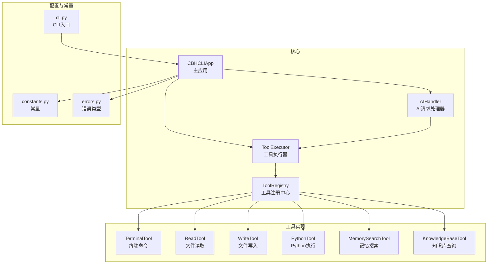
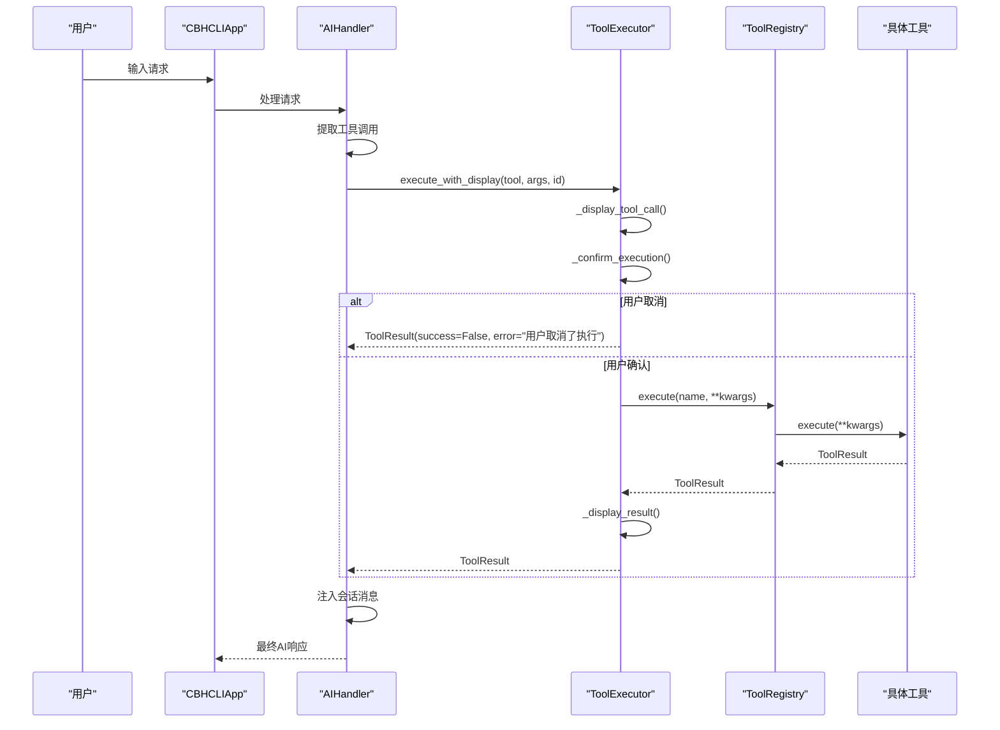
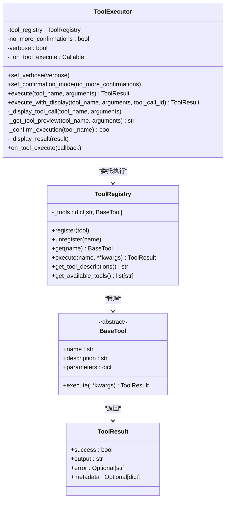
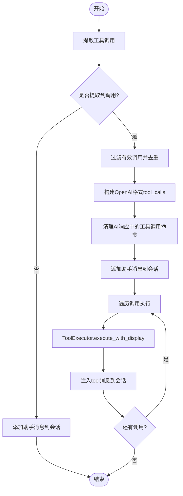
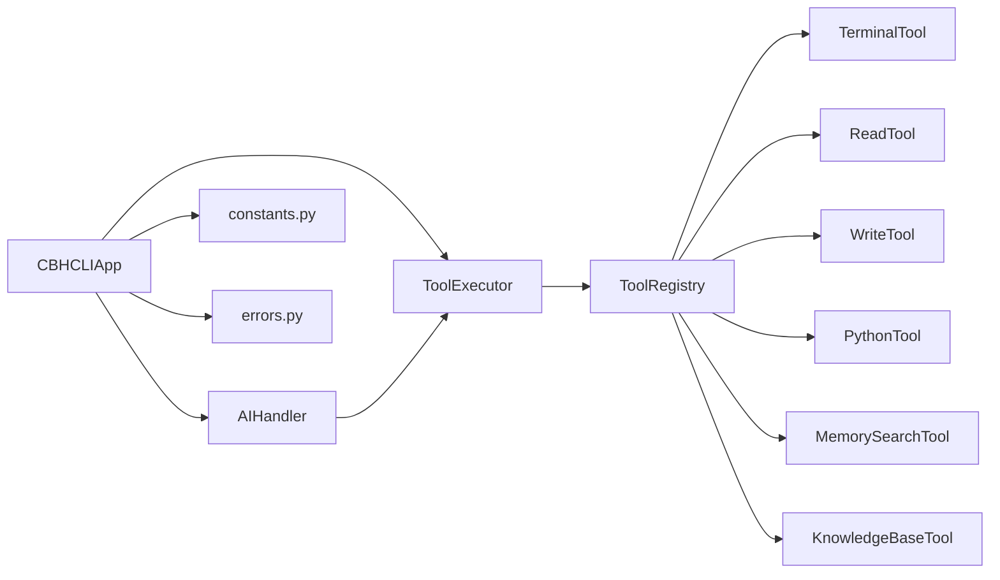

# 工具执行调度机制

<cite>
**本文引用的文件**
- [tool_executor.py](file://cbhcli_pkg/core/tool_executor.py)
- [registry.py](file://cbhcli_pkg/tools/registry.py)
- [app.py](file://cbhcli_pkg/core/app.py)
- [ai_handler.py](file://cbhcli_pkg/core/ai_handler.py)
- [constants.py](file://cbhcli_pkg/core/constants.py)
- [errors.py](file://cbhcli_pkg/core/errors.py)
- [terminal.py](file://cbhcli_pkg/tools/terminal.py)
- [file_read.py](file://cbhcli_pkg/tools/file_read.py)
- [file_write.py](file://cbhcli_pkg/tools/file_write.py)
- [python_tool.py](file://cbhcli_pkg/tools/python_tool.py)
- [memory_search.py](file://cbhcli_pkg/tools/memory_search.py)
- [knowledge_base.py](file://cbhcli_pkg/tools/knowledge_base.py)
- [cli.py](file://cbhcli_pkg/cli.py)
</cite>

## 目录
1. [简介](#简介)
2. [项目结构](#项目结构)
3. [核心组件](#核心组件)
4. [架构总览](#架构总览)
5. [详细组件分析](#详细组件分析)
6. [依赖关系分析](#依赖关系分析)
7. [性能考量](#性能考量)
8. [故障排查指南](#故障排查指南)
9. [结论](#结论)
10. [附录](#附录)

## 简介
本文件深入解析CBHCLI工具执行调度机制，重点围绕ToolExecutor类的执行流程与调度策略展开，涵盖工具调用确认机制、执行前验证与执行后处理；工具执行生命周期管理（参数传递、执行状态跟踪、结果收集）；安全控制机制（用户确认流程、权限验证与执行限制）；错误处理策略（异常捕获、错误传播与恢复机制）；以及显示与日志记录机制（执行预览、结果格式化与调试输出）。同时提供并发执行控制、资源管理与性能优化建议，并给出具体代码示例路径，帮助开发者正确配置与使用执行器。

## 项目结构
CBHCLI采用模块化设计，核心执行调度位于core子包，工具实现位于tools子包，应用入口与命令系统位于根目录。关键文件如下：
- 执行器与工具注册：core/tool_executor.py、tools/registry.py
- 应用主流程：core/app.py、core/ai_handler.py
- 常量与错误：core/constants.py、core/errors.py
- 工具实现：tools/terminal.py、tools/file_read.py、tools/file_write.py、tools/python_tool.py、tools/memory_search.py、tools/knowledge_base.py
- CLI入口与帮助：cli.py

图表来源
- [app.py:85-96](file://cbhcli_pkg/core/app.py#L85-L96)
- [tool_executor.py:24](file://cbhcli_pkg/core/tool_executor.py#L24-L32)
- [registry.py:51-69](file://cbhcli_pkg/tools/registry.py#L51-L69)
- [ai_handler.py:31-49](file://cbhcli_pkg/core/ai_handler.py#L31-L49)

章节来源
- [app.py:85-96](file://cbhcli_pkg/core/app.py#L85-L96)
- [cli.py:73-112](file://cbhcli_pkg/cli.py#L73-L112)

## 核心组件
- ToolExecutor：负责工具调用的确认、执行、结果显示与回调通知，提供简洁/详细两种显示模式与“全部确认”跳过机制。
- ToolRegistry：统一管理工具注册、查找与执行，封装异常捕获与未知工具处理。
- BaseTool：抽象工具接口，定义name/description/parameters/execute规范。
- ToolResult：标准化工具执行结果，包含success、output、error、metadata。
- AIHandler：多轮工具调用协调者，负责从LLM响应中提取工具调用、执行工具并将结果注入会话。
- CBHCLIApp：应用初始化与UI交互，集成工具注册与执行器配置。

章节来源
- [tool_executor.py:15-91](file://cbhcli_pkg/core/tool_executor.py#L15-L91)
- [registry.py:7-14](file://cbhcli_pkg/tools/registry.py#L7-L14)
- [registry.py:16-48](file://cbhcli_pkg/tools/registry.py#L16-L48)
- [ai_handler.py:21-97](file://cbhcli_pkg/core/ai_handler.py#L21-L97)
- [app.py:85-96](file://cbhcli_pkg/core/app.py#L85-L96)

## 架构总览
工具执行调度的整体流程如下：
- 用户输入经AIHandler解析，提取工具调用；
- AIHandler将工具调用交给ToolExecutor；
- ToolExecutor执行前进行用户确认（可跳过），执行后显示结果并触发回调；
- ToolExecutor委托ToolRegistry执行具体工具；
- 工具执行结果通过ToolResult返回，AIHandler将其注入会话并继续多轮对话。

图表来源
- [ai_handler.py:664-735](file://cbhcli_pkg/core/ai_handler.py#L664-L735)
- [tool_executor.py:54-91](file://cbhcli_pkg/core/tool_executor.py#L54-L91)
- [registry.py:70-97](file://cbhcli_pkg/tools/registry.py#L70-L97)

## 详细组件分析

### ToolExecutor 类分析
- 职责与能力
  - 工具调用确认：支持“全部确认”跳过，避免重复确认。
  - 执行前显示：打印工具名称与参数预览，支持详细模式。
  - 执行后处理：截断输出长度、格式化结果、区分成功/失败。
  - 回调通知：执行完成后回调，便于外部统计与日志。
- 关键方法
  - execute_with_display：完整执行流程，包含确认、执行、显示与回调。
  - _confirm_execution：用户确认逻辑，支持all跳过。
  - _display_tool_call/_display_result：彩色输出与长度控制。
  - on_tool_execute：设置回调。
- 生命周期管理
  - 参数传递：通过字典kwargs传入工具，支持多种参数命名（如terminal的command）。
  - 执行状态：通过ToolResult的success字段跟踪。
  - 结果收集：统一返回ToolResult，便于上层处理。
- 安全控制
  - 用户确认：默认逐个确认，支持all一键跳过。
  - 输出截断：通过常量控制最大输出长度，避免过大输出影响性能。
- 错误处理
  - ToolExecutor本身不抛异常，将错误封装进ToolResult。
  - ToolRegistry捕获工具执行异常并返回错误结果。
- 显示与日志
  - 彩色ANSI输出，区分工具名、命令、结果与错误。
  - 详细模式显示完整参数，简洁模式显示预览。

图表来源
- [tool_executor.py:15-168](file://cbhcli_pkg/core/tool_executor.py#L15-L168)
- [registry.py:51-115](file://cbhcli_pkg/tools/registry.py#L51-L115)
- [registry.py:16-48](file://cbhcli_pkg/tools/registry.py#L16-L48)
- [registry.py:7-14](file://cbhcli_pkg/tools/registry.py#L7-L14)

章节来源
- [tool_executor.py:42-91](file://cbhcli_pkg/core/tool_executor.py#L42-L91)
- [tool_executor.py:93-160](file://cbhcli_pkg/core/tool_executor.py#L93-L160)

### ToolRegistry 与工具基类
- ToolRegistry
  - 提供注册、注销、获取工具与执行工具的统一入口。
  - 执行时若工具不存在，返回未知工具错误；捕获工具执行异常并封装为ToolResult。
- BaseTool
  - 规范工具接口：name、description、parameters、execute。
  - 所有具体工具需实现该接口，确保统一的参数校验与执行协议。
- ToolResult
  - 标准化结果结构，便于上层统一处理成功/失败与元数据。

章节来源
- [registry.py:51-115](file://cbhcli_pkg/tools/registry.py#L51-L115)
- [registry.py:16-48](file://cbhcli_pkg/tools/registry.py#L16-L48)
- [registry.py:7-14](file://cbhcli_pkg/tools/registry.py#L7-L14)

### AIHandler 的工具调用提取与执行
- 工具调用提取
  - 支持多种格式：DSML标签、Python函数调用、JSON格式、纯文本命令（多轮工具调用后自动包装）。
  - 严格验证工具存在性与参数有效性，避免误判示例代码。
- 执行与注入
  - 为每个工具调用生成唯一ID，构建OpenAI格式的tool_calls数组。
  - 执行前清理AI响应中的工具调用命令，仅保留解释性文字。
  - 将工具执行结果作为tool角色消息注入会话，支持多轮继续。
- 多轮控制
  - 通过常量限制最大工具调用轮数，防止无限循环。

图表来源
- [ai_handler.py:264-735](file://cbhcli_pkg/core/ai_handler.py#L264-L735)

章节来源
- [ai_handler.py:264-735](file://cbhcli_pkg/core/ai_handler.py#L264-L735)

### 具体工具实现要点
- TerminalTool
  - 支持超时控制与命令拆分显示，失败时返回详细错误信息。
- ReadTool/WriteTool
  - 文件路径展开与存在性检查，行范围选择与编码处理。
- PythonTool
  - 会话变量记忆，全局会话池管理，异常捕获与输出分离。
- MemorySearchTool/KnowledgeBaseTool
  - 向量检索与降级方案，支持重排序客户端增强相关性。

章节来源
- [terminal.py:31-99](file://cbhcli_pkg/tools/terminal.py#L31-L99)
- [file_read.py:38-125](file://cbhcli_pkg/tools/file_read.py#L38-L125)
- [file_write.py:34-83](file://cbhcli_pkg/tools/file_write.py#L34-L83)
- [python_tool.py:108-207](file://cbhcli_pkg/tools/python_tool.py#L108-L207)
- [memory_search.py:47-177](file://cbhcli_pkg/tools/memory_search.py#L47-L177)
- [knowledge_base.py:49-157](file://cbhcli_pkg/tools/knowledge_base.py#L49-L157)

## 依赖关系分析
- 组件耦合
  - ToolExecutor依赖ToolRegistry进行工具执行，耦合度低，职责清晰。
  - AIHandler依赖ToolExecutor进行工具执行，同时负责格式提取与会话注入。
  - CBHCLIApp负责初始化工具注册与执行器，桥接UI与核心逻辑。
- 外部依赖
  - ANSI颜色常量用于输出美化。
  - 子进程执行终端命令，文件系统访问与Python解释器会话。
- 循环依赖
  - 未发现循环依赖，模块间关系清晰。

图表来源
- [app.py:85-96](file://cbhcli_pkg/core/app.py#L85-L96)
- [tool_executor.py:24](file://cbhcli_pkg/core/tool_executor.py#L24-L32)
- [ai_handler.py:31-49](file://cbhcli_pkg/core/ai_handler.py#L31-L49)
- [registry.py:51-69](file://cbhcli_pkg/tools/registry.py#L51-L69)

章节来源
- [app.py:85-96](file://cbhcli_pkg/core/app.py#L85-L96)
- [ai_handler.py:31-49](file://cbhcli_pkg/core/ai_handler.py#L31-L49)
- [tool_executor.py:24](file://cbhcli_pkg/core/tool_executor.py#L24-L32)

## 性能考量
- 输出截断与预览
  - 通过常量控制最大输出长度与预览长度，避免大输出影响渲染与传输。
- 超时控制
  - 终端命令执行设置超时，防止长时间阻塞。
- 会话压缩
  - 上下文窗口与压缩策略在应用层实现，减少LLM调用成本。
- 并发与资源
  - 工具执行为同步阻塞，Python会话池按会话ID隔离，避免跨会话污染。
  - 建议：若需并发，可在ToolExecutor层面引入线程池或异步队列，但需谨慎处理共享资源（如文件系统、网络）。

章节来源
- [constants.py:13-16](file://cbhcli_pkg/core/constants.py#L13-L16)
- [terminal.py:57-66](file://cbhcli_pkg/tools/terminal.py#L57-L66)
- [app.py:361-385](file://cbhcli_pkg/core/app.py#L361-L385)

## 故障排查指南
- 工具未找到
  - 现象：执行返回未知工具错误。
  - 排查：确认工具是否已注册，名称是否正确。
- 执行失败
  - 现象：ToolResult.success为False，error包含详细信息。
  - 排查：查看工具内部异常与返回的错误字符串，检查参数合法性与环境权限。
- 用户取消
  - 现象：确认阶段返回False。
  - 排查：检查确认模式与输入，必要时使用“all”跳过确认。
- 输出过长
  - 现象：结果被截断。
  - 排查：调整显示模式或增大允许的最大输出长度（谨慎使用）。
- 权限问题
  - 现象：文件读写失败或命令执行失败。
  - 排查：检查路径、权限与命令可用性。

章节来源
- [registry.py:81-96](file://cbhcli_pkg/tools/registry.py#L81-L96)
- [tool_executor.py:74-82](file://cbhcli_pkg/core/tool_executor.py#L74-L82)
- [constants.py:13-16](file://cbhcli_pkg/core/constants.py#L13-L16)

## 结论
ToolExecutor作为CBHCLI工具执行调度的核心，通过清晰的确认机制、统一的结果封装与灵活的显示策略，实现了安全可控的工具执行流程。配合AIHandler的多轮工具调用提取与注入，形成了完整的“请求-工具调用-执行-反馈”的闭环。开发者可基于此框架扩展更多工具，同时遵循参数规范、异常处理与安全控制原则，确保系统的稳定性与可维护性。

## 附录

### 工具执行调度使用示例（代码路径）
- 初始化工具注册与执行器
  - [app.py:85-96](file://cbhcli_pkg/core/app.py#L85-L96)
- 设置详细/简洁显示模式
  - [app.py:190-197](file://cbhcli_pkg/core/app.py#L190-L197)
- 执行工具（带确认与显示）
  - [tool_executor.py:54-91](file://cbhcli_pkg/core/tool_executor.py#L54-L91)
- 设置执行回调
  - [tool_executor.py:161-168](file://cbhcli_pkg/core/tool_executor.py#L161-L168)
- AIHandler提取与执行工具调用
  - [ai_handler.py:664-735](file://cbhcli_pkg/core/ai_handler.py#L664-L735)

### 安全控制与权限验证
- 用户确认流程
  - [tool_executor.py:122-140](file://cbhcli_pkg/core/tool_executor.py#L122-L140)
- 工具参数校验
  - 工具基类要求实现parameters，具体工具在execute中进一步校验（如文件存在性、路径展开）。
  - [registry.py:32-35](file://cbhcli_pkg/tools/registry.py#L32-L35)
  - [file_read.py:51-69](file://cbhcli_pkg/tools/file_read.py#L51-L69)
  - [file_write.py:45-57](file://cbhcli_pkg/tools/file_write.py#L45-L57)
- 执行限制
  - 终端命令超时控制与输出截断。
  - [terminal.py:57-66](file://cbhcli_pkg/tools/terminal.py#L57-L66)
  - [constants.py:13-16](file://cbhcli_pkg/core/constants.py#L13-L16)

### 错误处理策略
- 异常捕获与传播
  - ToolRegistry捕获工具执行异常并封装为ToolResult。
  - [registry.py:89-96](file://cbhcli_pkg/tools/registry.py#L89-L96)
- 恢复机制
  - AIHandler在多轮工具调用中持续尝试，直到达到最大轮数或无工具调用。
  - [ai_handler.py:68-96](file://cbhcli_pkg/core/ai_handler.py#L68-L96)

### 显示与日志记录
- 执行预览
  - [tool_executor.py:93-105](file://cbhcli_pkg/core/tool_executor.py#L93-L105)
- 结果格式化
  - [tool_executor.py:142-159](file://cbhcli_pkg/core/tool_executor.py#L142-L159)
- 调试输出
  - AIHandler在多轮工具调用中输出格式提示与调试信息。
  - [ai_handler.py:108-132](file://cbhcli_pkg/core/ai_handler.py#L108-L132)