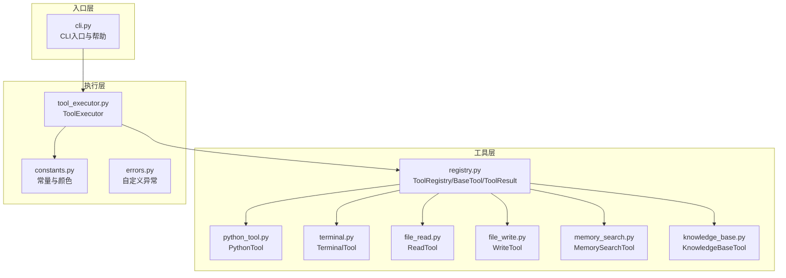
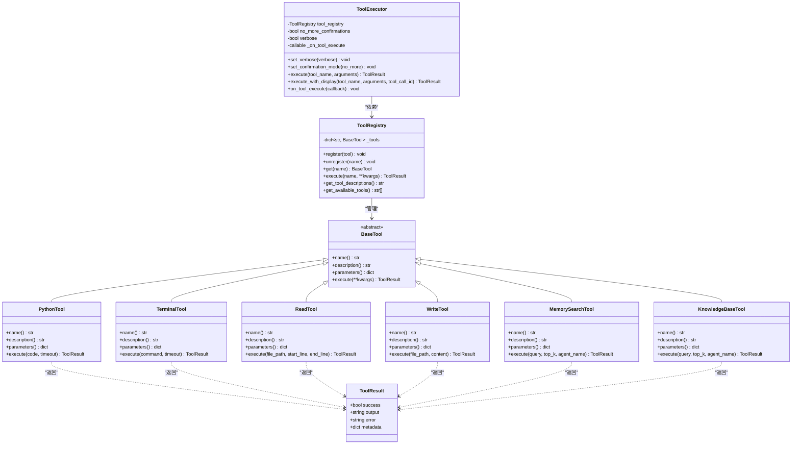
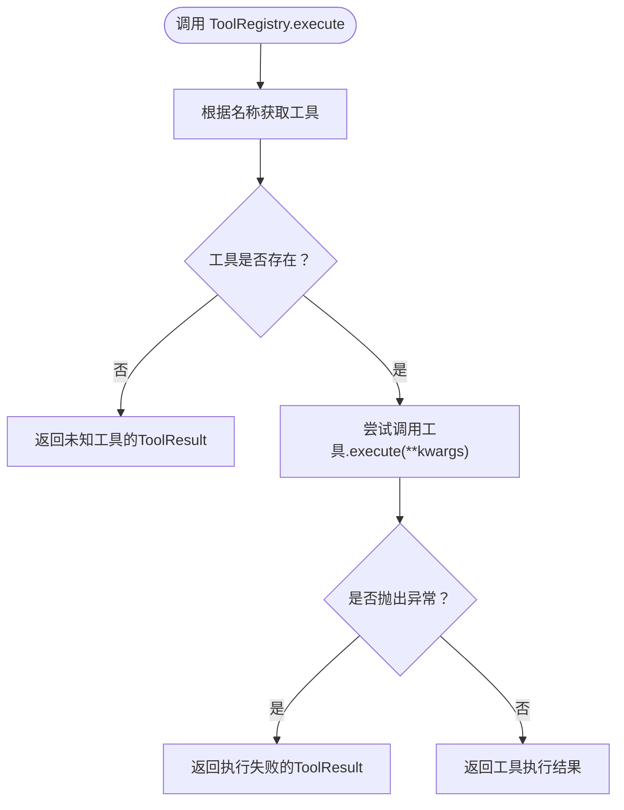
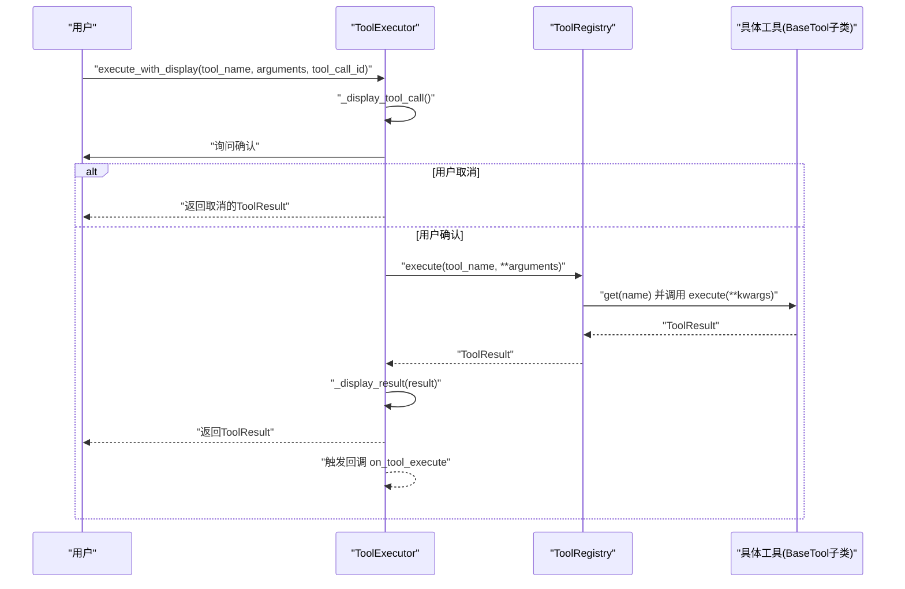
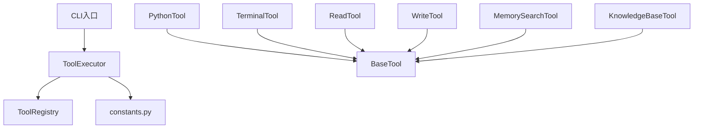

# 工具注册中心核心机制

<cite>
**本文引用的文件**
- [registry.py](file://cbhcli_pkg/tools/registry.py)
- [base.py](file://cbhcli_pkg/tools/base.py)
- [tool_executor.py](file://cbhcli_pkg/core/tool_executor.py)
- [python_tool.py](file://cbhcli_pkg/tools/python_tool.py)
- [terminal.py](file://cbhcli_pkg/tools/terminal.py)
- [file_read.py](file://cbhcli_pkg/tools/file_read.py)
- [file_write.py](file://cbhcli_pkg/tools/file_write.py)
- [memory_search.py](file://cbhcli_pkg/tools/memory_search.py)
- [knowledge_base.py](file://cbhcli_pkg/tools/knowledge_base.py)
- [constants.py](file://cbhcli_pkg/core/constants.py)
- [errors.py](file://cbhcli_pkg/core/errors.py)
- [cli.py](file://cbhcli_pkg/cli.py)
</cite>

## 目录
1. [简介](#简介)
2. [项目结构](#项目结构)
3. [核心组件](#核心组件)
4. [架构总览](#架构总览)
5. [详细组件分析](#详细组件分析)
6. [依赖分析](#依赖分析)
7. [性能考虑](#性能考虑)
8. [故障排查指南](#故障排查指南)
9. [结论](#结论)
10. [附录](#附录)

## 简介
本文件面向CBHCLI工具注册中心的核心机制，系统性阐述ToolRegistry类的设计与实现、工具基类BaseTool的接口规范、工具元数据管理、工具注册与动态加载思路、工具生命周期管理、版本与兼容性策略、错误处理机制，并提供可直接参考的实现范式与最佳实践，帮助开发者快速理解并扩展工具生态。

## 项目结构
围绕工具注册中心的关键文件组织如下：
- 工具注册与基类：cbhcli_pkg/tools/registry.py
- 工具执行器：cbhcli_pkg/core/tool_executor.py
- 常量与颜色控制：cbhcli_pkg/core/constants.py
- 自定义工具示例：cbhcli_pkg/tools/*.py（如python_tool.py、terminal.py、file_read.py、file_write.py、memory_search.py、knowledge_base.py）
- CLI入口与帮助：cbhcli_pkg/cli.py
- 自定义异常：cbhcli_pkg/core/errors.py

图表来源
- [registry.py:1-115](file://cbhcli_pkg/tools/registry.py#L1-L115)
- [tool_executor.py:1-168](file://cbhcli_pkg/core/tool_executor.py#L1-L168)
- [python_tool.py:1-207](file://cbhcli_pkg/tools/python_tool.py#L1-L207)
- [terminal.py:1-99](file://cbhcli_pkg/tools/terminal.py#L1-L99)
- [file_read.py:1-125](file://cbhcli_pkg/tools/file_read.py#L1-L125)
- [file_write.py:1-83](file://cbhcli_pkg/tools/file_write.py#L1-L83)
- [memory_search.py:1-177](file://cbhcli_pkg/tools/memory_search.py#L1-L177)
- [knowledge_base.py:1-157](file://cbhcli_pkg/tools/knowledge_base.py#L1-L157)
- [constants.py:1-50](file://cbhcli_pkg/core/constants.py#L1-L50)
- [errors.py:1-32](file://cbhcli_pkg/core/errors.py#L1-L32)
- [cli.py:1-112](file://cbhcli_pkg/cli.py#L1-L112)

章节来源
- [registry.py:1-115](file://cbhcli_pkg/tools/registry.py#L1-L115)
- [tool_executor.py:1-168](file://cbhcli_pkg/core/tool_executor.py#L1-L168)
- [constants.py:1-50](file://cbhcli_pkg/core/constants.py#L1-L50)
- [cli.py:1-112](file://cbhcli_pkg/cli.py#L1-L112)

## 核心组件
- ToolResult：统一的工具执行结果载体，包含成功标志、输出文本、错误信息与元数据。
- BaseTool：抽象基类，定义工具必须实现的属性与方法：name、description、parameters、execute。
- ToolRegistry：工具注册中心，负责工具的注册、注销、查找、执行与描述聚合。
- ToolExecutor：工具执行器，封装执行前确认、执行、结果展示与回调，屏蔽注册中心细节。
- 自定义工具：继承BaseTool，实现具体功能与参数Schema，如PythonTool、TerminalTool、ReadTool、WriteTool、MemorySearchTool、KnowledgeBaseTool。

章节来源
- [registry.py:7-115](file://cbhcli_pkg/tools/registry.py#L7-L115)
- [tool_executor.py:15-168](file://cbhcli_pkg/core/tool_executor.py#L15-L168)
- [python_tool.py:127-207](file://cbhcli_pkg/tools/python_tool.py#L127-L207)
- [terminal.py:7-99](file://cbhcli_pkg/tools/terminal.py#L7-L99)
- [file_read.py:6-125](file://cbhcli_pkg/tools/file_read.py#L6-L125)
- [file_write.py:6-83](file://cbhcli_pkg/tools/file_write.py#L6-L83)
- [memory_search.py:6-177](file://cbhcli_pkg/tools/memory_search.py#L6-L177)
- [knowledge_base.py:6-157](file://cbhcli_pkg/tools/knowledge_base.py#L6-L157)

## 架构总览
工具注册中心采用“抽象基类 + 注册中心 + 执行器”的分层设计：
- 抽象层：BaseTool定义统一接口，确保所有工具具备一致的元数据与行为契约。
- 管理层：ToolRegistry集中管理工具实例，提供注册、查找、执行与描述聚合能力。
- 执行层：ToolExecutor负责交互式确认、执行与结果展示，解耦UI与业务逻辑。
- 扩展层：各工具实现遵循BaseTool规范，通过注册中心统一接入。

图表来源
- [registry.py:7-115](file://cbhcli_pkg/tools/registry.py#L7-L115)
- [tool_executor.py:15-168](file://cbhcli_pkg/core/tool_executor.py#L15-L168)
- [python_tool.py:127-207](file://cbhcli_pkg/tools/python_tool.py#L127-L207)
- [terminal.py:7-99](file://cbhcli_pkg/tools/terminal.py#L7-L99)
- [file_read.py:6-125](file://cbhcli_pkg/tools/file_read.py#L6-L125)
- [file_write.py:6-83](file://cbhcli_pkg/tools/file_write.py#L6-L83)
- [memory_search.py:6-177](file://cbhcli_pkg/tools/memory_search.py#L6-L177)
- [knowledge_base.py:6-157](file://cbhcli_pkg/tools/knowledge_base.py#L6-L157)

## 详细组件分析

### ToolRegistry：注册中心设计与实现
- 数据结构：内部以字典维护工具名称到工具实例的映射。
- 注册与注销：register接收BaseTool实例；unregister按名称删除。
- 查找与执行：get按名称获取工具；execute在找不到工具时返回失败的ToolResult；捕获工具执行异常并包装为ToolResult。
- 描述聚合：get_tool_descriptions将所有工具的name/description/parameters拼接为系统提示文本；get_available_tools返回可用工具名列表。

图表来源
- [registry.py:70-96](file://cbhcli_pkg/tools/registry.py#L70-L96)

章节来源
- [registry.py:51-115](file://cbhcli_pkg/tools/registry.py#L51-L115)

### BaseTool：接口规范与元数据管理
- 必备属性：
  - name：工具唯一标识，用于注册与调用。
  - description：工具用途说明，用于系统提示与用户指引。
  - parameters：JSON Schema格式的参数定义，明确必填字段与类型。
- 必备方法：
  - execute：接收关键字参数，返回ToolResult。
- 元数据管理建议：
  - description应包含使用场景、注意事项与示例。
  - parameters应包含type、properties、required，便于上层校验与提示。

章节来源
- [registry.py:16-48](file://cbhcli_pkg/tools/registry.py#L16-L48)

### ToolExecutor：执行流程与交互
- 关键职责：
  - 执行前确认：支持跳过确认、全部确认与取消。
  - 执行与展示：调用ToolRegistry.execute，格式化输出与错误。
  - 回调通知：on_tool_execute允许外部订阅工具执行事件。
- 交互细节：
  - _get_tool_preview针对特定工具生成简要预览（如terminal的command、read/write的path）。
  - _display_result根据输出长度截断并着色显示。
  - 借助constants.py中的ANSI颜色常量美化输出。

图表来源
- [tool_executor.py:42-91](file://cbhcli_pkg/core/tool_executor.py#L42-L91)
- [registry.py:70-96](file://cbhcli_pkg/tools/registry.py#L70-L96)

章节来源
- [tool_executor.py:15-168](file://cbhcli_pkg/core/tool_executor.py#L15-L168)
- [constants.py:1-50](file://cbhcli_pkg/core/constants.py#L1-L50)

### 自定义工具实现范式
以下工具均遵循BaseTool规范，提供name/description/parameters/execute，并返回ToolResult：
- PythonTool：执行Python代码，支持会话记忆与超时控制。
- TerminalTool：执行shell命令，支持超时与错误码处理。
- ReadTool：读取文件内容，支持行范围与编码处理。
- WriteTool：创建/覆盖文件，统计字符与行数。
- MemorySearchTool：语义搜索Agent历史内容，支持降级方案。
- KnowledgeBaseTool：查询知识库，支持重排序增强。

章节来源
- [python_tool.py:127-207](file://cbhcli_pkg/tools/python_tool.py#L127-L207)
- [terminal.py:31-99](file://cbhcli_pkg/tools/terminal.py#L31-L99)
- [file_read.py:38-125](file://cbhcli_pkg/tools/file_read.py#L38-L125)
- [file_write.py:34-83](file://cbhcli_pkg/tools/file_write.py#L34-L83)
- [memory_search.py:47-177](file://cbhcli_pkg/tools/memory_search.py#L47-L177)
- [knowledge_base.py:49-157](file://cbhcli_pkg/tools/knowledge_base.py#L49-L157)

### 工具注册与动态加载机制
- 当前实现：工具通过直接实例化并调用ToolRegistry.register完成静态注册。
- 动态加载建议（扩展方向）：
  - 基于命名约定或装饰器标记自动发现工具类。
  - 使用importlib动态导入模块并实例化工具。
  - 支持插件目录扫描与按需加载，避免启动时全量导入。
  - 提供工具版本声明与兼容性检查钩子，保障升级平滑过渡。

章节来源
- [registry.py:57-68](file://cbhcli_pkg/tools/registry.py#L57-L68)

### 版本管理、兼容性与错误处理
- 版本与兼容性：
  - 建议在工具类中声明版本号与兼容范围，注册中心在加载时进行校验。
  - 对于破坏性变更，提供迁移脚本或向后兼容适配器。
- 错误处理：
  - ToolRegistry.execute捕获工具执行异常并统一封装为ToolResult。
  - ToolExecutor在展示阶段对输出长度进行截断，避免过长输出影响体验。
  - constants.py中定义的常量用于控制输出长度与预览长度，提升稳定性。

章节来源
- [registry.py:89-96](file://cbhcli_pkg/tools/registry.py#L89-L96)
- [tool_executor.py:142-159](file://cbhcli_pkg/core/tool_executor.py#L142-L159)
- [constants.py:13-16](file://cbhcli_pkg/core/constants.py#L13-L16)

## 依赖分析
- ToolExecutor依赖ToolRegistry与constants.py中的颜色与长度常量。
- 各工具实现依赖BaseTool与ToolResult，确保结果一致性。
- CLI入口负责打印可用工具列表，便于用户了解工具生态。

图表来源
- [tool_executor.py:24-29](file://cbhcli_pkg/core/tool_executor.py#L24-L29)
- [registry.py:54-56](file://cbhcli_pkg/tools/registry.py#L54-L56)
- [cli.py:60-68](file://cbhcli_pkg/cli.py#L60-L68)

章节来源
- [tool_executor.py:1-168](file://cbhcli_pkg/core/tool_executor.py#L1-L168)
- [registry.py:1-115](file://cbhcli_pkg/tools/registry.py#L1-L115)
- [cli.py:1-112](file://cbhcli_pkg/cli.py#L1-L112)

## 性能考虑
- 输出截断：通过MAX_TOOL_OUTPUT_LENGTH与TOOL_PREVIEW_LENGTH限制单次输出规模，避免内存与渲染压力。
- 超时控制：TerminalTool支持命令执行超时，防止阻塞；PythonTool预留超时参数但当前未生效，建议完善。
- 交互确认：ToolExecutor支持跳过确认，减少重复交互成本。
- 日志与错误：统一的ToolResult结构便于上层聚合统计与性能监控。

章节来源
- [constants.py:13-16](file://cbhcli_pkg/core/constants.py#L13-L16)
- [terminal.py:56-66](file://cbhcli_pkg/tools/terminal.py#L56-L66)
- [python_tool.py:60-70](file://cbhcli_pkg/tools/python_tool.py#L60-L70)

## 故障排查指南
- 未知工具：ToolRegistry.execute在找不到工具时返回错误的ToolResult，检查工具是否已注册或名称是否正确。
- 执行异常：工具execute内部异常被捕获并包装为ToolResult，查看error字段定位问题。
- 输出过长：若结果被截断，可在ToolExecutor中开启verbose模式查看更多细节。
- 终端命令失败：检查返回码与stderr输出，确认权限、路径与命令有效性。
- 文件读写失败：检查路径展开、编码与权限，必要时使用绝对路径。

章节来源
- [registry.py:82-96](file://cbhcli_pkg/tools/registry.py#L82-L96)
- [tool_executor.py:142-159](file://cbhcli_pkg/core/tool_executor.py#L142-L159)
- [terminal.py:77-91](file://cbhcli_pkg/tools/terminal.py#L77-L91)
- [file_read.py:113-124](file://cbhcli_pkg/tools/file_read.py#L113-L124)
- [file_write.py:77-82](file://cbhcli_pkg/tools/file_write.py#L77-L82)

## 结论
CBHCLI工具注册中心以BaseTool为契约，ToolRegistry为中枢，ToolExecutor为执行器，形成清晰的分层架构。通过标准化的ToolResult与JSON Schema参数定义，实现了工具的统一管理与一致体验。建议在现有基础上引入动态加载、版本兼容与重排序增强，进一步提升扩展性与智能化水平。

## 附录

### 开发者指南：实现自定义工具步骤
- 步骤1：创建工具类并继承BaseTool，实现name/description/parameters/execute。
- 步骤2：在execute中完成参数校验、业务处理与结果构造，返回ToolResult。
- 步骤3：在应用启动时实例化工具并通过ToolRegistry.register完成注册。
- 步骤4：在CLI或上层界面中提供工具使用说明与示例参数。
- 步骤5：为工具添加必要的错误处理与边界条件判断，保证健壮性。

章节来源
- [registry.py:16-48](file://cbhcli_pkg/tools/registry.py#L16-L48)
- [registry.py:57-68](file://cbhcli_pkg/tools/registry.py#L57-L68)
- [cli.py:60-68](file://cbhcli_pkg/cli.py#L60-L68)