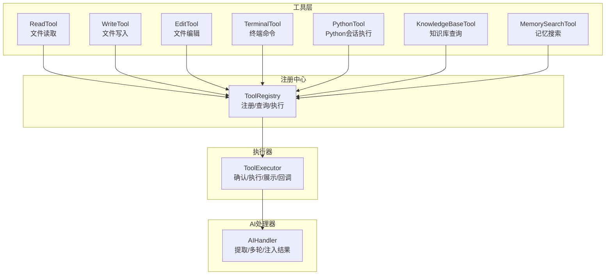
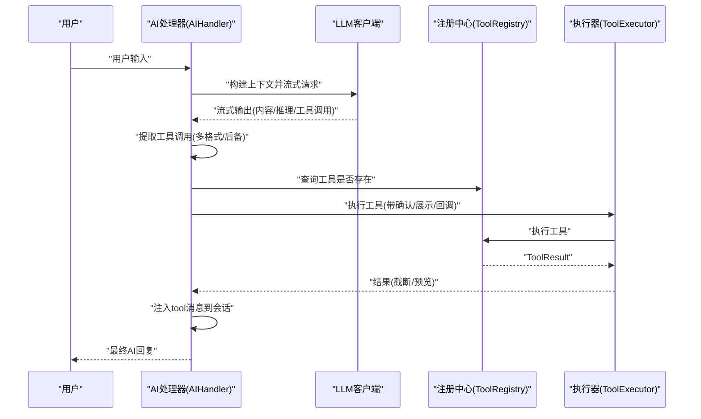
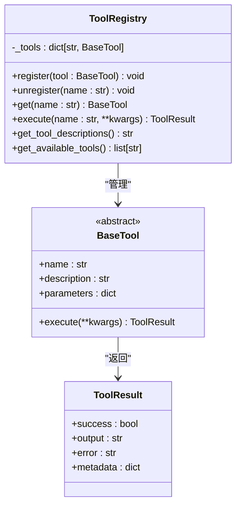
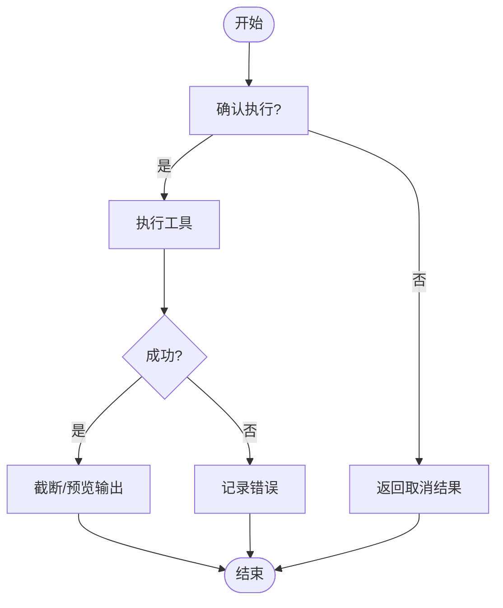
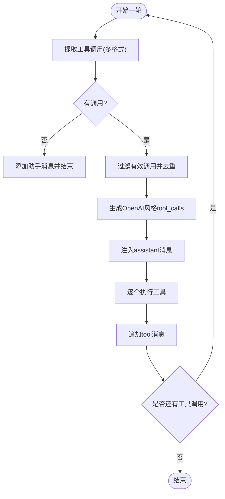

# 工具调用系统机制

<cite>
**本文引用的文件**
- [cbhcli_pkg/tools/registry.py](file://cbhcli_pkg/tools/registry.py)
- [cbhcli_pkg/core/tool_executor.py](file://cbhcli_pkg/core/tool_executor.py)
- [cbhcli_pkg/core/ai_handler.py](file://cbhcli_pkg/core/ai_handler.py)
- [cbhcli_pkg/tools/file_read.py](file://cbhcli_pkg/tools/file_read.py)
- [cbhcli_pkg/tools/file_write.py](file://cbhcli_pkg/tools/file_write.py)
- [cbhcli_pkg/tools/file_edit.py](file://cbhcli_pkg/tools/file_edit.py)
- [cbhcli_pkg/tools/terminal.py](file://cbhcli_pkg/tools/terminal.py)
- [cbhcli_pkg/tools/python_tool.py](file://cbhcli_pkg/tools/python_tool.py)
- [cbhcli_pkg/tools/knowledge_base.py](file://cbhcli_pkg/tools/knowledge_base.py)
- [cbhcli_pkg/tools/memory_search.py](file://cbhcli_pkg/tools/memory_search.py)
- [cbhcli_pkg/core/constants.py](file://cbhcli_pkg/core/constants.py)
- [cbhcli_pkg/core/errors.py](file://cbhcli_pkg/core/errors.py)
</cite>

## 目录
1. [简介](#简介)
2. [项目结构](#项目结构)
3. [核心组件](#核心组件)
4. [架构总览](#架构总览)
5. [详细组件分析](#详细组件分析)
6. [依赖关系分析](#依赖关系分析)
7. [性能与并发特性](#性能与并发特性)
8. [安全与权限控制](#安全与权限控制)
9. [故障排查指南](#故障排查指南)
10. [结论](#结论)
11. [附录：内置工具清单与最佳实践](#附录内置工具清单与最佳实践)

## 简介
本文件面向CBHCLI的工具调用系统，系统性阐述AI如何自动识别与选择合适工具的机制（工具描述生成、意图分析、工具匹配算法），工具注册中心的工作原理（接口规范、参数校验、执行流程），工具执行器的调度机制（并发控制、错误处理、结果聚合），以及7种内置工具的功能特性、使用场景与参数配置。同时提供工具开发的最佳实践与扩展指南，并通过图示与“章节来源”帮助读者快速定位实现细节。

## 项目结构
工具系统主要由以下层次构成：
- 工具层：内置工具实现（文件读写/编辑、终端、Python执行、知识库、记忆搜索等）
- 注册中心：统一管理工具注册、查询与执行
- 执行器：负责工具调用前确认、执行、结果展示与回调
- AI处理器：负责与大模型交互、提取工具调用、多轮协调与结果注入
- 常量与错误：统一约束工具调用轮次、输出长度、颜色渲染与异常类型



图表来源
- [cbhcli_pkg/tools/file_read.py:6-125](file://cbhcli_pkg/tools/file_read.py#L6-L125)
- [cbhcli_pkg/tools/file_write.py:6-83](file://cbhcli_pkg/tools/file_write.py#L6-L83)
- [cbhcli_pkg/tools/file_edit.py:6-134](file://cbhcli_pkg/tools/file_edit.py#L6-L134)
- [cbhcli_pkg/tools/terminal.py:7-99](file://cbhcli_pkg/tools/terminal.py#L7-L99)
- [cbhcli_pkg/tools/python_tool.py:127-207](file://cbhcli_pkg/tools/python_tool.py#L127-L207)
- [cbhcli_pkg/tools/knowledge_base.py:6-157](file://cbhcli_pkg/tools/knowledge_base.py#L6-L157)
- [cbhcli_pkg/tools/memory_search.py:6-177](file://cbhcli_pkg/tools/memory_search.py#L6-L177)
- [cbhcli_pkg/tools/registry.py:51-115](file://cbhcli_pkg/tools/registry.py#L51-L115)
- [cbhcli_pkg/core/tool_executor.py:15-168](file://cbhcli_pkg/core/tool_executor.py#L15-L168)
- [cbhcli_pkg/core/ai_handler.py:21-743](file://cbhcli_pkg/core/ai_handler.py#L21-L743)

章节来源
- [cbhcli_pkg/tools/registry.py:1-115](file://cbhcli_pkg/tools/registry.py#L1-L115)
- [cbhcli_pkg/core/tool_executor.py:1-168](file://cbhcli_pkg/core/tool_executor.py#L1-L168)
- [cbhcli_pkg/core/ai_handler.py:1-743](file://cbhcli_pkg/core/ai_handler.py#L1-L743)

## 核心组件
- 工具注册中心（ToolRegistry）：提供工具注册、注销、查询与执行；统一输出ToolResult；生成工具描述字符串用于系统提示。
- 工具执行器（ToolExecutor）：负责工具调用前的确认、执行、结果展示与回调；支持详细输出模式与批量跳过确认；对输出进行截断与预览。
- AI处理器（AIHandler）：负责与LLM交互、流式输出、工具调用提取（支持多种格式）、多轮工具调用协调、结果注入会话。
- 内置工具：文件读取/写入/编辑、终端命令、Python会话执行、知识库查询、记忆搜索。

章节来源
- [cbhcli_pkg/tools/registry.py:51-115](file://cbhcli_pkg/tools/registry.py#L51-L115)
- [cbhcli_pkg/core/tool_executor.py:15-168](file://cbhcli_pkg/core/tool_executor.py#L15-L168)
- [cbhcli_pkg/core/ai_handler.py:21-743](file://cbhcli_pkg/core/ai_handler.py#L21-L743)

## 架构总览
工具调用的端到端流程如下：
- 用户输入经AI处理器封装为消息上下文，发送给LLM。
- AI以流式方式输出，AI处理器在输出中提取工具调用（支持多种格式与后备检测）。
- 若提取到工具调用，AI处理器生成OpenAI风格的tool_calls并注入会话，随后委托工具执行器执行。
- 工具执行器执行工具并返回ToolResult，AI处理器将结果作为“tool”角色消息注入会话，进入下一轮或多轮直至完成。



图表来源
- [cbhcli_pkg/core/ai_handler.py:51-96](file://cbhcli_pkg/core/ai_handler.py#L51-L96)
- [cbhcli_pkg/core/ai_handler.py:264-502](file://cbhcli_pkg/core/ai_handler.py#L264-L502)
- [cbhcli_pkg/core/ai_handler.py:664-735](file://cbhcli_pkg/core/ai_handler.py#L664-L735)
- [cbhcli_pkg/core/tool_executor.py:42-91](file://cbhcli_pkg/core/tool_executor.py#L42-L91)
- [cbhcli_pkg/tools/registry.py:70-96](file://cbhcli_pkg/tools/registry.py#L70-L96)

## 详细组件分析

### 工具注册中心（ToolRegistry）
- 角色与职责
  - 维护工具字典，提供注册/注销/查询/执行。
  - 统一返回ToolResult，包含success、output、error、metadata。
  - 生成工具描述字符串（name/description/parameters）用于系统提示。
- 关键接口
  - register/unregister/get：管理工具生命周期。
  - execute：执行工具并捕获异常，返回标准化结果。
  - get_tool_descriptions/get_available_tools：辅助AI选择工具。
- 设计要点
  - BaseTool抽象定义name/description/parameters/execute四要素。
  - ToolResult为统一结果载体，便于上层处理。



图表来源
- [cbhcli_pkg/tools/registry.py:16-48](file://cbhcli_pkg/tools/registry.py#L16-L48)
- [cbhcli_pkg/tools/registry.py:51-115](file://cbhcli_pkg/tools/registry.py#L51-L115)

章节来源
- [cbhcli_pkg/tools/registry.py:1-115](file://cbhcli_pkg/tools/registry.py#L1-L115)

### 工具执行器（ToolExecutor）
- 角色与职责
  - 工具调用前确认（可跳过确认）。
  - 执行工具并进行结果展示（颜色、截断、预览）。
  - 支持回调，便于外部统计/日志。
- 关键逻辑
  - execute_with_display：打印调用与结果，支持详细模式。
  - _confirm_execution：交互式确认，支持“all”跳过后续确认。
  - _get_tool_preview：针对terminal/read/write/edit生成简要预览。
  - _display_result：按成功/失败输出不同颜色与截断策略。
- 并发与错误
  - 单线程顺序执行，无并发控制；异常通过ToolResult.error传递。



图表来源
- [cbhcli_pkg/core/tool_executor.py:122-158](file://cbhcli_pkg/core/tool_executor.py#L122-L158)

章节来源
- [cbhcli_pkg/core/tool_executor.py:1-168](file://cbhcli_pkg/core/tool_executor.py#L1-L168)

### AI处理器（AIHandler）
- 角色与职责
  - 多轮工具调用协调：在每轮结束后注入tool消息，必要时追加格式提示。
  - 工具调用提取：支持DSML标签、Python函数调用、JSON格式、纯文本命令等。
  - 结果注入：将工具输出作为“tool”角色消息加入会话。
- 工具调用提取算法（优先级与规则）
  - DSML标签：<｜tool_call｜>tool_name(args)<｜/tool_call｜> 或 <｜DSML｜invoke name="...">...</invoke>
  - Python函数调用：```python tool_name(args)```（严格匹配，要求工具存在）
  - JSON格式：```json {"tool": "...", "arguments"/"args": {...}}```（支持纯JSON对象）
  - 纯文本命令：多轮工具调用后自动检测明显命令并包装为terminal工具调用
- 参数解析
  - _parse_python_args：解析keyword=value、JSON字符串、单值字符串等，自动映射到command/input等参数名。
- 多轮与去重
  - 去重策略：基于(tool_name, arguments_json)生成唯一键，避免重复执行。
  - OpenAI风格tool_calls生成：为后续API调用准备数据。



图表来源
- [cbhcli_pkg/core/ai_handler.py](file://cbhcli_pkg/core/ai_handler.py#L68-L96)
- [cbhcli_pkg/core/ai_handler.py](file://cbhcli_pkg/core/ai_handler.py#L264-L502)
- [cbhcli_pkg/core/ai_handler.py](file://cbhcli_pkg/core/ai_handler.py#L664-L735)

章节来源
- [cbhcli_pkg/core/ai_handler.py](file://cbhcli_pkg/core/ai_handler.py#L1-L743)

### 内置工具详解（7种）

#### 文件读取工具（read）
- 功能：读取文件内容，支持行范围显示。
- 参数Schema：file_path（必填），start_line（可选），end_line（可选）。
- 特性：自动展开~为家目录；UTF-8解码；输出包含统计与行号。
- 错误处理：文件不存在、非文件、编码错误等均返回ToolResult.error。

章节来源
- [cbhcli_pkg/tools/file_read.py](file://cbhcli_pkg/tools/file_read.py#L6-L125)

#### 文件写入工具（write）
- 功能：创建新文件或覆盖现有文件。
- 参数Schema：file_path（必填），content（必填）。
- 特性：自动创建父目录；统计字符数与行数；覆盖时提示。
- 错误处理：异常捕获并返回错误信息。

章节来源
- [cbhcli_pkg/tools/file_write.py](file://cbhcli_pkg/tools/file_write.py#L6-L83)

#### 文件编辑工具（edit）
- 功能：精确替换文件中的文本，要求old_str唯一匹配。
- 参数Schema：file_path（必填），old_str（必填），new_str（必填）。
- 特性：查找所有匹配并报错；若未找到，提供可能行号提示；统计行数变化。
- 错误处理：未找到、多处匹配、异常等。

章节来源
- [cbhcli_pkg/tools/file_edit.py](file://cbhcli_pkg/tools/file_edit.py#L6-L134)

#### 终端工具（terminal）
- 功能：执行shell命令，支持超时控制。
- 参数Schema：command（必填）。
- 特性：支持多命令链式执行（&&）；超时终止；区分stdout/stderr；失败时返回详细错误。
- 安全：命令直接执行，需谨慎使用。

章节来源
- [cbhcli_pkg/tools/terminal.py](file://cbhcli_pkg/tools/terminal.py#L7-L99)

#### Python执行工具（python）
- 功能：执行Python代码，支持会话变量记忆。
- 参数Schema：code（必填）。
- 特性：全局会话存储，同一session_id共享变量与导入模块；支持重置/删除会话；捕获stdout/stderr。
- 使用建议：结合/新建会话命令使用，避免跨调用污染。

章节来源
- [cbhcli_pkg/tools/python_tool.py](file://cbhcli_pkg/tools/python_tool.py#L127-L207)

#### 知识库工具（knowledge_base）
- 功能：查询Agent的知识库内容（文档/代码/笔记）。
- 参数Schema：query（必填），top_k（可选）。
- 特性：自动获取Agent名称；支持重排序；格式化输出；向量数据库不可用时提示安装依赖。
- 依赖：向量存储与可选重排序客户端。

章节来源
- [cbhcli_pkg/tools/knowledge_base.py](file://cbhcli_pkg/tools/knowledge_base.py#L6-L157)

#### 记忆搜索工具（memory_search）
- 功能：语义搜索Agent的向量化知识内容（不含对话历史）。
- 参数Schema：query（必填），top_k（可选）。
- 特性：优先向量搜索，失败则降级到memory.md关键词匹配；输出格式化。
- 依赖：向量存储或本地memory.md文件。

章节来源
- [cbhcli_pkg/tools/memory_search.py](file://cbhcli_pkg/tools/memory_search.py#L6-L177)

## 依赖关系分析
- 组件耦合
  - AIHandler依赖ToolExecutor与ToolRegistry，负责工具调用提取与多轮协调。
  - ToolExecutor依赖ToolRegistry，负责执行与展示。
  - 内置工具均继承BaseTool，遵循统一接口。
- 外部依赖
  - 终端工具依赖subprocess；Python工具依赖sys/io与编译执行；知识库/记忆搜索依赖向量存储。
- 循环依赖
  - 无循环依赖，职责清晰。


图表来源
- [cbhcli_pkg/core/ai_handler.py](file://cbhcli_pkg/core/ai_handler.py#L11-L48)
- [cbhcli_pkg/core/tool_executor.py](file://cbhcli_pkg/core/tool_executor.py#L6-L32)
- [cbhcli_pkg/tools/registry.py](file://cbhcli_pkg/tools/registry.py#L16-L48)

章节来源
- [cbhcli_pkg/core/ai_handler.py](file://cbhcli_pkg/core/ai_handler.py#L1-L743)
- [cbhcli_pkg/core/tool_executor.py](file://cbhcli_pkg/core/tool_executor.py#L1-L168)
- [cbhcli_pkg/tools/registry.py](file://cbhcli_pkg/tools/registry.py#L1-L115)

## 性能与并发特性
- 工具执行器
  - 单线程顺序执行，无并发控制；适合串行工具链。
  - 输出截断与预览减少UI压力，提升交互体验。
- AI处理器
  - 流式输出，边生成边清理与显示；多轮工具调用受MAX_TOOL_ROUNDS限制。
  - 工具调用去重避免重复计算。
- 常量约束
  - MAX_TOOL_ROUNDS、MAX_TOOL_OUTPUT_LENGTH、TOOL_PREVIEW_LENGTH等常量统一控制性能与体验。

章节来源
- [cbhcli_pkg/core/constants.py](file://cbhcli_pkg/core/constants.py#L13-L16)
- [cbhcli_pkg/core/tool_executor.py](file://cbhcli_pkg/core/tool_executor.py#L142-L158)
- [cbhcli_pkg/core/ai_handler.py](file://cbhcli_pkg/core/ai_handler.py#L68-L96)

## 安全与权限控制
- 终端工具（terminal）
  - 直接执行shell命令，存在高风险；建议：
    - 仅在可信环境使用；
    - 限制可执行命令白名单；
    - 设置合理超时与资源限制；
    - 通过确认机制降低误操作概率。
- Python工具（python）
  - 可执行任意代码，建议：
    - 限制会话隔离与超时；
    - 仅在沙箱或受限容器内运行；
    - 严格审计与日志。
- 文件工具（read/write/edit）
  - 路径展开与权限检查：优先检查文件存在性与类型；建议：
    - 限定工作空间根目录；
    - 仅允许读取特定类型文件；
    - 写入前备份重要文件。
- 知识库/记忆搜索
  - 依赖向量存储，注意数据隐私与访问控制；建议：
    - Agent维度隔离；
    - 传输与存储加密；
    - 审计查询日志。

章节来源
- [cbhcli_pkg/tools/terminal.py](file://cbhcli_pkg/tools/terminal.py#L31-L99)
- [cbhcli_pkg/tools/python_tool.py](file://cbhcli_pkg/tools/python_tool.py#L170-L207)
- [cbhcli_pkg/tools/file_read.py](file://cbhcli_pkg/tools/file_read.py#L51-L125)
- [cbhcli_pkg/tools/file_write.py](file://cbhcli_pkg/tools/file_write.py#L45-L83)
- [cbhcli_pkg/tools/file_edit.py](file://cbhcli_pkg/tools/file_edit.py#L50-L134)
- [cbhcli_pkg/tools/knowledge_base.py](file://cbhcli_pkg/tools/knowledge_base.py#L80-L121)
- [cbhcli_pkg/tools/memory_search.py](file://cbhcli_pkg/tools/memory_search.py#L70-L103)

## 故障排查指南
- 工具未找到
  - 现象：ToolRegistry返回“未知工具”。
  - 排查：确认工具已注册；检查工具名拼写；查看get_available_tools。
- 工具执行失败
  - 现象：ToolResult.success=False，error包含错误详情。
  - 排查：查看具体工具的异常分支；核对参数类型与范围。
- 工具调用未被识别
  - 现象：AI输出类似命令但未按工具调用格式。
  - 排查：确认使用```python或```json或DSML标签；多轮工具调用后可启用后备检测。
- 输出过长
  - 现象：工具输出被截断。
  - 排查：调整MAX_TOOL_OUTPUT_LENGTH或使用详细模式。
- 超时问题
  - 现象：terminal工具超时。
  - 排查：缩短命令、增加timeout、拆分为更小任务。

章节来源
- [cbhcli_pkg/tools/registry.py:81-96](file://cbhcli_pkg/tools/registry.py#L81-L96)
- [cbhcli_pkg/core/ai_handler.py:264-502](file://cbhcli_pkg/core/ai_handler.py#L264-L502)
- [cbhcli_pkg/core/tool_executor.py:142-158](file://cbhcli_pkg/core/tool_executor.py#L142-L158)
- [cbhcli_pkg/core/constants.py:14-16](file://cbhcli_pkg/core/constants.py#L14-L16)

## 结论
CBHCLI的工具调用系统以“注册中心+执行器+AI处理器”的分层设计实现了高内聚、低耦合的工具生态。AI处理器通过多格式工具调用提取与多轮协调，使复杂任务自动化成为可能；执行器提供确认、展示与回调，增强安全性与可观测性；内置工具覆盖文件、终端、Python、知识库与记忆搜索等高频场景。配合统一的常量与错误体系，系统在功能完整性与工程稳定性之间取得良好平衡。

## 附录：内置工具清单与最佳实践

### 内置工具清单
- read：文件读取，支持行范围；适合日志/配置/源码片段查看。
- write：文件写入/覆盖；谨慎使用，注意备份。
- edit：精确文本替换；要求old_str唯一，适合小范围修复。
- terminal：终端命令执行；高风险，建议白名单与超时。
- python：Python代码执行；支持会话记忆，适合数据分析/脚本。
- knowledge_base：知识库查询；需向量存储支持。
- memory_search：记忆搜索；可降级到本地文件。

章节来源
- [cbhcli_pkg/tools/file_read.py:6-125](file://cbhcli_pkg/tools/file_read.py#L6-L125)
- [cbhcli_pkg/tools/file_write.py:6-83](file://cbhcli_pkg/tools/file_write.py#L6-L83)
- [cbhcli_pkg/tools/file_edit.py:6-134](file://cbhcli_pkg/tools/file_edit.py#L6-L134)
- [cbhcli_pkg/tools/terminal.py:7-99](file://cbhcli_pkg/tools/terminal.py#L7-L99)
- [cbhcli_pkg/tools/python_tool.py:127-207](file://cbhcli_pkg/tools/python_tool.py#L127-L207)
- [cbhcli_pkg/tools/knowledge_base.py:6-157](file://cbhcli_pkg/tools/knowledge_base.py#L6-L157)
- [cbhcli_pkg/tools/memory_search.py:6-177](file://cbhcli_pkg/tools/memory_search.py#L6-L177)

### 工具开发最佳实践
- 实现BaseTool
  - 明确定义name/description/parameters/execute。
  - 参数Schema使用JSON Schema，标注必填字段与类型。
  - execute返回ToolResult，error尽量包含可诊断信息。
- 参数校验
  - 在execute内部进行路径/文件/命令合法性检查。
  - 对外部输入进行最小可行校验，避免越界。
- 错误处理
  - 捕获异常并返回ToolResult(success=False, error=...)。
  - 对敏感错误信息进行脱敏。
- 安全
  - 终端与Python工具必须进行白名单/超时/沙箱化。
  - 文件工具限制工作空间根目录。
- 可观测性
  - 在execute中设置metadata，便于上层统计。
  - 使用回调或日志记录工具执行轨迹。

### 工具注册与调用示例（路径指引）
- 注册工具
  - 在工具实现文件中定义工具类，确保继承BaseTool并实现四要素。
  - 在应用启动阶段调用ToolRegistry.register(tool)完成注册。
- 调用工具
  - 直接调用ToolRegistry.execute(name, **kwargs)获取ToolResult。
  - 或通过AIHandler触发工具调用（多轮）。
- 自定义开发
  - 参考内置工具的参数Schema与错误处理模式。
  - 在ToolExecutor.set_verbose与ToolExecutor.set_confirmation_mode中调试与确认。

章节来源
- [cbhcli_pkg/tools/registry.py:57-96](file://cbhcli_pkg/tools/registry.py#L57-L96)
- [cbhcli_pkg/core/tool_executor.py:24-52](file://cbhcli_pkg/core/tool_executor.py#L24-L52)
- [cbhcli_pkg/core/ai_handler.py:664-735](file://cbhcli_pkg/core/ai_handler.py#L664-L735)