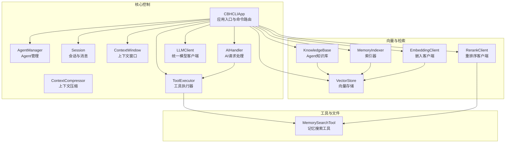
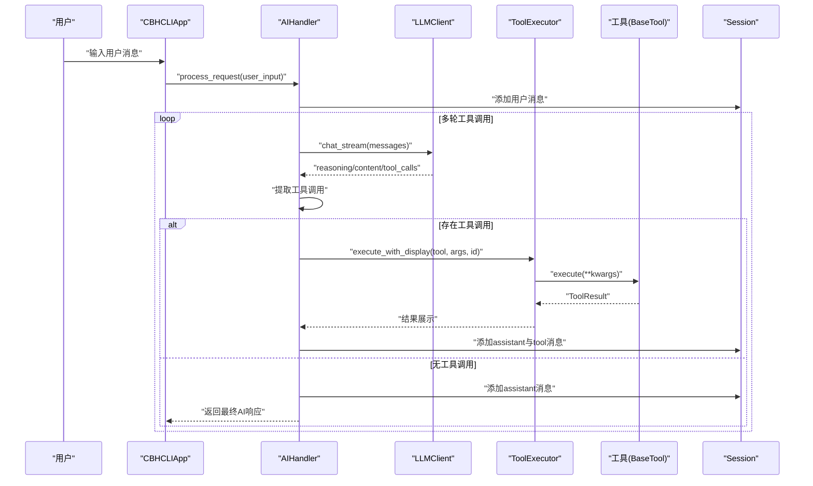
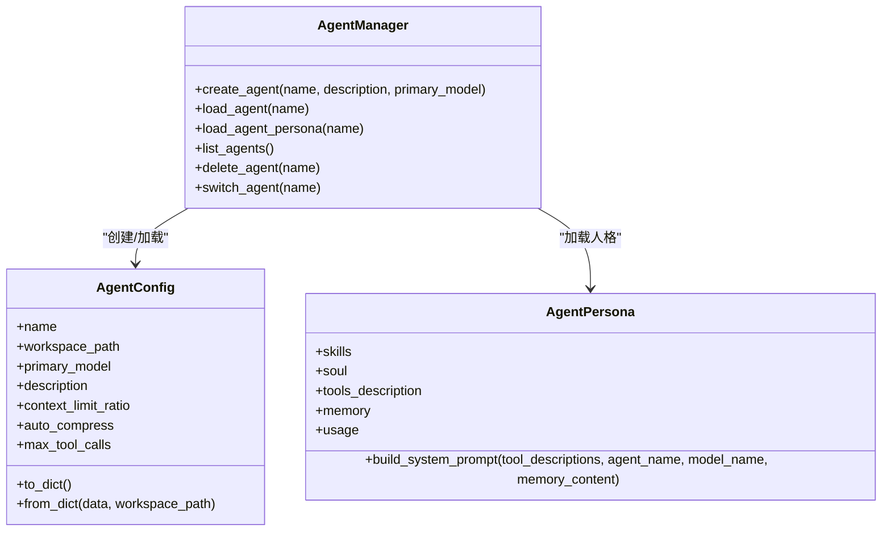
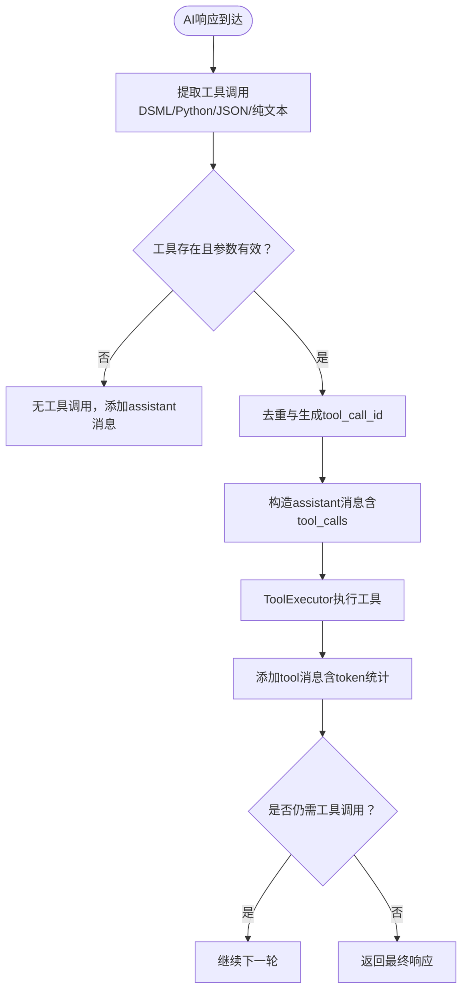
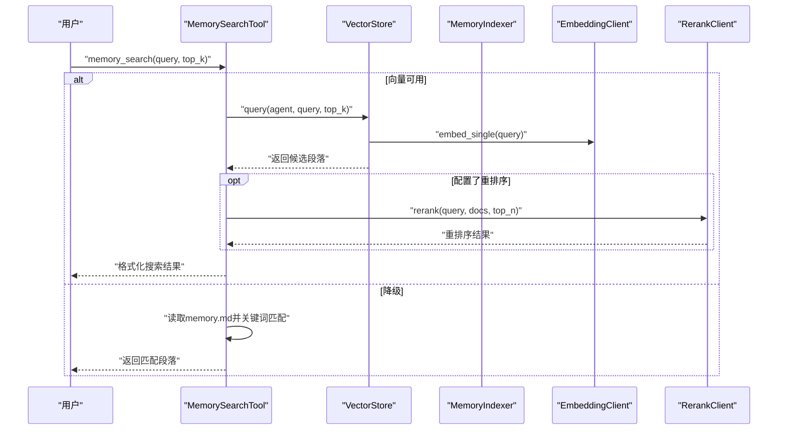
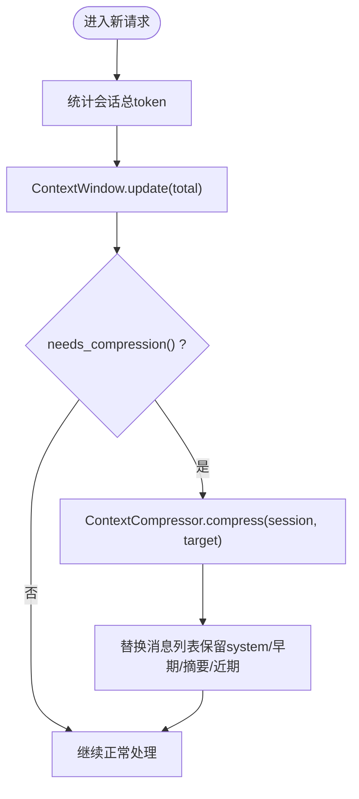
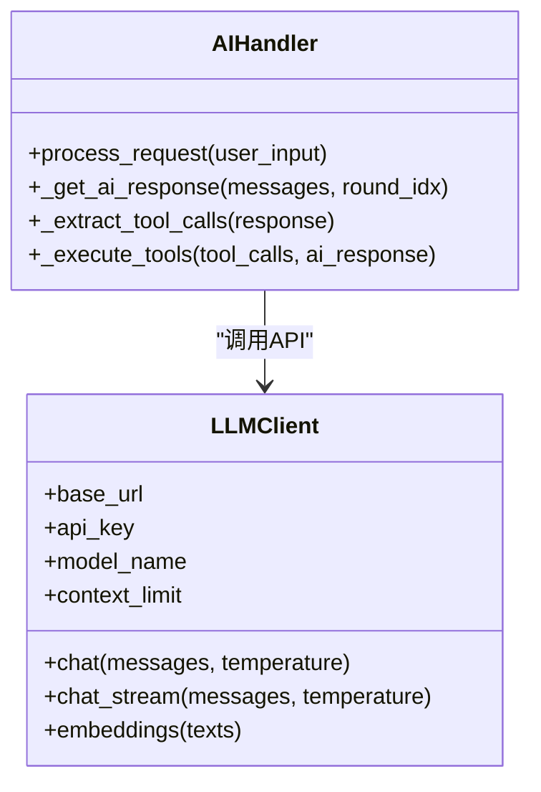
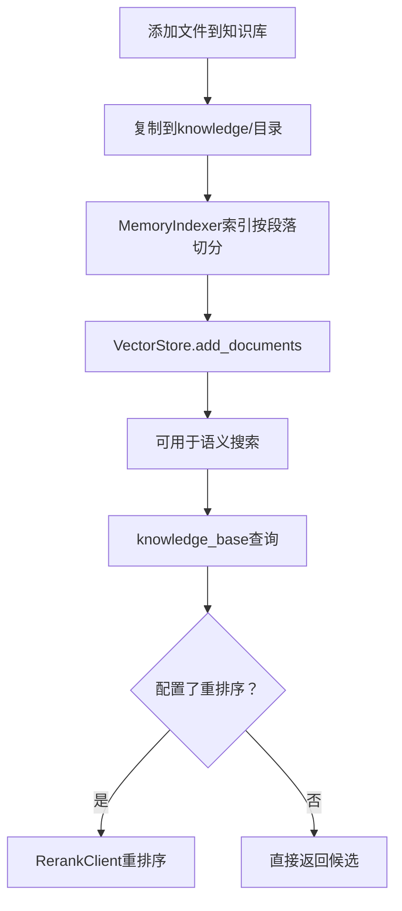
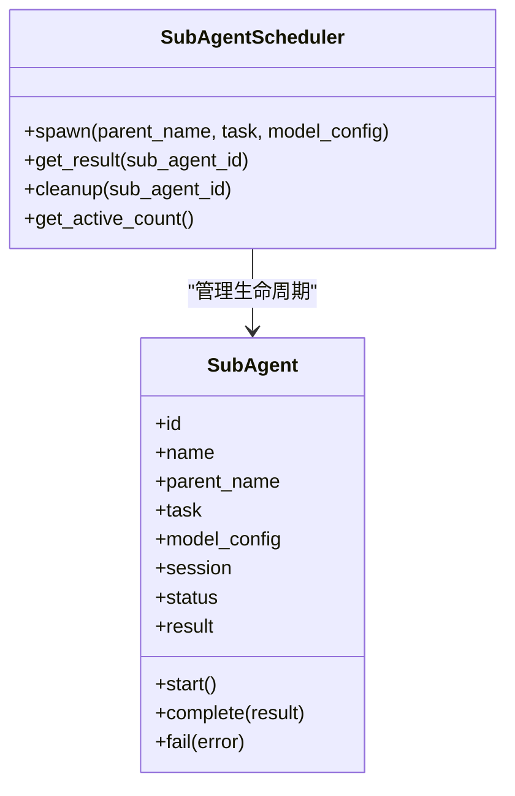
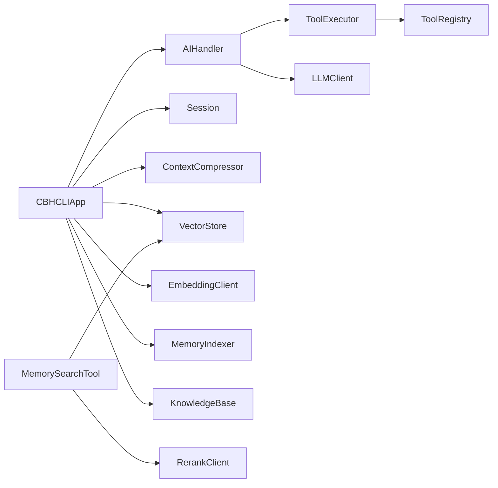

# 核心概念

<cite>
**本文引用的文件**
- [app.py](file://cbhcli_pkg/core/app.py)
- [ai_handler.py](file://cbhcli_pkg/core/ai_handler.py)
- [tool_executor.py](file://cbhcli_pkg/core/tool_executor.py)
- [session.py](file://cbhcli_pkg/core/session.py)
- [compressor.py](file://cbhcli_pkg/context/compressor.py)
- [model.py](file://cbhcli_pkg/core/model.py)
- [agent.py](file://cbhcli_pkg/core/agent.py)
- [knowledge_base.py](file://cbhcli_pkg/core/knowledge_base.py)
- [store.py](file://cbhcli_pkg/vector/store.py)
- [indexer.py](file://cbhcli_pkg/vector/indexer.py)
- [memory_search.py](file://cbhcli_pkg/tools/memory_search.py)
- [embedding_client.py](file://cbhcli_pkg/core/embedding_client.py)
- [rerank_client.py](file://cbhcli_pkg/core/rerank_client.py)
- [subagent.py](file://cbhcli_pkg/core/subagent.py)
</cite>

## 目录
1. [简介](#简介)
2. [项目结构](#项目结构)
3. [核心组件](#核心组件)
4. [架构总览](#架构总览)
5. [详细组件分析](#详细组件分析)
6. [依赖分析](#依赖分析)
7. [性能考量](#性能考量)
8. [故障排查指南](#故障排查指南)
9. [结论](#结论)
10. [附录](#附录)

## 简介
本文件面向初学者与高级用户，系统阐述 CBHCLI 的核心概念与实现细节，涵盖 Agent 概念与工作原理（工作空间、人格配置、独立性）、工具调用系统（AI 如何自动识别与执行合适工具）、向量检索（语义搜索实现）、会话管理策略（上下文窗口监控与自动压缩）、多模型支持与切换机制、以及知识库系统的设计理念与实现方式。文中所有术语与命名均采用项目内实际命名，并提供具体代码示例路径以便进一步阅读。

## 项目结构
CBHCLI 采用“核心模块 + 工具层 + 向量与检索 + 上下文压缩”的分层设计：
- 核心控制流：应用入口负责初始化、命令路由、Agent 生命周期与会话管理
- 会话与上下文：消息结构、上下文窗口、自动压缩
- 工具体系：工具注册中心、工具执行器、工具调用提取与执行
- 模型与推理：统一 LLM 客户端、流式输出、工具调用格式解析
- 向量与检索：嵌入客户端、向量存储、索引器、重排序客户端
- 知识库：Agent 级知识库目录、文件增删查改与索引
- 辅助：子 Agent 调度器（临时子任务）

图表来源
- [app.py:54-280](file://cbhcli_pkg/core/app.py#L54-L280)
- [ai_handler.py:21-96](file://cbhcli_pkg/core/ai_handler.py#L21-L96)
- [tool_executor.py:15-92](file://cbhcli_pkg/core/tool_executor.py#L15-L92)
- [session.py:37-190](file://cbhcli_pkg/core/session.py#L37-L190)
- [compressor.py:7-82](file://cbhcli_pkg/context/compressor.py#L7-L82)
- [model.py:7-147](file://cbhcli_pkg/core/model.py#L7-L147)
- [agent.py:572-762](file://cbhcli_pkg/core/agent.py#L572-L762)
- [knowledge_base.py:7-207](file://cbhcli_pkg/core/knowledge_base.py#L7-L207)
- [store.py:37-175](file://cbhcli_pkg/vector/store.py#L37-L175)
- [indexer.py:7-178](file://cbhcli_pkg/vector/indexer.py#L7-L178)
- [memory_search.py:6-177](file://cbhcli_pkg/tools/memory_search.py#L6-L177)
- [embedding_client.py:6-132](file://cbhcli_pkg/core/embedding_client.py#L6-L132)
- [rerank_client.py:6-123](file://cbhcli_pkg/core/rerank_client.py#L6-L123)

章节来源
- [app.py:54-280](file://cbhcli_pkg/core/app.py#L54-L280)

## 核心组件
- Agent 与工作空间：每个 Agent 拥有独立工作空间，包含配置、技能、性格、工具指南、长期记忆与知识库目录；AgentManager 负责创建、加载、切换与删除 Agent。
- 会话与上下文：Session 管理会话消息与 token 统计；ContextWindow 监控使用率并在阈值触发时自动压缩；ContextCompressor 使用 LLM 生成摘要以降低 token 使用。
- 工具系统：ToolRegistry 统一注册与查找工具；ToolExecutor 负责执行前确认、执行与结果展示；AIHandler 负责流式输出、工具调用提取与多轮工具调用协调。
- 模型与推理：LLMClient 封装统一 API 调用，支持流式输出与工具调用字段解析；AIHandler 将消息转为 API 消息格式并处理 reasoning/content/tool_calls。
- 向量与检索：EmbeddingClient 提供嵌入向量；VectorStore 封装 ChromaDB 并使用自定义嵌入函数；MemoryIndexer 负责索引 Agent 工作空间与知识库；RerankClient 提供重排序能力；MemorySearchTool 提供语义搜索工具。
- 知识库：KnowledgeBase 管理 Agent 级知识库目录，支持文件增删、列出、重新索引与向量索引。
- 子 Agent：SubAgentScheduler 支持临时子任务创建、状态管理与结果等待。

章节来源
- [agent.py:572-762](file://cbhcli_pkg/core/agent.py#L572-L762)
- [session.py:37-190](file://cbhcli_pkg/core/session.py#L37-L190)
- [compressor.py:7-82](file://cbhcli_pkg/context/compressor.py#L7-L82)
- [tool_executor.py:15-92](file://cbhcli_pkg/core/tool_executor.py#L15-L92)
- [ai_handler.py:21-96](file://cbhcli_pkg/core/ai_handler.py#L21-L96)
- [model.py:7-147](file://cbhcli_pkg/core/model.py#L7-L147)
- [embedding_client.py:6-132](file://cbhcli_pkg/core/embedding_client.py#L6-L132)
- [store.py:37-175](file://cbhcli_pkg/vector/store.py#L37-L175)
- [indexer.py:7-178](file://cbhcli_pkg/vector/indexer.py#L7-L178)
- [rerank_client.py:6-123](file://cbhcli_pkg/core/rerank_client.py#L6-L123)
- [knowledge_base.py:7-207](file://cbhcli_pkg/core/knowledge_base.py#L7-L207)
- [memory_search.py:6-177](file://cbhcli_pkg/tools/memory_search.py#L6-L177)
- [subagent.py:55-118](file://cbhcli_pkg/core/subagent.py#L55-L118)

## 架构总览
CBHCLI 的运行流程如下：应用初始化后进入交互循环，接收用户输入；若为命令则路由至相应命令处理器；否则交由 AIHandler 处理。AIHandler 将消息交给 LLMClient 获取流式响应，解析其中的工具调用，委托 ToolExecutor 执行工具并将结果回填到会话。过程中，ContextWindow 持续监控 token 使用，接近阈值时触发 ContextCompressor 压缩历史消息。若配置了嵌入与重排序模型，则通过 VectorStore 与 MemoryIndexer 提供语义检索能力。

图表来源
- [app.py:422-440](file://cbhcli_pkg/core/app.py#L422-L440)
- [ai_handler.py:51-96](file://cbhcli_pkg/core/ai_handler.py#L51-L96)
- [model.py:59-120](file://cbhcli_pkg/core/model.py#L59-L120)
- [tool_executor.py:42-92](file://cbhcli_pkg/core/tool_executor.py#L42-L92)

章节来源
- [app.py:386-440](file://cbhcli_pkg/core/app.py#L386-L440)
- [ai_handler.py:51-96](file://cbhcli_pkg/core/ai_handler.py#L51-L96)

## 详细组件分析

### Agent 概念与工作原理
- 工作空间：每个 Agent 拥有独立目录，包含 config.json、skills.md、soul.md、tools.md、memory.md、usage.md 与 knowledge/ 等文件。AgentManager 负责创建、加载、切换与删除 Agent。
- 人格配置：AgentPersona 从 MD 文件构建系统提示，包含基本信息、长期记忆、使用说明、技能、性格、工具指南与可用工具描述。
- 独立性：每个 Agent 拥有独立的 LLM 客户端、会话、上下文窗口、MCP 管理器与向量索引；切换 Agent 会重置会话并加载对应配置与人格。

图表来源
- [agent.py:572-762](file://cbhcli_pkg/core/agent.py#L572-L762)

章节来源
- [agent.py:572-762](file://cbhcli_pkg/core/agent.py#L572-L762)

使用场景与示例路径
- 创建并切换 Agent：[app.py:204-230](file://cbhcli_pkg/core/app.py#L204-L230)
- 加载 Agent 人格与系统提示：[agent.py:647-685](file://cbhcli_pkg/core/agent.py#L647-L685)

### 工具调用系统机制
- 工具注册与执行：ToolRegistry 统一注册与查找工具；ToolExecutor 负责执行前确认、执行与结果展示；支持详细/简洁模式切换。
- AI 提取工具调用：AIHandler 支持多种工具调用格式（DSML、Python 函数调用、JSON），并进行严格验证与去重；多轮工具调用时注入格式提示，避免重复输出。
- 工具执行与回填：将工具调用转换为 OpenAI 格式的 tool_calls，执行后将结果以 tool 消息形式回填到会话。

图表来源
- [ai_handler.py:264-735](file://cbhcli_pkg/core/ai_handler.py#L264-L735)
- [tool_executor.py:42-92](file://cbhcli_pkg/core/tool_executor.py#L42-L92)

章节来源
- [ai_handler.py:264-735](file://cbhcli_pkg/core/ai_handler.py#L264-L735)
- [tool_executor.py:15-92](file://cbhcli_pkg/core/tool_executor.py#L15-L92)

使用场景与示例路径
- 工具调用格式解析与执行：[ai_handler.py:264-735](file://cbhcli_pkg/core/ai_handler.py#L264-L735)
- 工具执行器确认与展示：[tool_executor.py:42-92](file://cbhcli_pkg/core/tool_executor.py#L42-L92)

### 向量检索与语义搜索
- 嵌入与存储：EmbeddingClient 支持多种嵌入模型 API；VectorStore 封装 ChromaDB，使用自定义嵌入函数；MemoryIndexer 负责索引 Agent 工作空间与知识库文件。
- 查询与重排序：MemorySearchTool 提供语义搜索；若未配置向量存储则降级为 memory.md 的关键词匹配；RerankClient 可选地对候选结果进行重排序。
- 知识库：KnowledgeBase 管理 Agent 级知识库目录，支持文件增删、列出与重新索引。

图表来源
- [memory_search.py:47-103](file://cbhcli_pkg/tools/memory_search.py#L47-L103)
- [store.py:128-160](file://cbhcli_pkg/vector/store.py#L128-L160)
- [indexer.py:37-69](file://cbhcli_pkg/vector/indexer.py#L37-L69)
- [embedding_client.py:34-90](file://cbhcli_pkg/core/embedding_client.py#L34-L90)
- [rerank_client.py:35-90](file://cbhcli_pkg/core/rerank_client.py#L35-L90)

章节来源
- [memory_search.py:6-177](file://cbhcli_pkg/tools/memory_search.py#L6-L177)
- [store.py:37-175](file://cbhcli_pkg/vector/store.py#L37-L175)
- [indexer.py:7-178](file://cbhcli_pkg/vector/indexer.py#L7-L178)
- [embedding_client.py:6-132](file://cbhcli_pkg/core/embedding_client.py#L6-L132)
- [rerank_client.py:6-123](file://cbhcli_pkg/core/rerank_client.py#L6-L123)

使用场景与示例路径
- 向量查询与重排序：[store.py:128-160](file://cbhcli_pkg/vector/store.py#L128-L160)、[rerank_client.py:35-90](file://cbhcli_pkg/core/rerank_client.py#L35-L90)
- 索引 Agent 工作空间：[indexer.py:37-69](file://cbhcli_pkg/vector/indexer.py#L37-L69)
- 知识库文件增删与重新索引：[knowledge_base.py:31-149](file://cbhcli_pkg/core/knowledge_base.py#L31-L149)

### 会话管理策略：上下文窗口监控与自动压缩
- 上下文窗口：ContextWindow 维护模型上下文上限与触发阈值，提供使用百分比、剩余 token 数与状态文本。
- 自动压缩：当使用量接近阈值时，ContextCompressor 使用 LLM 生成摘要，保留早期与近期消息，中间部分以摘要替代，显著降低 token 使用。

图表来源
- [session.py:127-190](file://cbhcli_pkg/core/session.py#L127-L190)
- [app.py:361-385](file://cbhcli_pkg/core/app.py#L361-L385)
- [compressor.py:21-82](file://cbhcli_pkg/context/compressor.py#L21-L82)

章节来源
- [session.py:127-190](file://cbhcli_pkg/core/session.py#L127-L190)
- [app.py:361-385](file://cbhcli_pkg/core/app.py#L361-L385)
- [compressor.py:7-112](file://cbhcli_pkg/context/compressor.py#L7-L112)

使用场景与示例路径
- 上下文检查与压缩触发：[app.py:368-385](file://cbhcli_pkg/core/app.py#L368-L385)
- 压缩算法与摘要生成：[compressor.py:21-82](file://cbhcli_pkg/context/compressor.py#L21-L82)

### 多模型支持与切换机制
- 统一客户端：LLMClient 封装模型 API，支持非流式与流式聊天、嵌入向量获取；支持温度参数与超时控制。
- 模型配置：GlobalConfig 存储模型列表与当前活动模型；AgentConfig 可指定 primary_model；切换时重建 LLMClient 与 ContextCompressor。
- 流式输出：AIHandler 通过 LLMClient.chat_stream 获取 reasoning/content/tool_calls 三类输出，实时展示并进行格式清理。

图表来源
- [model.py:7-147](file://cbhcli_pkg/core/model.py#L7-L147)
- [ai_handler.py:51-216](file://cbhcli_pkg/core/ai_handler.py#L51-L216)

章节来源
- [model.py:7-147](file://cbhcli_pkg/core/model.py#L7-L147)
- [ai_handler.py:51-216](file://cbhcli_pkg/core/ai_handler.py#L51-L216)

使用场景与示例路径
- 流式输出解析与展示：[model.py:59-120](file://cbhcli_pkg/core/model.py#L59-L120)
- 工具调用格式解析与多轮协调：[ai_handler.py:98-216](file://cbhcli_pkg/core/ai_handler.py#L98-L216)

### 知识库系统设计理念与实现
- 设计理念：以 Agent 为中心的知识库目录，支持文件级增删与重新索引；与向量检索结合，提供语义搜索能力；memory.md 作为长期记忆始终注入系统提示。
- 实现方式：KnowledgeBase 提供文件增删查改与重新索引；MemoryIndexer 负责将 Agent 工作空间与知识库文件切分为段落并索引；VectorStore 使用自定义嵌入函数；RerankClient 可选提升相关性。

图表来源
- [knowledge_base.py:31-207](file://cbhcli_pkg/core/knowledge_base.py#L31-L207)
- [indexer.py:87-134](file://cbhcli_pkg/vector/indexer.py#L87-L134)
- [store.py:99-126](file://cbhcli_pkg/vector/store.py#L99-L126)
- [rerank_client.py:35-90](file://cbhcli_pkg/core/rerank_client.py#L35-L90)

章节来源
- [knowledge_base.py:7-207](file://cbhcli_pkg/core/knowledge_base.py#L7-L207)
- [indexer.py:7-178](file://cbhcli_pkg/vector/indexer.py#L7-L178)
- [store.py:37-175](file://cbhcli_pkg/vector/store.py#L37-L175)
- [rerank_client.py:6-123](file://cbhcli_pkg/core/rerank_client.py#L6-L123)

使用场景与示例路径
- 知识库文件增删与重新索引：[knowledge_base.py:31-149](file://cbhcli_pkg/core/knowledge_base.py#L31-L149)
- 向量索引与查询：[indexer.py:37-69](file://cbhcli_pkg/vector/indexer.py#L37-L69)、[store.py:128-160](file://cbhcli_pkg/vector/store.py#L128-L160)

### 子 Agent 机制（临时子任务）
- 子 Agent 生命周期：创建、启动、完成或失败；支持结果等待与清理。
- 调度器：SubAgentScheduler 负责创建子 Agent、维护活跃子 Agent 列表、等待结果与清理资源。

图表来源
- [subagent.py:17-53](file://cbhcli_pkg/core/subagent.py#L17-L53)
- [subagent.py:55-118](file://cbhcli_pkg/core/subagent.py#L55-L118)

章节来源
- [subagent.py:17-118](file://cbhcli_pkg/core/subagent.py#L17-L118)

使用场景与示例路径
- 子 Agent 创建与结果获取：[subagent.py:61-103](file://cbhcli_pkg/core/subagent.py#L61-L103)

## 依赖分析
- 组件耦合与内聚：AIHandler 与 ToolExecutor、LLMClient 强耦合；Session 与 ContextWindow、ContextCompressor 协同；VectorStore 与 EmbeddingClient、MemoryIndexer 紧密协作；AgentManager 与 AgentConfig/AgentPersona 解耦但共同决定系统提示。
- 外部依赖：ChromaDB（向量存储）、requests（HTTP API）、prompt_toolkit（交互界面）。
- 潜在循环依赖：当前文件未发现循环导入；各模块职责清晰，通过接口（如 ToolRegistry）解耦。

图表来源
- [ai_handler.py:21-96](file://cbhcli_pkg/core/ai_handler.py#L21-L96)
- [tool_executor.py:15-92](file://cbhcli_pkg/core/tool_executor.py#L15-L92)
- [model.py:7-147](file://cbhcli_pkg/core/model.py#L7-L147)
- [app.py:54-280](file://cbhcli_pkg/core/app.py#L54-L280)
- [memory_search.py:6-177](file://cbhcli_pkg/tools/memory_search.py#L6-L177)
- [store.py:37-175](file://cbhcli_pkg/vector/store.py#L37-L175)
- [indexer.py:7-178](file://cbhcli_pkg/vector/indexer.py#L7-L178)
- [embedding_client.py:6-132](file://cbhcli_pkg/core/embedding_client.py#L6-L132)
- [rerank_client.py:6-123](file://cbhcli_pkg/core/rerank_client.py#L6-L123)

章节来源
- [app.py:54-280](file://cbhcli_pkg/core/app.py#L54-L280)

## 性能考量
- Token 控制：通过 ContextWindow 与 ContextCompressor 降低上下文开销，避免超出模型上下文限制。
- 向量检索：批量嵌入与预计算查询向量减少 API 调用次数；重排序可提升命中质量，减少无效处理。
- 工具执行：ToolExecutor 支持确认与详细模式，减少误执行带来的额外开销。
- 模型选择：合理设置 temperature 与上下文长度，平衡准确性与速度。

## 故障排查指南
- 模型未配置：当 Agent 未配置 primary_model 时，应用会提示使用 /model 命令配置模型。[app.py:410-414](file://cbhcli_pkg/core/app.py#L410-L414)
- 向量存储初始化失败：嵌入或重排序模型初始化失败会打印警告，不影响基础功能，可稍后重试。[app.py:104-118](file://cbhcli_pkg/core/app.py#L104-L118)
- 工具执行失败：ToolExecutor 捕获异常并返回错误信息，可在详细模式下查看参数。[tool_executor.py:89-96](file://cbhcli_pkg/core/tool_executor.py#L89-L96)
- 上下文压缩失败：ContextCompressor 在生成摘要失败时会回退并保留原始文本。[compressor.py:107-112](file://cbhcli_pkg/context/compressor.py#L107-L112)
- 记忆搜索降级：当未配置向量存储时，MemorySearchTool 会回退到 memory.md 的关键词匹配。[memory_search.py:70-74](file://cbhcli_pkg/tools/memory_search.py#L70-L74)

章节来源
- [app.py:104-118](file://cbhcli_pkg/core/app.py#L104-L118)
- [tool_executor.py:89-96](file://cbhcli_pkg/core/tool_executor.py#L89-L96)
- [compressor.py:107-112](file://cbhcli_pkg/context/compressor.py#L107-L112)
- [memory_search.py:70-74](file://cbhcli_pkg/tools/memory_search.py#L70-L74)

## 结论
CBHCLI 通过清晰的分层架构实现了 Agent 的独立性、工具调用的自动化、向量检索的语义能力、会话上下文的智能压缩与多模型的灵活切换。其设计理念强调“可配置、可扩展、可演进”，既满足初学者快速上手，也为高级用户提供深度定制与优化空间。建议在生产环境中：
- 明确 Agent 的职责边界，合理划分工作空间与知识库；
- 配置合适的嵌入与重排序模型，持续维护索引；
- 启用自动压缩并监控上下文使用，避免超限；
- 通过子 Agent 机制拆分复杂任务，提升执行效率与稳定性。

## 附录
- 常用命令与使用场景可参考 Agent 的 usage.md 模板与 AgentManager 的使用说明。[agent.py:226-474](file://cbhcli_pkg/core/agent.py#L226-L474)