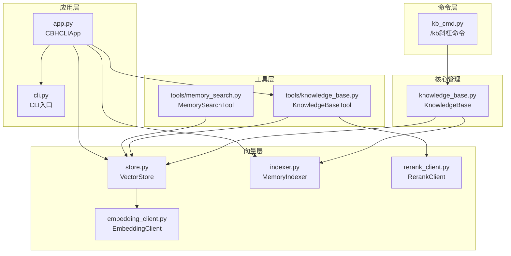
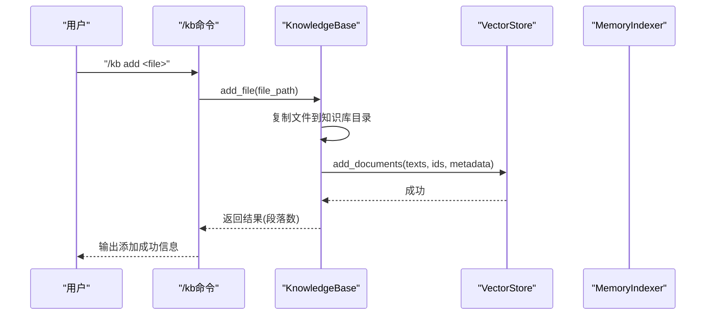
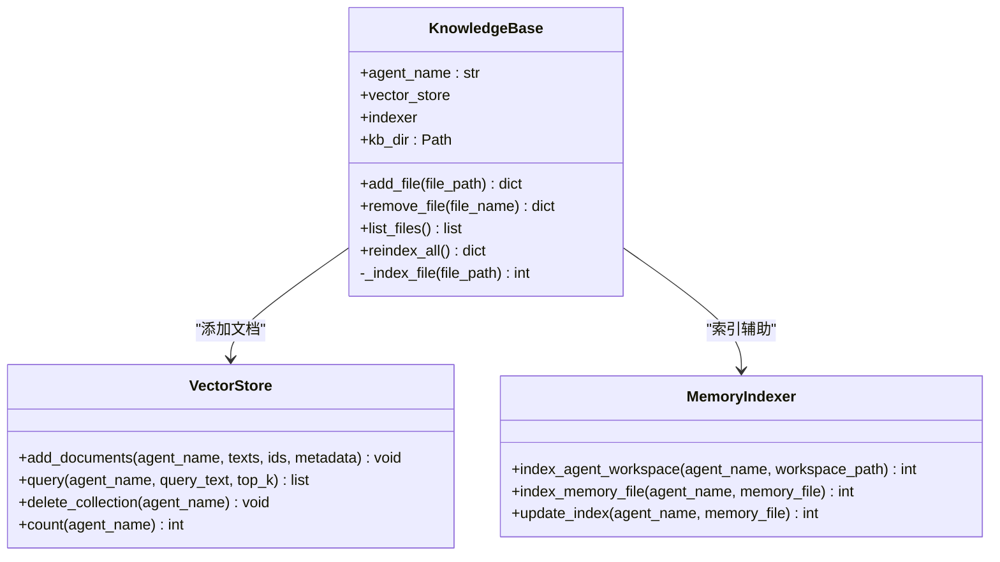
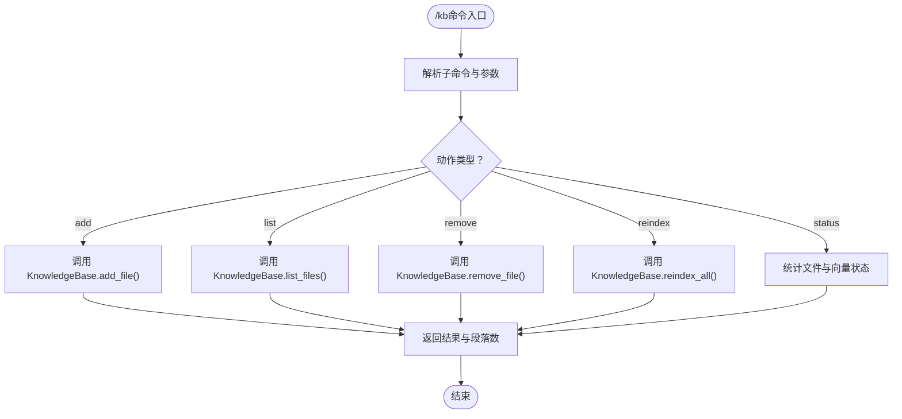
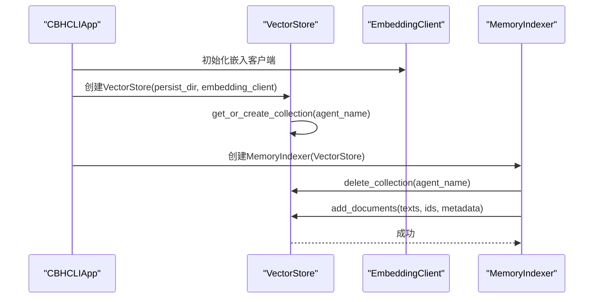
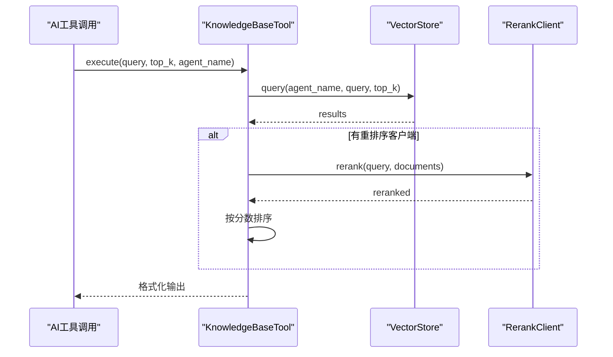
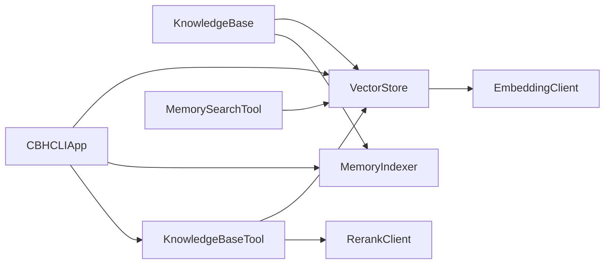

# 知识库系统设计理念

<cite>
**本文档引用的文件**
- [knowledge_base.py](file://cbhcli_pkg/core/knowledge_base.py)
- [kb_cmd.py](file://cbhcli_pkg/commands/kb_cmd.py)
- [indexer.py](file://cbhcli_pkg/vector/indexer.py)
- [store.py](file://cbhcli_pkg/vector/store.py)
- [knowledge_base.py](file://cbhcli_pkg/tools/knowledge_base.py)
- [app.py](file://cbhcli_pkg/core/app.py)
- [cli.py](file://cbhcli_pkg/cli.py)
- [README.md](file://README.md)
- [embedding_client.py](file://cbhcli_pkg/core/embedding_client.py)
- [rerank_client.py](file://cbhcli_pkg/core/rerank_client.py)
- [memory_search.py](file://cbhcli_pkg/tools/memory_search.py)
</cite>

## 目录
1. [简介](#简介)
2. [项目结构](#项目结构)
3. [核心组件](#核心组件)
4. [架构总览](#架构总览)
5. [详细组件分析](#详细组件分析)
6. [依赖关系分析](#依赖关系分析)
7. [性能考虑](#性能考虑)
8. [故障排除指南](#故障排除指南)
9. [结论](#结论)
10. [附录](#附录)

## 简介
本设计文档围绕CBHCLI的知识库系统，系统阐述其整体设计理念、文档管理、索引策略、查询机制以及与向量检索系统的集成方式。文档重点说明知识库的文件处理能力（格式支持、批量导入、增量更新）、查询与检索功能（关键词搜索、语义查询、结果过滤），并提供命令行接口与使用示例，最后给出扩展性与定制化建议，帮助用户从基础使用到高级定制的完整指导。

## 项目结构
知识库系统主要分布在以下模块：
- 核心管理：知识库实体类负责文件管理与索引
- 命令层：/kb斜杠命令提供CLI接口
- 向量层：向量存储与索引器封装ChromaDB与嵌入模型
- 工具层：知识库查询工具供AI工具调用
- 应用层：主应用装配向量存储、索引器与工具

图表来源
- [kb_cmd.py:1-186](file://cbhcli_pkg/commands/kb_cmd.py#L1-L186)
- [knowledge_base.py:1-207](file://cbhcli_pkg/core/knowledge_base.py#L1-L207)
- [store.py:1-175](file://cbhcli_pkg/vector/store.py#L1-L175)
- [indexer.py:1-178](file://cbhcli_pkg/vector/indexer.py#L1-L178)
- [knowledge_base.py:1-157](file://cbhcli_pkg/tools/knowledge_base.py#L1-L157)
- [memory_search.py:1-177](file://cbhcli_pkg/tools/memory_search.py#L1-L177)
- [app.py:1-478](file://cbhcli_pkg/core/app.py#L1-L478)
- [cli.py:1-112](file://cbhcli_pkg/cli.py#L1-L112)

章节来源
- [kb_cmd.py:1-186](file://cbhcli_pkg/commands/kb_cmd.py#L1-L186)
- [knowledge_base.py:1-207](file://cbhcli_pkg/core/knowledge_base.py#L1-L207)
- [store.py:1-175](file://cbhcli_pkg/vector/store.py#L1-L175)
- [indexer.py:1-178](file://cbhcli_pkg/vector/indexer.py#L1-L178)
- [knowledge_base.py:1-157](file://cbhcli_pkg/tools/knowledge_base.py#L1-L157)
- [memory_search.py:1-177](file://cbhcli_pkg/tools/memory_search.py#L1-L177)
- [app.py:1-478](file://cbhcli_pkg/core/app.py#L1-L478)
- [cli.py:1-112](file://cbhcli_pkg/cli.py#L1-L112)

## 核心组件
- 知识库管理器（KnowledgeBase）：负责Agent专属知识库目录的管理、文件的增删查、以及将文件内容分段索引到向量数据库。
- 向量存储（VectorStore）：封装ChromaDB持久化客户端，提供文档添加与语义查询能力，并通过自定义嵌入函数使用外部嵌入模型。
- 记忆索引器（MemoryIndexer）：负责索引Agent工作空间的标准MD文件与知识库目录，支持集合删除与重新索引。
- 知识库查询工具（KnowledgeBaseTool）：面向AI的工具接口，支持语义查询、可选重排序与结果格式化输出。
- 应用装配（CBHCLIApp）：在应用启动时根据配置初始化嵌入模型、向量存储、索引器与工具，并注册/加载Agent工作空间。

章节来源
- [knowledge_base.py:7-207](file://cbhcli_pkg/core/knowledge_base.py#L7-L207)
- [store.py:37-175](file://cbhcli_pkg/vector/store.py#L37-L175)
- [indexer.py:7-178](file://cbhcli_pkg/vector/indexer.py#L7-L178)
- [knowledge_base.py:6-157](file://cbhcli_pkg/tools/knowledge_base.py#L6-L157)
- [app.py:54-150](file://cbhcli_pkg/core/app.py#L54-L150)

## 架构总览
知识库系统采用“命令-管理-向量-工具-应用”的分层架构：
- 命令层：/kb命令解析与路由，调用知识库管理器执行具体操作。
- 管理层：知识库管理器负责文件复制、分段与向量索引。
- 向量层：向量存储统一管理集合与嵌入计算；索引器负责批量索引与集合生命周期管理。
- 工具层：知识库查询工具在AI工具调用链中执行语义查询与重排序。
- 应用层：主应用负责配置加载、工具注册、Agent工作空间索引与运行循环。

图表来源
- [kb_cmd.py:57-77](file://cbhcli_pkg/commands/kb_cmd.py#L57-L77)
- [knowledge_base.py:31-74](file://cbhcli_pkg/core/knowledge_base.py#L31-L74)
- [store.py:99-126](file://cbhcli_pkg/vector/store.py#L99-L126)

章节来源
- [kb_cmd.py:1-186](file://cbhcli_pkg/commands/kb_cmd.py#L1-L186)
- [knowledge_base.py:1-207](file://cbhcli_pkg/core/knowledge_base.py#L1-L207)
- [store.py:1-175](file://cbhcli_pkg/vector/store.py#L1-L175)

## 详细组件分析

### 知识库管理器（KnowledgeBase）
- 设计理念：为每个Agent维护独立的知识库目录，提供文件管理与向量索引能力，支持增量更新与重新索引。
- 文件处理：
  - 支持格式：.md、.txt、.py、.js、.json、.yaml、.yml等纯文本格式；二进制文件跳过。
  - 增量更新：新增文件时复制到知识库目录并分段索引；删除文件时提示需重新索引（简化实现）。
  - 批量导入：遍历知识库目录，逐个文件分段索引。
- 索引策略：
  - 按段落分割（双换行符），去除空白段。
  - 为每个段生成唯一文档ID与元数据（包含Agent名、文件名、段索引等）。
  - 通过向量存储统一添加到集合。
- 查询机制：
  - 通过向量存储执行语义查询，返回文档、元数据与距离。

图表来源
- [knowledge_base.py:7-207](file://cbhcli_pkg/core/knowledge_base.py#L7-L207)
- [store.py:37-175](file://cbhcli_pkg/vector/store.py#L37-L175)
- [indexer.py:7-178](file://cbhcli_pkg/vector/indexer.py#L7-L178)

章节来源
- [knowledge_base.py:1-207](file://cbhcli_pkg/core/knowledge_base.py#L1-L207)

### 命令行接口（/kb命令）
- 命令类型：斜杠命令，需要选择Agent后执行。
- 支持操作：
  - add：添加文件到知识库并索引。
  - list：列出知识库文件。
  - remove：从知识库删除文件（提示需重新索引）。
  - reindex：重新索引整个知识库。
  - status：查看知识库状态（Agent名、目录、文件数、向量文档数、索引器状态）。
- 与应用层集成：命令处理器从应用实例获取当前Agent名称与向量存储，构造知识库管理器并执行相应操作。

图表来源
- [kb_cmd.py:8-186](file://cbhcli_pkg/commands/kb_cmd.py#L8-L186)

章节来源
- [kb_cmd.py:1-186](file://cbhcli_pkg/commands/kb_cmd.py#L1-L186)

### 向量检索系统集成
- 嵌入模型：通过嵌入客户端支持OpenAI兼容与自定义嵌入模型，支持批量请求与超时控制。
- 向量存储：封装ChromaDB持久化客户端，使用自定义嵌入函数，预先计算嵌入向量以避免默认模型调用。
- 索引器：负责Agent工作空间标准MD文件与知识库目录的批量索引，支持删除旧集合后重建。
- 重排序：可选重排序客户端（Jina/Cohere等），在工具层对结果进行二次排序提升质量。

图表来源
- [app.py:97-150](file://cbhcli_pkg/core/app.py#L97-L150)
- [store.py:40-98](file://cbhcli_pkg/vector/store.py#L40-L98)
- [indexer.py:37-69](file://cbhcli_pkg/vector/indexer.py#L37-L69)
- [embedding_client.py:15-132](file://cbhcli_pkg/core/embedding_client.py#L15-L132)

章节来源
- [store.py:1-175](file://cbhcli_pkg/vector/store.py#L1-L175)
- [indexer.py:1-178](file://cbhcli_pkg/vector/indexer.py#L1-L178)
- [embedding_client.py:1-132](file://cbhcli_pkg/core/embedding_client.py#L1-L132)
- [app.py:1-478](file://cbhcli_pkg/core/app.py#L1-L478)

### 查询与检索功能
- 语义查询：通过向量存储的query方法执行，预先计算查询向量，返回文档、元数据与距离。
- 结果过滤：工具层可选重排序客户端对结果进行重排序，按分数降序排列。
- 关键词搜索：记忆搜索工具在向量存储不可用时，提供memory.md的关键词匹配降级方案。
- 工具调用：知识库查询工具在AI工具链中被调用，支持自动获取当前Agent名称与可配置返回数量。

图表来源
- [knowledge_base.py:49-122](file://cbhcli_pkg/tools/knowledge_base.py#L49-L122)
- [store.py:128-160](file://cbhcli_pkg/vector/store.py#L128-L160)
- [rerank_client.py:35-122](file://cbhcli_pkg/core/rerank_client.py#L35-L122)

章节来源
- [knowledge_base.py:1-157](file://cbhcli_pkg/tools/knowledge_base.py#L1-L157)
- [memory_search.py:1-177](file://cbhcli_pkg/tools/memory_search.py#L1-L177)
- [store.py:1-175](file://cbhcli_pkg/vector/store.py#L1-L175)
- [rerank_client.py:1-123](file://cbhcli_pkg/core/rerank_client.py#L1-L123)

## 依赖关系分析
- 组件耦合：
  - KnowledgeBase依赖VectorStore与MemoryIndexer，耦合度适中，便于替换实现。
  - VectorStore依赖EmbeddingClient，形成清晰的抽象边界。
  - KnowledgeBaseTool依赖VectorStore与可选RerankClient，支持可插拔重排序。
- 外部依赖：
  - ChromaDB用于向量存储与查询。
  - requests用于嵌入与重排序API调用。
- 潜在循环依赖：当前模块间无循环依赖，职责清晰。

图表来源
- [knowledge_base.py:1-207](file://cbhcli_pkg/core/knowledge_base.py#L1-L207)
- [store.py:1-175](file://cbhcli_pkg/vector/store.py#L1-L175)
- [indexer.py:1-178](file://cbhcli_pkg/vector/indexer.py#L1-L178)
- [knowledge_base.py:1-157](file://cbhcli_pkg/tools/knowledge_base.py#L1-L157)
- [memory_search.py:1-177](file://cbhcli_pkg/tools/memory_search.py#L1-L177)
- [app.py:1-478](file://cbhcli_pkg/core/app.py#L1-L478)

章节来源
- [knowledge_base.py:1-207](file://cbhcli_pkg/core/knowledge_base.py#L1-L207)
- [store.py:1-175](file://cbhcli_pkg/vector/store.py#L1-L175)
- [indexer.py:1-178](file://cbhcli_pkg/vector/indexer.py#L1-L178)
- [knowledge_base.py:1-157](file://cbhcli_pkg/tools/knowledge_base.py#L1-L157)
- [memory_search.py:1-177](file://cbhcli_pkg/tools/memory_search.py#L1-L177)
- [app.py:1-478](file://cbhcli_pkg/core/app.py#L1-L478)

## 性能考虑
- 嵌入计算优化：
  - 预先计算文档与查询向量，避免ChromaDB内部默认模型调用，减少API开销与延迟。
  - 嵌入客户端支持批量请求，默认每批10条，平衡吞吐与超时。
- 存储与查询：
  - 使用持久化客户端，避免内存重建。
  - 查询时仅包含必要字段（文档、元数据、距离），减少传输与渲染开销。
- 索引策略：
  - 手动索引策略降低启动时的API调用与等待时间。
  - 集合删除后重建，确保内容变更后的索引一致性。
- 重排序：
  - 仅在结果数量大于1时进行重排序，避免不必要的额外调用。

章节来源
- [store.py:118-160](file://cbhcli_pkg/vector/store.py#L118-L160)
- [embedding_client.py:49-118](file://cbhcli_pkg/core/embedding_client.py#L49-L118)
- [indexer.py:48-69](file://cbhcli_pkg/vector/indexer.py#L48-L69)

## 故障排除指南
- 向量存储未启用：
  - 现象：知识库查询工具返回“向量数据库未启用”。
  - 处理：安装ChromaDB并配置嵌入模型后重启应用。
- 嵌入模型配置错误：
  - 现象：初始化嵌入客户端失败。
  - 处理：检查配置项（API Key、Base URL、模型ID、类型）并重新配置。
- 知识库文件不存在或非文件：
  - 现象：添加文件失败。
  - 处理：确认文件路径存在且为文件，支持的格式包括.md、.txt、.py、.js、.json、.yaml、.yml。
- 删除文件后未更新索引：
  - 现象：删除文件后仍能查询到内容。
  - 处理：执行“/kb reindex”重新索引知识库。
- 重排序失败：
  - 现象：重排序异常但不影响查询。
  - 处理：检查重排序模型配置与网络连接，系统会回退到原始结果。

章节来源
- [knowledge_base.py:72-78](file://cbhcli_pkg/tools/knowledge_base.py#L72-L78)
- [kb_cmd.py:72-76](file://cbhcli_pkg/commands/kb_cmd.py#L72-L76)
- [knowledge_base.py:43-47](file://cbhcli_pkg/core/knowledge_base.py#L43-L47)
- [knowledge_base.py:93-95](file://cbhcli_pkg/core/knowledge_base.py#L93-L95)
- [knowledge_base.py:154-156](file://cbhcli_pkg/tools/knowledge_base.py#L154-L156)

## 结论
CBHCLI的知识库系统以“命令-管理-向量-工具-应用”分层设计为核心，实现了Agent专属知识库的文件管理、向量化索引与语义查询。通过预计算嵌入、批量处理与手动索引策略，系统在性能与成本之间取得平衡。工具层提供可插拔的重排序能力，增强检索质量。整体架构具备良好的扩展性与定制化能力，适合在多Agent场景下进行深度定制与优化。

## 附录

### 命令行接口与使用示例
- 启动应用与查看帮助
  - cbhcli
  - /help
- 配置模型与嵌入模型
  - /model add
  - /model embedding add
- 创建Agent与切换
  - /agent create <name>
  - /agent switch <name>
- 知识库管理
  - /kb add <file_path>
  - /kb list
  - /kb remove <file_name>
  - /kb reindex
  - /kb status
- 向量索引
  - /embedding index
  - /embedding status
  - /embedding reindex

章节来源
- [cli.py:1-112](file://cbhcli_pkg/cli.py#L1-L112)
- [README.md:63-133](file://README.md#L63-L133)

### 代码示例路径
- 知识库创建与管理
  - [知识库管理器初始化:16-29](file://cbhcli_pkg/core/knowledge_base.py#L16-L29)
  - [添加文件到知识库:31-74](file://cbhcli_pkg/core/knowledge_base.py#L31-L74)
  - [/kb add命令处理器:57-77](file://cbhcli_pkg/commands/kb_cmd.py#L57-L77)
- 向量检索与查询
  - [向量存储查询:128-160](file://cbhcli_pkg/vector/store.py#L128-L160)
  - [知识库查询工具execute:49-122](file://cbhcli_pkg/tools/knowledge_base.py#L49-L122)
- 应用装配与索引
  - [应用初始化嵌入与向量存储:97-150](file://cbhcli_pkg/core/app.py#L97-L150)
  - [索引器批量索引:37-69](file://cbhcli_pkg/vector/indexer.py#L37-L69)

章节来源
- [knowledge_base.py:1-207](file://cbhcli_pkg/core/knowledge_base.py#L1-L207)
- [kb_cmd.py:1-186](file://cbhcli_pkg/commands/kb_cmd.py#L1-L186)
- [store.py:1-175](file://cbhcli_pkg/vector/store.py#L1-L175)
- [knowledge_base.py:1-157](file://cbhcli_pkg/tools/knowledge_base.py#L1-L157)
- [app.py:1-478](file://cbhcli_pkg/core/app.py#L1-L478)
- [indexer.py:1-178](file://cbhcli_pkg/vector/indexer.py#L1-L178)