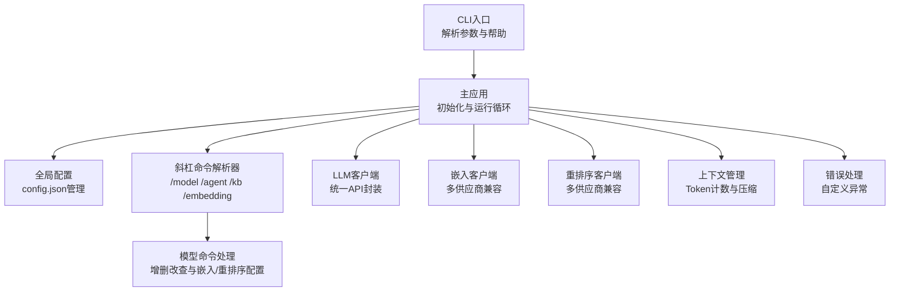
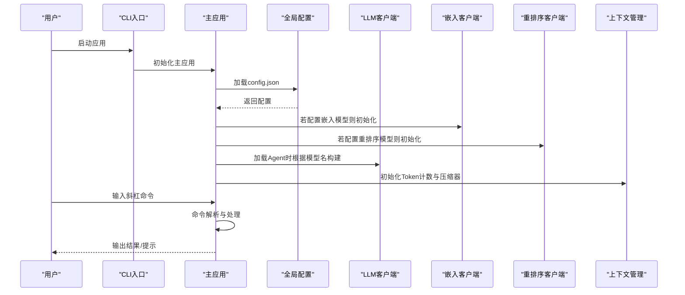
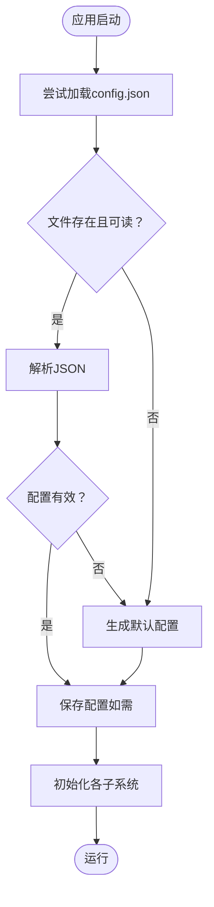
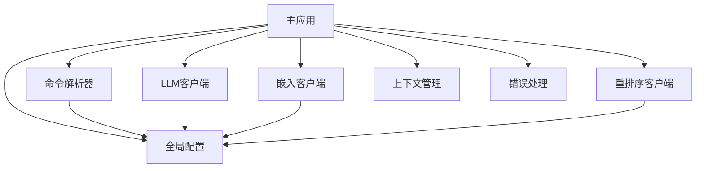

# API配置管理

<cite>
**本文引用的文件**
- [README.md](file://README.md)
- [global_config.py](file://cbhcli_pkg/config/global_config.py)
- [constants.py](file://cbhcli_pkg/core/constants.py)
- [model.py](file://cbhcli_pkg/core/model.py)
- [app.py](file://cbhcli_pkg/core/app.py)
- [cli.py](file://cbhcli_pkg/cli.py)
- [model_cmd.py](file://cbhcli_pkg/commands/model_cmd.py)
- [parser.py](file://cbhcli_pkg/commands/parser.py)
- [embedding_client.py](file://cbhcli_pkg/core/embedding_client.py)
- [rerank_client.py](file://cbhcli_pkg/core/rerank_client.py)
- [token_counter.py](file://cbhcli_pkg/context/token_counter.py)
- [compressor.py](file://cbhcli_pkg/context/compressor.py)
- [errors.py](file://cbhcli_pkg/core/errors.py)
</cite>

## 目录
1. [简介](#简介)
2. [项目结构](#项目结构)
3. [核心组件](#核心组件)
4. [架构总览](#架构总览)
5. [详细组件分析](#详细组件分析)
6. [依赖分析](#依赖分析)
7. [性能考量](#性能考量)
8. [故障排除指南](#故障排除指南)
9. [结论](#结论)
10. [附录](#附录)

## 简介
本文件面向CBHCLI API配置管理系统，围绕config.json配置文件的结构与字段、API密钥安全存储与访问控制、Base URL配置与供应商URL格式、模型ID命名规范与版本策略、上下文长度限制、API超时与重试机制、错误处理、配置验证与加载流程，以及配置备份、迁移与故障排除提供系统化技术文档。文档同时给出可视化图示，帮助非专业读者理解整体架构与关键流程。

## 项目结构
CBHCLI采用模块化组织，核心配置与运行逻辑集中在cbhcli_pkg目录下，命令系统通过斜杠命令解析器集中管理，模型与嵌入/重排序客户端分别封装API调用细节，上下文管理与压缩器负责上下文长度控制。

图表来源
- [cli.py:73-112](file://cbhcli_pkg/cli.py#L73-L112)
- [app.py:54-478](file://cbhcli_pkg/core/app.py#L54-L478)
- [parser.py:16-94](file://cbhcli_pkg/commands/parser.py#L16-L94)
- [model_cmd.py:5-371](file://cbhcli_pkg/commands/model_cmd.py#L5-L371)
- [global_config.py:13-154](file://cbhcli_pkg/config/global_config.py#L13-L154)
- [model.py:7-147](file://cbhcli_pkg/core/model.py#L7-L147)
- [embedding_client.py:6-132](file://cbhcli_pkg/core/embedding_client.py#L6-L132)
- [rerank_client.py:6-123](file://cbhcli_pkg/core/rerank_client.py#L6-L123)
- [token_counter.py:14-88](file://cbhcli_pkg/context/token_counter.py#L14-L88)
- [compressor.py:7-112](file://cbhcli_pkg/context/compressor.py#L7-L112)
- [errors.py:4-32](file://cbhcli_pkg/core/errors.py#L4-L32)

章节来源
- [README.md:150-206](file://README.md#L150-L206)
- [cli.py:73-112](file://cbhcli_pkg/cli.py#L73-L112)
- [app.py:73-120](file://cbhcli_pkg/core/app.py#L73-L120)

## 核心组件
- 全局配置管理：负责config.json的加载、默认值生成、模型/嵌入/重排序配置的增删改查、Agent与设置项管理。
- LLM客户端：封装统一的聊天与嵌入API调用，支持流式与非流式响应，内置超时控制。
- 嵌入客户端：支持OpenAI兼容与自定义类型，批量处理文本向量化。
- 重排序客户端：支持Jina/Cohere等多供应商API，对检索结果进行重排序。
- 上下文管理：Token计数器与上下文压缩器，结合常量中的默认上下文限制与压缩比例，实现自动压缩。
- 命令系统：斜杠命令解析器与模型命令处理，提供交互式配置体验。
- 错误处理：自定义异常类型，便于定位与分类处理。

章节来源
- [global_config.py:13-154](file://cbhcli_pkg/config/global_config.py#L13-L154)
- [model.py:7-147](file://cbhcli_pkg/core/model.py#L7-L147)
- [embedding_client.py:6-132](file://cbhcli_pkg/core/embedding_client.py#L6-L132)
- [rerank_client.py:6-123](file://cbhcli_pkg/core/rerank_client.py#L6-L123)
- [token_counter.py:14-88](file://cbhcli_pkg/context/token_counter.py#L14-L88)
- [compressor.py:7-112](file://cbhcli_pkg/context/compressor.py#L7-L112)
- [parser.py:16-94](file://cbhcli_pkg/commands/parser.py#L16-L94)
- [model_cmd.py:5-371](file://cbhcli_pkg/commands/model_cmd.py#L5-L371)
- [errors.py:4-32](file://cbhcli_pkg/core/errors.py#L4-L32)

## 架构总览
下图展示配置文件加载、模型与嵌入/重排序客户端初始化、上下文管理与命令系统的交互关系。

图表来源
- [cli.py:73-112](file://cbhcli_pkg/cli.py#L73-L112)
- [app.py:73-120](file://cbhcli_pkg/core/app.py#L73-L120)
- [global_config.py:20-48](file://cbhcli_pkg/config/global_config.py#L20-L48)
- [model_cmd.py:64-176](file://cbhcli_pkg/commands/model_cmd.py#L64-L176)
- [embedding_client.py:15-33](file://cbhcli_pkg/core/embedding_client.py#L15-L33)
- [rerank_client.py:16-34](file://cbhcli_pkg/core/rerank_client.py#L16-L34)
- [model.py:10-27](file://cbhcli_pkg/core/model.py#L10-L27)
- [token_counter.py:14-33](file://cbhcli_pkg/context/token_counter.py#L14-L33)
- [compressor.py:10-20](file://cbhcli_pkg/context/compressor.py#L10-L20)

## 详细组件分析

### 配置文件结构与字段说明
- 全局配置位置：用户主目录下的隐藏目录中，文件名为config.json。
- 关键字段：
  - models：数组，元素为模型配置对象，包含name、apiKey、url、model、context_limit等。
  - embedding_model：对象，包含name、apiKey、url、model、type；type可为openai或custom。
  - rerank_model：对象，包含name、apiKey、url、model、top_n。
  - agents：对象，包含default_agent与active_agent。
  - settings：对象，包含auto_compress、compression_ratio、workspace_base、use_chromadb_embedding、knowledge_base_dir等。
- 默认配置：当配置文件不存在或加载失败时，系统生成默认配置并保存至文件。

章节来源
- [README.md:152-190](file://README.md#L152-L190)
- [global_config.py:20-48](file://cbhcli_pkg/config/global_config.py#L20-L48)

### API密钥的安全存储与管理
- 存储位置：config.json位于用户主目录的隐藏文件中，避免直接暴露在shell历史或日志中。
- 访问控制：配置文件由应用在启动时读取，未提供额外的加密存储机制；建议配合操作系统权限与文件系统加密策略使用。
- 交互式录入：模型与嵌入/重排序配置通过交互式命令行录入，减少硬编码风险。

章节来源
- [global_config.py:9-10](file://cbhcli_pkg/config/global_config.py#L9-L10)
- [model_cmd.py:64-104](file://cbhcli_pkg/commands/model_cmd.py#L64-L104)
- [model_cmd.py:207-237](file://cbhcli_pkg/commands/model_cmd.py#L207-L237)
- [model_cmd.py:304-335](file://cbhcli_pkg/commands/model_cmd.py#L304-L335)

### Base URL配置与供应商URL格式
- LLM客户端：基于模型配置的url字段拼接/chat/completions与/embeddings端点。
- 嵌入客户端：支持openai与custom两类，均通过配置的url拼接/embeddings端点。
- 重排序客户端：默认Jina API的/v1/rerank端点，Cohere使用/v1/rerank端点。
- 供应商示例：OpenAI兼容API、Jina Reranker、Cohere Rerank等。

章节来源
- [model.py:17-26](file://cbhcli_pkg/core/model.py#L17-L26)
- [model.py:47-51](file://cbhcli_pkg/core/model.py#L47-L51)
- [model.py:136-140](file://cbhcli_pkg/core/model.py#L136-L140)
- [embedding_client.py:23-32](file://cbhcli_pkg/core/embedding_client.py#L23-L32)
- [embedding_client.py:80-84](file://cbhcli_pkg/core/embedding_client.py#L80-L84)
- [rerank_client.py:24-33](file://cbhcli_pkg/core/rerank_client.py#L24-L33)
- [rerank_client.py:70-74](file://cbhcli_pkg/core/rerank_client.py#L70-L74)
- [rerank_client.py:101-105](file://cbhcli_pkg/core/rerank_client.py#L101-L105)

### 模型ID命名规范与版本管理
- 命名规范：模型ID应遵循供应商提供的官方标识符，如gpt-4o、text-embedding-3-small、jina-reranker-v2-base-multilingual等。
- 版本管理：通过在config.json中为具体模型配置独立的model字段实现版本选择；切换模型即实现版本切换。
- 上下文限制：可在模型配置中显式设置context_limit，未设置时默认使用常量中的默认值。

章节来源
- [model_cmd.py:83-101](file://cbhcli_pkg/commands/model_cmd.py#L83-L101)
- [model_cmd.py:222-234](file://cbhcli_pkg/commands/model_cmd.py#L222-L234)
- [model_cmd.py:319-332](file://cbhcli_pkg/commands/model_cmd.py#L319-L332)
- [model.py:20](file://cbhcli_pkg/core/model.py#L20)
- [constants.py:6](file://cbhcli_pkg/core/constants.py#L6)

### 上下文长度限制与影响因素
- 默认限制：常量中定义默认上下文限制与压缩比例。
- 实际限制：若LLM客户端存在，则优先使用其context_limit；否则使用默认值。
- 影响因素：模型ID、消息数量与内容长度、工具调用输出、上下文压缩策略。
- 自动压缩：当达到阈值时，系统会自动压缩历史对话，保留关键摘要。

章节来源
- [constants.py:6](file://cbhcli_pkg/core/constants.py#L6)
- [app.py:323-330](file://cbhcli_pkg/core/app.py#L323-L330)
- [model.py:20](file://cbhcli_pkg/core/model.py#L20)
- [compressor.py:21-81](file://cbhcli_pkg/context/compressor.py#L21-L81)
- [token_counter.py:34-75](file://cbhcli_pkg/context/token_counter.py#L34-L75)

### API超时设置、重试机制与错误处理
- 超时设置：LLM聊天与嵌入请求分别设置超时；重排序请求也设置超时。
- 重试机制：当前实现未内置自动重试逻辑，遇到HTTP错误会抛出异常。
- 错误处理：自定义异常类型用于区分不同场景；应用层捕获异常并输出友好提示。

章节来源
- [model.py:50](file://cbhcli_pkg/core/model.py#L50)
- [model.py:86](file://cbhcli_pkg/core/model.py#L86)
- [model.py:139](file://cbhcli_pkg/core/model.py#L139)
- [embedding_client.py:83](file://cbhcli_pkg/core/embedding_client.py#L83)
- [rerank_client.py:73](file://cbhcli_pkg/core/rerank_client.py#L73)
- [errors.py:4-32](file://cbhcli_pkg/core/errors.py#L4-L32)

### 配置验证与加载流程
- 加载流程：应用启动时创建全局配置实例，尝试读取config.json；若失败则生成默认配置。
- 验证要点：模型配置需包含name、apiKey、url、model；嵌入/重排序配置需包含对应必要字段。
- 保存策略：每次修改配置后立即持久化到磁盘。

图表来源
- [global_config.py:20-48](file://cbhcli_pkg/config/global_config.py#L20-L48)
- [app.py:73-84](file://cbhcli_pkg/core/app.py#L73-L84)

章节来源
- [global_config.py:20-48](file://cbhcli_pkg/config/global_config.py#L20-L48)
- [app.py:73-84](file://cbhcli_pkg/core/app.py#L73-L84)

### 配置备份、迁移与故障排除
- 备份：直接复制用户主目录下的隐藏配置目录即可完成备份。
- 迁移：在新环境中同样放置相同结构的config.json，即可无缝迁移。
- 故障排除：
  - 模型不可用：检查模型配置是否正确、API Key是否有效、URL是否可达。
  - 嵌入/重排序失败：确认供应商API可用、网络连通、超时设置合理。
  - 上下文溢出：降低上下文使用率或触发压缩；调整压缩比例或模型上下文限制。
  - 权限问题：确保配置文件所在目录具有正确的读写权限。

章节来源
- [README.md:150-190](file://README.md#L150-L190)
- [model.py:53-54](file://cbhcli_pkg/core/model.py#L53-L54)
- [model.py:142-143](file://cbhcli_pkg/core/model.py#L142-L143)
- [embedding_client.py:86-87](file://cbhcli_pkg/core/embedding_client.py#L86-L87)
- [rerank_client.py:76-77](file://cbhcli_pkg/core/rerank_client.py#L76-L77)

## 依赖分析
- 组件耦合：
  - 主应用依赖全局配置、命令解析器、LLM/嵌入/重排序客户端、上下文管理与错误处理。
  - 模型命令处理依赖全局配置与交互式输入。
  - 客户端类彼此独立，通过配置解耦。
- 外部依赖：
  - requests用于HTTP请求。
  - 可选依赖tiktoken用于精确Token计数。
- 潜在环依赖：未发现直接环依赖，模块职责清晰。

图表来源
- [app.py:12-25](file://cbhcli_pkg/core/app.py#L12-L25)
- [parser.py:16-25](file://cbhcli_pkg/commands/parser.py#L16-L25)
- [model_cmd.py:2-3](file://cbhcli_pkg/commands/model_cmd.py#L2-L3)
- [model.py:2-5](file://cbhcli_pkg/core/model.py#L2-L5)
- [embedding_client.py:2-4](file://cbhcli_pkg/core/embedding_client.py#L2-L4)
- [rerank_client.py:2-4](file://cbhcli_pkg/core/rerank_client.py#L2-L4)

章节来源
- [app.py:12-25](file://cbhcli_pkg/core/app.py#L12-L25)
- [parser.py:16-25](file://cbhcli_pkg/commands/parser.py#L16-L25)
- [model_cmd.py:2-3](file://cbhcli_pkg/commands/model_cmd.py#L2-L3)

## 性能考量
- Token计数：优先使用tiktoken进行精确计数，缺失时采用估算策略，估算精度随语言混合而下降。
- 批量嵌入：嵌入客户端支持分批处理，减少单次请求负载与超时风险。
- 上下文压缩：在接近上下文上限时自动压缩，显著降低后续请求成本与延迟。
- 超时控制：为各类API调用设置超时，避免长时间阻塞。

章节来源
- [token_counter.py:7-11](file://cbhcli_pkg/context/token_counter.py#L7-L11)
- [token_counter.py:27-33](file://cbhcli_pkg/context/token_counter.py#L27-L33)
- [embedding_client.py:49-70](file://cbhcli_pkg/core/embedding_client.py#L49-L70)
- [compressor.py:21-81](file://cbhcli_pkg/context/compressor.py#L21-L81)
- [model.py:50](file://cbhcli_pkg/core/model.py#L50)
- [model.py:86](file://cbhcli_pkg/core/model.py#L86)
- [model.py:139](file://cbhcli_pkg/core/model.py#L139)

## 故障排除指南
- 模型未配置：使用斜杠命令查看当前模型信息，确认已配置并切换。
- API请求失败：检查API Key、URL、网络连通性与超时设置。
- 嵌入/重排序初始化失败：确认供应商API可用与配置正确。
- 上下文压缩失败：检查模型与Token计数器状态，适当调整压缩比例。
- 自定义异常：根据异常类型定位问题来源，如模型未配置、上下文超限等。

章节来源
- [app.py:161-178](file://cbhcli_pkg/core/app.py#L161-L178)
- [model.py:53-54](file://cbhcli_pkg/core/model.py#L53-L54)
- [model.py:142-143](file://cbhcli_pkg/core/model.py#L142-L143)
- [embedding_client.py:86-87](file://cbhcli_pkg/core/embedding_client.py#L86-L87)
- [rerank_client.py:76-77](file://cbhcli_pkg/core/rerank_client.py#L76-L77)
- [errors.py:9-31](file://cbhcli_pkg/core/errors.py#L9-L31)

## 结论
CBHCLI的配置管理以config.json为核心，通过全局配置类统一加载与持久化，结合命令系统提供交互式配置体验。模型、嵌入与重排序三类API通过客户端类封装，具备良好的扩展性与跨供应商兼容性。上下文管理与压缩机制有效控制成本与性能。建议在生产环境中配合文件系统权限与外部密钥管理工具，进一步提升安全性与可维护性。

## 附录
- 命令参考与使用示例可参考README中的“配置”与“命令参考”章节。
- 配置文件示例与Agent工作空间结构详见README相应部分。

章节来源
- [README.md:150-206](file://README.md#L150-L206)
- [README.md:231-261](file://README.md#L231-L261)