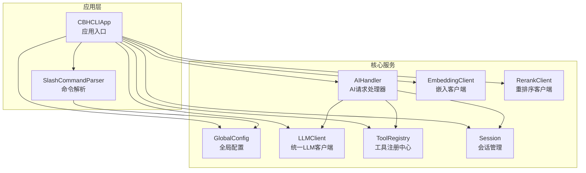
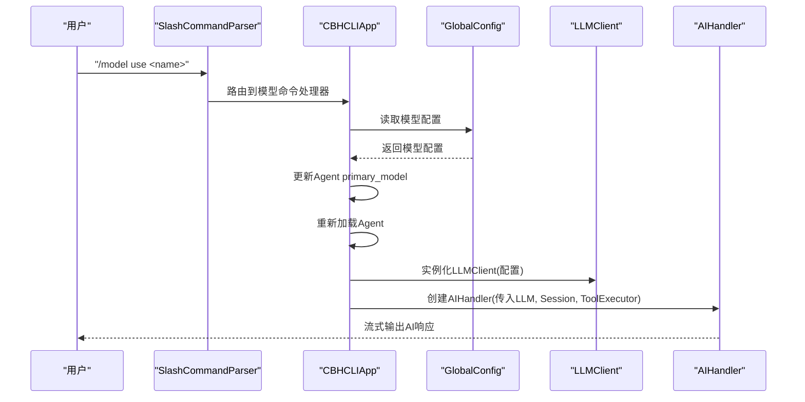
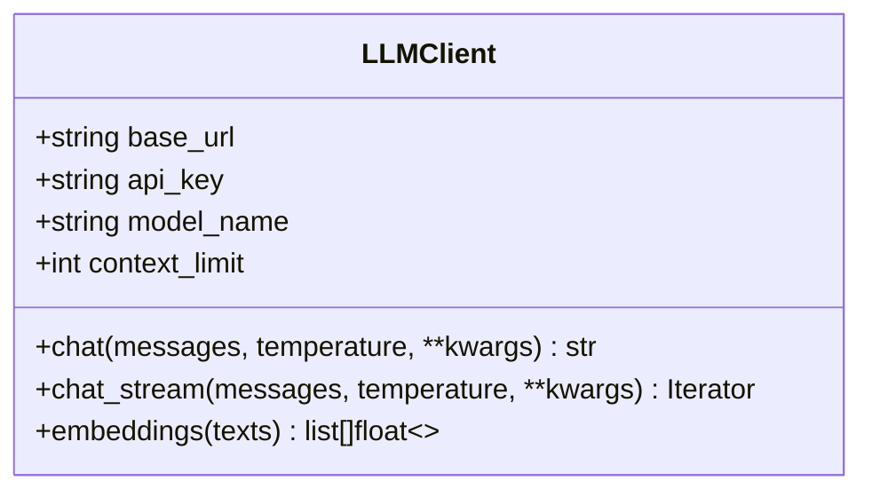
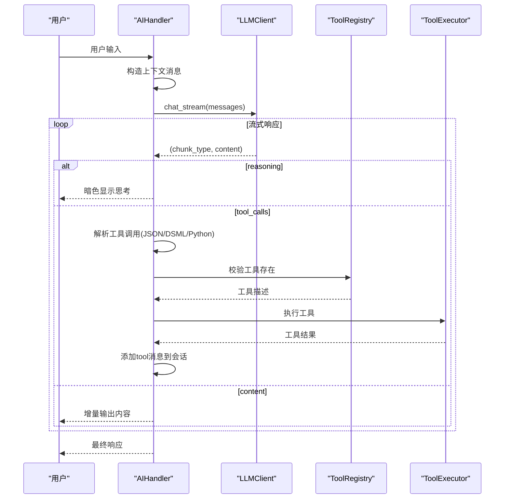
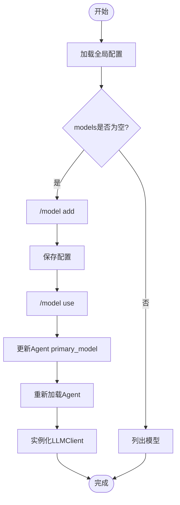
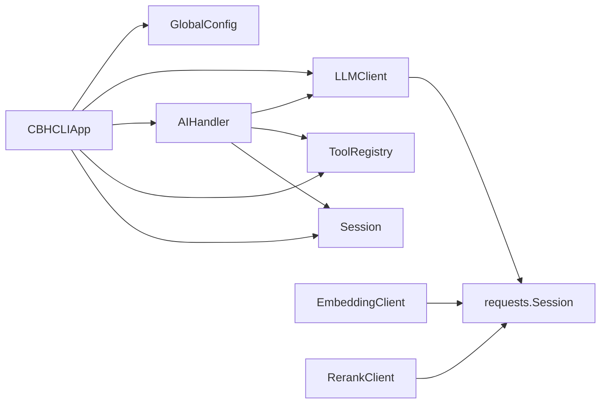

# 多模型支持机制

<cite>
**本文引用的文件**
- [model.py](file://cbhcli_pkg/core/model.py)
- [ai_handler.py](file://cbhcli_pkg/core/ai_handler.py)
- [global_config.py](file://cbhcli_pkg/config/global_config.py)
- [constants.py](file://cbhcli_pkg/core/constants.py)
- [app.py](file://cbhcli_pkg/core/app.py)
- [model_cmd.py](file://cbhcli_pkg/commands/model_cmd.py)
- [embedding_client.py](file://cbhcli_pkg/core/embedding_client.py)
- [rerank_client.py](file://cbhcli_pkg/core/rerank_client.py)
- [session.py](file://cbhcli_pkg/core/session.py)
- [registry.py](file://cbhcli_pkg/tools/registry.py)
- [errors.py](file://cbhcli_pkg/core/errors.py)
- [README.md](file://README.md)
</cite>

## 目录
1. [简介](#简介)
2. [项目结构](#项目结构)
3. [核心组件](#核心组件)
4. [架构总览](#架构总览)
5. [详细组件分析](#详细组件分析)
6. [依赖分析](#依赖分析)
7. [性能考量](#性能考量)
8. [故障排查指南](#故障排查指南)
9. [结论](#结论)
10. [附录](#附录)

## 简介
本文件围绕CBHCLI的多模型支持机制展开，重点阐述LLMClient类的设计与实现，统一API调用封装的机制，以及如何配置与管理多个不同供应商的AI模型（OpenAI、Claude、Gemini等）。文档还解释了模型配置的数据结构（base_url、api_key、model_name、context_limit等），提供配置示例与最佳实践，说明模型切换的内部实现与性能考虑，并涵盖兼容性检查与错误处理策略，最后给出自定义模型适配的技术指导与扩展方法。

## 项目结构
CBHCLI采用模块化设计，核心能力集中在core目录，命令入口在commands目录，配置与工具在各自独立模块中。多模型支持的关键路径如下：
- LLM统一客户端：cbhcli_pkg/core/model.py
- AI请求处理与工具调用：cbhcli_pkg/core/ai_handler.py
- 全局配置与模型管理：cbhcli_pkg/config/global_config.py
- 应用入口与模型切换：cbhcli_pkg/core/app.py
- 模型命令接口：cbhcli_pkg/commands/model_cmd.py
- 嵌入与重排序客户端：cbhcli_pkg/core/embedding_client.py、cbhcli_pkg/core/rerank_client.py
- 会话与上下文管理：cbhcli_pkg/core/session.py
- 工具注册与执行：cbhcli_pkg/tools/registry.py
- 错误类型定义：cbhcli_pkg/core/errors.py

图表来源
- [app.py:54-478](file://cbhcli_pkg/core/app.py#L54-L478)
- [model.py:7-147](file://cbhcli_pkg/core/model.py#L7-L147)
- [ai_handler.py:21-743](file://cbhcli_pkg/core/ai_handler.py#L21-L743)
- [global_config.py:13-154](file://cbhcli_pkg/config/global_config.py#L13-L154)
- [embedding_client.py:6-132](file://cbhcli_pkg/core/embedding_client.py#L6-L132)
- [rerank_client.py:6-123](file://cbhcli_pkg/core/rerank_client.py#L6-L123)
- [session.py:37-190](file://cbhcli_pkg/core/session.py#L37-L190)
- [registry.py:51-115](file://cbhcli_pkg/tools/registry.py#L51-L115)

章节来源
- [app.py:54-478](file://cbhcli_pkg/core/app.py#L54-L478)
- [model.py:7-147](file://cbhcli_pkg/core/model.py#L7-L147)
- [ai_handler.py:21-743](file://cbhcli_pkg/core/ai_handler.py#L21-L743)
- [global_config.py:13-154](file://cbhcli_pkg/config/global_config.py#L13-L154)
- [embedding_client.py:6-132](file://cbhcli_pkg/core/embedding_client.py#L6-L132)
- [rerank_client.py:6-123](file://cbhcli_pkg/core/rerank_client.py#L6-L123)
- [session.py:37-190](file://cbhcli_pkg/core/session.py#L37-L190)
- [registry.py:51-115](file://cbhcli_pkg/tools/registry.py#L51-L115)

## 核心组件
- LLMClient：统一LLM API客户端，封装非流式与流式聊天、embedding获取等通用逻辑，支持OpenAI兼容API风格。
- AIHandler：负责AI请求处理、流式输出解析、工具调用提取与执行、多轮工具调用协调。
- GlobalConfig：全局配置管理，提供模型增删改查、嵌入/重排序模型配置、Agent与设置管理。
- CBHCLIApp：应用入口，负责Agent加载、模型切换、会话管理、上下文压缩与命令路由。
- EmbeddingClient/RerankClient：分别负责向量嵌入与重排序，支持多种供应商API。
- Session/ContextWindow：会话消息结构与上下文窗口管理，配合Token计数与自动压缩。
- ToolRegistry：工具注册与执行中心，支撑AI工具调用。

章节来源
- [model.py:7-147](file://cbhcli_pkg/core/model.py#L7-L147)
- [ai_handler.py:21-743](file://cbhcli_pkg/core/ai_handler.py#L21-L743)
- [global_config.py:13-154](file://cbhcli_pkg/config/global_config.py#L13-L154)
- [app.py:54-478](file://cbhcli_pkg/core/app.py#L54-L478)
- [embedding_client.py:6-132](file://cbhcli_pkg/core/embedding_client.py#L6-L132)
- [rerank_client.py:6-123](file://cbhcli_pkg/core/rerank_client.py#L6-L123)
- [session.py:37-190](file://cbhcli_pkg/core/session.py#L37-L190)
- [registry.py:51-115](file://cbhcli_pkg/tools/registry.py#L51-L115)

## 架构总览
多模型支持的核心在于“统一客户端 + 配置驱动 + 命令管理”的组合：
- 统一客户端：LLMClient以OpenAI兼容API风格封装，通过base_url与model_name适配不同供应商。
- 配置驱动：GlobalConfig集中管理模型列表与当前Agent绑定，支持上下文限制等参数。
- 命令管理：SlashCommandParser提供/model系列命令，实现模型的增删改查与切换。
- 应用入口：CBHCLIApp在Agent加载时根据配置实例化LLMClient，并在会话中传递给AIHandler。

图表来源
- [model_cmd.py:130-149](file://cbhcli_pkg/commands/model_cmd.py#L130-L149)
- [app.py:249-279](file://cbhcli_pkg/core/app.py#L249-L279)
- [global_config.py:56-90](file://cbhcli_pkg/config/global_config.py#L56-L90)
- [model.py:10-26](file://cbhcli_pkg/core/model.py#L10-L26)
- [ai_handler.py:422-439](file://cbhcli_pkg/core/ai_handler.py#L422-L439)

## 详细组件分析

### LLMClient类设计与实现
- 设计目标：统一LLM API调用，屏蔽不同供应商差异，提供一致的聊天与embedding接口。
- 关键字段：
  - base_url：API基础URL，末尾斜杠会被清理。
  - api_key：认证令牌，注入到Authorization头。
  - model_name：模型标识，用于API调用。
  - context_limit：上下文长度限制，默认128000。
- 核心方法：
  - chat：非流式聊天完成，返回完整文本。
  - chat_stream：流式聊天完成，按chunk产出，支持reasoning、tool_calls、content三类事件。
  - embeddings：获取文本embedding向量列表。
- 流式解析策略：
  - 识别data:前缀与[DONE]结束信号。
  - 支持reasoning_content/reasoning字段（某些思考模型）。
  - 支持tool_calls字段（某些模型直接返回工具调用）。
  - content增量输出，结合ResponseCleaner进行增量清理。
- 错误处理：HTTP状态码非200时抛出异常；JSON解析失败时跳过无效行。

图表来源
- [model.py:7-147](file://cbhcli_pkg/core/model.py#L7-L147)

章节来源
- [model.py:7-147](file://cbhcli_pkg/core/model.py#L7-L147)

### AIHandler处理流程与工具调用
- 请求处理：将用户输入加入会话，循环获取AI响应，提取工具调用并执行。
- 流式输出：区分reasoning/content/tool_calls三类事件，分别渲染与累积。
- 工具调用提取：支持DSML标签、Python函数调用、JSON格式（args/arguments）、纯文本命令等格式，具备占位符过滤与严格匹配。
- 多轮工具调用：在每轮结束后注入格式提示，确保AI遵循工具调用规范。
- 结果回传：将工具执行结果以tool消息形式加入会话，供下一轮继续推理。

图表来源
- [ai_handler.py:51-216](file://cbhcli_pkg/core/ai_handler.py#L51-L216)
- [ai_handler.py:264-502](file://cbhcli_pkg/core/ai_handler.py#L264-L502)
- [ai_handler.py:664-734](file://cbhcli_pkg/core/ai_handler.py#L664-L734)
- [registry.py:51-115](file://cbhcli_pkg/tools/registry.py#L51-L115)

章节来源
- [ai_handler.py:21-743](file://cbhcli_pkg/core/ai_handler.py#L21-L743)
- [registry.py:51-115](file://cbhcli_pkg/tools/registry.py#L51-L115)

### 模型配置数据结构与管理
- 模型配置字段：
  - name：模型名称（用于展示与切换）。
  - apiKey：API密钥。
  - url：API基础URL（末尾斜杠会被清理）。
  - model：模型ID（如gpt-4o、claude-3-haiku等）。
  - context_limit：上下文长度限制（tokens）。
- 全局配置：
  - models：模型列表。
  - embedding_model：嵌入模型配置（name, apiKey, url, model, type）。
  - rerank_model：重排序模型配置（name, apiKey, url, model, top_n）。
  - agents：默认与当前Agent。
  - settings：自动压缩、压缩比例、工作空间路径等。
- 模型命令：
  - /model add/list/use/delete/info：增删改查与切换。
  - /model embedding/rerank：嵌入与重排序模型配置菜单。

图表来源
- [global_config.py:56-90](file://cbhcli_pkg/config/global_config.py#L56-L90)
- [model_cmd.py:64-104](file://cbhcli_pkg/commands/model_cmd.py#L64-L104)
- [model_cmd.py:130-149](file://cbhcli_pkg/commands/model_cmd.py#L130-L149)
- [app.py:249-279](file://cbhcli_pkg/core/app.py#L249-L279)

章节来源
- [global_config.py:13-154](file://cbhcli_pkg/config/global_config.py#L13-L154)
- [model_cmd.py:1-371](file://cbhcli_pkg/commands/model_cmd.py#L1-L371)
- [app.py:249-279](file://cbhcli_pkg/core/app.py#L249-L279)

### 模型切换的内部实现与性能考虑
- 切换流程：
  - 通过命令设置Agent的primary_model并持久化。
  - 重新加载Agent时，从GlobalConfig读取模型配置，实例化LLMClient。
  - 更新Token计数器与上下文压缩器。
- 性能考虑：
  - LLMClient使用requests.Session复用连接，减少握手开销。
  - chat_stream使用流式传输，降低内存占用与延迟。
  - AIHandler对reasoning与content进行差异化处理，避免不必要的渲染。
  - 上下文窗口基于模型限制与压缩比例动态调整，减少API调用次数。

章节来源
- [model_cmd.py:130-149](file://cbhcli_pkg/commands/model_cmd.py#L130-L149)
- [app.py:249-279](file://cbhcli_pkg/core/app.py#L249-L279)
- [model.py:22-26](file://cbhcli_pkg/core/model.py#L22-L26)
- [ai_handler.py:144-216](file://cbhcli_pkg/core/ai_handler.py#L144-L216)

### 模型兼容性检查与错误处理策略
- 兼容性检查：
  - LLMClient对reasoning_content/reasoning与tool_calls字段进行兼容处理。
  - AIHandler对多种工具调用格式进行严格校验，避免误判与占位符污染。
  - GlobalConfig提供默认配置与回退策略（如未配置嵌入模型时使用ChromaDB内置模型）。
- 错误处理：
  - HTTP状态码非200时抛出异常，便于上层捕获与提示。
  - 工具执行失败返回ToolResult，包含success与error信息。
  - 自定义异常类型：ModelNotConfiguredError、ToolExecutionError、ContextLimitExceededError等。

章节来源
- [model.py:53-54](file://cbhcli_pkg/core/model.py#L53-L54)
- [model.py:89-90](file://cbhcli_pkg/core/model.py#L89-L90)
- [model.py:142-143](file://cbhcli_pkg/core/model.py#L142-L143)
- [ai_handler.py:212-214](file://cbhcli_pkg/core/ai_handler.py#L212-L214)
- [errors.py:4-32](file://cbhcli_pkg/core/errors.py#L4-L32)

### 自定义模型适配的技术指导与扩展方法
- 适配步骤：
  - 在GlobalConfig中添加新模型配置（name、apiKey、url、model、context_limit）。
  - 通过命令或直接修改配置文件，确保url指向OpenAI兼容的/chat/completions与/embeddings端点。
  - 如需特殊字段（如reasoning_content），在LLMClient的chat_stream中增加对应解析分支。
  - 若供应商API差异较大，可在LLMClient中新增供应商分支或子类继承扩展。
- 扩展建议：
  - 为新供应商实现独立的client类（如ClaudeClient、GeminiClient），并在App中按需实例化。
  - 在AIHandler中增加对新格式工具调用的解析逻辑，保持向后兼容。
  - 为嵌入与重排序提供统一接口，便于后续扩展。

章节来源
- [global_config.py:56-90](file://cbhcli_pkg/config/global_config.py#L56-L90)
- [model.py:10-26](file://cbhcli_pkg/core/model.py#L10-L26)
- [ai_handler.py:264-502](file://cbhcli_pkg/core/ai_handler.py#L264-L502)

## 依赖分析
- 组件耦合：
  - CBHCLIApp依赖GlobalConfig、LLMClient、AIHandler、ToolRegistry、Session等。
  - AIHandler依赖LLMClient、Session、ToolExecutor、TokenCounter。
  - LLMClient依赖requests.Session与统一API格式。
  - EmbeddingClient/RerankClient依赖requests.Session与供应商特定端点。
- 外部依赖：
  - requests：HTTP请求与流式响应处理。
  - prompt_toolkit：命令行交互界面。
  - 可选：tiktoken（Token计数）、chromadb（向量存储）。

图表来源
- [app.py:12-48](file://cbhcli_pkg/core/app.py#L12-L48)
- [ai_handler.py:8-15](file://cbhcli_pkg/core/ai_handler.py#L8-L15)
- [model.py:22-26](file://cbhcli_pkg/core/model.py#L22-L26)
- [embedding_client.py:28-32](file://cbhcli_pkg/core/embedding_client.py#L28-L32)
- [rerank_client.py:29-33](file://cbhcli_pkg/core/rerank_client.py#L29-L33)

章节来源
- [app.py:12-48](file://cbhcli_pkg/core/app.py#L12-L48)
- [ai_handler.py:8-15](file://cbhcli_pkg/core/ai_handler.py#L8-L15)
- [model.py:22-26](file://cbhcli_pkg/core/model.py#L22-L26)
- [embedding_client.py:28-32](file://cbhcli_pkg/core/embedding_client.py#L28-L32)
- [rerank_client.py:29-33](file://cbhcli_pkg/core/rerank_client.py#L29-L33)

## 性能考量
- 网络与I/O：
  - 使用requests.Session复用TCP连接，减少握手开销。
  - 流式响应降低内存峰值，提升交互体验。
  - 嵌入与重排序支持批量处理，减少API调用次数。
- 计算与内存：
  - 上下文窗口动态压缩，控制消息数量与token总量。
  - 增量清理与增量输出，避免全量字符串拼接。
- 并发与稳定性：
  - 超时控制（API_TIMEOUT）与异常捕获，防止阻塞。
  - 工具调用去重与严格格式校验，减少无效请求。

[本节为通用性能讨论，不直接分析具体文件]

## 故障排查指南
- 模型未配置：
  - 现象：提示“当前Agent未配置模型”。
  - 处理：使用/model add添加模型，或使用/model use切换已有模型。
- API请求失败：
  - 现象：HTTP状态码非200，抛出异常。
  - 处理：检查apiKey、url、model是否正确；确认网络连通性。
- 工具调用未识别：
  - 现象：AI输出类似命令但未执行工具。
  - 处理：确保AI遵循工具调用格式；必要时启用多轮格式提示。
- 上下文超限：
  - 现象：接近模型上下文限制，触发压缩。
  - 处理：使用/comp手动压缩或调整auto_compress与compression_ratio。

章节来源
- [app.py:410-414](file://cbhcli_pkg/core/app.py#L410-L414)
- [model.py:53-54](file://cbhcli_pkg/core/model.py#L53-L54)
- [ai_handler.py:212-214](file://cbhcli_pkg/core/ai_handler.py#L212-L214)
- [app.py:361-384](file://cbhcli_pkg/core/app.py#L361-L384)

## 结论
CBHCLI通过LLMClient统一API封装、GlobalConfig集中配置、SlashCommandParser命令管理与AIHandler工具调用协调，实现了对多模型供应商的灵活支持。该机制以OpenAI兼容API为核心，辅以流式解析与工具调用格式标准化，既保证了跨供应商的兼容性，又提供了良好的扩展性。开发者可通过简单配置与少量适配即可接入新供应商，并在性能与稳定性方面获得良好保障。

[本节为总结性内容，不直接分析具体文件]

## 附录
- 配置示例（来自README）：
  - 模型配置：包含name、apiKey、url、model、context_limit。
  - 嵌入模型：包含name、apiKey、url、model、type（openai或custom）。
  - 重排序模型：包含name、apiKey、url、model、top_n。
- 最佳实践：
  - 为不同用途选择合适模型（如推理与工具调用分离）。
  - 合理设置context_limit与compression_ratio，平衡性能与效果。
  - 使用命令管理模型，避免硬编码配置。

章节来源
- [README.md:155-190](file://README.md#L155-L190)