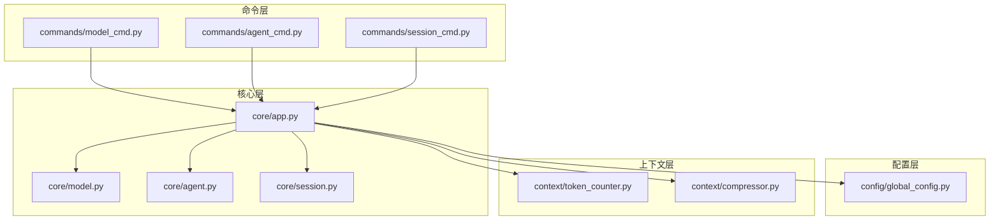
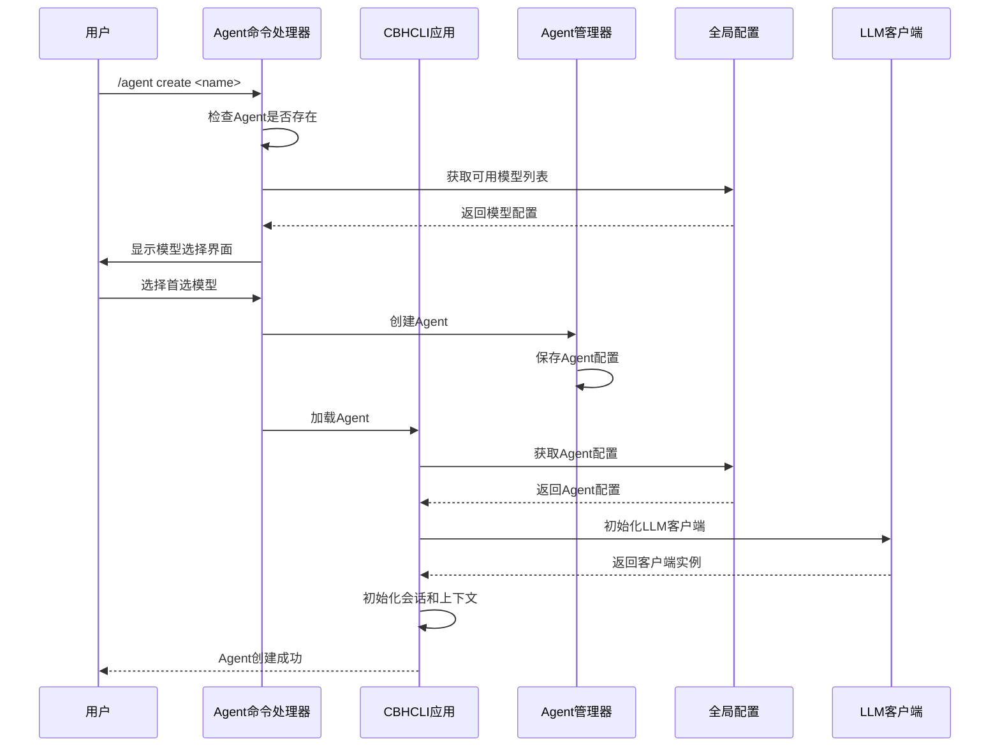
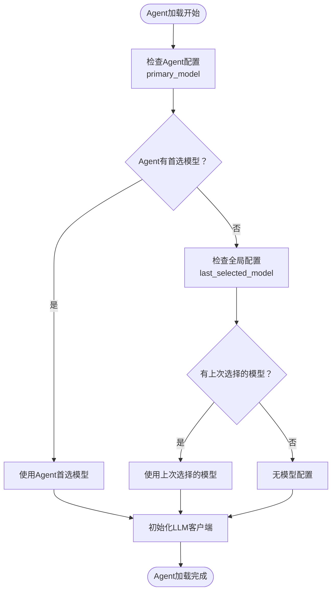
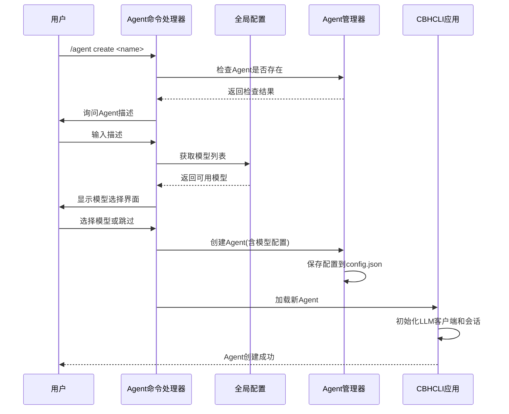
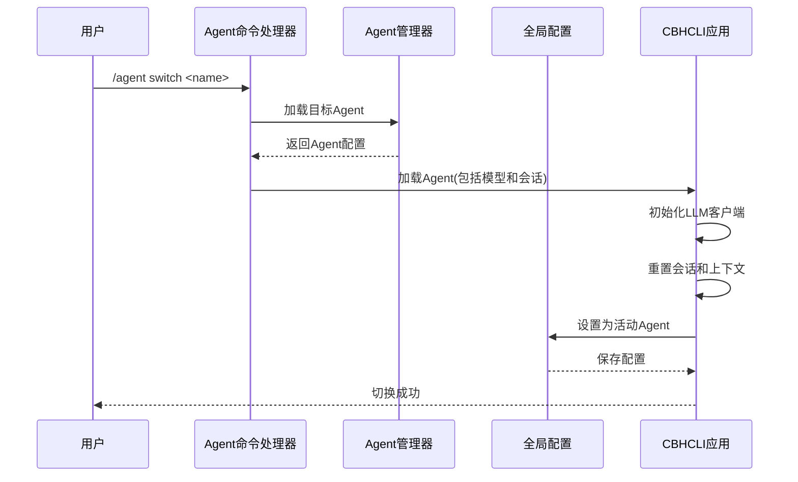
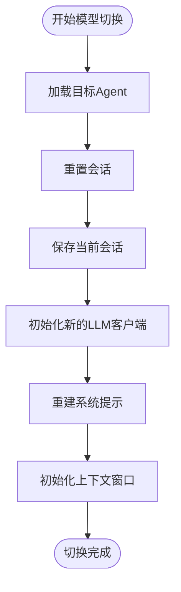
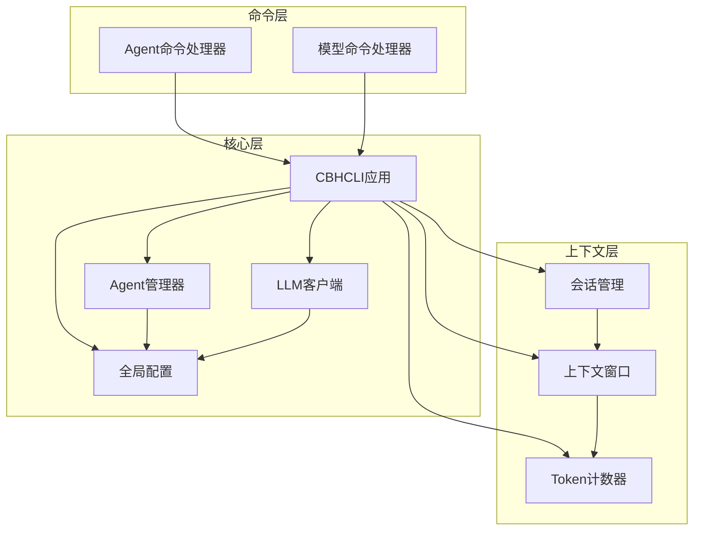

# 模型切换与使用

<cite>
**本文档引用的文件**
- [model_cmd.py](file://cbhcli_pkg/commands/model_cmd.py)
- [agent_cmd.py](file://cbhcli_pkg/commands/agent_cmd.py)
- [model.py](file://cbhcli_pkg/core/model.py)
- [app.py](file://cbhcli_pkg/core/app.py)
- [global_config.py](file://cbhcli_pkg/config/global_config.py)
- [agent.py](file://cbhcli_pkg/core/agent.py)
- [token_counter.py](file://cbhcli_pkg/context/token_counter.py)
- [session.py](file://cbhcli_pkg/core/session.py)
- [constants.py](file://cbhcli_pkg/core/constants.py)
- [README.md](file://README.md)
</cite>

## 目录
1. [简介](#简介)
2. [项目结构](#项目结构)
3. [核心组件](#核心组件)
4. [架构概览](#架构概览)
5. [详细组件分析](#详细组件分析)
6. [依赖关系分析](#依赖关系分析)
7. [性能考虑](#性能考虑)
8. [故障排除指南](#故障排除指南)
9. [结论](#结论)

## 简介

CBHCLI是一个功能强大的AI驱动终端助手，支持多Agent管理、工具调用、知识库和会话管理。本文档专注于模型切换与使用的详细操作指南，深入解释/agent create命令中的模型选择机制，包括默认模型设置和模型优先级规则；详细说明/agent switch命令的实现原理和使用方法；解释模型切换对Agent工作空间的影响和数据保留策略；提供模型使用统计和成本控制的方法；说明模型性能监控和质量评估的指标体系；包含模型切换的最佳实践和常见问题解决方案；为高级用户提供批量模型管理和自动化切换的配置方法。

## 项目结构

CBHCLI采用模块化架构设计，主要包含以下核心模块：

**图表来源**
- [model_cmd.py:1-371](file://cbhcli_pkg/commands/model_cmd.py#L1-L371)
- [agent_cmd.py:1-181](file://cbhcli_pkg/commands/agent_cmd.py#L1-L181)
- [app.py:1-478](file://cbhcli_pkg/core/app.py#L1-L478)

**章节来源**
- [model_cmd.py:1-371](file://cbhcli_pkg/commands/model_cmd.py#L1-L371)
- [agent_cmd.py:1-181](file://cbhcli_pkg/commands/agent_cmd.py#L1-L181)
- [app.py:1-478](file://cbhcli_pkg/core/app.py#L1-L478)

## 核心组件

### 模型管理组件

CBHCLI的模型管理系统由多个组件协同工作：

1. **LLMClient类** - 统一的LLM API客户端，负责与不同AI模型提供商的API交互
2. **GlobalConfig类** - 全局配置管理，存储和管理所有模型配置
3. **AgentManager类** - Agent管理器，负责Agent的创建、加载和切换
4. **CBHCLIApp类** - 主应用类，协调各个组件的工作

### 模型配置结构

模型配置采用标准化的数据结构：

| 配置项 | 类型 | 描述 | 默认值 |
|--------|------|------|--------|
| name | string | 模型名称 | 必填 |
| apiKey | string | API密钥 | 必填 |
| url | string | API基础URL | 必填 |
| model | string | 模型ID | 必填 |
| context_limit | integer | 上下文长度限制 | 128000 |

**章节来源**
- [model.py:1-147](file://cbhcli_pkg/core/model.py#L1-L147)
- [global_config.py:1-154](file://cbhcli_pkg/config/global_config.py#L1-L154)
- [agent.py:476-513](file://cbhcli_pkg/core/agent.py#L476-L513)

## 架构概览

CBHCLI采用分层架构设计，确保模型切换功能的可靠性和可扩展性：

**图表来源**
- [agent_cmd.py:99-130](file://cbhcli_pkg/commands/agent_cmd.py#L99-L130)
- [app.py:231-279](file://cbhcli_pkg/core/app.py#L231-L279)

## 详细组件分析

### 模型选择机制

#### 默认模型设置

CBHCLI实现了灵活的默认模型设置机制：

1. **Agent级别优先**：每个Agent可以设置自己的首选模型
2. **全局最后选择**：记录用户最近选择的模型作为全局默认
3. **启动时恢复**：应用启动时优先加载上次活动的Agent

**图表来源**
- [app.py:249-258](file://cbhcli_pkg/core/app.py#L249-L258)

#### 模型优先级规则

模型选择遵循严格的优先级顺序：

1. **显式指定**：用户在命令中明确指定的模型
2. **Agent首选**：Agent配置中的primary_model字段
3. **全局最后选择**：用户最近使用过的模型
4. **默认模型**：系统预设的默认模型

**章节来源**
- [app.py:249-258](file://cbhcli_pkg/core/app.py#L249-L258)
- [global_config.py:83-90](file://cbhcli_pkg/config/global_config.py#L83-L90)

### /agent create 命令实现

#### 模型选择流程

**图表来源**
- [agent_cmd.py:99-130](file://cbhcli_pkg/commands/agent_cmd.py#L99-L130)

#### 模型选择界面

Agent创建过程中提供了直观的模型选择界面：

1. **模型列表展示**：显示所有可用模型及其上下文限制
2. **交互式选择**：支持按编号或名称选择模型
3. **可选跳过**：允许用户跳过模型选择，稍后手动配置

**章节来源**
- [agent_cmd.py:107-121](file://cbhcli_pkg/commands/agent_cmd.py#L107-L121)

### /agent switch 命令实现

#### Agent切换流程

**图表来源**
- [agent_cmd.py:154-161](file://cbhcli_pkg/commands/agent_cmd.py#L154-L161)
- [app.py:231-279](file://cbhcli_pkg/core/app.py#L231-L279)

#### 切换后的状态恢复

Agent切换时会完整恢复目标Agent的状态：

1. **模型配置**：加载Agent配置的首选模型
2. **会话历史**：恢复Agent的工作空间和会话历史
3. **上下文状态**：重新初始化上下文窗口和压缩器
4. **MCP管理器**：为新Agent创建独立的MCP管理器

**章节来源**
- [agent_cmd.py:154-161](file://cbhcli_pkg/commands/agent_cmd.py#L154-L161)
- [app.py:231-279](file://cbhcli_pkg/core/app.py#L231-L279)

### 模型切换对Agent工作空间的影响

#### 数据保留策略

模型切换不会影响Agent的工作空间数据，具体策略如下：

1. **配置文件保留**：Agent的config.json保持不变
2. **工作空间内容**：skills.md、soul.md、tools.md等文件完整保留
3. **知识库数据**：知识库目录下的所有文件不受影响
4. **会话历史**：历史会话文件夹中的内容保持不变

#### 状态重置机制

模型切换时会进行必要的状态重置：

**图表来源**
- [app.py:281-331](file://cbhcli_pkg/core/app.py#L281-L331)

**章节来源**
- [app.py:281-331](file://cbhcli_pkg/core/app.py#L281-L331)

### 模型使用统计和成本控制

#### 上下文使用监控

CBHCLI提供了全面的上下文使用监控功能：

1. **实时统计**：显示当前会话的token使用情况
2. **阈值警告**：接近模型限制时自动警告
3. **历史记录**：记录每次对话的token使用量

#### 成本估算方法

虽然代码库中没有直接的成本计算功能，但可以通过以下方式估算成本：

1. **token计数**：使用TokenCounter估算每次请求的token数量
2. **模型定价**：根据所选模型的官方定价计算费用
3. **使用统计**：通过上下文监控功能跟踪使用量

**章节来源**
- [session.py:127-190](file://cbhcli_pkg/core/session.py#L127-L190)
- [token_counter.py:14-88](file://cbhcli_pkg/context/token_counter.py#L14-L88)

### 模型性能监控和质量评估

#### 性能指标体系

CBHCLI建立了完善的性能监控指标：

1. **响应时间**：API请求的响应时间
2. **上下文使用率**：当前token使用量占模型限制的比例
3. **压缩效果**：上下文压缩的效率和效果
4. **工具调用成功率**：工具调用的成功率和失败原因

#### 质量评估指标

1. **准确性**：AI回答的准确性和相关性
2. **完整性**：回答内容的完整程度
3. **一致性**：跨多次对话的一致性表现
4. **效率**：完成任务所需的时间和token数量

**章节来源**
- [constants.py:1-50](file://cbhcli_pkg/core/constants.py#L1-L50)

### 模型切换最佳实践

#### 选择合适模型的原则

1. **任务需求匹配**：根据任务复杂度选择合适的模型
2. **成本效益考虑**：平衡性能和成本
3. **稳定性要求**：关键任务使用更稳定的模型
4. **上下文长度**：考虑任务所需的上下文长度

#### 切换策略

1. **渐进式切换**：小步调整，逐步适应新模型
2. **对比测试**：同时运行多个模型进行对比
3. **监控反馈**：密切监控切换后的表现
4. **回滚准备**：准备好快速回滚到原模型

### 高级用户配置方法

#### 批量模型管理

CBHCLI支持通过配置文件进行批量模型管理：

1. **配置文件编辑**：直接编辑~/.cbhcli/config.json文件
2. **脚本自动化**：编写脚本批量添加或删除模型
3. **环境变量**：通过环境变量管理API密钥
4. **模板配置**：创建模型配置模板

#### 自动化切换配置

1. **条件切换**：根据任务类型自动选择模型
2. **负载均衡**：在多个模型间分配请求
3. **故障转移**：模型不可用时自动切换到备用模型
4. **性能监控**：基于性能指标动态调整模型选择

**章节来源**
- [README.md:150-206](file://README.md#L150-L206)

## 依赖关系分析

CBHCLI的模型切换功能涉及多个组件间的复杂依赖关系：

**图表来源**
- [app.py:12-52](file://cbhcli_pkg/core/app.py#L12-L52)

**章节来源**
- [app.py:12-52](file://cbhcli_pkg/core/app.py#L12-L52)

## 性能考虑

### 模型切换性能

1. **内存占用**：每个Agent的LLM客户端会占用一定内存
2. **启动时间**：模型切换涉及重新初始化客户端，有一定延迟
3. **并发处理**：多Agent同时运行时的资源竞争
4. **缓存策略**：合理利用模型和会话缓存

### 优化建议

1. **懒加载**：只在需要时初始化LLM客户端
2. **连接池**：复用HTTP连接减少开销
3. **异步处理**：使用异步I/O提高响应速度
4. **资源监控**：监控内存和CPU使用情况

## 故障排除指南

### 常见问题及解决方案

#### 模型配置错误

**问题**：模型配置无效或无法连接
**解决方案**：
1. 检查API密钥是否正确
2. 验证API基础URL格式
3. 确认网络连接正常
4. 查看错误日志获取详细信息

#### Agent切换失败

**问题**：/agent switch命令执行失败
**解决方案**：
1. 确认目标Agent存在
2. 检查Agent配置文件完整性
3. 验证模型配置有效性
4. 重启应用尝试修复

#### 上下文溢出

**问题**：会话上下文超过模型限制
**解决方案**：
1. 启用自动压缩功能
2. 手动清理不必要的对话历史
3. 选择上下文长度更大的模型
4. 优化对话内容减少token使用

**章节来源**
- [app.py:418-420](file://cbhcli_pkg/core/app.py#L418-L420)

### 调试技巧

1. **详细日志**：启用详细模式查看内部状态
2. **配置验证**：定期检查配置文件的有效性
3. **性能监控**：使用内置监控功能跟踪性能指标
4. **错误追踪**：利用异常信息定位问题根源

## 结论

CBHCLI的模型切换与使用功能提供了强大而灵活的AI模型管理能力。通过清晰的优先级规则、完整的状态恢复机制和全面的监控功能，用户可以高效地管理和切换不同的AI模型。

关键优势包括：
- **灵活的模型选择**：支持多层级的模型优先级设置
- **完整的状态管理**：切换时保持Agent工作空间的完整性
- **全面的监控**：提供上下文使用和性能监控功能
- **可扩展的架构**：支持批量管理和自动化配置

对于高级用户，CBHCLI还提供了丰富的配置选项和自动化功能，可以满足复杂的生产环境需求。通过合理配置和使用最佳实践，用户可以充分发挥CBHCLI在多模型管理方面的优势。