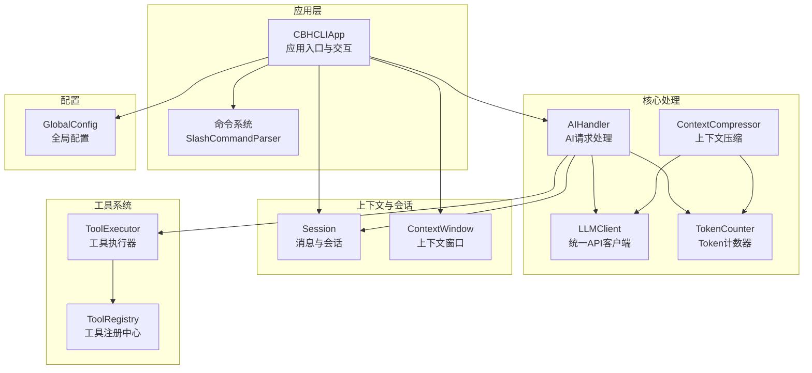
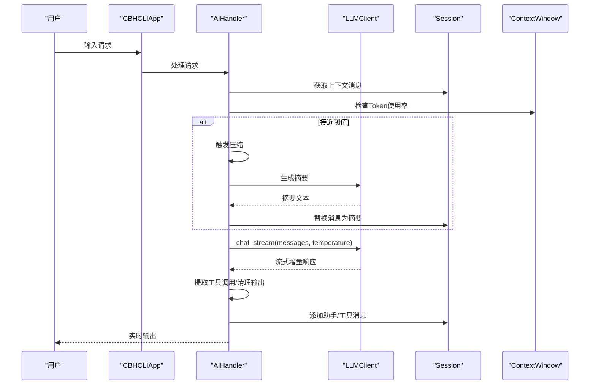
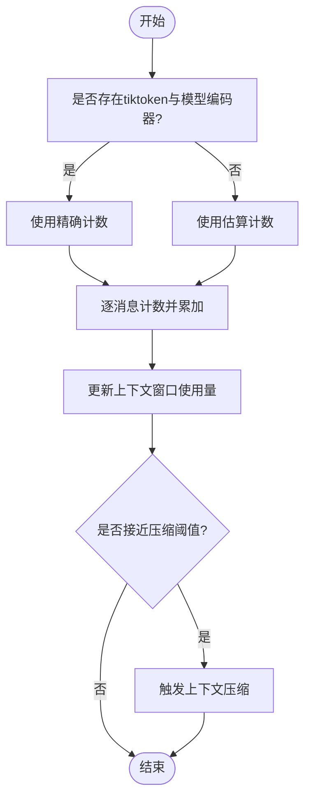
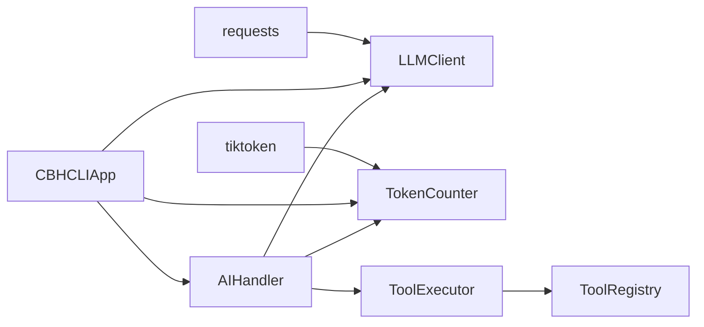

# 模型性能优化

<cite>
**本文引用的文件**
- [token_counter.py](file://cbhcli_pkg/context/token_counter.py)
- [model.py](file://cbhcli_pkg/core/model.py)
- [global_config.py](file://cbhcli_pkg/config/global_config.py)
- [ai_handler.py](file://cbhcli_pkg/core/ai_handler.py)
- [session.py](file://cbhcli_pkg/core/session.py)
- [constants.py](file://cbhcli_pkg/core/constants.py)
- [compressor.py](file://cbhcli_pkg/context/compressor.py)
- [app.py](file://cbhcli_pkg/core/app.py)
- [README.md](file://README.md)
- [errors.py](file://cbhcli_pkg/core/errors.py)
- [registry.py](file://cbhcli_pkg/tools/registry.py)
- [requirements.txt](file://requirements.txt)
- [index.js](file://index.js)
</cite>

## 目录
1. [简介](#简介)
2. [项目结构](#项目结构)
3. [核心组件](#核心组件)
4. [架构总览](#架构总览)
5. [详细组件分析](#详细组件分析)
6. [依赖分析](#依赖分析)
7. [性能考量](#性能考量)
8. [故障排查指南](#故障排查指南)
9. [结论](#结论)
10. [附录](#附录)

## 简介
本技术指南面向CBHCLI在高并发与复杂任务场景下的性能优化，聚焦以下主题：
- 上下文长度限制与Token计数器的配置与准确性保障
- 生成参数（温度、最大令牌数等）对性能与输出质量的影响
- 不同使用场景（代码生成、文档分析、对话理解）的参数调优建议
- 流式响应与非流式的性能对比与选择策略
- 网络延迟优化、连接池与并发控制
- 内存使用优化与资源限制
- 性能监控指标与瓶颈分析
- 高并发部署与负载均衡配置建议

## 项目结构
CBHCLI采用模块化设计，围绕“应用层-核心处理-上下文与会话-工具系统-配置”组织代码。关键模块职责如下：
- 应用层：负责用户交互、命令解析、Agent与会话生命周期管理
- 核心处理：LLM客户端、AI请求处理器、工具执行器
- 上下文与会话：消息结构、上下文窗口、自动压缩
- 工具系统：工具注册中心与具体工具实现
- 配置：全局配置与模型配置

图表来源
- [app.py:54-331](file://cbhcli_pkg/core/app.py#L54-L331)
- [ai_handler.py:21-96](file://cbhcli_pkg/core/ai_handler.py#L21-L96)
- [model.py:7-27](file://cbhcli_pkg/core/model.py#L7-L27)
- [token_counter.py:14-48](file://cbhcli_pkg/context/token_counter.py#L14-L48)
- [compressor.py:7-20](file://cbhcli_pkg/context/compressor.py#L7-L20)
- [session.py:37-90](file://cbhcli_pkg/core/session.py#L37-L90)
- [global_config.py:13-48](file://cbhcli_pkg/config/global_config.py#L13-L48)

章节来源
- [README.md:269-295](file://README.md#L269-L295)
- [app.py:54-331](file://cbhcli_pkg/core/app.py#L54-L331)

## 核心组件
- Token计数器：支持精确（tiktoken）与估算（字符密度）两种模式，用于上下文长度控制与压缩触发
- LLM客户端：封装统一的聊天与流式接口，支持超时与错误处理
- AI处理器：负责多轮工具调用、流式输出处理、工具调用提取与清理
- 会话与上下文窗口：维护消息、统计Token、判断压缩阈值
- 上下文压缩器：基于LLM生成摘要，减少历史对话占用的Token
- 工具执行器与注册中心：工具调用解析、执行与结果展示
- 全局配置：模型、嵌入、重排序、Agent与设置的集中管理

章节来源
- [token_counter.py:14-88](file://cbhcli_pkg/context/token_counter.py#L14-L88)
- [model.py:7-147](file://cbhcli_pkg/core/model.py#L7-L147)
- [ai_handler.py:21-743](file://cbhcli_pkg/core/ai_handler.py#L21-L743)
- [session.py:37-190](file://cbhcli_pkg/core/session.py#L37-L190)
- [compressor.py:7-112](file://cbhcli_pkg/context/compressor.py#L7-L112)
- [registry.py:51-115](file://cbhcli_pkg/tools/registry.py#L51-L115)
- [global_config.py:13-154](file://cbhcli_pkg/config/global_config.py#L13-L154)

## 架构总览
CBHCLI在应用层接收用户输入，通过AI处理器与LLM客户端交互；AI处理器在每轮中根据上下文窗口决定是否压缩，并在需要时调用上下文压缩器生成摘要；工具调用由工具执行器解析与执行，结果回填到会话中。

图表来源
- [app.py:422-439](file://cbhcli_pkg/core/app.py#L422-L439)
- [ai_handler.py:98-216](file://cbhcli_pkg/core/ai_handler.py#L98-L216)
- [model.py:59-120](file://cbhcli_pkg/core/model.py#L59-L120)
- [session.py:83-90](file://cbhcli_pkg/core/session.py#L83-L90)
- [compressor.py:21-81](file://cbhcli_pkg/context/compressor.py#L21-L81)

## 详细组件分析

### Token计数器与上下文长度限制
- 精确计数：优先使用tiktoken，按模型选择编码器；若模型不受支持则回退到通用编码
- 估算计数：中文字符按1.5字符/Token、英文按4字符/Token估算，适合无tiktoken环境
- 上下文窗口：基于模型最大Token与压缩阈值（默认80%）动态判断是否压缩
- 压缩触发：当使用率超过阈值时，压缩器生成摘要并替换中间历史，降低Token占用

图表来源
- [token_counter.py:34-75](file://cbhcli_pkg/context/token_counter.py#L34-L75)
- [session.py:127-190](file://cbhcli_pkg/core/session.py#L127-L190)
- [compressor.py:21-81](file://cbhcli_pkg/context/compressor.py#L21-L81)

章节来源
- [token_counter.py:14-88](file://cbhcli_pkg/context/token_counter.py#L14-L88)
- [session.py:127-190](file://cbhcli_pkg/core/session.py#L127-L190)
- [compressor.py:21-81](file://cbhcli_pkg/context/compressor.py#L21-L81)

### 生成参数与输出质量影响
- 温度（temperature）：控制采样随机性。较低温度（如0.1）提升确定性与稳定性，适合代码生成与严格指令；较高温度增加多样性但可能降低一致性
- 最大令牌数（max_tokens）：限制单次生成长度，直接影响响应时间与上下文占用
- 流式与非流式：流式响应可提前感知输出，改善交互体验；非流式一次性返回完整内容，便于后续批处理

章节来源
- [model.py:28-57](file://cbhcli_pkg/core/model.py#L28-L57)
- [model.py:59-120](file://cbhcli_pkg/core/model.py#L59-L120)
- [constants.py:21-22](file://cbhcli_pkg/core/constants.py#L21-L22)

### 场景化参数调优建议
- 代码生成：低温度（0.1~0.3）、适中max_tokens、开启流式以获得即时反馈
- 文档分析：中等温度（0.3~0.5）、较高max_tokens、关闭流式便于稳定输出
- 对话理解：低温度（0.1~0.2）、较大max_tokens、开启流式增强交互体验
- 工具调用：低温度（0.1）、严格格式提示、必要时在多轮中强化工具调用格式

章节来源
- [ai_handler.py:98-132](file://cbhcli_pkg/core/ai_handler.py#L98-L132)
- [constants.py:21-22](file://cbhcli_pkg/core/constants.py#L21-L22)

### 流式响应与非流式响应选择
- 流式优势：低延迟感知、渐进式输出、更好的用户体验
- 非流式优势：一次性完整内容、便于批量处理与缓存
- 选择策略：交互型任务优先流式；批处理与离线分析优先非流式

章节来源
- [model.py:59-120](file://cbhcli_pkg/core/model.py#L59-L120)
- [ai_handler.py:144-216](file://cbhcli_pkg/core/ai_handler.py#L144-L216)

### 网络延迟优化、连接池与并发控制
- 连接复用：LLM客户端使用requests.Session，自动复用TCP连接，减少握手开销
- 超时控制：聊天与嵌入请求分别设置超时，避免阻塞
- 并发控制：应用层未显式引入线程/进程池，建议在外部通过进程/容器编排实现并发隔离与限流

章节来源
- [model.py:22-26](file://cbhcli_pkg/core/model.py#L22-L26)
- [model.py:47-51](file://cbhcli_pkg/core/model.py#L47-L51)
- [model.py:136-141](file://cbhcli_pkg/core/model.py#L136-L141)

### 内存使用优化与资源限制
- 工具输出截断：工具结果最大长度限制，防止长输出占用过多内存
- 会话消息清理：AI处理器在清理文本时移除工具调用命令，减少冗余
- Python会话记忆：同一会话内变量与导入保留，需在重置/新建会话时清理

章节来源
- [constants.py:13-16](file://cbhcli_pkg/core/constants.py#L13-L16)
- [ai_handler.py:218-262](file://cbhcli_pkg/core/ai_handler.py#L218-L262)
- [app.py:299-300](file://cbhcli_pkg/core/app.py#L299-L300)

### 性能监控指标与瓶颈分析
- 关键指标：请求延迟、Token吞吐、上下文使用率、压缩命中率、工具调用成功率
- 瓶颈定位：结合上下文窗口状态文本与压缩触发次数评估模型上下文限制；通过工具执行耗时与输出长度评估I/O瓶颈

章节来源
- [session.py:178-189](file://cbhcli_pkg/core/session.py#L178-L189)
- [app.py:379-384](file://cbhcli_pkg/core/app.py#L379-L384)

### 集群部署与负载均衡
- 部署建议：将LLM服务置于独立后端，前端通过HTTP API调用；使用反向代理实现负载均衡与健康检查
- 负载均衡：基于会话ID或用户ID做粘性会话，避免跨节点状态丢失
- 限流与熔断：在网关层实施QPS与并发限制，防止下游过载

（本节为概念性指导，不直接对应特定源码文件）

## 依赖分析
- 核心依赖：requests（HTTP客户端）
- 可选依赖：tiktoken（精确Token计数）、chromadb（向量检索）
- 模块耦合：AIHandler依赖LLMClient、TokenCounter、ToolExecutor与Session；App负责装配与调度

图表来源
- [requirements.txt:2-7](file://requirements.txt#L2-L7)
- [model.py:2-4](file://cbhcli_pkg/core/model.py#L2-L4)
- [token_counter.py:7-11](file://cbhcli_pkg/context/token_counter.py#L7-L11)
- [app.py:85-95](file://cbhcli_pkg/core/app.py#L85-L95)

章节来源
- [requirements.txt:1-7](file://requirements.txt#L1-L7)
- [app.py:85-95](file://cbhcli_pkg/core/app.py#L85-L95)

## 性能考量
- 上下文长度：合理设置模型context_limit与压缩阈值，避免频繁压缩导致信息丢失
- 生成参数：根据任务特性调整temperature与max_tokens，平衡质量与速度
- I/O与网络：使用连接池与超时控制，结合外部限流与缓存策略
- 内存与CPU：控制工具输出长度、及时清理会话、避免不必要的重复计算

（本节为通用性能建议，不直接分析具体文件）

## 故障排查指南
- 模型未配置：检查全局配置与Agent模型绑定，确保模型存在且可用
- 上下文超限：查看上下文使用率与压缩触发日志，适当降低历史保留或增大context_limit
- 工具执行失败：检查工具参数解析与执行结果，关注工具输出截断与权限问题
- 网络异常：检查超时设置与代理配置，确认API可达性

章节来源
- [errors.py:9-31](file://cbhcli_pkg/core/errors.py#L9-L31)
- [app.py:412-413](file://cbhcli_pkg/core/app.py#L412-L413)
- [session.py:178-189](file://cbhcli_pkg/core/session.py#L178-L189)
- [constants.py:21-22](file://cbhcli_pkg/core/constants.py#L21-L22)

## 结论
通过精确的Token计数、合理的上下文压缩策略、恰当的生成参数与网络优化，CBHCLI可在多种场景下实现高质量与高性能的AI交互。建议在生产环境中结合外部负载均衡与限流策略，持续监控上下文使用率与工具执行效率，以实现稳定的高并发运行。

## 附录
- 模型配置示例与Agent工作空间结构可参考项目README中的配置与目录说明
- JavaScript版本的工具调用与流式处理逻辑可作为跨语言实现的参考

章节来源
- [README.md:150-206](file://README.md#L150-L206)
- [README.md:269-295](file://README.md#L269-L295)
- [index.js:341-577](file://index.js#L341-L577)