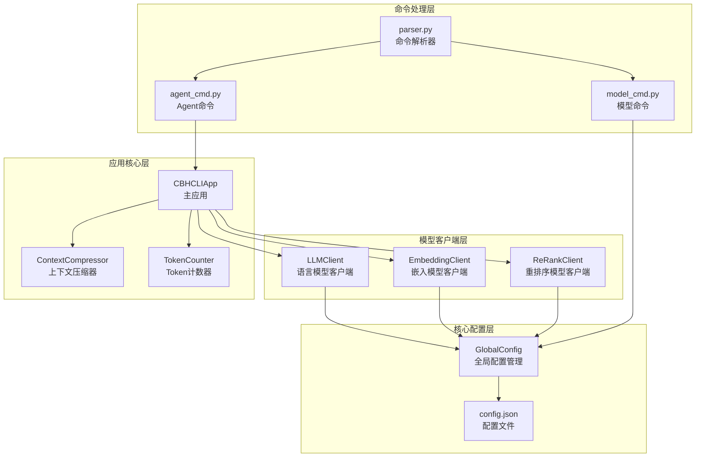
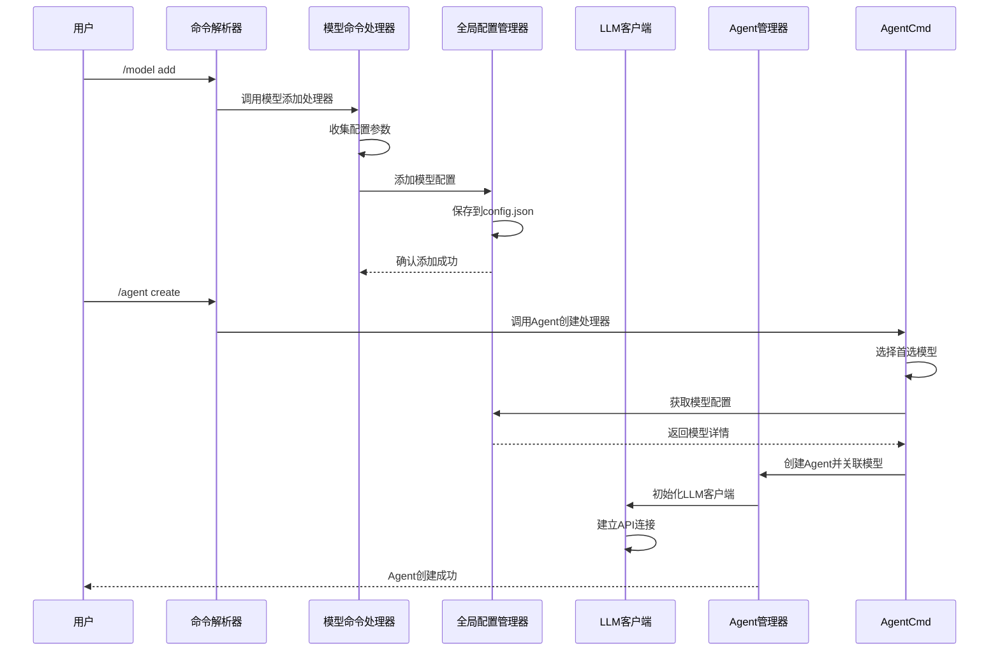
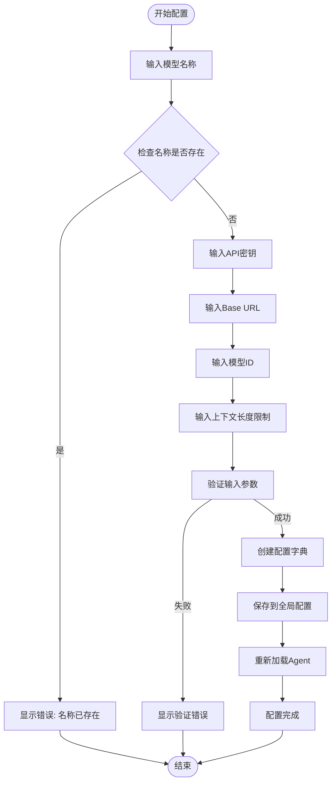
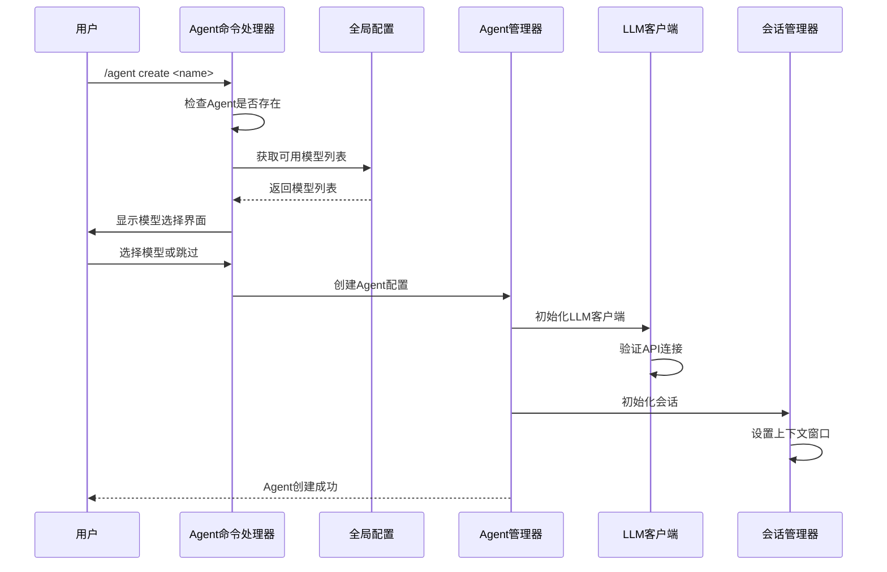
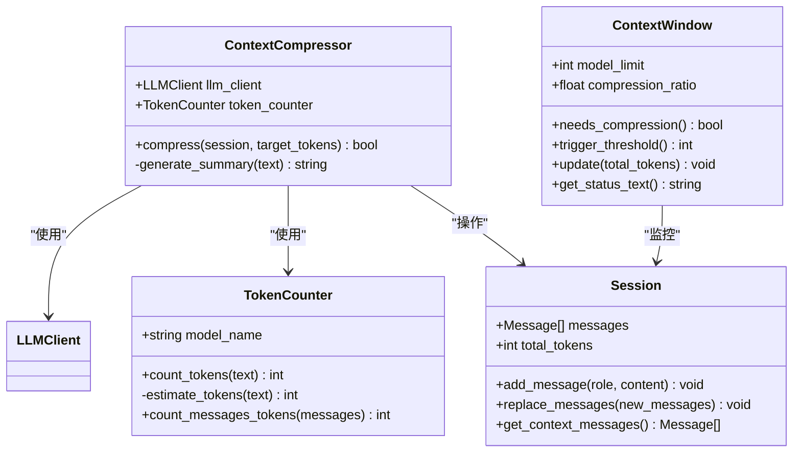
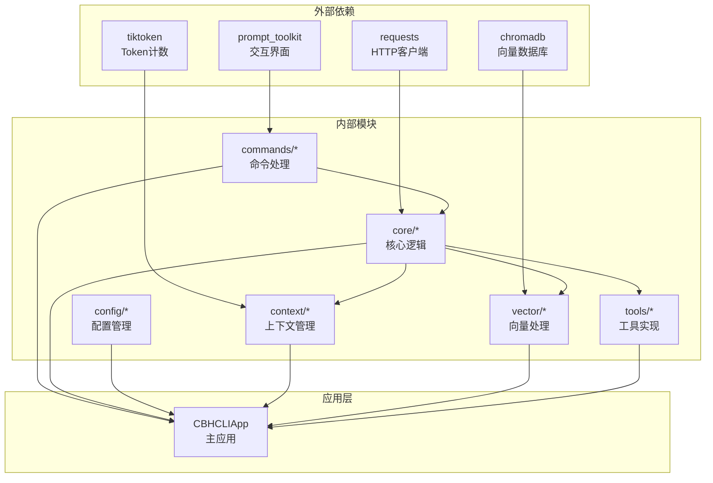
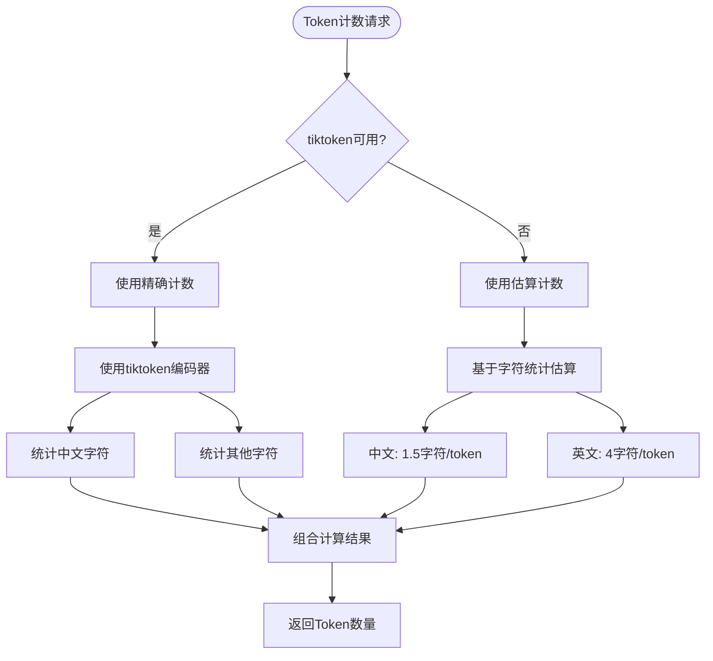
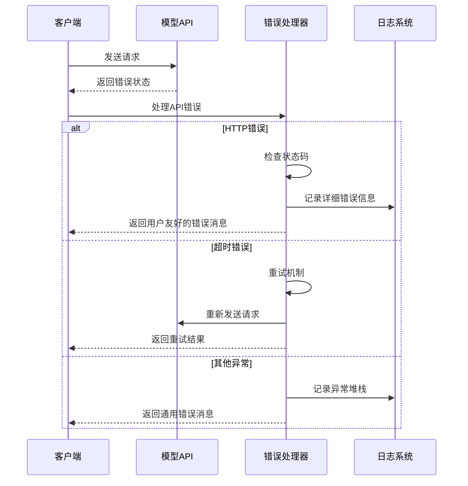

# 模型配置

<cite>
**本文档引用的文件**
- [global_config.py](file://cbhcli_pkg/config/global_config.py)
- [model.py](file://cbhcli_pkg/core/model.py)
- [model_cmd.py](file://cbhcli_pkg/commands/model_cmd.py)
- [embedding_client.py](file://cbhcli_pkg/core/embedding_client.py)
- [rerank_client.py](file://cbhcli_pkg/core/rerank_client.py)
- [app.py](file://cbhcli_pkg/core/app.py)
- [agent_cmd.py](file://cbhcli_pkg/commands/agent_cmd.py)
- [token_counter.py](file://cbhcli_pkg/context/token_counter.py)
- [compressor.py](file://cbhcli_pkg/context/compressor.py)
- [constants.py](file://cbhcli_pkg/core/constants.py)
- [parser.py](file://cbhcli_pkg/commands/parser.py)
- [README.md](file://README.md)
</cite>

## 目录
1. [简介](#简介)
2. [项目结构](#项目结构)
3. [核心组件](#核心组件)
4. [架构概览](#架构概览)
5. [详细组件分析](#详细组件分析)
6. [依赖关系分析](#依赖关系分析)
7. [性能考虑](#性能考虑)
8. [故障排除指南](#故障排除指南)
9. [结论](#结论)
10. [附录](#附录)

## 简介

CBHCLI模型配置系统是一个功能完整的多模型支持平台，专为AI驱动的终端助手设计。该系统支持OpenAI兼容的LLM客户端实现，提供灵活的模型配置、管理和切换机制。系统不仅支持传统的语言模型，还集成了嵌入模型和重排序模型，为向量数据库和知识库搜索提供完整的解决方案。

系统的核心特性包括：
- 多模型支持机制，支持OpenAI兼容的LLM客户端
- 完整的模型配置流程，包括API密钥管理、Base URL设置、模型ID配置和上下文长度限制
- 模型切换和使用的具体操作，包括/agent create时的模型选择和/agent switch时的切换机制
- 全局配置文件config.json的结构和各字段含义
- 嵌入模型和重排序模型的配置方法
- 模型性能优化建议和错误处理机制

## 项目结构

CBHCLI采用模块化的项目结构，将不同功能域分离到独立的包和模块中：



**图表来源**
- [global_config.py:13-154](file://cbhcli_pkg/config/global_config.py#L13-L154)
- [model.py:7-147](file://cbhcli_pkg/core/model.py#L7-L147)
- [embedding_client.py:6-132](file://cbhcli_pkg/core/embedding_client.py#L6-L132)
- [rerank_client.py:6-123](file://cbhcli_pkg/core/rerank_client.py#L6-L123)

**章节来源**
- [README.md:269-295](file://README.md#L269-L295)

## 核心组件

### 全局配置管理器

GlobalConfig类是整个模型配置系统的核心，负责管理所有配置数据的持久化存储和访问。

**主要功能**：
- 模型配置管理（增删改查）
- 嵌入模型配置管理
- 重排序模型配置管理
- Agent活动状态管理
- 系统设置管理

**配置文件结构**：
```json
{
  "models": [
    {
      "name": "my-gpt4",
      "apiKey": "sk-xxx",
      "url": "https://api.openai.com/v1",
      "model": "gpt-4o",
      "context_limit": 128000
    }
  ],
  "embedding_model": {
    "name": "openai-embedding",
    "apiKey": "sk-xxx",
    "url": "https://api.openai.com/v1",
    "model": "text-embedding-3-small",
    "type": "openai"
  },
  "rerank_model": {
    "name": "jina-reranker",
    "apiKey": "jina_xxx",
    "url": "https://api.jina.ai/v1",
    "model": "jina-reranker-v2-base-multilingual",
    "top_n": 5
  },
  "agents": {
    "default_agent": "main",
    "active_agent": "dev-helper"
  },
  "settings": {
    "auto_compress": true,
    "compression_ratio": 0.8,
    "workspace_base": "~/.cbhcli/agents"
  }
}
```

### LLM客户端

LLMClient类实现了OpenAI兼容的LLM API客户端，提供统一的接口来调用各种语言模型。

**核心特性**：
- 支持非流式和流式聊天完成
- 自动处理API密钥认证
- 支持工具调用和思维过程输出
- 嵌入向量生成功能

**API端点支持**：
- `/chat/completions` - 聊天完成
- `/embeddings` - 嵌入向量生成

### 嵌入模型客户端

EmbeddingClient类支持多种嵌入模型API，包括OpenAI兼容的嵌入模型和自定义API格式。

**支持的模型类型**：
- OpenAI兼容嵌入模型（text-embedding-3-small, text-embedding-ada-002）
- 通义千问embedding
- 其他OpenAI兼容的嵌入模型

**批量处理能力**：
- 支持分批处理大量文本
- 默认批次大小为10，符合大多数API限制

### 重排序客户端

RerankClient类提供重排序服务，用于提高知识库搜索的相关性。

**支持的API类型**：
- Jina Reranker API
- Cohere Rerank API
- 通义千问Rerank
- 其他兼容API

**重排序流程**：
1. 接收查询文本和候选文档列表
2. 根据模型类型选择相应的API格式
3. 返回排序后的结果列表，包含索引、文档内容和相关性分数

**章节来源**
- [global_config.py:13-154](file://cbhcli_pkg/config/global_config.py#L13-L154)
- [model.py:7-147](file://cbhcli_pkg/core/model.py#L7-L147)
- [embedding_client.py:6-132](file://cbhcli_pkg/core/embedding_client.py#L6-L132)
- [rerank_client.py:6-123](file://cbhcli_pkg/core/rerank_client.py#L6-L123)

## 架构概览

CBHCLI模型配置系统采用分层架构设计，确保各组件之间的松耦合和高内聚。



**图表来源**
- [model_cmd.py:64-105](file://cbhcli_pkg/commands/model_cmd.py#L64-L105)
- [agent_cmd.py:99-130](file://cbhcli_pkg/commands/agent_cmd.py#L99-L130)
- [app.py:231-280](file://cbhcli_pkg/core/app.py#L231-L280)

**章节来源**
- [app.py:54-478](file://cbhcli_pkg/core/app.py#L54-L478)

## 详细组件分析

### 模型配置流程

模型配置流程涵盖了从用户输入到配置持久化的完整生命周期。



**图表来源**
- [model_cmd.py:64-105](file://cbhcli_pkg/commands/model_cmd.py#L64-L105)
- [global_config.py:61-64](file://cbhcli_pkg/config/global_config.py#L61-L64)

**配置参数说明**：
- **name**: 模型的友好名称，用于在系统中标识
- **apiKey**: API访问密钥，用于认证
- **url**: API的基础URL地址
- **model**: 实际使用的模型ID
- **context_limit**: 上下文长度限制（默认128000）

### Agent模型选择机制

Agent创建时的模型选择机制提供了灵活的模型绑定策略。



**图表来源**
- [agent_cmd.py:99-130](file://cbhcli_pkg/commands/agent_cmd.py#L99-L130)
- [app.py:231-280](file://cbhcli_pkg/core/app.py#L231-L280)

**模型选择策略**：
1. **显式选择**: 用户在创建时直接选择模型
2. **默认选择**: 使用上次选择的模型
3. **无模型**: Agent创建成功但需要后续配置

### 上下文管理与压缩

系统实现了智能的上下文管理机制，包括自动压缩和Token计数。



**图表来源**
- [compressor.py:7-112](file://cbhcli_pkg/context/compressor.py#L7-L112)
- [token_counter.py:14-88](file://cbhcli_pkg/context/token_counter.py#L14-L88)
- [app.py:322-331](file://cbhcli_pkg/core/app.py#L322-L331)

**压缩策略**：
1. **保留策略**: 保留最早2轮和最近3轮对话
2. **摘要生成**: 使用LLM生成中间部分的摘要
3. **智能阈值**: 当接近上下文限制时自动触发压缩

**章节来源**
- [model_cmd.py:130-150](file://cbhcli_pkg/commands/model_cmd.py#L130-L150)
- [agent_cmd.py:154-162](file://cbhcli_pkg/commands/agent_cmd.py#L154-L162)
- [compressor.py:21-82](file://cbhcli_pkg/context/compressor.py#L21-L82)

## 依赖关系分析

CBHCLI模型配置系统展现了清晰的依赖层次结构，确保模块间的职责分离和可维护性。



**图表来源**
- [app.py:12-52](file://cbhcli_pkg/core/app.py#L12-L52)
- [model_cmd.py:1-5](file://cbhcli_pkg/commands/model_cmd.py#L1-L5)

**依赖特点**：
- **低耦合**: 各模块间通过明确定义的接口交互
- **高内聚**: 每个模块专注于特定的功能领域
- **可扩展**: 新的模型类型可以通过继承现有客户端类实现

**章节来源**
- [constants.py:1-50](file://cbhcli_pkg/core/constants.py#L1-L50)
- [parser.py:16-94](file://cbhcli_pkg/commands/parser.py#L16-L94)

## 性能考虑

CBHCLI模型配置系统在设计时充分考虑了性能优化，特别是在处理大量上下文和频繁API调用场景。

### Token计数优化

系统提供了两种Token计数策略以平衡准确性与性能：



**图表来源**
- [token_counter.py:14-59](file://cbhcli_pkg/context/token_counter.py#L14-L59)

### 批量处理优化

嵌入模型和重排序服务都实现了批量处理机制：

**嵌入模型批量处理**：
- 默认批次大小：10个文本
- 支持OpenAI兼容格式
- 自动分批处理超长列表

**重排序批量处理**：
- 支持Jina和Cohere API格式
- 可配置返回结果数量（top_n）
- 统一的结果格式化

### 上下文压缩策略

系统实现了智能的上下文压缩机制：

**压缩触发条件**：
- 当Token使用量达到上下文限制的80%
- 检测到即将超过模型限制时自动触发

**压缩效果**：
- 保留关键对话轮次（最早2轮 + 最近3轮）
- 使用LLM生成中间部分摘要
- 保持重要技术细节（文件路径、命令、错误信息）

**章节来源**
- [token_counter.py:34-76](file://cbhcli_pkg/context/token_counter.py#L34-L76)
- [embedding_client.py:49-71](file://cbhcli_pkg/core/embedding_client.py#L49-L71)
- [compressor.py:21-82](file://cbhcli_pkg/context/compressor.py#L21-L82)

## 故障排除指南

### 常见配置问题

**模型配置失败**：
1. 检查API密钥是否正确
2. 验证Base URL格式是否正确
3. 确认模型ID在目标平台上有效
4. 检查网络连接和防火墙设置

**Agent模型加载失败**：
1. 确认Agent配置中的primary_model存在
2. 检查模型配置是否被删除
3. 验证API连接是否正常
4. 查看系统日志获取详细错误信息

**嵌入模型初始化失败**：
1. 确认嵌入模型配置完整
2. 检查嵌入模型API的可用性
3. 验证批次大小设置是否合理
4. 查看网络连接状态

### 错误处理机制

系统实现了多层次的错误处理机制：



**图表来源**
- [model.py:53-54](file://cbhcli_pkg/core/model.py#L53-L54)
- [embedding_client.py:86-87](file://cbhcli_pkg/core/embedding_client.py#L86-L87)
- [rerank_client.py:76-77](file://cbhcli_pkg/core/rerank_client.py#L76-L77)

**错误恢复策略**：
1. **重试机制**: 对于临时性网络错误自动重试
2. **降级处理**: 在tiktoken不可用时使用估算计数
3. **优雅降级**: 缺少嵌入模型时使用内置向量存储
4. **状态监控**: 实时监控API可用性和性能指标

**章节来源**
- [model.py:28-57](file://cbhcli_pkg/core/model.py#L28-L57)
- [embedding_client.py:15-33](file://cbhcli_pkg/core/embedding_client.py#L15-L33)
- [rerank_client.py:16-34](file://cbhcli_pkg/core/rerank_client.py#L16-L34)

## 结论

CBHCLI模型配置系统提供了一个完整、灵活且高性能的多模型支持平台。通过模块化的架构设计和完善的错误处理机制，系统能够满足从个人开发者到企业用户的多样化需求。

**主要优势**：
- **统一接口**: 所有模型通过统一的客户端接口访问
- **灵活配置**: 支持动态模型切换和配置管理
- **智能优化**: 自动上下文压缩和Token计数优化
- **扩展性强**: 易于集成新的模型提供商和API格式
- **用户友好**: 提供直观的命令行界面和详细的帮助信息

**未来发展方向**：
- 支持更多模型提供商和API格式
- 增强模型性能监控和成本控制功能
- 优化批量处理和缓存机制
- 提供更丰富的配置模板和最佳实践

## 附录

### 配置示例

**OpenAI兼容模型配置**：
```json
{
  "name": "gpt-4o-prod",
  "apiKey": "sk-xxxxxxxxxxxxxxxxxxxxxxxxxxxxxxxx",
  "url": "https://api.openai.com/v1",
  "model": "gpt-4o",
  "context_limit": 128000
}
```

**自定义嵌入模型配置**：
```json
{
  "name": "local-embedding",
  "apiKey": "your-api-key",
  "url": "http://localhost:8000/v1",
  "model": "all-MiniLM-L6-v2",
  "type": "custom"
}
```

**重排序模型配置**：
```json
{
  "name": "jina-reranker",
  "apiKey": "jina_xxxxxxxxxxxxxxxxxxxxxxxxxxxxxx",
  "url": "https://api.jina.ai/v1",
  "model": "jina-reranker-v2-base-multilingual",
  "top_n": 5
}
```

### 最佳实践

**模型选择建议**：
1. **生产环境**: 优先选择具有SLA保证的商业API
2. **开发测试**: 使用免费或低成本的开源模型
3. **性能考虑**: 根据任务复杂度选择合适的上下文长度
4. **成本控制**: 监控Token使用量，选择性价比高的模型

**配置管理建议**：
1. **版本控制**: 将config.json纳入版本控制系统
2. **环境隔离**: 为不同环境使用不同的配置文件
3. **安全存储**: 使用环境变量或加密存储敏感信息
4. **定期审查**: 定期评估模型性能和成本效益

**性能优化建议**：
1. **上下文管理**: 合理设置上下文长度限制
2. **批量处理**: 利用批量API减少请求次数
3. **缓存策略**: 缓存常用查询结果
4. **连接池**: 复用HTTP连接减少开销