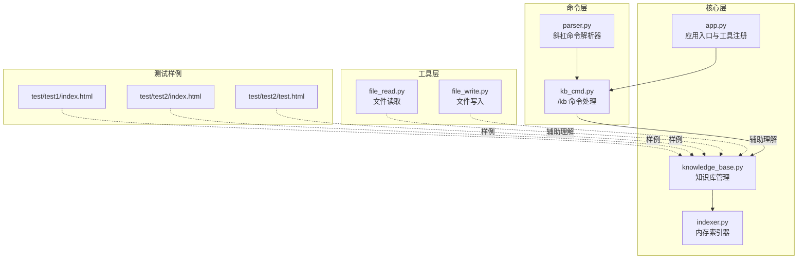
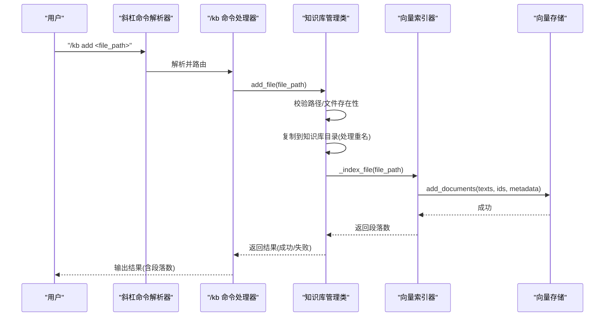
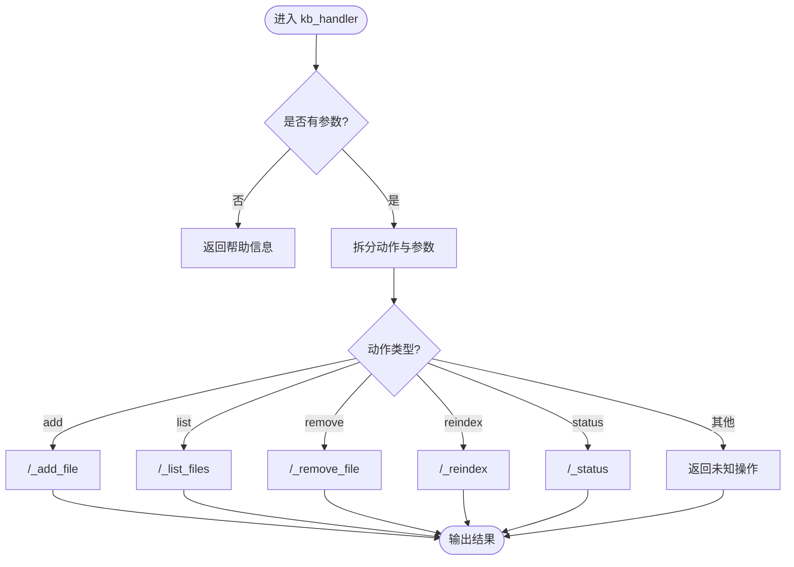
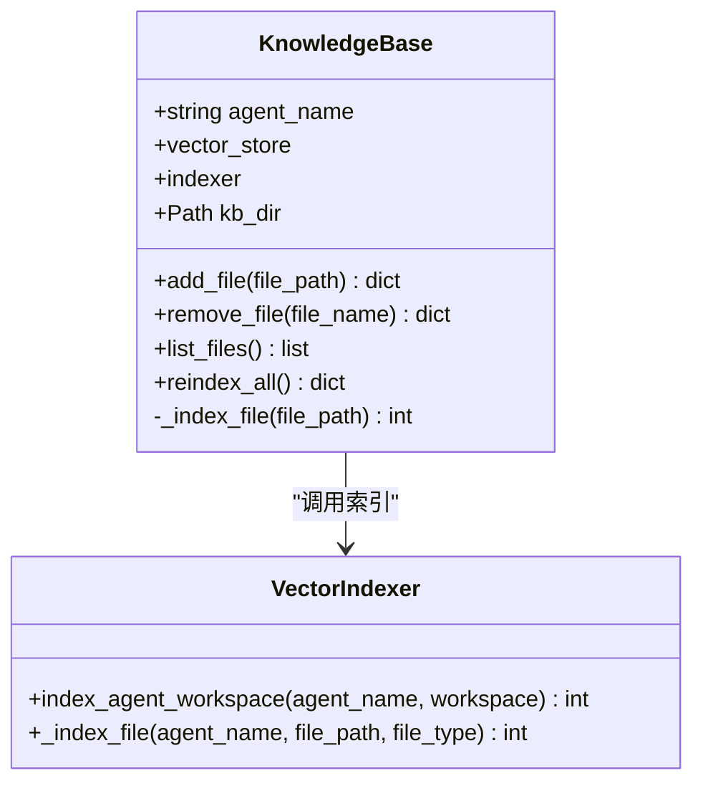
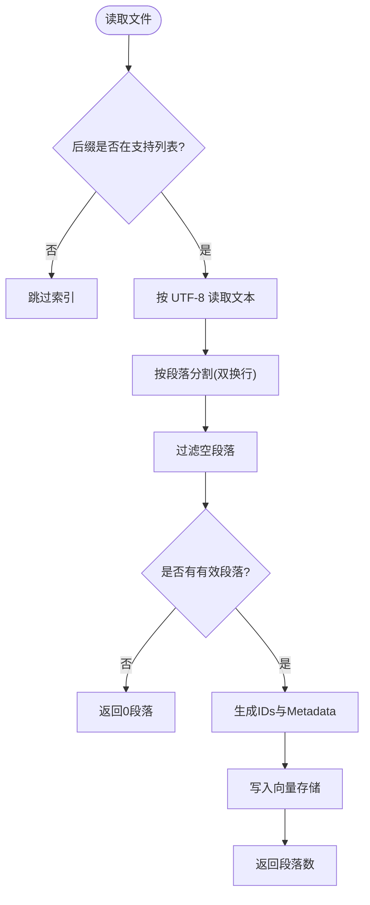
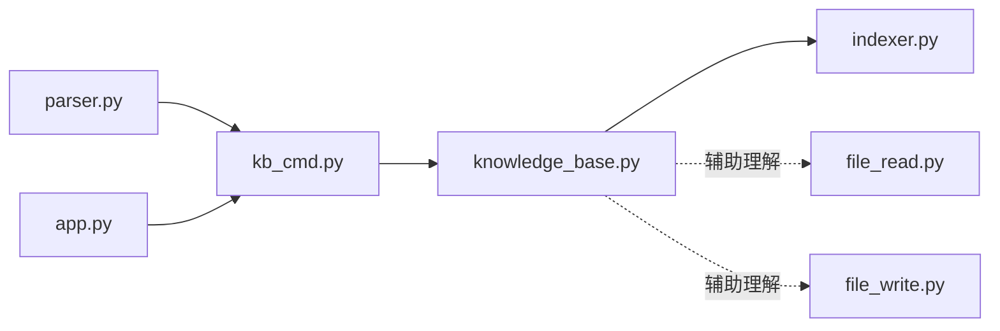

# 文件管理

<cite>
**本文引用的文件**
- [README.md](file://README.md)
- [kb_cmd.py](file://cbhcli_pkg/commands/kb_cmd.py)
- [knowledge_base.py](file://cbhcli_pkg/core/knowledge_base.py)
- [parser.py](file://cbhcli_pkg/commands/parser.py)
- [app.py](file://cbhcli_pkg/core/app.py)
- [indexer.py](file://cbhcli_pkg/vector/indexer.py)
- [file_read.py](file://cbhcli_pkg/tools/file_read.py)
- [file_write.py](file://cbhcli_pkg/tools/file_write.py)
- [index.html（测试）](file://test/test1/index.html)
- [index.html（测试）](file://test/test2/index.html)
- [test.html（测试）](file://test/test2/test.html)
</cite>

## 目录
1. [简介](#简介)
2. [项目结构](#项目结构)
3. [核心组件](#核心组件)
4. [架构总览](#架构总览)
5. [详细组件分析](#详细组件分析)
6. [依赖分析](#依赖分析)
7. [性能考量](#性能考量)
8. [故障排查指南](#故障排查指南)
9. [结论](#结论)
10. [附录](#附录)

## 简介
本章节面向“CBHCLI知识库文件管理”功能，提供从添加、删除、列表到重新索引的全流程说明。重点覆盖以下方面：
- 支持的文件格式与索引策略
- 文件路径解析、验证与错误处理
- 单文件与批量场景的实现思路
- 文件列表展示与元数据呈现
- 最佳实践、常见问题与安全考虑
- 完整操作指南与示例

## 项目结构
围绕知识库文件管理的关键模块与文件如下：
- 命令层：/kb 斜杠命令注册与分发
- 核心层：知识库管理类，负责文件复制、索引与状态
- 向量索引器：负责将知识库内容写入向量数据库
- 工具层：文件读取/写入工具（用于辅助理解文件系统行为）
- 测试样例：HTML 等文本文件，用于验证格式支持

**图表来源**
- [kb_cmd.py:1-186](file://cbhcli_pkg/commands/kb_cmd.py#L1-L186)
- [knowledge_base.py:1-207](file://cbhcli_pkg/core/knowledge_base.py#L1-L207)
- [parser.py:1-94](file://cbhcli_pkg/commands/parser.py#L1-L94)
- [app.py:1-478](file://cbhcli_pkg/core/app.py#L1-L478)
- [indexer.py:53-136](file://cbhcli_pkg/vector/indexer.py#L53-L136)
- [file_read.py:1-125](file://cbhcli_pkg/tools/file_read.py#L1-L125)
- [file_write.py:1-83](file://cbhcli_pkg/tools/file_write.py#L1-L83)
- [index.html（测试）:1-168](file://test/test1/index.html#L1-L168)
- [index.html（测试）:1-427](file://test/test2/index.html#L1-L427)
- [test.html（测试）:1-35](file://test/test2/test.html#L1-L35)

**章节来源**
- [README.md:117-124](file://README.md#L117-L124)
- [kb_cmd.py:1-186](file://cbhcli_pkg/commands/kb_cmd.py#L1-L186)
- [knowledge_base.py:1-207](file://cbhcli_pkg/core/knowledge_base.py#L1-L207)
- [parser.py:1-94](file://cbhcli_pkg/commands/parser.py#L1-L94)
- [app.py:151-179](file://cbhcli_pkg/core/app.py#L151-L179)
- [indexer.py:53-136](file://cbhcli_pkg/vector/indexer.py#L53-L136)
- [file_read.py:1-125](file://cbhcli_pkg/tools/file_read.py#L1-L125)
- [file_write.py:1-83](file://cbhcli_pkg/tools/file_write.py#L1-L83)

## 核心组件
- /kb 命令处理器：负责解析 /kb add/list/remove/reindex/status 子命令，调用知识库管理类执行具体操作。
- 知识库管理类：封装知识库目录、文件复制、索引与状态查询；支持重名处理与异常捕获。
- 向量索引器：将知识库文件内容按段落切分并写入向量数据库，支持多种文本格式。
- 斜杠命令解析器：统一解析用户输入，路由到对应命令处理器。
- 应用入口：注册命令与工具，初始化向量存储与索引器。

**章节来源**
- [kb_cmd.py:5-54](file://cbhcli_pkg/commands/kb_cmd.py#L5-L54)
- [knowledge_base.py:16-30](file://cbhcli_pkg/core/knowledge_base.py#L16-L30)
- [indexer.py:87-136](file://cbhcli_pkg/vector/indexer.py#L87-L136)
- [parser.py:16-94](file://cbhcli_pkg/commands/parser.py#L16-L94)
- [app.py:151-179](file://cbhcli_pkg/core/app.py#L151-L179)

## 架构总览
下面的序列图展示了“添加文件到知识库”的端到端流程，包括路径解析、文件验证、复制与索引。

**图表来源**
- [parser.py:26-78](file://cbhcli_pkg/commands/parser.py#L26-L78)
- [kb_cmd.py:57-77](file://cbhcli_pkg/commands/kb_cmd.py#L57-L77)
- [knowledge_base.py:31-74](file://cbhcli_pkg/core/knowledge_base.py#L31-L74)
- [indexer.py:87-136](file://cbhcli_pkg/vector/indexer.py#L87-L136)

## 详细组件分析

### /kb 命令处理与路由
- 支持子命令：add、list、remove、reindex、status。
- 参数校验：add/remove 子命令要求提供目标路径/名称；未提供时报错提示。
- Agent 依赖：所有知识库操作均需当前已选择的 Agent。
- 输出格式：统一返回人类可读的提示信息，成功/失败状态清晰。

**图表来源**
- [kb_cmd.py:9-47](file://cbhcli_pkg/commands/kb_cmd.py#L9-L47)

**章节来源**
- [kb_cmd.py:5-54](file://cbhcli_pkg/commands/kb_cmd.py#L5-L54)
- [kb_cmd.py:57-186](file://cbhcli_pkg/commands/kb_cmd.py#L57-L186)

### 知识库管理类（添加/删除/列表/重新索引）
- 添加文件
  - 路径解析：使用 Path 对象解析，支持相对/绝对路径。
  - 文件验证：判断是否存在、是否为文件。
  - 复制策略：复制到知识库目录，若同名则自动追加序号避免覆盖。
  - 索引：调用内部索引方法，按段落切分并写入向量存储。
- 删除文件
  - 路径定位：基于知识库目录与文件名拼接。
  - 删除：删除本地文件；向量数据库删除采用“重新索引整个知识库”的简化处理。
- 列出文件
  - 遍历知识库目录，收集文件名、路径与大小。
- 重新索引
  - 遍历知识库目录，逐个文件调用索引方法，统计段落数与文件数。

**图表来源**
- [knowledge_base.py:16-30](file://cbhcli_pkg/core/knowledge_base.py#L16-L30)
- [knowledge_base.py:31-207](file://cbhcli_pkg/core/knowledge_base.py#L31-L207)
- [indexer.py:87-136](file://cbhcli_pkg/vector/indexer.py#L87-L136)

**章节来源**
- [knowledge_base.py:31-149](file://cbhcli_pkg/core/knowledge_base.py#L31-L149)
- [knowledge_base.py:151-207](file://cbhcli_pkg/core/knowledge_base.py#L151-L207)

### 文件格式支持与索引策略
- 支持格式：.md、.txt、.py、.js、.json、.yaml、.yml。
- 索引方式：按双换行符分割为段落，去除空白段落，生成文档ID与元数据，写入向量存储。
- 二进制文件：不在知识库索引范围内（跳过）。

**图表来源**
- [knowledge_base.py:164-207](file://cbhcli_pkg/core/knowledge_base.py#L164-L207)
- [indexer.py:108-134](file://cbhcli_pkg/vector/indexer.py#L108-L134)

**章节来源**
- [knowledge_base.py:166-170](file://cbhcli_pkg/core/knowledge_base.py#L166-L170)
- [indexer.py:108-112](file://cbhcli_pkg/vector/indexer.py#L108-L112)

### 文件路径解析、验证与错误处理
- 路径解析：使用 Path 对象，支持相对路径与绝对路径。
- 存在性与类型验证：文件必须存在且为普通文件。
- 错误处理：捕获异常并返回结构化错误信息，确保命令执行稳定。
- 重名处理：添加时若目标文件已存在，自动追加序号后缀，避免覆盖。

**章节来源**
- [knowledge_base.py:41-73](file://cbhcli_pkg/core/knowledge_base.py#L41-L73)
- [knowledge_base.py:52-58](file://cbhcli_pkg/core/knowledge_base.py#L52-L58)

### 文件列表展示与元数据
- 列表接口：返回文件名、路径与大小。
- 展示格式：KB 命令处理器将大小转换为 KB 并人性化输出。
- 元数据：向量存储写入时携带 agent_name、file_name、file_path、segment_index、type 等字段，便于后续检索与溯源。

**章节来源**
- [knowledge_base.py:103-122](file://cbhcli_pkg/core/knowledge_base.py#L103-L122)
- [kb_cmd.py:79-102](file://cbhcli_pkg/commands/kb_cmd.py#L79-L102)
- [knowledge_base.py:184-193](file://cbhcli_pkg/core/knowledge_base.py#L184-L193)

### 批量添加与删除（实现思路）
- 单文件：/kb add 与 /kb remove 已支持单个文件的添加与删除。
- 批量场景：当前命令未直接提供批量参数。建议通过外部脚本或批处理方式循环调用 /kb add/remove，或在应用层扩展命令以支持批量参数（例如接受文件列表或目录路径）。
- 注意事项：批量操作应包含重名冲突处理、索引粒度控制与错误汇总。

**章节来源**
- [kb_cmd.py:26-46](file://cbhcli_pkg/commands/kb_cmd.py#L26-L46)
- [knowledge_base.py:52-58](file://cbhcli_pkg/core/knowledge_base.py#L52-L58)

### 权限检查与安全考虑
- 权限检查：知识库目录位于用户家目录下，通常具备读写权限；添加/删除/索引均依赖标准文件系统操作。
- 安全建议：
  - 仅添加可信来源的文本文件，避免注入恶意内容。
  - 若在共享环境中使用，建议为知识库目录设置合适的访问权限。
  - 向量数据库与索引文件同样位于用户目录，注意备份与迁移时的权限一致性。
- 错误处理：所有文件操作均捕获异常并返回友好提示，避免崩溃。

**章节来源**
- [knowledge_base.py:28](file://cbhcli_pkg/core/knowledge_base.py#L28)
- [knowledge_base.py:60-73](file://cbhcli_pkg/core/knowledge_base.py#L60-L73)

## 依赖分析
- 命令层依赖：/kb 命令处理器依赖斜杠命令解析器；同时依赖应用层提供的当前 Agent 名称与向量存储/索引器实例。
- 核心层依赖：知识库管理类依赖向量索引器与向量存储；索引器负责将文本内容写入向量数据库。
- 工具层辅助：文件读取/写入工具用于理解文件系统行为，便于排查路径与编码问题。

**图表来源**
- [parser.py:22-24](file://cbhcli_pkg/commands/parser.py#L22-L24)
- [kb_cmd.py:63-69](file://cbhcli_pkg/commands/kb_cmd.py#L63-L69)
- [knowledge_base.py:26-27](file://cbhcli_pkg/core/knowledge_base.py#L26-L27)
- [indexer.py:132](file://cbhcli_pkg/vector/indexer.py#L132)

**章节来源**
- [parser.py:16-94](file://cbhcli_pkg/commands/parser.py#L16-L94)
- [kb_cmd.py:57-186](file://cbhcli_pkg/commands/kb_cmd.py#L57-L186)
- [knowledge_base.py:16-30](file://cbhcli_pkg/core/knowledge_base.py#L16-L30)
- [indexer.py:87-136](file://cbhcli_pkg/vector/indexer.py#L87-L136)

## 性能考量
- 索引粒度：按段落切分，有利于检索精度与上下文关联；但段落过多会增加向量存储写入次数。
- 文本格式：仅支持 UTF-8 编码的文本文件；二进制文件跳过，避免无效索引。
- 重新索引：批量文件重新索引会遍历知识库目录并对每个文件执行索引，建议在文件更新后触发，而非频繁执行。
- 向量存储：索引写入与查询受向量存储实现影响，建议合理配置嵌入模型与重排序服务以提升检索质量。

**章节来源**
- [knowledge_base.py:166-170](file://cbhcli_pkg/core/knowledge_base.py#L166-L170)
- [knowledge_base.py:137-149](file://cbhcli_pkg/core/knowledge_base.py#L137-L149)
- [indexer.py:108-134](file://cbhcli_pkg/vector/indexer.py#L108-L134)

## 故障排查指南
- “请先选择 Agent”
  - 现象：执行 /kb 子命令返回该提示。
  - 排查：确认已通过 /agent switch 选择有效 Agent。
- “文件不存在/不是文件”
  - 现象：添加/删除文件时报错。
  - 排查：检查路径是否正确、文件是否存在、是否为普通文件；必要时使用绝对路径。
- “添加文件失败/删除文件失败”
  - 现象：命令执行失败。
  - 排查：查看系统日志或重试；确认知识库目录权限正常。
- “知识库为空”
  - 现象：/kb list 返回空列表。
  - 排查：确认已添加文件；检查知识库目录位置与权限。
- “向量数据库未启用”
  - 现象：查询知识库内容时报错。
  - 排查：安装并配置嵌入模型与向量存储；参考 README 中的嵌入模型配置步骤。

**章节来源**
- [kb_cmd.py:59-60](file://cbhcli_pkg/commands/kb_cmd.py#L59-L60)
- [knowledge_base.py:43-47](file://cbhcli_pkg/core/knowledge_base.py#L43-L47)
- [kb_cmd.py:94](file://cbhcli_pkg/commands/kb_cmd.py#L94)
- [README.md:107-115](file://README.md#L107-L115)

## 结论
CBHCLI 的知识库文件管理以“简单可靠”为核心设计：命令层清晰、核心层职责单一、索引策略稳健。当前实现支持主流文本格式与基本的增删查操作，并通过向量索引器提供语义检索能力。对于批量场景，可通过外部脚本或后续扩展命令实现。建议在生产环境中结合权限控制与定期重新索引策略，确保知识库的准确性与性能。

## 附录

### 操作指南与示例
- 添加文件
  - 示例：/kb add /path/to/document.md
  - 输出：成功时显示“已添加文件”及“索引段落数”
- 列出文件
  - 示例：/kb list
  - 输出：显示知识库中的文件名与大小（KB）
- 删除文件
  - 示例：/kb remove filename.md
  - 输出：成功时显示“已删除文件”
- 重新索引
  - 示例：/kb reindex
  - 输出：显示“已索引 N 个文件，共 M 个段落”
- 查看状态
  - 示例：/kb status
  - 输出：显示 Agent、目录、文件数、向量文档数（若启用）、索引器状态

**章节来源**
- [README.md:117-124](file://README.md#L117-L124)
- [kb_cmd.py:14-46](file://cbhcli_pkg/commands/kb_cmd.py#L14-L46)
- [kb_cmd.py:79-102](file://cbhcli_pkg/commands/kb_cmd.py#L79-L102)
- [kb_cmd.py:105-124](file://cbhcli_pkg/commands/kb_cmd.py#L105-L124)
- [kb_cmd.py:126-145](file://cbhcli_pkg/commands/kb_cmd.py#L126-L145)
- [kb_cmd.py:147-186](file://cbhcli_pkg/commands/kb_cmd.py#L147-L186)

### 文件格式支持清单
- 支持格式：.md、.txt、.py、.js、.json、.yaml、.yml
- 不支持格式：二进制文件（如 .pdf、.jpg 等），将被跳过索引

**章节来源**
- [knowledge_base.py:166](file://cbhcli_pkg/core/knowledge_base.py#L166)
- [indexer.py:65](file://cbhcli_pkg/vector/indexer.py#L65)

### 最佳实践
- 文件命名：避免重名；若存在重名，系统会自动追加序号，但建议人为区分。
- 更新策略：文件更新后执行 /kb reindex 以同步向量索引。
- 权限管理：确保知识库目录具备读写权限；在共享环境建议限制访问。
- 安全建议：仅添加可信文本文件；避免在知识库中存放敏感信息。

**章节来源**
- [knowledge_base.py:52-58](file://cbhcli_pkg/core/knowledge_base.py#L52-L58)
- [knowledge_base.py:137-149](file://cbhcli_pkg/core/knowledge_base.py#L137-L149)