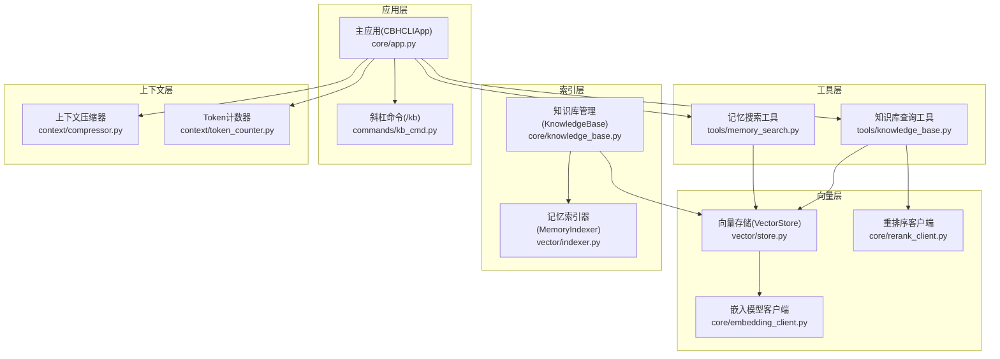
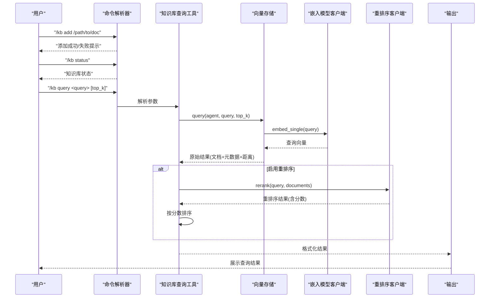
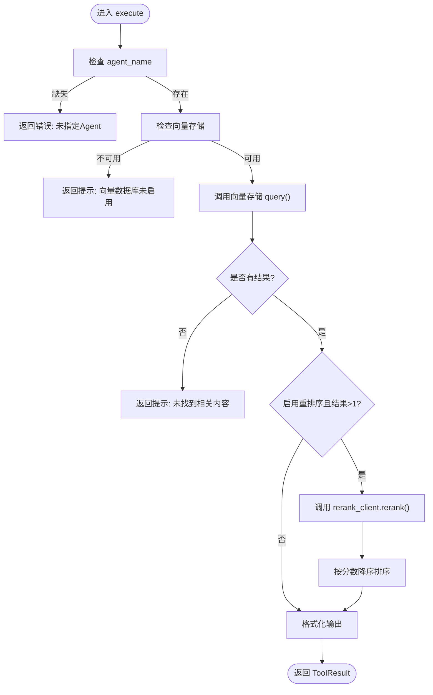
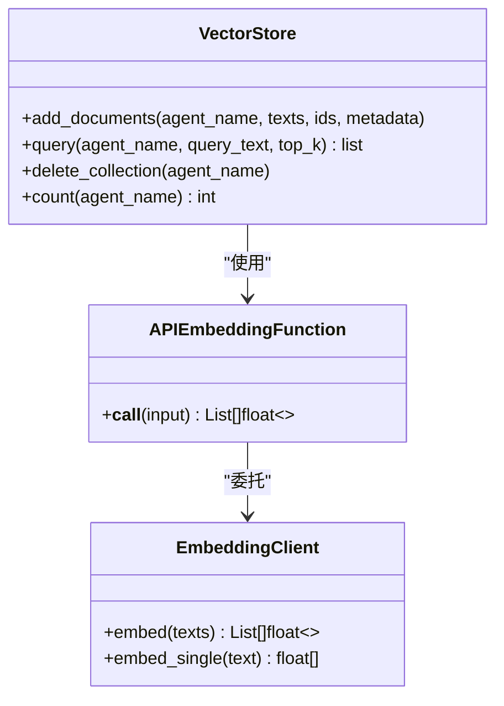
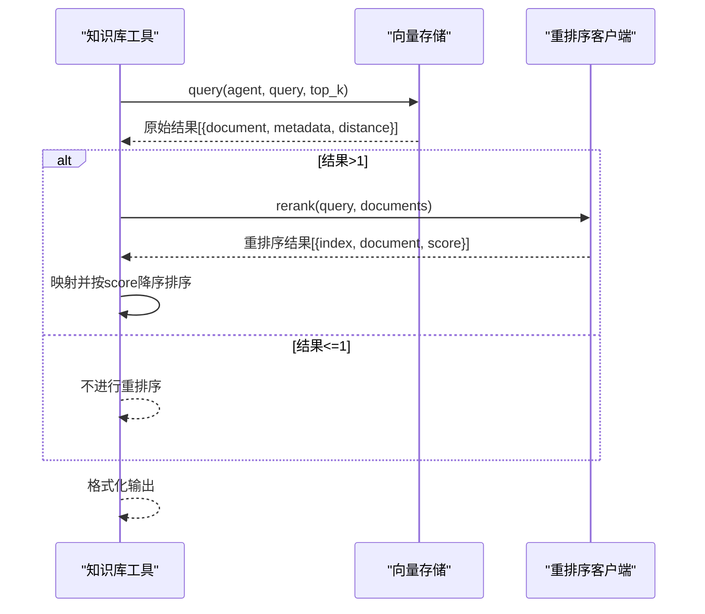
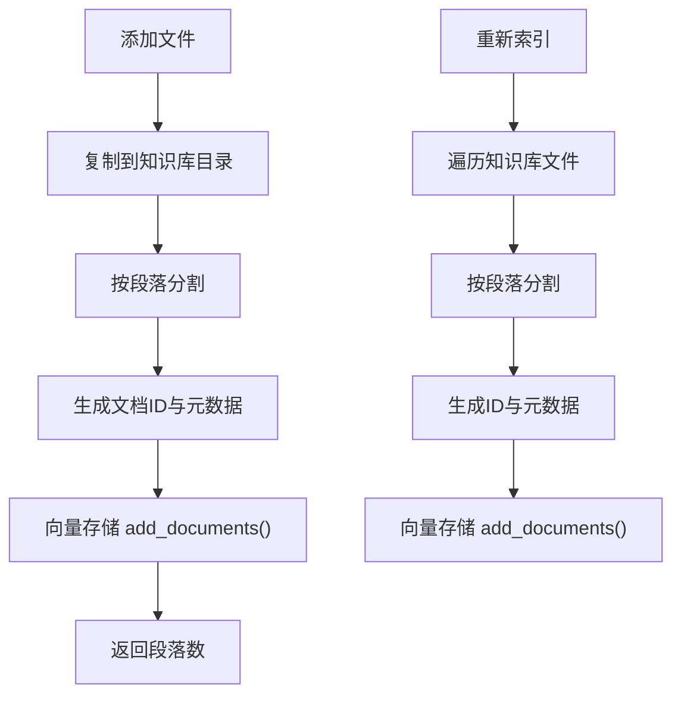
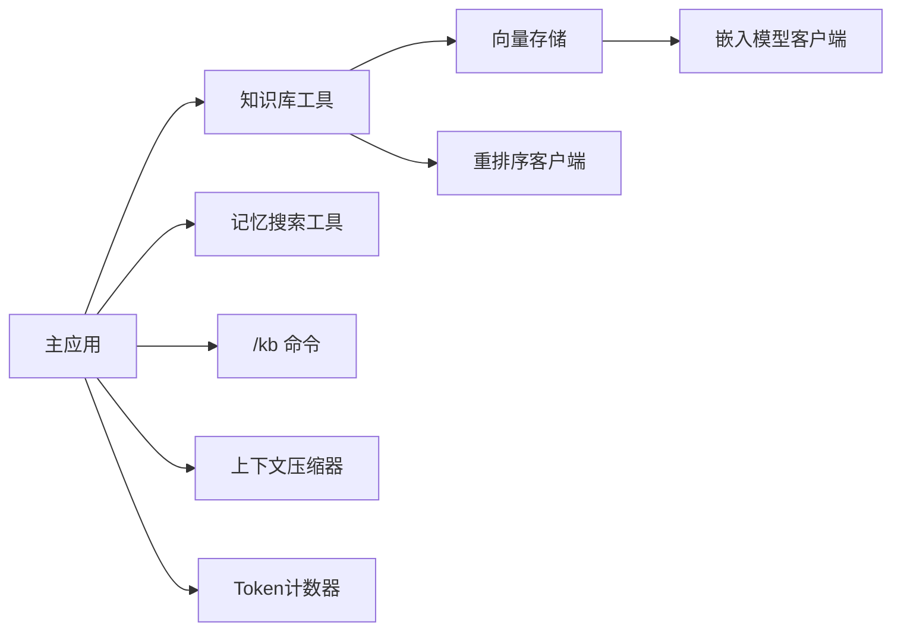

# 查询功能

<cite>
**本文引用的文件**
- [知识库工具](file://cbhcli_pkg/tools/knowledge_base.py)
- [向量存储](file://cbhcli_pkg/vector/store.py)
- [重排序客户端](file://cbhcli_pkg/core/rerank_client.py)
- [嵌入模型客户端](file://cbhcli_pkg/core/embedding_client.py)
- [知识库管理](file://cbhcli_pkg/core/knowledge_base.py)
- [斜杠命令：知识库](file://cbhcli_pkg/commands/kb_cmd.py)
- [记忆搜索工具](file://cbhcli_pkg/tools/memory_search.py)
- [主应用](file://cbhcli_pkg/core/app.py)
- [上下文压缩器](file://cbhcli_pkg/context/compressor.py)
- [Token计数器](file://cbhcli_pkg/context/token_counter.py)
- [README](file://README.md)
</cite>

## 目录
1. [简介](#简介)
2. [项目结构](#项目结构)
3. [核心组件](#核心组件)
4. [架构总览](#架构总览)
5. [详细组件分析](#详细组件分析)
6. [依赖分析](#依赖分析)
7. [性能考虑](#性能考虑)
8. [故障排查指南](#故障排查指南)
9. [结论](#结论)
10. [附录](#附录)

## 简介
本文件面向CBHCLI的“知识库查询”能力，系统性阐述其查询实现机制、排序与过滤策略、性能优化、结果展示与上下文提取、高级技巧与最佳实践、错误处理与重试机制，以及与AI模型的集成方式。读者无需深入代码即可理解如何高效使用查询功能，并在遇到问题时快速定位与解决。

## 项目结构
围绕知识库查询功能，涉及以下关键模块：
- 工具层：知识库查询工具、记忆搜索工具
- 向量层：向量存储封装、嵌入模型客户端、重排序客户端
- 索引层：知识库管理与索引器
- 应用层：主应用初始化与命令注册
- 上下文层：上下文压缩与Token计数

图表来源
- [知识库工具:1-157](file://cbhcli_pkg/tools/knowledge_base.py#L1-L157)
- [向量存储:1-175](file://cbhcli_pkg/vector/store.py#L1-L175)
- [重排序客户端:1-123](file://cbhcli_pkg/core/rerank_client.py#L1-L123)
- [嵌入模型客户端:1-132](file://cbhcli_pkg/core/embedding_client.py#L1-L132)
- [知识库管理:1-207](file://cbhcli_pkg/core/knowledge_base.py#L1-L207)
- [斜杠命令：知识库:1-186](file://cbhcli_pkg/commands/kb_cmd.py#L1-L186)
- [记忆搜索工具:1-177](file://cbhcli_pkg/tools/memory_search.py#L1-L177)
- [主应用:1-478](file://cbhcli_pkg/core/app.py#L1-L478)
- [上下文压缩器:1-112](file://cbhcli_pkg/context/compressor.py#L1-L112)
- [Token计数器:1-88](file://cbhcli_pkg/context/token_counter.py#L1-L88)

章节来源
- [主应用:97-150](file://cbhcli_pkg/core/app.py#L97-L150)
- [斜杠命令：知识库:5-54](file://cbhcli_pkg/commands/kb_cmd.py#L5-L54)

## 核心组件
- 知识库查询工具：负责接收查询、调用向量存储、可选重排序、格式化输出。
- 向量存储：封装ChromaDB，统一嵌入计算与查询接口，支持自定义嵌入模型。
- 嵌入模型客户端：支持OpenAI兼容与自定义API，批量嵌入与单条嵌入。
- 重排序客户端：支持Jina/Cohere等重排序API，提升相关性排序质量。
- 知识库管理：文件增删、索引、重新索引；将知识库内容切分为段落并入库。
- 记忆搜索工具：优先向量搜索，不可用时降级为memory.md关键词匹配。
- 主应用：初始化嵌入/重排序/向量存储，注册工具与命令，维护Agent上下文。
- 上下文压缩与Token计数：在接近上下文上限时压缩，保障查询与对话稳定。

章节来源
- [知识库工具:1-157](file://cbhcli_pkg/tools/knowledge_base.py#L1-L157)
- [向量存储:1-175](file://cbhcli_pkg/vector/store.py#L1-L175)
- [嵌入模型客户端:1-132](file://cbhcli_pkg/core/embedding_client.py#L1-L132)
- [重排序客户端:1-123](file://cbhcli_pkg/core/rerank_client.py#L1-L123)
- [知识库管理:1-207](file://cbhcli_pkg/core/knowledge_base.py#L1-L207)
- [记忆搜索工具:1-177](file://cbhcli_pkg/tools/memory_search.py#L1-L177)
- [主应用:97-150](file://cbhcli_pkg/core/app.py#L97-L150)
- [上下文压缩器:1-112](file://cbhcli_pkg/context/compressor.py#L1-L112)
- [Token计数器:1-88](file://cbhcli_pkg/context/token_counter.py#L1-L88)

## 架构总览
查询流程从用户输入开始，经由命令解析、工具执行、向量检索与可选重排序，最终返回结构化结果。若向量存储不可用，则记忆搜索工具提供降级方案。

图表来源
- [斜杠命令：知识库:8-54](file://cbhcli_pkg/commands/kb_cmd.py#L8-L54)
- [知识库工具:49-121](file://cbhcli_pkg/tools/knowledge_base.py#L49-L121)
- [向量存储:128-160](file://cbhcli_pkg/vector/store.py#L128-L160)
- [嵌入模型客户端:120-132](file://cbhcli_pkg/core/embedding_client.py#L120-L132)
- [重排序客户端:35-59](file://cbhcli_pkg/core/rerank_client.py#L35-L59)

## 详细组件分析

### 知识库查询工具
- 功能要点
  - 自动识别当前Agent名称，若未配置则报错。
  - 检查向量存储可用性，不可用时返回提示。
  - 调用向量存储执行语义查询，返回top_k结果。
  - 若配置了重排序客户端且结果多于1条，则进行重排序。
  - 格式化输出：包含来源文件、相关度分数、文档片段。
- 排序与过滤
  - 向量检索返回ChromaDB的“距离”字段，作为初始相关性指标。
  - 重排序阶段使用重排序API提供的“分数”，按分数降序排列。
  - 过滤：仅返回存在文档的非空结果。
- 错误处理
  - Agent名称缺失、向量存储未启用、查询异常均以ToolResult返回错误信息。

图表来源
- [知识库工具:49-121](file://cbhcli_pkg/tools/knowledge_base.py#L49-L121)
- [重排序客户端:35-59](file://cbhcli_pkg/core/rerank_client.py#L35-L59)

章节来源
- [知识库工具:49-121](file://cbhcli_pkg/tools/knowledge_base.py#L49-L121)

### 向量存储与嵌入模型
- 向量存储
  - 使用ChromaDB持久化集合，集合名为“agent_{agent_name}”。
  - 统一通过嵌入客户端计算文档与查询向量，避免ChromaDB默认模型。
  - 支持批量添加与查询，查询返回文档、元数据与距离。
- 嵌入模型客户端
  - 支持OpenAI兼容与自定义API，具备批量嵌入与单条嵌入能力。
  - 默认使用OpenAI兼容格式，便于对接多种服务。

图表来源
- [向量存储:37-175](file://cbhcli_pkg/vector/store.py#L37-L175)
- [嵌入模型客户端:6-132](file://cbhcli_pkg/core/embedding_client.py#L6-L132)

章节来源
- [向量存储:37-175](file://cbhcli_pkg/vector/store.py#L37-L175)
- [嵌入模型客户端:6-132](file://cbhcli_pkg/core/embedding_client.py#L6-L132)

### 重排序机制
- 支持Jina与Cohere等重排序API，统一返回包含“index”、“document”、“score”的结果。
- 知识库工具将重排序结果映射回原始结果，并按分数降序排序。
- 若重排序失败，保留原始结果并打印告警。

图表来源
- [知识库工具:123-156](file://cbhcli_pkg/tools/knowledge_base.py#L123-L156)
- [重排序客户端:35-122](file://cbhcli_pkg/core/rerank_client.py#L35-L122)

章节来源
- [知识库工具:123-156](file://cbhcli_pkg/tools/knowledge_base.py#L123-L156)
- [重排序客户端:35-122](file://cbhcli_pkg/core/rerank_client.py#L35-L122)

### 知识库管理与索引
- 文件管理
  - 添加文件：复制到知识库目录，按段落切分并索引到向量数据库。
  - 删除文件：删除本地文件，建议重新索引以同步向量库。
  - 列表与状态：列出知识库文件、统计向量文档数量。
  - 重新索引：遍历知识库目录，逐文件切分并入库。
- 索引策略
  - 按段落分割（双换行符），过滤空段。
  - 为每段生成唯一ID与元数据（包含Agent名、文件名、段落索引等）。
  - 使用向量存储统一添加，避免重复索引导致的ID冲突。

图表来源
- [知识库管理:31-207](file://cbhcli_pkg/core/knowledge_base.py#L31-L207)
- [向量存储:99-126](file://cbhcli_pkg/vector/store.py#L99-L126)

章节来源
- [知识库管理:31-207](file://cbhcli_pkg/core/knowledge_base.py#L31-L207)
- [向量存储:99-126](file://cbhcli_pkg/vector/store.py#L99-L126)

### 记忆搜索工具（降级方案）
- 当向量存储不可用时，从memory.md进行关键词匹配。
- 将memory.md按段落分割，计算查询词与段落词的交集作为匹配度，取top_k。
- 输出包含“向量搜索 - 仅查询向量化内容”的提示，避免混淆。

章节来源
- [记忆搜索工具:105-177](file://cbhcli_pkg/tools/memory_search.py#L105-L177)

### 主应用与命令集成
- 主应用在初始化时根据配置决定是否启用向量存储与重排序，并注册相关工具。
- /kb命令提供知识库文件的增删改查与状态查看，直接调用知识库管理类。

章节来源
- [主应用:97-150](file://cbhcli_pkg/core/app.py#L97-L150)
- [斜杠命令：知识库:5-54](file://cbhcli_pkg/commands/kb_cmd.py#L5-L54)

### 上下文压缩与Token计数
- 在接近上下文上限时自动压缩，保留系统消息与近期对话，中间部分生成摘要。
- Token计数器支持精确（tiktoken）与估算两种模式，用于上下文控制与查询提示。

章节来源
- [上下文压缩器:21-81](file://cbhcli_pkg/context/compressor.py#L21-L81)
- [Token计数器:34-75](file://cbhcli_pkg/context/token_counter.py#L34-L75)

## 依赖分析
- 知识库查询工具依赖向量存储与可选的重排序客户端。
- 向量存储依赖嵌入模型客户端，统一嵌入计算。
- 主应用负责初始化嵌入/重排序/向量存储，并注册工具与命令。
- 记忆搜索工具在向量存储不可用时提供降级方案。

图表来源
- [知识库工具:1-157](file://cbhcli_pkg/tools/knowledge_base.py#L1-L157)
- [向量存储:1-175](file://cbhcli_pkg/vector/store.py#L1-L175)
- [重排序客户端:1-123](file://cbhcli_pkg/core/rerank_client.py#L1-L123)
- [嵌入模型客户端:1-132](file://cbhcli_pkg/core/embedding_client.py#L1-L132)
- [主应用:97-150](file://cbhcli_pkg/core/app.py#L97-L150)
- [记忆搜索工具:1-177](file://cbhcli_pkg/tools/memory_search.py#L1-L177)
- [斜杠命令：知识库:1-186](file://cbhcli_pkg/commands/kb_cmd.py#L1-L186)
- [上下文压缩器:1-112](file://cbhcli_pkg/context/compressor.py#L1-L112)
- [Token计数器:1-88](file://cbhcli_pkg/context/token_counter.py#L1-L88)

## 性能考虑
- 嵌入计算优化
  - 批量嵌入：嵌入客户端支持分批处理，减少单次请求负载。
  - 预计算查询向量：向量存储在查询前预计算查询向量，避免ChromaDB默认模型调用。
- 结果数量控制
  - 通过top_k限制返回数量，降低后续重排序与展示成本。
- 重排序成本
  - 仅在结果多于1条时启用重排序，避免不必要的网络调用。
- 索引策略
  - 按段落切分，有利于细粒度检索；合理设置段落长度平衡召回与相关性。
- 上下文控制
  - 自动压缩与Token计数结合，避免超限导致的查询失败与性能下降。

章节来源
- [嵌入模型客户端:49-113](file://cbhcli_pkg/core/embedding_client.py#L49-L113)
- [向量存储:118-149](file://cbhcli_pkg/vector/store.py#L118-L149)
- [知识库工具:90-93](file://cbhcli_pkg/tools/knowledge_base.py#L90-L93)
- [上下文压缩器:21-81](file://cbhcli_pkg/context/compressor.py#L21-L81)
- [Token计数器:34-75](file://cbhcli_pkg/context/token_counter.py#L34-L75)

## 故障排查指南
- 向量数据库未启用
  - 现象：知识库工具返回“向量数据库未启用”。
  - 处理：配置嵌入模型并执行索引命令，或安装ChromaDB。
- Agent名称缺失
  - 现象：工具返回“未指定Agent名称，且无法获取当前Agent”。
  - 处理：先选择Agent，再执行查询。
- 查询无结果
  - 现象：返回“未找到相关内容”或“未找到memory.md文件”。
  - 处理：确认知识库文件已添加并索引；检查向量存储状态。
- 重排序失败
  - 现象：重排序异常，工具回退到原始结果。
  - 处理：检查重排序API配置与网络连通性。
- 上下文超限
  - 现象：自动压缩失败或性能下降。
  - 处理：调整上下文压缩阈值或减少一次性查询结果数量。

章节来源
- [知识库工具:65-121](file://cbhcli_pkg/tools/knowledge_base.py#L65-L121)
- [记忆搜索工具:63-103](file://cbhcli_pkg/tools/memory_search.py#L63-L103)
- [斜杠命令：知识库:57-186](file://cbhcli_pkg/commands/kb_cmd.py#L57-L186)
- [主应用:361-385](file://cbhcli_pkg/core/app.py#L361-L385)

## 结论
CBHCLI的知识库查询功能以“语义搜索+可选重排序”为核心，辅以降级方案与上下文控制，兼顾准确性与稳定性。通过合理的嵌入与索引策略、重排序优化与上下文压缩，能够在复杂场景下提供高质量的检索体验。建议在生产环境中：
- 明确配置嵌入与重排序服务，确保查询质量。
- 合理设置top_k与段落切分策略，平衡召回与相关性。
- 定期维护知识库索引，确保向量库与文件内容一致。
- 结合上下文压缩与Token计数，避免超限影响性能。

## 附录

### 查询结果展示格式
- 标题：包含查询关键词与工具标识。
- 条目：按序号列出，包含来源文件、相关度分数、文档片段。
- 降级提示：当使用记忆搜索工具时，会提示“仅查询向量化内容”。

章节来源
- [知识库工具:95-114](file://cbhcli_pkg/tools/knowledge_base.py#L95-L114)
- [记忆搜索工具:86-96](file://cbhcli_pkg/tools/memory_search.py#L86-L96)

### 高级查询技巧与最佳实践
- 使用更具体的查询词：短语查询通常比关键词组合效果更好。
- 控制返回数量：根据任务复杂度调整top_k，避免过多噪声。
- 启用重排序：在需要精细排序时开启重排序，提升相关性。
- 定期索引：文件更新后及时重新索引，保证向量库与内容一致。
- 上下文优化：在长对话中利用自动压缩，保持查询与对话的流畅性。

章节来源
- [README:208-229](file://README.md#L208-L229)
- [上下文压缩器:21-81](file://cbhcli_pkg/context/compressor.py#L21-L81)

### 查询与AI模型的集成
- 嵌入模型：统一由嵌入客户端提供，支持OpenAI兼容与自定义API。
- 重排序模型：通过重排序客户端对接第三方API，提升排序质量。
- 主应用：在初始化时根据配置加载嵌入/重排序/向量存储，并注册工具与命令。

章节来源
- [嵌入模型客户端:15-33](file://cbhcli_pkg/core/embedding_client.py#L15-L33)
- [重排序客户端:16-33](file://cbhcli_pkg/core/rerank_client.py#L16-L33)
- [主应用:97-150](file://cbhcli_pkg/core/app.py#L97-L150)