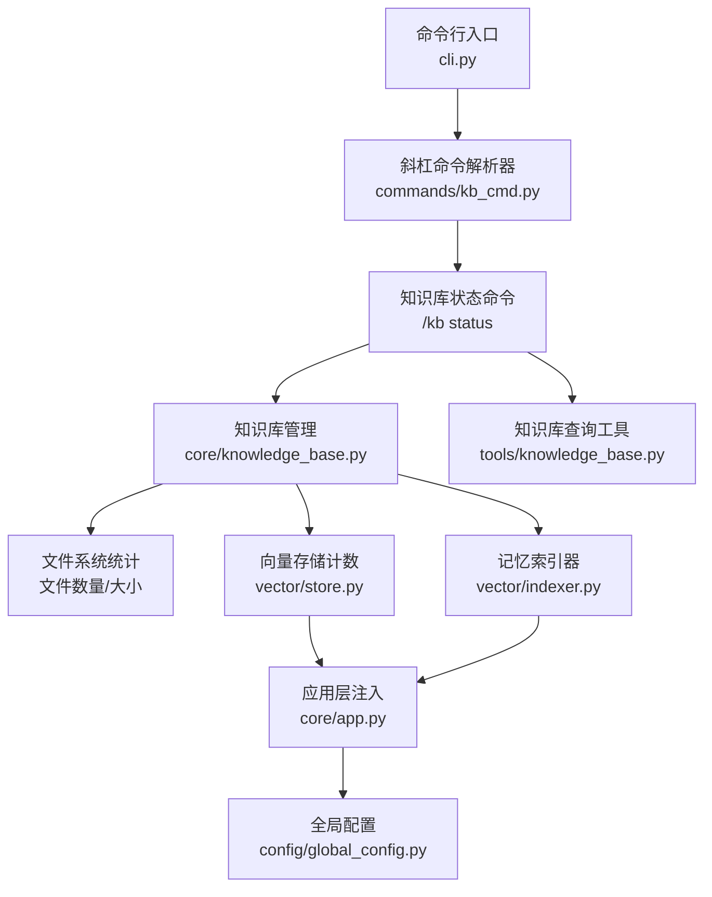
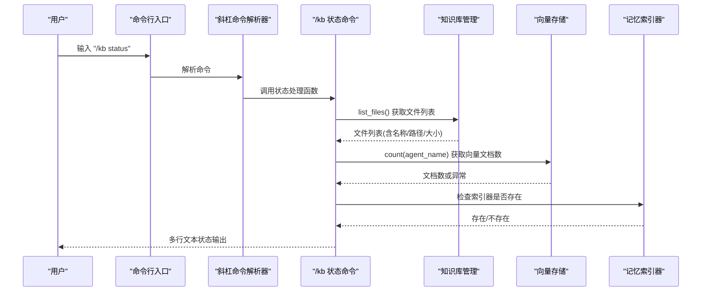
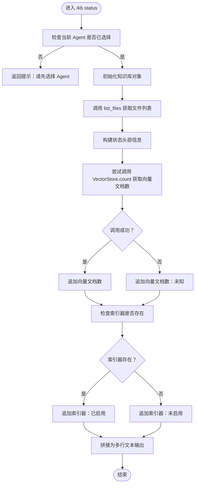
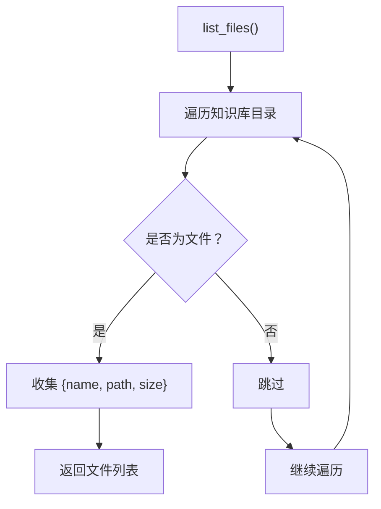
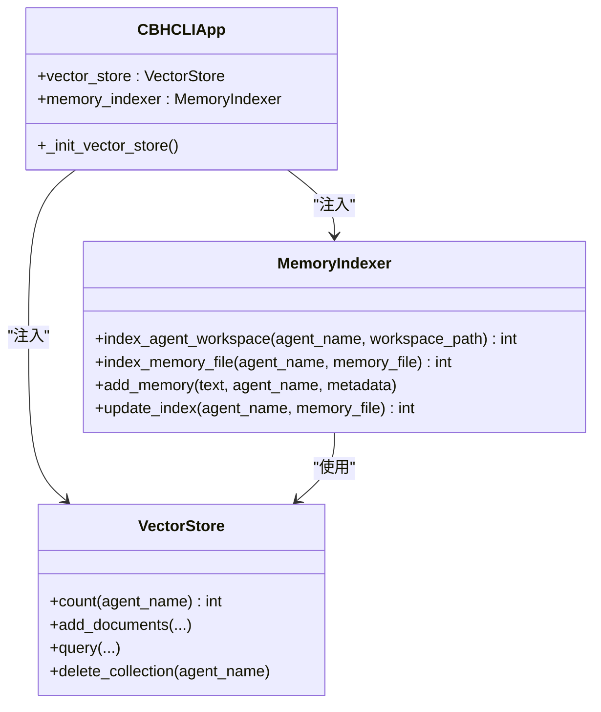
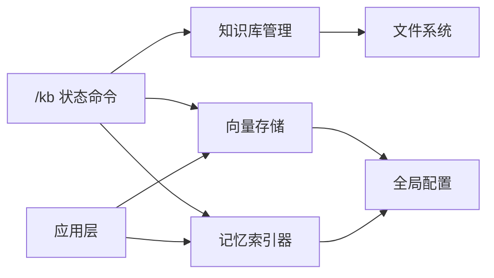

# 状态监控

<cite>
**本文引用的文件**
- [kb_cmd.py](file://cbhcli_pkg/commands/kb_cmd.py)
- [knowledge_base.py](file://cbhcli_pkg/core/knowledge_base.py)
- [indexer.py](file://cbhcli_pkg/vector/indexer.py)
- [store.py](file://cbhcli_pkg/vector/store.py)
- [knowledge_base.py](file://cbhcli_pkg/tools/knowledge_base.py)
- [app.py](file://cbhcli_pkg/core/app.py)
- [cli.py](file://cbhcli_pkg/cli.py)
- [global_config.py](file://cbhcli_pkg/config/global_config.py)
- [README.md](file://README.md)
</cite>

## 目录
1. [简介](#简介)
2. [项目结构](#项目结构)
3. [核心组件](#核心组件)
4. [架构总览](#架构总览)
5. [详细组件分析](#详细组件分析)
6. [依赖关系分析](#依赖关系分析)
7. [性能考量](#性能考量)
8. [故障排查指南](#故障排查指南)
9. [结论](#结论)
10. [附录](#附录)

## 简介
本文件面向管理员与运维人员，系统性阐述 CBHCLI 知识库状态监控功能的设计与实现，涵盖以下主题：
- 知识库状态检查机制：文件数量统计、存储空间监控、索引状态跟踪
- 状态信息的采集与展示：命令行输出格式与 JSON 输出能力扩展建议
- 自动化脚本与定时任务配置思路
- 状态异常检测与告警机制设计
- 状态维护与清理操作指南
- 状态数据的备份与恢复策略
- 与系统其他组件的集成方式
- 管理员运维完整指导

## 项目结构
围绕“状态监控”的关键代码分布在如下模块：
- 命令层：/kb 状态命令与输出格式控制
- 核心业务：知识库管理与文件统计
- 向量索引：索引器与向量存储计数
- 工具层：知识库查询工具的查询结果格式
- 应用层：向量存储与索引器的生命周期与可用性
- 配置层：嵌入模型与重排序模型配置，影响向量能力启用

图表来源
- [cli.py:73-112](file://cbhcli_pkg/cli.py#L73-L112)
- [kb_cmd.py:147-185](file://cbhcli_pkg/commands/kb_cmd.py#L147-L185)
- [knowledge_base.py:103-122](file://cbhcli_pkg/core/knowledge_base.py#L103-L122)
- [store.py:171-175](file://cbhcli_pkg/vector/store.py#L171-L175)
- [indexer.py:37-69](file://cbhcli_pkg/vector/indexer.py#L37-L69)
- [app.py:97-150](file://cbhcli_pkg/core/app.py#L97-L150)
- [global_config.py:117-148](file://cbhcli_pkg/config/global_config.py#L117-L148)
- [knowledge_base.py:49-114](file://cbhcli_pkg/tools/knowledge_base.py#L49-L114)

章节来源
- [cli.py:73-112](file://cbhcli_pkg/cli.py#L73-L112)
- [kb_cmd.py:147-185](file://cbhcli_pkg/commands/kb_cmd.py#L147-L185)
- [knowledge_base.py:103-122](file://cbhcli_pkg/core/knowledge_base.py#L103-L122)
- [store.py:171-175](file://cbhcli_pkg/vector/store.py#L171-L175)
- [indexer.py:37-69](file://cbhcli_pkg/vector/indexer.py#L37-L69)
- [app.py:97-150](file://cbhcli_pkg/core/app.py#L97-L150)
- [global_config.py:117-148](file://cbhcli_pkg/config/global_config.py#L117-L148)
- [knowledge_base.py:49-114](file://cbhcli_pkg/tools/knowledge_base.py#L49-L114)

## 核心组件
- 知识库状态命令：/kb status，负责聚合 Agent 名称、知识库目录、文件数量、向量文档数量、索引器启用状态等信息，并以人类可读的多行文本形式输出。
- 知识库管理：负责知识库目录的创建、文件复制、按段落切分与向量索引；提供 list_files 用于统计文件数量与大小。
- 向量存储计数：通过 VectorStore.count 获取集合中文档数量，用于状态展示。
- 记忆索引器：负责 Agent 工作空间与知识库目录的索引，其存在与否决定“索引器启用”状态。
- 应用层注入：向量存储与索引器在应用初始化阶段根据嵌入模型配置条件性启用，影响状态命令的可用性。
- 全局配置：嵌入模型与重排序模型配置决定向量能力是否启用，进而影响状态命令的输出项。

章节来源
- [kb_cmd.py:147-185](file://cbhcli_pkg/commands/kb_cmd.py#L147-L185)
- [knowledge_base.py:103-122](file://cbhcli_pkg/core/knowledge_base.py#L103-L122)
- [store.py:171-175](file://cbhcli_pkg/vector/store.py#L171-L175)
- [indexer.py:37-69](file://cbhcli_pkg/vector/indexer.py#L37-L69)
- [app.py:97-150](file://cbhcli_pkg/core/app.py#L97-L150)
- [global_config.py:117-148](file://cbhcli_pkg/config/global_config.py#L117-L148)

## 架构总览
状态监控涉及“命令层—业务层—向量层—配置层”的协同：
- 命令层接收 /kb status 请求，构造状态信息。
- 业务层提供文件统计与索引能力。
- 向量层提供计数能力，受嵌入模型配置影响。
- 配置层决定向量能力是否启用，从而影响状态命令的输出维度。

图表来源
- [kb_cmd.py:147-185](file://cbhcli_pkg/commands/kb_cmd.py#L147-L185)
- [knowledge_base.py:103-122](file://cbhcli_pkg/core/knowledge_base.py#L103-L122)
- [store.py:171-175](file://cbhcli_pkg/vector/store.py#L171-L175)
- [indexer.py:37-69](file://cbhcli_pkg/vector/indexer.py#L37-L69)

## 详细组件分析

### 知识库状态命令实现
- 命令入口与路由：/kb status 由命令解析器注册并调用内部处理函数。
- 状态聚合逻辑：
  - Agent 名称与知识库目录
  - 文件数量：来自 list_files 的长度
  - 向量文档数量：调用 VectorStore.count，异常时显示“未知”
  - 索引器状态：根据 app.memory_indexer 是否存在判断
- 输出格式：纯文本多行，便于人类阅读与快速巡检。

图表来源
- [kb_cmd.py:147-185](file://cbhcli_pkg/commands/kb_cmd.py#L147-L185)
- [knowledge_base.py:103-122](file://cbhcli_pkg/core/knowledge_base.py#L103-L122)
- [store.py:171-175](file://cbhcli_pkg/vector/store.py#L171-L175)

章节来源
- [kb_cmd.py:147-185](file://cbhcli_pkg/commands/kb_cmd.py#L147-L185)

### 知识库管理与文件统计
- 知识库目录：位于用户主目录下的专属 Agent 知识库目录，自动创建。
- 文件统计：list_files 遍历目录，返回文件名、路径与大小；用于状态命令的“文件数”与“存储空间”展示。
- 存储空间监控：可在状态命令中扩展“总大小”字段，基于 list_files 的 size 字段求和。

图表来源
- [knowledge_base.py:103-122](file://cbhcli_pkg/core/knowledge_base.py#L103-L122)

章节来源
- [knowledge_base.py:103-122](file://cbhcli_pkg/core/knowledge_base.py#L103-L122)

### 向量存储计数与索引状态
- 向量文档数：VectorStore.count 返回集合中文档数量；异常时状态命令显示“未知”，体现健壮性。
- 索引器状态：MemoryIndexer 存在即表示“索引器已启用”，否则“未启用”。索引器负责将 Agent 工作空间与知识库目录内容索引到向量数据库。
- 嵌入模型配置：应用初始化时根据全局配置决定是否启用向量存储与索引器，从而影响状态命令的可用性。

图表来源
- [store.py:171-175](file://cbhcli_pkg/vector/store.py#L171-L175)
- [indexer.py:37-69](file://cbhcli_pkg/vector/indexer.py#L37-L69)
- [app.py:97-150](file://cbhcli_pkg/core/app.py#L97-L150)

章节来源
- [store.py:171-175](file://cbhcli_pkg/vector/store.py#L171-L175)
- [indexer.py:37-69](file://cbhcli_pkg/vector/indexer.py#L37-L69)
- [app.py:97-150](file://cbhcli_pkg/core/app.py#L97-L150)

### 状态信息采集与展示
- 命令行输出格式：/kb status 采用多行文本，包含 Agent 名称、目录、文件数、向量文档数、索引器状态等。
- JSON 输出能力扩展建议：可在应用层增加 JSON 格式的状态导出接口，便于自动化脚本消费；当前代码未直接提供 JSON 输出，但可通过解析命令输出或扩展接口实现。

章节来源
- [kb_cmd.py:147-185](file://cbhcli_pkg/commands/kb_cmd.py#L147-L185)

### 状态监控的自动化脚本与定时任务
- 建议方案：
  - 使用 shell 脚本定期执行 cbhcli 并调用 /kb status，将输出重定向至日志文件或监控系统。
  - 在 crontab 中配置定时任务，例如每小时执行一次，以便持续观测状态变化。
  - 结合系统日志与告警平台，对异常状态（如向量文档数骤降、索引器状态异常）进行告警。
- 注意事项：
  - 确保 cbhcli 可在无人值守环境下运行。
  - 对输出进行标准化，便于后续解析与告警。

章节来源
- [cli.py:73-112](file://cbhcli_pkg/cli.py#L73-L112)
- [kb_cmd.py:147-185](file://cbhcli_pkg/commands/kb_cmd.py#L147-L185)

### 状态异常检测与告警机制
- 异常检测点：
  - 向量文档数为 0 或异常：可能表示索引失败或向量存储未启用。
  - 索引器状态为“未启用”：可能由于嵌入模型配置缺失导致。
  - 文件数为 0：可能表示知识库为空或目录权限问题。
- 告警策略建议：
  - 设定阈值：当向量文档数连续 N 次为 0 或低于阈值时触发告警。
  - 状态对比：比较历史状态，若出现显著下降或异常波动，触发告警。
  - 多维告警：结合文件数、向量文档数、索引器状态综合判定。

章节来源
- [kb_cmd.py:147-185](file://cbhcli_pkg/commands/kb_cmd.py#L147-L185)
- [store.py:171-175](file://cbhcli_pkg/vector/store.py#L171-L175)
- [indexer.py:37-69](file://cbhcli_pkg/vector/indexer.py#L37-L69)

### 状态维护与清理操作指南
- 维护步骤：
  - 定期执行 /kb reindex 以同步知识库文件变更。
  - 如需重建索引，先清理旧集合（通过向量存储接口），再重新索引。
  - 检查嵌入模型配置，确保向量能力正常启用。
- 清理操作：
  - 删除不需要的文件：/kb remove <file>。
  - 清理向量索引：通过向量存储接口删除集合，再重新索引。

章节来源
- [kb_cmd.py:126-145](file://cbhcli_pkg/commands/kb_cmd.py#L126-L145)
- [knowledge_base.py:75-102](file://cbhcli_pkg/core/knowledge_base.py#L75-L102)
- [store.py:162-175](file://cbhcli_pkg/vector/store.py#L162-L175)

### 状态数据的备份与恢复策略
- 备份范围：
  - 知识库目录：包含 Agent 的知识库文件。
  - 向量索引：向量数据库持久化目录（由配置决定）。
  - 全局配置：~/.cbhcli/config.json。
- 备份策略：
  - 文件系统层面：对知识库目录与向量数据库目录进行周期性快照。
  - 配置层面：定期备份 config.json。
- 恢复策略：
  - 恢复知识库目录与向量数据库目录至原位置。
  - 恢复配置文件后，重新启动应用，必要时重新索引。

章节来源
- [knowledge_base.py:28](file://cbhcli_pkg/core/knowledge_base.py#L28)
- [store.py:55-62](file://cbhcli_pkg/vector/store.py#L55-L62)
- [global_config.py:16-54](file://cbhcli_pkg/config/global_config.py#L16-L54)

### 与其他组件的集成方式
- 与嵌入模型配置集成：嵌入模型配置决定向量存储与索引器是否启用，从而影响状态命令的输出维度。
- 与工具层集成：知识库查询工具在执行查询时依赖向量存储，状态命令的“向量文档数”可间接反映查询可用性。
- 与应用层集成：应用初始化阶段根据配置决定注入向量存储与索引器，状态命令依赖这些组件的存在。

章节来源
- [app.py:97-150](file://cbhcli_pkg/core/app.py#L97-L150)
- [global_config.py:117-148](file://cbhcli_pkg/config/global_config.py#L117-L148)
- [knowledge_base.py:49-114](file://cbhcli_pkg/tools/knowledge_base.py#L49-L114)

## 依赖关系分析
- 命令层依赖业务层与向量层：
  - /kb status 依赖 KnowledgeBase.list_files 与 VectorStore.count。
- 业务层依赖文件系统与向量存储：
  - list_files 依赖知识库目录；索引能力依赖向量存储与索引器。
- 应用层依赖配置层：
  - 嵌入模型配置决定向量能力是否启用，进而影响状态命令的可用性。

图表来源
- [kb_cmd.py:147-185](file://cbhcli_pkg/commands/kb_cmd.py#L147-L185)
- [knowledge_base.py:103-122](file://cbhcli_pkg/core/knowledge_base.py#L103-L122)
- [store.py:171-175](file://cbhcli_pkg/vector/store.py#L171-L175)
- [indexer.py:37-69](file://cbhcli_pkg/vector/indexer.py#L37-L69)
- [app.py:97-150](file://cbhcli_pkg/core/app.py#L97-L150)
- [global_config.py:117-148](file://cbhcli_pkg/config/global_config.py#L117-L148)

章节来源
- [kb_cmd.py:147-185](file://cbhcli_pkg/commands/kb_cmd.py#L147-L185)
- [knowledge_base.py:103-122](file://cbhcli_pkg/core/knowledge_base.py#L103-L122)
- [store.py:171-175](file://cbhcli_pkg/vector/store.py#L171-L175)
- [indexer.py:37-69](file://cbhcli_pkg/vector/indexer.py#L37-L69)
- [app.py:97-150](file://cbhcli_pkg/core/app.py#L97-L150)
- [global_config.py:117-148](file://cbhcli_pkg/config/global_config.py#L117-L148)

## 性能考量
- 向量文档计数：VectorStore.count 为 O(n) 的集合计数操作，通常很快；但在大规模集合上仍应避免频繁调用。
- 文件统计：list_files 遍历目录，文件数量较多时可能产生额外 IO；建议在状态命令中缓存近期统计结果。
- 索引重建：/kb reindex 会逐文件索引，耗时较长；建议在维护窗口执行。

## 故障排查指南
- 向量文档数为 0：
  - 检查嵌入模型配置是否正确。
  - 确认向量存储初始化成功。
  - 执行 /kb reindex 重建索引。
- 索引器状态为“未启用”：
  - 检查嵌入模型配置是否存在。
  - 确认应用初始化阶段向量存储与索引器已注入。
- 文件数为 0：
  - 检查知识库目录权限与路径。
  - 确认 /kb add 已正确添加文件。
- 查询工具报错：
  - 检查向量存储可用性与嵌入模型配置。
  - 确认集合存在且包含文档。

章节来源
- [kb_cmd.py:147-185](file://cbhcli_pkg/commands/kb_cmd.py#L147-L185)
- [knowledge_base.py:124-149](file://cbhcli_pkg/core/knowledge_base.py#L124-L149)
- [store.py:171-175](file://cbhcli_pkg/vector/store.py#L171-L175)
- [app.py:97-150](file://cbhcli_pkg/core/app.py#L97-L150)

## 结论
CBHCLI 的知识库状态监控以“/kb status”为核心，结合文件系统统计、向量存储计数与索引器状态，形成完整的状态视图。通过合理的自动化脚本、阈值告警与定期维护，可有效保障知识库的健康运行。建议在现有基础上扩展 JSON 输出接口与更丰富的指标，以满足生产环境的监控需求。

## 附录
- 命令参考与使用说明可参阅项目 README 中的命令参考与使用指南章节。

章节来源
- [README.md](file://README.md)