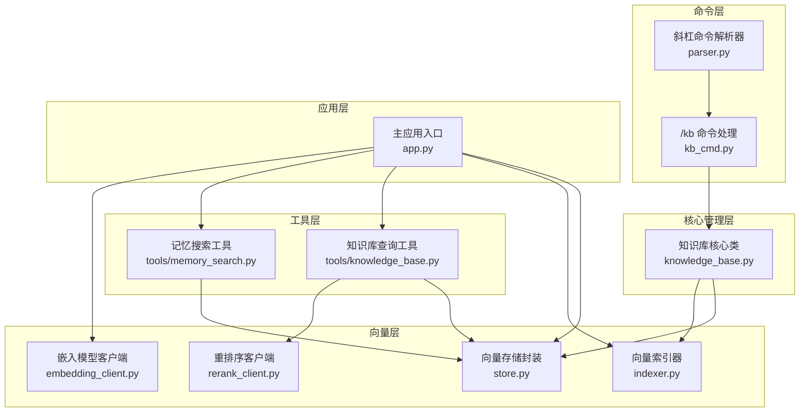
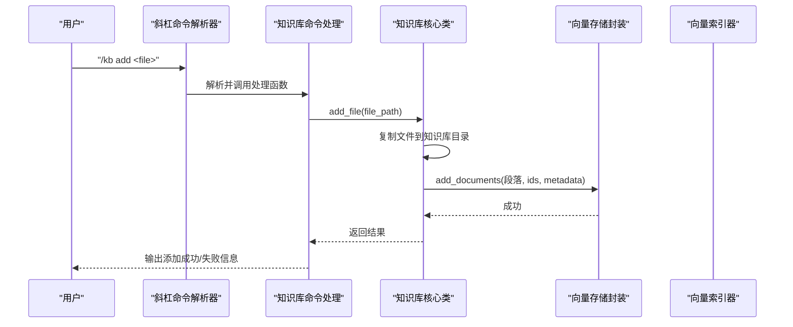
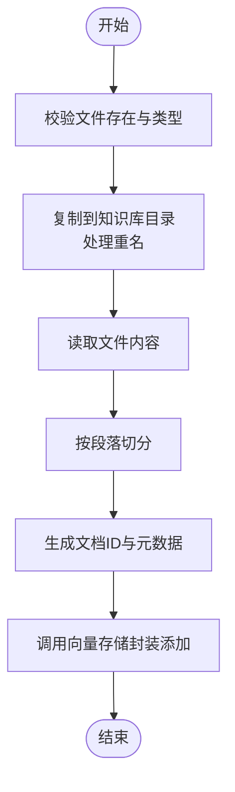
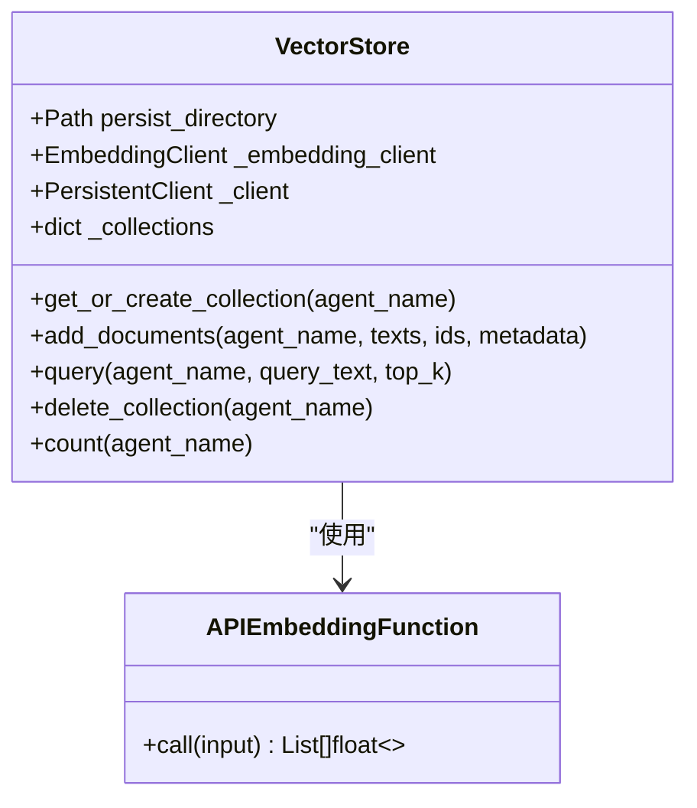
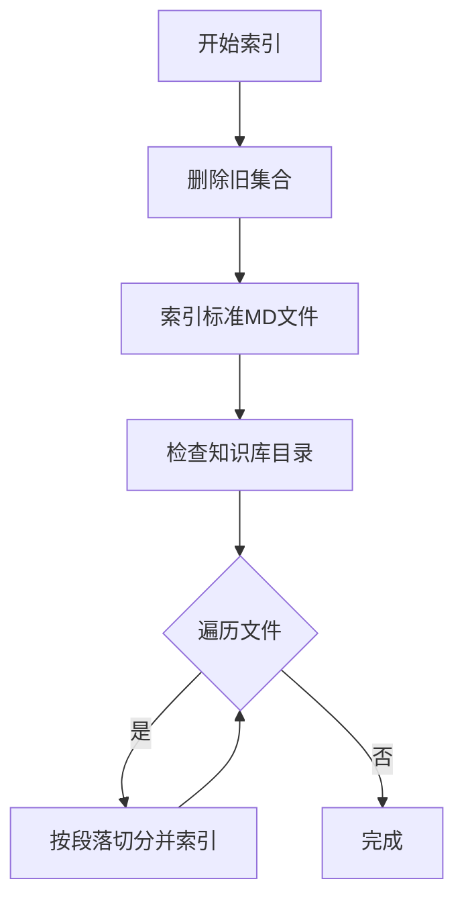
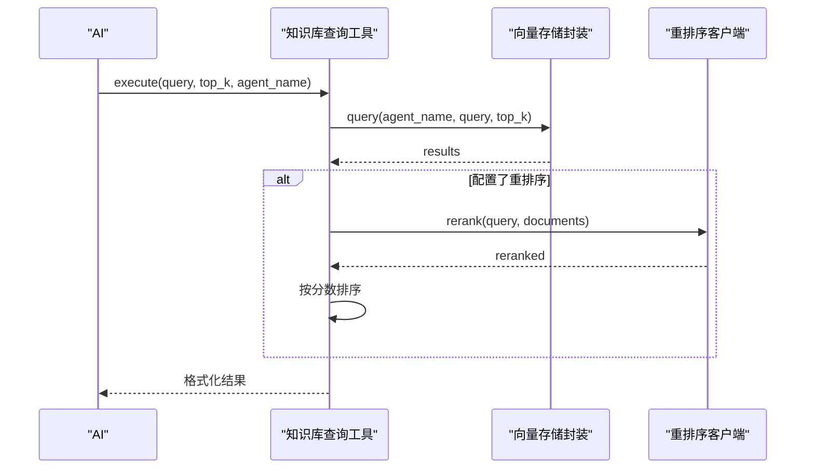
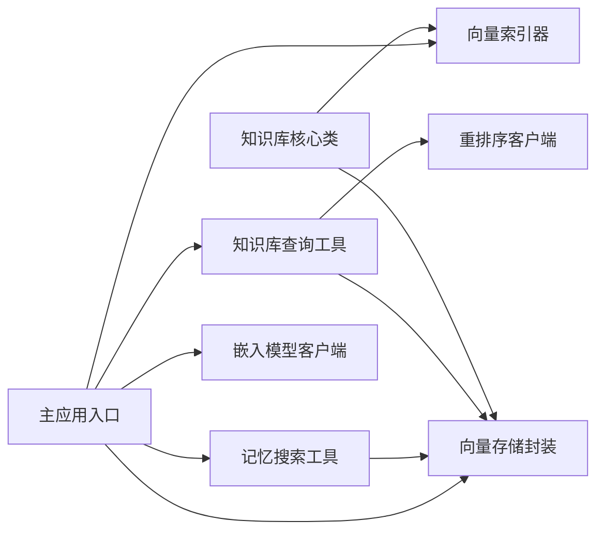

# 知识库系统

<cite>
**本文引用的文件**
- [知识库核心类](file://cbhcli_pkg/core/knowledge_base.py)
- [知识库查询工具](file://cbhcli_pkg/tools/knowledge_base.py)
- [向量索引器](file://cbhcli_pkg/vector/indexer.py)
- [向量存储封装](file://cbhcli_pkg/vector/store.py)
- [知识库命令处理](file://cbhcli_pkg/commands/kb_cmd.py)
- [主应用入口](file://cbhcli_pkg/core/app.py)
- [嵌入模型客户端](file://cbhcli_pkg/core/embedding_client.py)
- [重排序客户端](file://cbhcli_pkg/core/rerank_client.py)
- [记忆搜索工具](file://cbhcli_pkg/tools/memory_search.py)
- [斜杠命令解析器](file://cbhcli_pkg/commands/parser.py)
- [项目总览说明](file://README.md)
</cite>

## 目录
1. [简介](#简介)
2. [项目结构](#项目结构)
3. [核心组件](#核心组件)
4. [架构总览](#架构总览)
5. [详细组件分析](#详细组件分析)
6. [依赖关系分析](#依赖关系分析)
7. [性能考量](#性能考量)
8. [故障排除指南](#故障排除指南)
9. [结论](#结论)
10. [附录](#附录)

## 简介
本文件面向开发者与高级用户，系统性阐述 CBHCLI 知识库系统的设计与实现，涵盖 Agent 工作空间中的知识库概念、文件管理、索引与查询机制、状态监控与维护、与向量数据库的集成与数据同步、备份与恢复策略、性能调优与最佳实践，以及扩展与定制指导。知识库为每个 Agent 提供专属的“文档+代码+笔记”语义检索能力，结合嵌入模型与可选重排序服务，实现高效、准确的智能问答与检索。

## 项目结构
知识库系统围绕以下模块协同工作：
- 命令层：/kb 斜杠命令，负责用户交互与流程编排
- 核心管理层：知识库类，负责文件增删查改与索引调度
- 向量层：向量存储封装与索引器，负责向量化与持久化
- 工具层：知识库查询工具与记忆搜索工具，提供语义检索能力
- 应用层：主应用负责初始化嵌入模型、向量存储、索引器，并注册工具与命令

图表来源
- [知识库命令处理:1-186](file://cbhcli_pkg/commands/kb_cmd.py#L1-L186)
- [知识库核心类:1-207](file://cbhcli_pkg/core/knowledge_base.py#L1-L207)
- [向量存储封装:1-175](file://cbhcli_pkg/vector/store.py#L1-L175)
- [向量索引器:1-178](file://cbhcli_pkg/vector/indexer.py#L1-L178)
- [嵌入模型客户端:1-132](file://cbhcli_pkg/core/embedding_client.py#L1-L132)
- [重排序客户端:1-123](file://cbhcli_pkg/core/rerank_client.py#L1-L123)
- [知识库查询工具:1-157](file://cbhcli_pkg/tools/knowledge_base.py#L1-L157)
- [记忆搜索工具:1-177](file://cbhcli_pkg/tools/memory_search.py#L1-L177)
- [斜杠命令解析器:1-94](file://cbhcli_pkg/commands/parser.py#L1-L94)
- [主应用入口:1-478](file://cbhcli_pkg/core/app.py#L1-L478)

章节来源
- [项目总览说明:1-325](file://README.md#L1-L325)

## 核心组件
- 知识库核心类：负责 Agent 知识库目录管理、文件增删查、按段落切分与向量入库、批量重新索引
- 向量存储封装：封装 ChromaDB，统一嵌入向量计算与持久化接口
- 向量索引器：负责 Agent 工作空间内标准 MD 文件与知识库目录的索引
- 知识库查询工具：面向 AI 的工具接口，支持语义检索与可选重排序
- 记忆搜索工具：用于检索 Agent 的向量化知识内容（不含对话历史）
- 斜杠命令与主应用：提供 CLI 交互入口、初始化嵌入与向量组件、注册工具与命令

章节来源
- [知识库核心类:1-207](file://cbhcli_pkg/core/knowledge_base.py#L1-L207)
- [向量存储封装:1-175](file://cbhcli_pkg/vector/store.py#L1-L175)
- [向量索引器:1-178](file://cbhcli_pkg/vector/indexer.py#L1-L178)
- [知识库查询工具:1-157](file://cbhcli_pkg/tools/knowledge_base.py#L1-L157)
- [记忆搜索工具:1-177](file://cbhcli_pkg/tools/memory_search.py#L1-L177)
- [斜杠命令解析器:1-94](file://cbhcli_pkg/commands/parser.py#L1-L94)
- [主应用入口:1-478](file://cbhcli_pkg/core/app.py#L1-L478)

## 架构总览
知识库系统采用“命令-核心-向量-工具-应用”的分层架构：
- 命令层接收用户输入，路由到具体知识库操作
- 核心层协调文件管理与索引调度
- 向量层负责嵌入计算、向量存储与查询
- 工具层为 AI 提供语义检索能力
- 应用层负责组件初始化与生命周期管理

图表来源
- [斜杠命令解析器:1-94](file://cbhcli_pkg/commands/parser.py#L1-L94)
- [知识库命令处理:1-186](file://cbhcli_pkg/commands/kb_cmd.py#L1-L186)
- [知识库核心类:1-207](file://cbhcli_pkg/core/knowledge_base.py#L1-L207)
- [向量存储封装:1-175](file://cbhcli_pkg/vector/store.py#L1-L175)

## 详细组件分析

### 知识库核心类（KnowledgeBase）
职责与行为
- 管理 Agent 独立的知识库目录，支持文件复制、去重命名、删除
- 将文件内容按段落切分为可向量化单元，生成文档 ID 与元数据
- 调用向量存储封装将段落与元数据写入向量数据库
- 支持批量重新索引，统计索引段落数与文件数

支持的文件格式
- 文本类：.md、.txt、.py、.js、.json、.yaml、.yml
- 二进制文件跳过处理

索引流程要点
- 按段落切分，每个段落生成唯一文档 ID
- 元数据包含 Agent 名称、文件名、文件路径、段落索引、类型等
- 向量存储封装统一计算嵌入并持久化

图表来源
- [知识库核心类:151-207](file://cbhcli_pkg/core/knowledge_base.py#L151-L207)

章节来源
- [知识库核心类:1-207](file://cbhcli_pkg/core/knowledge_base.py#L1-L207)

### 向量存储封装（VectorStore）
职责与行为
- 封装 ChromaDB 客户端，支持持久化目录与自定义嵌入函数
- 统一添加文档接口，预先计算嵌入向量，避免默认模型调用
- 提供语义查询接口，返回文档、元数据与距离
- 提供集合删除与计数能力

嵌入与查询优化
- 在添加与查询时均预先计算嵌入，减少底层库的默认模型调用
- 使用自定义嵌入函数，确保与配置的嵌入模型一致

图表来源
- [向量存储封装:1-175](file://cbhcli_pkg/vector/store.py#L1-L175)

章节来源
- [向量存储封装:1-175](file://cbhcli_pkg/vector/store.py#L1-L175)

### 向量索引器（MemoryIndexer）
职责与行为
- 索引 Agent 工作空间的标准 MD 文件（skills.md、soul.md、tools.md、usage.md、memory.md）
- 索引知识库目录下的支持格式文件
- 支持删除旧集合、更新索引与添加单条记忆

索引范围
- 标准 MD 文件：skills.md、soul.md、tools.md、usage.md、memory.md
- 知识库目录：knowledge/ 下的 .md、.txt、.py、.js、.json、.yaml、.yml

图表来源
- [向量索引器:1-178](file://cbhcli_pkg/vector/indexer.py#L1-L178)

章节来源
- [向量索引器:1-178](file://cbhcli_pkg/vector/indexer.py#L1-L178)

### 知识库查询工具（KnowledgeBaseTool）
职责与行为
- 作为 AI 工具，提供语义查询接口
- 支持 top_k 结果控制与可选重排序
- 自动获取当前 Agent 名称，构造输出格式

查询流程
- 从向量存储查询，得到文档、元数据与距离
- 若配置重排序客户端且结果多于1条，则进行重排序
- 格式化输出，包含来源、相关度与文档内容

图表来源
- [知识库查询工具:1-157](file://cbhcli_pkg/tools/knowledge_base.py#L1-L157)
- [向量存储封装:1-175](file://cbhcli_pkg/vector/store.py#L1-L175)
- [重排序客户端:1-123](file://cbhcli_pkg/core/rerank_client.py#L1-L123)

章节来源
- [知识库查询工具:1-157](file://cbhcli_pkg/tools/knowledge_base.py#L1-L157)
- [重排序客户端:1-123](file://cbhcli_pkg/core/rerank_client.py#L1-L123)

### 记忆搜索工具（MemorySearchTool）
职责与行为
- 语义搜索 Agent 的向量化知识内容（不包括对话历史）
- 当向量存储不可用时，降级为 memory.md 的关键词匹配
- 支持 top_k 控制与结果格式化

章节来源
- [记忆搜索工具:1-177](file://cbhcli_pkg/tools/memory_search.py#L1-L177)

### 斜杠命令与主应用
- 斜杠命令解析器：统一解析 /kb 等命令，路由到处理函数
- 主应用：初始化嵌入模型、向量存储与索引器；注册知识库与记忆搜索工具；在需要时触发工作空间索引

章节来源
- [斜杠命令解析器:1-94](file://cbhcli_pkg/commands/parser.py#L1-L94)
- [主应用入口:1-478](file://cbhcli_pkg/core/app.py#L1-L478)

## 依赖关系分析
- 知识库核心类依赖向量存储封装与索引器，负责文件层面的索引与查询
- 知识库查询工具依赖向量存储封装与可选重排序客户端
- 主应用负责初始化嵌入模型客户端与向量存储封装，并在可用时注册工具
- 向量存储封装依赖嵌入模型客户端提供的嵌入函数

图表来源
- [知识库核心类:1-207](file://cbhcli_pkg/core/knowledge_base.py#L1-L207)
- [向量存储封装:1-175](file://cbhcli_pkg/vector/store.py#L1-L175)
- [向量索引器:1-178](file://cbhcli_pkg/vector/indexer.py#L1-L178)
- [知识库查询工具:1-157](file://cbhcli_pkg/tools/knowledge_base.py#L1-L157)
- [记忆搜索工具:1-177](file://cbhcli_pkg/tools/memory_search.py#L1-L177)
- [嵌入模型客户端:1-132](file://cbhcli_pkg/core/embedding_client.py#L1-L132)
- [重排序客户端:1-123](file://cbhcli_pkg/core/rerank_client.py#L1-L123)
- [主应用入口:1-478](file://cbhcli_pkg/core/app.py#L1-L478)

## 性能考量
- 嵌入计算优化
  - 在添加与查询阶段预先计算嵌入，避免底层库默认模型调用，减少网络往返与模型开销
  - 批量处理嵌入请求，提升吞吐
- 向量存储优化
  - 使用持久化客户端，避免重复初始化
  - 集合按 Agent 名称隔离，便于清理与重建
- 索引策略
  - 手动索引策略降低启动时的 API 调用与等待时间
  - 更新文件后触发重新索引，保证检索准确性
- 重排序优化
  - 仅在结果数量大于阈值时启用重排序，避免不必要的 API 调用
- 上下文压缩
  - 当接近模型上下文限制时自动压缩，减少后续检索负担

章节来源
- [向量存储封装:1-175](file://cbhcli_pkg/vector/store.py#L1-L175)
- [嵌入模型客户端:1-132](file://cbhcli_pkg/core/embedding_client.py#L1-L132)
- [主应用入口:1-478](file://cbhcli_pkg/core/app.py#L1-L478)

## 故障排除指南
常见问题与定位思路
- 向量数据库未启用
  - 现象：知识库查询工具报错提示未启用
  - 处理：配置嵌入模型并安装 ChromaDB，重启应用后注册工具
- 嵌入模型配置错误
  - 现象：初始化向量存储失败
  - 处理：检查配置项（名称、API Key、URL、模型ID、类型），确认网络可达
- 查询失败或无结果
  - 现象：查询返回空或错误
  - 处理：确认已索引工作空间；检查集合是否存在；验证查询文本长度与格式
- 重排序失败
  - 现象：重排序异常，回落到原始结果
  - 处理：检查重排序服务配置与网络；适当降低 top_n
- 文件添加失败
  - 现象：添加文件返回失败
  - 处理：确认文件存在且为文本格式；检查目标目录权限；查看日志输出

章节来源
- [知识库查询工具:1-157](file://cbhcli_pkg/tools/knowledge_base.py#L1-L157)
- [向量存储封装:1-175](file://cbhcli_pkg/vector/store.py#L1-L175)
- [嵌入模型客户端:1-132](file://cbhcli_pkg/core/embedding_client.py#L1-L132)
- [重排序客户端:1-123](file://cbhcli_pkg/core/rerank_client.py#L1-L123)
- [知识库核心类:1-207](file://cbhcli_pkg/core/knowledge_base.py#L1-L207)

## 结论
CBHCLI 知识库系统通过清晰的分层设计与可插拔的向量组件，为每个 Agent 提供了稳定、高效的语义检索能力。其手动索引策略兼顾性能与成本，结合嵌入与可选重排序，满足多样化的检索需求。配合完善的命令与工具体系，开发者与用户可以便捷地管理知识库、监控状态并进行性能优化与故障排查。

## 附录

### 知识库文件管理与查询流程
- 文件添加
  - 使用 /kb add <file> 添加文件到知识库目录
  - 系统复制文件并按段落切分，生成文档 ID 与元数据
  - 调用向量存储封装写入向量数据库
- 文件列表与删除
  - 使用 /kb list 查看知识库文件
  - 使用 /kb remove <file> 删除文件（建议随后重新索引）
- 批量添加
  - 通过循环调用 /kb add 或在知识库目录批量放置文件后执行 /kb reindex
- 重新索引
  - 使用 /kb reindex 对知识库目录下所有支持文件进行批量索引
  - 索引完成后统计段落数与文件数

章节来源
- [知识库命令处理:1-186](file://cbhcli_pkg/commands/kb_cmd.py#L1-L186)
- [知识库核心类:1-207](file://cbhcli_pkg/core/knowledge_base.py#L1-L207)

### 索引与重新索引机制
- 索引范围
  - 标准 MD 文件：skills.md、soul.md、tools.md、usage.md、memory.md
  - 知识库目录：knowledge/ 下的 .md、.txt、.py、.js、.json、.yaml、.yml
- 索引策略
  - 手动触发，避免启动时大量 API 调用
  - 更新内容后执行重新索引，确保检索准确性
- 数据同步
  - 向量存储按 Agent 集合隔离，删除旧集合后重建，保证一致性

章节来源
- [向量索引器:1-178](file://cbhcli_pkg/vector/indexer.py#L1-L178)
- [向量存储封装:1-175](file://cbhcli_pkg/vector/store.py#L1-L175)

### 查询功能与高级特性
- 语义搜索
  - 通过知识库查询工具与记忆搜索工具实现
  - 支持 top_k 控制与可选重排序
- 结果过滤
  - 可根据元数据字段（如文件名、类型）进行过滤与展示
- 输出格式
  - 包含来源、相关度与文档内容，便于 AI 选择性引用

章节来源
- [知识库查询工具:1-157](file://cbhcli_pkg/tools/knowledge_base.py#L1-L157)
- [记忆搜索工具:1-177](file://cbhcli_pkg/tools/memory_search.py#L1-L177)

### 与向量数据库的集成与数据同步
- 集成方式
  - 使用 ChromaDB 持久化客户端，按 Agent 名称创建集合
  - 通过自定义嵌入函数确保与配置的嵌入模型一致
- 数据同步
  - 删除旧集合后重建，确保内容变更后的数据一致性
  - 集合按 Agent 隔离，便于独立管理与清理

章节来源
- [向量存储封装:1-175](file://cbhcli_pkg/vector/store.py#L1-L175)
- [向量索引器:1-178](file://cbhcli_pkg/vector/indexer.py#L1-L178)

### 状态监控与维护
- 状态查看
  - 使用 /kb status 查看 Agent 名称、知识库目录、文件数、向量文档数、索引器状态
- 维护操作
  - 清理集合：删除集合后重建
  - 重新索引：更新内容后触发
  - 降级搜索：当向量存储不可用时，使用 memory.md 进行关键词匹配

章节来源
- [知识库命令处理:1-186](file://cbhcli_pkg/commands/kb_cmd.py#L1-L186)
- [记忆搜索工具:1-177](file://cbhcli_pkg/tools/memory_search.py#L1-L177)

### 备份与恢复策略
- 备份
  - 知识库目录：直接备份 ~/.cbhcli/agents/<agent_name>/knowledge/
  - 向量数据库：备份持久化目录 ~/.cbhcli/vectors/
- 恢复
  - 恢复知识库目录与向量数据库目录后，重新索引工作空间
  - 如需快速恢复，可先使用记忆搜索工具进行降级检索

章节来源
- [项目总览说明:192-230](file://README.md#L192-L230)

### 性能调优与最佳实践
- 嵌入模型
  - 选择合适的嵌入模型与批大小，平衡精度与速度
- 重排序
  - 仅在必要时启用重排序，合理设置 top_n
- 索引频率
  - 采用手动索引策略，文件更新后再重新索引
- 存储与网络
  - 确保嵌入与重排序服务网络稳定，超时与重试策略合理

章节来源
- [嵌入模型客户端:1-132](file://cbhcli_pkg/core/embedding_client.py#L1-L132)
- [重排序客户端:1-123](file://cbhcli_pkg/core/rerank_client.py#L1-L123)
- [向量存储封装:1-175](file://cbhcli_pkg/vector/store.py#L1-L175)

### 扩展与定制指导
- 新增支持的文件格式
  - 在知识库核心类与索引器中扩展支持的后缀列表
- 自定义嵌入模型
  - 通过嵌入模型客户端扩展新的 API 格式
- 自定义重排序模型
  - 通过重排序客户端扩展新的 API 格式
- 工具扩展
  - 基于工具基类实现新的检索工具，注册到工具注册表

章节来源
- [知识库核心类:1-207](file://cbhcli_pkg/core/knowledge_base.py#L1-L207)
- [向量索引器:1-178](file://cbhcli_pkg/vector/indexer.py#L1-L178)
- [嵌入模型客户端:1-132](file://cbhcli_pkg/core/embedding_client.py#L1-L132)
- [重排序客户端:1-123](file://cbhcli_pkg/core/rerank_client.py#L1-L123)
- [主应用入口:1-478](file://cbhcli_pkg/core/app.py#L1-L478)