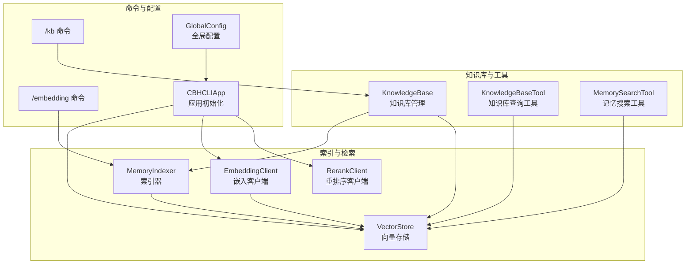
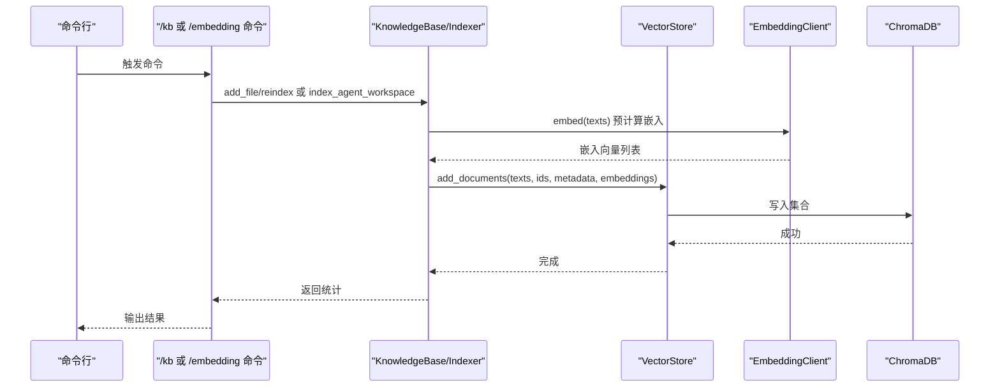
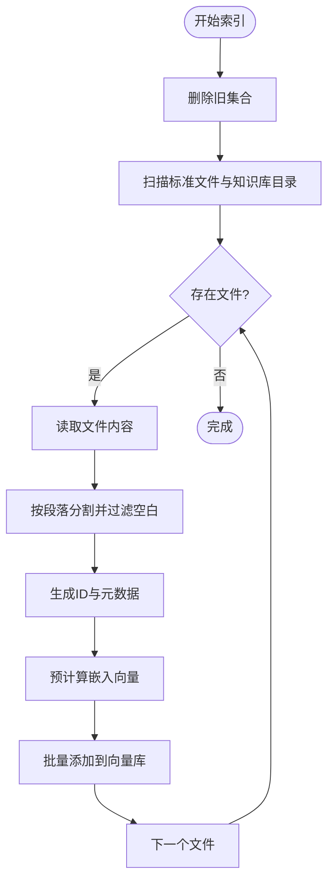
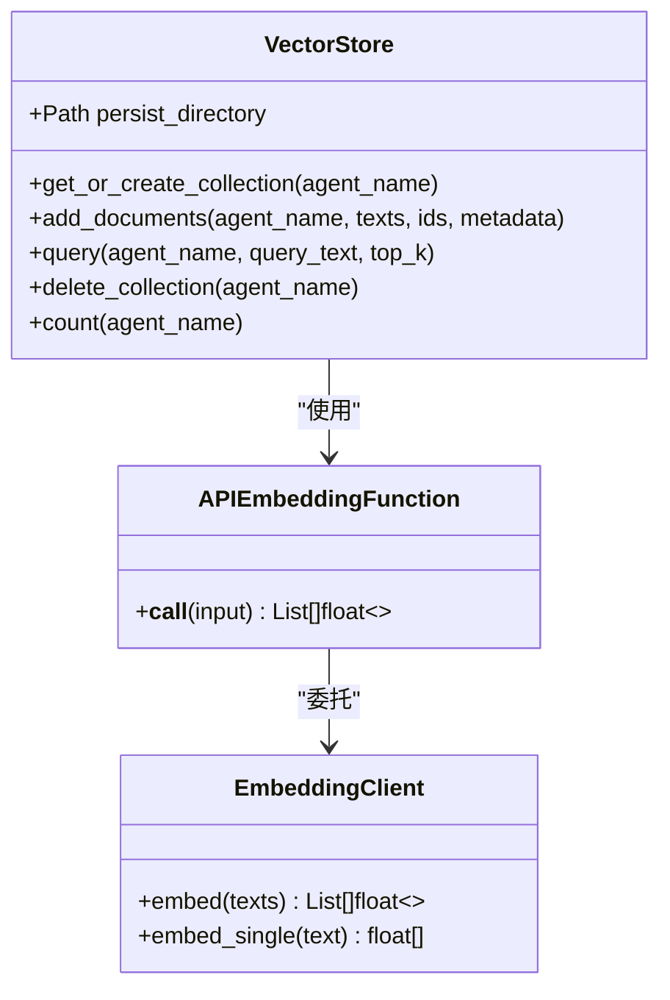
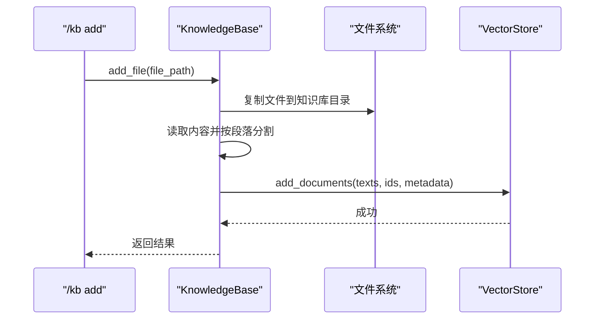
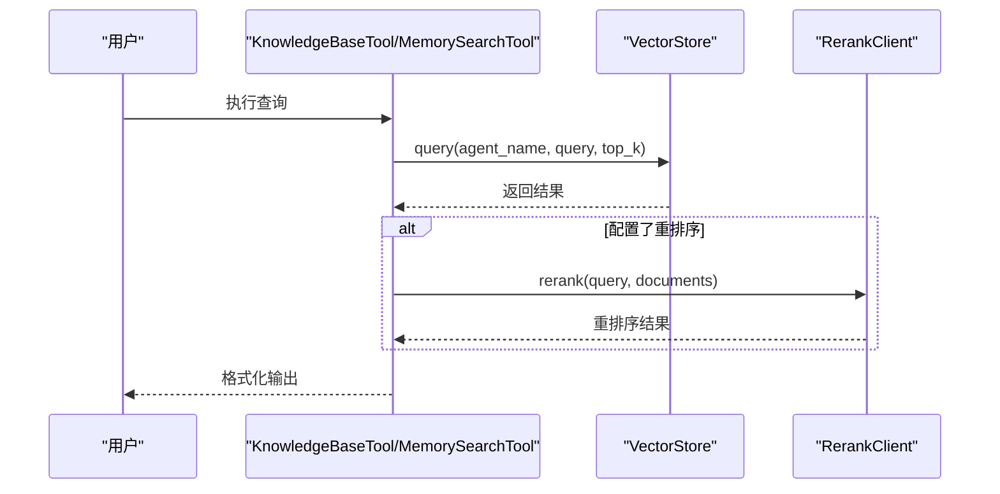
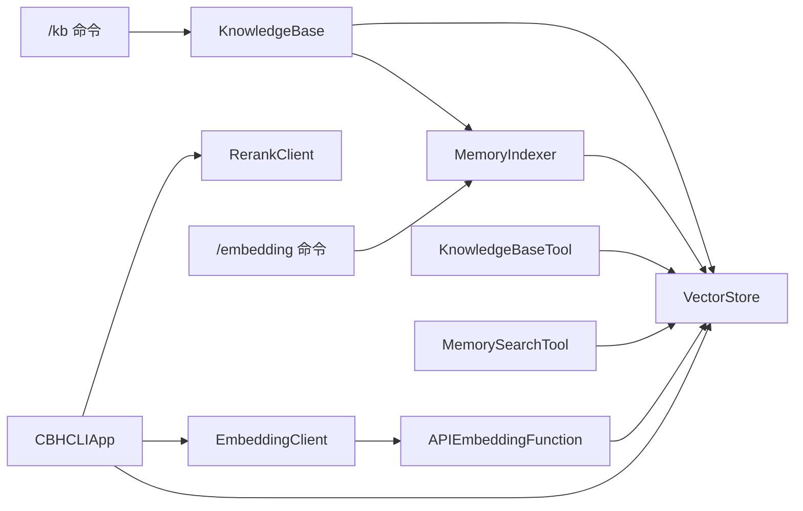

# 索引机制

<cite>
**本文引用的文件**
- [indexer.py](file://cbhcli_pkg/vector/indexer.py)
- [store.py](file://cbhcli_pkg/vector/store.py)
- [knowledge_base.py](file://cbhcli_pkg/core/knowledge_base.py)
- [knowledge_base_tool.py](file://cbhcli_pkg/tools/knowledge_base.py)
- [kb_cmd.py](file://cbhcli_pkg/commands/kb_cmd.py)
- [embedding_cmd.py](file://cbhcli_pkg/commands/embedding_cmd.py)
- [memory_search_tool.py](file://cbhcli_pkg/tools/memory_search.py)
- [embedding_client.py](file://cbhcli_pkg/core/embedding_client.py)
- [rerank_client.py](file://cbhcli_pkg/core/rerank_client.py)
- [global_config.py](file://cbhcli_pkg/config/global_config.py)
- [app.py](file://cbhcli_pkg/core/app.py)
</cite>

## 目录
1. [简介](#简介)
2. [项目结构](#项目结构)
3. [核心组件](#核心组件)
4. [架构总览](#架构总览)
5. [详细组件分析](#详细组件分析)
6. [依赖关系分析](#依赖关系分析)
7. [性能考量](#性能考量)
8. [故障排查指南](#故障排查指南)
9. [结论](#结论)
10. [附录](#附录)

## 简介
本文件面向开发者与运维人员，系统性阐述 CBHCLI 知识库索引机制的技术细节，涵盖：
- 知识库文件的索引流程：文本分割、向量化与存储
- 索引器工作机制：分段策略、嵌入模型使用、向量存储
- 增量与全量更新：删除旧集合、重新索引
- 性能优化：批处理、预计算嵌入、并发与缓存策略建议
- 状态监控与维护：命令与接口
- 错误处理与恢复：异常捕获、降级策略
- 与向量数据库的集成：ChromaDB 封装与自定义嵌入函数
- 扩展与定制：新增文件类型、分段策略、嵌入模型

## 项目结构
围绕“索引”主题，相关模块分布如下：
- 向量存储与嵌入：vector/store.py、core/embedding_client.py
- 索引器：vector/indexer.py
- 知识库管理：core/knowledge_base.py
- 查询工具：tools/knowledge_base.py、tools/memory_search.py
- 命令入口：commands/kb_cmd.py、commands/embedding_cmd.py
- 全局配置：config/global_config.py
- 应用初始化：core/app.py

图表来源
- [indexer.py:7-178](file://cbhcli_pkg/vector/indexer.py#L7-L178)
- [store.py:37-175](file://cbhcli_pkg/vector/store.py#L37-L175)
- [knowledge_base.py:7-207](file://cbhcli_pkg/core/knowledge_base.py#L7-L207)
- [knowledge_base_tool.py:6-157](file://cbhcli_pkg/tools/knowledge_base.py#L6-L157)
- [memory_search_tool.py:6-177](file://cbhcli_pkg/tools/memory_search.py#L6-L177)
- [kb_cmd.py:5-186](file://cbhcli_pkg/commands/kb_cmd.py#L5-L186)
- [embedding_cmd.py:5-122](file://cbhcli_pkg/commands/embedding_cmd.py#L5-L122)
- [global_config.py:13-154](file://cbhcli_pkg/config/global_config.py#L13-L154)
- [app.py:54-150](file://cbhcli_pkg/core/app.py#L54-L150)

章节来源
- [indexer.py:1-178](file://cbhcli_pkg/vector/indexer.py#L1-L178)
- [store.py:1-175](file://cbhcli_pkg/vector/store.py#L1-L175)
- [knowledge_base.py:1-207](file://cbhcli_pkg/core/knowledge_base.py#L1-L207)
- [knowledge_base_tool.py:1-157](file://cbhcli_pkg/tools/knowledge_base.py#L1-L157)
- [memory_search_tool.py:1-177](file://cbhcli_pkg/tools/memory_search.py#L1-L177)
- [kb_cmd.py:1-186](file://cbhcli_pkg/commands/kb_cmd.py#L1-L186)
- [embedding_cmd.py:1-122](file://cbhcli_pkg/commands/embedding_cmd.py#L1-L122)
- [global_config.py:1-154](file://cbhcli_pkg/config/global_config.py#L1-L154)
- [app.py:1-478](file://cbhcli_pkg/core/app.py#L1-L478)

## 核心组件
- MemoryIndexer：负责将 Agent 工作空间内的标准 Markdown 与知识库目录文件进行分段、生成 ID、元数据，并写入向量数据库。
- VectorStore：ChromaDB 封装，提供集合管理、文档批量添加、查询、计数与删除；通过自定义嵌入函数使用外部嵌入模型。
- KnowledgeBase：知识库目录管理与索引，支持添加/删除/列出文件，以及全量重建索引。
- KnowledgeBaseTool/MemorySearchTool：对外提供查询能力，支持重排序与降级搜索。
- 命令层：/kb 与 /embedding 命令，驱动知识库与索引器。
- 配置与应用：GlobalConfig 提供嵌入/重排序模型配置；App 初始化嵌入、向量存储与工具。

章节来源
- [indexer.py:7-178](file://cbhcli_pkg/vector/indexer.py#L7-L178)
- [store.py:37-175](file://cbhcli_pkg/vector/store.py#L37-L175)
- [knowledge_base.py:7-207](file://cbhcli_pkg/core/knowledge_base.py#L7-L207)
- [knowledge_base_tool.py:6-157](file://cbhcli_pkg/tools/knowledge_base.py#L6-L157)
- [memory_search_tool.py:6-177](file://cbhcli_pkg/tools/memory_search.py#L6-L177)
- [kb_cmd.py:5-186](file://cbhcli_pkg/commands/kb_cmd.py#L5-L186)
- [embedding_cmd.py:5-122](file://cbhcli_pkg/commands/embedding_cmd.py#L5-L122)
- [global_config.py:13-154](file://cbhcli_pkg/config/global_config.py#L13-L154)
- [app.py:54-150](file://cbhcli_pkg/core/app.py#L54-L150)

## 架构总览
索引与检索的关键流程：
- 索引阶段：MemoryIndexer 读取文件内容，按段落切分，生成唯一 ID 与元数据，调用 VectorStore 批量添加文档。
- 存储阶段：VectorStore 使用自定义嵌入函数，预先计算嵌入向量，再写入 ChromaDB 集合。
- 查询阶段：KnowledgeBaseTool/MemorySearchTool 调用 VectorStore 查询，必要时使用 RerankClient 重排序。
- 命令驱动：/kb 与 /embedding 命令分别控制知识库文件管理与工作空间索引。

图表来源
- [kb_cmd.py:57-144](file://cbhcli_pkg/commands/kb_cmd.py#L57-L144)
- [embedding_cmd.py:42-121](file://cbhcli_pkg/commands/embedding_cmd.py#L42-L121)
- [knowledge_base.py:151-206](file://cbhcli_pkg/core/knowledge_base.py#L151-L206)
- [indexer.py:87-134](file://cbhcli_pkg/vector/indexer.py#L87-L134)
- [store.py:99-126](file://cbhcli_pkg/vector/store.py#L99-L126)
- [embedding_client.py:34-90](file://cbhcli_pkg/core/embedding_client.py#L34-L90)

## 详细组件分析

### MemoryIndexer（索引器）
职责与流程
- 删除旧集合：为保证内容变更后 ID 不变导致的重复问题，索引前先删除对应集合。
- 标准文件索引：遍历 Agent 工作空间的标准文件（如 memory.md、skills.md 等），逐个索引。
- 知识库目录索引：扫描 knowledge 目录，支持多种文本格式，逐个索引。
- 单文件索引：按段落分割，过滤空段，生成 ID 与元数据，调用 VectorStore 批量添加。
- 增量更新：提供 update_index 方法，删除旧集合后重新索引。

分段策略
- 按双换行符分割段落，去除空白，保证最小语义单元。
- ID 采用 agent_name + 文件名 + 段落序号，确保可追溯与去重基础。

向量写入
- 调用 VectorStore.add_documents，内部预先计算嵌入向量，再写入集合。

图表来源
- [indexer.py:37-134](file://cbhcli_pkg/vector/indexer.py#L37-L134)

章节来源
- [indexer.py:7-178](file://cbhcli_pkg/vector/indexer.py#L7-L178)

### VectorStore（向量存储）
职责与特性
- 集合管理：按 Agent 名称创建/获取集合，集合名使用 agent_{name}。
- 自定义嵌入函数：通过 APIEmbeddingFunction 包装 EmbeddingClient，确保统一嵌入来源。
- 批量添加：预先计算嵌入向量，避免 ChromaDB 默认模型调用。
- 查询：预计算查询向量，返回文档、元数据与距离。
- 删除集合与计数：支持清理与状态查询。

图表来源
- [store.py:37-175](file://cbhcli_pkg/vector/store.py#L37-L175)
- [embedding_client.py:6-132](file://cbhcli_pkg/core/embedding_client.py#L6-L132)

章节来源
- [store.py:37-175](file://cbhcli_pkg/vector/store.py#L37-L175)
- [embedding_client.py:6-132](file://cbhcli_pkg/core/embedding_client.py#L6-L132)

### KnowledgeBase（知识库管理）
职责与流程
- 添加文件：复制到知识库目录，随后调用内部索引逻辑。
- 删除文件：当前实现为“简化处理”，建议后续按文档 ID 删除。
- 列出文件：遍历知识库目录，返回文件信息。
- 全量重建：遍历知识库目录，逐个文件索引，统计段落数。

索引细节
- 读取文件内容（支持多种文本格式），按段落分割，生成 ID 与元数据，调用 VectorStore.add_documents。

图表来源
- [kb_cmd.py:57-76](file://cbhcli_pkg/commands/kb_cmd.py#L57-L76)
- [knowledge_base.py:31-73](file://cbhcli_pkg/core/knowledge_base.py#L31-L73)
- [knowledge_base.py:151-206](file://cbhcli_pkg/core/knowledge_base.py#L151-L206)

章节来源
- [knowledge_base.py:7-207](file://cbhcli_pkg/core/knowledge_base.py#L7-L207)
- [kb_cmd.py:5-186](file://cbhcli_pkg/commands/kb_cmd.py#L5-L186)

### 查询工具与命令
- KnowledgeBaseTool：执行查询，支持重排序（若配置了重排序模型），格式化输出。
- MemorySearchTool：优先使用向量查询，失败或未启用时降级到 memory.md 的关键词匹配。
- /kb 命令：添加/列出/删除/重建知识库文件。
- /embedding 命令：索引工作空间、查看状态、清除索引、重新索引。

图表来源
- [knowledge_base_tool.py:49-121](file://cbhcli_pkg/tools/knowledge_base.py#L49-L121)
- [memory_search_tool.py:47-103](file://cbhcli_pkg/tools/memory_search.py#L47-L103)
- [store.py:128-160](file://cbhcli_pkg/vector/store.py#L128-L160)
- [rerank_client.py:35-90](file://cbhcli_pkg/core/rerank_client.py#L35-L90)

章节来源
- [knowledge_base_tool.py:1-157](file://cbhcli_pkg/tools/knowledge_base.py#L1-L157)
- [memory_search_tool.py:1-177](file://cbhcli_pkg/tools/memory_search.py#L1-L177)
- [kb_cmd.py:1-186](file://cbhcli_pkg/commands/kb_cmd.py#L1-L186)
- [embedding_cmd.py:1-122](file://cbhcli_pkg/commands/embedding_cmd.py#L1-L122)

## 依赖关系分析
- MemoryIndexer 依赖 VectorStore 进行文档写入。
- KnowledgeBase 依赖 VectorStore 与 MemoryIndexer（知识库文件索引）。
- VectorStore 依赖 EmbeddingClient，通过 APIEmbeddingFunction 包装。
- KnowledgeBaseTool/MemorySearchTool 依赖 VectorStore；可选依赖 RerankClient。
- 命令层（/kb、/embedding）依赖 KnowledgeBase 与 MemoryIndexer。
- 应用初始化（CBHCLIApp）根据配置决定是否启用嵌入、向量存储与工具。

图表来源
- [indexer.py:4-35](file://cbhcli_pkg/vector/indexer.py#L4-L35)
- [store.py:12-60](file://cbhcli_pkg/vector/store.py#L12-L60)
- [knowledge_base.py:16-27](file://cbhcli_pkg/core/knowledge_base.py#L16-L27)
- [knowledge_base_tool.py:9-22](file://cbhcli_pkg/tools/knowledge_base.py#L9-L22)
- [memory_search_tool.py:9-20](file://cbhcli_pkg/tools/memory_search.py#L9-L20)
- [kb_cmd.py:57-137](file://cbhcli_pkg/commands/kb_cmd.py#L57-L137)
- [embedding_cmd.py:42-121](file://cbhcli_pkg/commands/embedding_cmd.py#L42-L121)
- [app.py:104-145](file://cbhcli_pkg/core/app.py#L104-L145)

章节来源
- [app.py:54-150](file://cbhcli_pkg/core/app.py#L54-L150)

## 性能考量
- 批处理嵌入：EmbeddingClient 在 embed 中按批次处理，减少 API 调用次数与超时风险。
- 预计算嵌入：VectorStore.add_documents 与 query 前均预先计算嵌入，避免 ChromaDB 默认模型调用，提升一致性与性能。
- 并发与缓存建议（扩展点）：
  - 批量写入：可考虑多线程/进程池对大文件分块并行嵌入，再合并写入。
  - 缓存策略：对常用查询向量与嵌入结果进行本地缓存（需注意版本与一致性）。
  - 分片索引：对超大知识库按目录或文件大小分片，支持增量索引。
- I/O 与磁盘：知识库目录与向量持久化目录位于用户家目录，注意磁盘空间与权限。

章节来源
- [embedding_client.py:49-113](file://cbhcli_pkg/core/embedding_client.py#L49-L113)
- [store.py:118-143](file://cbhcli_pkg/vector/store.py#L118-L143)

## 故障排查指南
常见问题与处理
- 向量数据库未启用
  - 现象：/kb add 或 /embedding index 报错或提示未启用。
  - 处理：先配置嵌入模型（/model embedding add），再初始化应用。
- 嵌入模型初始化失败
  - 现象：应用启动时提示嵌入模型初始化失败。
  - 处理：检查配置项（URL、API Key、模型名），确认网络连通性。
- ChromaDB 未安装
  - 现象：导入 ChromaDB 失败。
  - 处理：安装 chromadb（pip install chromadb）。
- 查询无结果
  - 现象：知识库查询或记忆搜索返回空。
  - 处理：确认已添加文件到知识库或执行 /embedding index；检查向量数量。
- 重排序失败降级
  - 现象：配置了重排序但失败。
  - 处理：工具会回退到原始结果，不影响查询流程。

章节来源
- [app.py:104-149](file://cbhcli_pkg/core/app.py#L104-L149)
- [store.py:64-77](file://cbhcli_pkg/vector/store.py#L64-L77)
- [knowledge_base_tool.py:72-78](file://cbhcli_pkg/tools/knowledge_base.py#L72-L78)
- [memory_search_tool.py:70-73](file://cbhcli_pkg/tools/memory_search.py#L70-L73)
- [kb_cmd.py:147-185](file://cbhcli_pkg/commands/kb_cmd.py#L147-L185)
- [embedding_cmd.py:72-91](file://cbhcli_pkg/commands/embedding_cmd.py#L72-L91)

## 结论
CBHCLI 的索引机制以 MemoryIndexer 为核心，结合 VectorStore 与 EmbeddingClient，实现了从文件到向量的完整流水线。通过分段策略、预计算嵌入与集合管理，系统在准确性与性能之间取得平衡。命令层提供了完善的增删改查与状态维护能力，配合全局配置与应用初始化，形成可扩展、可维护的知识库索引体系。未来可在批处理、缓存与分片方面进一步优化，并完善知识库文件删除的精确删除能力。

## 附录

### 增量更新与全量重建
- 增量更新：MemoryIndexer.update_index 会删除旧集合并重新索引目标文件，适合内容频繁变更场景。
- 全量重建：KnowledgeBase.reindex_all 遍历知识库目录，逐个文件重新索引，适合大规模迁移或修复索引。

章节来源
- [indexer.py:162-177](file://cbhcli_pkg/vector/indexer.py#L162-L177)
- [knowledge_base.py:124-149](file://cbhcli_pkg/core/knowledge_base.py#L124-L149)

### 索引状态监控与维护
- 状态查看：/kb status 显示 Agent、知识库目录、文件数、向量文档数与索引器状态。
- 维护命令：/kb reindex 一键重建知识库索引；/embedding clear 清除当前 Agent 的索引；/embedding reindex 先清除再索引。

章节来源
- [kb_cmd.py:147-185](file://cbhcli_pkg/commands/kb_cmd.py#L147-L185)
- [embedding_cmd.py:94-121](file://cbhcli_pkg/commands/embedding_cmd.py#L94-L121)

### 与向量数据库的集成
- ChromaDB 封装：VectorStore 使用 PersistentClient，集合命名规范为 agent_{name}。
- 自定义嵌入：通过 APIEmbeddingFunction 与 EmbeddingClient 统一嵌入来源，避免默认模型差异。
- 查询与计数：支持按 agent_name 查询与统计文档数量，便于运维与监控。

章节来源
- [store.py:64-97](file://cbhcli_pkg/vector/store.py#L64-L97)
- [store.py:128-175](file://cbhcli_pkg/vector/store.py#L128-L175)

### 开发者扩展与定制
- 新增文件类型：在 KnowledgeBase 与 MemoryIndexer 的文件筛选处增加后缀判断，确保可读取。
- 自定义分段策略：调整段落分割逻辑（如正则、句子边界），并在 ID 与元数据中保留上下文信息。
- 嵌入模型替换：实现新的 EmbeddingClient 或包装现有 API，保持 embed/embed_single 接口一致。
- 重排序模型：配置 RerankClient，或在 KnowledgeBaseTool 中扩展重排序逻辑。
- 精确删除：在知识库删除文件时，按文档 ID 删除向量库记录，避免全量重建。

章节来源
- [knowledge_base.py:166-170](file://cbhcli_pkg/core/knowledge_base.py#L166-L170)
- [indexer.py:64-67](file://cbhcli_pkg/vector/indexer.py#L64-L67)
- [embedding_client.py:15-32](file://cbhcli_pkg/core/embedding_client.py#L15-L32)
- [rerank_client.py:16-33](file://cbhcli_pkg/core/rerank_client.py#L16-L33)