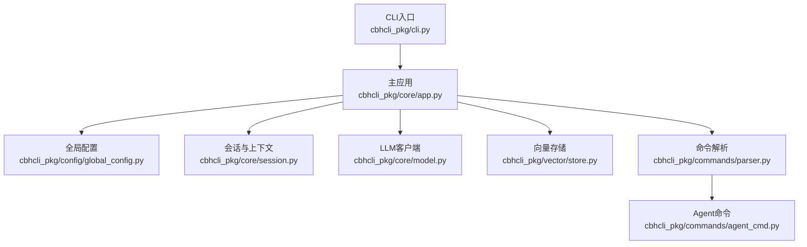
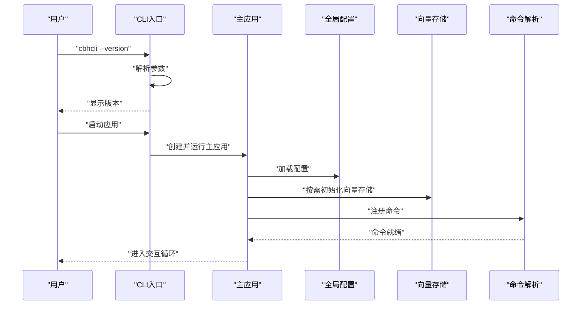
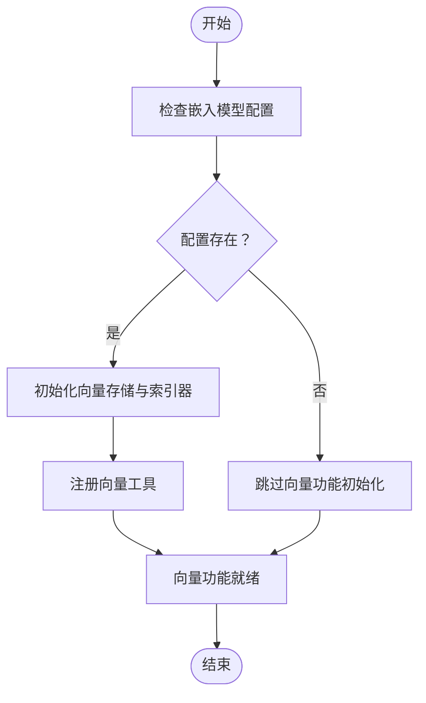
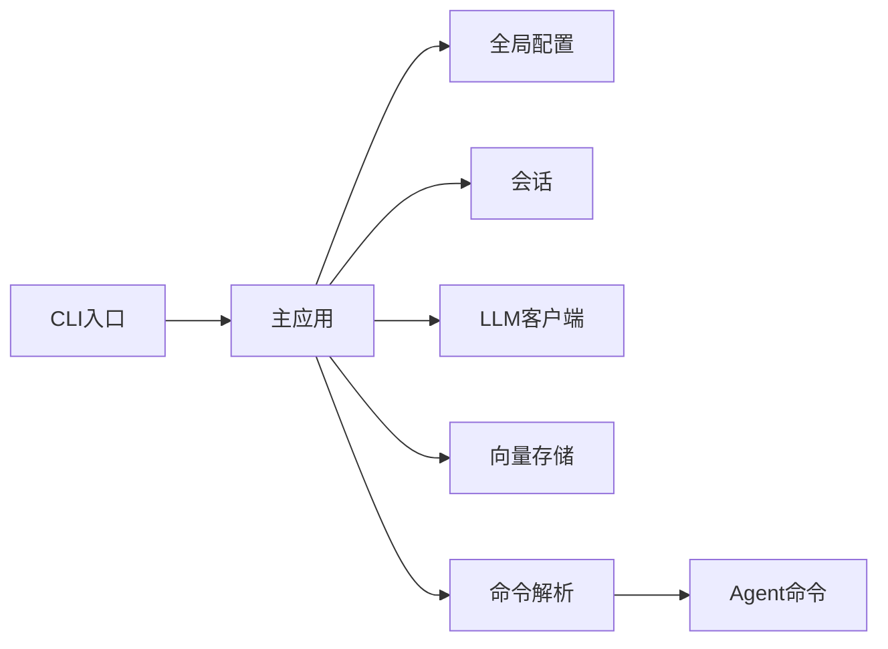

# 升级与迁移

<cite>
**本文引用的文件**
- [README.md](file://README.md)
- [INSTALL.md](file://INSTALL.md)
- [NEW_FEATURES.md](file://NEW_FEATURES.md)
- [requirements.txt](file://requirements.txt)
- [pyproject.toml](file://pyproject.toml)
- [cbhcli_pkg/config/global_config.py](file://cbhcli_pkg/config/global_config.py)
- [cbhcli_pkg/cli.py](file://cbhcli_pkg/cli.py)
- [cbhcli_pkg/core/app.py](file://cbhcli_pkg/core/app.py)
- [cbhcli_pkg/core/model.py](file://cbhcli_pkg/core/model.py)
- [cbhcli_pkg/core/session.py](file://cbhcli_pkg/core/session.py)
- [cbhcli_pkg/vector/store.py](file://cbhcli_pkg/vector/store.py)
- [cbhcli_pkg/commands/parser.py](file://cbhcli_pkg/commands/parser.py)
- [cbhcli_pkg/commands/agent_cmd.py](file://cbhcli_pkg/commands/agent_cmd.py)
</cite>

## 目录
1. [简介](#简介)
2. [项目结构](#项目结构)
3. [核心组件](#核心组件)
4. [架构总览](#架构总览)
5. [详细组件分析](#详细组件分析)
6. [依赖关系分析](#依赖关系分析)
7. [性能考量](#性能考量)
8. [故障排查指南](#故障排查指南)
9. [结论](#结论)
10. [附录](#附录)

## 简介
本指南面向CBHCLI v3.0的升级与迁移，涵盖版本升级流程、依赖更新与兼容性验证、升级前准备（数据备份、配置检查、风险评估）、升级注意事项（停机时间规划、服务切换、回滚准备）、不同升级场景（小版本、大版本、重大功能变更）的处理方法、配置迁移策略（配置文件格式变更、新增与废弃项处理）、数据迁移方案（数据库结构变更、数据格式转换、向后兼容性保证），以及升级后的验证与测试方法，确保系统稳定运行与功能完整。

## 项目结构
CBHCLI采用分层模块化设计，核心模块包括：
- CLI入口与参数解析
- 应用主控制器
- 配置管理
- 会话与上下文管理
- LLM客户端与工具执行
- 向量存储与索引
- 命令解析与路由

**图表来源**
- [cbhcli_pkg/cli.py:73-112](file://cbhcli_pkg/cli.py#L73-L112)
- [cbhcli_pkg/core/app.py:54-72](file://cbhcli_pkg/core/app.py#L54-L72)
- [cbhcli_pkg/config/global_config.py:13-18](file://cbhcli_pkg/config/global_config.py#L13-L18)
- [cbhcli_pkg/core/session.py:37-53](file://cbhcli_pkg/core/session.py#L37-L53)
- [cbhcli_pkg/core/model.py:7-27](file://cbhcli_pkg/core/model.py#L7-L27)
- [cbhcli_pkg/vector/store.py:37-62](file://cbhcli_pkg/vector/store.py#L37-L62)
- [cbhcli_pkg/commands/parser.py:16-25](file://cbhcli_pkg/commands/parser.py#L16-L25)
- [cbhcli_pkg/commands/agent_cmd.py:5-47](file://cbhcli_pkg/commands/agent_cmd.py#L5-L47)

**章节来源**
- [README.md:269-295](file://README.md#L269-L295)
- [pyproject.toml:52-53](file://pyproject.toml#L52-L53)

## 核心组件
- CLI入口负责解析参数与版本/帮助输出，并启动主应用。
- 主应用负责配置加载、工具系统初始化、向量存储可选初始化、命令注册与UI绑定、Agent加载与会话管理。
- 全局配置管理负责用户配置文件的读取、默认值生成、模型/嵌入/重排序配置、Agent与设置管理。
- 会话与上下文管理负责消息结构、上下文窗口与自动压缩。
- LLM客户端负责统一的API调用封装（非流式与流式）。
- 向量存储封装ChromaDB，支持自定义嵌入模型API。
- 命令解析器负责斜杠命令的注册、解析与执行；Agent命令模块负责Agent生命周期管理。

**章节来源**
- [cbhcli_pkg/cli.py:73-112](file://cbhcli_pkg/cli.py#L73-L112)
- [cbhcli_pkg/core/app.py:54-150](file://cbhcli_pkg/core/app.py#L54-L150)
- [cbhcli_pkg/config/global_config.py:13-154](file://cbhcli_pkg/config/global_config.py#L13-L154)
- [cbhcli_pkg/core/session.py:37-190](file://cbhcli_pkg/core/session.py#L37-L190)
- [cbhcli_pkg/core/model.py:7-147](file://cbhcli_pkg/core/model.py#L7-L147)
- [cbhcli_pkg/vector/store.py:37-175](file://cbhcli_pkg/vector/store.py#L37-L175)
- [cbhcli_pkg/commands/parser.py:16-94](file://cbhcli_pkg/commands/parser.py#L16-L94)
- [cbhcli_pkg/commands/agent_cmd.py:5-181](file://cbhcli_pkg/commands/agent_cmd.py#L5-L181)

## 架构总览
CBHCLI的升级与迁移涉及以下关键路径：
- 版本与依赖：通过包元数据与构建系统声明版本与依赖。
- 配置迁移：全局配置文件与Agent工作空间配置的兼容性。
- 数据迁移：向量数据库集合命名与持久化目录结构。
- 命令与功能：命令注册与执行链路的稳定性。

**图表来源**
- [cbhcli_pkg/cli.py:81-106](file://cbhcli_pkg/cli.py#L81-L106)
- [cbhcli_pkg/core/app.py:73-161](file://cbhcli_pkg/core/app.py#L73-L161)
- [cbhcli_pkg/config/global_config.py:20-48](file://cbhcli_pkg/config/global_config.py#L20-L48)
- [cbhcli_pkg/vector/store.py:40-77](file://cbhcli_pkg/vector/store.py#L40-L77)
- [cbhcli_pkg/commands/parser.py:22-77](file://cbhcli_pkg/commands/parser.py#L22-L77)

## 详细组件分析

### 版本与依赖管理
- 版本声明：包元数据中声明版本号与最低Python版本要求。
- 依赖声明：核心依赖与可选依赖（向量数据库、Token计数）。
- 安装方式：支持开发模式、标准安装与Wheel安装。

建议在升级前：
- 校验当前Python版本满足最低要求。
- 比对依赖版本，确认可选依赖是否按需安装。
- 使用标准安装或Wheel安装以减少环境差异。

**章节来源**
- [pyproject.toml:5-30](file://pyproject.toml#L5-L30)
- [INSTALL.md:3-69](file://INSTALL.md#L3-L69)
- [requirements.txt:1-7](file://requirements.txt#L1-L7)

### 全局配置与Agent工作空间
- 全局配置文件位置与默认结构，包含模型、嵌入模型、重排序模型、Agent设置与通用设置。
- Agent工作空间包含配置文件、技能、性格、工具指南、长期记忆与知识库目录。
- 配置迁移要点：新增字段（如嵌入/重排序模型）与旧版兼容；Agent设置与工作空间路径变更。

升级策略：
- 升级前备份全局配置与各Agent工作空间。
- 升级后验证配置文件结构，必要时进行字段迁移与默认值填充。
- 确认Agent工作空间路径与权限。

**章节来源**
- [cbhcli_pkg/config/global_config.py:20-48](file://cbhcli_pkg/config/global_config.py#L20-L48)
- [README.md:150-206](file://README.md#L150-L206)

### 向量存储与索引
- 向量存储封装ChromaDB，支持自定义嵌入模型API。
- 集合命名规则与持久化目录结构。
- 索引流程：配置嵌入模型、首次索引、文件更新后重新索引、查看状态。

升级策略：
- 若嵌入模型配置变更，需重新索引Agent工作空间。
- 确保向量数据库可选依赖已安装，否则相关功能不可用。
- 升级后验证集合存在与文档数量。

**图表来源**
- [cbhcli_pkg/core/app.py:97-150](file://cbhcli_pkg/core/app.py#L97-L150)
- [cbhcli_pkg/vector/store.py:37-77](file://cbhcli_pkg/vector/store.py#L37-L77)

**章节来源**
- [cbhcli_pkg/core/app.py:97-150](file://cbhcli_pkg/core/app.py#L97-L150)
- [cbhcli_pkg/vector/store.py:37-175](file://cbhcli_pkg/vector/store.py#L37-L175)
- [README.md:208-229](file://README.md#L208-L229)

### 命令系统与Agent管理
- 命令解析器负责注册与执行斜杠命令。
- Agent命令模块支持创建、列出、切换、删除Agent，并处理交互式菜单与确认逻辑。
- 升级后需确保命令注册完整，Agent工作空间路径正确。

**章节来源**
- [cbhcli_pkg/commands/parser.py:16-94](file://cbhcli_pkg/commands/parser.py#L16-L94)
- [cbhcli_pkg/commands/agent_cmd.py:5-181](file://cbhcli_pkg/commands/agent_cmd.py#L5-L181)

### 会话与上下文管理
- 会话消息结构与上下文窗口阈值控制，支持自动压缩。
- 升级后需验证上下文限制与压缩比例设置，确保对话稳定性。

**章节来源**
- [cbhcli_pkg/core/session.py:37-190](file://cbhcli_pkg/core/session.py#L37-L190)
- [cbhcli_pkg/core/app.py:361-385](file://cbhcli_pkg/core/app.py#L361-L385)

### LLM客户端
- 统一API封装，支持非流式与流式调用。
- 升级后需验证模型配置与API端点兼容性。

**章节来源**
- [cbhcli_pkg/core/model.py:7-147](file://cbhcli_pkg/core/model.py#L7-L147)

## 依赖关系分析
- CLI入口依赖主应用；主应用依赖配置、会话、LLM客户端、向量存储、命令解析器与Agent命令模块。
- 向量存储依赖嵌入模型客户端；命令解析器依赖各命令模块注册。
- 依赖耦合度低，便于独立升级与回滚。

**图表来源**
- [cbhcli_pkg/cli.py:102-106](file://cbhcli_pkg/cli.py#L102-L106)
- [cbhcli_pkg/core/app.py:54-161](file://cbhcli_pkg/core/app.py#L54-L161)
- [cbhcli_pkg/commands/parser.py:16-25](file://cbhcli_pkg/commands/parser.py#L16-L25)
- [cbhcli_pkg/commands/agent_cmd.py:5-47](file://cbhcli_pkg/commands/agent_cmd.py#L5-L47)

**章节来源**
- [cbhcli_pkg/cli.py:73-112](file://cbhcli_pkg/cli.py#L73-L112)
- [cbhcli_pkg/core/app.py:54-161](file://cbhcli_pkg/core/app.py#L54-L161)

## 性能考量
- 向量索引与查询预计算嵌入向量，减少默认模型调用开销。
- 自动上下文压缩降低Token使用峰值，提升长对话稳定性。
- 可选依赖（向量数据库、Token计数）按需安装，避免不必要的资源占用。

[本节为通用指导，无需具体文件分析]

## 故障排查指南
常见问题与处理：
- 命令不可用或版本信息不显示：检查CLI入口参数解析与版本输出。
- 向量功能不可用：确认嵌入模型配置与向量数据库依赖安装。
- Agent切换失败：检查Agent工作空间是否存在与权限。
- 会话异常：检查上下文窗口阈值与自动压缩设置。

**章节来源**
- [cbhcli_pkg/cli.py:81-100](file://cbhcli_pkg/cli.py#L81-L100)
- [cbhcli_pkg/core/app.py:104-149](file://cbhcli_pkg/core/app.py#L104-L149)
- [cbhcli_pkg/commands/agent_cmd.py:154-161](file://cbhcli_pkg/commands/agent_cmd.py#L154-L161)

## 结论
CBHCLI的升级与迁移应遵循“先备份、再验证、后回滚”的原则。重点在于配置文件与Agent工作空间的兼容性、向量存储集合的迁移与重新索引、命令系统的稳定性与功能回归测试。通过标准化流程与充分的验证，可最大限度降低升级风险并保障系统稳定运行。

[本节为总结，无需具体文件分析]

## 附录

### 升级流程与检查清单
- 版本检查：确认当前版本与目标版本，核对Python版本与依赖。
- 依赖更新：根据包元数据更新核心与可选依赖。
- 兼容性验证：运行最小化功能测试，验证命令、Agent、会话与向量功能。
- 升级前准备：备份全局配置与Agent工作空间，记录当前配置与数据状态。
- 升级过程：按顺序执行依赖更新、配置迁移、数据迁移与功能验证。
- 回滚准备：保留旧版本安装包与备份，制定回滚步骤。
- 升级后验证：执行端到端测试，确保功能完整与性能达标。

**章节来源**
- [pyproject.toml:5-30](file://pyproject.toml#L5-L30)
- [INSTALL.md:3-69](file://INSTALL.md#L3-L69)
- [README.md:150-206](file://README.md#L150-L206)

### 不同升级场景处理
- 小版本升级：通常保持配置与数据结构兼容，重点验证功能回归与性能。
- 大版本升级：关注配置字段变更与弃用项，执行配置迁移脚本与数据转换。
- 重大功能变更：如向量检索引入新的嵌入模型API，需重新索引Agent工作空间并验证检索质量。

**章节来源**
- [cbhcli_pkg/core/app.py:104-149](file://cbhcli_pkg/core/app.py#L104-L149)
- [cbhcli_pkg/vector/store.py:12-35](file://cbhcli_pkg/vector/store.py#L12-L35)

### 配置迁移策略
- 配置文件格式变更：对比新旧配置结构，补充缺失字段并设置合理默认值。
- 新增配置项：如嵌入/重排序模型配置，按需迁移并验证可用性。
- 废弃配置项：清理不再使用的字段，避免冗余与潜在冲突。

**章节来源**
- [cbhcli_pkg/config/global_config.py:31-48](file://cbhcli_pkg/config/global_config.py#L31-L48)
- [README.md:150-190](file://README.md#L150-L190)

### 数据迁移方案
- 数据库结构变更：向量集合命名与持久化目录结构保持一致，必要时迁移旧集合。
- 数据格式转换：确保文本编码与元数据格式符合新版本要求。
- 向后兼容性保证：在升级过程中保留旧格式读取能力，逐步迁移至新格式。

**章节来源**
- [cbhcli_pkg/vector/store.py:79-97](file://cbhcli_pkg/vector/store.py#L79-L97)
- [cbhcli_pkg/core/app.py:267-276](file://cbhcli_pkg/core/app.py#L267-L276)

### 升级后的验证与测试
- 功能验证：检查命令可用性、Agent切换、会话管理与向量检索。
- 性能验证：监控Token使用、上下文压缩效果与查询响应时间。
- 回归测试：执行关键路径测试，确保无破坏性变更影响核心功能。

**章节来源**
- [cbhcli_pkg/commands/parser.py:51-77](file://cbhcli_pkg/commands/parser.py#L51-L77)
- [cbhcli_pkg/core/session.py:127-190](file://cbhcli_pkg/core/session.py#L127-L190)
- [cbhcli_pkg/core/app.py:386-421](file://cbhcli_pkg/core/app.py#L386-L421)