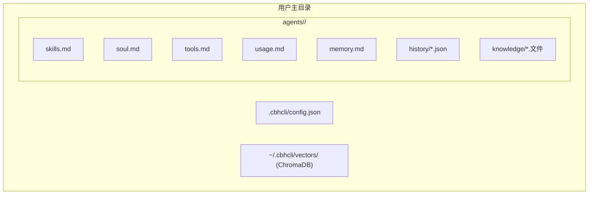
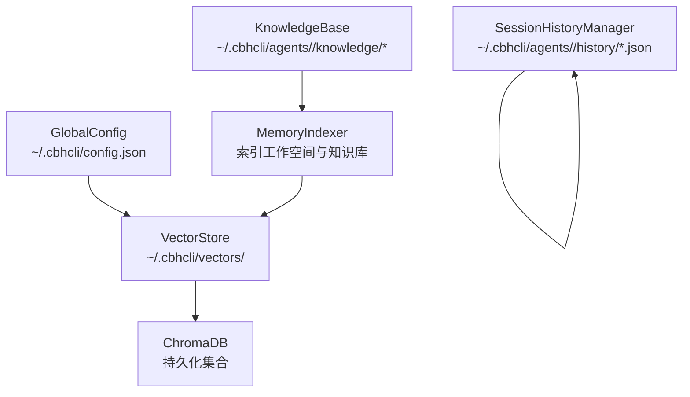
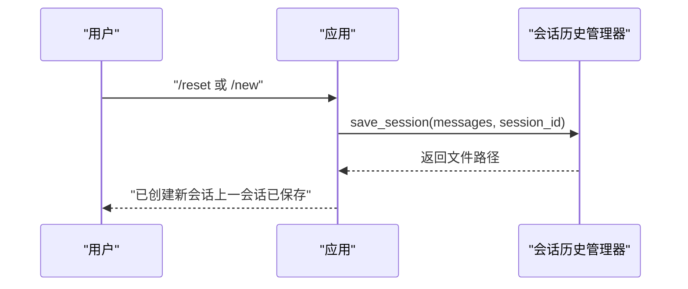
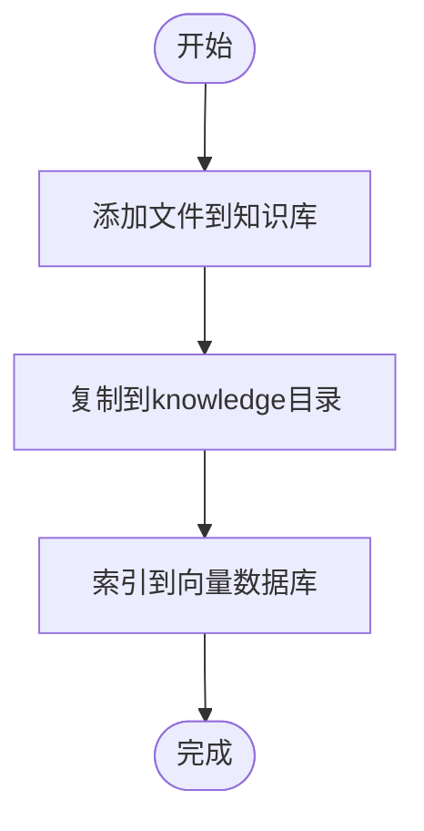
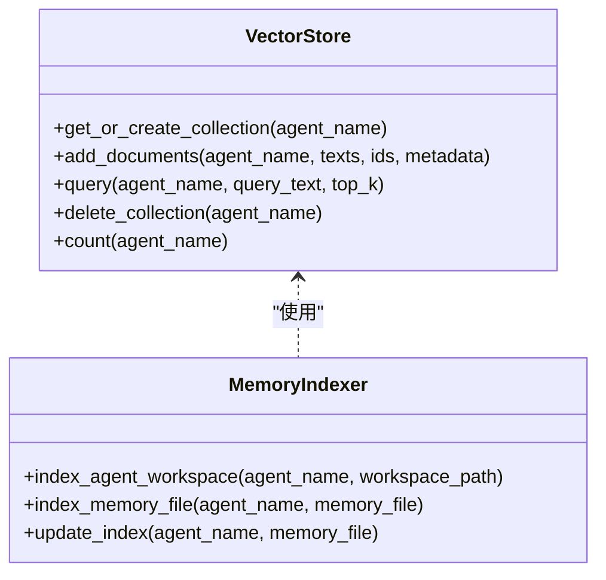
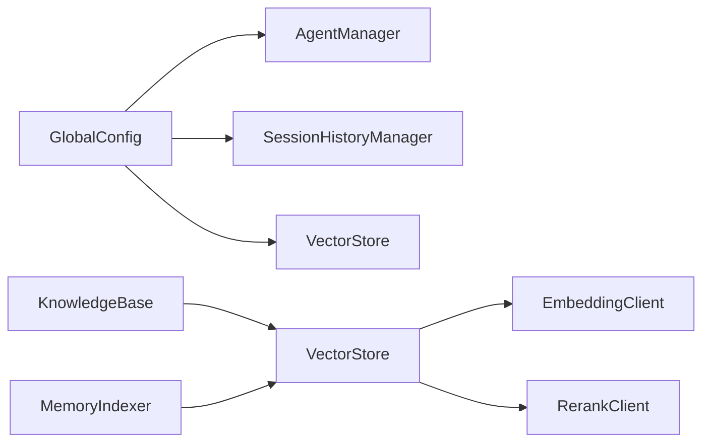

# 备份与恢复

<cite>
**本文引用的文件**   
- [README.md](file://README.md)
- [cbhcli_pkg/__main__.py](file://cbhcli_pkg/__main__.py)
- [cbhcli_pkg/cli.py](file://cbhcli_pkg/cli.py)
- [cbhcli_pkg/config/global_config.py](file://cbhcli_pkg/config/global_config.py)
- [cbhcli_pkg/core/app.py](file://cbhcli_pkg/core/app.py)
- [cbhcli_pkg/core/session_history.py](file://cbhcli_pkg/core/session_history.py)
- [cbhcli_pkg/core/knowledge_base.py](file://cbhcli_pkg/core/knowledge_base.py)
- [cbhcli_pkg/vector/store.py](file://cbhcli_pkg/vector/store.py)
- [cbhcli_pkg/vector/indexer.py](file://cbhcli_pkg/vector/indexer.py)
- [cbhcli_pkg/core/embedding_client.py](file://cbhcli_pkg/core/embedding_client.py)
- [cbhcli_pkg/core/rerank_client.py](file://cbhcli_pkg/core/rerank_client.py)
- [cbhcli_pkg/commands/session_cmd.py](file://cbhcli_pkg/commands/session_cmd.py)
- [cbhcli_pkg/commands/kb_cmd.py](file://cbhcli_pkg/commands/kb_cmd.py)
</cite>

## 目录
1. [简介](#简介)
2. [项目结构](#项目结构)
3. [核心组件](#核心组件)
4. [架构总览](#架构总览)
5. [详细组件分析](#详细组件分析)
6. [依赖分析](#依赖分析)
7. [性能考虑](#性能考虑)
8. [故障排查指南](#故障排查指南)
9. [结论](#结论)
10. [附录](#附录)

## 简介
本指南面向CBHCLI用户与运维人员，提供一套完整的备份与恢复策略，涵盖以下方面：
- 数据备份策略：配置文件、会话历史、知识库数据、向量数据库
- 备份频率与保留策略：全量、增量、差异备份的适用场景与建议
- 存储方案：本地、云存储、异地备份的配置要点
- 验证与测试：备份完整性与可用性验证流程
- 灾难恢复：数据恢复、系统重建、业务连续性保障
- 自动化：备份脚本编写、定时任务与监控
- 恢复测试最佳实践：验证方法与常见问题

## 项目结构
CBHCLI的数据主要分布在以下位置：
- 全局配置：~/.cbhcli/config.json
- Agent工作空间：~/.cbhcli/agents/<agent_name>/
  - 标准文件：skills.md、soul.md、tools.md、usage.md、memory.md
  - 会话历史：history/ 目录下的JSON文件
  - 知识库：knowledge/ 目录下的文件
- 向量数据库：~/.cbhcli/vectors/（ChromaDB持久化目录）

**图表来源**
- [README.md:150-206](file://README.md#L150-L206)
- [cbhcli_pkg/config/global_config.py:8-11](file://cbhcli_pkg/config/global_config.py#L8-L11)
- [cbhcli_pkg/core/session_history.py:16-22](file://cbhcli_pkg/core/session_history.py#L16-L22)
- [cbhcli_pkg/core/knowledge_base.py:28](file://cbhcli_pkg/core/knowledge_base.py#L28)
- [cbhcli_pkg/vector/store.py:55-56](file://cbhcli_pkg/vector/store.py#L55-L56)

**章节来源**
- [README.md:150-206](file://README.md#L150-L206)
- [cbhcli_pkg/config/global_config.py:8-11](file://cbhcli_pkg/config/global_config.py#L8-L11)
- [cbhcli_pkg/core/session_history.py:16-22](file://cbhcli_pkg/core/session_history.py#L16-L22)
- [cbhcli_pkg/core/knowledge_base.py:28](file://cbhcli_pkg/core/knowledge_base.py#L28)
- [cbhcli_pkg/vector/store.py:55-56](file://cbhcli_pkg/vector/store.py#L55-L56)

## 核心组件
- 全局配置管理：负责全局配置的加载、默认值与保存，决定工作空间基座与嵌入/重排序模型配置。
- 会话历史管理：负责将对话上下文序列化为JSON文件，支持列表、加载与删除。
- 知识库管理：负责将文件复制到知识库目录并索引到向量数据库；支持重新索引与统计。
- 向量存储与索引器：封装ChromaDB，提供集合管理、文档增删、查询与计数；索引器负责将Agent工作空间与知识库内容索引到向量数据库。
- 嵌入与重排序客户端：提供外部嵌入与重排序服务的统一接口，供向量存储与检索使用。

**章节来源**
- [cbhcli_pkg/config/global_config.py:13-154](file://cbhcli_pkg/config/global_config.py#L13-L154)
- [cbhcli_pkg/core/session_history.py:8-136](file://cbhcli_pkg/core/session_history.py#L8-L136)
- [cbhcli_pkg/core/knowledge_base.py:7-207](file://cbhcli_pkg/core/knowledge_base.py#L7-L207)
- [cbhcli_pkg/vector/store.py:37-175](file://cbhcli_pkg/vector/store.py#L37-L175)
- [cbhcli_pkg/vector/indexer.py:7-178](file://cbhcli_pkg/vector/indexer.py#L7-L178)
- [cbhcli_pkg/core/embedding_client.py:6-132](file://cbhcli_pkg/core/embedding_client.py#L6-L132)
- [cbhcli_pkg/core/rerank_client.py:6-123](file://cbhcli_pkg/core/rerank_client.py#L6-L123)

## 架构总览
CBHCLI的备份与恢复涉及以下数据流：
- 配置文件：由全局配置模块读写，位于用户主目录。
- 会话历史：由会话历史管理器在Agent工作空间的history目录下生成JSON文件。
- 知识库：由知识库管理器复制文件到knowledge目录，并通过索引器与向量存储写入ChromaDB。
- 向量数据库：ChromaDB持久化目录，包含各Agent集合。

**图表来源**
- [cbhcli_pkg/config/global_config.py:13-54](file://cbhcli_pkg/config/global_config.py#L13-L54)
- [cbhcli_pkg/core/session_history.py:24-64](file://cbhcli_pkg/core/session_history.py#L24-L64)
- [cbhcli_pkg/core/knowledge_base.py:31-74](file://cbhcli_pkg/core/knowledge_base.py#L31-L74)
- [cbhcli_pkg/vector/indexer.py:37-69](file://cbhcli_pkg/vector/indexer.py#L37-L69)
- [cbhcli_pkg/vector/store.py:64-97](file://cbhcli_pkg/vector/store.py#L64-L97)

## 详细组件分析

### 配置文件备份策略
- 备份对象：~/.cbhcli/config.json
- 备份内容：模型配置、嵌入/重排序模型配置、Agent默认与活动Agent、工作空间基座、自动压缩设置等。
- 备份方式：全量备份即可，配置文件体积小、变更频率低。
- 频率建议：每日全量或每工作日增量；结合版本控制（如git）记录变更。
- 保留策略：至少保留最近30天全量，按月归档近一年的快照。
- 存储方案：本地+云存储+异地备份；云存储建议开启版本控制与加密。
- 验证流程：恢复后启动应用，检查模型、Agent、设置项是否一致；执行基础命令确认功能正常。
- 恢复流程：停止应用，替换config.json，启动应用并校验。

**章节来源**
- [cbhcli_pkg/config/global_config.py:13-54](file://cbhcli_pkg/config/global_config.py#L13-L54)
- [README.md:150-190](file://README.md#L150-L190)

### 会话历史备份策略
- 备份对象：~/.cbhcli/agents/<agent>/history/*.json
- 备份内容：按时间戳命名的会话JSON文件，包含消息列表、标题、消息数等元数据。
- 备份方式：全量备份；会话文件通常较小，适合整体打包。
- 频率建议：每日全量；若会话频繁，可考虑每4-6小时增量（基于文件mtime）。
- 保留策略：按月清理旧会话；保留最近3个月的完整历史。
- 存储方案：本地+云存储；云存储开启生命周期策略自动归档。
- 验证流程：随机抽取若干会话文件，使用恢复后的应用加载并对比消息数与首条用户消息标题。
- 恢复流程：停止应用，将history目录内容恢复到对应Agent工作空间；启动应用后使用/resume验证。

**图表来源**
- [cbhcli_pkg/core/session_history.py:24-64](file://cbhcli_pkg/core/session_history.py#L24-L64)
- [cbhcli_pkg/commands/session_cmd.py:8-31](file://cbhcli_pkg/commands/session_cmd.py#L8-L31)

**章节来源**
- [cbhcli_pkg/core/session_history.py:8-136](file://cbhcli_pkg/core/session_history.py#L8-L136)
- [cbhcli_pkg/commands/session_cmd.py:33-94](file://cbhcli_pkg/commands/session_cmd.py#L33-L94)

### 知识库数据备份策略
- 备份对象：~/.cbhcli/agents/<agent>/knowledge/*.文件
- 备份内容：知识库目录下的所有文件（含重名处理后的文件名）。
- 备份方式：全量备份；支持增量（基于文件mtime）。
- 频率建议：每日全量；知识库更新不频繁时可每周增量。
- 保留策略：保留最近3个月的全量；更早的采用归档策略。
- 存储方案：本地+云存储；对敏感文件启用加密。
- 验证流程：恢复后执行/kb status与/kb list，核对文件数与向量文档数；进行一次检索验证。
- 恢复流程：停止应用，将knowledge目录恢复到对应Agent工作空间；必要时执行/kb reindex重建索引。

**图表来源**
- [cbhcli_pkg/core/knowledge_base.py:31-74](file://cbhcli_pkg/core/knowledge_base.py#L31-L74)
- [cbhcli_pkg/core/knowledge_base.py:151-207](file://cbhcli_pkg/core/knowledge_base.py#L151-L207)

**章节来源**
- [cbhcli_pkg/core/knowledge_base.py:7-207](file://cbhcli_pkg/core/knowledge_base.py#L7-L207)
- [cbhcli_pkg/commands/kb_cmd.py:57-144](file://cbhcli_pkg/commands/kb_cmd.py#L57-L144)

### 向量数据库备份策略
- 备份对象：~/.cbhcli/vectors/（ChromaDB持久化目录）
- 备份内容：ChromaDB集合（每个Agent一个集合），包含文档、元数据与嵌入向量。
- 备份方式：全量备份；ChromaDB支持持久化目录直接打包。
- 频率建议：每日全量；若索引更新频繁，可每4小时增量（基于目录mtime）。
- 保留策略：保留最近30天全量；月度归档。
- 存储方案：本地+云存储+异地备份；云存储开启版本控制。
- 验证流程：恢复后启动应用，执行/embedding status与向量查询；比对检索结果一致性。
- 恢复流程：停止应用，替换vectors目录；启动应用后执行/embedding reindex确保索引一致性。

**图表来源**
- [cbhcli_pkg/vector/store.py:37-175](file://cbhcli_pkg/vector/store.py#L37-L175)
- [cbhcli_pkg/vector/indexer.py:7-178](file://cbhcli_pkg/vector/indexer.py#L7-L178)

**章节来源**
- [cbhcli_pkg/vector/store.py:37-175](file://cbhcli_pkg/vector/store.py#L37-L175)
- [cbhcli_pkg/vector/indexer.py:7-178](file://cbhcli_pkg/vector/indexer.py#L7-L178)

### 备份频率与保留策略
- 全量备份：配置文件、知识库、向量数据库目录，建议每日执行。
- 增量备份：针对会话历史与知识库文件，基于mtime的差异备份，建议每4-6小时执行。
- 差异备份：适用于大规模向量数据库，需结合ChromaDB特性评估；若无法实现，优先采用全量+时间点快照。
- 保留策略：短期（7-30天）、中期（3-12个月）、长期（1年以上）分级归档，结合成本与合规要求。

**章节来源**
- [cbhcli_pkg/core/session_history.py:66-97](file://cbhcli_pkg/core/session_history.py#L66-L97)
- [cbhcli_pkg/core/knowledge_base.py:103-122](file://cbhcli_pkg/core/knowledge_base.py#L103-L122)
- [cbhcli_pkg/vector/store.py:55-56](file://cbhcli_pkg/vector/store.py#L55-L56)

### 备份存储方案
- 本地存储：使用rsync或tar定期备份至本地磁盘阵列，建议RAID保护。
- 云存储：对象存储（如S3、OSS）开启版本控制与生命周期策略；传输与静态加密。
- 异地备份：跨地域同步，满足RPO/RTO目标；定期进行跨区域恢复演练。

**章节来源**
- [README.md:150-206](file://README.md#L150-L206)

### 备份验证与测试流程
- 配置验证：恢复config.json后启动应用，检查模型、Agent、设置项；执行/help确认命令可用。
- 会话验证：使用/resume列出历史会话，随机加载某次会话，核对消息数与首条用户消息标题。
- 知识库验证：/kb status与/kb list核对文件数；执行/kb reindex后再次核对向量文档数。
- 向量验证：/embedding status查看集合状态；执行一次检索，比对结果与预期。
- 自动化验证：编写脚本执行上述命令并输出报告，纳入CI/CD或运维巡检。

**章节来源**
- [cbhcli_pkg/commands/session_cmd.py:33-94](file://cbhcli_pkg/commands/session_cmd.py#L33-L94)
- [cbhcli_pkg/commands/kb_cmd.py:147-185](file://cbhcli_pkg/commands/kb_cmd.py#L147-L185)
- [cbhcli_pkg/vector/store.py:171-175](file://cbhcli_pkg/vector/store.py#L171-L175)

### 灾难恢复流程
- 数据恢复：按顺序恢复配置文件、知识库、向量数据库目录；重启应用。
- 系统重建：在新主机安装依赖（README可选依赖），恢复配置与数据，执行/kb reindex与/embedding reindex。
- 业务连续性：准备最小可用清单（配置、关键知识库、最近会话快照）；定期演练缩短RTO/RPO。

**章节来源**
- [README.md:31-61](file://README.md#L31-L61)
- [README.md:208-229](file://README.md#L208-L229)

### 备份自动化脚本与调度
- 脚本设计：分别针对配置、会话历史、知识库、向量数据库目录执行打包与上传；记录日志与校验和。
- 调度：使用cron或作业编排系统（如Airflow、Kubernetes CronJob）按策略执行。
- 监控：监控备份成功率、耗时、存储用量；告警异常与失败。

**章节来源**
- [README.md:31-61](file://README.md#L31-L61)

### 恢复测试最佳实践
- 定期抽样恢复：每月至少一次完整恢复演练。
- 场景覆盖：单点故障（配置/知识库/向量库）、跨区域故障、数据损坏恢复。
- 结果验证：自动化脚本输出报告，人工复核关键指标。
- 持续改进：根据演练反馈优化备份策略与恢复流程。

**章节来源**
- [cbhcli_pkg/commands/session_cmd.py:33-94](file://cbhcli_pkg/commands/session_cmd.py#L33-L94)
- [cbhcli_pkg/commands/kb_cmd.py:147-185](file://cbhcli_pkg/commands/kb_cmd.py#L147-L185)

## 依赖分析
- 配置依赖：全局配置影响工作空间基座与嵌入/重排序模型启用与否。
- 会话依赖：会话历史管理器依赖Agent工作空间路径。
- 知识库依赖：知识库管理器依赖向量存储与索引器；向量存储依赖嵌入客户端。
- 索引依赖：索引器依赖向量存储；向量存储依赖嵌入客户端；嵌入客户端依赖外部服务。

**图表来源**
- [cbhcli_pkg/config/global_config.py:73-154](file://cbhcli_pkg/config/global_config.py#L73-L154)
- [cbhcli_pkg/core/app.py:97-150](file://cbhcli_pkg/core/app.py#L97-L150)
- [cbhcli_pkg/core/knowledge_base.py:16-29](file://cbhcli_pkg/core/knowledge_base.py#L16-L29)
- [cbhcli_pkg/vector/indexer.py:28-35](file://cbhcli_pkg/vector/indexer.py#L28-L35)
- [cbhcli_pkg/core/embedding_client.py:15-32](file://cbhcli_pkg/core/embedding_client.py#L15-L32)
- [cbhcli_pkg/core/rerank_client.py:16-33](file://cbhcli_pkg/core/rerank_client.py#L16-L33)

**章节来源**
- [cbhcli_pkg/config/global_config.py:73-154](file://cbhcli_pkg/config/global_config.py#L73-L154)
- [cbhcli_pkg/core/app.py:97-150](file://cbhcli_pkg/core/app.py#L97-L150)
- [cbhcli_pkg/core/knowledge_base.py:16-29](file://cbhcli_pkg/core/knowledge_base.py#L16-L29)
- [cbhcli_pkg/vector/indexer.py:28-35](file://cbhcli_pkg/vector/indexer.py#L28-L35)
- [cbhcli_pkg/core/embedding_client.py:15-32](file://cbhcli_pkg/core/embedding_client.py#L15-L32)
- [cbhcli_pkg/core/rerank_client.py:16-33](file://cbhcli_pkg/core/rerank_client.py#L16-L33)

## 性能考虑
- 备份性能：对向量数据库进行全量备份时，建议在低峰时段执行；增量备份可减少IO压力。
- 恢复性能：恢复向量数据库后，优先执行轻量级检索验证，再逐步扩大验证范围。
- 存储成本：结合数据热温分层策略，降低长期归档成本。

## 故障排查指南
- 配置加载失败：检查config.json格式与权限；确认默认配置回退逻辑是否生效。
- 会话历史缺失：确认history目录存在且可写；检查会话保存触发条件。
- 知识库索引异常：检查嵌入模型配置与网络连通性；必要时执行/kb reindex。
- 向量查询异常：确认嵌入客户端可用；检查集合是否存在；执行/embedding reindex。

**章节来源**
- [cbhcli_pkg/config/global_config.py:20-29](file://cbhcli_pkg/config/global_config.py#L20-L29)
- [cbhcli_pkg/core/session_history.py:24-64](file://cbhcli_pkg/core/session_history.py#L24-L64)
- [cbhcli_pkg/core/knowledge_base.py:151-207](file://cbhcli_pkg/core/knowledge_base.py#L151-L207)
- [cbhcli_pkg/vector/store.py:64-97](file://cbhcli_pkg/vector/store.py#L64-L97)

## 结论
通过将配置文件、会话历史、知识库与向量数据库纳入统一的备份体系，并结合全量/增量策略、多级存储与自动化验证，CBHCLI可在保证数据安全的同时，实现快速恢复与业务连续性。建议将备份与恢复流程纳入日常运维与合规管理，持续优化策略与演练频次。

## 附录
- 快速定位路径
  - 全局配置：~/.cbhcli/config.json
  - Agent工作空间：~/.cbhcli/agents/<agent_name>/
  - 向量数据库：~/.cbhcli/vectors/

**章节来源**
- [README.md:150-206](file://README.md#L150-L206)