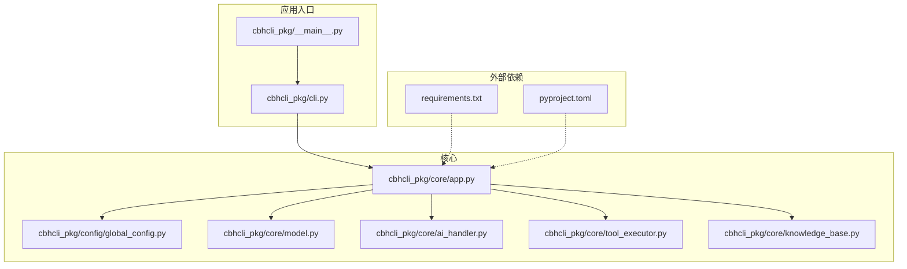
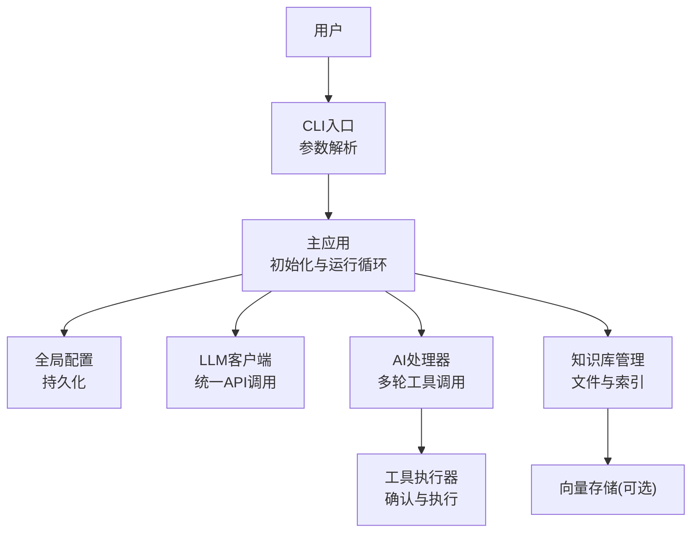
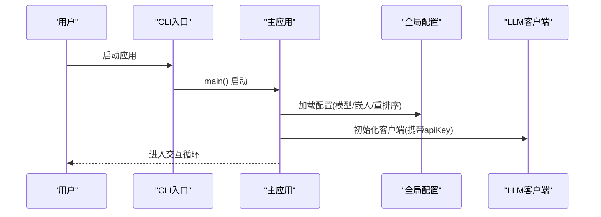
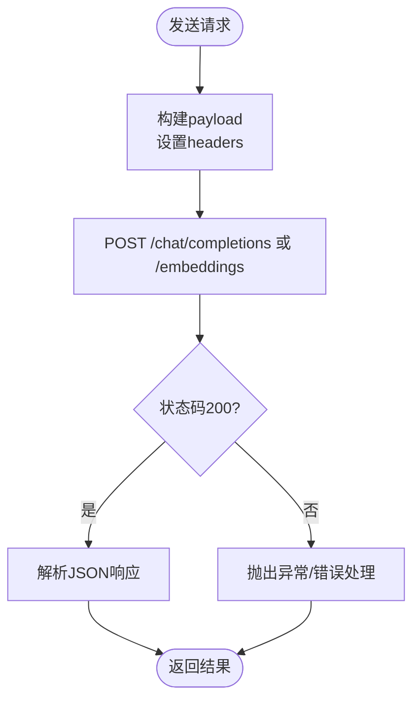
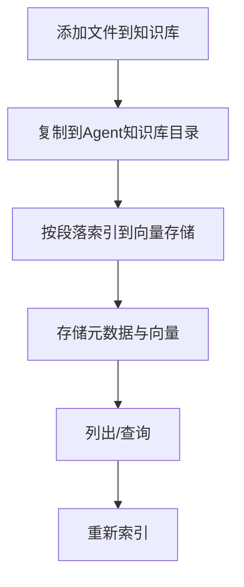
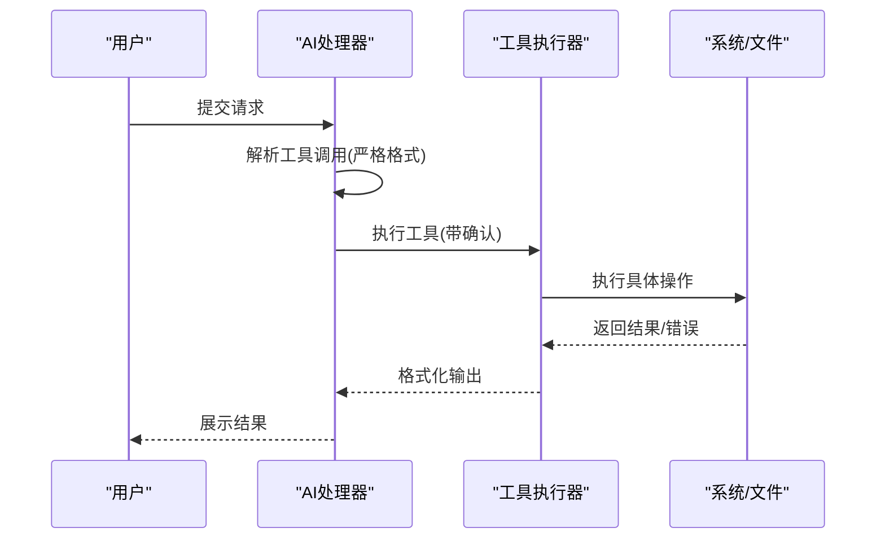
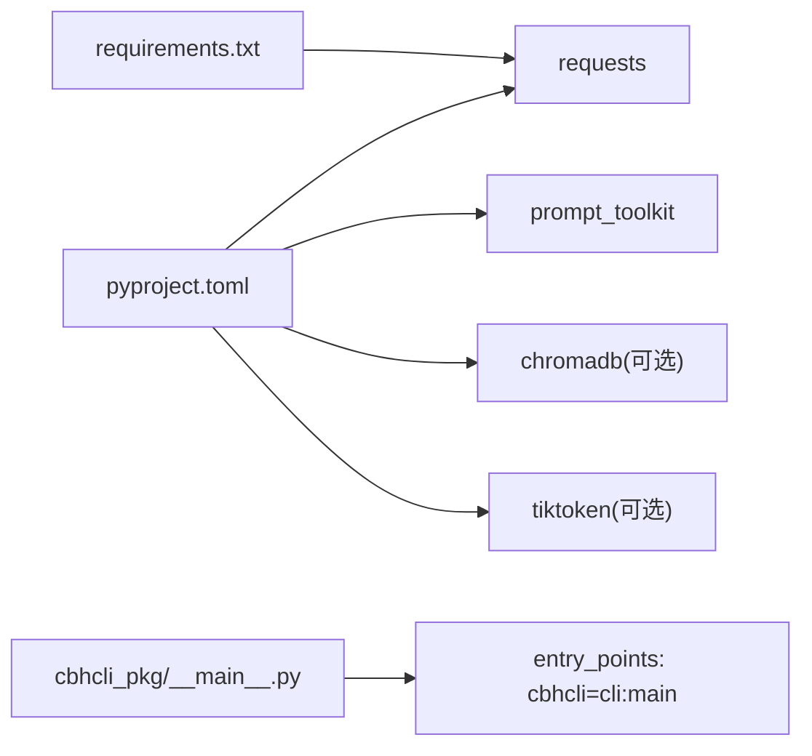

# 安全加固

<cite>
**本文引用的文件**
- [README.md](file://README.md)
- [install.sh](file://install.sh)
- [pyproject.toml](file://pyproject.toml)
- [requirements.txt](file://requirements.txt)
- [cbhcli_pkg/__main__.py](file://cbhcli_pkg/__main__.py)
- [cbhcli_pkg/cli.py](file://cbhcli_pkg/cli.py)
- [cbhcli_pkg/core/app.py](file://cbhcli_pkg/core/app.py)
- [cbhcli_pkg/config/global_config.py](file://cbhcli_pkg/config/global_config.py)
- [cbhcli_pkg/core/model.py](file://cbhcli_pkg/core/model.py)
- [cbhcli_pkg/core/knowledge_base.py](file://cbhcli_pkg/core/knowledge_base.py)
- [cbhcli_pkg/core/ai_handler.py](file://cbhcli_pkg/core/ai_handler.py)
- [cbhcli_pkg/core/tool_executor.py](file://cbhcli_pkg/core/tool_executor.py)
</cite>

## 目录
1. [简介](#简介)
2. [项目结构](#项目结构)
3. [核心组件](#核心组件)
4. [架构总览](#架构总览)
5. [详细组件分析](#详细组件分析)
6. [依赖分析](#依赖分析)
7. [性能考虑](#性能考虑)
8. [故障排查指南](#故障排查指南)
9. [结论](#结论)
10. [附录](#附录)

## 简介
本指南面向运维与安全团队，围绕CBHCLI的安全加固目标，系统梳理访问控制、网络安全、数据保护、安全审计与合规、威胁防护、容器与部署安全，并提供安全配置模板与最佳实践，帮助在生产环境中建立安全可靠的部署与运行环境。

## 项目结构
CBHCLI采用模块化设计，核心围绕“应用入口、配置管理、会话与AI处理、工具执行、知识库与向量检索”展开。整体结构清晰，便于在各层引入安全控制点。

**图示来源**
- [cbhcli_pkg/__main__.py:1-7](file://cbhcli_pkg/__main__.py#L1-L7)
- [cbhcli_pkg/cli.py:73-112](file://cbhcli_pkg/cli.py#L73-L112)
- [cbhcli_pkg/core/app.py:54-72](file://cbhcli_pkg/core/app.py#L54-L72)
- [cbhcli_pkg/config/global_config.py:13-19](file://cbhcli_pkg/config/global_config.py#L13-L19)
- [cbhcli_pkg/core/model.py:7-27](file://cbhcli_pkg/core/model.py#L7-L27)
- [cbhcli_pkg/core/ai_handler.py:21-50](file://cbhcli_pkg/core/ai_handler.py#L21-L50)
- [cbhcli_pkg/core/tool_executor.py:15-33](file://cbhcli_pkg/core/tool_executor.py#L15-L33)
- [cbhcli_pkg/core/knowledge_base.py:7-29](file://cbhcli_pkg/core/knowledge_base.py#L7-L29)
- [requirements.txt:1-7](file://requirements.txt#L1-L7)
- [pyproject.toml:26-30](file://pyproject.toml#L26-L30)

**章节来源**
- [README.md:269-295](file://README.md#L269-L295)
- [cbhcli_pkg/__main__.py:1-7](file://cbhcli_pkg/__main__.py#L1-L7)
- [cbhcli_pkg/cli.py:73-112](file://cbhcli_pkg/cli.py#L73-L112)
- [cbhcli_pkg/core/app.py:54-72](file://cbhcli_pkg/core/app.py#L54-L72)

## 核心组件
- 应用入口与参数解析：负责版本/帮助输出与主应用启动。
- 全局配置管理：集中管理模型、嵌入/重排序模型、Agent与设置，持久化到用户家目录配置文件。
- LLM客户端：封装统一API调用，携带认证头，支持非流式与流式响应。
- AI处理器：处理多轮工具调用、提取工具调用、执行工具并回写会话。
- 工具执行器：对工具调用进行确认、执行与结果展示，支持跳过确认与详细模式。
- 知识库管理：Agent专属知识库，支持文件增删、列举、索引与重索引。

**章节来源**
- [cbhcli_pkg/cli.py:73-112](file://cbhcli_pkg/cli.py#L73-L112)
- [cbhcli_pkg/config/global_config.py:13-154](file://cbhcli_pkg/config/global_config.py#L13-L154)
- [cbhcli_pkg/core/model.py:7-147](file://cbhcli_pkg/core/model.py#L7-L147)
- [cbhcli_pkg/core/ai_handler.py:21-743](file://cbhcli_pkg/core/ai_handler.py#L21-L743)
- [cbhcli_pkg/core/tool_executor.py:15-168](file://cbhcli_pkg/core/tool_executor.py#L15-L168)
- [cbhcli_pkg/core/knowledge_base.py:7-207](file://cbhcli_pkg/core/knowledge_base.py#L7-L207)

## 架构总览
CBHCLI的运行时安全关注点主要集中在“配置与密钥管理、API调用链路、工具执行与输出、知识库与向量数据”。

**图示来源**
- [cbhcli_pkg/cli.py:73-112](file://cbhcli_pkg/cli.py#L73-L112)
- [cbhcli_pkg/core/app.py:54-150](file://cbhcli_pkg/core/app.py#L54-L150)
- [cbhcli_pkg/config/global_config.py:50-90](file://cbhcli_pkg/config/global_config.py#L50-L90)
- [cbhcli_pkg/core/model.py:28-58](file://cbhcli_pkg/core/model.py#L28-L58)
- [cbhcli_pkg/core/ai_handler.py:51-97](file://cbhcli_pkg/core/ai_handler.py#L51-L97)
- [cbhcli_pkg/core/tool_executor.py:42-91](file://cbhcli_pkg/core/tool_executor.py#L42-L91)
- [cbhcli_pkg/core/knowledge_base.py:31-74](file://cbhcli_pkg/core/knowledge_base.py#L31-L74)

## 详细组件分析

### 访问控制与身份认证
- 用户身份：应用本身不内置登录/鉴权机制，用户通过命令行交互使用；建议在部署层面结合系统用户与进程权限控制。
- 权限管理：通过Agent工作空间隔离不同Agent的数据与配置；工具执行器支持交互式确认，减少误执行风险。
- API密钥管理：模型与嵌入/重排序模型配置均以明文形式存储于用户家目录配置文件中；建议配合文件系统权限与密钥管理服务加固。

**图示来源**
- [cbhcli_pkg/cli.py:73-112](file://cbhcli_pkg/cli.py#L73-L112)
- [cbhcli_pkg/core/app.py:73-84](file://cbhcli_pkg/core/app.py#L73-L84)
- [cbhcli_pkg/config/global_config.py:20-48](file://cbhcli_pkg/config/global_config.py#L20-L48)
- [cbhcli_pkg/core/model.py:10-26](file://cbhcli_pkg/core/model.py#L10-L26)

**章节来源**
- [cbhcli_pkg/core/app.py:204-230](file://cbhcli_pkg/core/app.py#L204-L230)
- [cbhcli_pkg/core/tool_executor.py:122-140](file://cbhcli_pkg/core/tool_executor.py#L122-L140)
- [cbhcli_pkg/config/global_config.py:56-90](file://cbhcli_pkg/config/global_config.py#L56-L90)

### 网络安全配置
- 出站通信：LLM客户端通过HTTP(S)发起API请求，使用统一的Authorization头与Content-Type；建议在网络边界实施出站代理与TLS校验。
- 依赖与可选组件：向量数据库与Token计数依赖为可选，按需安装；建议在受限网络中通过私有镜像与离线包部署。

**图示来源**
- [cbhcli_pkg/core/model.py:28-58](file://cbhcli_pkg/core/model.py#L28-L58)
- [cbhcli_pkg/core/model.py:121-147](file://cbhcli_pkg/core/model.py#L121-L147)

**章节来源**
- [cbhcli_pkg/core/model.py:7-147](file://cbhcli_pkg/core/model.py#L7-L147)
- [requirements.txt:1-7](file://requirements.txt#L1-L7)
- [pyproject.toml:26-38](file://pyproject.toml#L26-L38)

### 数据保护
- 敏感数据存储：配置文件包含API Key等敏感信息，应限制文件系统权限；建议结合密钥管理服务或加密存储。
- 数据脱敏：AI处理器在多轮工具调用中会清理工具调用代码块，保留解释性文本，降低敏感信息泄露面。
- 隐私保护：知识库文件复制到Agent专属目录，结合Agent工作空间隔离；向量索引仅针对允许的文本类型。

**图示来源**
- [cbhcli_pkg/core/knowledge_base.py:31-74](file://cbhcli_pkg/core/knowledge_base.py#L31-L74)
- [cbhcli_pkg/core/knowledge_base.py:151-207](file://cbhcli_pkg/core/knowledge_base.py#L151-L207)

**章节来源**
- [cbhcli_pkg/core/knowledge_base.py:7-207](file://cbhcli_pkg/core/knowledge_base.py#L7-L207)
- [cbhcli_pkg/core/ai_handler.py:218-262](file://cbhcli_pkg/core/ai_handler.py#L218-L262)

### 安全审计与合规
- 日志审计：应用未内置集中式日志记录；建议在部署层面对进程输出与系统日志进行采集与归档。
- 安全扫描：建议在CI/CD中集成依赖漏洞扫描与静态分析；对可选依赖（向量/Token计数）按需启用。
- 合规报告：通过最小权限原则与文件系统权限控制，结合审计日志形成合规证据链。

**章节来源**
- [install.sh:1-29](file://install.sh#L1-L29)
- [pyproject.toml:32-42](file://pyproject.toml#L32-L42)

### 威胁防护策略
- 恶意攻击检测：AI处理器对工具调用格式进行严格解析，避免误执行；工具执行器支持交互确认，降低误操作风险。
- 异常行为监控：通过上下文压缩阈值与Token计数器，监控会话规模异常；建议在部署层面对进程资源使用进行告警。
- 安全事件响应：工具执行器对失败结果进行标准化输出；建议在部署层面对异常退出与错误输出进行捕获与上报。

**图示来源**
- [cbhcli_pkg/core/ai_handler.py:264-298](file://cbhcli_pkg/core/ai_handler.py#L264-L298)
- [cbhcli_pkg/core/tool_executor.py:54-91](file://cbhcli_pkg/core/tool_executor.py#L54-L91)

**章节来源**
- [cbhcli_pkg/core/ai_handler.py:21-743](file://cbhcli_pkg/core/ai_handler.py#L21-L743)
- [cbhcli_pkg/core/tool_executor.py:15-168](file://cbhcli_pkg/core/tool_executor.py#L15-L168)

### 容器与部署安全
- 镜像安全：建议基于最小基础镜像构建，固定Python版本与依赖；禁用不必要的包与权限。
- 运行时保护：以非root用户运行，限制写权限；挂载只读配置卷与临时卷分离。
- 配置加固：将API Key与敏感配置放入密钥管理服务或只读挂载；通过环境注入或密文卷管理。

**章节来源**
- [pyproject.toml:13-25](file://pyproject.toml#L13-L25)
- [requirements.txt:1-7](file://requirements.txt#L1-L7)

## 依赖分析
- 核心依赖：requests、prompt_toolkit；可选依赖：chromadb、tiktoken。
- 构建与脚本：setuptools构建后提供cbhcli命令入口。

**图示来源**
- [pyproject.toml:26-45](file://pyproject.toml#L26-L45)
- [requirements.txt:2-6](file://requirements.txt#L2-L6)
- [cbhcli_pkg/__main__.py:1-7](file://cbhcli_pkg/__main__.py#L1-L7)

**章节来源**
- [pyproject.toml:1-53](file://pyproject.toml#L1-L53)
- [requirements.txt:1-7](file://requirements.txt#L1-L7)
- [cbhcli_pkg/__main__.py:1-7](file://cbhcli_pkg/__main__.py#L1-L7)

## 性能考虑
- API调用超时与流式响应：LLM客户端设置合理超时，流式输出提升交互体验。
- Token计数与上下文压缩：通过上下文窗口与压缩比控制，避免超出模型上下文限制。
- 向量索引策略：知识库与嵌入索引按需触发，减少不必要的API调用与磁盘IO。

**章节来源**
- [cbhcli_pkg/core/model.py:28-58](file://cbhcli_pkg/core/model.py#L28-L58)
- [cbhcli_pkg/core/app.py:361-385](file://cbhcli_pkg/core/app.py#L361-L385)

## 故障排查指南
- 安装问题：检查Python与pip版本，确保安装脚本可正常执行。
- 配置问题：确认配置文件路径与权限，核对模型/嵌入/重排序配置项。
- API错误：检查Authorization头与Base URL，确认网络可达与证书有效。
- 工具执行失败：查看工具执行器输出，确认参数与权限；必要时关闭确认模式定位问题。

**章节来源**
- [install.sh:9-29](file://install.sh#L9-L29)
- [cbhcli_pkg/config/global_config.py:20-29](file://cbhcli_pkg/config/global_config.py#L20-L29)
- [cbhcli_pkg/core/model.py:53-54](file://cbhcli_pkg/core/model.py#L53-L54)
- [cbhcli_pkg/core/tool_executor.py:122-140](file://cbhcli_pkg/core/tool_executor.py#L122-L140)

## 结论
CBHCLI在架构上具备良好的模块化与可扩展性，安全加固的关键在于：在配置与密钥管理上强化文件系统权限与密钥服务集成，在网络通信上实施TLS与出站策略，在数据处理上加强工具调用格式验证与输出清理，在部署上落实最小权限与只读配置。通过上述措施，可在保证功能完整性的同时显著提升系统的安全性与合规性。

## 附录

### 安全配置模板与最佳实践
- 配置文件权限
  - 位置：用户家目录下的配置文件
  - 建议：仅属主可读写，禁止组与其他访问
- API密钥管理
  - 建议：使用密钥管理服务或环境注入，避免硬编码
  - 建议：定期轮换，最小权限授权
- 网络与通信
  - 建议：启用TLS，校验证书；必要时通过代理访问
  - 建议：限制出站域名与端口
- 工具执行
  - 建议：开启交互确认，谨慎使用“全部跳过确认”
  - 建议：限制工具能力与参数范围
- 知识库与向量数据
  - 建议：仅索引受信任的文本类型
  - 建议：定期清理与审计索引内容
- 容器与部署
  - 建议：非root运行，只读根文件系统
  - 建议：最小化依赖，定期镜像扫描
- 日志与审计
  - 建议：采集进程输出与系统日志，保留至少90天
  - 建议：对敏感字段进行脱敏处理